# 1. 선형회귀: 입력과 출력의 선형 관계를 찾는 방법

## 1. 선형회귀(Linear Regression)

### 선형회귀란?
- 입력 변수와 출력 변수 사이의 관계를 **직선 형태로 근사**하여, 예측하는 통계적 방법
- 지도학습의 가장 **기초가 되는 접근** 중 하나
- 단순해 보이지만, 선형회귀는 **개념적으로도, 실무적으로도** 매우 유용

  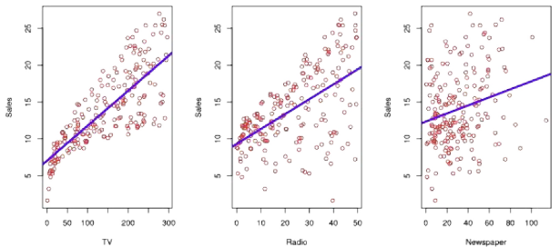

## 2. 광고데이터 예시

### 선형회귀를 통해 대답할 수 있는 질문들
- 광고비와 매출 사이에 관계가 있는가?
- 그 관계의 강도는 어느 정도인가?
- 어떤 매체가 매출에 기여하는가?
- 미래 매출을 얼마나 정확히 예측할 수 있는가?
- 매체 간에 상호작용(시너지)가 있는가?

  

# 2. 단순선형회귀: 하나의 입력 변수로 출력 예측하기

## 1. 단순선형회귀: 단일 설명변수를 이용한 선형회귀

### 단순선형회귀(simple linear regression)란?
- 한 개의 설명변수(X)와 하나의 반응변수(Y) 사이의 선형(직선) 관계를 찾는 방법
- 목표: 데이터를 가장 잘 설명하는 직선을 찾아 예측(ŷ)에 활용
- 단일 설명변수를 이용한 단순선형회귀
  - 모형 가정: Y = β_0 + β_1X + ε
    - β_0 : 절편 (X = 0일 때 Y 값)
    - β_1 : 기울기 (X가 1 단위 증가할 때 Y의 평균 증가량)
    - ε : 관측 오차
  - hat 표기는 추정값을 의미

  

## 2. 최소제곱법(least squares)

### 최소제곱법(least squares)이란?
- **실제 관측값과 예측값의 차이**(잔차, residual)를 제곱해 합한 값(RSS, **잔차제곱합**)을 최소화하는 방법
- 목표: 데이터를 가장 잘 설명하는 직선을 찾기 위해 계수 β_0 + β_1을 추정
- 잔차(residual) 정의: e_i = y_i - ŷ_i (예측값 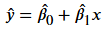)
- RSS(잔차제곱합) 정의: RSS = e_1 ** 2 + e_2 ** 2 + ... + e_n ** 2
- 다른 표현 RSS = 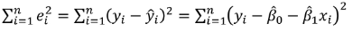
- 계수를 측정하기 위한 공식: closed-form solution(공식으로 바로 계산할 수 있는 해) 존재함

  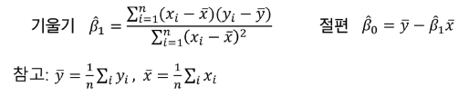

## 3. 단순선형회귀: 광고 데이터

### 사례 설명
- 목표: TV 광고비(X)과 제품 판매량(Y)의 선형 관계 예측
- 단순선형회귀를 적용하여 각 데이터에서 잔차제곱을 가장 작게 만드는 직선(최소제곱법)이 선택됨

  

- 도형의 의미
  - 파란 직선: 최소제곱법으로 계산한 회귀선
  - 빨간 점: 실제 관측 데이터
  - 회색 세로선(빨간 점에서 파란 선까지) = 잔차(residual)
  - RSS(잔차제곱합)를 최소화할 대, 최적 결정됨
- 수식
  
  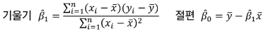

### 단순선형회귀 결과 해석 (광고 데이터)  
- 계수 해석
  - 절편(Intercept) = 7.03 -> TV 광고비가 0이어도 기본적으로 평균 판매량은 7.03백만원
  - TV 광고비 개수 = 00475 -> TV 광고비를 1단위(1백만원) 늘리면 평균 매출이 약 0.0475x1단위(1백만원) = 4.72만원 증가

    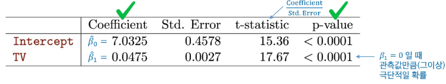

- 유의성 검정
  - 계수의 p-value < 0.0001 (매우 작음, <<0.05)이므로 통계적으로 매우 유의 -> **TV 광고비와 매출 간 관계 존재**

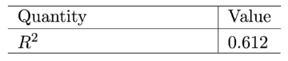

- 모형 적합도(R ** 2 높을 수록, 1에 가까울 수록 좋음)
  - R ** 2 -> 판매량 변동의 약 61%를 광고비로 설명 가능

# 3. 다중선형회귀: 여러 입력 변수를 활용한 예측

## 1. 다중선형회귀(multiple linear regression)란?

### 단순선형회귀와 다중선형회귀
- 단순 선형 회귀: "TV 광고 -> 매출" 한 가지 관계만 고려
- 다중 선형 회귀: "TV 광고, Radio 광고비, 가격, 계절, 경쟁사" 등 복수 요인을 함께 고려하여 매출을 설명

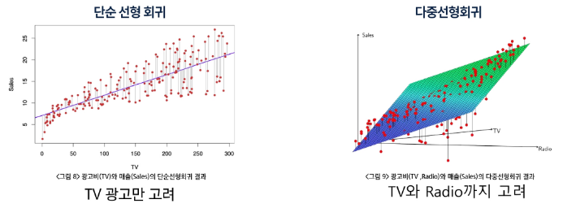

### 다중선형회귀의 개념
- 독립 변수(설명 변수, Feature)가 여러 개 존재할 때 사용하는 회귀 분석 기법
- 단순 선형 회귀는 하나의 변수만 고려하지만, 다중 선형 회귀는 여러 독립 변수(X_1, X_2, ...)를 동시에 고려하여 종족 변수(Y)와의 관계를 구함

  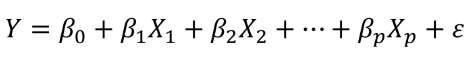

### 각 변수의 의미
- Y: 종속 변수 (예측 대상, 예: 매출)
- X_1, X_2, X_3, ..., X_p: p개의 독립 변수들 (예: 광고비, 가격, 계절 등)
- β_0: 절편
- β_1, β_2, β_3, ..., β_p: 각 독립 변수에 대한 회귀 계수(모수, 변수의 영향력 크기와 방향을 나타냄)
- ε: 관측 오차 (모델이 설명하지 못 하는 부분, 오류/잔차가 아님)

  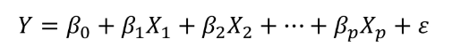

  - 해석: **다른 변수를 고정한 채** X_j가 1 단위 증가할 때 Y가 평균적으로 β_j만큼 변화
  - 광고 데이터 예: sales = β_0 + β_1 * TV + β_2 * radio + β_3 * newspaper

## 2. 다중선형회귀의 추정과 예측

### 다중선형회귀: 계수 추정과 예측
- 여러 변수(x_i1, x_i2, ..., x_ip)로 반응 변수 Y를 동시에 예측하는 모형
- 예측값: 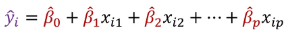
- 추정 방법: 실제 값과 예측 값의 차이(잔차, e_i = y_i - ŷ_i)를 제곱해 합한 값(RSS)를 최소화
- RSS가 최소일 때 얻어지는 계수 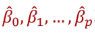가 최적 추정치

  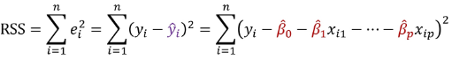

  - 여러 입력 변수를 동시에 고려하여 데이터와 가장 가까운 평면(hyperplane)을 찾는 과정

## 3. 다중선형회귀 계수 추정 유도(행렬 표현)

### 다중선형회귀: 계수 추정의 수학적 유도
- 행렬 표현

  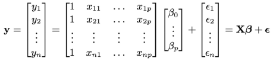

- 최소제곱법 목적: RSS 최소화

  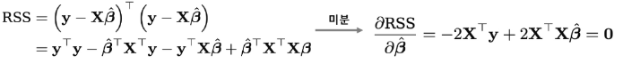

  - RSS가 가장 작아지는 계수를 찾기 위해, 함수의 기울기=0인 지점을 찾는 과정
- 정규방정식 해

  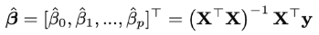

## 4. 다중선형회귀 결과: 시각화

  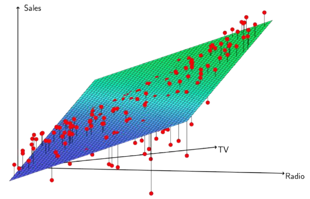

## 5. 다중선형회귀 결과: 광고 데이터

### 다중선형회귀 결과 해석 (광고 데이터)
- TV, 라디오 광고비는 매출 증가에 유의미한 관계를 갖음(각 p-value들이 매우 낮음 << 0.05)
- 신문 광고비는 통계적으로 유의하지 않음(p-value = 0.8599 > 0.05) -> 매출과 관계가 거의 없음

  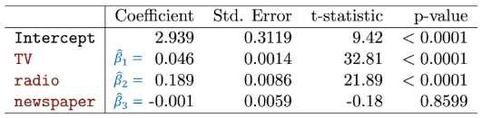

- 모형 적합도(R ** 2 높을 수록, 1에 가까울 수록 좋음)

  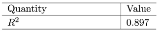

- 결정계수 R ** 2 = 0.897 : 모델 설명력이 매우 높음 -> 단순선형회귀 결과와 비교하였을 때 향상된 예측

# 4. 선형회귀 주의사항: 변수 상관(다중공선성), 상관과 인과 구분

## 1. 검증/테스트셋 데이터를 활용한 성능 평가

### 선형회귀 결과 검증 및 테스트 성능
- 훈련 데이터에서의 성능
  - 회귀식을 만들 때 최소제곱 해는 훈련 데이터만 보고 계산됨
  - 학습에 사용된 훈련 데이터에서는(X과 Y의 평균적인 선형관계가 있다면) 적합(fitting)이 잘 되어 있을 것임.
  - 그러나 이것은 테스트 성능을 과소평가할 가능성이 높음
- 테스트 성능 평가 필요
  - 선형회귀도 변일반화 성능을 확인하려면 훈련에 사용되지 않은 새로운(테스트) 데이터에 적용해 봐야 함
  - 수가 많거나 고차항을 사용하면 **과적합(overfitting) 문제**가 여전히 발생할 수 있음.
  - 검증/교차검증을 통해 적절한 적합을 찾을 수 있음

## 2. 다중선형회귀시 회귀계수 해석의 주의점

### 선형회귀를 통해 대답할 수 있는 질문들
- 이상적 상황: 변수들이 연관(correlation)되지 않고, 독립적을 때 -> 계수 해석이 명확함
- 문제 상황: 변수들이 서로 연관되어 있다면 -> 계수 추정이 불안정해지고 해석에 혼동이 발생할 수 있음
- 주의: 관찰 데이터의 상관관계로 인과 관계를 주장해서는 안 됨
  - 예로 들었던, 광고 데이터는 자연스럽게 인과성이 있는 것처럼 보이지만, 다른 많은 데이터에서 선형 관계를 보인다고 해서 인과 관계가 있는 것이 아님
  - 예: "아이스크림 소비량"(X) vs "상어에 물리는 사건"(Y)
  
---
# 1. 분류(Classification)

## 1. 분류란?

### 분류의 정의
- 분류: 정해진 범주(카테고리) 중 하나로 지정하는 것
- 범주형 변수: 수치의 크고 작음이 아니라 유한한 범주(성별, 혈액형, 지역 등)로 표현하는 변수
  - 예: 눈동자 색 {black, brown, blue, green}, 이메일 종류 {spam, normal}

### 분류 함수의 목표
- 입력 (X, 특성 벡터) : 눈동자 이미지, 이메일 내용/제목
- 출력 (Y ∈ C, 범주) : 예, 눈동자 색 C = {black, brown, blue, green}, 이메일 C = {spam, normal}, 순서 없는 집합
- 분류 함수의 목표
  - 분류 함수 f(X)를 학습하여 입력 X가 속할 범주(카테고리)를 예측
  - 범주의 직접 예측보다 각 범주에 속할 확률 P(Y = k | X)를 추정하는 것이 더 유용할 때가 많음

## 2. 예시: 신용카드 연체(Default)

### 신용카드 사용량 및 소득에 대한 연체 여부 산점도
- 신용카드 사용량(Balance) - 소득(Income) 산점도에 연체(Default) 여부를 색상(주황색 vs 파란색) 및 부호(+ vs O)로 구분
- 신용카드 사용량과 소득은 각각 독립변수, 연체 여부가 종속 변수

### 신용카드 사용량-소득 산점도 해석
- 연체자(주황색 +)는 신용카드 사용량이 높은 구간에 집중적으로 분포
- 연체가 없는 사람(파란색 O)은 신용카드 사용량이 낮은 쪽에 주로 분포
- 소득은 연체 여부와 뚜렷한 상관이 보이지 않음

  

### 그룹별 분포(Boxplot)
- 신용카드 사용량(Balance), 소득(Income)에 대해 연체(Default)의 그룹별 분포(Boxplot)
- 신용카드 사용량과 소득은 각각 독립변수, 연체 여부가 종속 변수

### 그룹별 분포 해석
- 신용카드 사용량(Balance) vs 연체(Default)
  - 연체자의 신용카드 사용량이 연체하지 않은 사람보다 전반적으로 높음
  - 중앙값도 높고, 분포가 퍼져 있는 정도도 더 큼
- 소득(Income) vs 연체(Default)
  - 연체 여부에 따른 소득 차이는 거의 없음
  - 중앙값이 약간 다르지만 분포가 대부분 겹침

  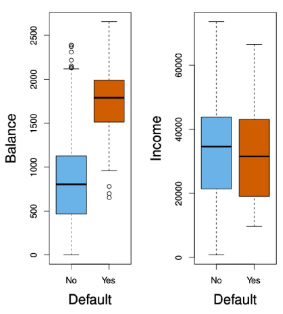

## 3. 분류 모델에서 선형 회귀의 한계

### 선형회귀는 분류 문제에 사용하기에 부적절함: 이진 분류 문제
- 선형회귀는 선형함수를 계산하는 문제로 예측 값이 (Y값 기준) 제한된 값을 갖게 못 함
- 따라서 선형회귀는 **예측 확률이 0보다 작거나 1보다 크게 예측**될 수 있어 확률로 쓰기 **부적절**
  - 예: 응급실 환자 진단 {0: 비응급, 1: 응급}
  - 선형회귀는 확률 범위(0~1)를 벗어나는 값을 내놓을 수 있어 문제 발생

    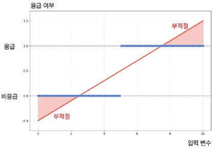

### 다중 범주 분류 문제
- 선형회귀는 정수형 코딩(1, 2, 3)에 따라 범주 간 순서와 동일한 거리를 가정
- 범주(카테고리) 변수는 순서가 없는 라벨이므로 **부적절**
  - 예: 응급실 환자 진단 {1: 뇌졸증, 2: 약물과다복용, 3: 간질발작}
  - 실제로는 범주 간 순서나 거리가 존재하지 않음

    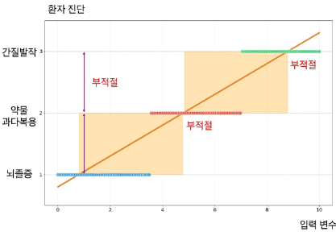

- 따라서, 선형회귀는 분류 문제에 부적절함

## 4. 분류 문제에서 적합한 모델

### 분류 문제에서 선형회귀의 대안 - 로지스틱 회귀(Logistic Regression)
- 시그모이드(Sigmoid) 함수를 활용해 0~1 범위 내 확률값 예측 보장
- 순서가 없는 범주를 확률로 직접 예측하는 적절한 분류 방법

  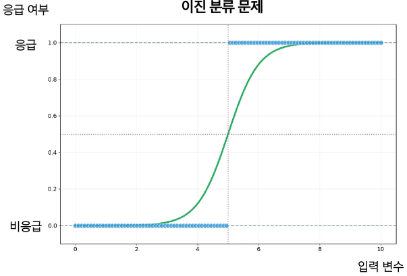

# 2. 로지스틱 회귀(Logistic Regression)

## 1. 로지스틱(Logistic) 회귀의 모형식

### 이진 분류에서의 적절한 함수
- **함수의 출력 범위**가 모든 입력에 대해 **0~1 사이의 범위를 가지는 함수**를 활용하자

### 출력 범위가 0~1인 시그모이드(Sigmoid) 함수
- 기울어진 S자 형태의 곡선 함수

  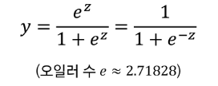

- 모든 실수 z에 대한 y값의 범위는 0 <= y <= 1이다.

  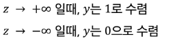

  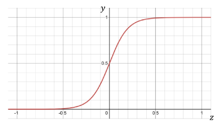

### 로지스틱 회귀(Logistic Regression)의 모형식
- 시그모이드(Sigmoid) 함수 y = e^z / (1 + e^z)의 z에 (Linear Regression) 식 z = β_0 + β_1 * x 식을 대입하면,

  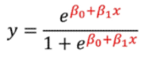

- 확률 표기 p(x)를 활용한다면, 로지스틱 회귀의 모형식이 된다.

  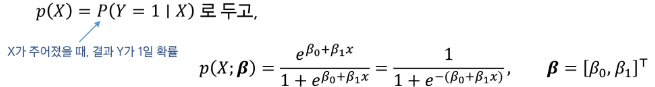

  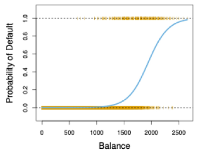

## 2. 로지스틱 회귀 모형 vs 선형 모형

### 로지스틱 함수와 선형회귀의 관계
- **로지스틱 함수** p(x;β) = e^(β_0 + β_1 * x) / 1 + e^(β_0 + β_1 * x)는 선형 함수 y = β_0 + β_1 * x 를 내포하고 있다.
- 이 두 함수 간의 관계를 해석하기 위해 오즈(Odds)와 **로짓 변환**(logit)에 대해 알아보자

### 오즈(Odds)
- 오즈(Odds)란, 성공(y = 1)확률이 실패(y = 0)확률에 비해 몇 배 더 높은 가를 나타낸다.

  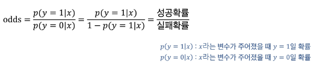

### 로짓 변환(logit) = Log odds
- 로짓변환은 오즈(Odds)에 log를 취한 함수 형태

  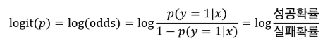

### 로지스틱 함수와 선형회귀의 관계
- 로지스틱 함수 모형식 p(y = 1|x) = p(x;**β**) = 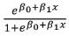에 로짓 변환을 수행해보자

  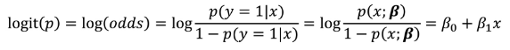

- 즉, **로지스틱 모형**식은 **선형** 모형식과 **시그모이드(sigmoid) 함수의 결합**이며, **로짓 변환**시 **선형** 회귀 모형식으로 표현이 가능하다

  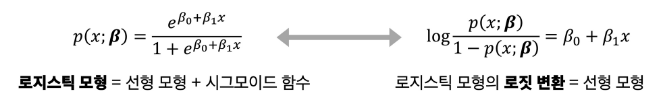

## 3. MLE 활용 모수 추정

### 우도(Likelihood)
- 확률을 추정하는 모델을 결정했으니, 모수(β_0, β_1)를 추정하는 방법에 대해 알아보자.
- 선형회귀에서 "현재 함수가 데이터와 오차가 작은지"를 평가하기 위해 평균 제곱 오차(MSE; Mean Squired Error)를 지표로 삼았듯, 확률을 계산하는 함수를 평가하기 위해선 우도(Likelihood)를 지표로 삼는다.
- 우도란 "**현재 확률 함수가 데이터를 얼마나 잘 설명하는지**"를 나타낸 지표이다. 
그러므로, 모델의 학습은 우도 값을 높여 최대화가 되도록 하는 것이 목표이며 이를 **Maximum Likelihood Estimation (MLE)** 이라 한다.

### 로지스틱 회귀의 우도 최대화
- 로지스틱 회귀와 같은 이진 분류 문제에서 우도를 최대화한다.

  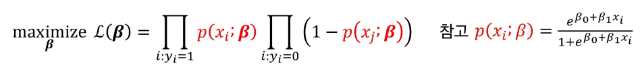

- 하지만, 위와 같은 곱으로 이뤄진 함수의 경우, β에 대해 미분이 어렵기 때문에 **양 변에 log를 취해 곱셈을 더하기로 변환**시킨 뒤 **log-likelihood**를 만들어 최대화한다.

  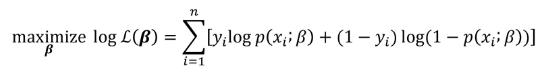

### log-likelihood로 변형하여 최대화하는 β를 구해도 되는가?
- 로지스틱 회귀에서 우도(likewliwood)를 최대화하는 것인데, log 변환을 한 log-likelihood를 최대화하는 것으로 변형하여 문제를 접근해도 과연 괜찮을까?
- Log함수는 단조(monotone) 증가 함수임.
- 따라서, log-likelihood를 최대화하는 β와 likelihood를 최대화하는 β는 같다.

  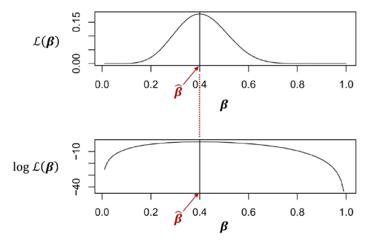

- log **L**(β)를 미분하여 **도함수=0**에 근접하도록 수치적(반복) 최적화를 통해 β들을 찾아 나간다.

## 4. 로지스틱 회귀 결과: 신용카드 연체 데이터

### 신용카드 연체 데이터 결과 해석
- 신용카드 사용량(Balance)과 연체 여부(Default)로 로지스틱 회귀 모형을 학습한 결과

  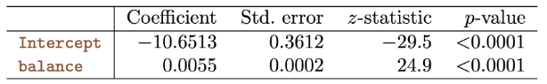

- 추정 결과 β^_1 = 0.0055
  - 즉 신용카드 사용량(Balance)이 1 단위 증가할 때 연체(Default)의 로짓(log-odds)가 0.0055 증가

    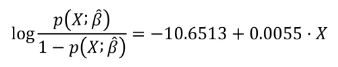
    
    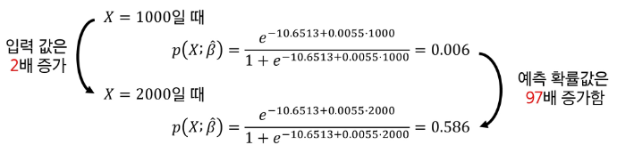

- 신용타드 사용량 이외에도 다양한 입력(소득, 학생 여부 등)을 추가하여 여러 변수 X_1, ..., X_p를 함께 모형에 사용하면 회귀 계수를 통해 연체할 확률을 계산할 수 있음.

  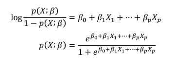

  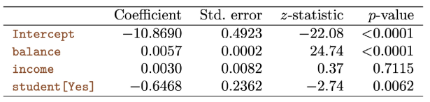

---
# 1. 모수적 함수로서의 선형 모델

## 1. 단순(1D) 선형모델: 모수적 함수

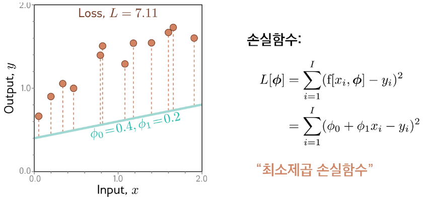

## 2. 단순(1D) 선형모델 학습

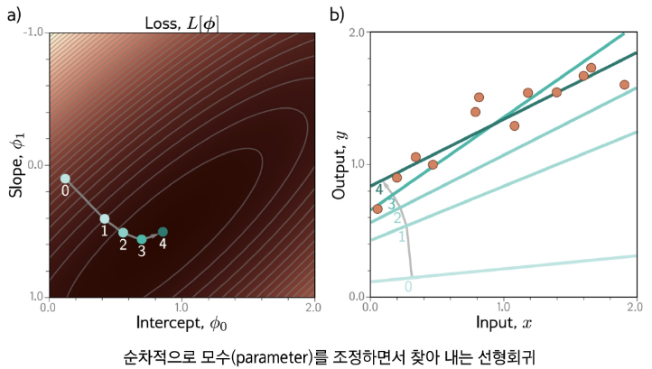

# 2. Shallow 네트워크

## 1. Shallow 네트워크 vs 1D 선형회귀

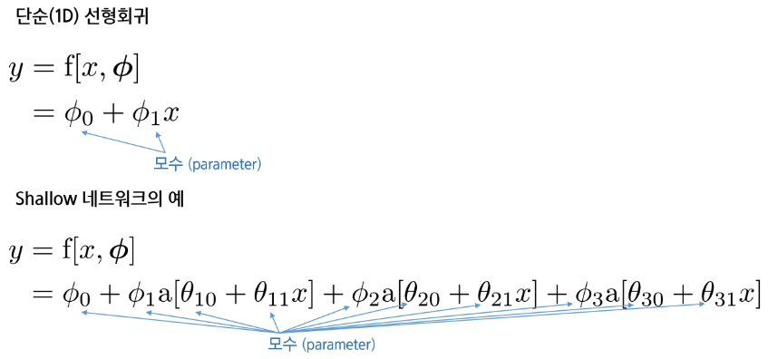

## 2. Shallow 네트워크: 활성화 함수

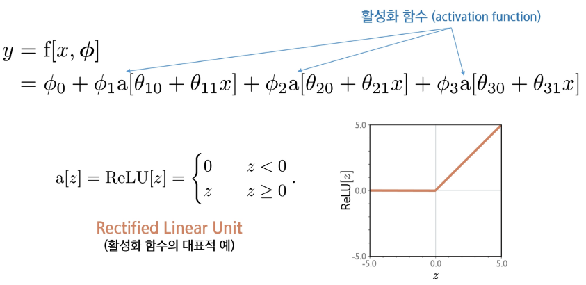

## 3. Shallow 네트워크: 모수(parameter)

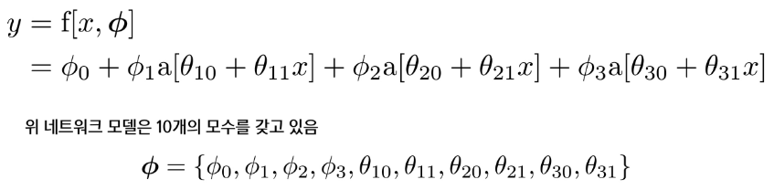

- 모수(Φ)가 정해지면 특정 함수(f[x, Φ])가 결정된다.
- 모수가 주어지면 추론(식을 계산, 예측)할 수 있다.
- 훈련데이터 {(x_i, y_i)}, t = 1 ~ I 가 주어지면 **손실함수**(예, least squares)를 정의하고 손실을 최소화하도록 모수를 조정한다.

## 4. Shallow 네트워크: piecewise linear 함수
- 입력 구간을 나눠 **조각별 선형** 함수를 만듦

  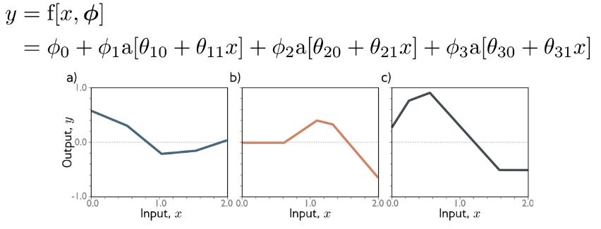

  - 다른 모수(Φ)에 따라서 달라지는 함수(f[x, Φ])들의 예 a), b), c)

## 5. Shallow 네트워크: Hidden Units

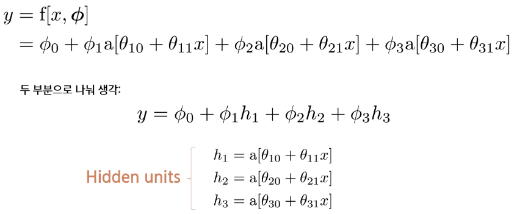

## 6. Shallow 네트워크: 각 단계별 계산

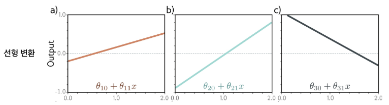

## 7. 네트워크 도식화

# 3. Shallow 네트워크의 표현력

## 1. 더 많은 Hidden Unit 가능

## 2. Hidden Unit을 많이 두면

## 3. 보편적 근사 정리(Universal approximation theorem)

# 4. 다중 출력/입력

## 1. 2개 출력의 네트워크

## 2. 2개 입력의 네트워크

## 3. 2개 입력 네트워크: 단계별 계산

## 4. 2개 입력: From Input to Output

## 5. 임의의 개수의 입력, Hidden Unit, 출력

# 5. Deep Network

## 1. 2개의 네트워크를 하나로 합성

## 2. 합성 네트워크의 층(layer)별 출력

## 3. "접기" 비유

## 4. Shallow 네트워크와 Deep 네트워크 비교

## 5. 2D Input: 2개의 네트워크를 하나로 합성

# 6. Deep 네트워크 수식 표현

## 1. 2개의 네트워크를 하나로 합성: 복잡한 수식

## 2. 2개의 네트워크를 하나로 합성: 새로운 변수 활용

## 3. 2층 네트워크의 표현: 네트웥크를 합성 함수로 봄

## 4. 2층 네트워크: 단계별 계산

## 5. 용어의 단순화: 벡터 및 행렬 표현

## 6. 네트워크 도식화

---
# 1. 선형회귀 예시

## 1. 손실함수

### 손실함수
- 학습 데이터셋: input/output의 I개 쌍
  - 학습 데이터셋 표기: 
- 손실함수(Loss function): 모델이 얼마나 잘못 예측하는지를 측정하는 함수
  - 값이 작을 수록 모델이 더 정확하게 학습되었다는 의미

  

## 2. 학습

### 손실함수
- 학습: 손실함수를 최소화하는 파라미터를 찾음

## 3. 1D 선형회귀 예

### 1D 선형회귀 예
- 선형회귀 모델에서 손실함수는 예측값과 실제값의 차이를 제곱하여 합산한 값(최소제곱 손실함수, MSE)
- 학습의 목적은 이 손실함수를 **최소화하는 직선**을 찾는 것
- 손실함수 정의(최소 제곱 손실함수)

  

## 4. 1D 선형회귀 학습

### 선형회귀 학습
- 등고선(왼쪽 그림): 손실 함수 값의 크기
  - 밝을 수록 손실이 큼
  - 어두울 수록 손실이 적음

    

- 데이터와 선형함수 직선(초록색 선): 데이터와 선의 오차가 크다면 손실 값이 큼
  - 주황색 점: 실제 데이터
  - 초록색 직선: 현재 파라미터로 만든 모델

    

### 경사 하강법(gradient descent)
- 손실 함수의 값이 줄어드는 방향으로 파라미터를 이동하는 과정

# 2. 수학 리뷰

## 1. 미분을 이용한 최적화

### 미분을 통한 기울기 이해
- 이차 함수로, 그래프는 위로 열린 포물선
- 미분 결과(2x - 4)는 기울기를 의미
  - 기울기가 0이 되는 지점이 극값(최솟값)

    

# 3. 경사하강(Gradient Descent)

## 1. 경사 하강법

### 경사 하강(Gradient descent) 알고리즘
- 경사 하강법은 손실 함수 L[Φ]를 최소화하기 위해 파라미터 Φ를 반복적으로 갱신하는 알고리즘
- 기울기 계산: 손실 함수 L[Φ]를 파라미터 Φ에 대해 편미분(각 원소에 대한 미분) 진행
  - 벡터 형태의 기울기

    

- 파라미터 업데이트
  - 기울기(미분값)의 **반대 방향**으로 이동해야 손실 함수가 줄어듬

    

  - 여기서 α ≥ 0 는 학습률(learning rate)로, 한 번의 스텝에서 이동하는 크기를 결정

### 손실 함수의 기울기 계산
- 경사 하강법의 첫 단계: 편미분(전체 손실에 대한 기울기) 구하기
  - 손실 함수: 여기서 l_i는 각 데이터 샘플 i의 손실 값

    

  - 전체 손실 L[Φ]은 모든 데이터 샘플 손실 l_i의 합
  - 전체 기울기는 각 데이터의 기울기를 합한 것

    

## 2. 경사 하강법: 단계별 계산

### 경사 하강법의 단계별 계산
- 경사 하강법의 첫 단계: 미분값 구하기

  

  - 손실 함수 L[Φ]의 미분을 계산: 각 데이터 손실 l_i에 대한 편미분의 합으로 표현

    

- 두 번째 단계: 파라미터 업데이트
  - 미분값의 방향의 반대 방향으로 이동(손실 최소화)

    

### 경사 하강법을 활용한 파라미터 업데이트

### 경사 하강법을 활용한 파라미터 업데이트

## 3. 한 눈으로 보는 경사 하강법

### 경사 하강법의 과정
1. 데이터
2. 손실 함수 3D 그래프
3. 손실 함수 등고선(2D)
4. 선형함수의 업데이트

## 4. 함수에 따른 최적화 난이도

### Convex vs Non-convex 최적화 문제
- Convex: 곡선이 항상 U자처럼 아래로 볼록. 그래프 위 임의 두 점을 잇는 직선이 그래프 위(또는 같은 위치)로 있음.
- Non-convex: 봉우리, 골짜기, 오목한 구간이 섞인 모양. 두 점을 이은 직선이 그래프 아래로 내려가는 구간이 생김.

  

- 손실 함수 모양에 따라 최적화의 난이도가 달라짐
  - Convex 문제: **전역(global) 최솟값이 유일**함 -> 최적화가 쉬움
  - Non-Convex 문제: **여러 개의 지역(local) 최솟값** 또는 **새들(saddle)점**이 있음 -> 최적화가 어려움

# 4. 확률적 경사 하강법(Stochastic Gradient Descent)

## 1. 경사 하강법 vs 확률적 경사 하강법

### 경사 하강법의 단점
- Non-convex 문제에서 **지역(local) 최소점에 빠지기 쉬움**
  - 그림: 점(1, 2, 3)과 경로는 경사 하강법으로 Loss를 줄여가는 과정
  - 점 2에서 출발한 경사하강 방법은 local 최소점에 빠짐

- 매 스텝마다 **전체 데이터에 대한 미분값을 구하여 업데이트**함. 스텝별 계산양이 많음

### 대안: 전체 데이터를 한 번에 쓰는 대신, **무작위로 선택한 데이터 샘플** 사용
- **확률적 경사 하강법**(Stochastic Gradient Decsent, **SGD**)

## 2. 확률적 경사 하강법의 개념

### 업데이트 방식의 차이점
- 경사 하강법(Gradient Descent)
  - **전체 데이터셋을 사용**하여 기울기를 계산(미분)하고 파라미터 업데이트

    

- 확률적 경사 하강법(SGD Mini-batch 버전)
  - **무작위 확률로 샘플**된 일부 데이터(batch)만 사용하여 기울기 계산

    

## 3. 확률적 경사 하강법 결과 예시

### 전체 데이터(경사 하강법) vs 확률적 샘플 데이터를 활용한 확률적 경사 하강법 실행 차이

## 4. 확률적 경사 하강법의 특성

### 확률적 경사 하강법(SGD)의 특성
- 무작위 샘플 데이터를 활용한 미분으로 경로의 무작위성이 있음

  

- Local 최소점에서 빠질 위험이 상대적으로 적음

  

- 국소 최솟값
  - 전체 데이터가 아닌 일부 배치로 기울기를 계산하기 때문에 노이즈가 섞여 있음
  - 노이즈가 오히러 local minima, saddle point에서 빠져나오는 데 도움이 됨
- 노이즈가 있지만 여전히 타당한 업데이트
  - 미니 배치의 기울기는 정확한 전체 기울기가 아니지만, 평균적으로 올바른 방향 가리킴
  - 학습이 점진적 최적점 방향으로 수렴
- 계산 비용 절감
  - 전체 데이터셋에서 작은 배치만 사용하므로 반복(스텝)당 연산량이 적음
  - 큰 데이터셋에서 효율적으로 학습 가능
- 수렴 특성
  - full batch처럼 매끄럽게 수렴하지 않고, 무작위성 때문에 더 많이 진동(jitter, 지그재그)하면서 움직임
  - 전역 최솟값 근처의 좋은 해에 도달할 수 있음. Convex 문제에서는 full-batch 경사하강보다 수렴이 늦을 수 있음

# 5. 역전파(Backpropagation)

## 1. 네트워크 파라미터의 미분

### 네트워크 파라미터의 미분값을 어떻게 구할까?
- Layer별로 파라미터들이 존재함. 서로 영향을 미침.

  

  

  

- 네트워크는 합성함수임

## 2. 합성함수의 미분: 연쇄법칙

### 연쇄법칙
- 파라미터는 Ω를 갖는 합성 함수를 미분하면?

  

- 핵심 아이디어: 합성함수의 변화율 = 바깥의 변화율 X 안쪽의 변화율

  

- 해석:
  - f_1의 **입력(=f_0)에 대한 기울기**를 구한 뒤
  - 그 값을 f_0의 **파라미터 Ω에 대한 기울기**와 곱한다.
  - x는 파라미터가 아니므로 δy/δx는 여기서 필요 없음. 

## 3. 역전파(Backpropagation)

### 역전파란?
- 출력 오차를 기준으로 **그래프를 거꾸로** 따라가며 **연쇄법칙**으로 각 노드(파라미터 포함)의 미분값을 계산하는 절차

