# 1. 워드 임베딩

## 1. 원-핫 인코딩

### 원 핫 인코딩이란?
- 규칙 기반 혹은 통계적 자연어처리 연구의 대다수는 단어를 원자적(쪼갤 수 없는) 기호로 취급 
예: *hotel, conferencem walk* 같은 단어들
- 벡터 공간 관점에서 보면, 이는 **한 원소만 1이고 나머지는 모두 0인 벡터**를 의미
  - [0 0 0 0 0 0 0 0 0 0 0 0 0 0 1 0 0 0 0 0]
- 차원 수(=단어 사전 크기)는 대략 다음과 같다:
  - 음성 데이터(2만) - Penn Treebank(PTB) 코퍼스(5만) - big vocab(50만) - Google 1T(1300만)
- 이를 **원-핫(one-hot) 표현**이라고 부르고, 단어를 원-핫 표현으로 바꾸는 과정을 **원-핫 인코딩(one-hot encoding)** 이라고 한다.

### 원 핫 인코딩의 문제점
- 예시: 웹 검색
  - [삼성 노트북 배터리 사이즈] == [삼성 노트북 배터리 용량]
  - [갤럭시 핸드폰] == [갤럭시 스마트폰]

    

- 검색 쿼리 벡터와 대상이 되는 문서 벡터들이 서로 **직교**하게 되어, 원-핫 벡터로는 유사도를 측정할 수 없다.
- 원-핫 인코딩과 같은 전통적인 텍스트 표현 방식에는 여러 한계가 존재
  1. 차원의 저주(Curse of Dimensionality)
    - 고차원의 희소 벡터를 다루기 위해선 많은 메모리가 필요하다.
    - 차원이 커질 수록 데이터가 점점 더 희소(sparse)해져 활용이 어렵다.

      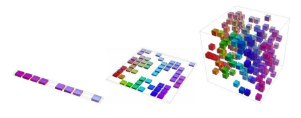

  2. 의미적 정보 부족
    - 비슷한 단어라도 유사한 벡터로 표현되지 않는다.
    - 예시: "은행"과 "금융"은 의미적으로 밀접하지만, 원-핫 인코딩에서는 전혀 무관한 벡터로 취급

## 2. 워드 임베딩

### 주변 단어들을 활용해보기
- 단어를 주변 단어들로 표현하면, 많은 의미를 담을 수 있다.
  - *"You shall know a word by the company it keeps"* (distributional hypothesis)
- 현대 통계적 자연어처리에서의 가장 성공적인 아이디어 중 하나이다.

  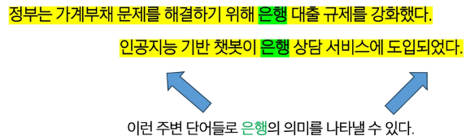

### 워드 임베딩이란?
- 단어를 단어들 사이의 의미적 관계를 포착할 수 있는 **밀집(dense)되고 연속적/분산적(distributed) 벡터 표현으로 나타내는 방법**이다.
  - 원-핫 인코딩에선 은행과 금융이 완전히 독립적인(무관한) 벡터로 표현되었지만,
  - 워드 임베딩에선 두 단어의 벡터가 공간상 서로 가깝게 위치하며, 이를 통해 의미적 유사성을 반영할 수 있다.

    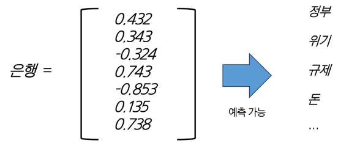

### 대표적인 워드 임베딩 기법 - Word2Vec
- Word2Vec은 2013년 Google에서 개발한 워드 임베딩 기법
- 단어의 표현을 **간단한 인공 신경망**을 이용해 학습

  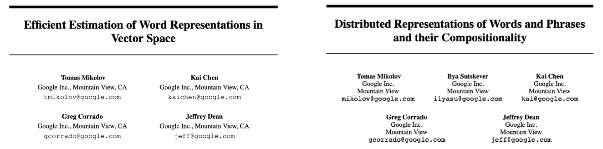

### Word2Vec의 아이디어
- Word2Vec의 아이디어는 **각 단어와 그 주변 단어들 간의 관계를 예측한다는 것**이다.
- Word2Vec엔 두 가지 알고리즘이 존재
  - Skip-grams (SG) 방식
    - 중심 단어를 통해 주변 단어들을 예측하는 방법
    - 단어의 위치(앞/뒤)에 크게 구애받지 않는다.
  - Continuous Bag of Words (CBOW) 방식
    - 주변 단어들을 통해 중심 단어를 예측하는 방법
    - 문맥 단어들의 집합으로 중심 단어를 맞춘다.

### Skip-grams (SG): 중심 단어를 통해 주변 단어 예측하기
- 윈도우 크기(window size) = 중심 단어 주변 몇 개 단어를 문맥으로 볼 것인가?
- 예시 (윈도우 크기 = 2)
  - 문장: "... problems turning into **banking** crises as ..."
  - 중심 단어 "banking" (위치 t)
  - 주변 단어 = {"turning", "into", "crises", "as"}

    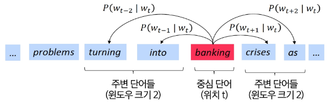

### Continuous Bag of Words (CBOW): 주변 단어를 통해 중심 단어 예측하기

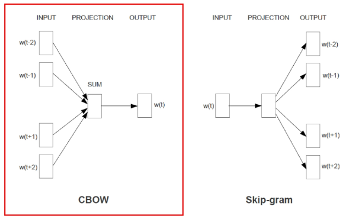

- 목표: 주변 단어들의 집합이 주어졌을 때, 그 문맥과 함께 등장할 수 있는 단일 단어를 예측

  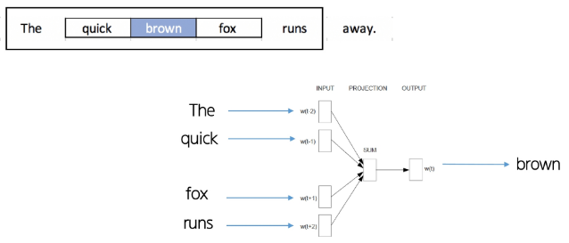

### Skip-Gram vs. CBOW

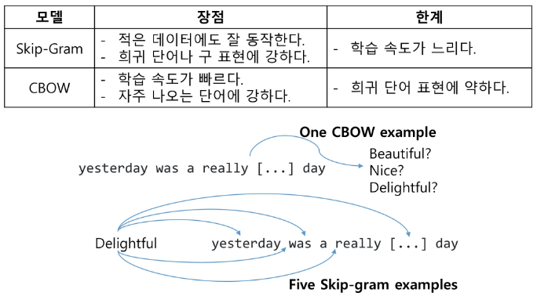

# 2. 순차적 데이터

### 순차적 데이터란 무엇일까?
- 자연엔 수많은 순차적 데이터(Sequential Data)가 존재
- 순차적 데이터란 **데이터가 입력되는 순서와 이 순서를 통해 입력되는 데이터들 사이의 관계**가 중요한 데이터
- 예시
  - 오디오

    

  - 텍스트

    

  - 비디오

    

### 순차적 데이터의 특징
- 순차적 데이터는 다른 데이터와 구별되는 특징들이 존재
- 특징
  1. 순서가 중요
    - 데이터의 순서가 바뀌면 이미가 달라짐.
    - 예시: 나는 너를 사랑해 ≠ 너는 나를 사랑해
  2. 장기 의존성(Long-term dependency)
    - 멀리 떨어진 과거의 정보가 현재/미래에 영향을 준다.
    - 예시: "여러 개의 문 중 파란 문을 열고 안으로 들어가면, 너는 (?)를 찾게 될 거야."
  3. 가변 길이(Variable length)
    - 순차 데이터는 길이가 일정하지 않고, 단어 수도 제각각이다.

### 순차적 데이터를 처리하려면?
- 따라서, 순차적 데이터를 처리하려면 일반적인 모델들(예: 선형 회귀, MLP 등)로는 불가능
- **Sequential Models**이 필요하다.
  - 예시: RNN, LSTM, Transformer 등등

    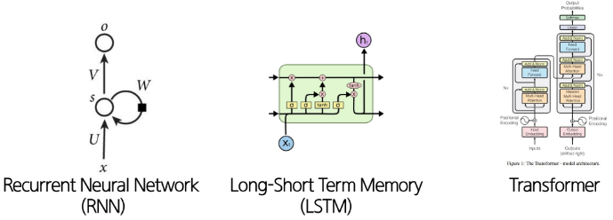

# 3. RNN

### 전통적인 인공신경망
- 전통적인 인공신경망(MLP, CNN)들은 고정된 길이의 입력을 받아 **가변 길이의 데이터**를 처리하기에 적합하지 않다.

  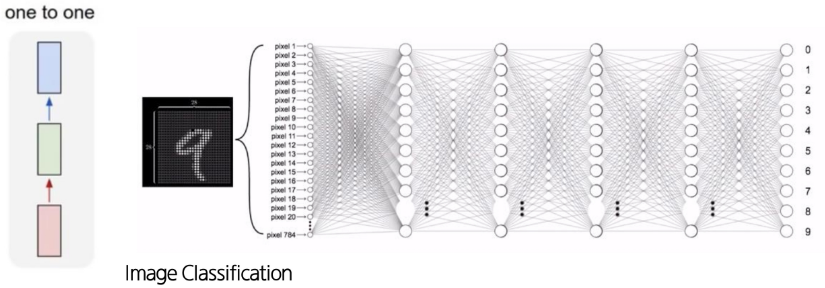

### RNN이란?
- 하지만, RNN은 가변 길이의 입력을 받을 수 있고, 이전 입력을 **기억**할 수 있기 때문에, **순차적 데이터 처리**에 적합한 아키텍처이다.

  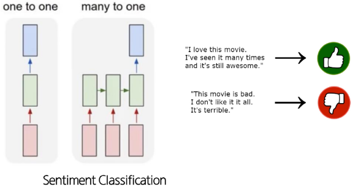

  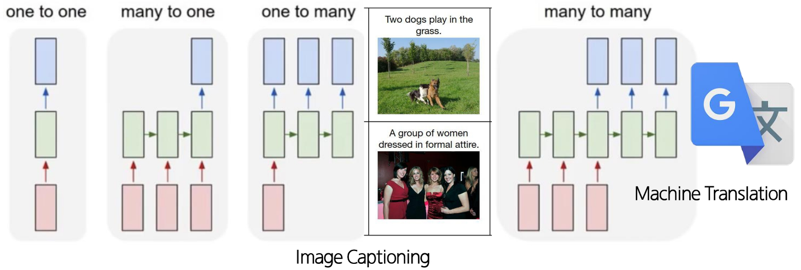

### RNN 아키텍처 설명
- 전통적인 신경망(MLP, CNN 등)과 달리, RNN은 이전 시점의 정보를 담는 **hidden state**를 가지고 있다.
- 따라서, 입력 시퀀스 벡터 x를 처리할 때, 각 시점마다 **recurrence 수식**을 적용하여 hidden state를 업데이트한다.

  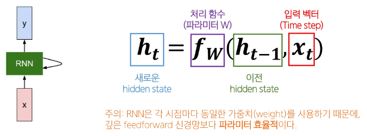

### RNN 자세히 살펴보기

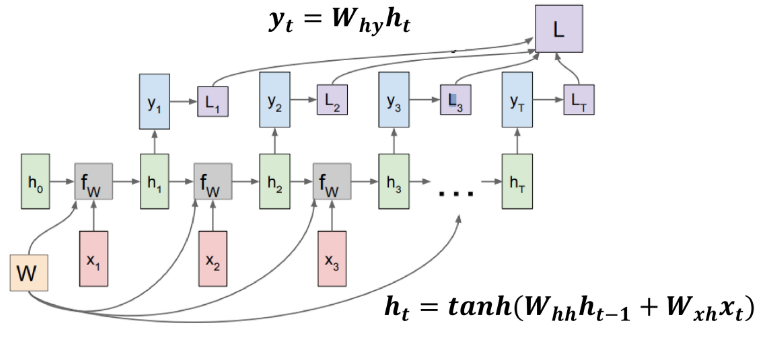

### RNN의 특징
- RNN은 **한 번에 하나의 요소를 처리**하고, 정보를 앞으로 전달
- **펼쳐서 보면**, RNN은 각 층이 하나의 시점을 나타내는 깊은 신경망처럼 보임
- RNN은 hidden state를 유지하면서 **가변 길이 데이터를 처리**할 수 있다.
- RNN의 출력은 **과거 입력에 영향을 받는다**는 점에서, feedforward 신경망과 다르다.

### RNN의 한계: 기울기 소실(vanishing gradient) 문제
- 기울기 소실(vanishing gradient) 문제란?
  - 딥러닝에서 역전파 시 앞쪽 층의 기울기가 0에 가까워져서 장기 의존성 학습이 어려워지는 현상
- 왜 일어날까?
  1. 역전파 과정에서 **작은 값**들이 계속 곱해진다.
  2. 과거 시점에서 온 오차 신호는 갈 수록 더 작은 기울기를 갖게 된다.
  3. 결국 파라미터들이 장기 의존성은 학습하지 못 하고, 단기 의존성만 포착하게 된다.

    

# 4. LSTM

### LSTMs란?
- 기울기 소실 문제를 해결하기 위해 1997년에 제안된 RNN의 한 종류
- LSTMs의 특징
  - 시점 t 에서 RNN은 길이가 n인 벡터 **hidden state** h_t와 **cell state** C_t를 가진다.
    - Hidden state는 short-term information을 저장
    - Cell state는 **long-term information을 저장**
  - LSTMs는 cell state에서 정보를 **읽고(read), 지우고(erase), 기록(write)** 할 수 있다.

### RNNs vs LSTMs

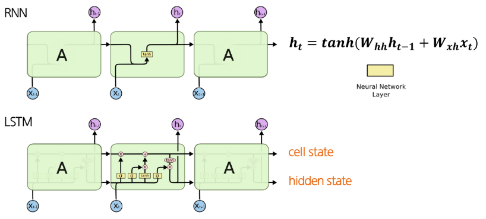

### LSTMs
- 3가지 게이트를 통해 어떤 정보를 지우고, 쓰고, 읽을지 결정
  - **Forget gate**: 이전 cell state에서 **무엇을 버리고 무엇을 유지할지** 결정
  - **Input gate**: 새 정보 중 **얼마나 cell state에 쓸지** 결정
  - **Output gate**: cell state 중 **얼마나 hidden state로 내보낼지** 결정

    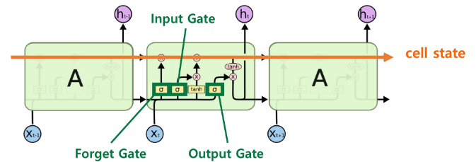

- 게이트의 동작?
  - 매 시점마다 게이트의 각 요소는 **열림(1), 닫힘(0)**, 혹은 **그 사이의 값**으로 설정됨
  - 게이트는 동적으로 계산되며, 현재 입력과 hidden state 등 문맥에 따라 값이 정해짐

### LSTMs - Forget gate
- Forget gate: 이전 cell state에서 무엇을 버리고 무엇을 유지할지 결정

  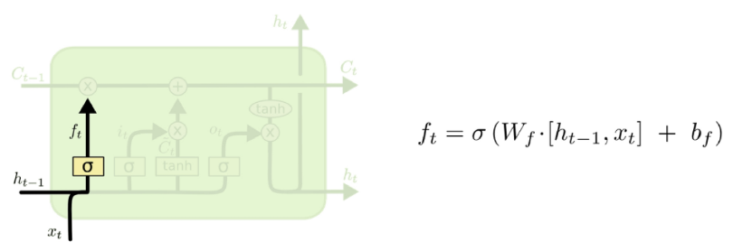

### LSTMs - Input gate
- Input gate: 새 정보 중 얼마나 cell state에 쓸지 결정

  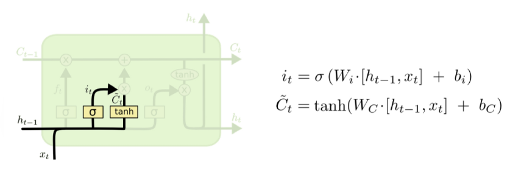

### LSTMs - New cell content
- New cell content: cell에 기록될 새로운 후보

  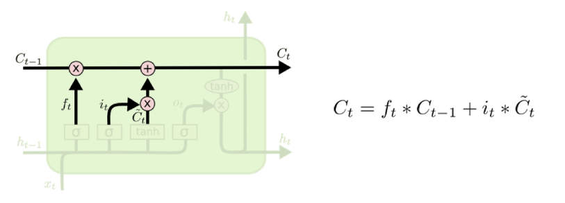

### LSTMs - Output gate
- Output gate: cell state 중 얼마나 hidden state로 내보낼지 결정

  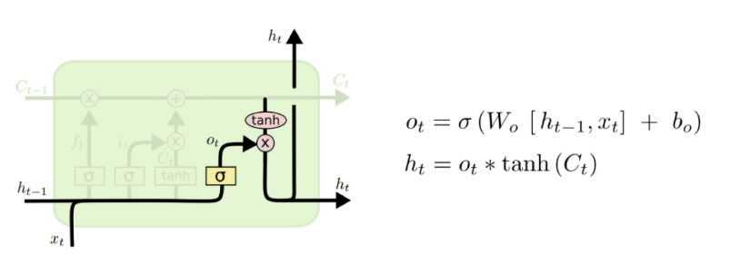

---
# 1. 언어모델이란?

### 언어모델이란?
- 언어모델이란 인간의 두뇌가 자연어를 생성하는 능력을 모방한 모델이다.
  - **단어 시퀀스 전체에 확률을 부여**하여 문장의 자연스러움을 측정

    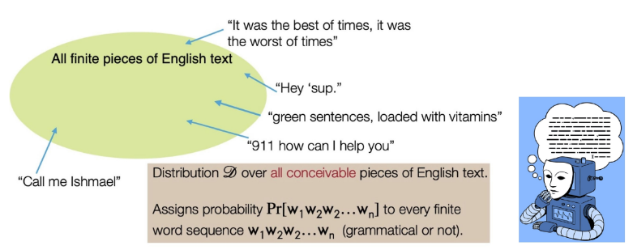

- 한 문장의 확률은 각 단어의 조건부 확률들의 곱으로 표현할 수 있다.

  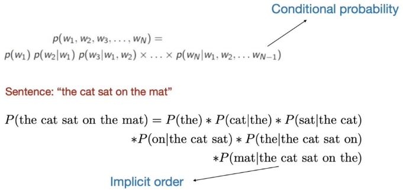

### 일상 속의 언어모델

### 대표적인 언어모델 - N-gram 언어모델

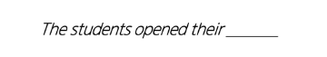

- **n-gram**이란, 연속된 n개의 단어 묶음을 말한다.
  - **uni**grams: "The", "students", "opened", "their"
  - **bi**grams: "The students", "students opened", "opened their"
  - **tri**grams: "The students opened", "students opened their"
  - **four**-gram: "The students opened their"
- 다양한 n-gram이 얼마나 자주 등장하는지 통계를 수집하고, 이를 활용해 다음 단어를 예측
- 예시: 4-gram 언어모델

  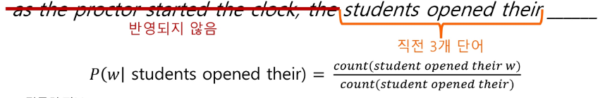

- 말뭉치 정보
  - "students opened their" - 1000번 등장
  - "students opened their **books**" - **400**번 등장 
  -> P(**books** | students opened their) = 0.4
  - "students opened their **exams**" - **100**번 등장 
  -> P(**exmas** | students opened their) = 0.1

### 언어모델 사용 예시: Statistical Machine Translation
- 1990년부터 2010년까지는 Machine Translation을 통계학적으로 접근
- 예시: 한국어 -> 영어
  - 한국어 문장 x가 주어졌을 때, 가장 잘 맞는 영어 문장 y를 찾아야 한다.

    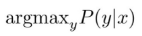

  - Bayes Rule을 이용해, 식을 두 부분으로 쪼개어 **번역모델**과 **언어모델**로 나누는 방법을 사용

    

- 하지만, SMT에는 한계가 존재
  - 구조적 복잡성
  - 많은 수작업
  - 언어 별 자원 구축 필요 
  -> 유지 및 확장에 어려움 존재
- 이런 한계로 인해, 이후의 기계 번역 연구는 **Neural Machine Translation(NMT)**으로 넘어감

# 2. Seq2Seq

### Neural Machine Translation

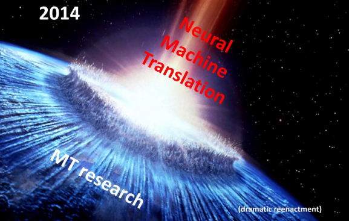

### Neural Machine Translation이란?
- Neural Machine Translation 이란 **인공 신경망을 이용해 기계 번역을 수행**하는 방법
- 이 때 사용되는 신경망 구조를 **sequence-to-sequence(Seq2Seq)** 이라 하며, **두 개의 RNNs**으로 이뤄짐
  - 2014년 Google의 "Sequence to Sequence Learning with Neutral Networks"라는 논문에서 처음 소개됨

    

### Translation이 어려운 이유
- 번역 문제는 **입력과 출력의 길이가 다를 수 있다.**
  - 영어: the black cat drank milk (5개의 단어)
  - 프랑스어: le chat noir a bu du lait (7개의 단어)
    - 따라서, NMT에서는 길이가 다른 시퀀스 간의 매핑을 처리할 수 있어야 한다.

### Seq2Seq의 아이디어
- 2개의 LSTM을 이용
  - 한 LSTM은 입력 시퀀스를 한 타임스텝씩 읽어 고정된 차원의 큰 벡터 표현을 얻기(Encoder)
  - 다른 LSTM은 앞에서 얻은 벡터로부터 출력 시퀀스를 생성하기(Decoder)

### Seq2Seq Architecture
- Seq2Seq는 Encoder와 Decoder로 이뤄짐
  - Encoder는 입력 문장에 담긴 정보를 인코딩함
  - Decoder는 인코딩된 정보를 조건으로 하여 타겟 문장(출력)을 생성

    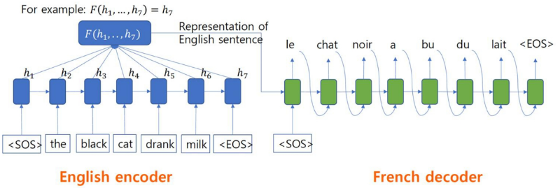

### Seq2Seq의 다양한 적용
- Seq2Seq 구조는 기계번역 외에도 **다양한 태스트에 적용**할 수 있다.
  - **요약**: **긴 길이의 문서**를 읽고, **짧은 길이의 문장**으로 요약된 텍스트를 출력하는 태스크
  - **대화**: **사용자의 발화**를 기반으로, **맥락에 맞는 대답(출력 텍스트)** 을 생성하는 태스크
  - **코드 생성**: 자연어로 작성된 설명 혹은 명령어를 입력 받아, 그에 대응하는 **프로그래밍 코드 혹은 쿼리**를 출력하는 태스크

### Seq2Seq 학습 수행
- Seq2Seq 모델은 인코더와 디코더가 **하나의 통합 네트워크로 연결**되어 있다.
- 디코더에서 발생한 오차는 역전파 과정을 통해 입력을 처리한 인코더까지 전달되어 전체 네트워크가 End-to-En로 동시에 최적화된다.

  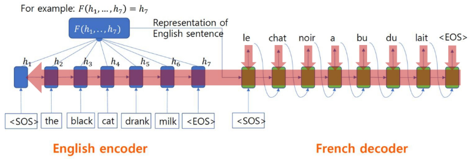

### Seq2Seq 학습 수행 (Teacher Forcing)
- 학습 초반에는 모델의 예측 능력이 떨어지기 때문에 학습이 불안정할 수 있다.
- **Teacher Forcing**이란?
  - 모델이 스스로 예측한 단어 대신 **정답 단어를 디코더 입력으로 강제로 넣어줌**으로써 훨씬 안정적이고 빠르게 학습을 수행하는 방법

    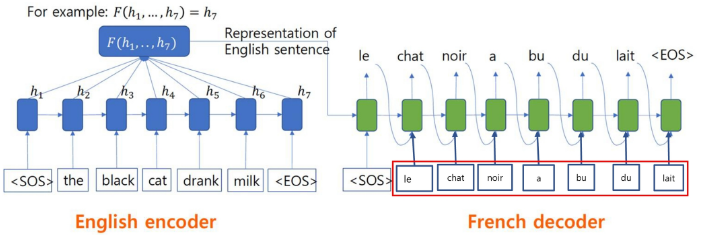

### Seq2Seq의 토큰 출력 방법(Greedy Inference)
- 토큰을 출력하는 방법 중 하나로, 각 단계에서 **가장 확률이 높은 단어를 선택**
- 한계
  - **되돌리기가 불가능**
  - 예시: le ____ -> le chien ____ -> ... **(오답! 하지만 되돌아갈 방법이 없음)**

    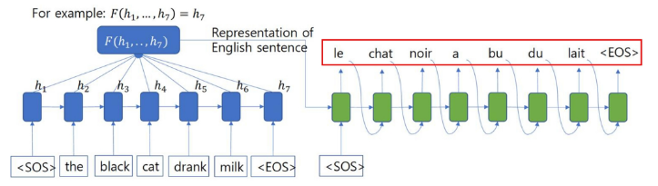

### Seq2Seq의 토큰 출력 방법(Beam Search)
- Beam Search
  1. 매 단게마다 k개의 가장 유망한 후보 유지
  2. 후보가 <EOS>에 도달하면, 완성된 문장으로 리스트 추가
  3. <EOS> 문장이 충분히 모이면 탐색 종료
  4. 각 후보들의 점수를 로그 확률의 합으로 구해 최종 선택

    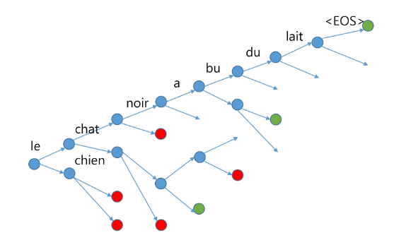

# 3. Attention

### Seq2Seq의 한계: the bottleneck problem
- Bottleneck problem이란?
  - 인코더는 입력 문장 전체를 하나의 벡터로 요약하는데, **마지막 hidden state에 문장의 모든 의미 정보가 담긴다.**
  - 고정 길이 벡터 하나에 모든 문장의 의미를 압축하다 보니 정보 손실이 생길 수 있는데, 이를 **bottleneck problem**이라고 한다.

    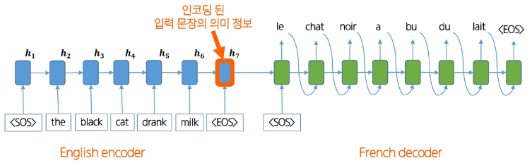

### Attention의 인사이트
- **Attention**은 디코더가 단어를 생성할 때, **인코더 전체 hidden state 중 필요한 부분을 직접 참조**할 수 있도록 한다.
- 즉, 매 타임스텝마다 "어떤 단어/구절에 집중할지"를 가중치로 계산해, bottleneck 문제를 완화

  

### Attention

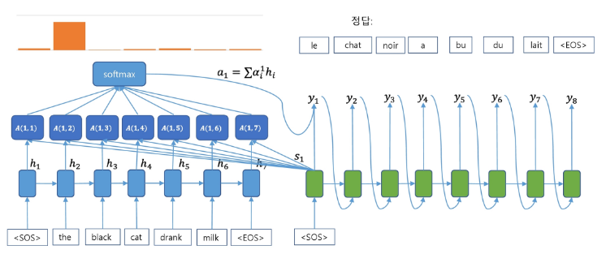

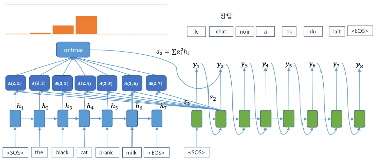

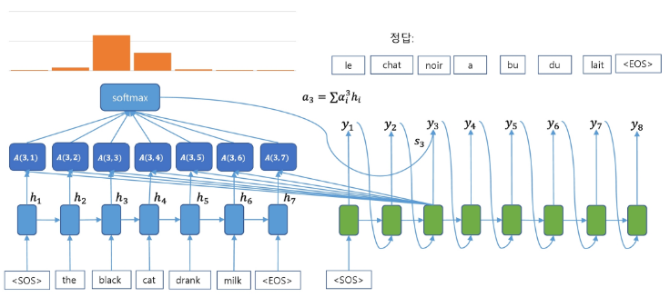

### Attention의 효과
- Attention mechanism은 많은 장점이 존재
  1. NMT 성능 향상
    - 디코더가 소스 문장 전체가 아닌, 필요한 부분에만 집중할 수 있기 때문
  2. Bottleneck Problem 해결
    - 디코더가 인코더의 모든 hidden states에 직접 접근할 수 있음
  3. Vanishing Gradient Problem 완화
    - Attention은 멀리 떨어진 단어도 직접 연결할 수 있게 해줌

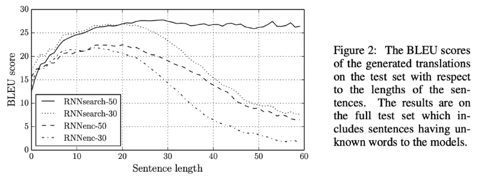

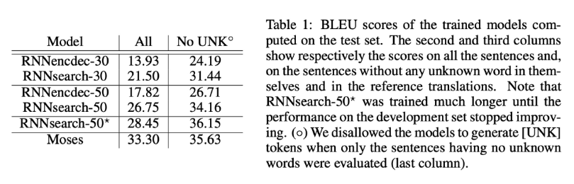

### Attention의 효과: 해석 가능성(Interpretability)
- Attention 분포를 보면, decoder가 어떤 단어를 생성할 때, 입력 문장의 **어느 부분에 집중했는지 확인**할 수 있다.
- 즉, 모델이 내부적으로 참고한 근거를 사람이 파악할 수 있음 
-> **모델의 의사결정 과정을 해석할 수 있는 단서**

### Attention의 효과: 정렬(Alignment)
- 기계번역에서는 전통적으로 단어 alignment 모델을 따로 학습해야 했다.
- 하지만, attention은 통해 decoder가 필요한 입력 단어에 자동으로 집중하기 때문에, **단어와 단어 간의 매핑 관계를 자연스레 학습한다.**

  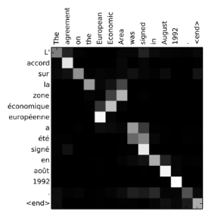

### Attention: Query와 Values
- Seq2Seq에서 attention을 사용할 때, **각 decoder의 hidden state**와 **모든 encoder의 hidden states** 간의 관계를 **Query**와 **Values**의 관계로 볼 수 있다.
- 이 관점에서 Attention 과정을 정리해보면
  1. **Query**와 **Values** 사이 유사도 점수(score) 계산 (예: dot-product, multiplication, additive 등)
  2. Softmax를 통해 확률 분포(attention distribution) 얻기
  3. 분포를 이용해 values를 가중합 -> context vector (attention output)

    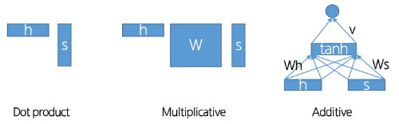

---
# 1. Self-Attention

### RNN이 꼭 필요할까?
- RNN은 정보를 hidden state로 전달하며 순차적 의존성을 형성
- 그에 반해 Attention은 필요한 순간, 입력 전체에서 직접 정보를 전달 
-> RNN이 하던 "정보 전달"을 **Attention이 더 효율적으로 수행**할 수 있다면, **굳이 recurrence가 필요**할까?

  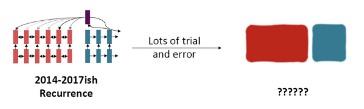

### RNN의 한계점 1 - 장기 의존성
- RNN은 왼쪽에서 오른쪽으로 순차 전개되어, 먼 단어 쌍이 상호작용하려면 시퀀스 길이 만큼의 단계를 거쳐야 한다.
- 따라서, 길어진 단계만큼 기울기 소실 혹은 폭발 문제가 발생해 장기 의존성을 학습하기 어렵다.
- 또한, RNN은 입력된 선형 순서를 강하게 반영하기 때문에, 언어의 비선형적 의존성을 잘 잡아내지 못 한다.
  - 예시: 그 **책**은 오랫동안 방치되어 먼지가 많이 쌓인 탓에 ... 매우 **더러웠다**.

    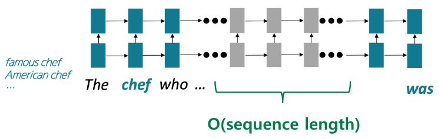

### RNN의 한계점 2 - 병렬화
- Forward와 Backward pass 모두 **시퀀스 길이 만큼의 단계**가 필요
- 이처럼, 순차적인 연산이 진행되기 때문에, 병렬화가 불가능
- 이는, 병렬 연산에 강한 GPU 활용을 어렵게 만들며, 대규모 학습에 비효율적

  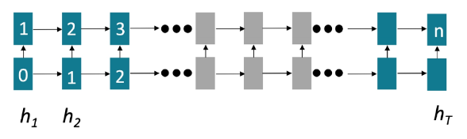

### 그렇다면 Attention은 어떨까?
- **Attention**은 각 단어의 표현을 **query**로 두고, **value 집합**으로부터 필요한 정보를 직접 불러와 결합
- 이러한 Attention 메커니즘을 **encoder-decoder 간**이 아닌, **한 문장 내부에서 적용**한다면 어떨까? 
-> **Self-Attention**

### Self-Attention의 장점은?
1. 순차적으로 처리해야 하는 연산 수가 시퀀스 길이에 따라 증가하지 않는다.
2. 최대 상호작용 거리 = O(1) -> 모든 단어가 각 층에서 직접 상호작용한다.

  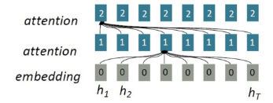

### Seq2Seq에서의 Attention
- Attention(입력 문장 내의 단어들 | 출력 문장 내의 각 단어 "w")

  

### Self-Attention
- Attention(문장 내의 다른 단어들 | 문장 내의 각 단어 "w")

  

  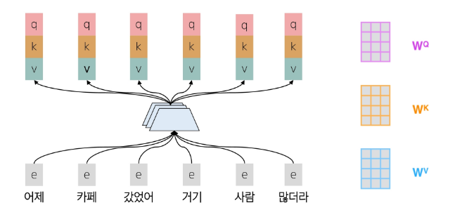

  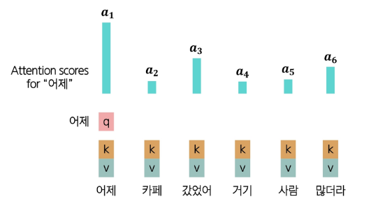

  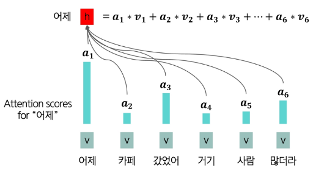

  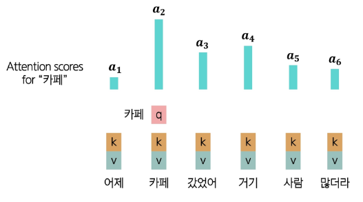

  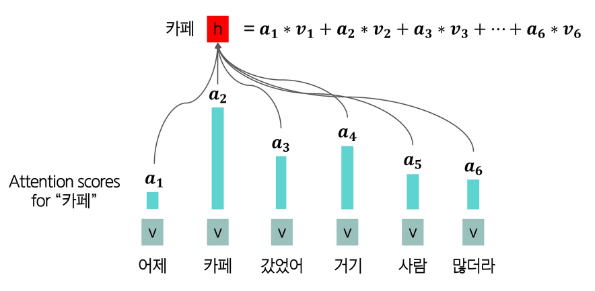

  

### Self-Attention - Key, Query, Value
- Attention에서 각 단어 "i"를 표현하는 Query와 Value 벡터가 있었듯이, Self-Attention에서는 각 단어 "i"를 표현하는 **Query**, **Key**, **Value** 벡터가 존재
  1. 각 단어를 **Query**, **Key**, **Value** 벡터로 변환
    - **Query** 벡터
      - 단어 i가 다른 단어로부터 어떤 정보를 찾을 지를 정의하는 벡터
    - **Key** 벡터
      - 단어 i가 자신이 가진 정보의 특성을 표현하는 벡터
    - **Value** 벡터
      - 실제로 참조되는 정보 내용을 담고 있는 벡터

    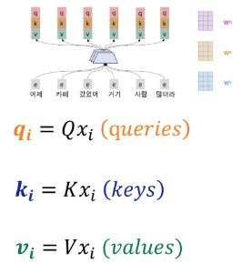

  2. **Query**, **Keys** 간의 유사도를 계산해, softmax로 확률분포를 구한다.

    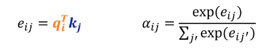

  3. 각 단어의 출력을 **Values**의 가중합으로 계산

    

### Self-Attention의 한계
- 이렇듯, Self-Attention은 단어 간 관계를 효율적으로 잡아내는 강력한 메커니즘이지만, 한계가 존재
- 한계
  1. **순서 정보 부재** -> 단어 간 유사도만 계산하기 때문에, **단어의 순서를 고려하지 않는다.**
  2. **비선형성 부족** -> Attention 계산은 본질적으로 가중 평균 연산이라는 **선형 결합에 불과**하기 때문에, 복잡한 패턴이나 깊은 표현력을 담기 어려움
  3. **미래 참조 문제** -> 언어 모델은 시퀀스를 왼쪽에서 오른쪽으로 생성해야 하지만, Self-Attention은 모든 단어를 동시에 보기 때문에, 아직 **생성되지 않아야 할 미래 단어를 참조**

### Self-Attention의 한계 해결 1 - Positional Encoding
- **순서 정보 부재 문제**를 해결하기 위해, **Positional Encoding**이라는 기법을 사용
- 각 단어 위치 i를 나타내는 위치 벡터를 정의해, **단어 임베딩 값에 더해 최종 입력으로 사용**
- 2가지 방법이 존재
  - **Sinusoidal Position Encoding**
    - 서로 다른 주기의 **사인/코사인 함수를 합성**해 위치 벡터를 만드는 방법
  - **Learned Absolute Position Embedding**
    - **위치 벡터를 모두 학습 파라미터로 설정**해 학습 과정에서 데이터에 맞춰 최적화하는 방법

### Self-Attention의 한계 해결 2 - Feed-Forward Network 추가하기
- Self-Attention 연산은 **비선형 변환이 없어, 복잡한 패턴 학습에 한계가 존재**
- 따라서, 각 단어 출력 벡터에 Feed-Forward Network (Fully Connected + ReLU 등)을 추가해 Self-Attention이 만든 표현을 **깊고 비선형적인 표현으로 확장**

  

### Self-Attention의 한계 해결 3 - Masked Self-Attention
- 단어를 생성할 때는 한 단어씩 순차적으로 미래 단어를 예측해야 하지만, Self-Attentio은 기본적으로 **모든 단어(미래 포함)를 동시에 참조**
- 따라서, Attention Score를 계산할 때, **미래 단어에 해당하는 항목을 -∞로 설정**해, 계산을 수행할 때 반영되지 않도록 한다.

  

### Self-Attention 정리
- Self-Attention은 문장 내 모든 단어가 서로 직접 상호작용하여, **1) 장거리 의존성을 효율적으로 포착**하고 **2) 병렬 처리**를 가능하게 하는 메커니즘
- 한계 해결 방법
  1. 순서 정보 부재 -> Positional Encoding
  2. 비선형성 부족 -> Feed-Forward Network 추가
  3. 미래 참조 문제 -> Masked Self-Attention

    

# 2. Transformer

### Attention is All You Need
- Transformer는 2017년 Google의 "**Attention Is All You Need**"라는 논문에서 처음 제안된 아키텍쳐로, **Self-Attention을 핵심 메커니즘으로 하는 신경망 구조**이다.

  

### Transformer
- Transformer는 encoder-decoder 구조로 설계된 신경망 모델
  - encoder: 입력 문장을 받아 의미적 표현으로 변환을 수행
  - decoder: 인코더의 표현과 지금까지 생성한 단어들을 입력받아, 다음 단어를 예측
    - 이 중 decoder가 언어 모델과 같은 방식으로 동작

### Multi-Headed Attention
- 문장에서 같은 단어라도 **여러 이유(문법적 관계, 의미적 맥락 등)로 다른 단어에 주목**할 수 있다.
- 하지만, 단일 Self-Attetion Head로는 한 가지 관점에서의 단어 간 관계밖에 파악할 수 없다.
  - 따라서, **여러 Attention Head를 두어 다양한 관점에서 동시에 정보를 파악**한다.
- Attention Head 1 - 단어의 문맥적 관계에 Attention

  

- Attention Head 2 - 단어의 시제에 Attention

  

- Attention Head 3 - 명사에 Attention

  

### Scaled Dot Product
- Query와 Key의 차원이 커질 수록, 두 벡터의 내적 값도 자연스럽게 커진다.
- 이 값이 너무 크면 softmax 함수가 출력이 지나치게 뾰족해져 미세한 변화에도 큰 차이가 발생하고 gradient vanishing 문제가 생길 수 있다.

  

- 따라서, 내적 값을 그대로 사용하지 않고, 나눠주어 스케일을 조정
- 이렇게 하면 값이 안정적으로 분포되어 학습이 훨씬 더 빠르고 안정적으로 진행된다.

  

### Residual Connection
- 깊은 신경망은 층이 깊어질 수록 학습이 어려워진다. (Gradient vanishing / exploding)
- 따라서, 단순히 Layer의 출력만 사용한다면 정보가 소실되어 layer가 전체를 예측하는 것이 아니라, 기존 입력과의 차이만 학습하도록 하는 residual connection을 사용

  

### Layer Normalization
- 층이 깊어질 수록, hidden vector 값들이 커졌다 작아졌다 하면서 학습이 불안정하다.
- Layer Normalization은 각 레이어 단위에서 hidden vector 값을 정규화해, 안정적이고 빠른 학습을 돕는다.

### Decoder
- Transformer의 decoder는 여러 개의 **decoder 블록**들을 쌓아 올려서 만든 구조
- 각 블록은 다음으로 구성된다
  - **Masked Self-Attention (Multi-Head)**
    - 미래 단어를 보지 않도록 마스크를 씌운 Multi-Head Self-Attention
  - **Add & Norm** (Residual Connection + Layer Normalization)
  - **Feed-Forward Network**
    - 각 위치별 비선형 변환을 수행
  - **Add & Norm** (Residual Connection + Layer Normalization)
    - 언어 모델처럼 **단방향 문맥**만 활용

### Encoder
- 그에 반에 Transformer의 encoder는 **양방향 문맥을 모두 활용**할 수 있다.
  - 입력 문장을 **의미적 표현**으로 변환할 수 있다.
  - 각 단어가 **양방향 문맥**을 모두 반영한 벡터로 인코딩된다.
- Decoder와의 차이점은 Self-Attention에서 **masking을 제거**한 것 뿐이다.

### Encoder-Decoder
- 기계 번역에서 Seq2Seq 모델을 사용했던 것처럼, Transformer에서도 이해를 위한 **encoder**와 생성을 위한 **decoder**로 이뤄진 encoder-decoder 구조를 채택
- decoder는 단순 Self-Attention만 하는 것이 아니라, encoder의 출력 표현을 참조하는 Cross-Attention을 추가하여 입/출력을 연결

### Cross-Attention
- Cross-Attention을 수행할 때는 Self-Attention과는 다르게 **Query는 decoder**에서, **Key와 Value는 encoder**에서 가져온다.

### Transformer의 놀라운 결과
- Neural Machine Translation task에서 당시 **최고 성능**을 달성했을 뿐 아니라, 가장 효율적인 학습으로 비용까지 절감할 수 있었다.

  

### Transformer와 사전학습(pretraining)
- Transformer의 등장은 대부분의 최신 모델들이 성능 향상을 위해 **사전학습(pretraining)**을 결합하도록 했다.
- 또한, **뛰어난 병렬 처리 능력** 덕분에 대규모 사전학습에 적합하여 NLP의 **표준 아키텍처**로 자리잡았다.

  

# 1. 사전학습이란?

### 사전학습이란?
- **사전학습**이란 대규모 데이터 셋을 이용해, 모델이 **데이터의 일반적인 특징과 표현을 학습하도록 하는 과정**
- 특히 언어 모델은 **인터넷의 방대한 텍스트(웹 문서, 책 뉴스 등)을 활용해 비지도학습 방식으로 학습**되어, 일반적인 언어 패턴, 지식, 문맥 이해 능력을 습득

  

### 사전학습의 관점에서 워드 임베딩 vs. 언어 모델
- 워드 임베딩의 경우 사전학습을 통해 단어의 의미를 학습하지만 한계가 존재
  1. **다운스트림 태스크**(예: 텍스트 분류)들에 적용하기엔 학습되는 데이터의 양이 적어 언어의 풍부한 문맥 정보를 충분히 학습할 수 없다.
  2. 연결된 네트워크가 무작위 초기화되어 학습 효율이 낮고, 많은 데이터와 시간이 필요

    

- 언어 모델의 경우 **모델 전체를 사전학습**을 통해 학습하기 때문에 강력한 NLP 모델을 구축하는 데에 이점이 있다.
  1. **언어에 대한 표현 학습**용으로 적합
  2. **파라미터 초기화**의 관점에서 **효과적**
  3. **언어**에 대한 **확률 분포 학습**을 통해 샘플링, 생성에 사용

    

### 언어모델의 사전학습
- 과거 단어들이 주어졌을 때, **다음 단어의 확률분포를 모델링**하는 방법을 배움으로서, 사전학습을 수행할 수 있다.
- 인터넷의 대규모 텍스트 코퍼스에서 언어모델링 학습을 수행 후 학습된 네트워크 파라미터를 저장해 다양한 다운스트림 태스크에 활용

### 사전 학습 -> 파인튜닝(fine-tuning) 패러다임
- 사전학습을 통해, **언어 패턴을 잘 학습한 파라미터로 초기화**해 NLP application 성능을 향상시킬 수 있다.

  

### 사전학습 모델들의 역사

# 2. Encoder 모델

### Encoder 모델

### Encoder 모델의 사전 학습
- Encoder 모델은 **양방향 문맥을 모두 활용**하기 때문에, 전통적인 언어모델과는 차이점이 있다.
- 따라서, Encoder 모델의 사전 학습을 위해선 입력 단어의 일부를 [MASK] 토큰으로 치환해 모델이 이 [MASK] 자리에 올 단어를 예측하도록 학습하는 방법을 사용할 수 있다.
- 이를 **Masked Languege Model**이라 하며, 대표적인 모델이 **BERT**이다.

  

### BERT
- **BERT**는 2018년 Google에서 공개한 transformer 기반의 모델로, **Masked LM** 방법으로 사전학습을 수행

  

### BERT의 학습 방법 1 - Masked LM
- 학습 방식은 다음과 같다
  - 입력 토큰의 15%를 무작위로 선택
  - [MASK] 토큰 치환(80%), 랜덤 토큰 치환(10%), 그대로 두기(10%)
- 모델이 마스크된 단어에만 집중하지 않고, **다양한 문맥 표현을 학습**해 더 강건한(robust) 표현을 학습할 수 있도록 했다.

  

### BERT의 학습 방법 2 - Next Sentence Prediction(NSP)
- 또한, BERT는 입력을 두 개의 연속된 텍스트로 받아, **두 번째 문장이 첫 번째 문장의 실제 다음 문장인지 여부**를 예측하는 **Next Sentence Prediction(NSP)**을 수행했다.

  

- NSP를 통해 문장 간 관계를 학습하여 문맥적 추론 및 문장 수준 이해 태스크에 도움이 되도록 설계되었다.
- 예시
  - 자연어 추론(Natural Languege Inference)
  - Paraphrase detection
  - 질의응답(Question Answering)

    

### BERT의 다운스트림 태스크
- BERT는 이렇게 MLM과 NSP 두 가지 태스크를 동시에 학습
- [CLS] 토큰은 NSP 태스크 용으로 학습되며, 다른 토큰들은 MLM 태스크 용으로 학습됨

  

### BERT의 다운스트림 태스크 - Sentence Level
- 두 문장 관계 분류 태스크
  - MNLI
    - 전제(Premise): 여러 남자들이 뛰고 있는 축구 경기
    - 가설(Hypothesis): 몇몇 남자들이 스포츠를 하고 있다.
    - 분류: {**함의(Entailment)**, 모순(Contradiction), 중립(Neutral)}

  - QQP
    - Q1: 주식 투자 방법은 어디서 배울 수 있나요?
    - Q2: 주식에 대해 더 배우려면 어떻게 해야 하나요?
    - 분류: {**중복(Duplicate)**, 비중복(Not Duplicate)}

  

- 단일 문장 분류 태스크
  - SST2
    - 문장: 이 영화에는 재미있는 요소들이 풍부하다.
    - 분류: {**긍정(Positive)**, 부정(Negative)}
  
  

### BERT의 다운스트림 태스크 - Token Level
- QA 태스크
  - SQuAD
    - 질문: 뉴욕 자이언츠와 뉴욕 제츠는 뉴욕시의 어느 경기장에서 경기를 하나요?
    - 문맥: ... 두 팀은 뉴저지 이스트 러더퍼드에 있는 Metlife Stadium에서 홈 경기를 한다. ...
    - 정답: **Metlife Stadium**
  
  

- 개체명 인식(Named Entity Recognition, NER)
  - CoNLL 2003 NER
    - 문장: John Smith lives in New York
    - 라벨
      - John -> B-PER(사람 이름의 첫 단어)
      - Smith -> I-PER(사람 이름에 속하는 나머지 단어)
      - lives -> O(개체명이 아닌 단어)
      - in -> O(개체명이 아닌 단어)
      - New -> B-LOC(장소 이름의 첫 단어)
      - York -> I-LOC(장소 이름에 속하는 나머지 단어)

  

### BERT의 결과
- BERT는 다양한 태스크에 적용 가능한 범용성을 보여줬으며, fine-tuning을 통해 여러 NLP 과제에서 새로운 최첨단(SOTA) 성능을 이끌어냈다.

  

- Layer의 수, hidden state의 크기, attention head의 수가 클 수록 성능이 향상되는 경향을 보였다.

  

### BERT의 한계
- 인코더 기반 모델인 BERT는 주어진 입력을 잘 이해하도록 학습되지만, 시퀀스를 생성해야 하는 태스크에는 적합하지 않다. (예시: 기계 번역, 텍스트 생성 등)
- 생성 태스크에서는 autoregressive하게, 즉 한 번에 한 단어씩 생성해야 하는데, 이를 자연스럽게 수행하지 못 하기 때문에, 생성 태스크엔 디코더 기반 모델을 주로 사용한다.

  

# 3. Encoder-Decoder 모델

### 인코더-디코더 모델

### T5 (Text-to-Text Transfer Transformer)
- T5는 2019년 Google Research에서 공개한 모델로 Transformer Encoder-Decoder 구조 기반의 모델
- 모든 태스크를 Text-to-Text 포맷으로 변환해 하나의 모델로 학습

  

### T5의 학습 방법 - Span Corruption
- Encoder-Decoder 구조에서는 Encoder가 입력 문장을 모두 보고, 그 정보를 바탕으로 Decoder가 출력을 생성
- 따라서 학습을 위해 **Span Corruption**이라는 과정을 수행
  - 입력 문장에서 **연속된 토큰**을 무작위로 선택해 제거
  - 제거된 부분을 특수 placeholder 토큰으로 치환 (예: <X>, <Y>)
  - 디코더는 이 placeholder에 해당하는 원래 span을 복원하도록 학습
- 이를 통해 **언어 모델링처럼 훈련을 수행**할 수 있다.

  

### T5의 다운스트림 태스크
- T5는 NLU(GLUE, SuperGLUE), QA(SQuAD), 요약(CNNDM), 번역(En -> De, En -> Fr, En -> Ro) 등의 태스크에서 모두 좋은 성능을 보여 범용적으로 활용될 수 있는 모델임을 입증

  

# 4. Decoder 모델

### Decoder 모델

### Finetuning Decoder
- Transformer의 Decoder는 사전학습 댠계에서 **다음 단어 예측(Next Token Prediction)** 을 학습
- **생성 태스크에 활용**할 때
  - 사전학습 때와 동일하게 다음 단어 예측 방식으로 fine-tuning한다.
  - 따라서, decoder는 대화나 요약 태스크 등 **출력이 시퀀스인 태스크에 자연스럽게 적합**

    

- **분류 태스크에 활용**할 때
  - 마지막 hidden state 위에 새로운 linear layer를 연결해 classifier로 사용
  - 이 때, linear layer는 아예 처음부터 다시 학습해야 하며, fine-tuning 시 gradient가 decoder 전체로 전파

    

### GPT-1
- GPT-1은 2018년 OpenAI에서 공개한 Transformer 기반의 Decoder 모델이다.
- Autoregressive LM (왼쪽 -> 오른쪽 단어 예측) 방식으로 사전학습되었다.

  

### GPT-1의 fine-tuning 방법 (분류 태스크)
- GPT-1은 다음 단어 예측이라는 언어모델의 학습 목표를 최대한 유지하면서, fine-tuning을 수행
- NLI (두 문장을 입력받아 관계를 함의(entailment) / 모순(contradiction) / 중립 (neutral) 중 하나로 분류)
  - 전제(Premise): The man is in the doorway.
  - 가설(Hypothesis): The person is near the door. 
  -> Entailment
- 입력 토큰에 특수한 토큰([START], [DELIM], [EXTRACT])을 붙여 분류 문제를 처리했고, [EXTRACT] 위치의 hidden state에 classifier를 연결해 사용

  

### GPT-1의 결과
- GPT-1은 생성 태스크를 잘 수행했을 뿐만 아니라, 태스크 별 fine-tuning을 통해 분류/추론 등 이해 중심 태스크에서도 우수한 성능을 보였다.

  

### GPT-2
- GPT-2는 GPT-1의 확장 버전으로 2019년 OpenAI에서 공개된 모델로, GPT-1에 비해 더 많은 데이터와 더 큰 parameter size로 학습되었으며, 이를 통해 **더 자연스러운 텍스트 생성 능력**을 보여주었다.

  

# 5. In-Context Learning

### GPT-3
- GPT-3는 2020년 OpenAI에서 공개한 모델로, GPT-2에서 모델의 parameter size를 키워 (1750억개), 별도의 파인튜닝 없이 컨텍스트 안의 예시만 보고도 새로운 태스크를 수행할 수 있게 되었다.
- 이런 능력을 **In-Context Learning**이라고 한다.

  

### GPT-3 - In-Context Learning
- 모델에 예시와 함께 어떤 태스크를 할지 지정해주면 모델이 그 패턴을 따라가는 식으로 동작하면서 완벽하진 않지만 그럴듯하게 태스크를 수행하는 모습을 보인다.

  

- 이러한 능력은 모델의 크기, 즉 **parameter size가 커질 수록 더 강력**하게 나타났으며, zero-shot, one-shot, few-shot 모두에서 일관된 성능 개선이 관찰되었다.

  

### Chain-of-Thought prompting
- In-Context Learning의 발견으로 인해, Prompt의 중요성이 대두되었다.
- 하지만 단순한 **Few-shot prompting** 만으로는 **여러 스텝을 거쳐야 하는 문제들을 풀기 어려웠는데**, 이를 해결하기 위해 **Chain-of-Thought (CoT) prompting** 방식이 등장했다.
- **CoT prompting**은 모델이 문제 해결 과정에서 **논리적인 사고 단계를 거쳐 최종 답을 도출하도록 유도**하는 promption 기법이다.

  

- CoT prompting은 일반적인 prompt 방식보다 **훨씬 우수한 성능**을 보이며, 새로운 SOTA (State-Of-The-Art) 성과를 달성하였다.
- 심지어, **fine-tuning을 수행한 모델들보다도 더 좋은 성능**을 보였다.

  

### Zero-Shot Chain-of-Thought prompting
- 하지만, 기존 **CoT Prompting**은 **few-shot 예시가 필요**하다. 예시가 없을 경우, 추론 과정이 나타나지 않아 성능 저하가 발생
- 이를 보완하기 위해, 질문 뒤에 "**Let's think step by step**" 이라는 한 문장을 추가해, 모델이 스스로 추론 단계를 생성하도록 유도하는 **Zero-Shot CoT prompting** 방법이 등장

  

- Zero-Shot CoT prompting을 통해, 별도의 예시 없이도 Few-Shot CoT에 견줄 만한 성능을 달성

  
