# 1. CNN 살펴보기

## 1. CNN vs. FCN

### 완전 연결층(Fully-Connected Layer)
- 입력을 받아서 출력으로 변환하는 신경망의 기본 모듈
- FCN 변환 예시
  - 입력: 이미지가 32x32x3인 고차행렬이라고 가정 (이미지의 높이, 너비가 각각 32픽셀, RGB값 3개를 의미하며 RGB 값은 0~255 사이)
  - 출력: 10x1의 1차원 벡터
  - 모델 상수: 모델이 학습해야 하는 파라미터(parameter), 상기 입출력 시, 모델상수 W는 10x3072로 입력의 모든 값이 출력에 미치는 영향을 나타냄.

    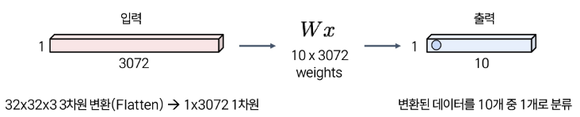

### 합성곱 레이어(Convolution Layer)
- 입력 이미지를 필터와 연산하여 특징 맵(feature map)을 뽑아내는 모듈
- 1차원 구조로 변환하는 FCN과 달리 3차원 구조를 그대로 보존하면서 연산

  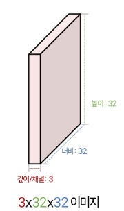

- Convolution(컨볼류션): 필터를 이미지 상에서 **이동**시키면서 **내적**을 반복 수행, 내적으로 구한 모든 값을 출력 제공

  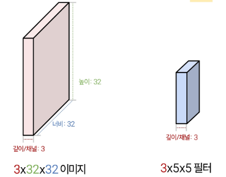

  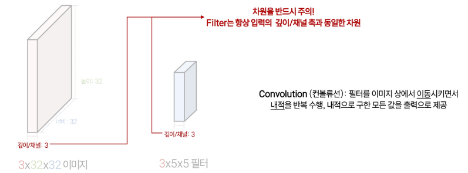

  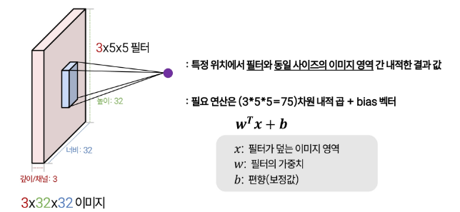

  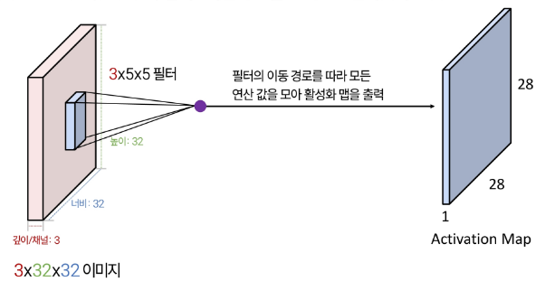

- 예: 박스필터

  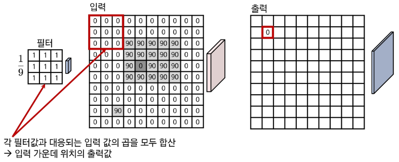

  

  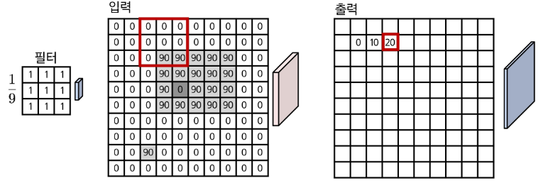

  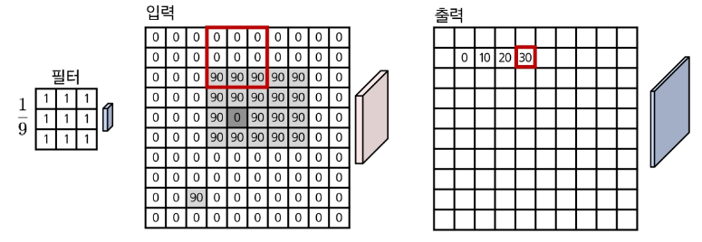

  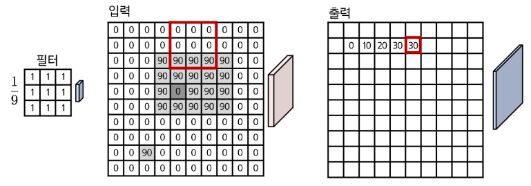

  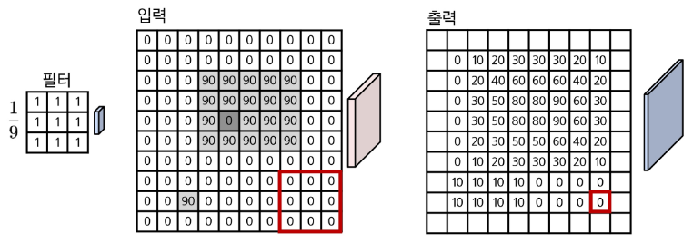

- 입력 이미지를 필터와 연산하여 특징 맵(feature map)을 뽑아내는 모듈

  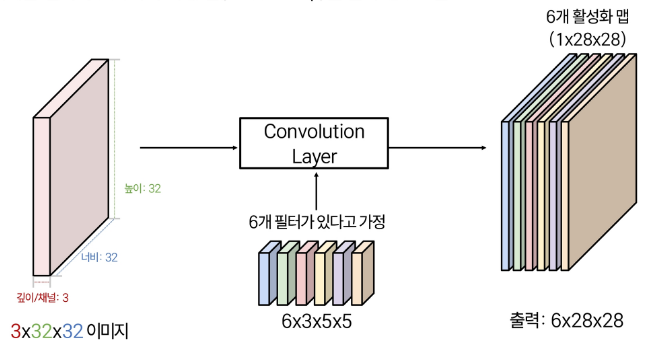

  

  

  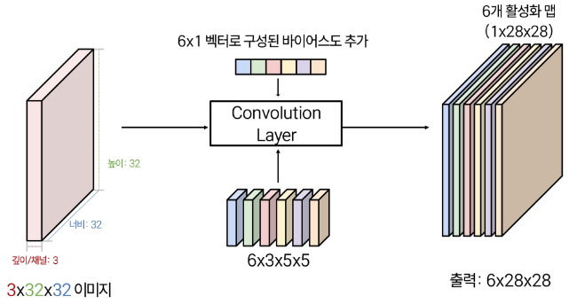

  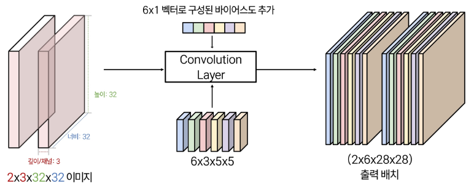

  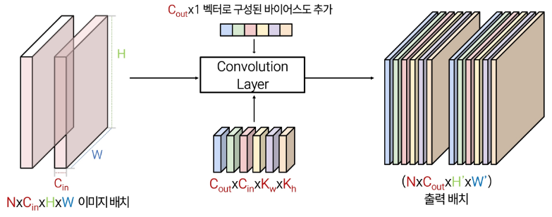

- 출력 해상도 = 입력 해상도 - 필터해상도 + 1 
ex) 8 = 10 - 3 + 1

  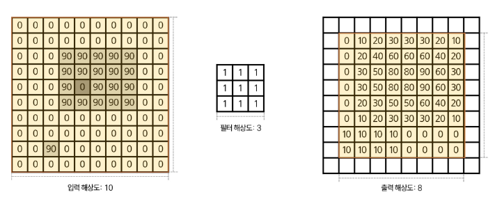

## 2. 모델 구조

### 합성곱 레이어
- 모델 상수(파라미터)를 증가시키면?

  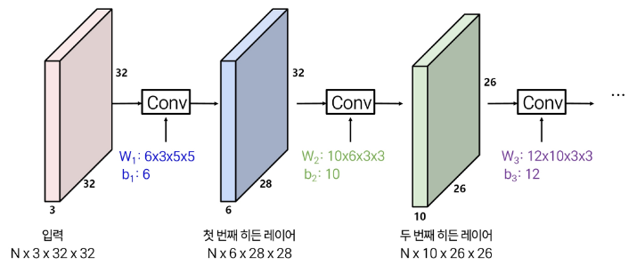

- 비선형 블록(Conv[Linear] + ReLU[비선형 변환])과 함께하면 모델링 파워 향상

  

### 필터 시각화
- 학습된 필터 시각화를 통해 각 모델(구조)가 학습한 정보를 이해 가능

  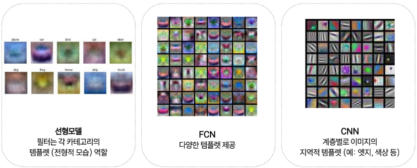

### 중첩과 수용영역
- CNN 레이어는 이미지 작은 부분인 **"지역 정보"** 를 추출하는데 유리하게 설계
- 이미지 활용하는 다양한 작업에서 이미지 전체(예: 맥락) 의미 파악이 필요 
따라서 "지역 정보 + 이미지 전체의 맥락"을 이해/활용하기 위한 설계가 필요함
- 수용영역이란?
  - CNN이 이미지를 처리하면서 한 번에 볼 수 있는 영역의 크기
  - 네트워크의 시야
  - 일반적으로 네크워크가 깊어질 수록 수용영역도 넓어짐 -> 폭 넓은 맥락 이해 가능
- 고해상도 이미지 처리시, 많은 레이어를 통과해야 함. 
연산, 비용, 학습 가능성 고려할 때 비실용적
- 실제 해법: 입력 사이즈를 줄여 모델에 입력함

  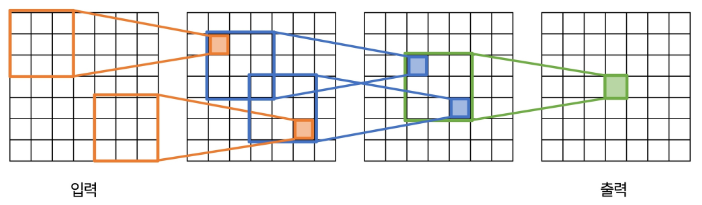

### 풀링: 효율적 연산 및 위치 변화의 강건성 확보
- CNN 레이어의 출력을 줄여 연산 효율성을 확보: 입력 크기가 줄면 CNN의 연산량이 크게 줄어듦.
- 예시: 2x2 풀링으로 입력의 해상도가 각각 1/2로 줄었을 경우

  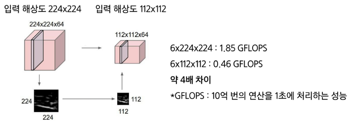

- 위치 변화 강건성: 입력 내 객체 위치가 다소 변해도 동일한 출력을 제공
- 사실상 저해상도 정보에 근거하여 작업 수행하므로 몇 화소 이동은 무시됨

  

- 맥스풀링: 정해진 커널 사이즈(예: 2x2)로 이미지를 나누어 각 영역 내 가장 큰 값을 선택하는 연산

  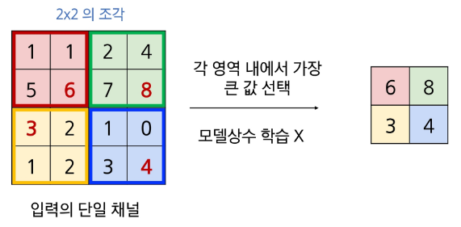

### 스트라이드 합성곱: 풀링 한계 개선
- 일반 합성곱: 필터를 1칸씩 이동하면서 연산 수행(출력값 계산)
- 스트라이드 합성곱: 필터를 스트라이드 값만큼(S칸) 이동한 후 출력 연산
- 효과: 풀링처럼 입력 해상도를 줄임(**연산 효율**과 **위치 강건성**)
  - 풀링 vs. 스트라이드 합성곱: 풀링은 **학습 상수가 없지만** 스트라이드는 **커널을 동시에 학습**
  - 스트라이드 합성곱은 해상도 저하로 인한 정보 손실이 적고, 풀링+ 합성곱을 하나의 레이어로 대체함
  - 고도화된 CNN에서는 스트라이드 합성곱을 풀링 대신 활용되는 경향

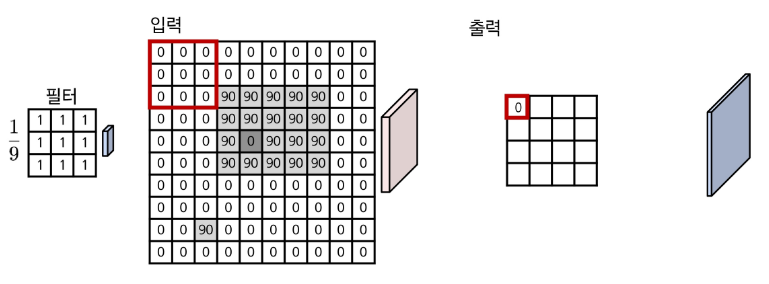

### 스트라이드 2의 사례

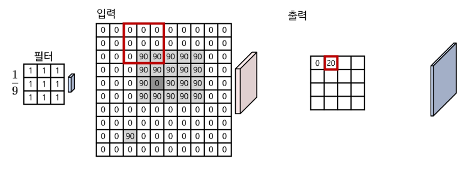

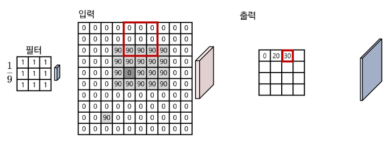

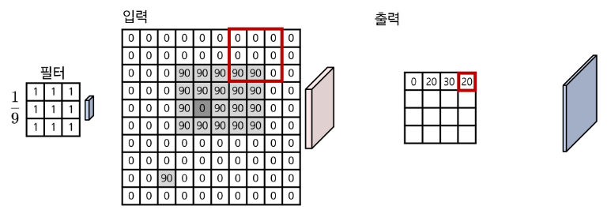

# 2. CNN 기반 모델 변천사

### 2010~2017년까지의 CNN 모델
- 세로축: 에러율(Error Rate, %), 낮을 수록 성능이 좋은 모델
- 가로축: (연도 & 모델명)

  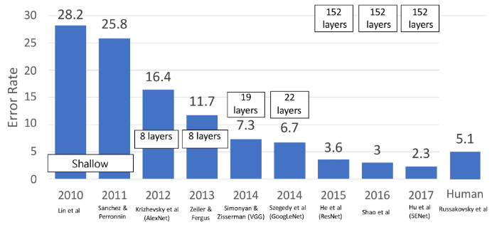

## 1. AlexNet

### 5개의 합성곱 계층과 3개의 완전연결 계층으로 구성된 8계층 CNN 모델

  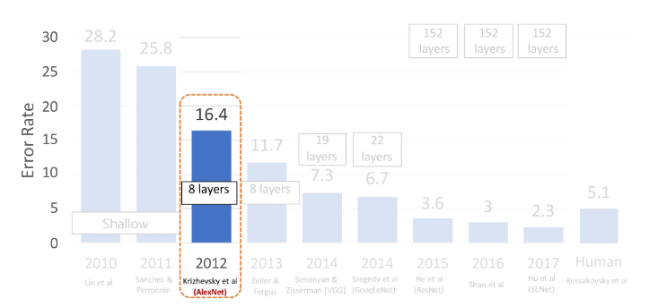

- 모델 구조 특징(8-레이어)
  - 5개 합성곱 레이어
  - 맥스 풀링
  - 3개 연결층 레이어
  - ReLU 비선형 활성화
- 입출력
  - 입력: 이미지 / 3 x 227 x 227 해상도
  - 출력: 레이블 / 1 x 1024 벡터
  - 학습 시 정답은 원-핫 벡터(원소 1개만 '1'이고 나머지는 '0'인 벡터)
  - 모델 예측값은 0~1 사이 확률 값
  - (ImageNet 기준, 각 클래스에 해당할 확률)

    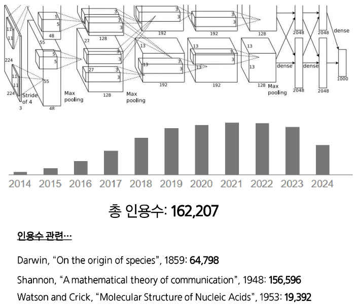

### Image input 224, 2*GPU
- 논문 그림에는 입력 크기가 224로 되어있으나, <u>227로 정정</u >되었음
- 당시 사용된 GPU는 GTX 580으로 메모리가 3GB밖에 되지 않아 2개의 GPU를 병렬 사용하였음 
-> Conv/FC 레이어를 GPU 2개에 분산 = 채널/뉴런 반씩 나눠 계산

  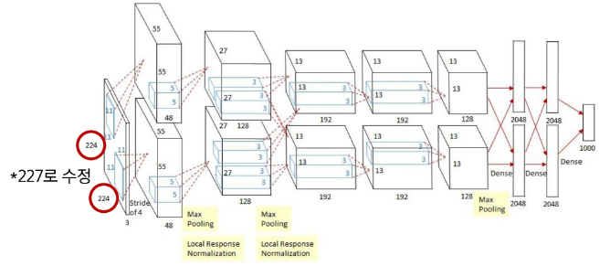

- 최신 GPU (예: NVIDIA RTX 3090, A100, H100 등) 24GB ~ 80GB VRAM 보유

  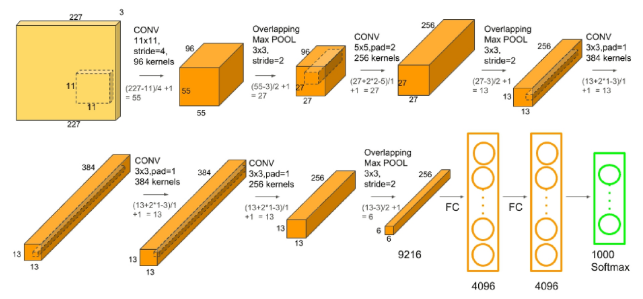

### AlexNet 단계별 구조
- 입력 (Input)
  - 크기: 227 x 227 x 3
  - RGB 이미지 (3채널)

    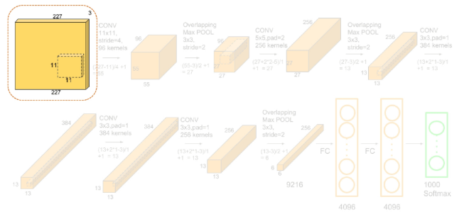

- 첫 번째 합성곱 층(Conv1)
  - Conv 11 x 11, stride=4, 96개 필터
  - 출력 크기: 55 x 55 x 96
  - 큰 필터와 큰 stride로 초반에 이미지를 강하게 줄이고 특징 추출 시작

    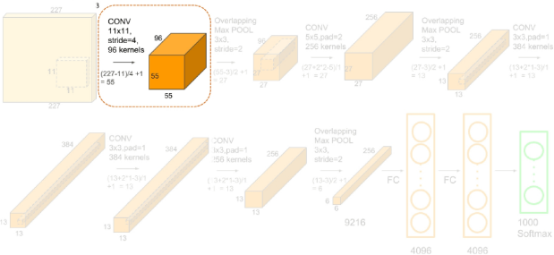

- 첫 번째 풀링층(Max Pool1)
  - Max Pool 3 x 3, stride=2(Overlapping Pooling)
  - 출력 크기: 27 x 27 x 96
  - 해상도 절반으로 줄이면서 중요한 특징만 남김

    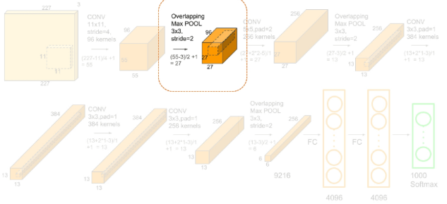

- 두 번째 합성곱 층(Conv2)
  - Conv 5 x 5, pad=2, 256개 필터
  - 출력 크기: 27 x 27 x 256
  - padding을 적용해 해상도 유지, 더 복잡한 특징 추출

    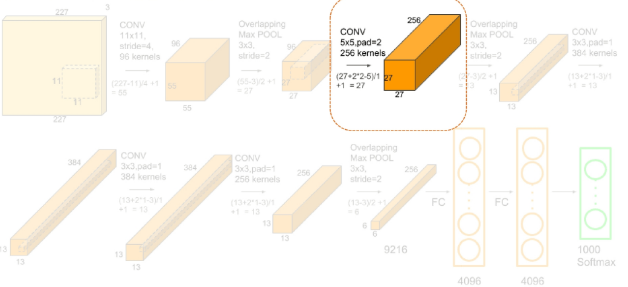

- 두 번째 풀링층(Max Pool2)
  - Max Pool 3 x 3, stride=2
  - 출력 크기: 13 x 13 x 256

    

- 세 번째 합성곱층(Conv3)
  - Conv 3 x 3, pad=1, 384개 필터
  - 출력 크기: 13 x 13 x 384

    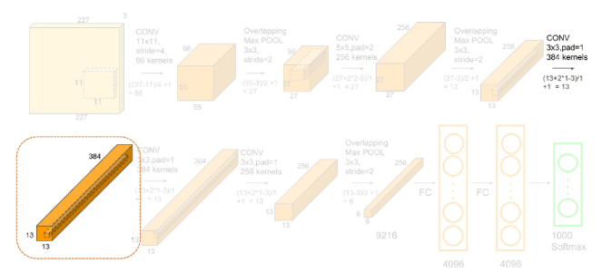

- 네 번째 합성곱층(Conv4)
  - Conv 3 x 3, pad=1, 384개 필터
  - 출력 크기: 13 x 13 x 384

    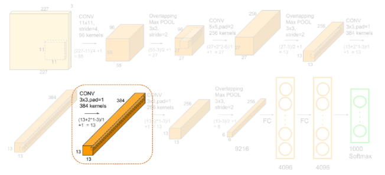

- 다섯 번째 합성곱층(Conv5)
  - Conv 3 x 3, pad=1, 256개 필터
  - 출력 크기: 13 x 13 x 256

    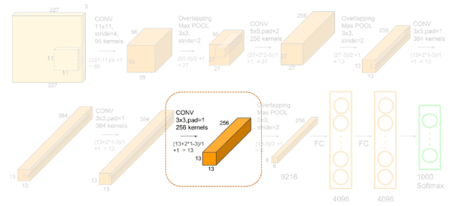

- 세 번째 풀링층(Max Pool3)
  - Max Pool 3 x 3, stride=2
  - 출력 크기: 6 x 6 x 256
  - 마지막 공간 축소 -> 이후 완전 연결층으로 연결하기 쉽게 함

    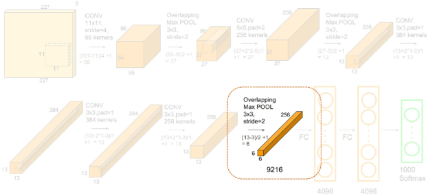

- 완전 연결층(FC Layers)
  - Flatten -> 벡터 크기: 9216(6 x 6 x 256)
  - FC1: 4096 뉴런
  - FC2: 4096 뉴런

    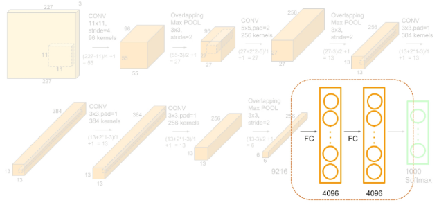

- 출력층(Output)
  - FC3 -> Softmax(1000 클래스)
  - ImageNet 1000개 클래스 확률 분포 출력

    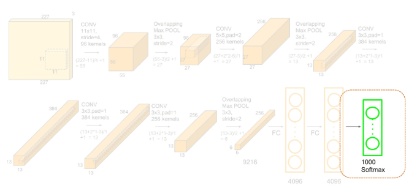

### AlexNet 출력 사이즈 계산법[Cov1]
- 출력 채널 수 = 현재 레이어의 필터(커널) 개수
- 출력 해상도 W' = {(W - K + 2P) / S} + 1

  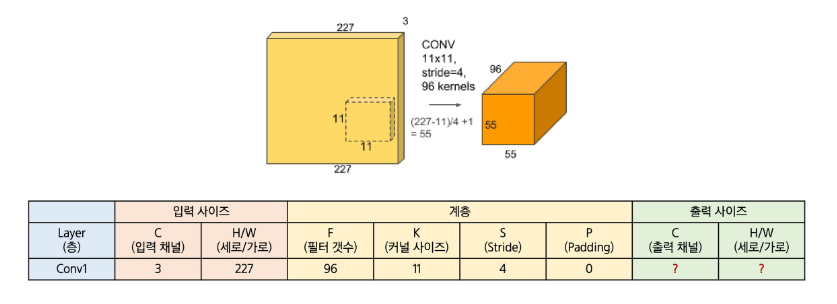

- 출력 채널 수 = 96
- 출력 해상도 W' = {(227 - 11 + 2 * 0) / 4} + 1 = 55

  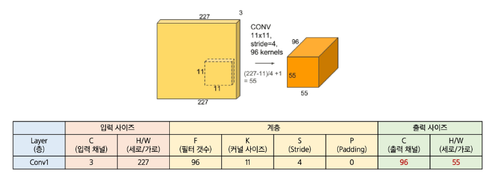

### AlexNet 연산비용 계산법[Cov1]
- 출력 활성 메모리(KB) = C * H' * W' = 96 * 55 * 55 = 290,400
- 출력값 메모리 사용 4 Byte -> 4 Byte * 290,400 = 1,161,600 Byte = 1,134 KB

  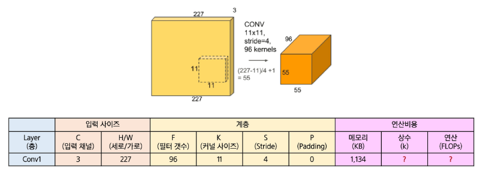

- 상수k (파라미터 수)
- 총 개수 = 출력 채널 수 x 입력 채널 수 x K ** 2(필터 웨이트) + 출력 채널 수(바이어스 웨이트) 
-> 96*3*11*11 + 96 = 34,944 (34.9K)

  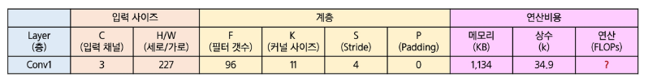

- FLOPs(연산량) = 총 연산(곱하기만 고려) = 출력 원소 수 x 출력 원소별 연산 
= (H' x W') x (C_in x K x K x C_out) 
-> (55 * 55) * (3 * 11 * 11 * 96) * 2 = 105,415,200 (105.4M FLOPs)

  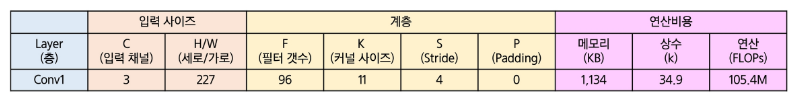

### AlexNet[2Groups]
- 당시 Conv2/4/5 에 그룹 합성곱 적용하여 연산량 ↓(2개의 GPU를 병렬)

  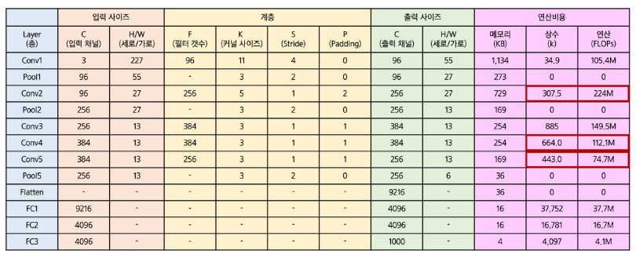

### Memory[1Group]
- 메모리 사용은 초기 레이어에 집중

  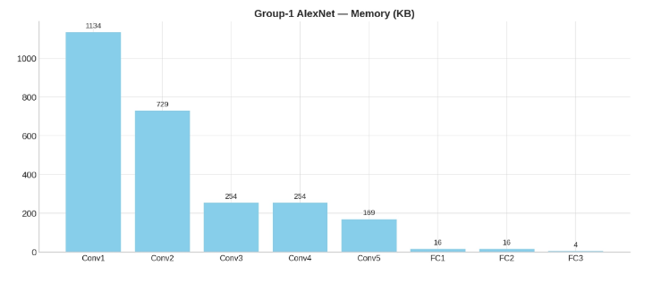

### Params[1Group]
- 모델 상수(K)는 연결층 레이어에 집중

  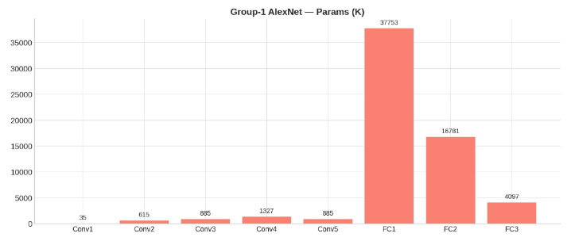

### FLOPs[1Group]
- 합성곱에서 주로 발생

  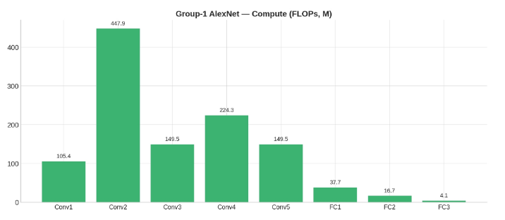

## 2. VGGNet

### 5개의 합성곱 블록 + 맥스 풀링 구조

  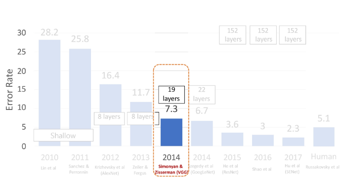

### VGG-16 기준
- 모델 구조 특징
  - 5개 합성곱 블록 (각 블록당 합성곱 - ReLU 구조가 반복)
  - 각 블록당 맥스 풀링
  - 3개 연결층 레이어
  - ReLU 비선형 활성화
  - 총 16개의 합성곱/연결층 레이어
  - 최종 소프트맥스 수행
- 입출력
  - 입력: 이미지 / 3 x 224 x 224 해상도
  - 출력: 레이블 / 1 x 1024 벡터

### 모델 비교
- AlexNet, VGG16, VGG19

  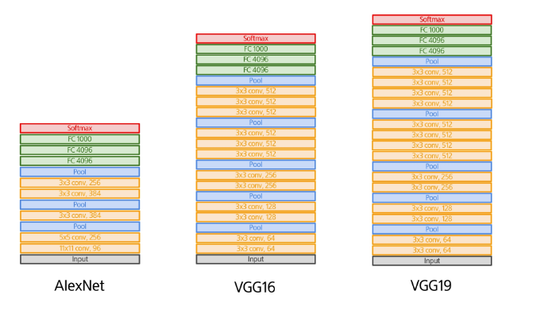

### VGG의 레슨
- 작고 단순한 필터를 깊게 쌓으면 성능 ↑ 
-> 새로운 설계 철학 제시

  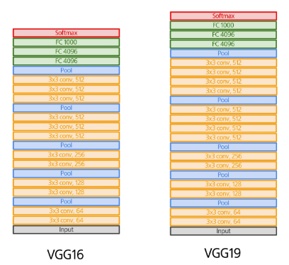

### VGG의 디자인 룰
- <u>3x3 합성곱/스트라이드1/패딩1</u> 반복 적용
- 맥스풀링(2x2)으로 크기 줄이기
- <u>풀링 후, 채널 크기 2배 적용</u>
  - 3x3 합성곱 두 개를 연달아 적용하면 5x5 합성곱과 동일 리셉티브 필드 확보 
  -> 그럼에도 연산량을 크게 줄일 수 있음

    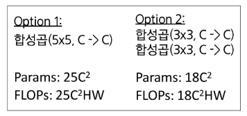

    

### AlexNet vs VGGNet: VGG는 거대한 모델
- 메모리(Memory) 비교
- AlexNet(1.9MB) vs VGG-16(48.6MB) 약 25배

  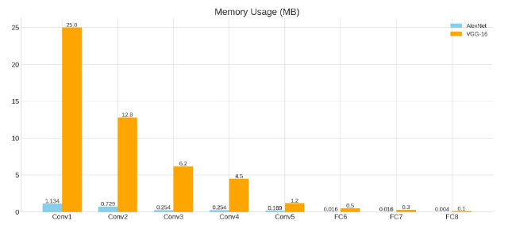

- 모델 상수(Parameters) 비교
- AlexNet(61M) vs VGG-16(138M) 약 2.3배

  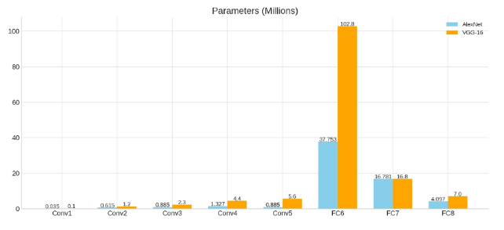

- 연상량(Compute) 비교
- AlexNet(0.7GFLOPs) vs VGG-16(13.6GFLOPs) 약 19.4배

  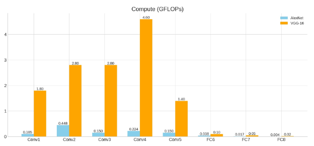

### 모델 특징
- 단순함 + 깊이의 강력한 성능을 보임
- 단순 설계로 모델 해석에 이상적
- 특징 추출기, 전이학습에 강력한 베이스라인
  - 파라미터가 많고 연산량 요구가 매우 큼

## 3. ResNet

### 합성곱 블록(VGG 유사)과 잔차(Residual) 블록

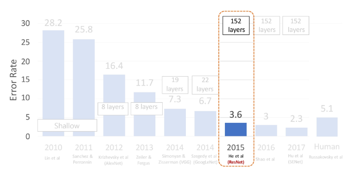

### 모델 구조 특징(ResNet-50 기준)
- 합성곱 블록(VGG 유사)과 잔차(Residual) 블록
- 잔차 블록은 블록입력을 그대로 출력에 더해주는 지름길 연결이 특징
- Inception 모델에서 차원 축소로 활용된 1x1 합성곱을 적용, 연산 효율 개선
- 입출력
  - 입력: 이미지 / 3 x 224 x 224 해상도
  - 출력: 레이블 / 1 x 1024

### ResNet의 등장 배경
- 배치 정규화 방식으로 10+ 레이어 학습 기능
  - 20-layer 모델: 학습이 안정적으로 진행되며 에러가 꾸준히 감소
  - 56-layer 모델: 더 깊음에도 불구하고 training error가 오히려 높음
- 깊다고 무조건 더 잘 학습되는 것은 아님(Degradation problem)

  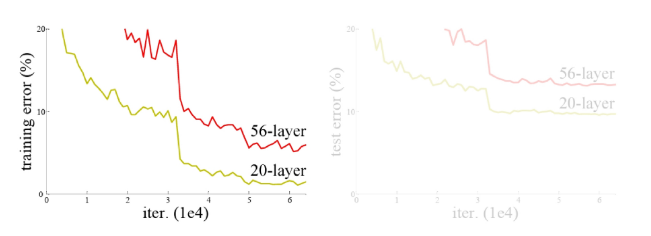

- 20-layer 모델: Test error가 점진적으로 낮아짐
- 56-layer 모델: Test error가 더 높게 유지됨
  - 단순히 레이어를 깊게 하면 오히려 성능이 떨어짐

    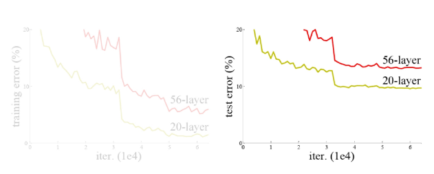

### ResNet의 아이디어
- 배치 정규화 방식으로 10+ 레이어 학습 가능
- 작은 모델 (10+레이어)의 성능은 "최소한" 누릴 수 있도록 작은 레이어의 추정값(입력값)을 그대로 후속 레이어에 제공하여 최소한 작은 레이어 수준의 성능은 보장 
-> Residual Block(잔차블록)의 핵심 아이디어

  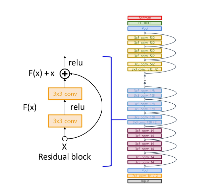

### Residual Block(잔차블록)
- 입력 X가 두 경로로 나뉘어 전달됨
  1) 변환 경로 (F(x)) 
  -> Conv(3x3) -> ReLU -> Conv(3x3) -> ReLU -> 출력 F(x)
  2) Shortcut 경로 (Identity mapping, 잔차 연결) 
  -> 입력 X를 그대로 전달
- 마지막에 두 값을 더함: Output = F(x) + x
- 만약, 학습이 잘 안 된다면 F(x) ≒ 0 이 될 수 있고 출력은 x가 됨 -> 최소 성능 보장

  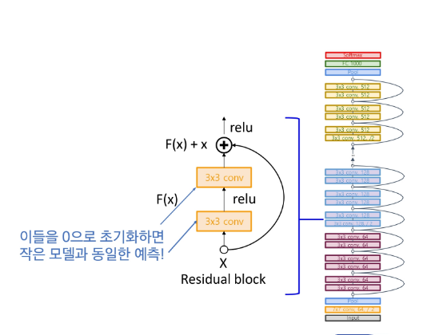

### ResNet 잔차블록 (깊게 보기)
- Plain Residual Block(일반 잔차 블록) vs Bottleneck Residual Block(보틀넥 잔차 블록)
- 연산 효율을 위해 보틀넥 잔차구조를 도입 
-> FLOPs 비교: 18HW(C^2) vs 17HW(C^2)

  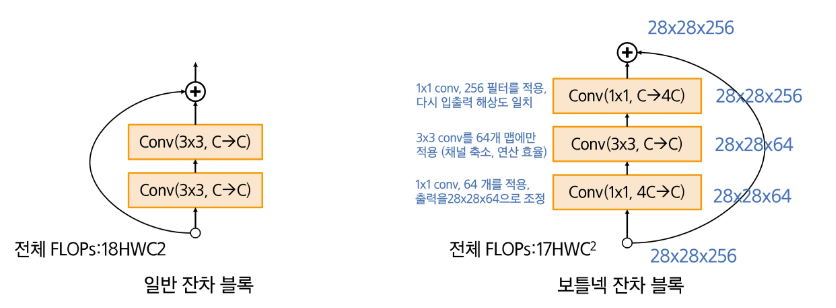

- 왜 보틀넥 잔차? 더 깊은 모델을, 더 적은 연산으로 달성

### Stem 구조
- 기존 모델의 효율성 레시피를 잘 활용
  1) 스템 구조를 모델 초기에 도입, 입구 데이터 해상도를 1/4로 줄이고 이후 잔차 블록 적용

    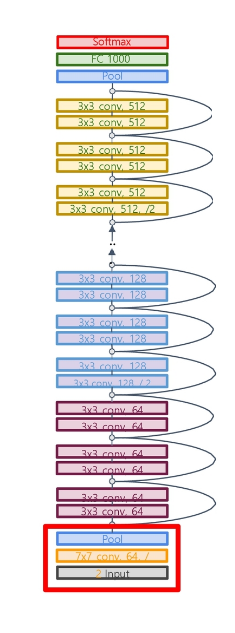

  2) 여러 개의 FC 레이어를 제거하고(Google LeNet에서 제안) 전역 평균 풀링을 사용 -> 마지막 1개 FC만 적용

    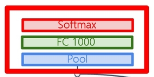
  
### ResNet-18과 ResNet-34

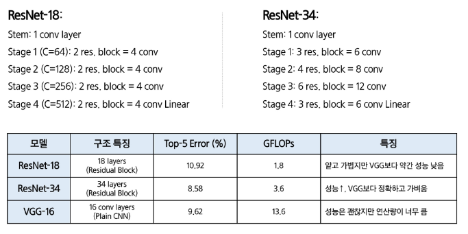

### 다양한 조합
- ResNet-34와 ResNet-50 차이는 Basic 잔차 블록 vs 보틀넥 잔차 블록 사용의 여부에 있음
- ResNet-50은 지금도 활발히 사용되는 CNN 기반 강력한 베이스라인

  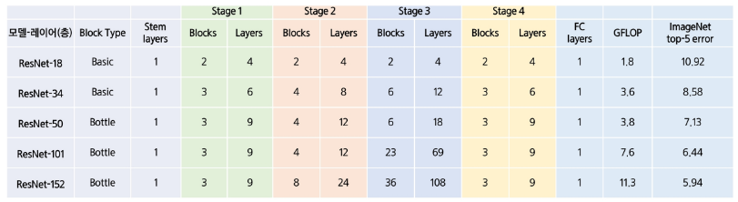

### 잘 알려진 ResNet 학습 레시피
- 모든 Conv 레이어 적용 시 배치정규화 수행
- Xavier 초기화(He 초기화) 적용 / 그레디언트 소실 문제 다룸
- SGD + 모멘텀 (0.9) 사용
- 학습 비율 0.1 적용, 단 Val 오류가 정체되면 1/10로 비율 축소
- 미니 배치 사이즈는 256 사용
- 웨이트 디케이 1e-5
- 드롭 아웃 미사용

### 최종 요약
- 깊은 모델 학습을 위한 중요한 전진 (100+레이어 학습 가능)
- 깊은 모델의 강력함을 다시 확인
- 제안 당시 모든 벤치마크에서 최고 성능 달성
- 지금도 CNN 기반 구조 중 가장 활발하게 활용

  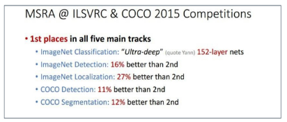

## 4. MobileNet

### 목표: 모바일/임베디드 환경에서 구동 가능
- 기존 합성곱은 공간(HxW)와 채널(C)를 동시 처리하여 연산량이 과도하게 요구됨
- MobileNet의 핵심 아이디어: 공간과 채널을 두 단계로 분리하여 처리
  - 깊이별 합성곱: 각 채널별 독립적 3x3 합성곱 수행
  - 화소별 합성곱: 1x1 합성곱을 채널 방향으로 적용
- 효과
  - 연산량 기존 대비 9배 가량 절감
  - 모델 상수 대폭 감소

### 깊이별 합성곱/화소별 합성곱 예시

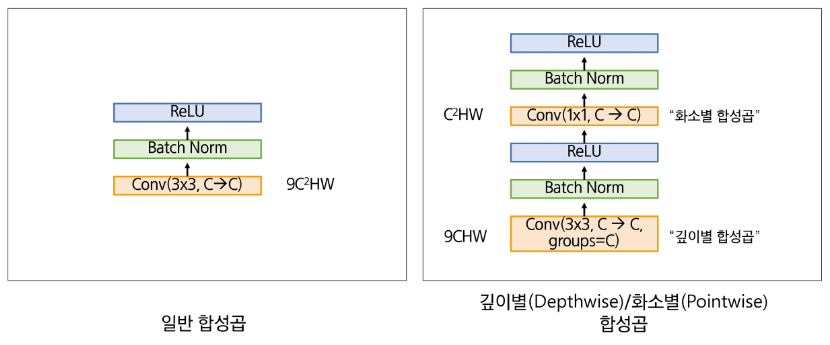

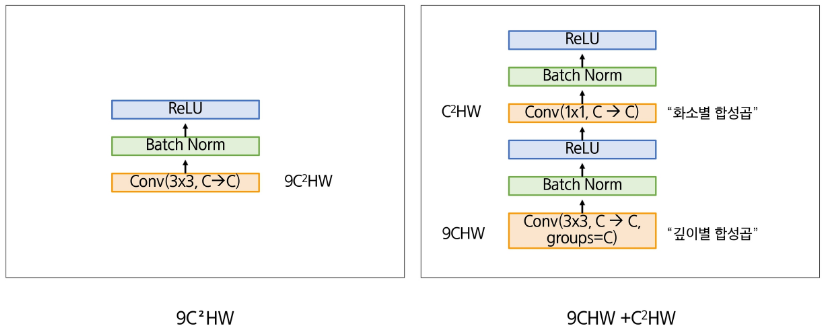

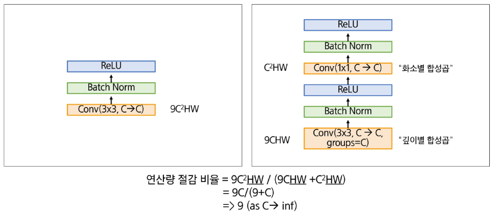

### 이후 모델에 영향력
- 가볍고 빠른 모델로 엣지 디바이스에서 딥러닝 모델 실시간 실행 가능함을 보임.
- 효율형 모델 구조의 표준 제시: 깊이별 합성곱과 보틀넥 구조가 이후 경량 모델에서 지속적으로 채택

---
# 1. CNN의 한계

## 1. CNN 구조의 장점

### 합성곱 구조의 특성
- 지역적인 특징 학습에 특화: 작은 필터로 학습하여 패턴/경계선 특징 포착 용이
- 파라미터 효율성 우수: 지역적 특징 추출 시 이미지 블록별 가중치를 공유하여 연산량 절감
- 위치 변화와 노이즈에 견고: Pooling/Stride 합성곱이 세부 차이는 줄이고 이미지 전체 의미에 집중하게 함
- 이미지 분류/탐지 등 이미지 기반의 과업에서 표준 모델로 활약

  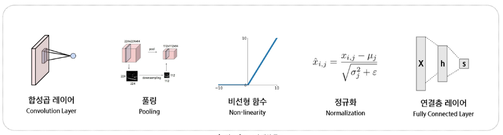

## 2. CNN의 핵심 한계

### CNN은 데이터 순서(order)를 무시
- 한계: 순차적(sequential) 데이터의 순서 정보(텍스트/음성의 시간 흐름 등)를 반영하기 어려움
- 예시
  - "약을 먹고 잠을 자고" vs "잠을 자고 약을 먹고": 같은 단어여도 순서가 의미를 바꾼다면?
  - "I am a boy not a girl" vs "I am a girl not a boy": 단어 조합은 같지만, 순서가 바뀐다면?

    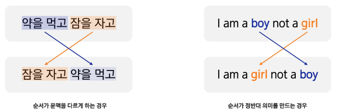

### 긴 거리 의존성 고려 부족
- 한계: CNN은 국소적(로컬) 특징 추출에 강하지만, 이미지나 문장에서 멀리 떨어진 요소 간의 관계를 잘 학습하지 못 함.
- 이미지 예시
  - 이미지 특성상 반복되는 패턴들이 발생: 멀리 있지만 반복되는 패턴

    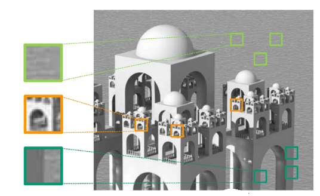

### 픽셀 단위 복원 한계
- 한계: CNN은 이미지 전체의 정보를 압축(예: 라벨)에 효과적이지만, 위치 정보는 손실됨(Pooling/Stride 효과) 
-> 픽셀 단위 복원(예: 세그멘테이션)이나 영상 생성(생성, 편집, 개선 등) 문제를 다루기 위한 **새로운 구조가 필요**

# 2. 시퀀스 데이터 처리: RNN

## 1. RNN(Recurrent Neural Nets)

### 순차적(sequential) 데이터를 처리하기 위해 고안된 신경망 구조
- 순차적 정보 반영: 이전 단계 데이터를 은닉 상태(hidden state)로 다음 단계에 전달 
-> 시간/순서의 흐름을 반영할 수 있다.
- 시계열/언어 데이터 적합: 문장, 음성신호, 센서 데이터 등 시계열 데이터 처리에 관한 강력한 귀납 편향 제공
- 예시: 문장 생성

  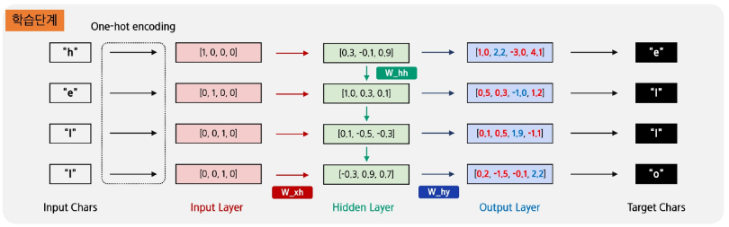

  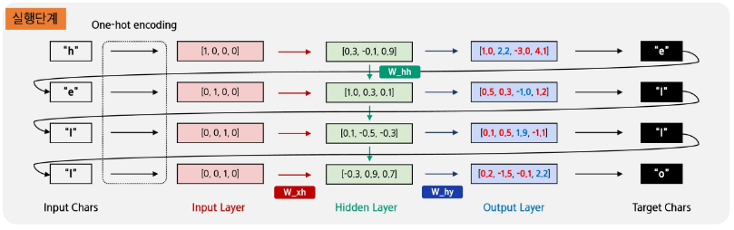

### Input Chars
- 학습하려는 문장의 문자열들
- 각 문자를 숫자로 표현하기 위해 'One-hot encoding' 같은 방식으로 변환되어 Input Layer로 들어감

  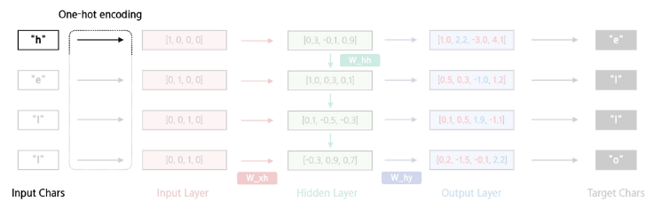

### Input Layer
- 1과 0으로 된 벡터, 길이는 알파벳 집합 개수와 동일
- RNN이 문자를 수치적으로 다룰 수 있게 각 문자를 벡터화(One-hot 벡터) 한 것
- W_xh: 입력 -> 은닉 변환

  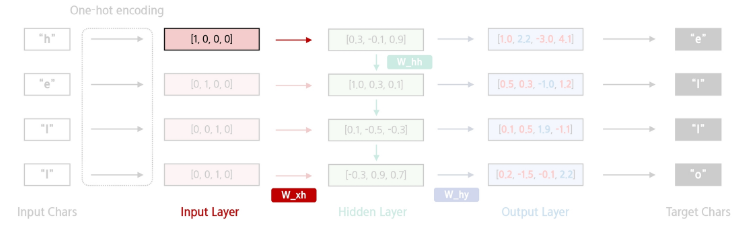

### Hidden Layer
- 현재 입력(Input) + 이전 상태의 은닉상태를 합쳐 만든 내부 메모리
- Hidden state가 바로 "이전까지의 문맥(Context)"을 담고 다음 단계로 전달
- W_hh: 이전 은닉 -> 현재 은닉

  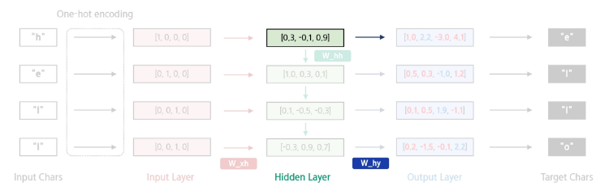

### Output Layer
- Hidden state를 출력 벡터로 변환한 것
- 각 숫자는 다음 문자가 될 확률을 계산하기 위한 점수
- W_hy: 은닉 -> 출력 변환

  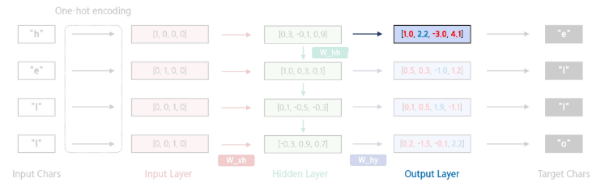

### Target Chars
- 각 시점에서 예측해야 하는 정답 문자
- 이 정답과 Output Layer 확률을 비교한 오차로 가중치 업데이트

  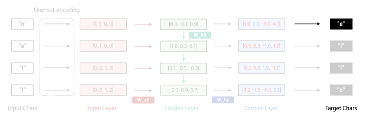

  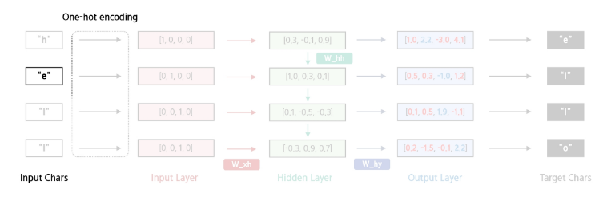

  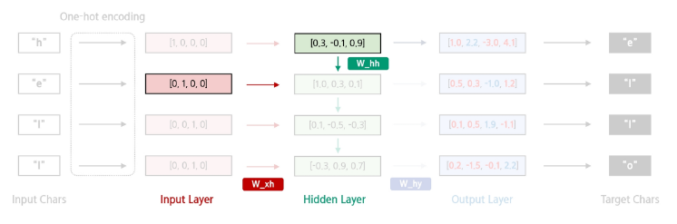

  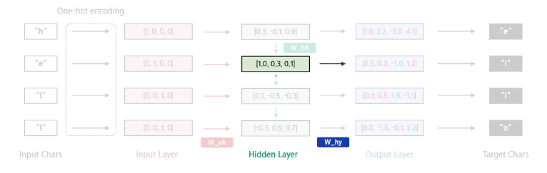

  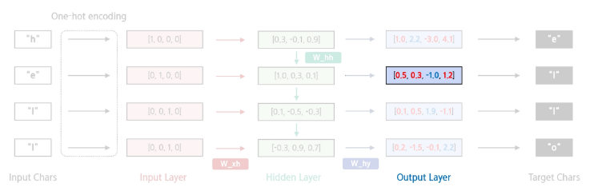

  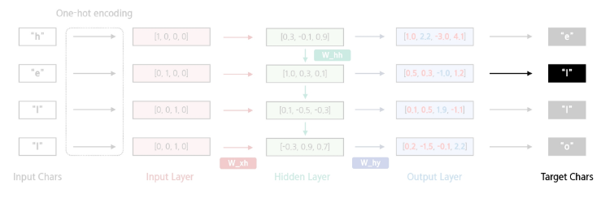

### RNN 셀
- 은닉층에서 활성화 함수를 통해 결과를 내보내는 역할
  - x: 입력층의 입력 벡터
  - y: 출력층의 출력 벡터
  - cell: 이전의 값을 기억하려고 하는 일종의 메모리 역할을 수행
- 은닉 상태(hidden state): 메모리 셀이 출력층 방향 또는 다음 시점인 t+1의 자신에게 보내는 값

  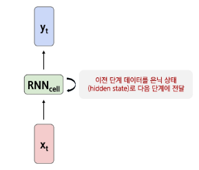

### RNN 표현 방식
- 재귀(왼쪽) == 사이클(오른쪽)

  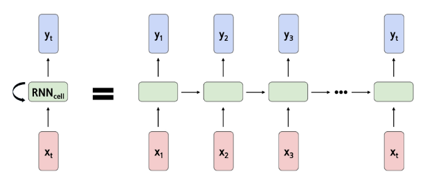

### 시계열 의존성
- h_t 가 이전 상태 h_(t-1) 에 의존하고 있음.
- 데이터의 시계열 특징을 반영하는 모델이나, RNN 상수는 시계열(혹은 순서)에 무관, 동일하게 학습됨.

  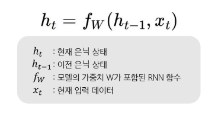

### 순수(vanilla) RNN
- 선형변환, 바이어스를 모델상수/비선형(tanh) 함수 추가로 구성된 단순한 형태
- 은닉 상태 계산
  - h_t: 현재 은닉 상태
  - h_(t-1): 이전 은닉 상태
  - x_t: 현재 입력 테이터

    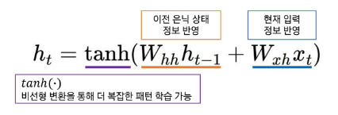

- 출력 계산
  - 은닉 상태를 기반으로 최종 출력 생성 (예: 다음 문자 예측)

    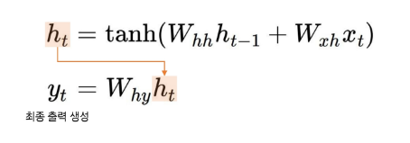

### RNN 입출력 구조
- One-to-Many: 하나의 입력에서 시간축으로 출력이 생성
- Many-to-One: 여러 시점 입력이 하나의 출력으로 압축
- Many-to-Many: 입력과 출력이 시간축을 따라 1:1 혹은 n:m으로 맵핑

  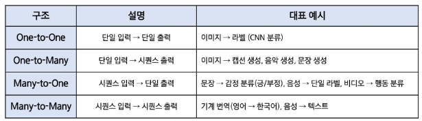

### 그래프 시각화
- 초기 은닉 상태: h_0
- 입력: 첫 번째 시계열 데이터/시퀀스 데이터

  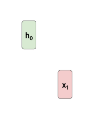

- 동일 함수(f_W)를 모든 시퀀스에 적용

  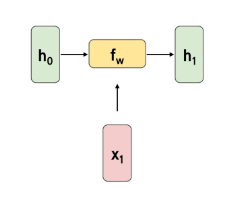

- 반복 적용

  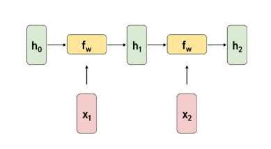

- 최종 은닉 상태 -> 출력

  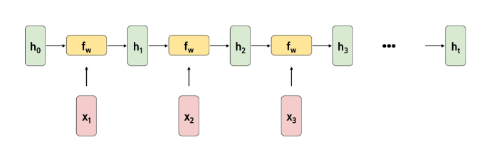

- W 학습: 역전파 시 모든 은닉 상태에 발생한 기울기를 **더하여** 연산
- 시퀀스 입력 - 단일출력

  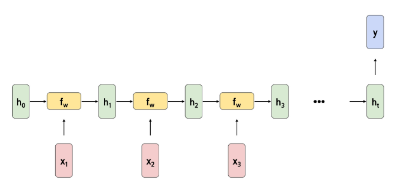

- 단일 입력 - 시퀀스 출력

  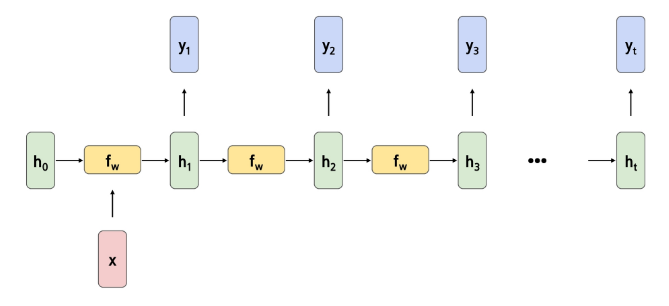

- 시퀀스 입력 - 시퀀스 출력

  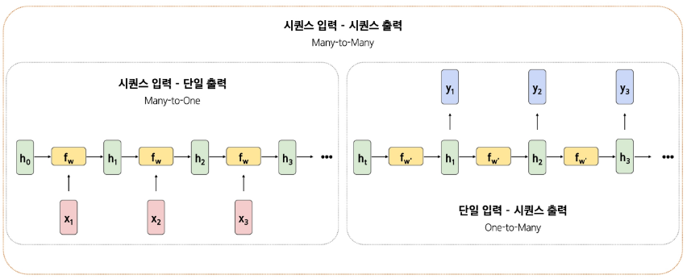

### 예시
- 언어 생성
  - 단위 데이터: [h, e, l, o]

    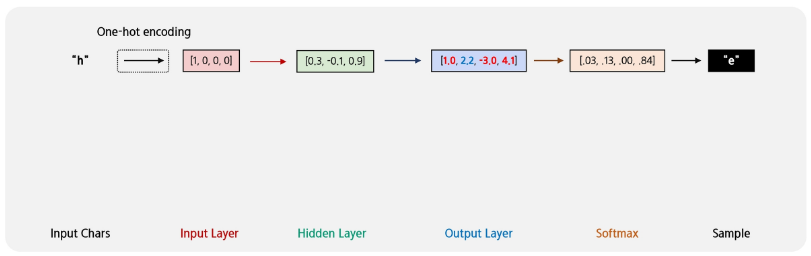

    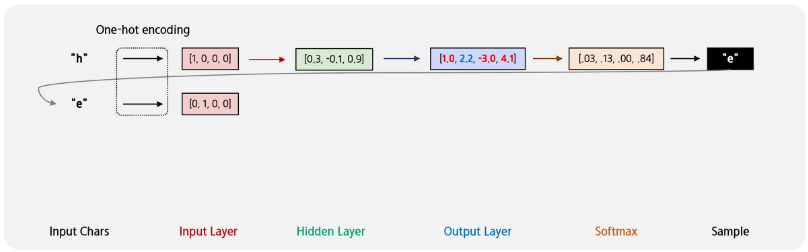

    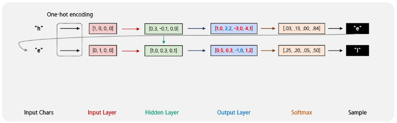

    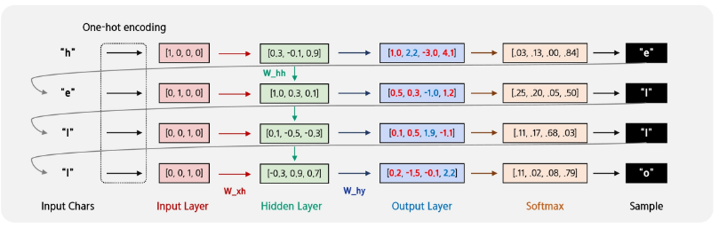

## 2. 단순 RNN의 한계

### 기울기 폭발 혹은 소실 발생
- 역전파의 시퀀스 데이터가 적용되면서 선형가중치 W가 기울기 계산 시, 계속 곱셈으로 반영됨.
- |W|의 특이값 ↑ -> 곱할 수록 무한히 커짐 -> 기울기 **폭발**
- |W|의 특이값 ↓ -> 곱할 수록 0에 수렴 -> 기울기 **소실**
- 이상적으로 W의 특이값 1이면 온전한 학습 가능

  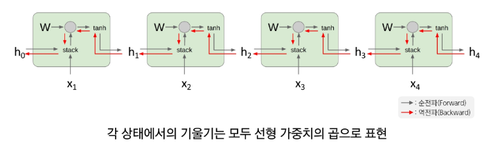

### 강제 절삭
- 폭발하지 않도록 기울기 값을 절삭할 수 있음
- 그러나 결국 잘못된 기울기 값을 양산하는 문제
- 기울기 소실은 해결 불가 -> 다른 모델

## 3. 대안 모델

### LSTM(Long Short-Term Memory)
- Long Short-Term Memory: 셀 상태, 게이트 유닛으로 구성
  - 셀 상태(Cell state): 중요한 정보를 유지/기억하는 역할
  - 게이트(Gate): 정보의 흐름을 제어 
  (예: 입력은 얼마나 저장, 과거 정보는 얼마나 버릴지, 셀 상태를 얼마나 은닉정보에 반영할지)
  - 구동철학: 긴 시퀀스 데이터에서 필요한 정보는 유지, 불필요한 정보는 지워 안정적 학습 유도

    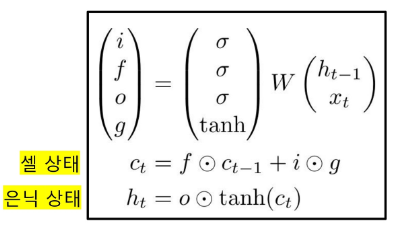

  - 입력 게이트 (i): 새로운 정보의 저장 -> 새로운 정보를 적절히 추가해 학습 안정화
  - 망각 게이트 (g): 과거 정보를 제거 -> 필요 없는 정보는 줄여 셀 상태가 폭발하지 않도록 제어
  - 출력 게이트 (o): 셀 상태를 현재 은닉 상태로 출력 -> 필요한 정보만 은닉 상태로 전달

    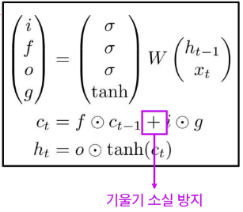

- 셀 상태(Cell state[C])라는 새로운 모듈을 도입
- 기울기 전파 시 선형가중치의 곱 이외에 **덧셈 형태로 전달하여 기울기를 장기적으로 보존** 가능

  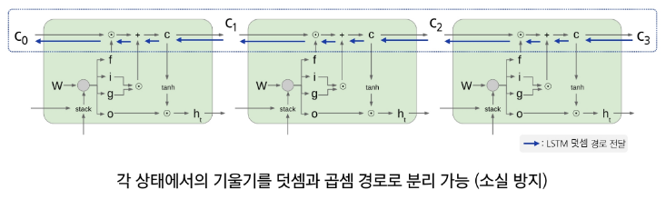

  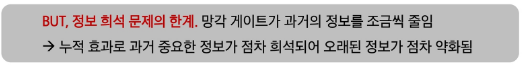

# 3. 긴거리 의존성: 어텐션/ViT

## 1. 어텐션 메커니즘

### 이미지를 통해 어텐션 메커니즘 이해하기
- 픽셀 거리와 상관없이 유사한 패치가 이미지에 존재
  - 패치(Patch): 이미지를 일정 크기로 잘라낸 작은 조각 단위

    

  - 관련 **높은** 패치/관련 **낮은** 패치 정보를 최종 결정에 반영하자
    - 쿼리(Q): 집중하려는 대상
    - 키(K): 다른 패치
    - 값(V): 키 패치의 정보
    - 어텐션(a): 쿼리와 키의 유사도(확률 분포 형태)
    - 출력(o): 어텐션으로 가감된 값의 총합

      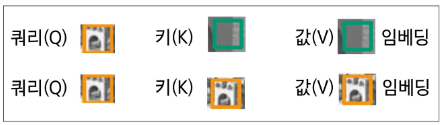

### 이미지에서 해석
- 쿼리(Q): 질의 대상(입력 토큰/입력 이미지 패치)
- 키(K): 특성(입력 내 기타 토큰)
- 값(V): 키의 실제 정보
- 어텐션(a): 쿼리와 키의 유사도(확률 분포 형태)
- 출력(o): 어텐션으로 가감된 값의 총합

  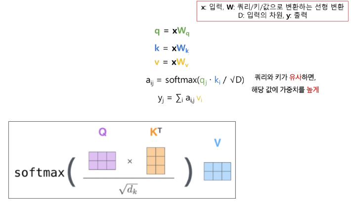

### 자기 어텐션(Self-Attention)이란
- 하나의 입력 안에서 패치 정보(쿼리/키/값)을 정의
- 같은 이미지 내 유사도(쿼리와 키 간 유사도) 반영
- 입력 내부 패치간 연결망 구축 -> 클러스터링 효과
  - 클러스터링(Clustering): 서로 비슷한 특성의 패치끼리 모여 그룹 형성

    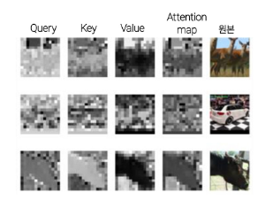

### 교차 어텐션(Cross-Attention)이란
- 둘 이상의 이종 데이터에서 패치 정보(쿼리/키/값)을 정의
  - 예시: Text-To-Image 모델에서 이미지-텍스트 간 연결
  - 쿼리(Q)는 이미지 패치, 키(K)는 텍스트, 텍스트 키의 정보
- 이종 데이터 간 유사도(쿼리와 키 간 유사도) 반영
  - 쿼리와 키를 비교할 수 있는 공간 필요
- 서로 다른 입력간 연결망 구축

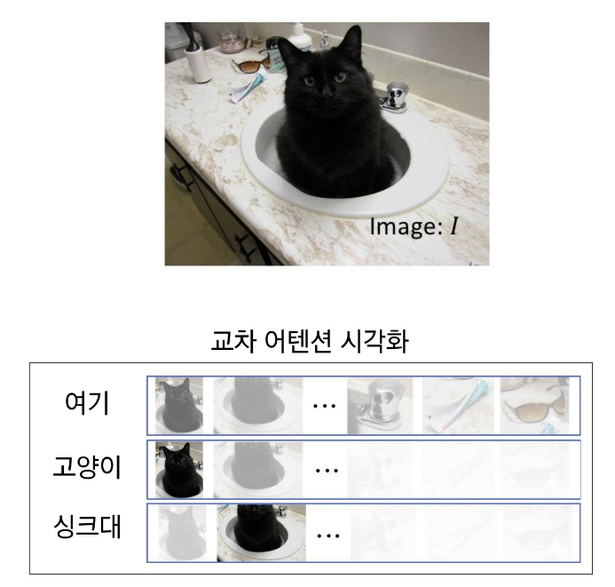

## 2. Vit 위치 인코딩

### 모델 별 특성 정리

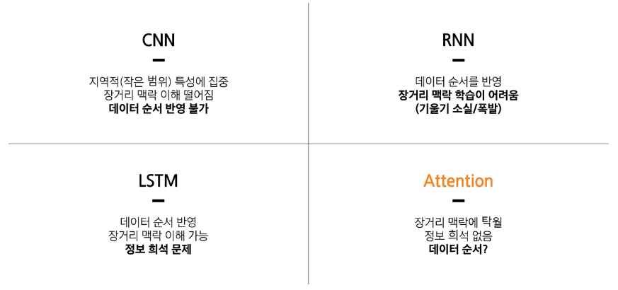

### 패치 순서(위치) 정보 제공
- 각 입력 토큰에 위치 정보를 담은 벡터를 추가
  -  이 패치가 이미지 (2,2)에 위치함을 이해 가능

### 학습 가능한 위치 인코딩
- 데이터에 알맞게 최적화
  - (+) 데이터 해상도가 바뀌어도 동일한 룰 적용
  - (-) 해상도가 바뀌면 다시 학습 필요

    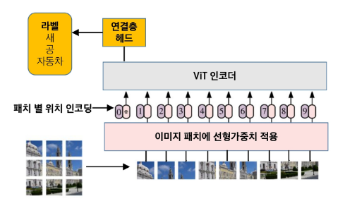

### 사인파 인코딩
- 데이터에 알맞게 최적화
  - (+) 데이터 해상도가 바뀌어도 동일한 룰 적용
  - (-) 고정이라 데이터/과업에 특화된 방식이 아님

### 상대 위치 인코딩
- 절대 위치가 아닌, 상대적 위치를 인코딩
  - (+) 데이터 해상도가 바뀌어도 동일한 룰 적용
  - (-) 절대적 위치(예: 좌우 코너) 고려가 어려움

### 인코더 내부 구조
- 정규화 - 다중헤드 어텐션 - 정규화 - 연결층으로 구성
  - 정규화(Normalication): 입력을 균일하게 맞춤
  - 다중헤드 어텐션(Multi-Head Attention): 여러 관점에서 패치 간 관계를 학습   
  (예시: 어떤 패치는 형태, 다른 패치는 색, 또 다른 패치는 위치)
  - 연결층(MLP): 어텐션 정보를 조합, 변환해 더 풍부한 특징 생성
- 인코더 L개 통과 (일반적으로 12개 이상)

### 전역 관계 학습
- CNN: 지역적 영역에서 수용영역을 넓혀 전역 이해
- ViT: 수용영역을 넓히지 않아도 전역 맥락 이해 가능

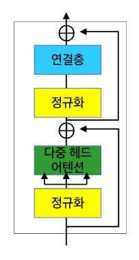

### 이미지를 이미지 토큰 집합으로 변환
- 위치 인코딩으로 패치 토큰의 순서를 학습에 반영

### ViT 인코더
- 정규화 - 다중헤드 어텐션 - 정규화 - 연결층으로 구성

### 최종 출력
- MLP head - 최종 예측 수행

### ViT가 늘 CNN 모델보다 좋을까?
- ImageNet의 경우, ResNet 성능이 더 우수
- ImageNet-21K에서 사전 학습하고 ImageNet 미세 조정한 경우, Vit도 우수

### Vit는 거대 데이터세트 사전학습 시 우수
- JFT-300M은 300M개의 표기된 데이터세트(거대)
- JFT 사전학습, 이후 ImageNet 미세조정하는 경우, Vit 성능이 확실한 개선을 보이기 시작

  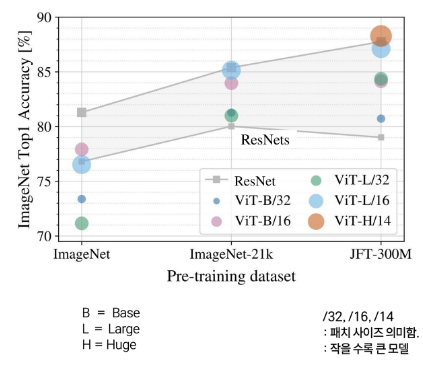

### ViT 학습 기술이 중요
- 막대한 상수를 보유
- 정규화 기법/데이터 증강 기술이 매우 중요

  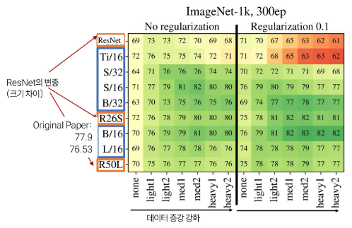

### 증류학습 기술이 효과적 (DeiT 2021)
- 증류학습 방식

  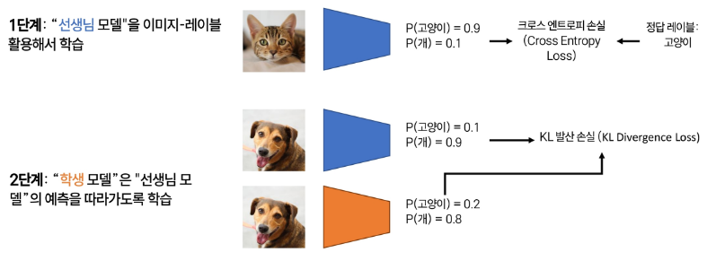

  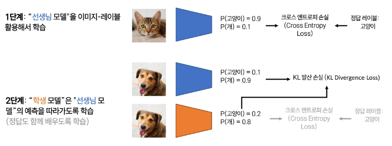

  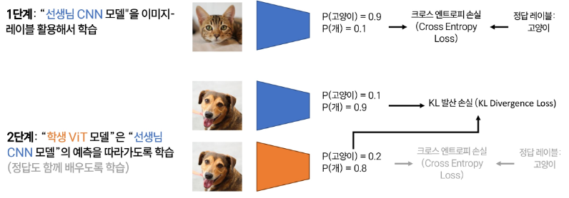

  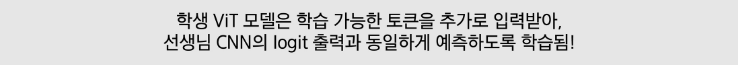

- 상당한 개선 효과 확인

  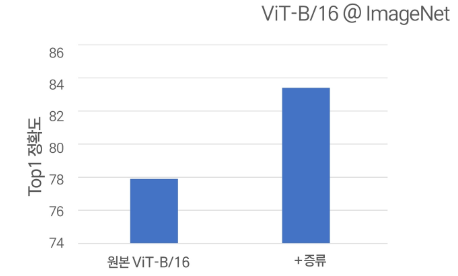

  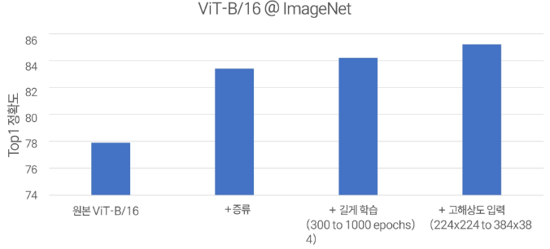

### 다양한 변종이 존재
- CNN처럼 이미지의 계층적 이해를 활용할 수 없을까?
  - Swin Transformer: 이미지 전역에 직접 어텐션 수행하는 것은 너무 고비용, 비효율
    1) 윈도우 영역을 지정, 그 내부의 어텐션에 집중
    2) 윈도우를 비껴가게 한 번 더 설정
  - 1, 2가 중첩되면서 최종적으로 이미지 전역을 고려하는 효과

    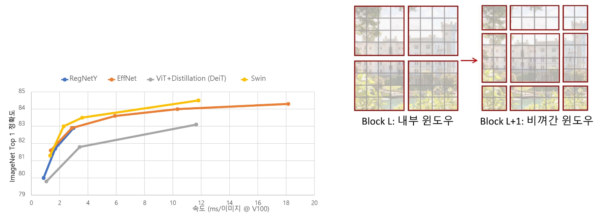

    

### Vision 백본 vs 데이터 확장성 vs 멀티모달 모델
- 그렇다면 현존 최고의 구조는 무엇일까?
  - 기준에 따라 다름
- Vision 백본: **ViT-22B** (220억 상수) - 구글 리서치
  - 지도학습 채택: 대규모 비공개 레이블 데이터 기반 (JFT-3B)
  - 일반화 성능이 우수/모델 상수 비공개 (재현불가)
- 자기지도 Vision 백본: **DINOvs** (최대 10억 상수) - 메타 AI
  - 공개 웹 데이터 기반 14억장 이미지 활용
  - 비지도 학습 채택: 자기지도 학습 - 대조학습/종류
  - 공개 모델, 현재 가장 많이 활용되는 백본

    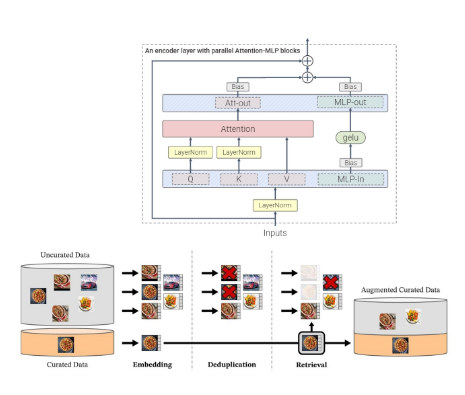

- 범용 시각 모델: **InternImage-H - 상하이 AI Lab
  - 대규모 지도 학습 채택
  - Conv+Transformer 하이브리드 백본
  - 탐지/분할에서 최고 수준 성능 달성
  - 모델/코드 공개

### ViT 장단점
- 장점
  - 전역 문맥을 한 번에 고려 가능
  - 시계열/시퀀스 데이터의 경우, 순서 고려 가능(위치 인코딩)
    - 순서 없는 데이터의 경우, 선별 제거도 가능
- 단점
  - 대규모 학습 자원 필요
    - 대규모 데이터 및 GPU 자원이 요구(메모리)
  - 학습 데이터 규모가 작을 경우, CNN보다 성능 저하
  - 한 번에 고려할 수 있는 토큰이 제한적
- 활용
  - 이미지 분류/탐지/분할/생성에서 모두 SoTA 성능 달성
  - 멀티모달 모델에서 기준 아키텍처
  - 기준모델에 활용 중

---
# 1. 학습 전략의 중요성

## 1. 모델 구조

### 지난 1차/2차 강의 내용 요약
- CNN 구조와 발전 (AlexNet -> ResNet -> MobileNet)
- CNN의 한계 -> RNN, Transformer (ViT)

  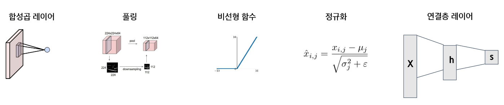

## 2. 좋은 모델 구조 = 우수한 성능?

### 좋은 구조만으로는 성능 보장 불가
- 동일한 구조, 동일한 데이터셋을 사용해도 성능 차이가 크게 남
- 이유: 학습 과정에서 발생하는 불안정성, 과적합, 수렴 속도 문제

### 학습에서 자주 겪는 문제들
- **학습 불안정**: 손실 폭발, 학습 멈춤, 수렴 실패
  - 손실 폭발: 학습 과정에서 손실 값이 급격히 커져 모델이 수렴하지 못 하는 현상
  - 학습 멈춤: 손실 값이 더 이상 줄지 않고 학습이 정체되는 상황
  - 수렴 실패: 최적의 값에 도달하지 못 하고 학습이 무의미하게 끝나는 현상
- **과적합**: 훈련 데이터에는 맞지만 검증/실전 성능 저하
  - 원인: 데이터 부족, 모델 복잡도 과다, 정규화 부족 등
- **느린 수렴**: 최적점에 도달하기까지 불필요하게 많은 에폭 소모로 인한 학습 효율 저하

## 3. 학습 전략

### 본 강의의 해결 방향
- 구조 설계만큼 중요한 훈련 전략 제시
- 세부 방법(예시)
  - 학습률 스케일링, 정규화, 초기화, 데이터 전처리 등
- 적용 시 기대효과: 일반화 성능 + 학습 효율성 확보

# 2. 모델 구성

## 1. 활성화 함수

### 정의
- 입력 신호의 총합을 출력 신호로 변환하는 함수
  - 예시: 뉴런이 '켜질지/얼마나 반응할지'를 결정하는 스위치

### 역할
- 신경망에 비선형성 부여 -> 복잡한 패턴 학습 가능
  - 단순 패턴은 선형 분류가 가능하지만, 복잡한 패턴은 직선만으로 분류가 불가능
  - 활성화 함수를 통해 비선형성을 부여함으로써 복잡한 패턴 학습을 가능하게 함

    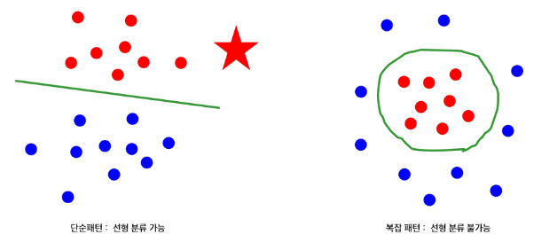

  - 활성화 함수가 없다면? 단순 선형모델과 동일
  - 단, 활성화 함수의 특성에 따라 학습 안정성과 성능이 크게 좌우
    - 활성화 함수 종류: Sigmoid, Tanh, ReLU, Leaky ReLU 등

      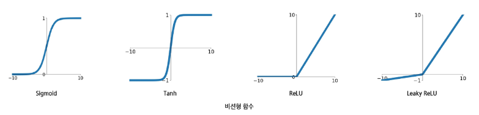

### Sigmoid
- 0-1 사이 값으로 출력 값을 제어 -> 확률 값처럼 해석 가능
  - 분류 문제(특히 이진 분류)에서 "이 클래스일 확률"로 활용 가능
  - 이진 분류 예시: 합격/불합격, 참/거짓
- 함수: a(x) = 1/(1 + e^(-x))
  - 출력은 항상 0 ~ 1 사이

    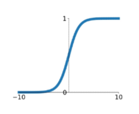

### 문제 1
- a(x) = 1/(1 + e^(-x))
- Sigmoid 함수는 입력이 매우 크거나 매우 작으면 출력이 거의 0이나 1에 고정 
-> 더이상 역전파 전달 X
  - 역전파: 정답과 예측의 차이(오답률)를 모델에 전달하며 가중치를 수정하는 과정
  - 출력이 0이나 1인 구간에서 역전파 신호가 0이 되어버려 신경망이 더 이상 학습을 못 함

    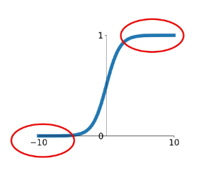

### 문제 2
- a(x) = 1/(1 + e^(-x))
- Sigmoid 출력 범위는 항상 양수 
-> 학습 과정에서 <u>편향된 업데이트</u> 발생
  - 기울기의 평균이 한 쪽으로(양수) 치우쳐 학습 비효율 발생

    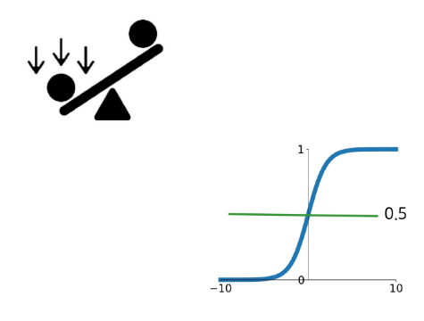

### 문제 3
- 계산식에 지수 함수(exp)가 들어감 
-> ReLU처럼 단순한 max 연산보다 계산 비용이 더 큼

  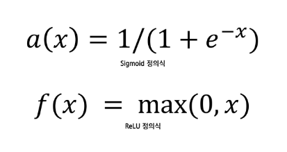

### 활성화 함수: Tanh
- 출력 범위
  - [-1, 1]

### 역할
- 데이터가 중심(0)을 기준으로 대칭 -> 학습 안정성 ↑
  - 음수 / 양수 모두 표현 가능 -> Sigmoid 보다 효과적

    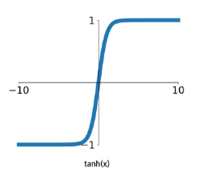

### 문제 1
- 기울기 소실 문제 여전 -> 학습 정체
  - 출력이 -1이나 1에 가까워져 신경망이 더 이상 학습 불가

### 문제 2
- exp 연산 포함 -> 계산 비용이 커짐

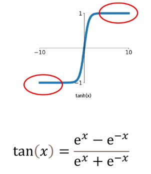

### 활성화 함수: ReLU
- ReLU(Rectified Linear Unit)
  - f(x) = max(0, x)

### 장점
- 양의 영역에서 **포화되지 않음** -> Sigmoid/tanh처럼 기울기 소실 문데가 크게 줄어듦
  - 입력이 음수면 0, 양수면 그대로 출력함 
- **계산 효율성 높음** -> 단순 max(0, x) 연산 -> 매우 빠름
- **학습 속도 빠름** -> 실제로 Sigmoid, tanh 대비 6배 이상 빠른 수렴 보고됨

  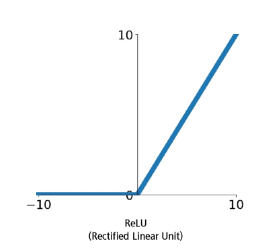

### 문제점
- **죽은 뉴런 문제** -> 입력이 계속 음수면 뉴런이 0만 출력 -> 영구적으로 "죽은 뉴런" 발생
  - 죽은 뉴런은 가중치 업데이트(학습)을 멈춤
- **'0'을 기준으로 비대칭**

### 활성화 함수: Leaky ReLU
- Leaky ReLU
  - f(x) = max(0.01x, x)

### 장점
- **ReLU의 모든 장점 수용**
- **죽지 않는 뉴런(Dead ReLU) 문제 해결** 
-> 음수 입력에도 작은 기울기를 부여해 뉴런이 완전히 죽지 않음

  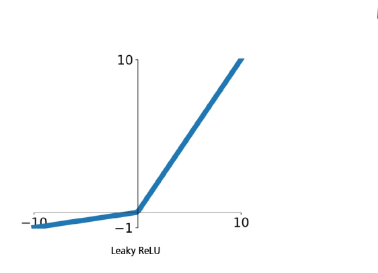

### 문제점
- **음수 영역 기울기 값 (0.01) 설정의 임의성**
  - 너무 작으면 여전히 기울기 소실, 너무 크면 출력 왜곡 가능
- **'0' 중심 대칭이 아님**
  - 신호가 한 쪽(양수)으로 치우치는 경향 발생 가능
- **항상 ReLU보다 우세하지 않음**
  - 일부 문제에서는 성능 차이가 거의 없음

### 활성화 함수: ELU
- Exponential Linear Unit(ELU)

  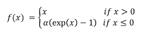

### 장점
- ReLU의 모든 장점 수용
- 평균 출력이 0 근처에 위치
- 음수 영역에서의 포화 구간 제공 -> 기울기 소실은 막고, 왜곡 문제도 해결

  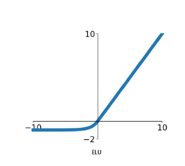

### 문제점
- 계산 복잡성 증가
- 하이퍼파라미터 α 설정 필요 
-> 음수 영역 기울기의 크기를 결정하는 α 값에 따라 성능 차이 발생

### 다양한 활성화 함수

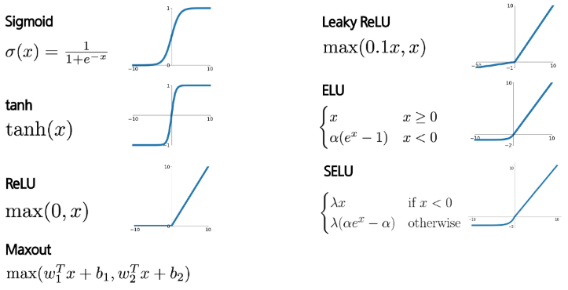

### 결론
- 큰 고민말고 일단 ReLU부터 시도

  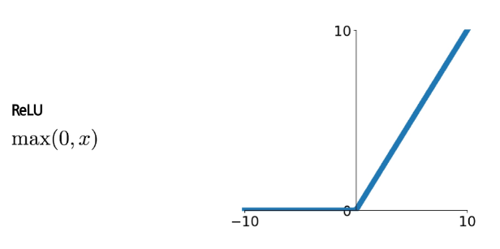

  - 성능 경쟁 중이라면, ReLU의 개선판을 시도

    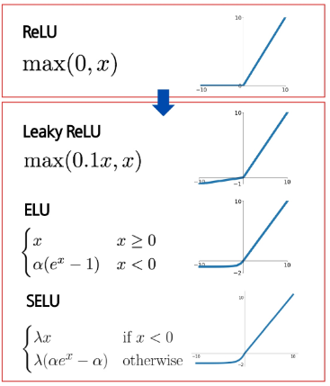
  
  - Sigmoid나 Tanh는 전문가 영역

    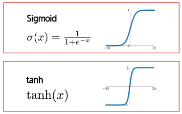

## 2. 데이터 전처리

### 이미지 조건을 일치
- 학습/검증/테스트에 모두 동일하게 적용
  - 이미지 해사도
  - 색상(예: RGB or BGR or Grey)
  - 밝기
  - 정규화
- 일반적 정규화 방식
  - 평균 0, 표준편차 1로 정규화
- 색상 채널 통일 단계 예시
  - 3-channel 이미지 -> 모델 입력 크기 고정

    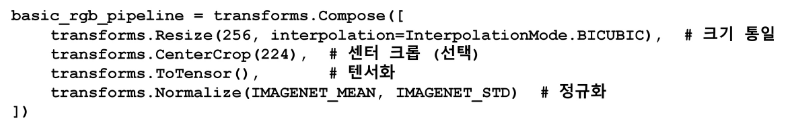

  - Grayscale 이미지 -> 모델 호환 위해 3-channel으로 복제

    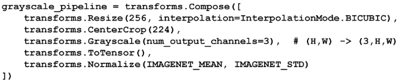

### AlexNet
- 평균 이미지를 빼기
  - 학습 데이터 전체의 평균 이미지를 입력 이미지에서 이를 배줌
  - 평균 이미지는 크기가 [32, 32, 3] 배열 형태

### VGG
- 채널별 평균 빼기
  - R, G, B 각 채널의 평균 값을 계산, 입력에서 각 채널별 평균값을 빼줌

### ResNet
- 평균 빼기 + 채널별 표준편차로 나누기
  - R, G, B 각 채널의 평균을 빼고 표준편차로 나눔

## 3. 모델 상수 초기화

### 모든 가중치(W)와 편향(b)을 0으로 초기화
- 모든 출력은 0
  - y = W * x + b
    - 뉴런 별 출력 동일, 기울기 동일 
    -> 학습이 이뤄지지 않는다

### 랜덤 초기화
- 작은 랜덤 숫자 (0.01 곱 -> 0.01 분산): 0을 중심으로 Gaussian 분포를 따름
  - Gaussian 분포: 종 모양의 정규 분포로 평균 0 근처 값이 가장 자주 발생 
  -> 값이 너무 크거나 작아지는 걸 막을 수 있음

    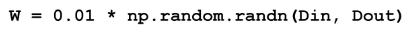

- 깊지 않은 모델에서 동작하는 전략

- 깊은 모델
  - (W, b)가 작은 수(< 1) 에 분포함. 역전파 기울기를 구하는 과정에서 W를 계속 곱하면서 기울기가 0으로 수렴
  - 만약 상수가 크면(> 1) 기울기는 폭발

    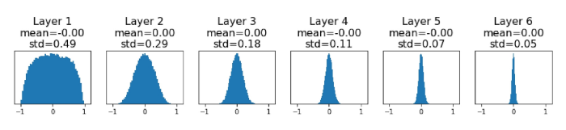

### 자비에(Xavier) 초기화
- 가중치 초기 분포의 분산을 입력 차원으로 맞춤

  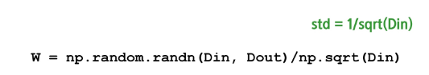

  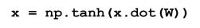

- 분산을 입력 차원(뉴런수) 증가를 고려하여 설계
  - 어떤 의미지?: 모델상수 분산이 입력 차원과 같으면, 선형연산 이후 <u>출력의 분산 = 입력의 분산</u>임을 보일 수 있음

    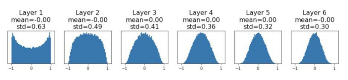

### 자비에 초기화 + ReLU
- 자비에에서 입출력 분산을 맞추는 전략은 입출력이 대칭적 분포를 보인다는 가정 하에서 설계
  - ReLU는 양의 분포만 남김. 필연적으로 비대칭

    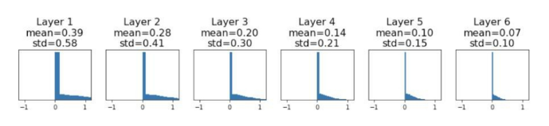

### 허(He) 초기화
- 가중치 초기 분포의 분산을 2 * 입력 차원으로 맞춤

  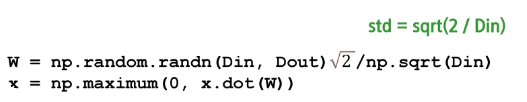

- 비대칭, 유사 분산이 레이어 후반에도 유지됨

  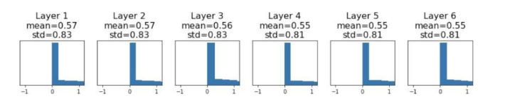

### ResNet(Residual Network)
- 잔차 연결을 사용해 매우 깊은 신경망도 안정적으로 학습할 수 있는 구조
  - 잔차 연결: 입력을 출력에 더해주는 '지름길'로 네트워크가 전체를 새로 배우지 않고 변화량만 학습하도록 도와줌

### 깊은 모델의 문제점
- 깊어질 수록 기울기 소실 / 폭발 문제 발생 -> 학습이 어려워짐
  - 기울기 소실 / 폭발 문제를 ResNet을 이용해 완화

### ResNet 철학  - 전층의 기울기 전달
- Skip connection으로 입력이 그대로 더해져 깊은 층에서도 기울기가 끊기지 않고 전달
- 그러나 초반에 초기화가 잘못되면 후반 층의 출력 분포값이 계속 증폭할 수 있음
  - 안정적 학습이 어려워짐

    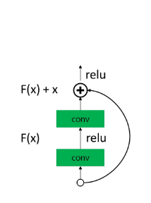

- ResNet은 ReLU 사용하는 구조이므로 He 초기화를 사용하고 **Var(x + F(x)) = Var(x)** 을 유도함

  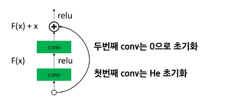

  - 사실상 초반에는 skip에만 의존, 안정적 학습을 유도
  - 초기엔 입력 = 출력, 분포가 안정 -> 학습이 안전하게 출발

## 4. 모델 정규화

### 학습과정에서 드디어 오차가 감소

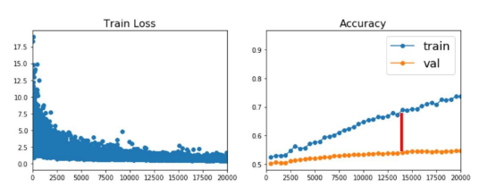

### 하지만 검증 오차는 오히려 증가
- 과적합의 신호: 실제 필드에서 가장 많이 겪는 이슈
- **정규화**를 통해 검증 오차를 줄여보자
  - 정규화: 모델 복잡도를 제어해 훈련 성능과 검증 성능의 차이를 줄이는 방법
  - 검증 오차: 모델이 학습하지 않은 새로운 데이터에서 보이는 실제 성능 지표

### 학습 과정에서 특정 가중치가 지나치게 커지는 현상 방지
- 가중치가 너무 크면 특정 입력에 과도하게 반응 -> **훈련 데이터를 외워버림**
- 가중치 크기에 비례한 **패널티** 적용
- 직관: "큰 가중치는 과적합을 부른다 -> **줄여주자**"
- 만약 가중치 감소를 완벽하게 만족한다면?
  - 모든 가중치 0인 모델 -> 하지만 이건 아무 것도 학습 안 한 모델
  - 그 자체만 쓰이면 의미가 없음. 원본 모델의 학습 목표(예: CE loss 등)와 함께 동작할 때 의미가 있음.
    - 균형이 핵심: 훈련 오차도 줄이면서 + 가중치도 적당히 작게

### L2 정규화 (Ridge, Weight Decay)
- 작동 방식: 큰 가중치에 **제곱**으로 패널티 -> 극단적으로 큰 값 방지
- 결과: 모든 가중치가 골고루 작아짐

  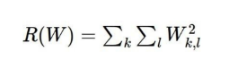

### L1 정규화 (Lasso)
- 작동 방식: 모든 가중치에 **절댓값** 크기만큼 동일하게 패널티
- 결과: 중요하지 않은 가중치는 완전히 0이 됨 (희소한 모델)
- 장점: 자동으로 중요한 특성만 선택 -> 더 단순한 모델

  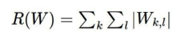

- 상수의 희소성(즉, 가능하면 보다 작은 모델을 선호)을 강제하고 싶다면 L1 가중치 감소를 선택

### Elastic net(L1 + L2)
- 변수가 많고 상관관계가 높을 때 특히 효과적
- L1과 L2의 장점을 모두 활용: 특성 선택 + 안정적인 학습
- 작동 방식
  - β 파라미터로 L1과 L2의 비중 조절
  - β가 크면 -> L2 효과 강함 (모든 가중치 작게)
  - β가 작으면 -> L1 효과 강함 (희소한 모델)

    

### 드롭아웃
- 개념
  - 학습 과정에서 일부 뉴런을 확률적으로 끔(0으로 설정)
  - 매 학습 스텝마다 다른 네트워크 구조가 샘플링되는 효과
  - 직관: "무작위로 뉴런을 비워서 특정 뉴런/특징에 과도하게 의존하지 않게 함"

    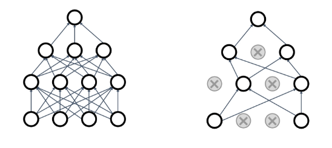

### 장점
- 과적합 방지 -> 네트워크가 특정 패턴에 의존하지 않고 일반화 성능 ↑
  - 훈련 시 매번 다른 뉴런 조합으로 학습하므로 특정 뉴런에 과도하게 의존하지 않음
- 여러 작은 모델을 합친 것과 비슷한 효과 (성능 개선을 위한 앙상블 방식과 유사)
  - 앙상블: 여러 개의 서로 다른 모델을 학습시킨 후, 예측할 때 모든 모델의 결과를 평균내거나 투표하여 최종 결정
- 간단하면서도 매우 강력

### 단점
- 학습시간 증가
- 최적의 드롭 비율을 찾는 것이 중요
- 모델에 따라 비선호 되기도 함
  - RNN/LSTM 등 시계열 데이터에서는 변형된 기법 필요
  - 배치 정규화 진행된 모델에서는 비선호 (이미 강력한 정규화가 적용)

### 실행 단계에서 동작
- 학습 중에는 뉴런을 확률적으로 끔
  - 예: 드롭아웃 확률 p=0.5 (뉴런을 끌 확률) -> 뉴런 절반만 살아있음 (1-0.5 = 0.5)
  - 실질적인 출력값이 줄어듬. (예: 평균적으로 절반 출력)
- 문제점
  - 테스트 시에는 뉴런을 전부 사용
  - 그대로 쓰면 학습할 때보다 출력 크기가 2배 -> 학습-추론 간 분포 차이가 생겨 성능 저하

### 실행단계 해결책 - Inverted 드롭아웃
- 학습 시 살아남은 뉴런의 출력을 1/(1-p) 배 스케일링
  - 예: p=0.5 면, 활성 뉴런에 x2

### 실행단계 해결책 - 기존 방식
- (1-p)를 출력에 곱하여 평균치를 맞춤.
  - 예: p=0.5면 x0.5를 테스트 출력에 스케일링
- 단점: 테스트 시 추가 연산 필요
  - 매번 (1-p) 곱셈 연산
  - 실제 서비스에서 속도 저하

# 3. 학습 안정성 전략

## 1. 학습 비율 조정

### 같은 모델, 같은 전처리, 같은 모듈에도 학습 비율에 따라 다른 결과 발생
- 잘못된 학습 비율 선택으로 학습이 완전히 실패할 수도 있음

  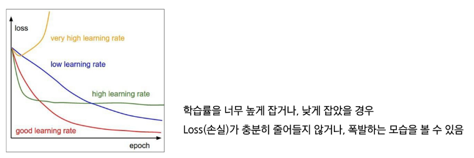

### 학습 비율 선정 방법
- 기본 전략: 학습 비율을 큰 값에서 epoch가 지날 수록 작은 값으로 조정
- 학습 비율을 줄이는 다양한 전략 존재

  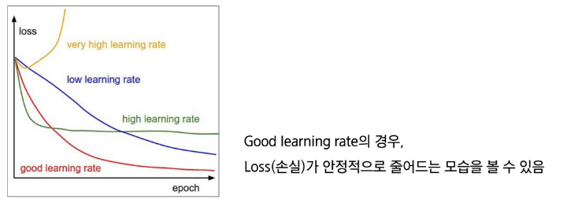

### 일정 에폭(Epoch)이 지날 때마다 계단식으로 줄이는 방식
- 에폭: 학습 데이터를 1번 다 외움을 의미
- K 에폭마다 감소계수 * 초기 학습률 만큼 감소하는 전략
  - 예: η_0 = 0.1, γ = 0.1, k = 30
  - 아래 그래프는 0~29 에폭 -> 0.1, 30~59 에폭 -> 0.01, 60~89 에폭 -> 0.001 의 학습률 적용한 경우

    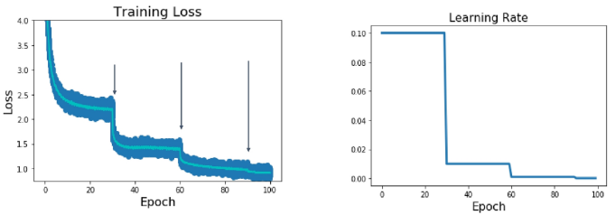

### 계단형 방식은 변경 지점을 여러 개 선정, 복잡하다는 단점이 있음
- 학습 곡선이 불안정할 수 있음

### 코사인 파형에 따른 변경
- 학습률을 코사인 함수 곡선처럼 점점 줄여가는 방식
- 직관: "처음엔 크게, 나중엔 미세하게 조율"

  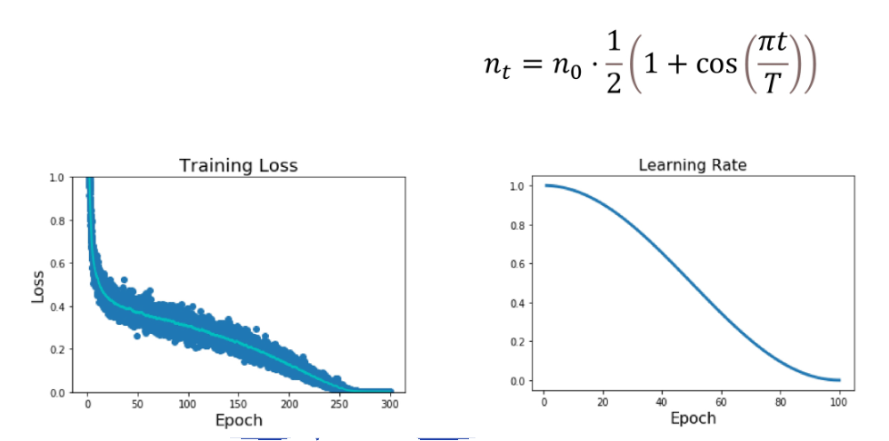

### 직선을 따라 변경
- 학습률을 학습이 진행될 수록 선형(직선)으로 줄여가는 방식
- 직관: "처음엔 크게 배우고 끝날 수록 일정하게 줄여 수렴"
- 사전학습/미세조정에서 주로 쓰임

  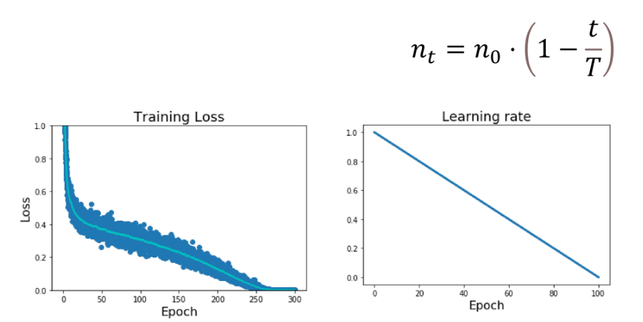

### 다양한 감소 방식 가능
- 역제곱 꼴: 처음에 크게, 이후에 느리게 줄임
  - 대규모 학습에는 부적합
- 일정값 유지: 동일한 속도로 학습
  - 데이터가 많고 과적합 위험이 없을 때 활용

    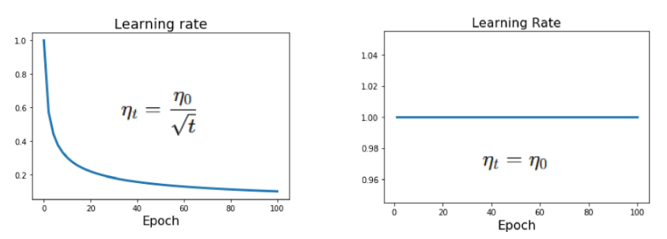

### 과적합 방지를 위한 또 다른 방법
- 빠른 종료(Early Stopping) 기법

  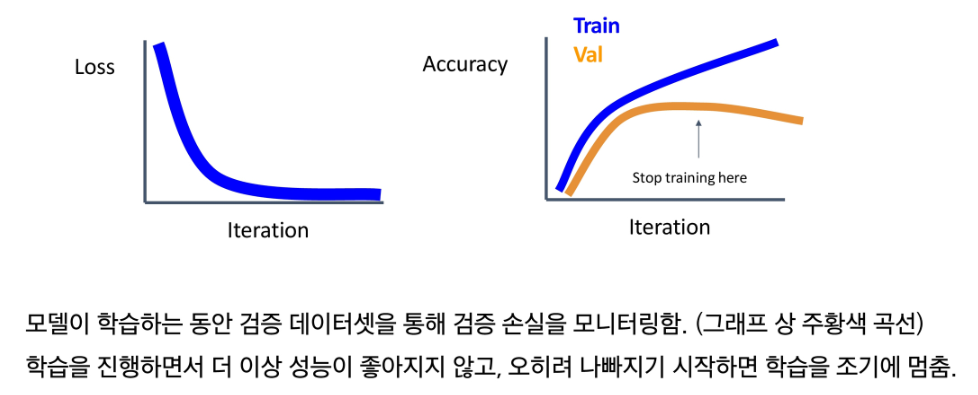

## 2. 하이퍼파라미터 선정

### 파라미터
- 학습을 통해 모델 스스로 얻는 값
  - 예: 뉴럴 네트워크의 가중치, 편향 등

### 하이퍼파라미터
- 학습 전에 사용자가 정해야 하는 값
- 학습이 진행되는 동안 고정됨
- <u>하이퍼파라미터에는 어떤 종류가 있을까?</u>

### 학습 관련
- 학습률: 가장 중요, 디케이 방식(스텝, 코사인, 선형 등)
- 배치 사이즈: 작으면 정규화 효과, 크면 안정성 효과
- 에폭 수: 조기 종료 여부

### 최적화 관련
- 최적화 툴 선택: SGD, Adam, AdamW
- 모멘텀, 최적화 계수
- 가중치 감소: L2, L1

### 모델 구조 관련
- 네트워크 깊이
- 채널 수 / 드롭아웃 비율
- 정규화: BN, LN, GN 등

### 모델 학습 성능은 구조, 학습 방법론 못지 않게 하이퍼파라미터 선택에 크게 의존
- 어떤 값의 조합이 최적일지 알 수 없어 탐색이 필요

### 하이퍼파라미터 값을 탐색하는 방식
- 그리드 탐색
  - 하이퍼파라미터 후보들을 격자처럼 전부 조합해보는 방식
- 랜덤 탐색
  - 하이퍼파라미터 공간에서 무작ㅇ위로 값을 선택해 탐색
  - 성능에 크게 영향을 주지 않는 불필요한 축의 값에 경우의 수를 실험하지 않아도 되어 시간 절약 가능

    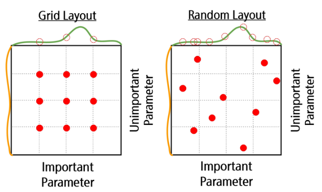

### 모든 조합을 다 실험할 수 없다면
- 빅테크에서조차 모든 조합을 실험하지 않음
  - 그들도 많은 프로젝트를 진행하고 있으며, 모델이 매우 큼
- 몇 가지 규칙과 직관을 활용하면 GPU가 많지 않아도 좋은 성능 도출 가능

### 데이터 입력 등 문제가 없을까
- 초기 손실값을 확인하자
  - 데이터 손실을 측정할 때, 분류 문제 등에서 많이 사용되는 손실 함수인 CE 손실이라면 초기 손실은 log(C)와 유사한 수준이어야 정상
  - 만약 예상치를 크게 벗어난다면 데이터 로딩/라벨 문제를 확인

### 학습률과 초기값 확인
- 작은 샘플을 활용, 과적합 시켜보자
  - 정확도 100% 달성까지 작은 학습 샘플에 대해 학습 진행
    - 정규화 X, 고의로 과적합 야기
  - 손실이 줄지 않는다면?
    - 학습률/초기화 문제
    - 모델 구조의 오류 가능성
    - 활성화 함수 이슈
    - 최적화 툴 이슈/코드 버그
  - 손실이 폭발한다면?
    - 학습률을 줄이고 초기화 변경(가장 흔한 이슈)
    - 네트워크 깊이가 깊거나 구조적 이슈(RNN)

### 구조, 최적화 툴 활용, 학습률을 찾자
- 모든 학습 데이터 활용, 작은 Iteration을(~100 iter) 빠르게 손실이 줄어드는 학습률을 우선 탐색
  - 100 iter만 학습하여 빠르게 경향을 파악
- 일반적 탐색 범위: 로그 스케일로 1e-1, 1e-2, 1e-3, 1e-4 
-> 손실이 실제로 줄어들기 시작하는 좋은 학습률 시작점을 다수 확보
- 직관: <u>**"손실이 실제로 줄어드는 학습률부터 시작하라."**</u>

### 후보 학습률 + 후보 가중치 변형 방식 중 좋은 조합을 탐색
- 상기 조합을 활용, 1-5 에폭 동안 모델을 학습시켜 성능 비교

### 왜 이런 방식이 유효할까
- 모든 조합을 끝까지 학습할 경우, 연산자원이 낭비됨
- <u>**좋은 조합은 초기 몇 에폭 내에 손실이 줄어듬.**</u>
- 모두 훈련하지 않고, 짧은 학습만으로 경향성 관찰 가능
- 단, <u>**검증 세트에서의 성능**</u>으로 관찰할 것. (학습 손실만 보면 일반화 성능을 알 수 없음)

### 좋은 조합들을 활용, 10-20 에폭까지 추가 학습
- 학습률 변경(줄이기)는 적용하지 않음

### 왜 학습률 변경을 제외할까
- 학습률 변경은 성능을 더 개선하지만, <u>**학습 속도는 느려짐.**</u>
  - 탐색과정에서 속도 늦추는 방식을 쓰는 것은 비효율적
- <u>**순수한 조합의 성능만으로 판단**</u>

### 학습률에 따른 손실곡선 관찰

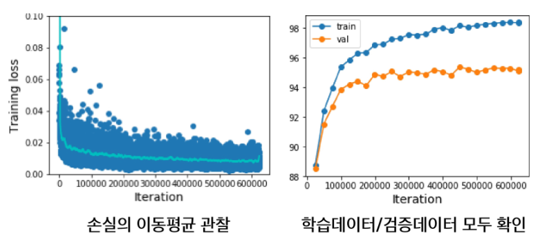

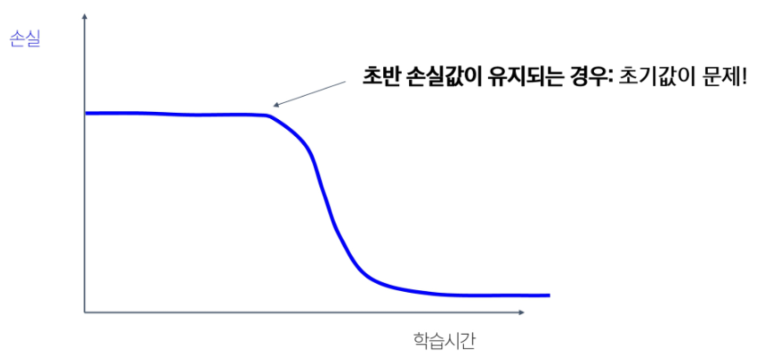

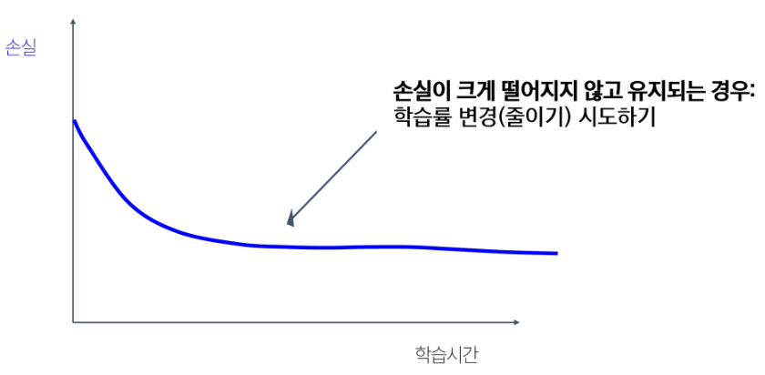

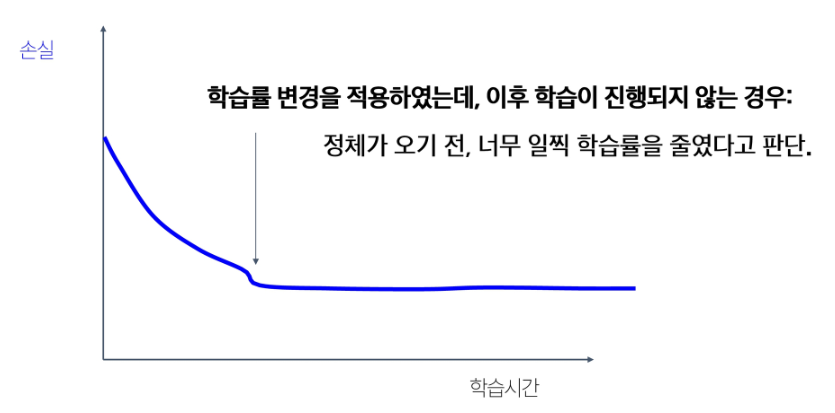

### 학습률에 따른 정확도 곡선

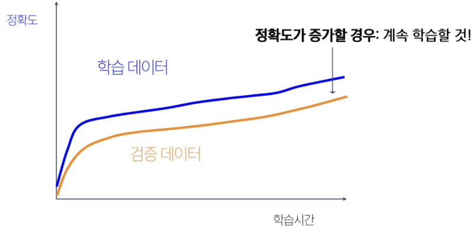

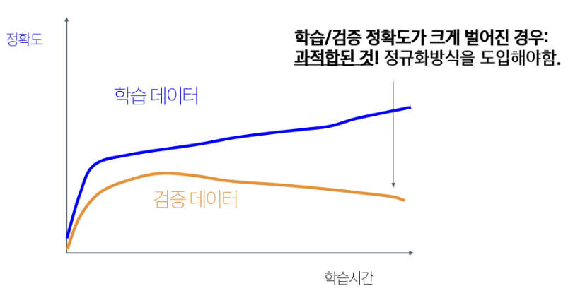

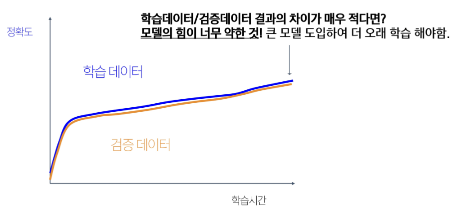
