# AI 파운데이션 모델의 개념

## 1. 파운데이션 모델(Foundation model)이란?

### AI 모델
- 함수 또는 프로그램
- 입출력을 연결해주는 함수 + 데이터로 학습된 함수 + **학습 때 보지 못 했던 데이터에 대해서도 작동**해야하는 의무
- 예시: 뉴럴넷 | 입력 -> 뉴럴넷 -> 출력

  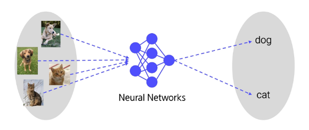

### 이상적인 AI 모델
- 만약 AI모델이 이 세상에서 발생 가능한 [모든 데이터]와 [각 데이터의 설명]을 모두 기억하고 있다면?

  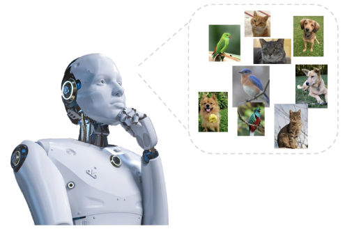

- 내가 얻고 싶은 답과 유사한 답이 이미 DB에 저장되어 있을 확률 높음 -> 검색 엔진과 유사
- 예시 : 최근접 이웃 탐색(Nearest Neighbor Search) 알고리즘
- 그러나, 데이터 확보/저장/탐색은 매우 비용이 크고 현실적이지 않음

  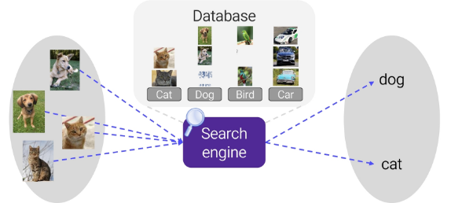

### 현실적인 기계학습 모델
- 학습 = AI모델에 데이터를 **패턴화**하여 **압축**
- 이 과정에서 비슷함과 다름을 파악하게 되고, 패턴을 익히면서 새로운 데이터에 대한 일반화 능력이 생김

  

### 파운데이션 모델이란?
- <u>대규모</u> 데이터를 폭 넓게 <u>학습</u>한 후, 다양한 문제에 빠르게 <u>적응</u>할 수 있는 범용 대형 AI 모델
- 미국 스탠포드 대학 사람 중심 AI 연구소에서 2021년 출간된 보고서에서 새로운 범주로 구분을 시작

  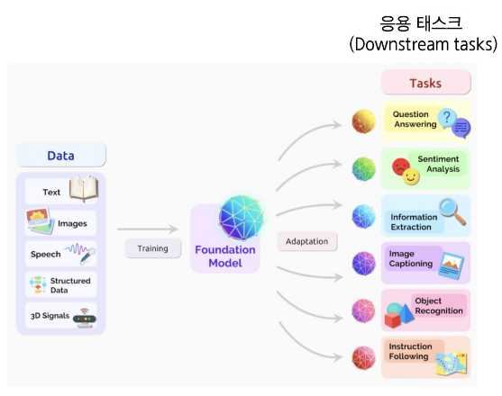

### 파운데이션 모델
- **기존 딥러닝 개발 패러다임**: 아기와 같이 언어, 시각, 청각, 촉각 등 기본적인 것들부터 배워 나가야 함
- **파운데이션 모델 패러다임**: 거대 모델(커다란 뇌) + 대규모 데이터 학습(많은 지식과 경험) 기반 
-> 새로운 일을 처음 접해도 금방 배우고 잘할 수 있음

  

- 파운데이션 모델 기반 개발 프로세스

  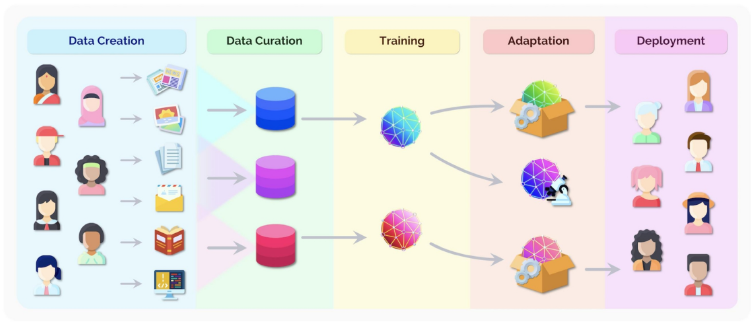

### 파운데이션 모델의 특징
- **대규모**: <u>트랜스포머 모델</u> + <u>대규모</u> 언어 <u>데이터 학습</u>
  - 태스크에 상관 없이 비슷한 패턴들이 등장하고 있음
  - 주로 비지도학습으로 훈련된 모델들"도" 많이 등장
- **적응성**: 높은 파인튜닝 성능(높은 태스크 적응 성능)
  - 믿고 쓸 수 있는 모델
- **범용성**: 다양한 작업, 한정되지 않는 출력 지원
  - 예시 - 물체 판별: 만 개 이상의 물체 종류 구분

### 파운데이션 모델에 의한 AI 모델 개발의 변화
- 과거에는 매번 모델을 새로 <u>학습</u>했지만, 이제는 잘 학습된 모델들을 얼마나 잘 <u>활용</u>하느냐가 핵심
- 파운데이션 모델 하나 확보하는데 투여되는 계산 리소스는 일부 대규모 인프라 이외에 불가
- 적응 활용
  - 활용되는 기법들: 프롬프트 {엔지니어링, 튜닝}, 전이학습, 적응(Adaptation)학습, 파인튜닝
    - Zero-shot: 처음 보는 문제를 추가 학습없이 바로 적용 (모델 자체가 가진 배경 지식 활용)
    - Few-shot: 예제 몇 개만 보여주면 바로 적용 가능
    - Fine-tuning: 처음부터 배우지 않아도 조금만 알려주면 금방 적응 (모델 자체를 업데이트, 모델 가중치가 변경됨)

      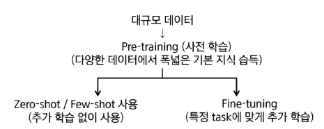

# 대표적 AI 파운데이션 모델 - CLIP

## AGI를 향해서

### Human's Intelligence(cognition) = perception ∪ higher congnitive processes
- AI는 사람의 지능과 유사점/차이점 분석을 통해 발전

  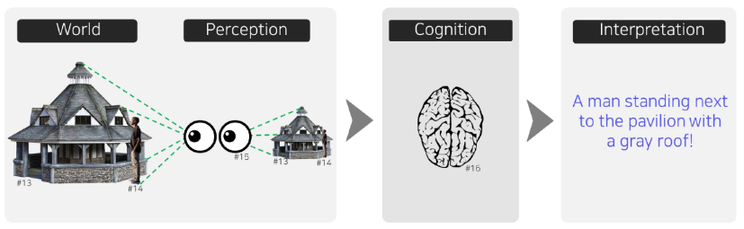

- 2022년 11월 이전: 각 분야별로 지능의 매우 부분적 능력만을 개별적으로 모델링 시도
- 2022년 11월(ChatGPT) 이후: 대규모 언어모델(LLM)이 높은 사고/추론 성능을 보여주기 시작 (다양한 인지 능력 벤치마크에서 인간 수준 근접)

  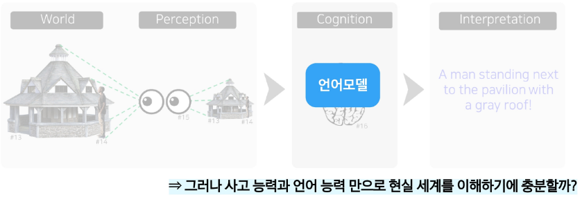

## LLM에 눈을 달아볼까 (시각언어모델)

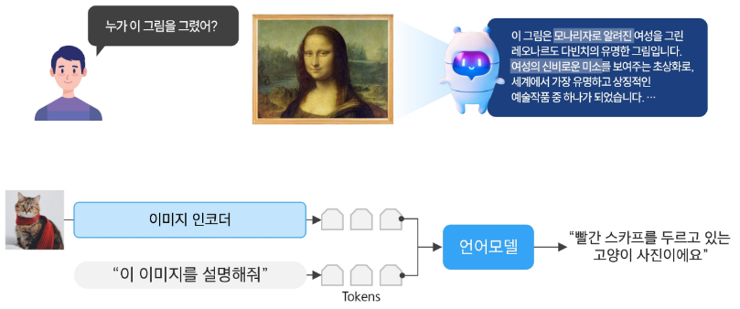

## 시각언어모델 예시 - ChatGPT with GPT-4

### GPT-4 (2023)
- 자연어 입력에 국한된 기존의 거대 언어 모델에서 더 나아가 이미지, 문서, 음성 등 멀티모달(multi-modal) 데이터를 처리할 수 있는 모델
- GPT-4 API를 활용하여 다양한 도메인의 이미지 데이터와 결합한 모델이 개발됨 (예시: 제조 AI)

  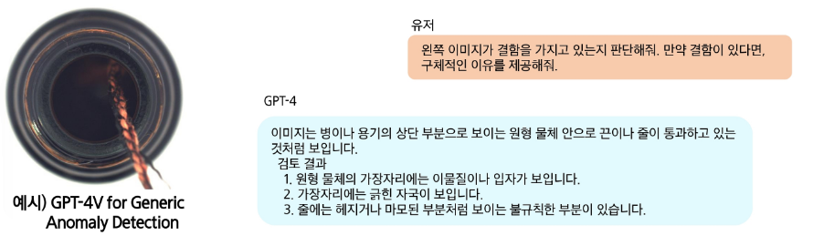

### GPT-4의 시각언어 멀티모달 언어모델로써의 능력 시연 [Sketch-to-web page(HTML)]

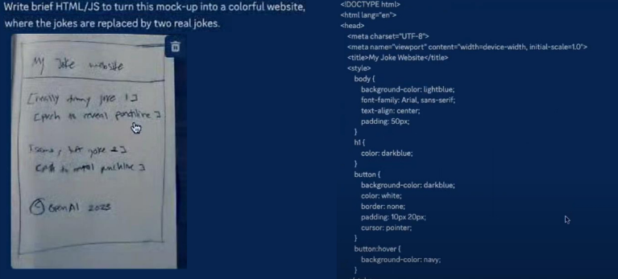

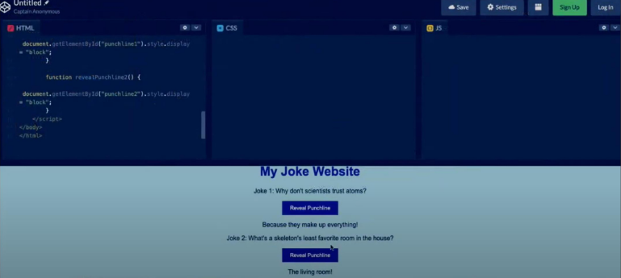

## 시각언어모델 예시 - Computer use, Claude

### Claude 기반 Computer use 기능 시연 - 친구와의 여행 플랜 세우기
- 수 많은 컴퓨터 프로그램의 다양한 인터페이스를 이해하기 위해서는 시각 이해도 필요

## 눈으로 어떤 것을 쓸까, CLIP(2021) by OpenAI

### CLIP(2021) by OpenAI
- 언어와 이미지의 유사도 학습

  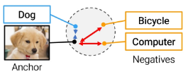

- CLIP 모델 구조

  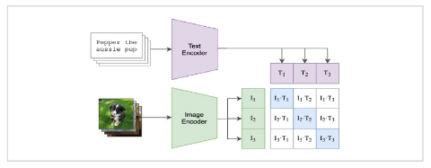

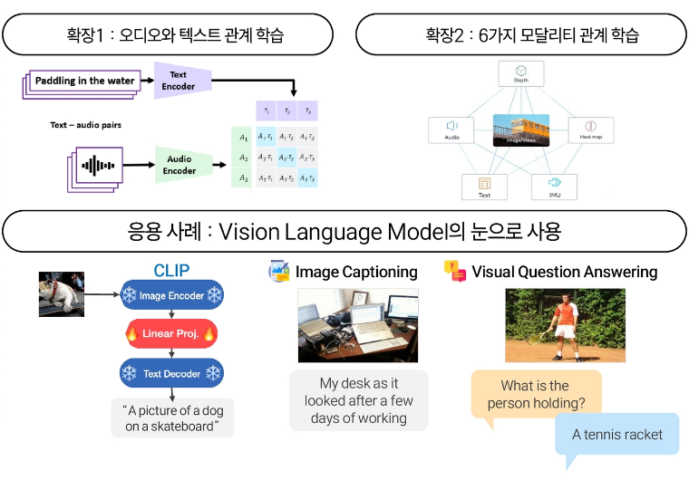

## 1. CLIP (2021)

### CLIP: Contrastive Languege-Image Pre-training, by OpenAI
- AI가 언어와 시각을 통합해서 이해하는 방식을 보여준 패러다임 전환 제시
- 파운데이션 모델으로써의 특징
  - 입력: 학습하지 않은 새로운 **도메인**의 입력 데이터에 대해서도 좋은 성능을 발휘(제로샷 전이)
  - 출력: 자연어를 이용해 한 번도 **본 적 없는 카테고리**도 텍스트 설명만으로 출력 정의 가능(언어 인터페이스)

    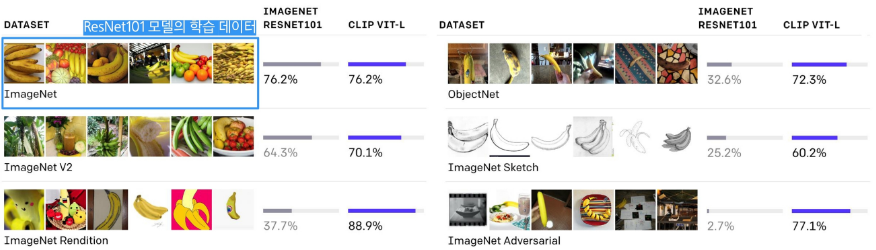

### 대조 학습 기반(Contrastive Pre-training)의 언어-이미지 사전 학습
- 인터넷 데이터를 통한 지도 학습(supervised learning)을 통해 자연어 기반 시각 개념 학습
- 다양한 이미지-자연어 쌍으로 학습
  - 인터넷에서 수집된 4억 개의 이미지-텍스트 쌍
  - Alt-text HTML tag, 이미지 캡션, 제목 등을 기반으로 수집 

    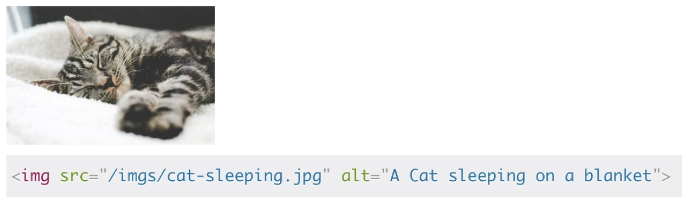
  
  - 데이터 정제 과정을 거침 (중복 이미지, 해상도/품질 낮은 이미지, 짧은 텍스트 등)
- 디양한 이미지-자연어 쌍으로 학습
  - 텍스트 인코더: Transformer
  - 이미지 인코더: ViT-B(또는 ResNet-50)

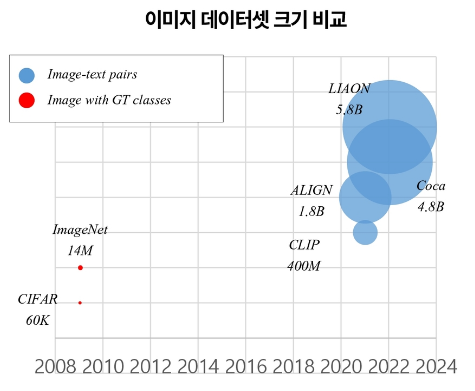

## 2. CLIP 구조 - 텍스트 인코더 (Transformer 기반 Text Encoder)

### Remind - Transformer
- 트랜스포머 구조 = 인코더(Encoder) + 디코더(Decoder)
- CLIP에서는 Encoder only 구조 사용

  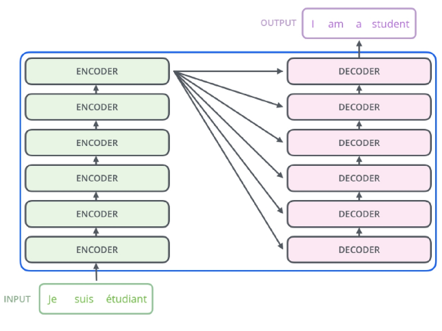

- 토큰이라는 단위의 입력
- 입력된 토큰 간의 관계성을 집중하는 Attention 메커니즘으로 구성
- L 길이의 입력 토큰은 D-차원 특징벡터(임베딩)의 배열로 형태를 입력(L x D)

  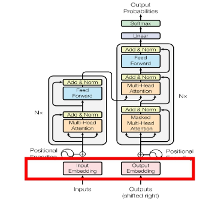

- 자연어 데이터: Sub-word 단위의 임베딩

  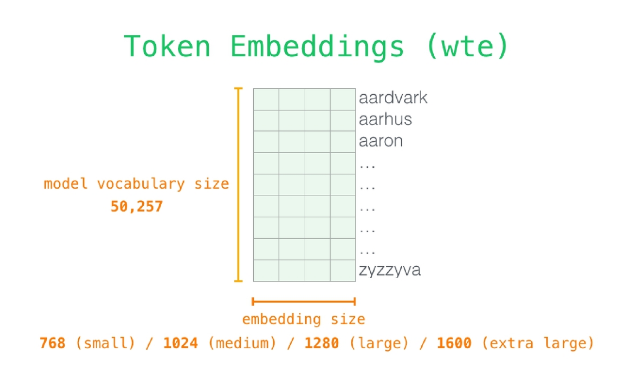

## 3. CLIP 구조 - 이미지 인코더 (ViT: Vision Transformer, 2020)

### Remind - Vision Transformer
- 입력 구성
  - 텍스트 인코더(자연어 데이터 입력): Sub-word 단위의 임베딩
  - 이미지 인코더(이미지 데이터 입력): 패치 단위의 임베딩
- ViT: 비전 분야에 트랜스포머를 (최소 수정으로)적용한 모델
- 이미지를 작은 패치(16x16x3)로 나눔
- 각 패치를 1D로 Flatten
- Learnable position embedding 사용
  - 이미지 내에서 각 패치의 위치 민감 정보 추가
  - 모델 학습 과정에서 함께 학습됨
- Transformer encoder: 패치 처리
- MLP Head를 통해 분류 작업 수행
  - Head를 수정하여 다른 작업을 위한 transfer learning 활용 가능
  - CLIP에서는 CLIP 학습법으로 학습됨

  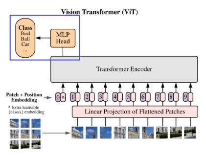

## 4. CLIP (2021) 학습

### 대조 학습(Contrastive learning)
- 학습 기준
  - 목표 이미지(앵커)를 대응하는 텍스트(양성)와 가깝게
  - 일치하지 않는 여러 텍스트(음성)와는 멀게

    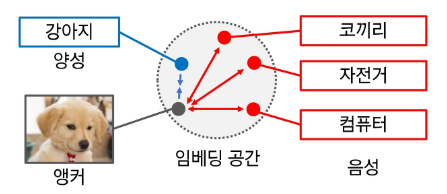

  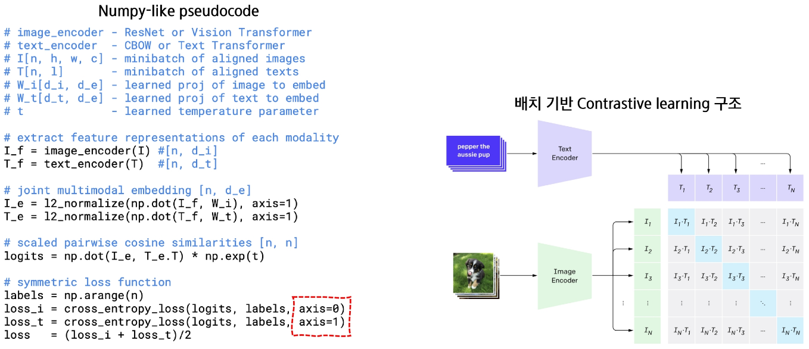

  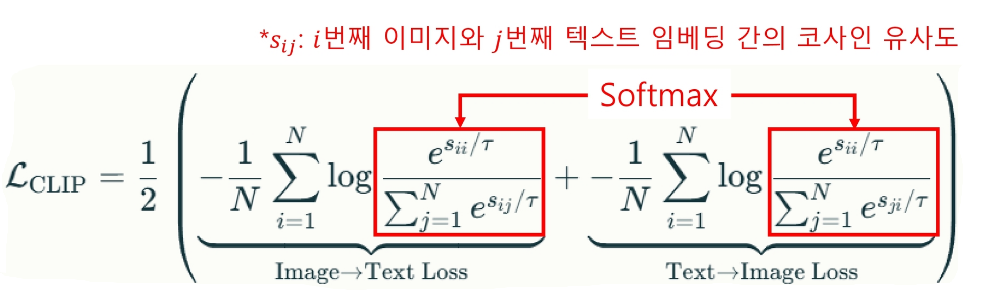

## 4. CLIP 간단 응용

  ### 제로샷 이미지 인식기
  - 텍스트로 원하는 물체 카테고리 리스트 준비
  - 텍스트 기반 카테고리 리스트를 텍스트 임베이딩으로 변환하여 Vector DB 준비
  - 쿼리 이미지와 비교해서 가장 높은 점수의 카테고리 반환
  - **생각해보기**
    - 검색 시스템과 유사성은 무엇일까?
    - 카테고리 이외에 어떤 것이 가능할까?
    - 카테고리가 정말 많을 경우에 어떻게 효율화할까?

      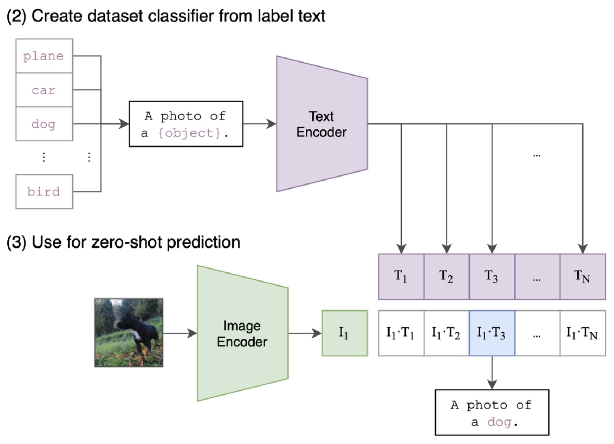

## SigLIP (2023)

### SigLIP은 softmax 대신 sigmoid 기반 손실함수
- 기존 CLIP에서 사용한 대조학습(Contrastive learning)의 한계는 무엇일까?
  - 어느 정도 이미 멀게 배치한 음성 데이터들에 대해서도 계속 거리를 벌리기 위해 학습이 진행됨
- SigCLIP: CLIP과 달리 일치하지 않는 음성 데이터에 제한된 영향만 받도록 손실함수 디자인을 고침

  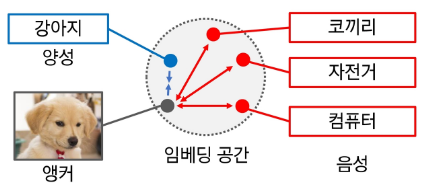

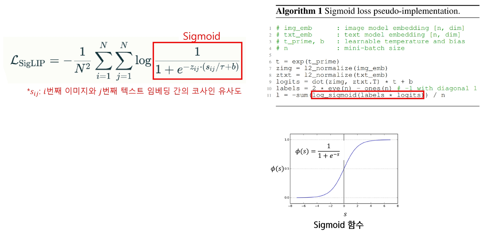

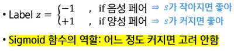

### CLIP 대비 SigLIP이 압도적인 성능을 보이며 최신 VLM에 널리 활용됨 (최근 SigLIP 2도 공개)

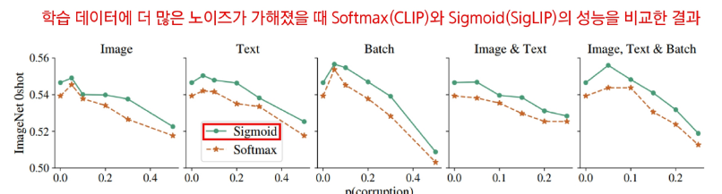

## 멀티모달 정합 응용

### 멀티모달 정합(Multi-modal Alignment)
- 서로 다른 두 가지 이상의 모달리티(예: 이미지와 텍스트) 간의 공통된 임베이딩 벡터 공간을 구성하는 것
- 서로 다른 모달리티 임베이딩 간 유사도(연관성) 비교 가능
- 대표적인 모델
  - CLIP(OpenAI): 이미지와 텍스트 간의 Multi-modal Alignment를 효과적으로 수행
  - ImageBind(Meta): 더 다양한 모달리티(예: 소리, 텍스트, 이미지, 열화상, 깊이맵)를 결합

  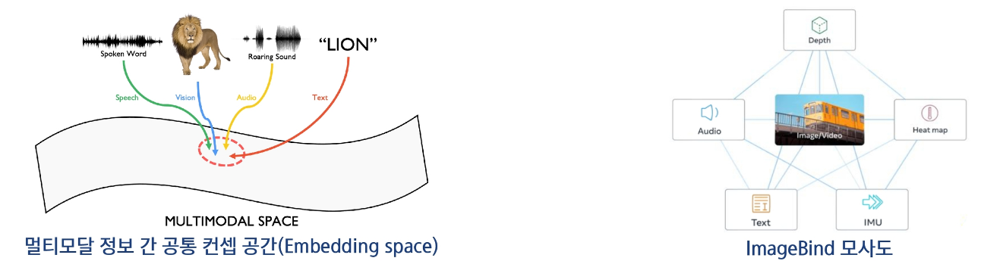

### ImageBIND - One Embedding Space To Bind Them All
- 이미지, 비디오, 텍스트, 오디오, 뎁스, 열화상, IMU 모달리티 공간을 공유하도록 학습

  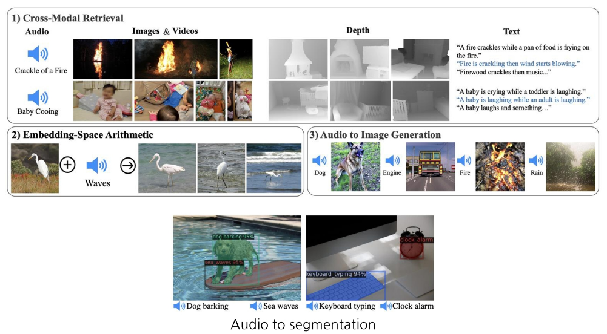

### VLM의 눈으로 응용
- CLIP 기반 VLM들 리스트
  - BLIP-2: CLIP + OPT/FlanT5 결합
  - InstructBLIP: BLIP-2의 instruction tuning 버전
  - LLaVA: CLIP + Vicuna
  - MiniGPT-4: CLIP + Vicuna 기반
  - mPLUG-Owl: CLIP 기반 Alibaba의 VLM
- SigLIP 기반 VLM들 리스트
  - PaLI-X: SigLIP + PaLM 결합
  - SmolVLM
- 최근에는 CLIP, SigLIP의 성공적인 레시피를 기반으로 특화 Vision encoder 모델들이 개발되는 추세

# Vision-Language Models

### Human's Intelligence(cognition) = perception ∪ higher congnitive processes

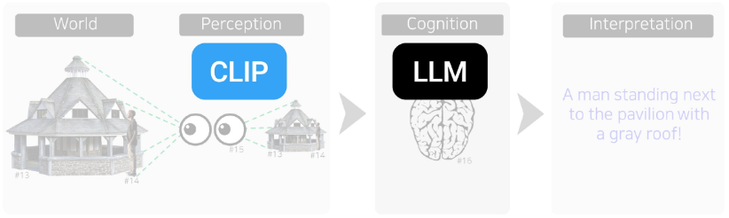

## 1. 멀티모달 언어 모델

### 이미지, 소리, 비디오 등 다양한 모달리티를 함께 이해하고 처리할 수 있는 언어 모델
- 대표적인 모델
  - ChatGPT, Claude, LLaVA(2023), InstructBLIPm Qwen-VL, InternVL, LLaMA-Vision, smolVLM, Phi, HyperClovaX-SEED-Vision, etc...
- 응용 사례
  - 텍스트와 이미지를 결합한 대화형 AI, 이미지 설명, 문서 이해, 비디오 분석 등 다양한 분야에서 사용

    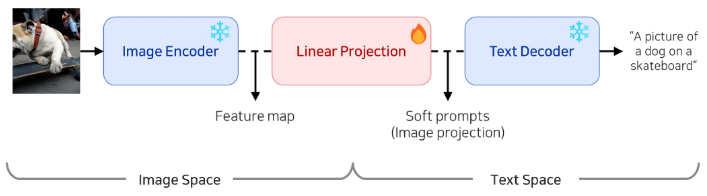

## 2. LLaVA(Large Language and VIsion Assistant; 2023)

### Vision과 Language 모델을 결합한 모델(VLM)로, 텍스트와 이미지를 동시에 이해
- 주요 특징
  - 이미지 인식과 텍스트 생성을 결합하여 이미지 설명 생성 또는 시각적 질문 응답 작업에서 뛰어난 성능
  - 이미지, 명령(Instruction), 답변이 주어진 데이터셋을 구축하여 Instruction tuning으로 학습
- 응용 사례
  - 이미지 기반 질문 응답(Visual QA), 이미지 설명 생성, 시각적 정보 기반 대화 등

    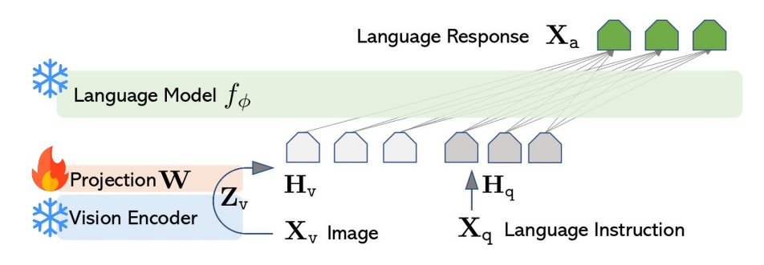

### LLaVA 모델 특징
- 효율적인 메모리 사용: 적은 자원으로 큰 모델을 효과적으로 학습
- 다중 모달 학습: 텍스트와 시각 데이터를 결합하여 응답을 생성
- Fine-tuning: 특정 작업에 맞춰 모델을 미세조정하여 사용

  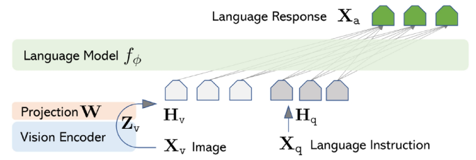

### Step 1: 사전 학습(Pre-training) 
- 표현 공유
  - 이미지를 텍스트 표현으로 변환하는 선형 레이어(Projection layer)를 학습하여 텍스트와 이미지를 공통된 토큰 표현으로 처리
  - 전체 모델을 다시 훈련하지 않으므로 자원과 시간 절감
- 효율적인 학습
  - 적은 파라미터만 학습

  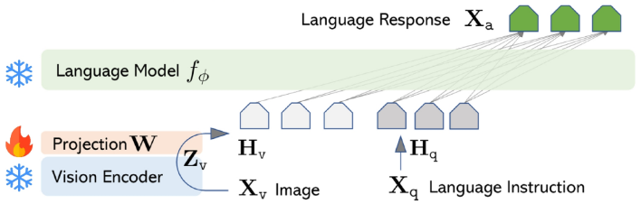

### Step 2: Fine-tuning
- 표현 공유
  - 특정 작업에 맞춰 선형레이어와 언어 모델 등 필요한 부분만 미세 조정으로 강화
- 효율적인 학습
  - FP16과 같은 정밀도 최적화를 통해 적은 메모리로 큰 모델 학습 가능
  - 저비용 학습 기법을 통해 메모리 사용량 절감

  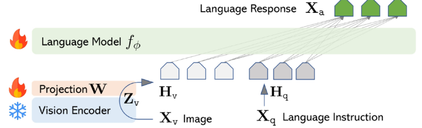

### LLaVA 학습 데이터(합성 데이터)
- ChatGPT를 활용하여 시각 설명 데이터(visual instruction data)
  - 기존 COCO 데이터셋: 이미지와 대응하는 이미지 설명. 물체 좌표(bounding box)를 라벨 데이터로 제공
  - COCO 데이터셋의 이미지와 라벨 데이터들을 가지고 ChatGPT를 이용하여 자동으로 역 질의 생성
  - 질의 타입: 대화(conversation), 자세한 설명(detailed description), 그리고 복잡한 추론(complex reasoning)

    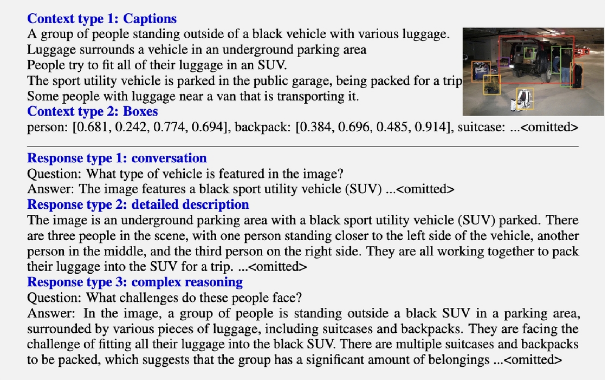

## 3. 최신 공개 VLM 모델들 - Qwen-VL (Alibaba)

### 상용 VLM에 맞서는 오픈소스 VLM
- Qwen-VL은 알리바바에서 개발한 대형 멀티모달 모델
- Qwen-LM이라는 텍스트 기반 대형 언어 모델(LLM)에 시각 처리 능력을 부여해 이미지와 텍스트를 동시에 이해하는 모델
- **여러 개의 이미지 입력**, **번역**, 텍스트 읽기, 위치 찾기(물체 탐지), 인식, 이해 능력이 있음

  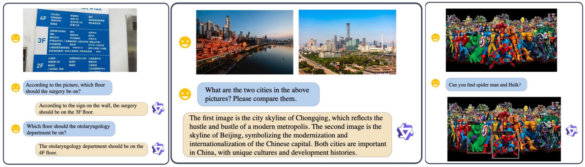

### Evaluation

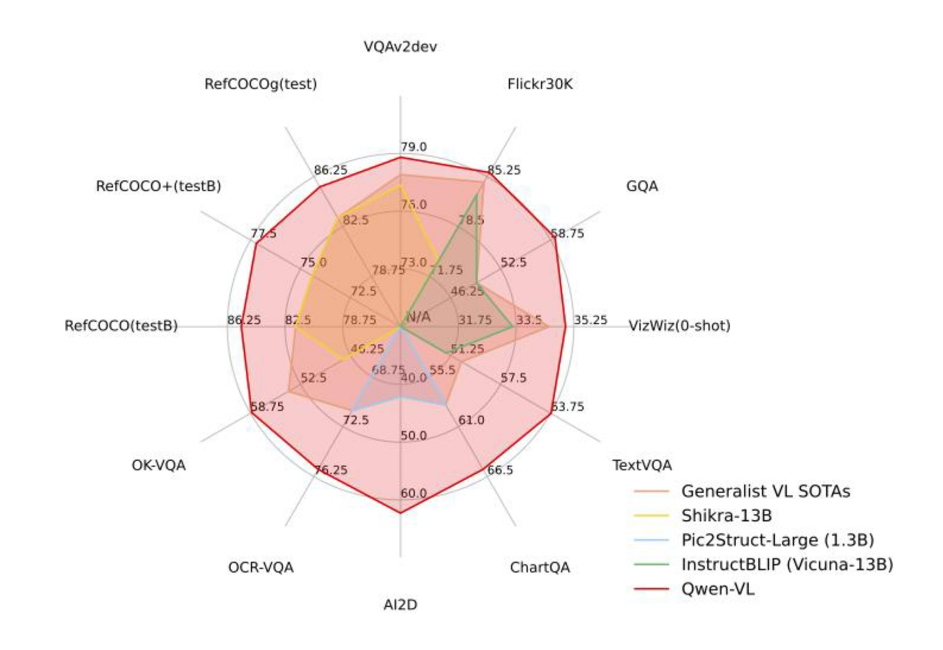

### 학습 파이프라인
- 사전학습 2단계와 명령어 파인튜닝(instruction fine-tuning)까지 3단계로 구성
- 대규모 웹 이미지-텍스트 쌍으로 시각 인코더와 어댑터 중심 최적화를 통해 기초적인 시각-언어 대응을 학습

  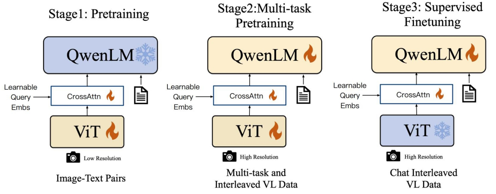

### Qwen2-VL 확장 기능
- **다국어 텍스트** 및 이미지 내 텍스트 이해 지원
- **임의의 이미지 해상도** 처리 가능
- Agent 응용 기능
- 그 외 Code/math 추론, Video 분석, Live chat 기능 등 강화

  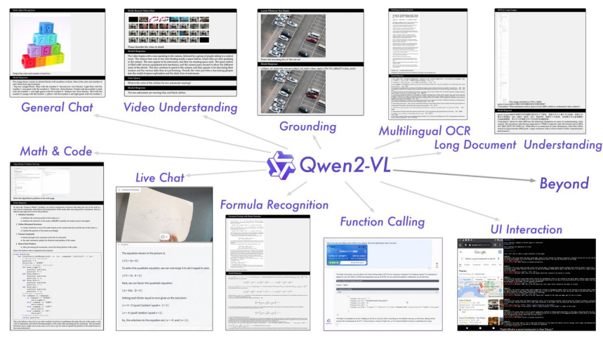

### 모델 구조

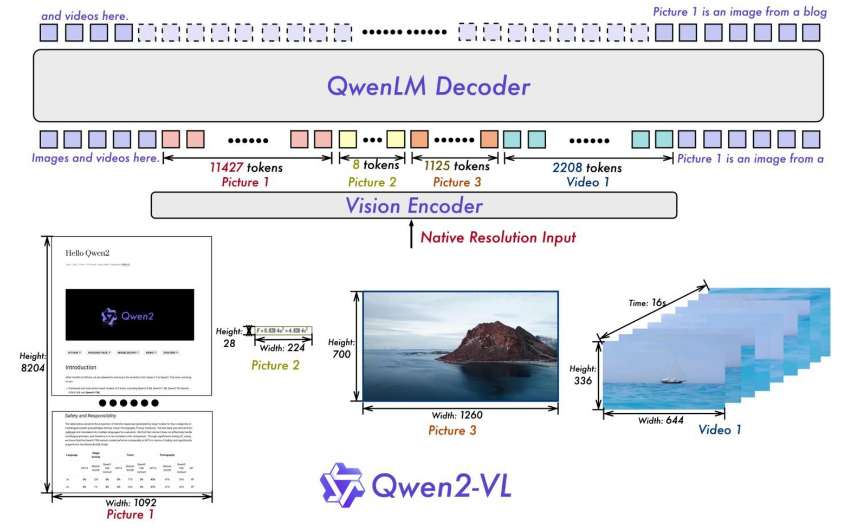

### M-RoPE
- 1D 텍스트, 2D 시각, 3D 비디오 위치 민감 정보를 부여할 수 있는 Multimodal Rotary Position Embedding을 사용

  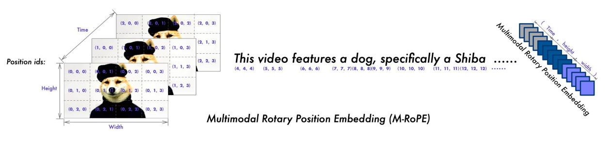

### Qwen2.5-VL 확장 기능
- 강력한 문서 파싱 기능
  - 다국어 OCR
  - 테이블, 차트, 공식, 악보 이해
  - 필기체 이해
- 정밀한 객체 그라운딩
  - 객체 탐지, 카운팅 능력 향상
- 장시간 비디오 이해
  - 초 단위 이벤트 세그먼트 추출 가능

  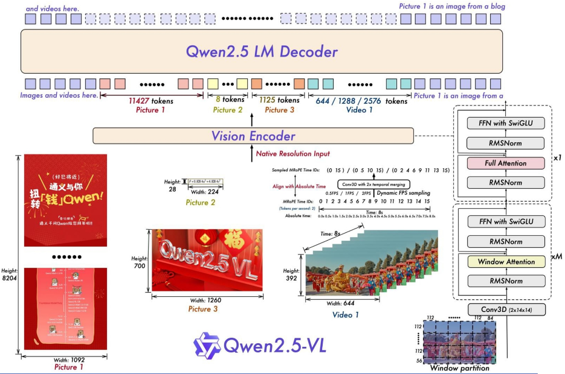

### Qwen2.5-Omni
- Omni: 라틴어의 접두사. 모든(all), 전부(every), 전체(whole)
- 멀티모달 언어모델 분야에서의 Omni: 읽고, 쓰고, 보고, 듣고, 말하면 Omni

  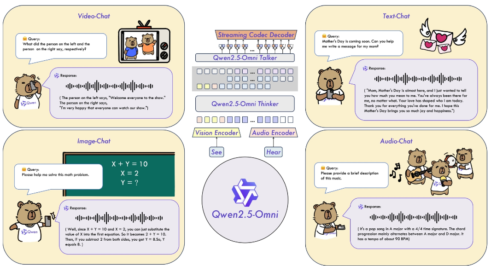

  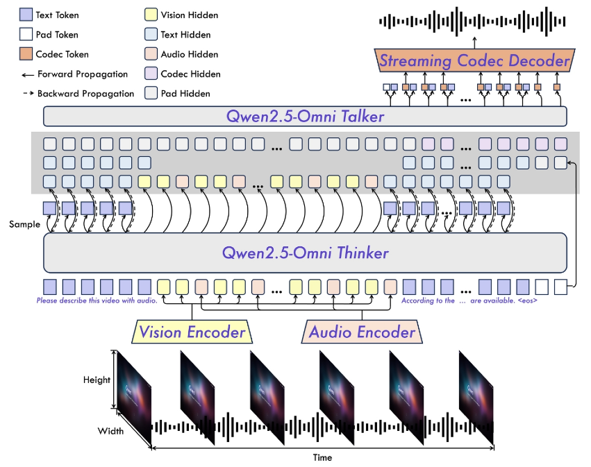

### Qwen3-VL
- 25.09.23 일 공개

  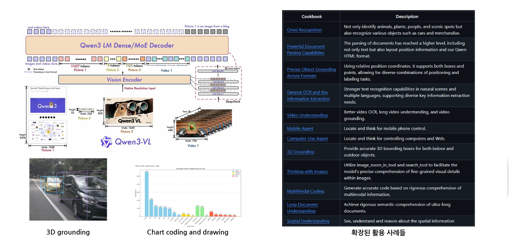

### 상용 VLM에 맞서는 오픈소스 VLM - InternVL (2024)
- OpenGBLab에서 개발한 멀티모달 언어모델
- InternVL 1.0부터 시작하여 현재 InternVL 2.5까지 발전

  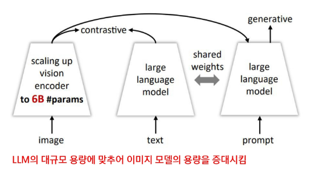

  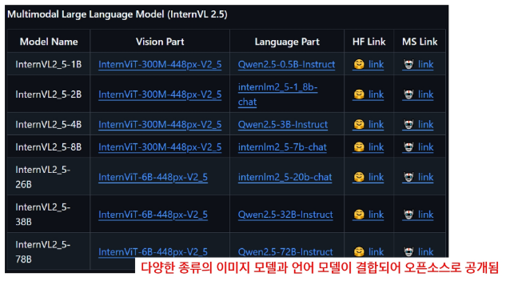

### InternVL 전체 구조도

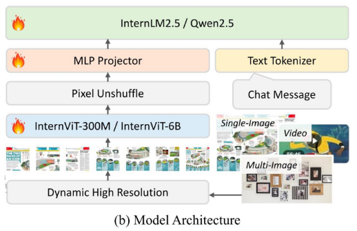

### InternVL 학습 전략
1. 단일 모델 학습 파이프라인
2. LLM을 점점 키워가며 학습하는 파이프라인

  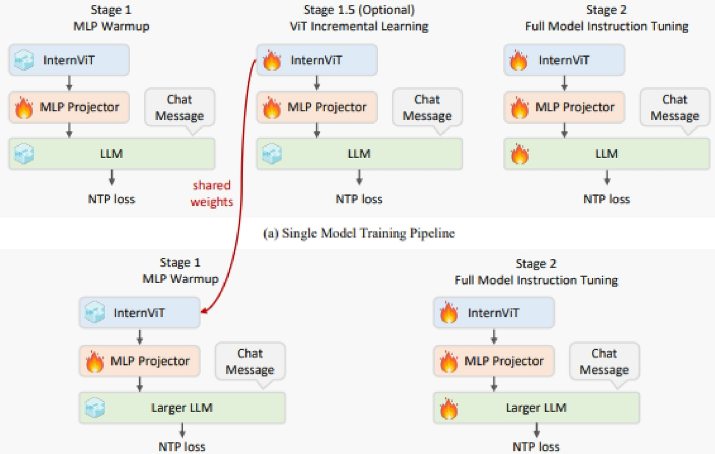

## 4. VLM의 성능을 높이는 트릭

### Set of Mark (SoM)
- 다른 물체 탐지, 세그멘테이션, 파운데이션 모델을 활용한 방법
- VLM 모델들의 부족한 시각 능력을 보완하여 비약적 성능 향상
- Computer 작동 Agent 모델에 기본적인 비주얼 프롬프팅으로 매우 유용

  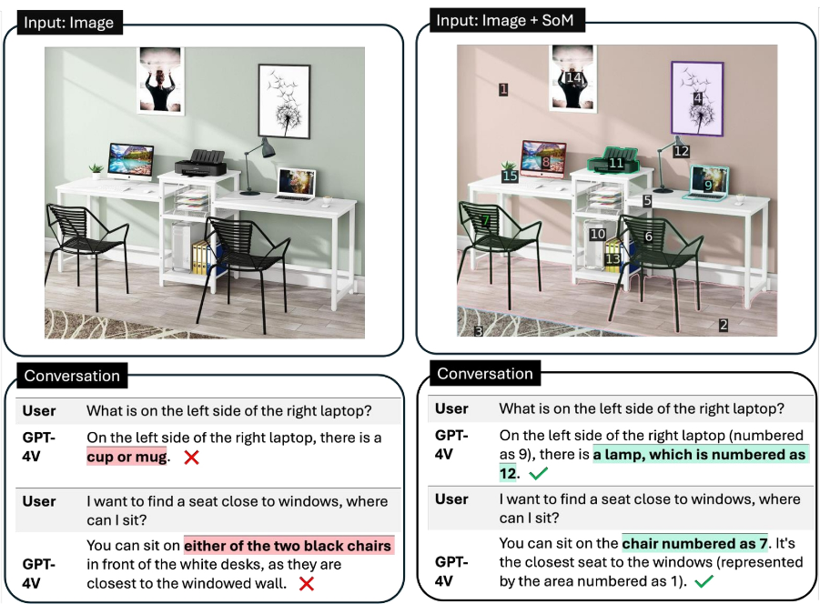

### 도메인 특화 파운데이션 모델들 - 의료
- 의료 이미지(X-Ray, MRI, CT 등)를 입력받아 병적 진단 및 원인 설명 등의 태스크 수행
- Contrastive learning을 통해 학습
  - BiomedCLIP 모델 구조

    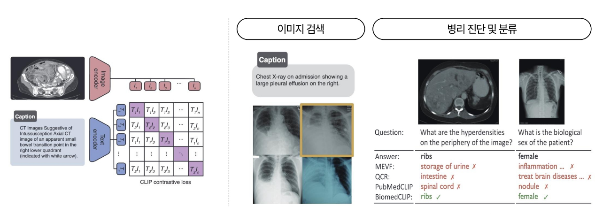

- MedCLIP(2022)
  - 의료 텍스트와 이미지 임베딩을 정합시킨 의료용 CLIP 모델
  - 텍스트 입력으로부터 이미지 상의 질병을 탐지하거나 특정 종류의 의료 이미지를 검색하는 방식 등으로 활용 가능
- LLaVA-Med(2023)
  - LLaVA를 의료 데이터에 파인튜닝한 의료 특화 모델
  - 의료 이미지를 포함한 지시문 데이터(visual instruction-followingdata)를 통해 의료 이미지 기반 챗봇 대화가 가능한 멀티모달 모델

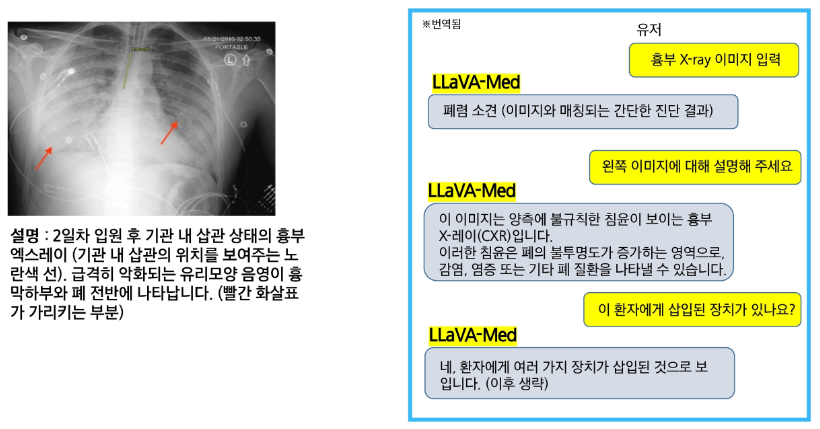

### 도메인 특화 파운데이션 모델들 - 제조업
- AnomalyGPT(2023)
  - 제조업 환경에서 발생하는 결함이나 불량을 탐지(anomaly detection)하기 위한 모델
  - 챗봇 형식으로 이미지 상 결함에 대해 텍스트로 질의응답을 주고 받을 수 있음
  - ImageBind의 이미지 인코더와 Vicuna를 언어 모델로 활용하여 제조업 데이터에 파인튜닝

    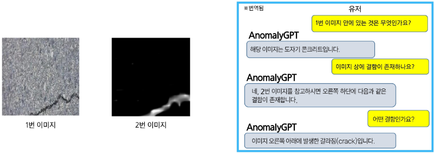

### 도메인 특화 파운데이션 모델들 - 3D 언어 모델
- 3차원 표현(예: point-cloud)과 자연어의 관계를 학습한 파운데이션 모델
  - 3D LLM 모델 구조

    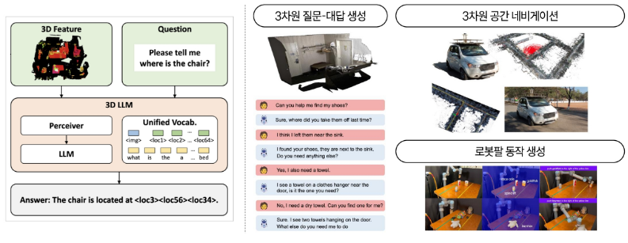

### 도메인 특화 파운데이션 모델들 - 로봇 행동 모델
- 입력: 사람의 텍스트 명령 + 로봇 시점 영상
- 출력: 로봇 행동 = {위치 변화, 관절 움직임}
  - 텍스트 명령 기반 로봇 동작 예시

    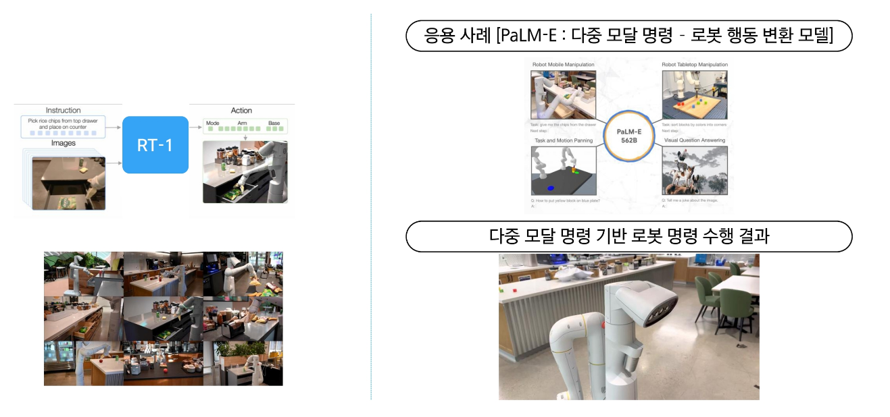

# 심화. CLIP 모델의 고급 응용

## 멀티모달 정합 손실함수로 활용

### 서로 다른 모달리티(예: 이미지와 텍스트) 간의 변환
- 모달리티 변환을 위한 2가지 디자인

  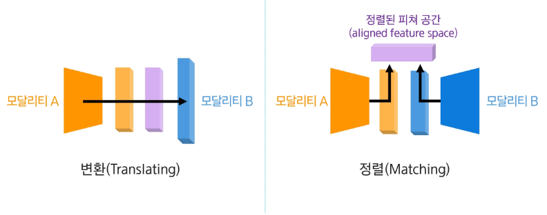

### 멀티모달 정합(Multi-modal Alignment)을 활용하는 법
- Remind - 서로 다른 두 가지 이상의 모달리티(예: 이미지와 텍스트) 간의 공통된 임베이딩 벡터 공간을 구성하는 것
- 이 연관성을 거꾸로 활용하는 방법은 없을까?

  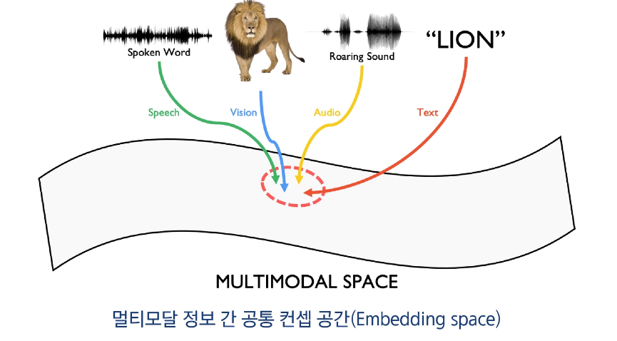

### 정합(Matching)을 통한 크로스모달 변환
- 멀티모달 정합 손실 함수(Multi-modal alignment loss)
  - Multi-modal 데이터(예시: 이미지와 텍스트) 사이에 정렬된 정도를 측정
  - 대표적인 텍스트-이미지 손실함수: CLIP loss / Score Distillation Sampling(SDS) loss

    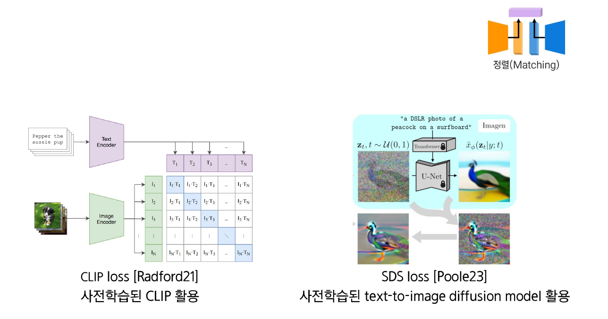

- CLIP loss 예시

  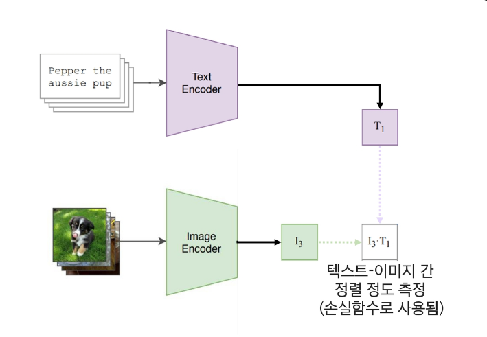

- 단일 데이터에 대해서만 학습 = 최적화(학습X)

  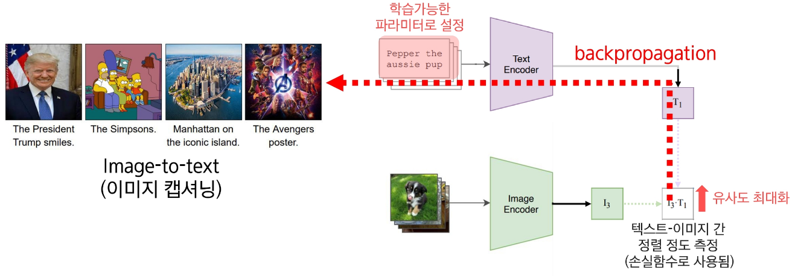

  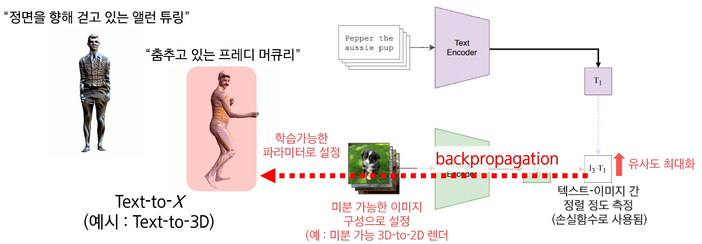

  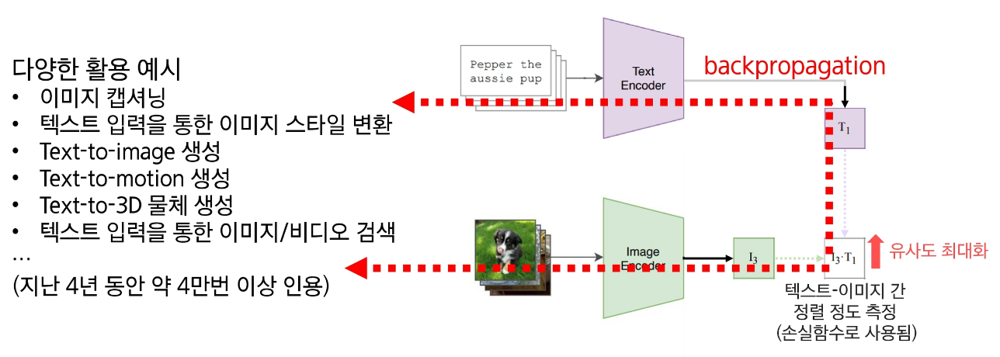

### 응용 결과 에제 - ZeroCLIP
- 입력: 이미지 / 출력: 캡션
- 다양하고 구체적인 텍스트 생성, 제한된 OCR(글자인식) 능력

  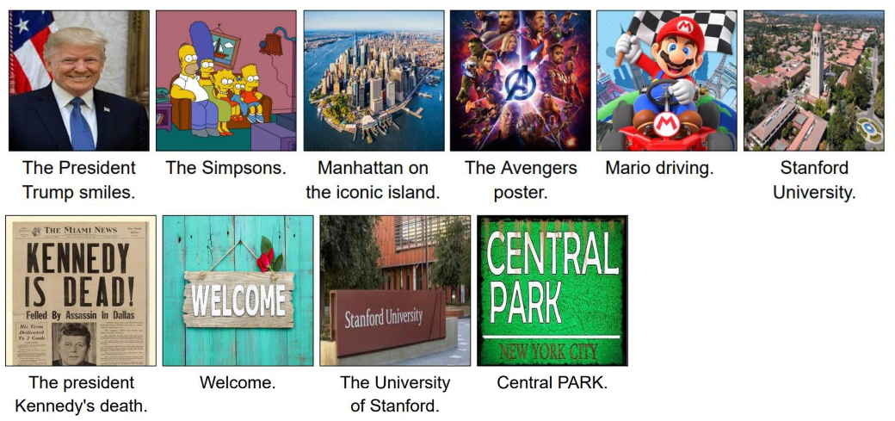

### 응용 결과 예제 - StyleCLIP
- 입력: 텍스트 명령, 원본 이미지 / 출력: 편집된 이미지

  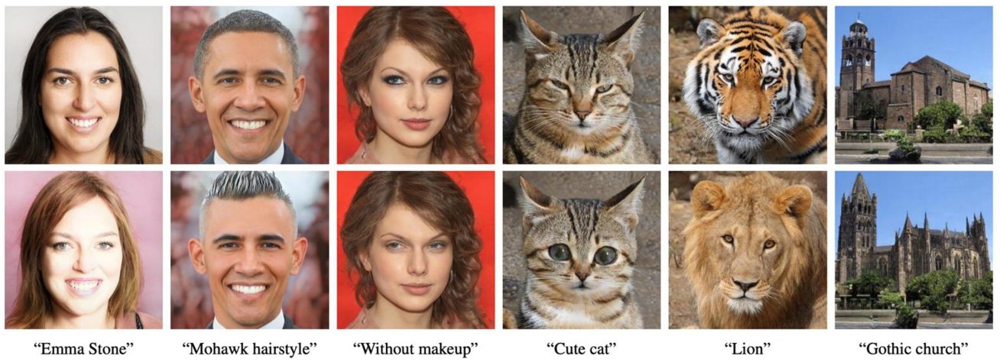

### 응용 결과 예제 - CLIP-Actor
- 입력: 텍스트 설명 / 출력: 3D 애니메이팅 아바타

  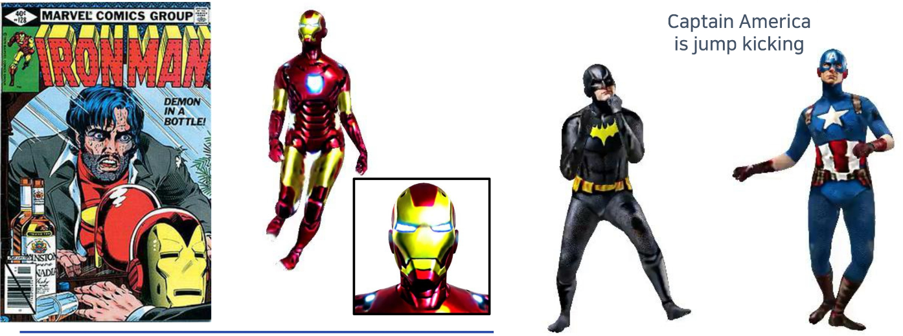

---
# Small Vision-Language Models(sVLM)

## 1. OpenVLM

### VLM 성능 리더보드

## 2. sVLM

### 다양한 온디바이스 모델 실경량화된 소형 VLM을 만들기 위한 시도들
- sLLM에서 이루어진 경량화 시도들이 VLM에서도 이어지고 있음

  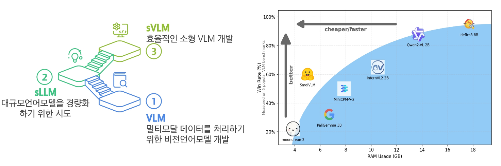

## 3. SmolVLM

### Huggingface가 개발한 sVLM

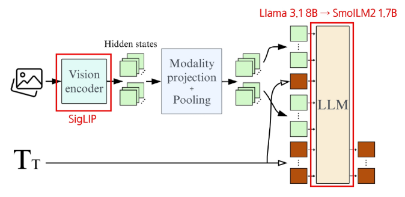

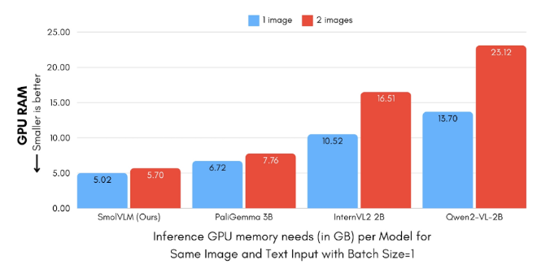

## 4. Moondream 0.5B

### 모바일 기기나 엣지 디바이스에서의 실시간 실행을 염두에 두고 개발
- 2억 개의 파라미터로 구성된 이 모델은 8비트 양자화 시 다운로드 크기가 479MB, 실행 메모리 996MB 수준으로 작으며, 4비트 양자화 시에는 다운로드 375MB, 메모리 816MB까지 감소
- 제공 기능
  - Image Captioning
  - Visual Question Answering
  - Object Detection
  - Pointing (x, y)
  - Gaze Detection
  - OCR & Document Understanding

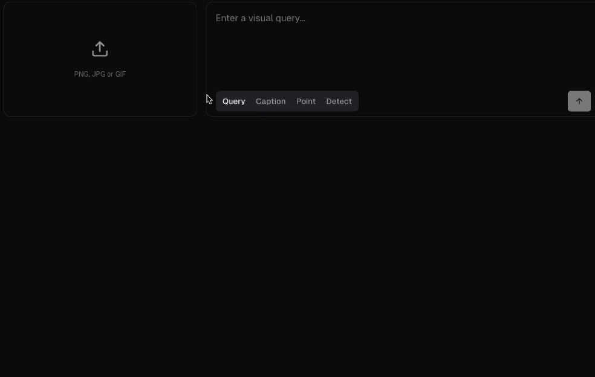

### 손쉬운 사용법

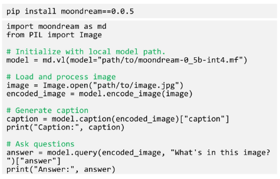

## 5. Gemini Nano

### 온 디바이스용 경량 Gemini
- 18억 및 32.5억 개 파라미터의 두 가지 변형(Nano-1, Nano-2)으로 구성되어 스마트폰 등 디바이스 내부에서 직접 실행될 수 있도록 설계
- 2024년 출시된 픽셀 9 시리즈에는 이 Gemini Nano 모델이 탑재되어 녹음 앱에서 녹음 중 실시간으로 이미지/오디오 내용을 인식하고 요약하는 기능이 구현
- 사용자가 카메라로 보이는 자료를 녹음과 함께 입력하면 기기가 내부 AI를 통해 해당 이미지를 이해하고 관련 텍스트를 생성

## 6. 갤럭시 온디바이스 AI

### 모바일 NPU로 이미지, 언어, 오디오, 영상 작업을 기기 내에서 직접 생성형 AI 실행

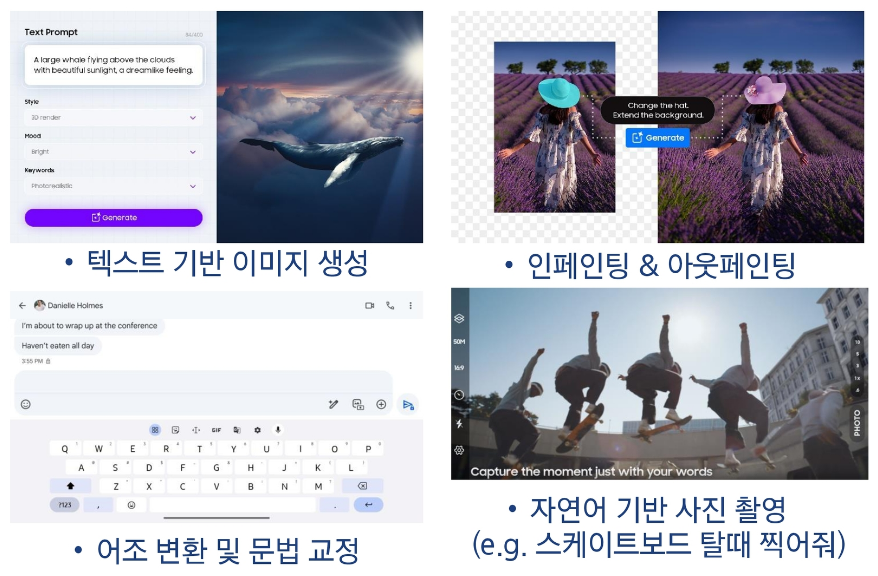

## 7. LMDeploy

### LMDeploy를 이용한 InternVL 배포
- LMDeploy는 LLM의 효율적 압축, 배포, 서빙을 지원하는 오픈소스 툴킷

  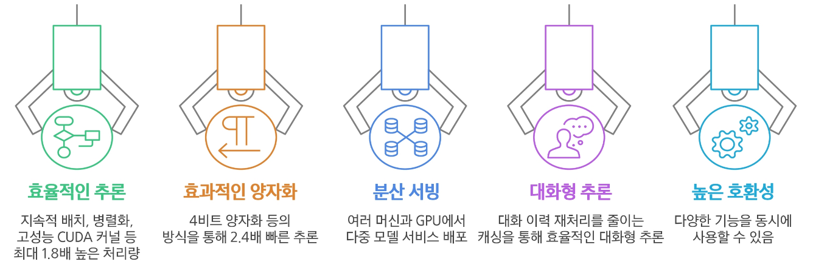

### 실습 - LMDeploy
- InternVL, Qwen, DeepSeek, Phi 등 다양한 VLM 제공

  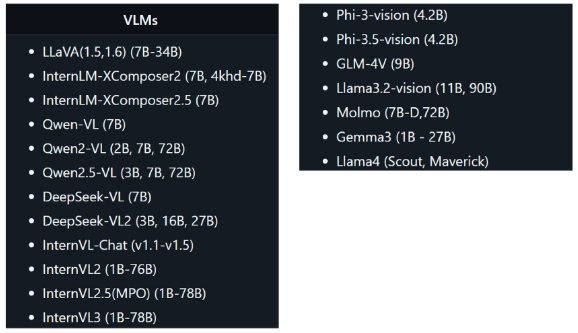

### 실습 - LMDeploy -InternVL

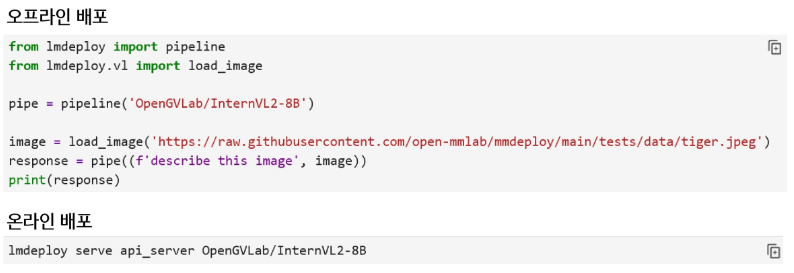

## 8. 기타 sVLM

### 최신 sVLM
- Qwen 2.5-VL 3B
  - 다양한 크기의 이미지와 장시간 영상 처리 가능
  - 표, 악보, 화학식 등 다양한 형태의 데이터 및 JSON 형식 등 처리 가능
- Phi-3.5 vision instruct 4.2B
  - OCR, 차트 분석, 비디오 요약 등에 특화된 경량 멀티모달 모델
- DeepSeek-VL2 1B
  - 중국 AI 스타트업으로 저비용 오픈소스 LLM 및 VLM 개발
- Gemma 3 1B
  - Google의 멀티모달 오픈 소스 모델
  - 1B ~ 27B의 다양한 크기의 모델 제공

# 한국어 sVLM

## 1. 언어별 구조적, 형태적 차이에 따른 토큰화 복잡성

### 언어별 토큰 길이 격차 (토큰 정보밀도 차이)
- 언어에 따라 동일한 문장이라도 토큰화 후 길이에 큰 차이를 보임
- 영어 중심 토크나이저
  - 영어는 일부 언어보다 최대 2.5배 높은 토큰 정보 밀도를 보여 같은 토큰 길이에 더 많은 내용을 담을 수 있음
  - 비영어권 언어는 컨턱스트 활용 효율이 낮고 토큰 낭비가 발생하는 "<u>**구조적**</u>" 불이익 존재 
  (주의: 언어 자체의 한계가 아님. 토큰화 방법의 효율성 차이)

    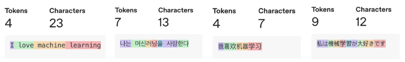

### 토크나이저의 언어 편중 이슈
- 주로 빈도가 높은 표현에 대해 설계되어 사용 빈도가 적거나 형태가 설계 언어와 다른 언어는 비효율적으로 긴 토큰 시퀀스가 생성
- 형태소가 복잡한 언어의 토큰화
  - 핀란드어, 독일어의 경우 하나의 단어가 매우 길거나 여러 의미를 접합해 표현하므로 서브워드 단위로 쪼개지는 토큰 수가 크게 증가

    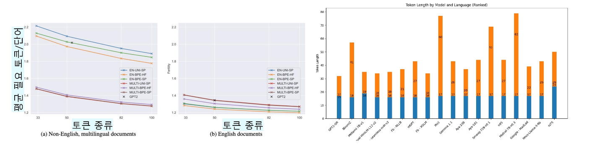

### 토큰을 줄이려는 시도 - 한국어

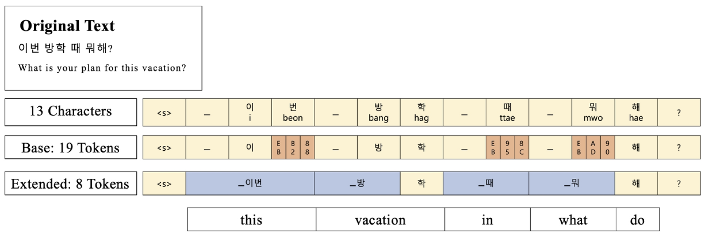

### 한국어 sVLM 모델
- HyperCLOVAX-SEED-Vision-Instruct-3B는 NAVER가 개발한 한국어 특화 멀티모달 모델로, 텍스트와 이미지를 동시에 이해하고 텍스트를 생성

  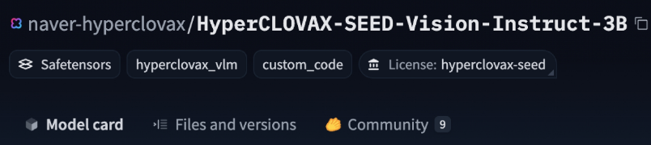

  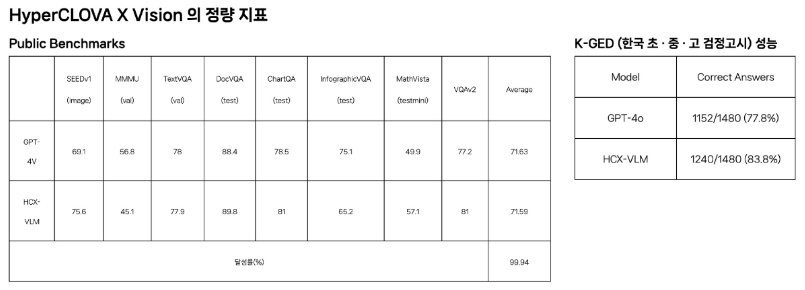

  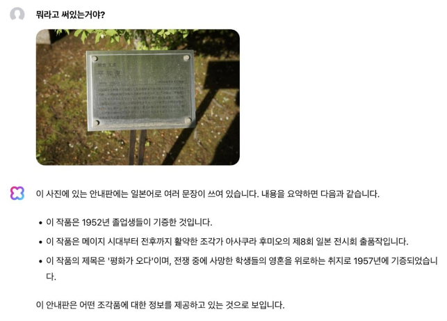

  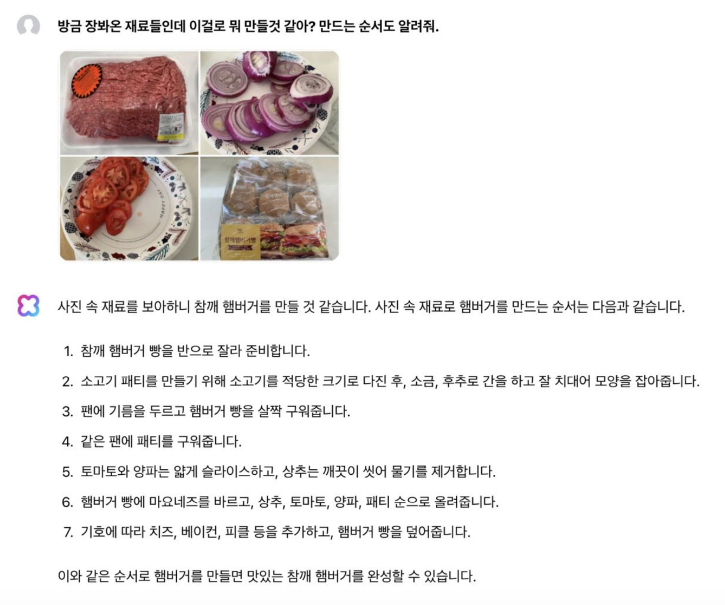

  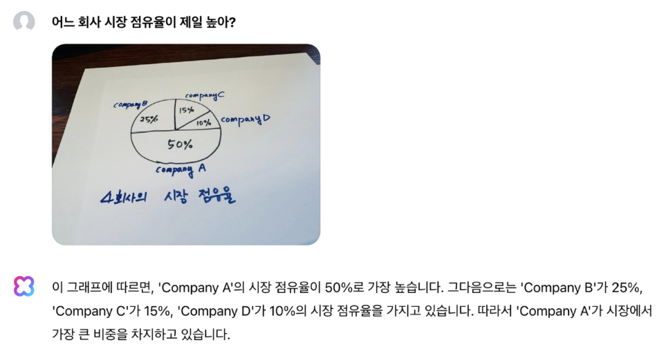

### Huggingface를 통해 한국어 sVLM 모델 사용
1. Huggingface 로그인 및 모델 다운로드
2. 커스텀 모델 등록 및 불러오기
3. 대화 데이터 구성 및 입력 생성
4. 텍스트 생성

### Huggingface 로그인 및 모델 다운로드

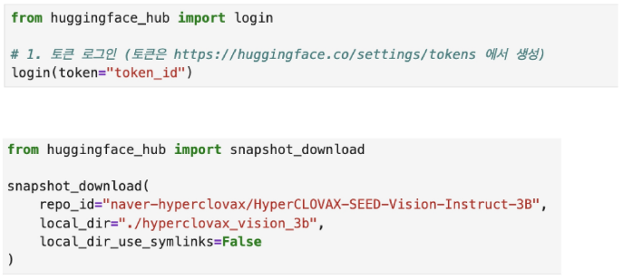

### 커스텀 모델 등록 및 불러오기

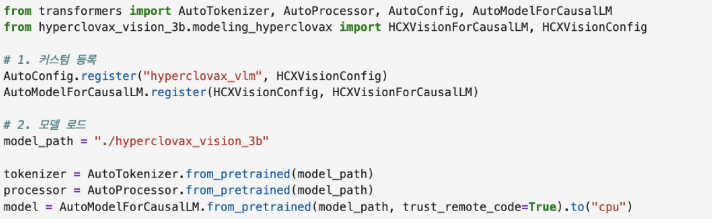

### 텍스트 생성

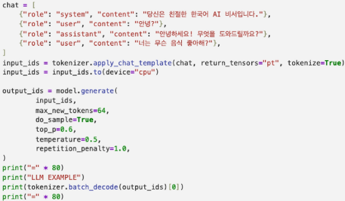

### 텍스트 + 이미지 프롬프트

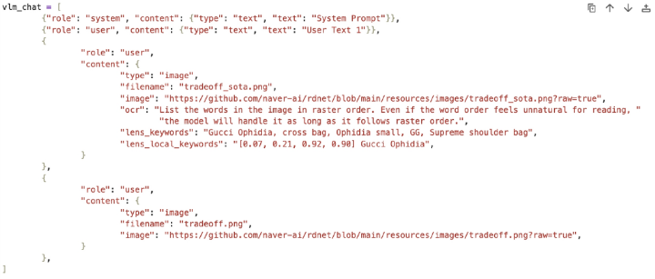

### 텍스트 생성

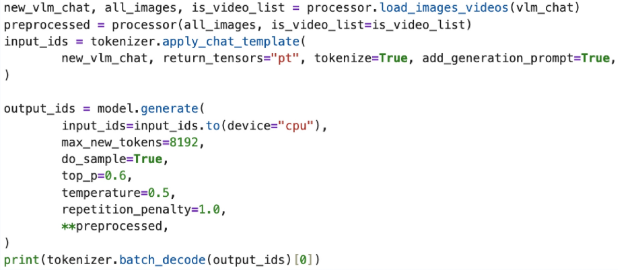

### 한국어 sVLM 모델
- Kanana-1.5-v-3b-instruct는 Kakao가 개발한 한국어 특화 멀티모달 모델

  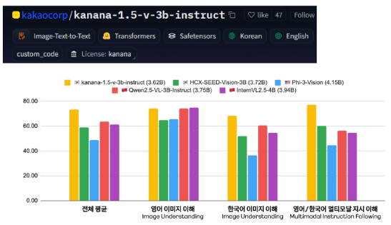

# 다른 이미지 파운데이션 모델들 소개

## 1. 이미지 파운데이션 모델

### 영상 파운데이션 모델 개요
- 컴퓨터 비전(CV)에서 방대한 데이터를 학습한 모델들
- 분할(Segmentation), 탐지(Detection), 3D 및 깊이 예측(3D & Depth) 등 다양한 작업 수행 가능

  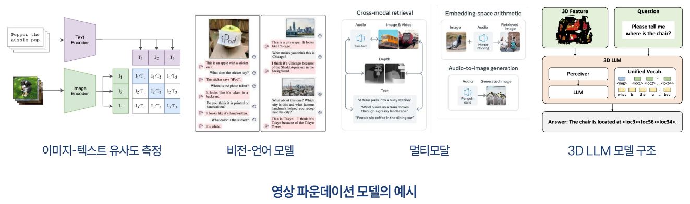

## 2. 이미지 세그멘테이션 모델

### Segment Anything(SAM, 2023; SAM2, 2024) - Meta
- 컴퓨터 비전에서도 방대한 양의 데이터로 Foundation model을 만들 수 있음을 보여준 모델
- 클릭, 박스, 부분 세크먼트, 텍스트 등의 유저의 입력을 받아 원하는 영역 마스크를 추출하는 고성능 분할 모델
- 약 1,100만 개의 이미지(약 10억 개의 마스크)로 학습

  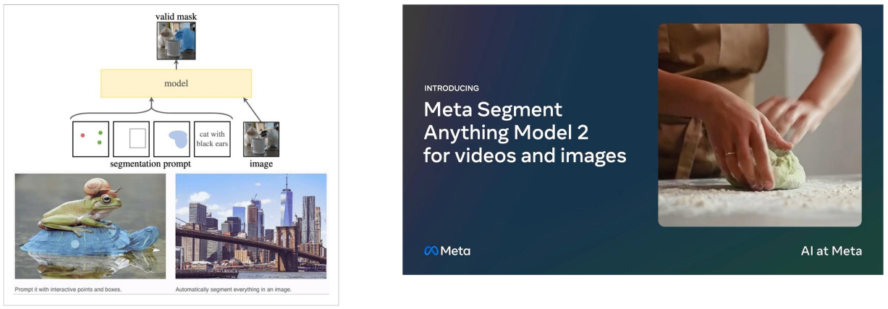

### 이미지 내 물체 탐지 모델
- Grounding DINO(2023) - IDEA Research
  - 텍스트 입력을 통해 이미지 내 물체를 탐지하는 모델
  - 방대한 데이터를 바탕으로 다양한 종류의 물체에 대해 높은 일반화(generalization) 성능을 가짐
  - 객체 탐지 분야에서 Foundation 모델이 높은 성능을 달성할 수 있음을 보여준 모델
  - 응용: 이미지 검색, 탐지, 분류 작업에 사용

    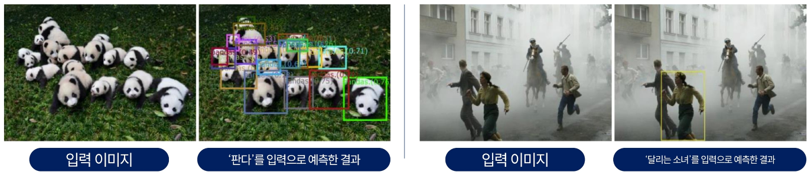

### 이미지 내 인스턴스 탐지 및 세그멘테이션 모델
- Grounded SAM(2024) - IDEA Research
  - Grounding DINO와 SAM 결합 모델
  - 텍스트 입력으로부터 객체 탐지 뿐만 아니라 분할까지 동시에 수행할 수 있는 모델
  - Gronding DINO를 통해 추출된 박스를 SAM의 입력으로 활용하여 개별 물체 분할

    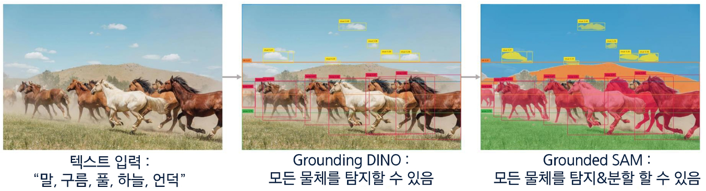

### 비디오 내 인스턴스 탐지 및 세그멘테이션 모델
- SAMURAI(2024) - Univ. Washington
  - 비주얼 물체 트랙킹 State-of-the-art (Updated at 2025. 05)
  - SAM 2 기반 응용 모델
  - 어떤 응용 사례가 있을까? - 비디오 편집, 물체 지우기와 결합, 이상행동 감지, CCTV 자동 분석, 스포츠 중계, ...

    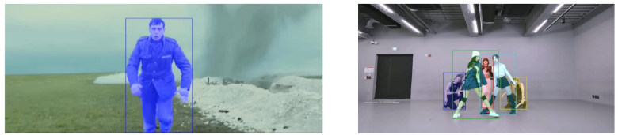

## 3. 영상 생성 파운데이션 모델들

### 이미지 생성(Image Generation)
- 대규모 이미지로 학습되어 텍스트 설명을 토대로 새로운 이미지를 생성

  

### Closed 이미지 생성 모델
- DALL E 3(OpenAI)
  - 출시 시기: 2023년 10월 ChatGPT에 통합 출시. 상용 API 및 Bing Image Creator로도 제공
  - 대화를 통해 프롬프트 개선 및 이미지 생성 가능
  - ChatGPT 서비스에 내장
  - 텍스트 인식 및 생성 능력 향상으로 복잡한 프롬프트도 정교하게 반영. 강화된 안전장치

    
    
### Closed 이미지 생성 모델 - DALL E 예시

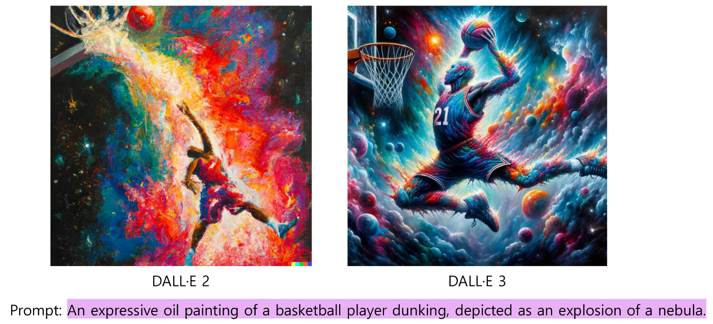

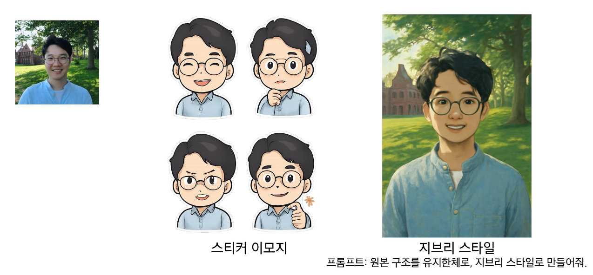

### Closed 이미지 생성 모델
- Midjourney v7 (Midjourney Inc.)
  - 출시 시기: 2025년 4월 알파 버전 공개
  - 모든 이미지에서 세부 묘사(높은 품질), 프롬프트 해석 정확도, 손과 신체 표현의 일관성
  - 긴 프롬프트 이해, 세밀한 스타일 조정(색상/음영 등), 텍스트 포함 이미지 생성

    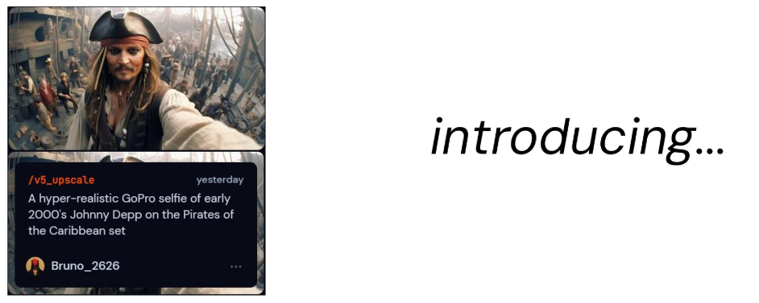

### Open Source 이미지 생성 모델
- Stable Diffusion 3 / 3.5 (Stability AI)
  - 출시 시기: 각각 2024년 2월, 10월 공개
  - 오픈소스 가중치 공개 (허깅페이스에서 모델 다운로드 및 로컬 사용 가능)
  - Diffusion Transformer 아키텍처 도입으로 이미지 품질 향상 및 다중 객체 프롬프트 처리 개선
  - 특히 텍스트 및 글자 표현이 강화되어 이미지 내 문구 생성 정확도가 향상됨
  - 다양한 크기 모델 제공 (800M~8B 파라미터)으로 성능과 자원 요구 균형 조정 가능

    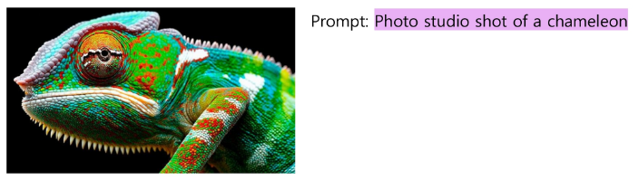

- FLUX(Flux.1) (Black Forest Labs)
  - 출시 시기: 2024년 8월 공개. 일부 상용(Pro) 버전 존재하나 Flux.1 Schnell/Dev는 오픈소스 가중치 제공
  - 12억 파라미터의 Rectified Flow Transformer 기반 최신 모델
  - 프롬프트 준수, 스타일 다양성과 복잡한 장면 생성에 강점
  - 텍스트 이미지화 능력이 탁월하여, 이미지 안에 선명한 글자나 숫자 표현 가능
  - 세 가지 모델 변형
    - Pro: 최고 성능(API 유료 제공)
    - Dev: 오픈 가중치, 연구용(비상업)
    - Schnell: 경량, 고속, 오픈소스/상업용 허용
  
      

      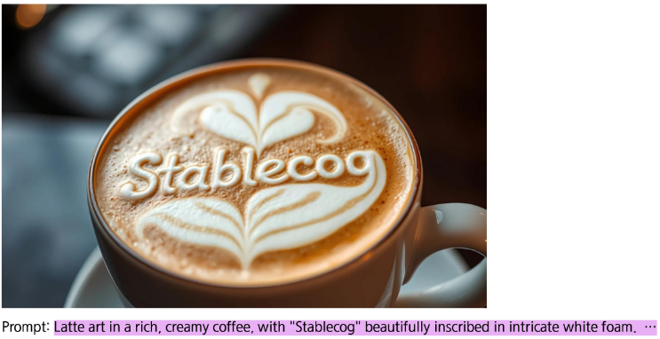

### 이미지 생성모델 응용 - 파인튜닝으로 용도 변경
- ControlNet (2023)
  - 컨트롤 조건 입력을 기반으로 사용자가 원하는 이미지를 생성해주는 이미지 생성 모델
  - 커뮤니티 중심으로 매우 활발하게 응용되고 있음

    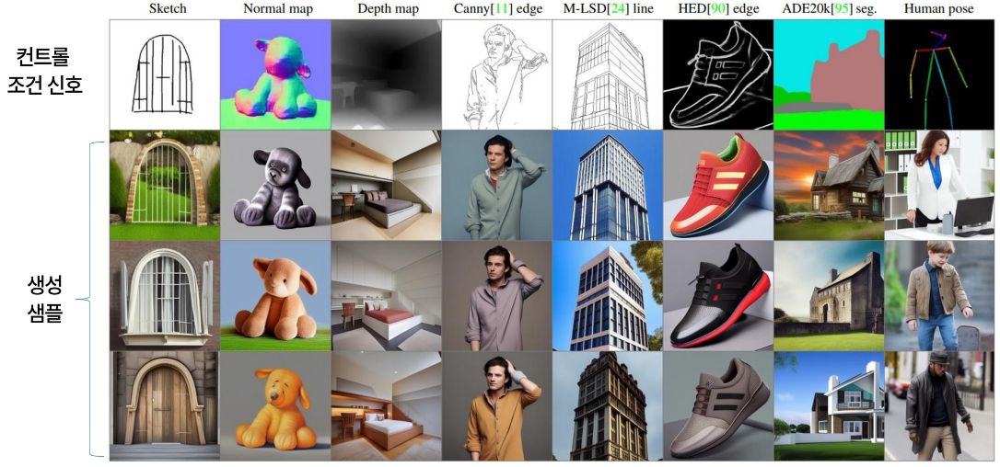

    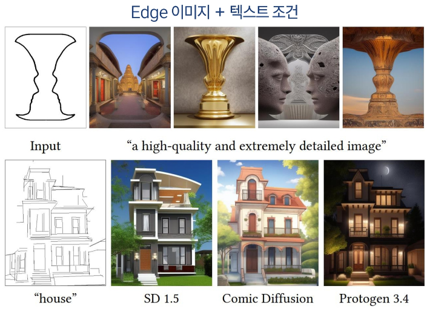

- 노블-뷰 생성 모델 - Zero123XL(콜롬비아 대학; 2023): 2D에서 3D로 변환
  - 2D 이미지를 입력으로 받아 해당 물체를 특정 위치의 카메라 뷰로 바라보았을 때의 모습을 생성하는 모델
  - 추가로 2D 이미지 입력만으로 해당 물체의 3D 전체 모습을 재현할 수 있음
  - 응용: 3D 모델링, 가상현실(VR) 및 증강현실(AR) 콘텐츠 생성에 사용

    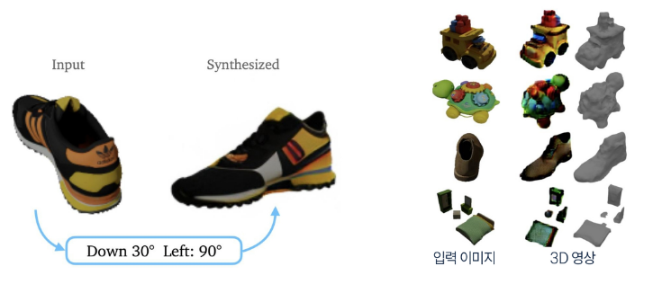

- 정교한 3D Depth map 추정 - Marigold (2024)
  - 단안 깊이 추정(monocular depth estimation)을 위해 이미지 생성 Diffusion 모델을 합성데이터에 파인튜닝

    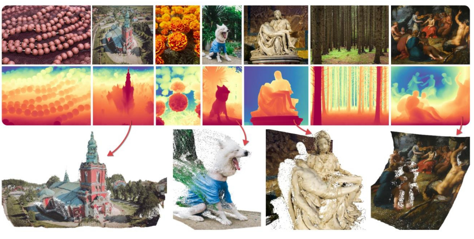

- 이미지 & 3D 동시 생성 모델 - JointDiT(Microsoft, POSTECH)
  - 출시 시기: 2025년 5월
  - 기능: 이미지와 3D 깊이 맵 동시 생성, 입력 이미지의 3D 추정, 3D 기반 이미지 생성 등 다양한 기능 지원
  - 물리적으로 더욱 그럴듯한 장면 생성

    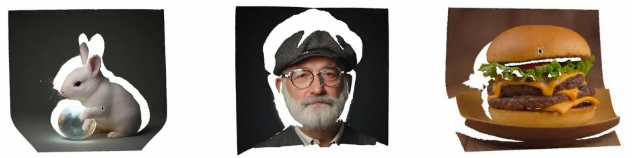

## 4. 3D 파운데이션 모델

### Depth Anything v2(HKU, TicTok; 2024)
- SAM 이후 연구된 많은 vision foundation 모델 중 깊이맵(depth map) 예측을 위한 모델
- SAM과 마찬가지로 약 150만 개의 방대한 데이터로 학습됨
- 이 때 약 6,200만 개의 라벨링되지 않은 데이터를 추가로 활용하여 성능 극대화
- 응용: 자율주행, 로봇 비전, 3D 복원 등 다양한 작업에서 사용

  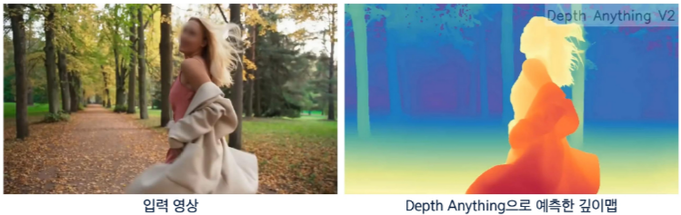

  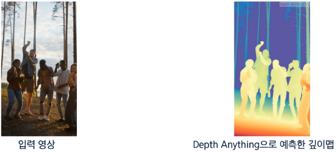

### 사람 중심 모델 - Sapiens(Meta; 2024)
- 인간 형태 인식을 위해 3000만 개의 이미지로 학습된 파운데이션 모델
- 사람 중심 태스크들
  - 2D Pose Estimation: 인간의 자세를 예측함
  - Body-parl Segmentatino: 신체부위를 구분함
  - Depth Estimation: 카메라와의 거리를 예측함
  - Surface Normal Prediction: 3D 모델링을 위해 표면의 법선 방향을 예측함

    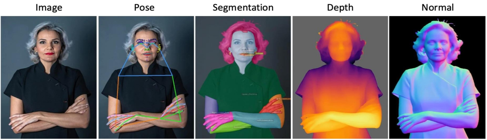

## 5. Closed 비디오 생성 모델

### Sora (OpenAI)
- 출시 시기: 2024년 12월 ChatGPT Pro (월 $200) 플랜에 공개. 웹 플랫폼 sora.com을 통해 제공
  - ChatGPT Plus 사용자는 제한적으로 720p 이용 가능
- 텍스트 -> 비디오 생성 및 이미지/동영상 -> 비디오 확장 모두 지원
- 최대 1080p, 20초 길이 영상 생성 (Pro 구독시)
- ChatGPT 통합된 대화형 편집 - 사용자 피드백으로 반복 개선 가능
- 물리적인 이해를 보여줌 (월드 모델로의 가능성을 보임)

  

### Veo 2 (Google Gemini)
- 출시 시기: 2025년 4월 Gemini Advanced 구독자에게 공개
  - Google AI Studio (Gemini)에 통합
- 8초 길이, 720p 해상도의 와이드스크린 비디오 생성
- 생성 영상에는 워터마크가 포함되어 합성 비디오 식별 가능
- Whisk Animate 기능으로 정적 이미지를 비디오로 변환 가능
- TikTok, YouTube 등에 바로 공유 가능 편의성 제공

### Veo 3 (Google Gemini)
- 자연스럽게 싱크된 소리까지 같이 생성

### 비디오 편집 모델
- Modify Video

  

- Canvas (Higgsfield)

### 응용 사례 - 컨텐츠 생성
- AI로 만든 광고/영화 - Coca-Cola

### 응용 사례 - 비디오 생성 모델 기술 스택 사례
- HeyGen's Avatar IV
  - 입력 {텍스트 스크립트, 목소리 샘플, 사진 한 장} => 출력 {스피킹 비디오}
  - 기술스택
    - NotebookLM (Google)로 podcast 스크립트 및 음성 생성 => Avatar IV (HeyGen)로 영상 생성

      

### Open Source 비디오 생성 모델
- Wan 2.2 (Jul. 2025)
  - 지원 모드: text-to-video, text & image-to-video, sound-to-video, and image-to-video
  - 시네마 퀄리티
  - 1280x720 해상도 (720p), 24 FPS 까지 생성 가능

## 6. Dynamic 3D 파운데이션 모델

### MegaSaM(Google DeepMind)
- 출시 시기: 2024년 12월 (CVPR 2025 구두 발표)
- 단안 카메라 동영상에서의 정확한 카메라 포즈 및 깊이 추정

  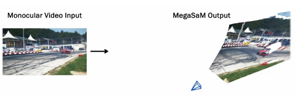

### CUT3R(UC Berkeley, Google DeepMind)
- 출시 시기: 2025년 1월 (CVPR 2025 구두 발표)
- 가상 시점에서의 미관측 영역 추론
- 비디오 스트림이나 순서가 없는 사진 모음과 같은 다양한 길이의 이미지를 자연스럽게 처리

  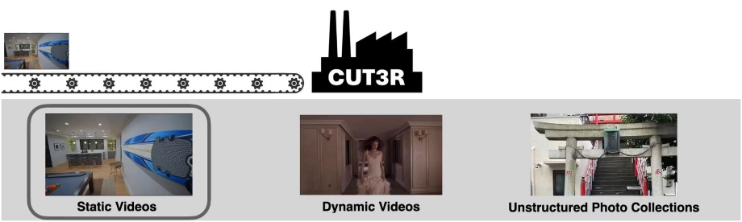

## 7. Audio-Vision Language Models

### Audio-Vision Language Models
- 대규모 언어모델에 영상, 소리 입력을 확장해 멀티모달 언어모델로 확장 발전 중
- ImageBind 기반 비디오 입력: OneLLM(2024)
- 프레임 단위 비디오 입력: VideoLLaMA2(2024)

  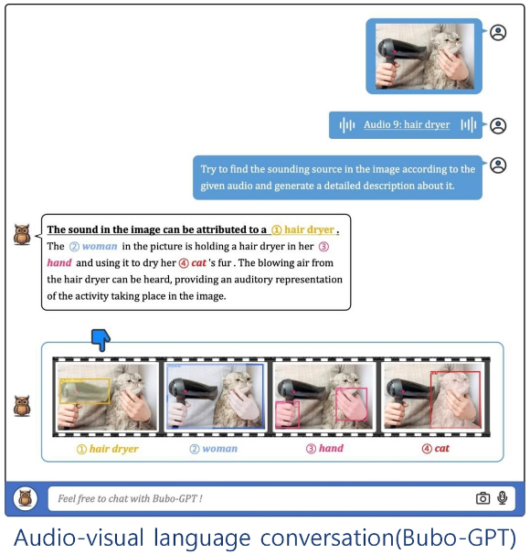

## Toward Unified Foundation Models

### NExT-GPT: Any-to-Any Multimodal Large Language Model (2023)

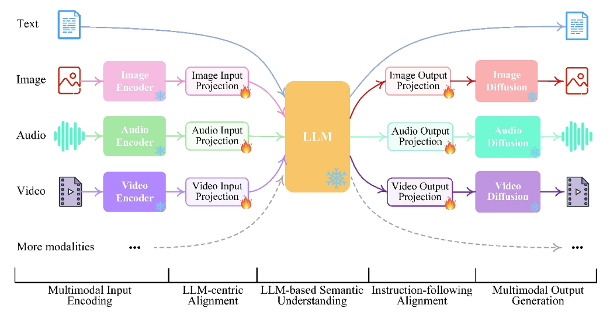

## 유용한 파운데이션 모델들 정리

### 최신 프론티어 모델들은 게속해서 갱신되고 있어, 본인만의 리스트를 만들어 놓는 것이 경쟁력이 될 수 있음
- Image: DINOv3
- Image & Text: CLIP, BLIP, (Grounded: GLIPv2)
- Language-to-policy: RT1, RT2
- Speech recognition: wav2vec, Whisper
- Audio & text: CLAP
- Multi-modal embedding: ImageBind, Mega-Transformer
- Multi-modal LLM: InternVL, Qwen3-VL
- Objent 3D: Zero123XL
- Text & satellite: RemoteCLIP

# 파운데이션 모델의 주 응용 방법 - 적응 학습

## 1. 파운데이션 모델 + Fine-tuning

### 파운데이션 모델(Foundation model)과 미세조정(Fine-tuning)이 필요한 이유
- 방대한 테이터로 학습된 초대형 딥러닝 모델. 다양한 작업이나 범용적인 문제에 바로 적용 가능
- 최근에는 텍스트 뿐만 아니라 이미지, 오디오, 비디오 등의 다양한 입력 데이터를 처리할 수 있는 멀티모달로 확장
- 하지만 최신 정보나 특정한 작업/도메인에 최적화되어 있지 않아 즉시 활용이 어려운 경우가 반드시 있음

### AI 리터리시++
- 차별화된 AI 종합 활용 능력
  - AI의 작동 원리를 이해하고 AI가 생성한 정보를 비판적으로 분석하며 AI를 도구로서 효과적으로 활용할 수 있는 역량 **+ AI를 내 입맛대로 변경해서 사용할 수 있는 능력**

    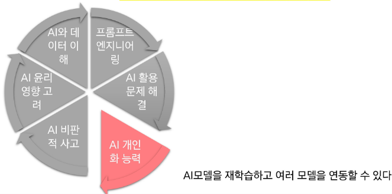

### 미세조정(Fine-tuning): 추가 학습을 통해 이미 학습된 모델을 조금만 튜닝하는 것
- 미세 조정(Fine-tuning)을 통해 특정 작업에 특화된 모델을 개발할 수 있다
- 파운데이션 몸델 + Fine-tuning = 실용적인 개인화 파운데이션 모델
  - 적은 데이터로 학습 가능
  - 학습 리소스 절약 가능
  - 특정 작업에 대한 우수한 성능
    
    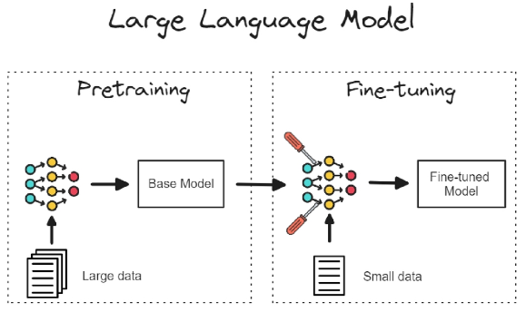

## 2. Fine-tuning이란

### 미세조정(Fine-tuning): 추가 학습을 통해 이미 학습된 모델을 조금만 튜닝하는 것
- (MLLM 가정) **사전 학습된 모델에 프롬프팅을 통한 작업을 했을 때보다 더 좋은 퀄리티의 결과물을 생성**
- **프롬프트에 넣는 예제보다 훨씬 더 많은 예제를 통해 학습 가능**
- 프롬프트의 길이가 줄어들면서 토큰 개수 절약
- 응답하는 데에 걸리는 시간(latency)을 단축

  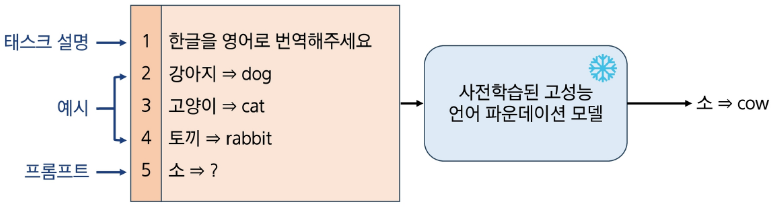

  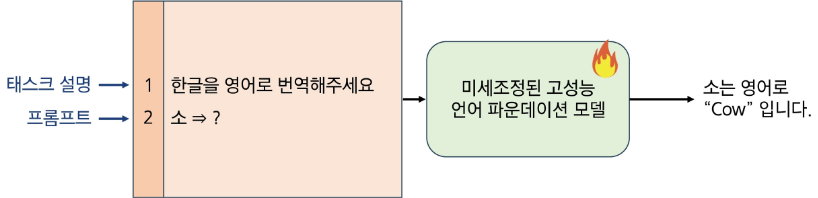

### Remind - Gradient Descent(GD)
- Gradient(경사): 손실함수(Loss) 미분을 통해 구한 기울기
- 예시

  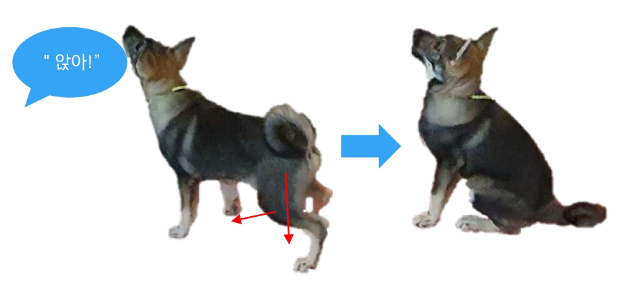

## 3. 하이퍼파라미터 - Learning Rate
- 손실함수가 큰 값일 때 미세하게 조정하기 어려우므로 뉴럴넷 모델에 작은 비율로 반영함
- Learning rate: 반영할 비율

### 적절한 learning rate 값
- 모델과 데이터마다 달라 실험을 통해 구함
- 예시: 0.005배 (5e-3), 0.0003배 (3e-4)

  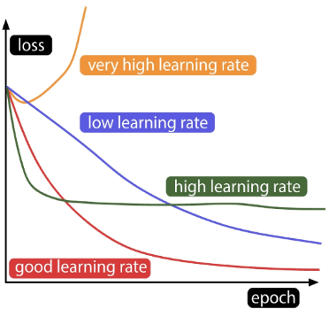

### 너무 낮은 learning rate 값
- local minimum에 빠져서 global minimum에 도달할 가능성이 낮아짐
- 예시: 0.00000001배 (1e-8)

  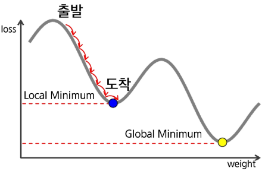

### 너무 높은 learning rate 값
- 마구 점프를 뛰다보니 global minimum으로 딱 맞춰 가기 어려워짐
- 예시: 0.1배 (1e-1)

  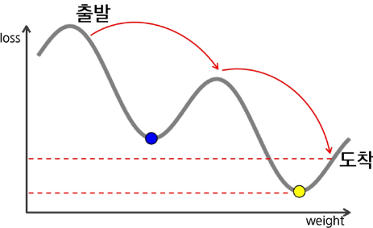

- 미세조정에서는 좋은 시작점에서부터 시작하기 때문에 작은 learning rate 부터 보수적으로 시작해야 함

### 예시

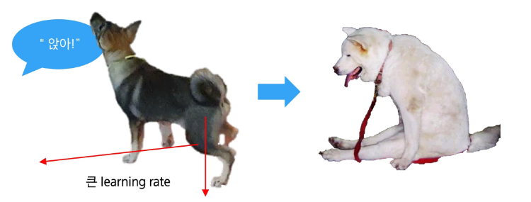

## 4. Parameter-Efficient Fine-Tuning(PEFT)

### AI 모델의 크기
- 하드웨어의 발전, 대규모 데이터의 축적 그리고 AI 모델의 발전에 따라 학습 비용과 모델 용량이 기하급수적으로 증가하고 있음

  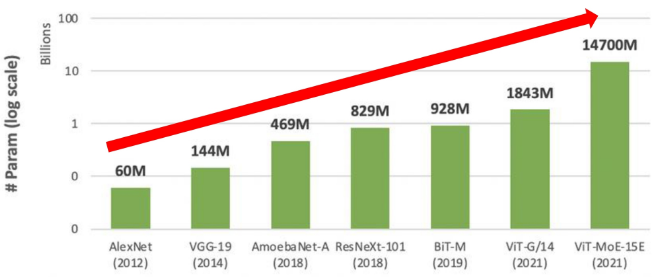

### 효율적인 모델 학습
- 오픈소스로 공개된 고성능 파운데이션 모델을 출발점으로 미세조정하는 접근이 일반화되었으나, 여전히 높은 비용
- 효율적인 미세조정 방법
  - 프롬프트 튜닝(prompt tuning)
  - Adaptor 모듈 추가 학습 (예: Low-Rank Adaptation of Large Language Models; LoRA)

    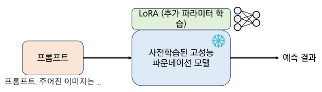

### 프롬프트 디자인(prompt design)
- 언어모델에서 주로 활용. 모델이 원하는 레벨의 결과를 출력할 수 있도록 입력 텍스트를 변형하는 방법
- 장점: 추가 학습 없이 사전학습된 모델의 예측 성능을 끌어올릴 수 있음
- 단점: 프롬프트를 사람이 직접 설계해야 한다는 부담이 있으며 성능 향상이 제한적

  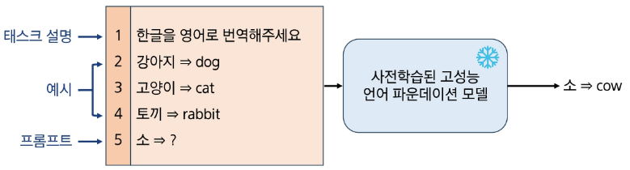

### Text-to-Image 예시

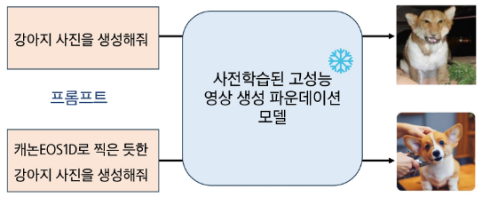

### 프롬프트 튜닝(prompt tuning; 2021)
- 학습 가능한 프롬프트로서, 가상 토큰(virtual token)을 입력에 추가
- 역전파를 통해 오직 가상 토큰에 대한 임베딩만 학습하고 나머지 모델은 고정
- 장점
  - 사람의 디자인 없이 스스로 프롬프트를 학습할 수 있음
  - 사전학습된 모델을 고정할 수 있음 
  (지식 손실 x; 일반 파인튜닝은 지식 손실 발생)
  - 적은 비용으로 새로운 데이터셋의 모델을 학습할 수 있음
- 학습된 프롬프트는 해석 X (그저 숫자 열일뿐)

  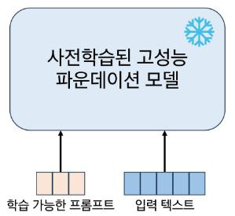

  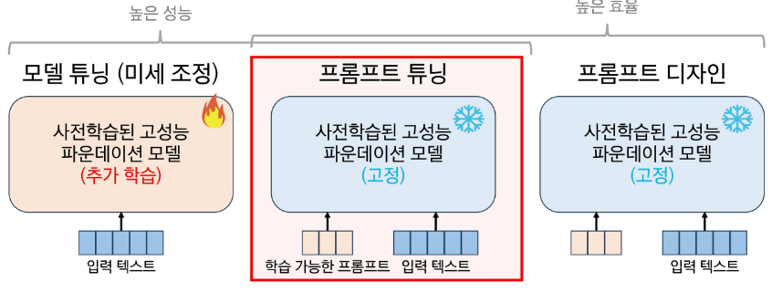

### Adaptor 모듈 추가 학습
- Activation을 변경하기 위해 작은 모듈을 추가하여 학습하는 기법

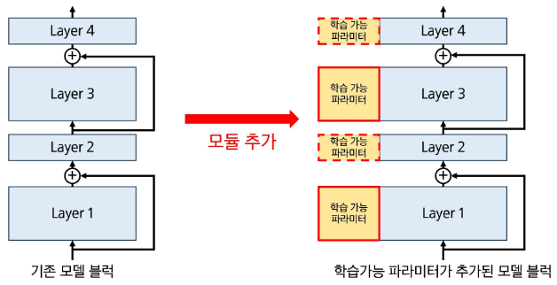

## 5. 개인화 모델 예시

### 프롬프트 튜닝 응용 사례 - DreamBooth
- 영상 생성 모델 개인화 방법 - 입/출력 결과 예시

  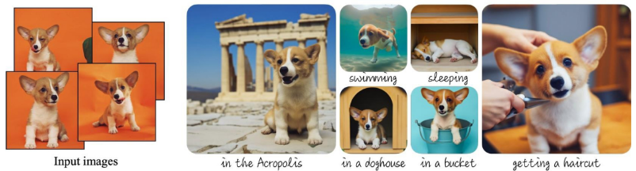

- 영상 생성 모델 개인화 방법 - 방법론 오버뷰
- 학습 가능 토큰(Unique identifier)와 모델을 같이 Fine-tuning

  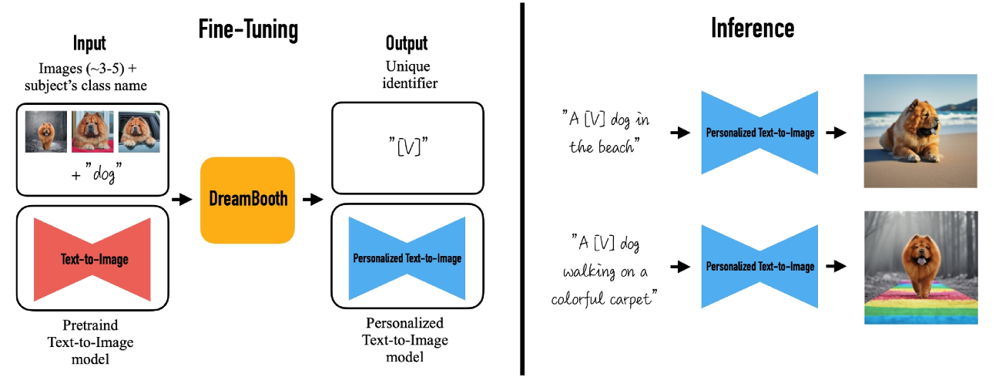

- 영상 생성 모델 개인화 방법 - 응용 결과 예시

  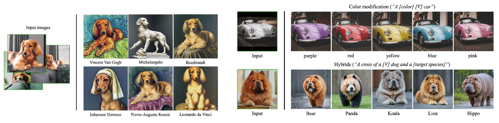

# 데이터 효율화를 위한 합성 데이터 사용

## 1. 합성데이터 활용법 1

### Knowledge Distillation (Teacher-Student 학습)
- 사전학습된 고성능 모델의 지식을 작은 모델에 압축해서 빠르고 효율적으로 만들 수 없을까?
- 지금까지 배운 미세조정과 같은 전이학습(Transfer learning)은 사전학습된 모델과 새로 학습할 모델(타겟 모델)의 구조가 동일한 경우를 가정하고 있었음

  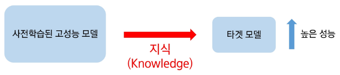

### 지식증류: 높은 성능의 무거운 모델(선생님)을 모방하도록 가벼운 모델(학생)을 학습하는 방법
- 또는, 크기가 작은 모델(student)만으로 충분히 학습하기 어려운 데이터 특징을 학습하기 위해 비교적 무겁고 성능이 높은 모델(teacher)의 도움을 받는 기법으로 볼 수 있음
- 선생님 모델이 예측한 soft-label 값과 학생 모델의 예측값이 가까워지도록 학습 유도
  - Soft-label: [0, 1] 사이의 모델의 예측을 가짜 라벨(정답)로 사용

    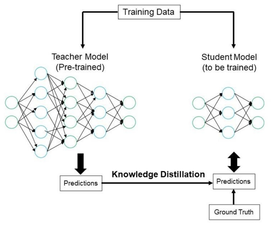

### Knowledge Distillation (Teacher-Student 학습)

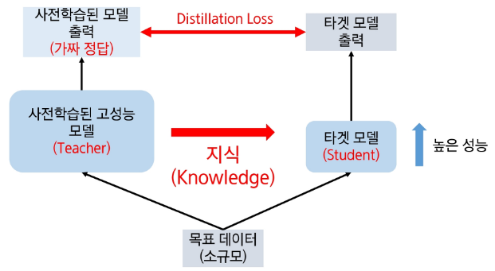

## 2. 합성데이터 활용법 2

### 파운데이션 모델들을 툴로 활용하는 방법 - InstructPix2Pix (2023)
- 명령(지시사항; instruction)에 따라 이미지 편집을 수행하는 모델
- 기존 방법: 입력 이미지와 출력 이미지에 대한 상세 설명 필요
- 본 방법: 입/출력 이미지 상세 설명 없이, 명령만으로 편집 수행

  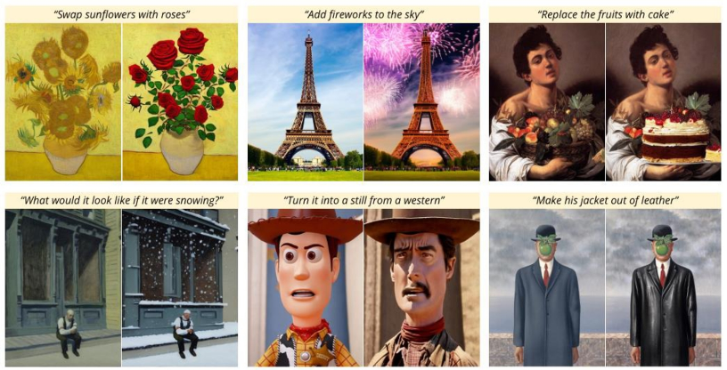

### InstructPix2Pix 방법 (1)
- 기존 범용 데이터셋: {이미지, 이미지 설명 (캡션)}
- 지시사항(instruction) 기반 이미지 편집을 지도학습 문제로 전환 (입력 데이터-정답 쌍 필요)
- 가장 먼저, {이미지 편집에 대한 지시사항, 편집 전 이미지, 편집 후 이미지} 형식의 학습 데이터셋 생성

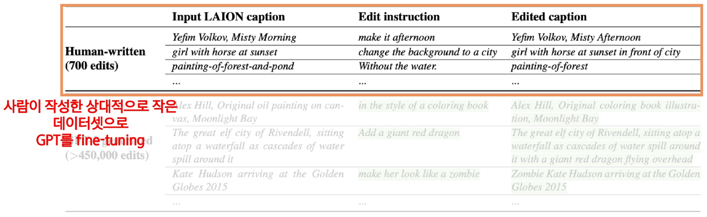

### InstructPix2Pix 방법 (2)

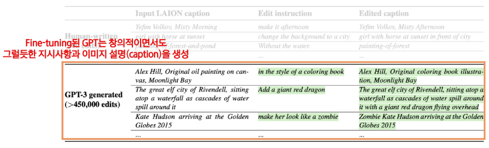

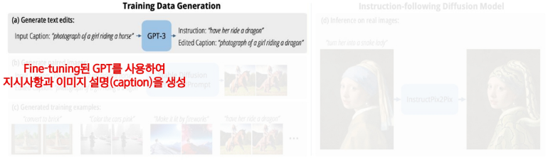

### InstructPix2Pix 방법 (3)
- 그 후, 생성된 텍스트 데이터셋을 기반으로 별도의 이미지 편집 생성 모델로 영상 데이터 쌍 생성

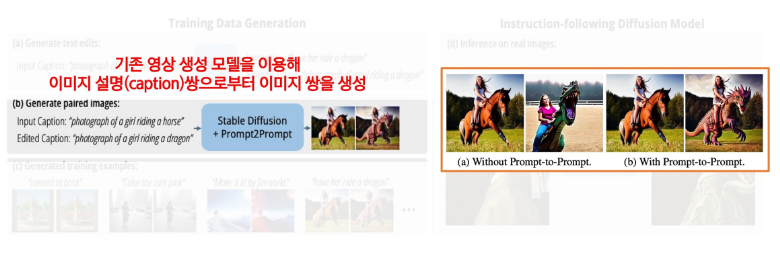

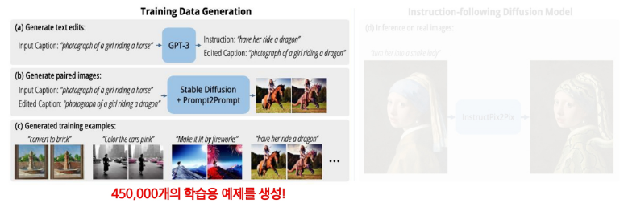

### InstructPix2Pix 방법 (3)
- 생성된 이미지-명령 쌍 데이터셋을 기반으로, 최종 이미지 편집 생성 모델을 학습 (fine-tuning)

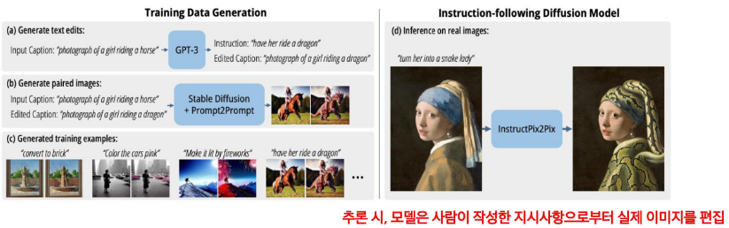

### InstructPix2Pix 결과

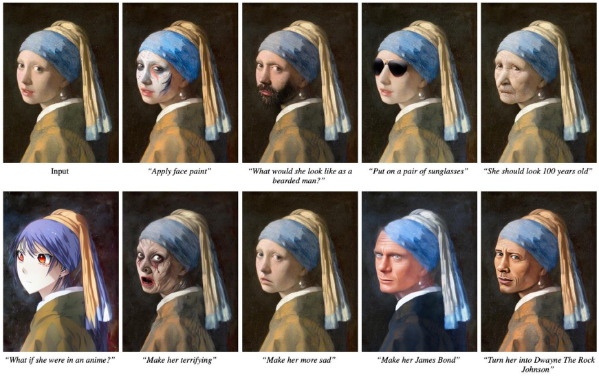

### LLaVA에서도 합성데이터 활용

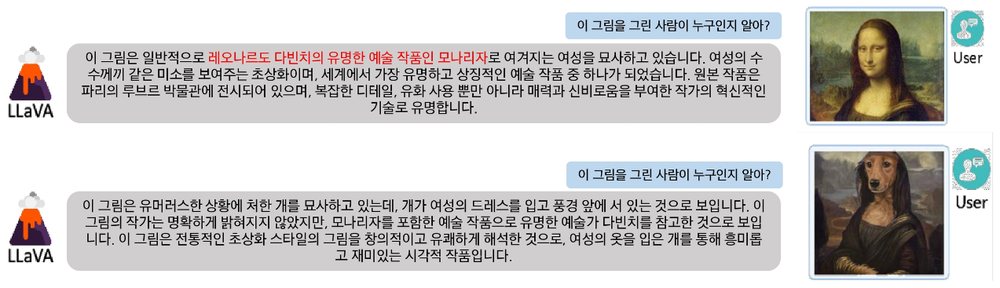

### LLaVA 학습 데이터
- GPT를 활용하여 시각 설명 데이터(visual instruction data) 생성
  - 기존에 존재하는 이미지, 캡션, 탐지 데이터셋 정답 데이터 활용
  - GPT를 이용하여 문제-정답 데이터 쌍을 생성

## 3. 합성데이터 활용법 3

### 간단한 시뮬레이션 기반 합성 데이터: 실제 데이터를 모방하거나 새로 생성한 인공 데이터
- 예시: 가상의 이미지, 텍스트, 소리 등을 알고리즘을 통해 생성
- 실제 데이터를 수집하거나 사용하기 어려운 경우에 대체 가능
- 데이터 부족 문제를 해결하고 모델 성능을 개선하는데 사용

  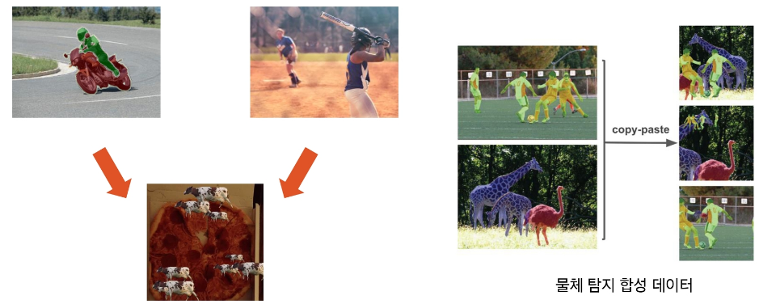

### 합성 데이터는 데이터 취득이 어려운 문제에서 특히 더 유용
- 실제 촬영하기 어려운 움직임이나 환경을 시뮬레이션하여 다양성 높은 데이터를 생성 가능
  - 예시) 모션 증폭: 심박수 변화, 건물 진동 등의 미세한 움직임을 합성 데이터로 학습 간으

# What's next?

## 1. Sora (2024) by OpenAI: 텍스트-비디오 생성 모델

### 응용 사례: 비디오 생성 기반 3D 장면 복원

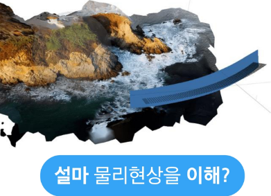

### 월드 모델로의 잠재성
- 로봇 제어와 같은 Embodied AI의 핵심 컴포넌트로 주목받고 있음

  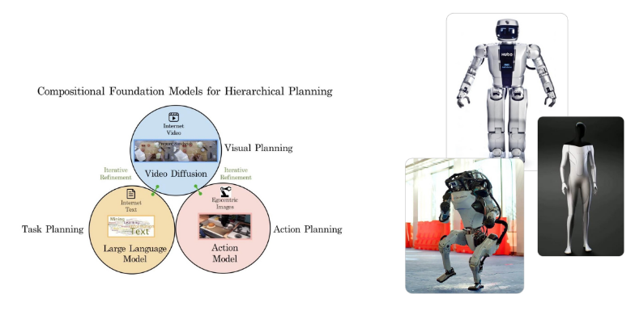

## 2. 언어모델 + 검색증강생성

### 언어모델(LLM) + 검색증강생성(Retrieval Augmented Generation; RAG)
- 유연성: 추가 학습 없이 최신 정보 제공
- 개인화: 검색과 언어모델의 합성으로 개인 맞춤형 답변 가능
- 정확성: Verification을 통한 환각(Hallucination) 현상 감소

  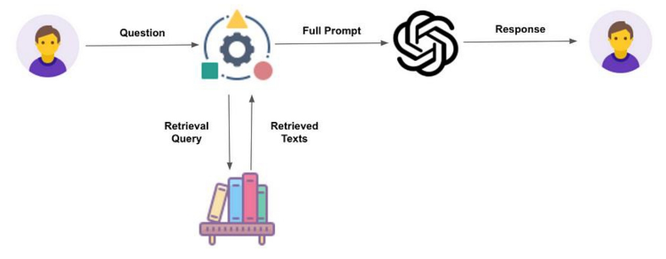

### 툴 증강 언어모델
- Tool augmented LLM (Agent)
  - Visual Programming by AI2(2023)
  - Toolformer (2023)
  - Claude - Computer Use, MCP

    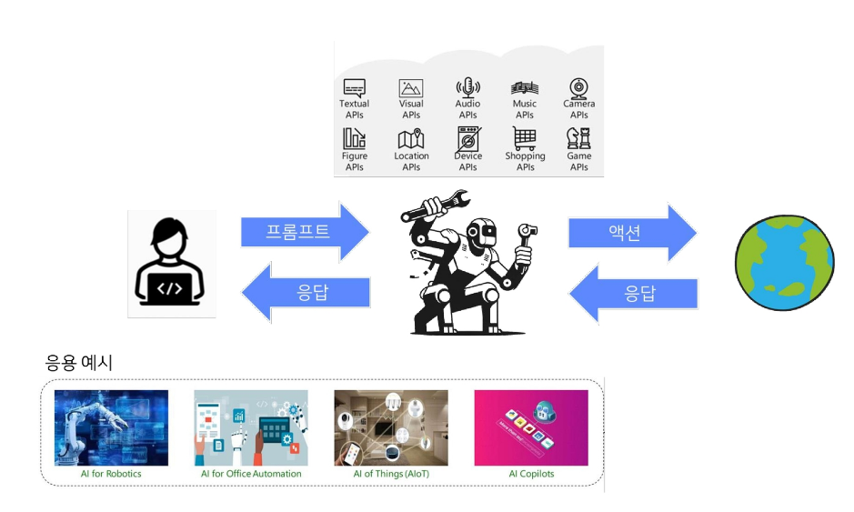

- Visual Programming (2023)
  - 언어 모델의 추가 학습 없이 주어진 툴을 사용하여, 사용자가 텍스트로 요청한 영상 처리를 수행

    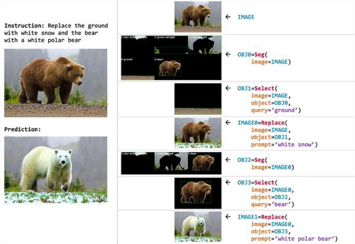
  
    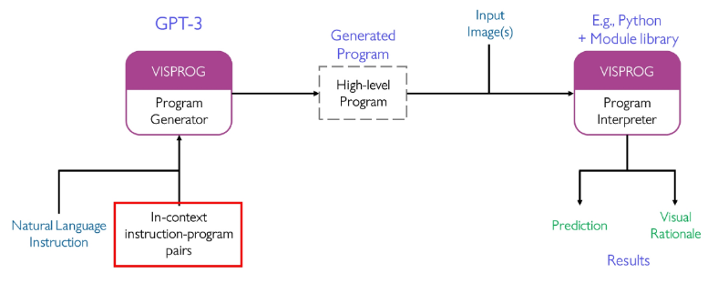

    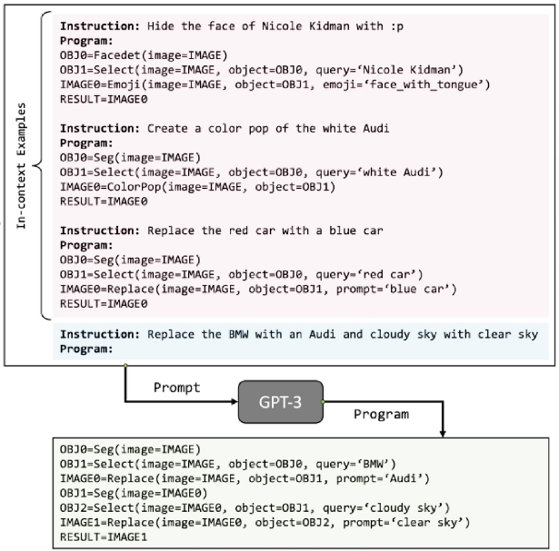

  - 사전 정의된 툴들 (Python APIs)

    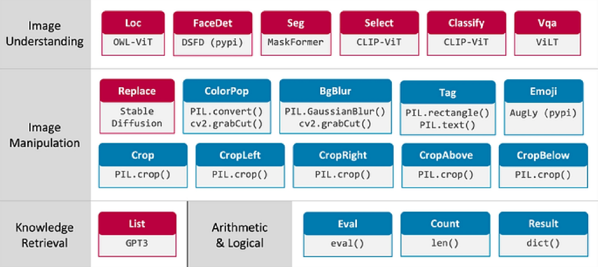
  
  - 응용 사례: 영상 질의응답

    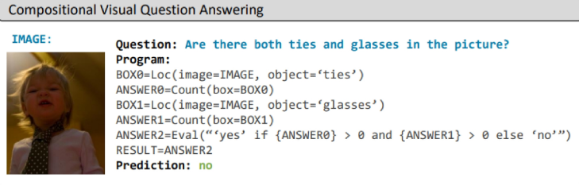

  - 응용 사례: 영상 기반 추론

    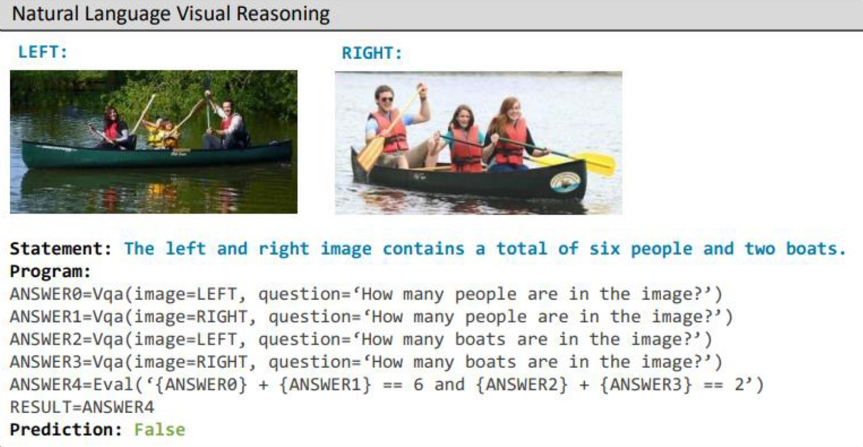

  - 응용 사례: 영상 편집

    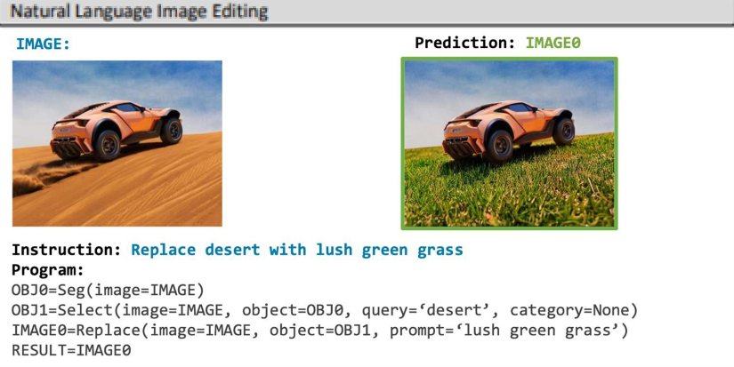

- Claude Computer Usd: 텍스트를 기반으로 컴퓨터를 사람처럼 사용할 수 있는 서비스
  - 컴퓨터가 수행하길 바라는 지시사항을 텍스트로 입력하면 자동으로 명령 수행
  - 각 명령어를 실행하는 agentic tool로 구성되어 있는 서비스

    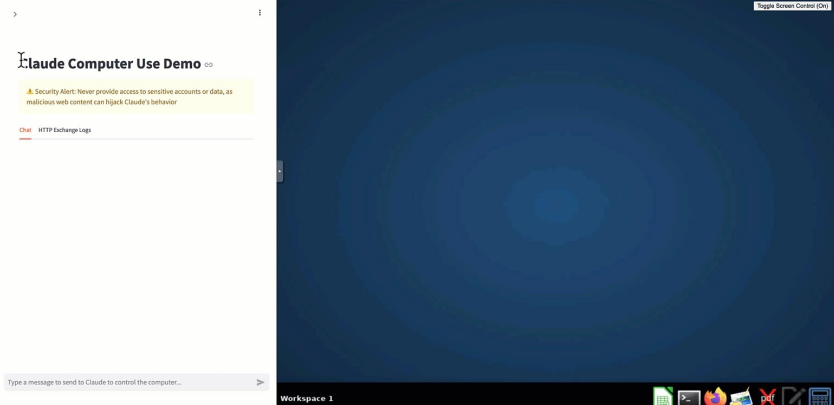

## 3. Agent 모델

### Genspark AI Browser

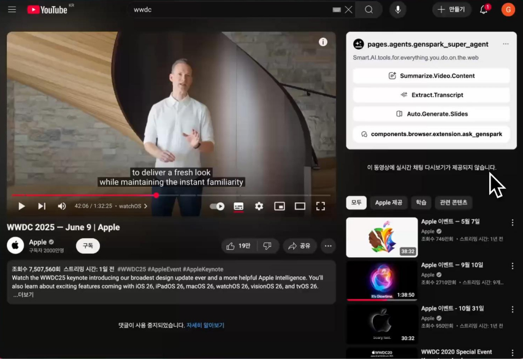

### Multi-Agent 시스템으로의 확장
- Agent Laboratory
  - Agent system을 활용하여 연구를 자동으로 수행하는 시스템 개발
  - 연구를 진행하는 단계를 agent system처럼 구축하여 자동으로 연구 주제 탐색 및 논문 작성을 유기적으로 수행

    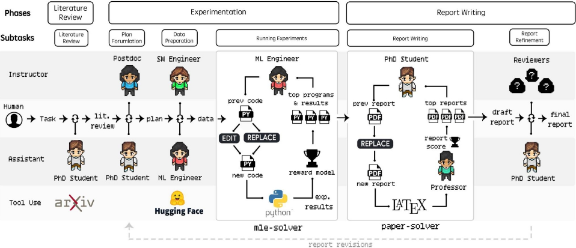

# 실습. 허깅페이스 기반 배포/서빙

## 실습. 허깅페이스(Huggingface)

### AI 관련 오픈 소스 모델과 데이터셋을 공유하는 플랫폼
- 주요 특징: 사전학습 모델 가중치 제공, 모델 학습을 위한 다양한 데이터셋 제공
- 응용 분야: 자연어 처리(NLP), 컴퓨터 비전(CV), 음성 인식(Speech) 등 다양한 분야에서 제공

### 허깅페이스 활용
- 허깅페이스에서 제공하는 모델을 직접 불러와 다양한 작업에 적용
- 파운데이션 모델을 활용한 손쉬운 실습 가능

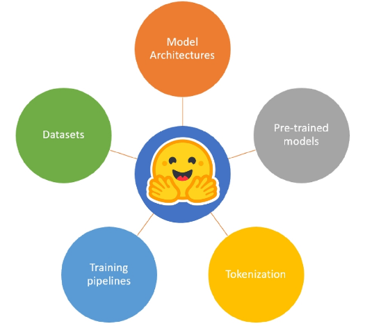

## 실습. 허깅페이스(Huggingface)애서 제공하는 모델 서빙

### 모델 서빙
- 사용자에게 모델의 예측 결과를 전달하는 절차
- 주요 요소
  - 배포: 학습된 모델을 서비스 가능한 상태로 변환하여 시스템에 설치 및 실행 유지
  - API 제공: 모델에게 입력을 전달하고 실행할 수 있는 인터페이스 제공 (예: REST API, gRPC)
  - (운영 보조 기능): 확장 및 라우팅, 모니터링 등의 툴 제공

    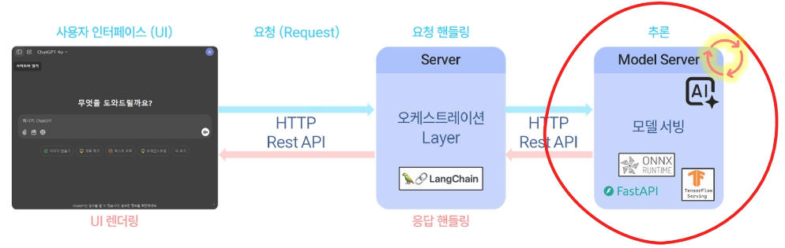

### Hugging Face Inference API
- 별도 서버 구축 없이 Hugging Face 플랫폼에서 REST API만으로 모델을 바로 사용할 수 있는 서비스
- 연구 및 테스트 목적: Request 수 제한 있음 (무료, 유료 버전)

  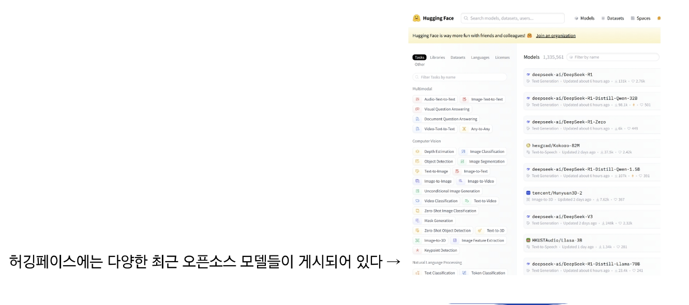

- 모든 게시 모델이 Deploy(배포)를 지원하지는 않음
- Inference API 선택

  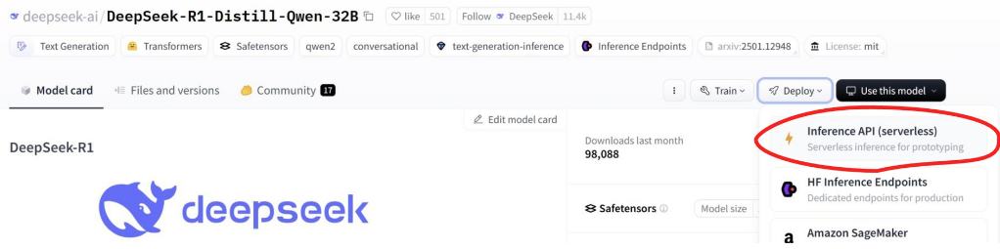

- Inference API 사용법 예시
- OpenAPI라고도 부름
- Python, JavaScript, cURL 등 지원
- api_key: 사용자별 고유 액세스 키
  - 사용자별 고유 비밀번호에 해당
  - Hugging Face 홈페이지의 Access Token을 발부받아 해당 부분을 변경해야함

    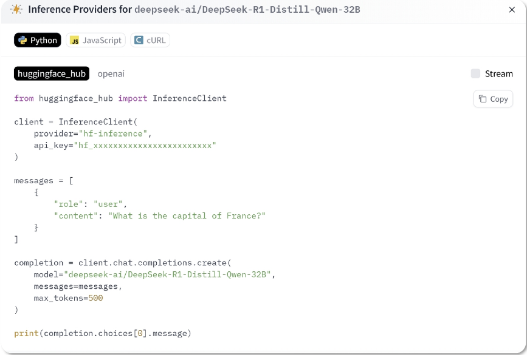

    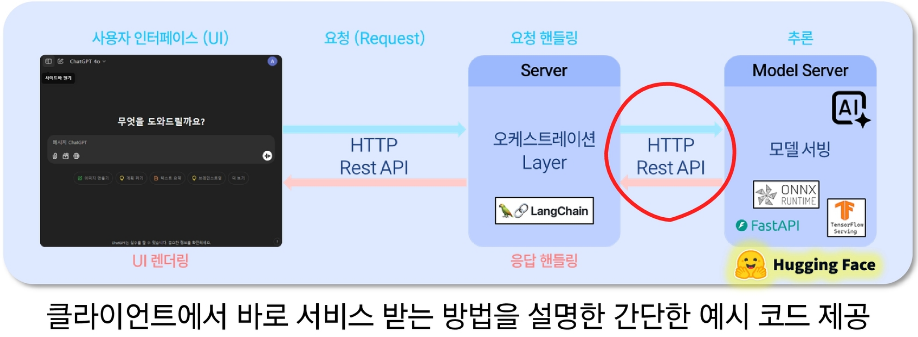

## 실습. 모바일 모델 서빙

### 안드로이드에서 Gemma 모델 실행하기
- 모바일 서빙 프레임워크 MediaPipe, MLC LLM을 통해 쉽게 LLM 모델 실행 가능
- 모바일 안드로이드에서 LLM 모델을 사용할 경우, 개인 정보 보안 문제와 인터넷 연결이 끊긴 상태에서도 사용할 수 있다는 장점이 존재

  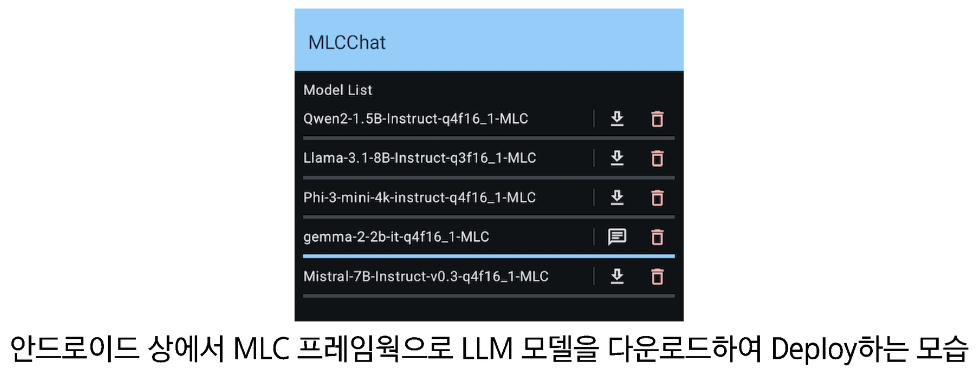

  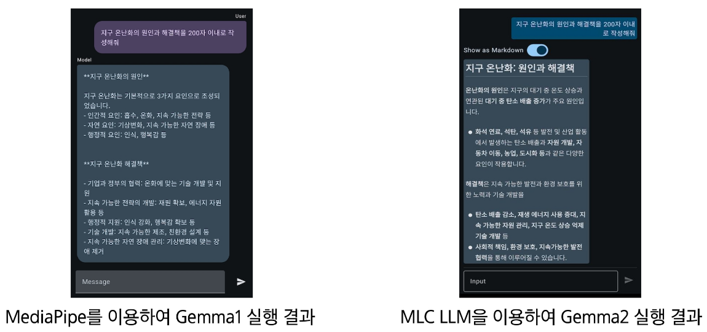

### 다양한 온디바이스 모델 시행
- LLM 뿐만 아니라 얼굴 인식에 사용되는 모델(MobileFace) 등, 다양한 모델들도 온디바이스 환경에서 실행 가능
- 추가학습: 멀티플랫폼 호환성을 위해 고안된 ONNX를 공부하고, 온디바이스 배포 방법에 대해서 조사해보기

  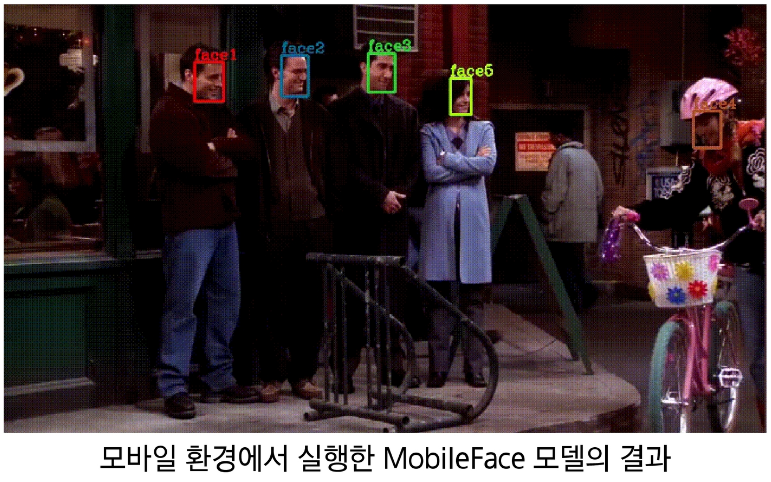

### Gradio
- 머신러닝 모델을 웹 인터페이스로 쉽게 배포할 수 있게 도와주는 오픈소스 라이브러리
  - 코딩 지식이 없는 사용자도 웹 브라우저를 통해 모델과 상호작용할 수 있는 환경 제공
  - Hugging Face와 통합되어 사용자가 Gradio 기반의 데모를 쉽게 생성하고 배포할 수 있음
  - 다양한 입력(이미지, 텍스트, 오디오 등)과 출력을 지원

    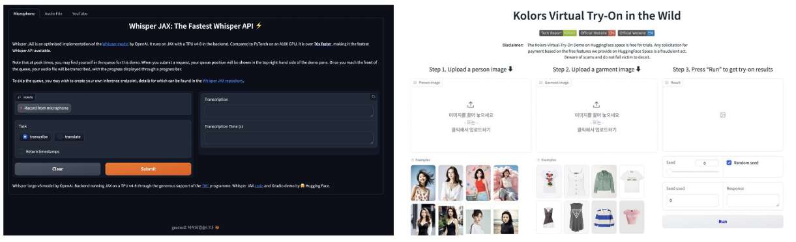

- 간단한 코드 몇 줄로 Gradio 앱을 만들고 Hugging Face에 업로드해 인터랙티브 웹 애플리케이션 배포 가능

  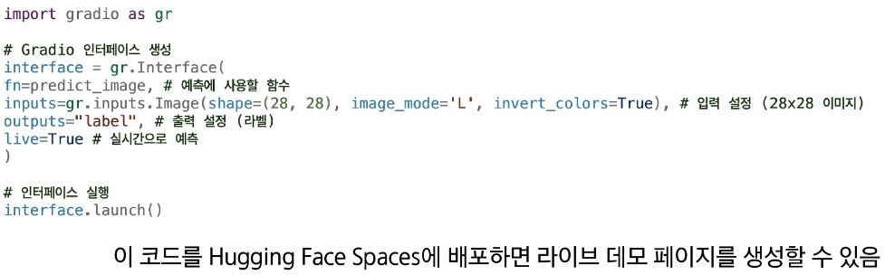