# 1. Pre-training vs Post-training

### 거대 언어 모델 학습 패러다임
- 최근 거대 언어 모델을 학습하기 위해서는 크게 **<u>두 가지 단계</u>**로 나눠짐
  - **Pre-training(사전 학습)**: 방대한 인터넷 텍스트를 통해 **언어와 지식을 배우는 단계**
  - **Post-training(사후 학습)**: 사람이 원하는 방식으로 **대화하고, 안전하고, 유용하게 만드는 단계**

### Pre-training(사전 학습)
- **방대한 인터넷 텍스트 데이터**를 이용한 Self-supervised learning 을 통해 **언어 패턴, 지식** 등을 배운다.
- 학습 목표: **<u>다음 단어 예측(Next Token Prediction)</u>**
- 예시
  - "내일은 비가 __" -> "온다" 의 확률을 가장 높게 만들도록 파라미터 업데이트

    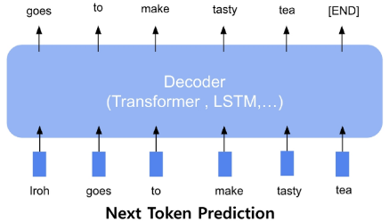

### Pre-training 후 모델의 응답 예시
- 다음 단어를 예측하는 데에 강점을 보이지만 **질문에 대한 대답을 하지는 않음**

  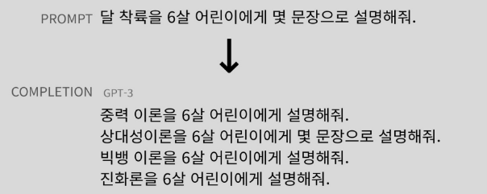

### Post-training(사후 학습)
- **<u>유저의 의도를 파악하고</u>** 원하는 답변을 모델이 응답하도록 **사후 학습**을 진행한다.
- 대표 기법
  - Instruction-tuning, RLHF(Reinforcement Learning from Human Feedback), DPO(Direct Preference Optimization), RLVR(Reinforcement Learning with Verifiable Reward)

    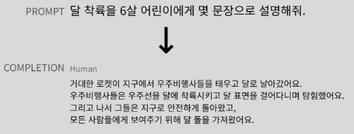

# 2. Instruction-tuning

### 사전 학습 후 언어모델의 한계
- 사전 학습 후 거대 언어 모델은 **<u>유저의 의도와 일치하지 않음</u>**
- 이를 해결하기 위해 **파인 튜닝**을 진행

  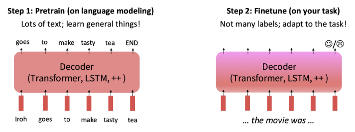

### 파인 튜닝이란?
- 이미 **사전 학습**된 기존 모델에 특정 작업이나 도메인에 맞게 **추가로 학습시키는 과정**

  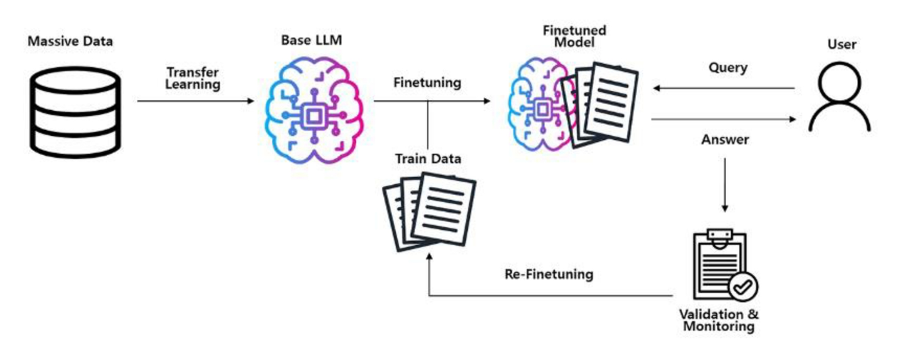

### Instruction-tuning 이란?
- 언어모델이 **<u>사람이 내린 지시문(instruction)을 따르도록 학습</u>**하는 단계
- **정답 레이블**이 요구되며, **다양한 태스크를 풀 수 있도록 적응**하는 것에 중점을 둠

  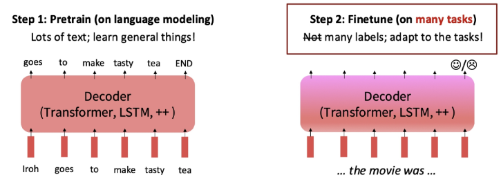

- **<u>다양한 태스크</u>**에서 (지시문, 응답) 쌍을 모아서 언어모델을 파인튜닝한다.

  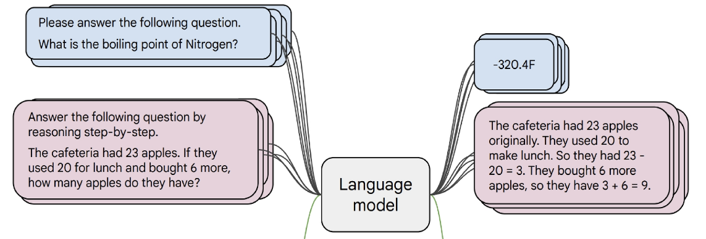

- **<u>새로운(모델이 학습하지 않은) 태스크</u>에서 평가를 진행**

  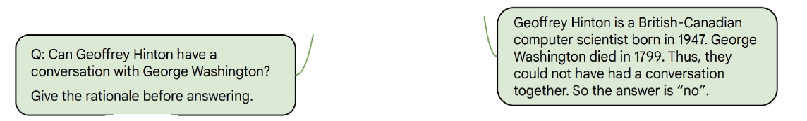

### 더 많은 태스크를 가진 데이터 학습
- 대부분의 경우와 마찬가지로, **데이터와 모델의 크기**가 핵심
- **<u>Super-NatrualInstructions</u>** 데이터셋은 1.6K+ 의 태스크와 3M+ 의 예시로 구성되어 있음
- 질문: 이러한 데이터로 학습한 거대 언어모델은 어떻게 평가해야 하는가?

  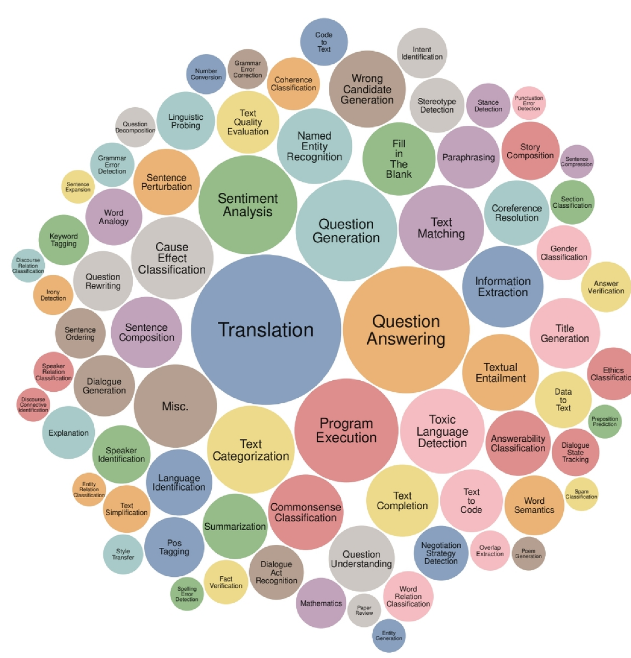

### Instruction-tuned 된 언어모델 평가 벤치마크
- **<u>Massive Multitask Language Understanding(MMLU)</u>**
- 57개의 지식을 요구하는 태스크에서 언어모델의 성능을 평가하는 벤치마크

  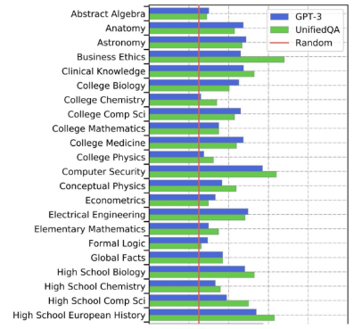

### MMLU 예시
- 천문학 문제
  - 문제: Type-Ia 초신성에 대해 옳은 것은?
    - A. 이 유형은 쌍성계(binary systems)에서 발생한다.
    - B. 이 유형은 젊은 은하에서 발생한다.
    - C. 이 유형은 감마선 폭발을 낸다.
    - D. 이 유형은 많은 양의 X선을 낸다.
- 고등학교 생물 문제
  - 문제: 기린 개체군에서 환경 변화로 인해 키가 큰 개체들이 더 유리해져 생존과 번식에 성공한다. 
  이는 어떤 선택 예시인가?
    - A. directional selection(방향성 선택)
    - B. stabilizing selection(안정화 선택)
    - C. sexual selection(성 선택)
    - D. disruptive selection(분단 선택)

### K-MMLU

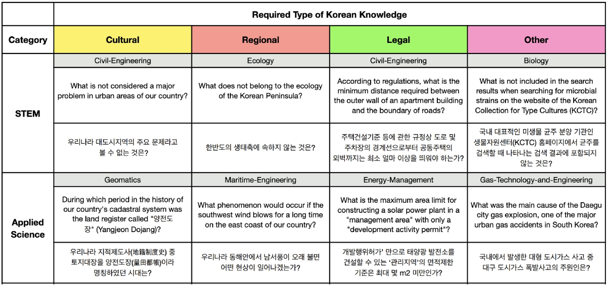

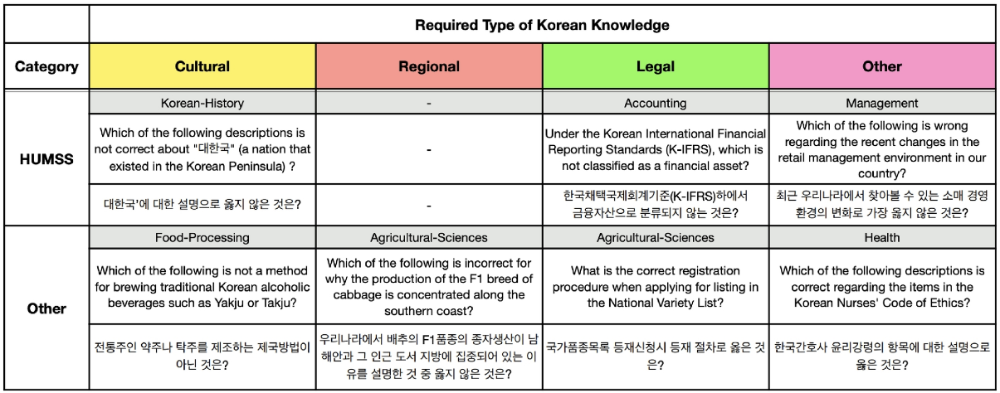

### MMLU 에서의 발전
- 지식 중심 벤치마크에서 빠르고 눈에 띄는 성과를 거두고 있다.

  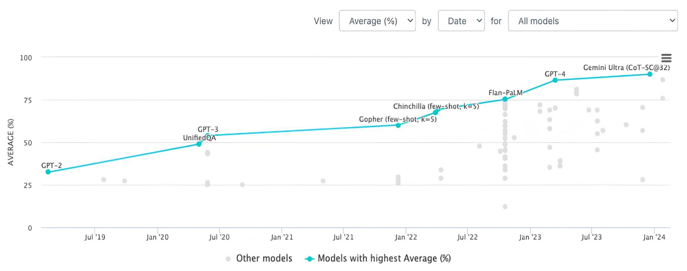

### 최근 거대 언어 모델들

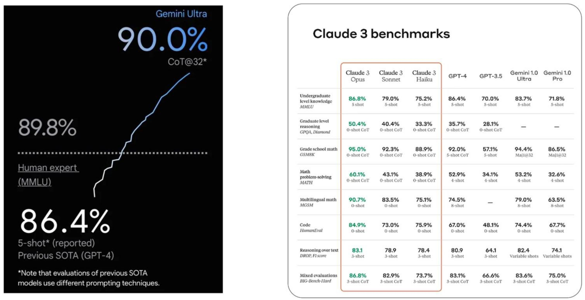

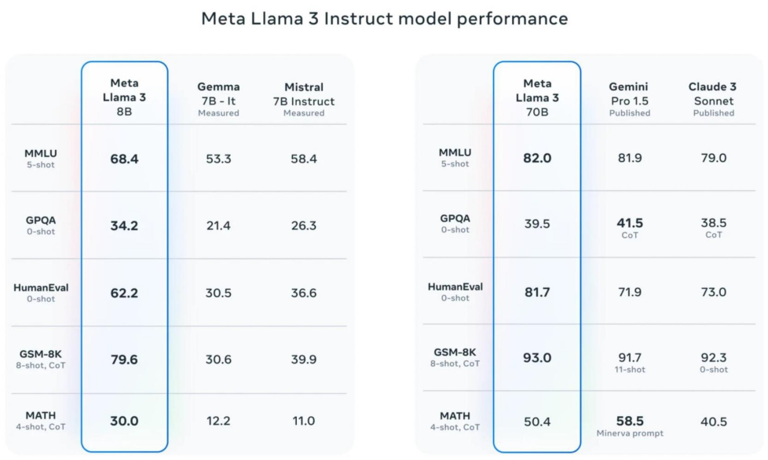

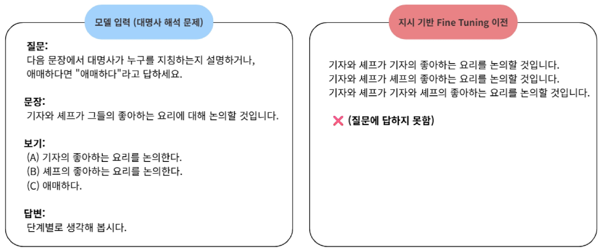

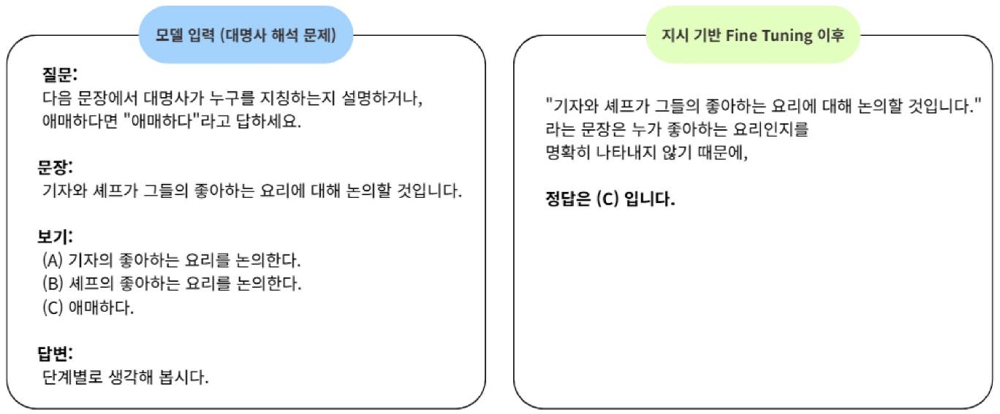

### 이로부터 우리는 무엇을 배웠는가?
- 지시문(instructions), 입력(inputs), 출력(outputs)을 언어모델로부터 생성
  - Alpaca: LLaMA 7B 모델을 52K 개의 instruction-following 데이터로 파인 튜닝

    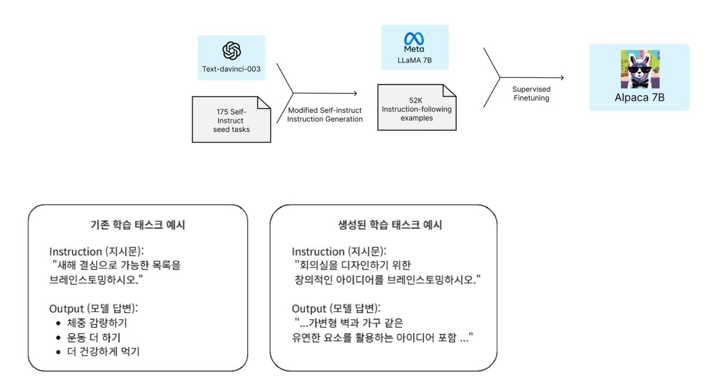

- Instruction-tuning 에는 많은 데이터가 필요하지 않음(e.g., :LIMA: Less is More for Alignment" Zhou et al. 2023)

  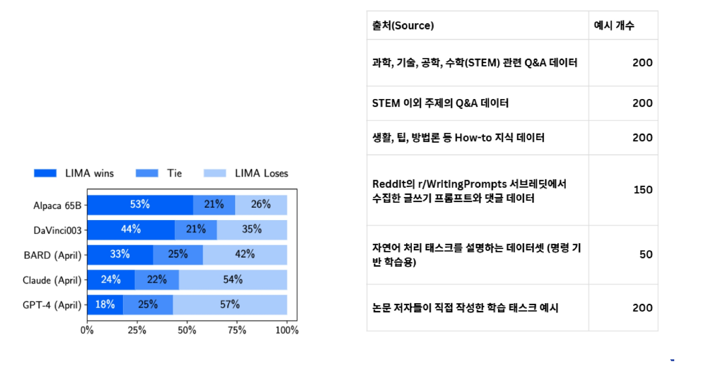

# 3. Reinforcement Learning from Human Feedback(RLHF)

### Instruction-tuning 의 한계
- 명확한 한계점 중 하나는 "정답 데이터를 수집하는 것이 비싸다" 인데, 명확한 한계점 말고 다른 문제들은 뭐가 있을까?
- 문제 1: **개방형/창의적 생성과 같은 태스크**에는 정답이 존재하지 않는다
  - Ex) "개와 개가 기르는 메뚜기에 대한 이야기를 만들어줘"
- 문제 2: 언어 모델링은 모든 토큰 레벨의 오류를 동일하게 취급하지만, 어떤 오류는 다른 오류보다 심하게 작용
- 문제 3: 사람이 만든 답변(정답 레이블)이 최적이 아닐 수 있다.
- Instruction-tuning 을 하더라도 언어모델의 목표(LM objective)와 "**<u>인간의 선호를 만족시키는 것</u>**" 사이에는 여전히 불일치가 존재
- 그렇다면 인간의 선호(Human Preference)를 만족시키기 위해 어떻게 해야할까?

  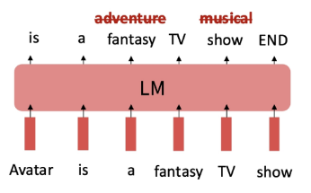

### 인간의 선호도(Human Preference) 란?
- 단답형 질문
  - Q: 상대성 이론을 발표한 과학자는?
  - A: 알베르트 아인슈타인
- 주관식 질문
  - Q: 아인슈타인이 오늘날 살아있다면, 현대 과학기술에 어떤 기여를 했을까?

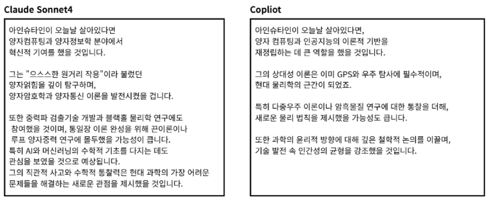

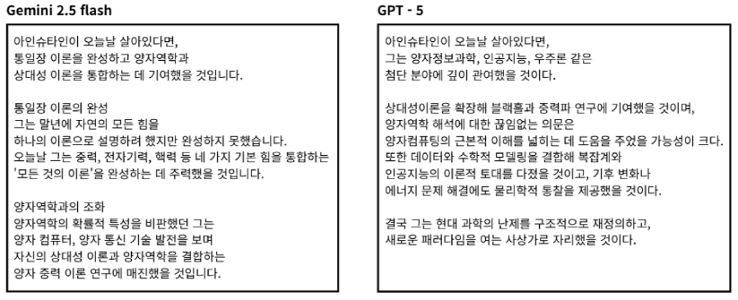

### InstructGPT (2022)

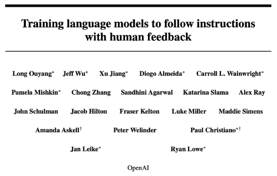

### Intuition: Human-in-the-loop ML

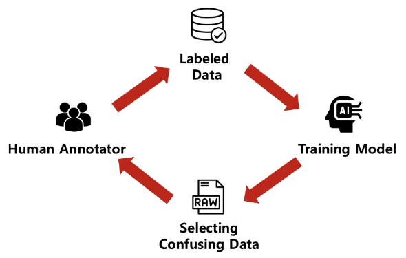

### 인간의 선호를 반영한 최적화(Optimizing for human preferences)
- 언어모델을 학습한다고 가정했을 때(e.g., 요약 태스크)
- 어떤 지시문(instruction) x 와 언어모델의 응답 y 가 있을 때, 해당 요약에 대한 인간이 준 보상(human reward)을 얻을 수 있다고 상상
  - R(x, y) ∈ **R** 점수가 높을 수록 좋음

    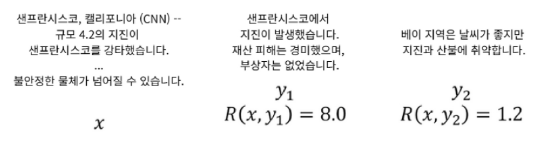

- 이제 우리는 언어모델의 응답 중 기대 보상(expected reward)를 최대화하는 것을 목표로 함

  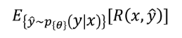

### RLHF 파이프라인 큰 그림
- 1단계: Instruction-tuning
- 2,3단계: 보상 최대화

  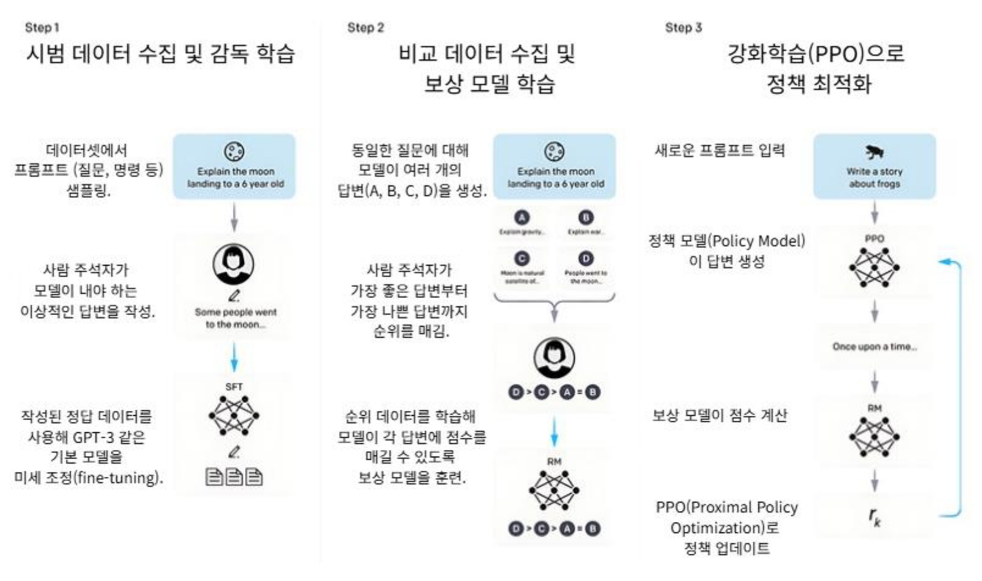

  

### 인간의 선호도(Human preference)를 어떻게 모델링할 것인가?
- 문제: 인간의 판단은 일관성이 떨어지고, 기준이 어긋날 수 있다.
- 해결 방법: 직접 점수를 매기지 않고, 응답을 비교하는 방식을 활용
- 해당 데이터로 리워드 모델(Reward model)을 학습시키게 된다.

  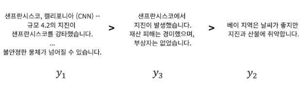

- 사람이 보기에는 y_2 > y_1 > y_3
- 비교 결과가 리워드 모델 학습의 데이터가 됨

  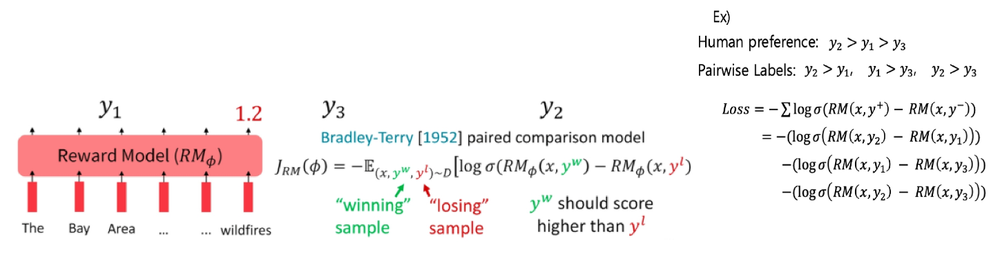

### 어떻게 최적화를 할 것인가? -> 강화학습
- **강화학습(Reinforcement Learning, RL)** 분야는 오랫동안 이러한/관련된 문제들을 연구해왔음
- 2013년 전후로 RL이 딥러닝과 게임 플레이에 적용되면서 다시 급증
- 언어모델에 RL을 적용하려는 관심은 비교적 최근인 2019년부터 이뤄짐 [Ziegler et al.. 2019, Stiennon et al.. 2020, Ouyang et al.. 2022]
  - RL을 언어모델에 적용하는 것이 어렵게 여겨짐 (현재도 그럼)
  - 언어모델에 적용이 될 수 있는 RL 알고리즘이 최근에 나옴(e.g., PPO; [Schulman et al.. 2017])

    

### RLHF 는 pre-training과 instruction-tuning 보다 더 나은 성능 향상을 제공한다.

### 주의점: 리워드 모델이 잘 작동하는지 먼저 잘 확인해야 한다

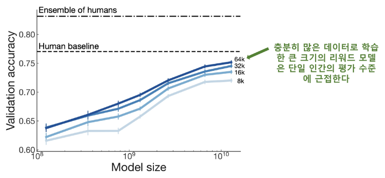

### ChatGPT: Instruction-tuning + RLHF
- ChatGPT 는 RLHF 를 통한 발전에 힘입어 거대언어모델 중 처음으로 상업적 활용이 되었음

  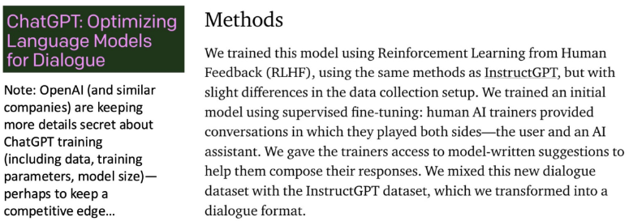

# 4. What's Next?

### 리워드 모델링의 한계점
- 인간의 선호도는 일관성이 부족
  - 리워드 해킹(Reward hacking)은 강화학습에서 자주 발생하는 문제

    

  - 챗봇들은 정답의 여부와 관계없이 생산적이고 도움이 되어 보이는 정답을 생성
  - 이러한 결과들은 환각(Hallucination) 문제를 발생시키게 된다

    

- 인간의 선호도를 학습한 리워드 모델은 더 일관성이 부족

  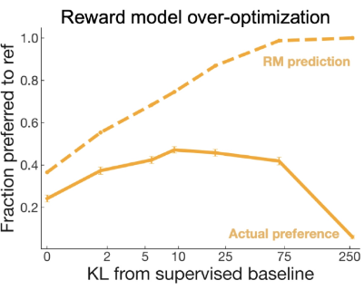

### RLHF 에서 'RL'을 제거하자
- Direct Preference Optimization(DPO); Rafailov et al, 2023

  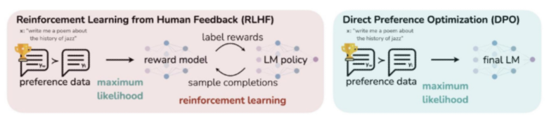

### RLHF 에서 수학 문제와 같이 답이 분명한 문제들은 정답 여부로 리워드를 주자
- Reinforcement Learning with Verifiable Reward(RLVR); Lambert et al. 2024, Deepseek-AI, 2025
  - 대표적인 성공 사례: DeepSeek-R1

    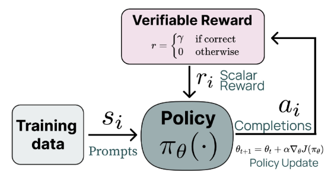

---
# 1. Basic Concepts of Retrieval-augmented LM

### Retrieval-augmented LM 이란?
- 추론 시 외부 데이터 저장소를 불러와 활용하는 언어모델

  

### Retrieval-augmented LM 구성요소
- Datastore, Query, Index, Language Model

  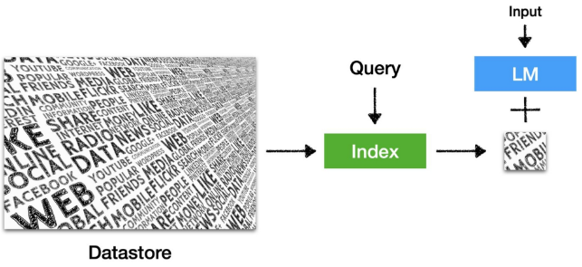

### Datastore
- 가공되지 않은 대규모 텍스트 코퍼스
  - 최소 수십 억에서 수 조 단위의 토큰으로 구성
  - 라벨링된 데이터셋이 아님
  - 지식베이스(Knowledge base)와 같은 구조화된 데이터가 아님

    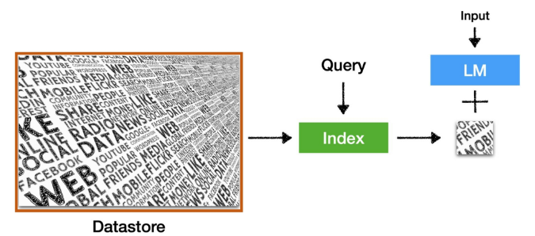

### 쿼리(Query)
- 검색 질의 / Retrieval input
  - 언어모델의 질의(input)와 같아야 하는 것은 아니다

    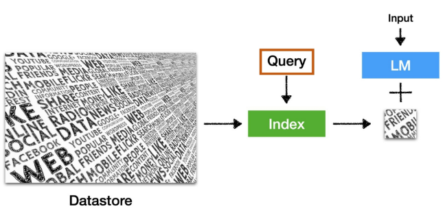

### 인덱스(Index)
- 문서나 단락과 같은 검색 가능한 항목들을 체계적으로 정리하여 더 쉽게 찾을 수 있도록 하는 것
- 각 정보 검색(Information Retrieval) 메서드는 인덱싱 과정에서 구축된 인덱스를 활용해 쿼리와 관련 있는 정보를 식별

  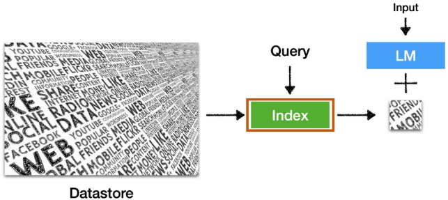

### 검색(Retrieval)
- Datastore에 있는 수 많은 정보 중에서, 주어진 쿼리(query)와 가장 관련성이 높은 정보를 찾아내는 과정

  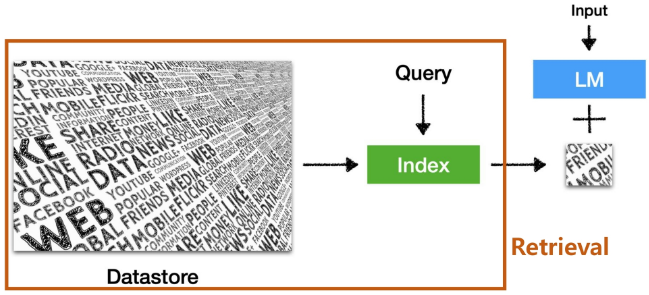

### Retrieval-augmented Generation(RAG)
- 사용자의 질문에 답하기 위해 datastore에서 관련 정보를 검색(Retrieval)해와서 이를 언어모델이 **생성(Generation) 단계에 함께 활용**하는 방법

  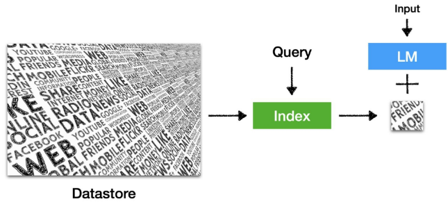

# 2. Information Retrieval

### Information Retrieval(정보검색)

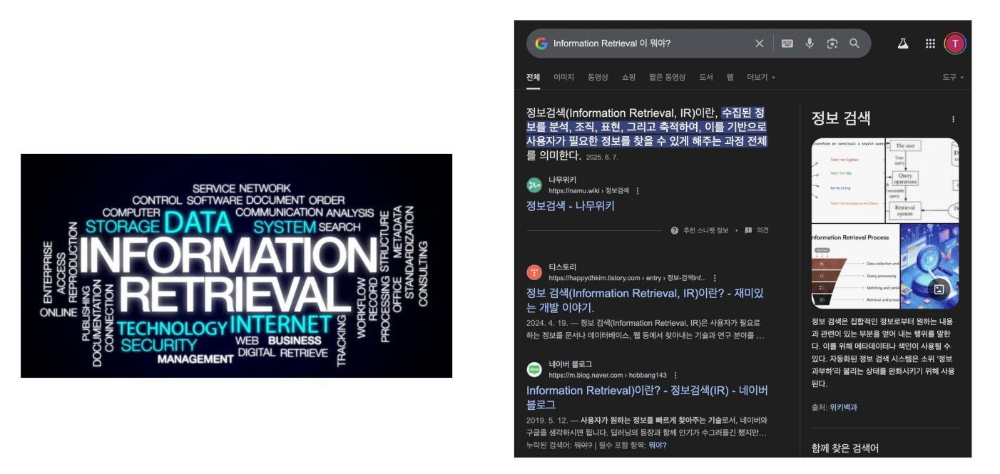

### Information Retrieval 이란?
- 목표: 검색 질의와 가장 관련성 높은 정보 제공
- 사용자가 "녹차의 효능?"를 검색 -> IR이 관련 문서를 찾아 제공

  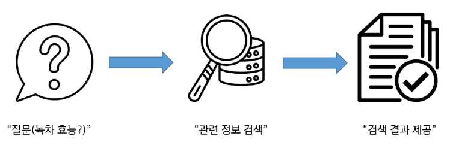

- **정보검색(IR): 사용자의 질의(Query)에 맞는 정보를 대규모 데이터에서 찾아 제공하는 과정**
- **주요 목표**는 사용자의 검색 질의(Query)에 가장 관련성이 높은 정보를 제공하는 것

  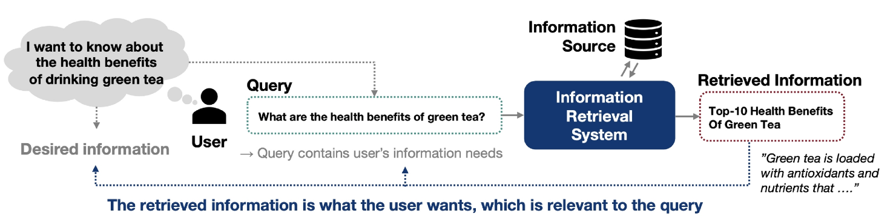

### 정보검색(IR)의 활용
- 웹 서치(Web Search) & 아이템 서치(Item Search)
  - 서치 엔진(Search engines) (e.g., 구글, 네이버)
  - 이커머스(E-Commerce) (e.g., 아마존, 쿠팡)

    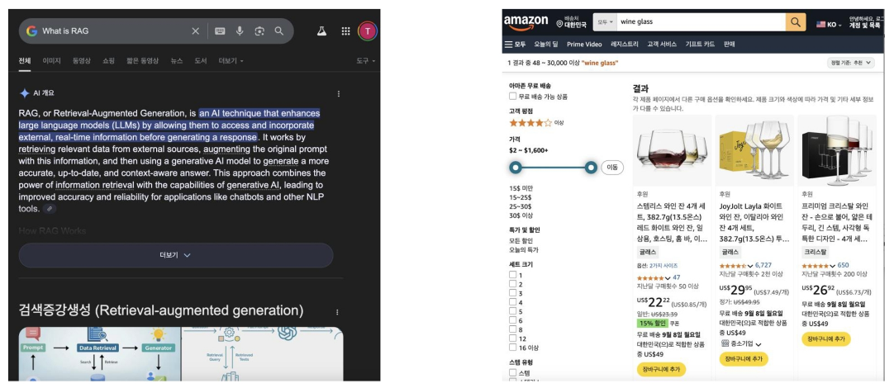

- 추천 시스템(Recommender System)
  - OTT 서비스
  - 이커머스(E-Commerce)

    

- 검색증강생성(Retrieval-augmented Generation; RAG)
- RAG는 검색된 문서를 활용하여 더 정확하고 최신의 답변을 생성

  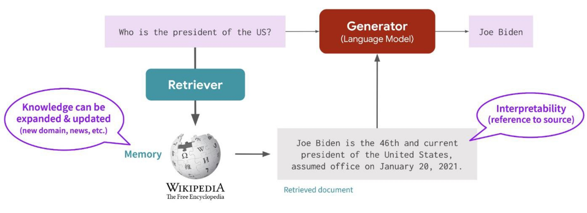

### Retriever 란?
- 사용자의 질의(Query)에 맞는 후보 문서를 저장소에서 찾아오는 모듈
- 검색 증감 언어모델(RAG)에서 첫 단계 역할을 수행

  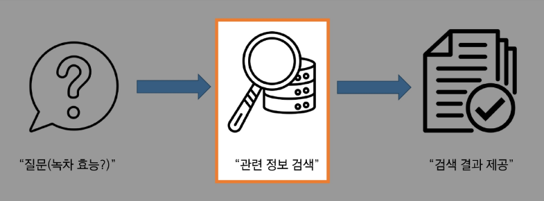

### Retriever 종류
- Sparse Retriever(**어휘적 유사도 기반**)
  - 전통적인 정보검색(IR) 기법으로, 쿼리(query)와 문서 간의 정확한 용어 일치(즉, **어휘적 유사도**)에 기반한다
  - 예시: TF-IDF, BM-25
- Dense Retriever(**의미적 유사도 기반**)
  - 쿼리와 문서를 표현하기 위해 dense vector(a.k.a, embeddings; 임베딩)을 활용해 **의미적 유사도**에 기반한다
  - 예시: DPR, Contriever, Openai-embeddings, etc

    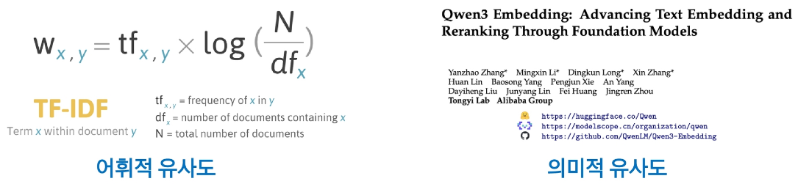

### Sparse Retriever - TF-IDF(Term Frequency-Inverse Document Frequency)
- 문서 내 특정 단어의 중요도를 나타내는 가중치 방식
  - TF(Term Frequency): 단어가 문서에 얼마나 자주 등장하는지
  - IDF(Inverse Document Frequency): 단어가 전체 코퍼스에서 얼마나 드물게 등장하는지

    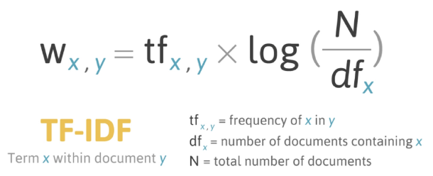

- **TF** -> 문서 안에서 **자주 등장하는 단어는 중요**하다
- **IDF** -> 하지만 **너무 많은 문서에 등장하는 단어는 덜 중요**하다.
  - "this, is, and" 과 같은 단어들은 IDF 값이 낮아져 가중치가 0에 가까워진다.

    

### Sparse Retriever - 장/단점
- 장점
  - 단순성(Simplicity): 구현과 이해가 비교적 쉽다
  - 효율성(Efficiency): Inverted index 구조 덕분에 빠른 검색과 효율적인 질의 처리가 가능하다
  - 투명성(Transparency): 검색 결과가 보통 해석 가능하며, 용어 매칭에 기반하기 때문에 설명이 명확
- 단점
  - 제한된 의미 이해(Limited semantic understanding): 아래 예시처럼, 쿼리에는 "bad guy" 라는 표현이 쓰였지만, 실제 문서에는 "villain" 이라는 단어가 사용되어 매칭되지 않음
    - 쿼리: "Who is the **bad guy** in the movie lord of the rings?"
    - 문서: "Sala Baker is bet known for portraying **the villain** Sauron in the lord of the rings trilogy"

### Dense Retriever - 임베딩 모델(Embedding Models)
- 임베딩 모델(e.g., BERT)은 단어/문장의 의미를 표현할 수 있음

  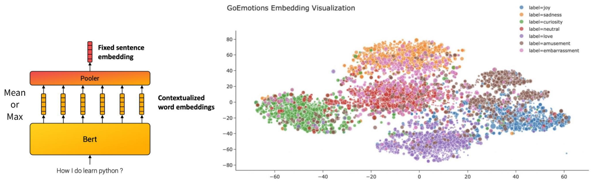

### Dense Retriever - Bi-encoder
- Bi-encoder retriever는 대조 학습(contrastive learning)을 통해 학습되며, 이는 쿼리가 긍정적인 문서와 가깝게 유지되도록 하고 부정적인 문서에서는 멀어지도록 유도한다.

  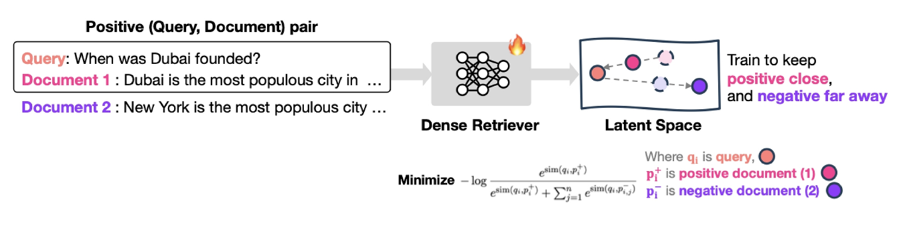

### Dense Retriever - Cross-encoder
- Cross-encoder 아키텍처는 두 개의 텍스트를 하나의 시퀀스로 결합
  - e.g., "query [SEP] document"
- Self-attention 을 통해 모든 쿼리와 문서 토큰이 완전히 상호작용할 수 있어, bi-encoder 보다 더 높은 정확도를 얻을 수 있다.
- 하지만 모든 쿼리-문서 쌍을 개별적으로 모델에 입력해야 하므로, 계산 비용이 크고 처리속도가 느리다는 단점이 있다

  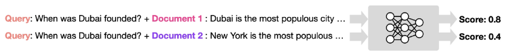

### Dense Retriever - Bi-encoder vs Cross-encoder
- Bi-encoder는 두 문장을 따로 인코딩한다.
  - 매우 빠르고 대규모 DB 검색에 적합하지만 정확도는 낮다

    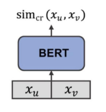

- Cross-encoder는 두 문장을 함께 처리한다
  - 매우 느리지만 세밀한 상호작용을 포착하기 때문에 정확도는 높다

    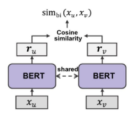

### Dense Retriever - 장/단점
- 장점
  - 의미적 이해(Semantic understanding): Dense retriever는 동의어나 다양한 표현을 더 효과적으로 처리할 수 있으며, 즉 글의 문맥과 의미를 포착한다
  - 풍부한 쿼리 표현(Rich query representation): 복잡한 쿼리와 긴 검색 쿼리의 의미를 더 잘 포착할 수 있다
- 단점
  - 높은 연산 비용(High computational cost): 모델 학습에는 상당한 계산 자원과 시간이 필요하며, 추론 과정에서도 많은 자원을 소모할 수 있다
  - 제한된 투명성(Limited transparency): Dense retriever 는 블랙박스처럼 작동할 수 있어 특정 문서가 왜 검색되었는지 해석하기 어렵다
  - 데이터 및 모델 의존성(Dependency on data and models): Dense retriever의 성능은 학습 데이터의 품질이나 모델 변경에 크게 영향을 받는다

# 3. Retrieval-augmented LM

### Retrieval-augmented LM 이란?
- 추론 시 외부 데이터 저장소를 불러와 활용하는 언어모델을 RAG라고 불림
- RAG(Retrieval-augmented Generation): 정보 검색부터 답변 생성까지의 프레임워크

  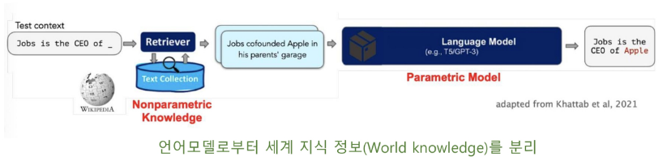

### Why Retrieval-augmented LM?
1. **거대언어모델은 모든 지식을 다 자신의 파라미터에 저장하지 못 한다**
  - 거대언어모델은 pre-training(사전학습) 데이터에 자주 나타나는 쉬운 정보를 기억하는 경향성이 있음(Kandpal et al. 2022)
  - RAG는 자주 등장하지 않는 정보에 대해서 큰 효과를 가져다 줌; 언어 모델이 잘 알고 있는 정보인 경우 부정적인 영향을 미칠 수도 있음(Mallen et al. 2023)

    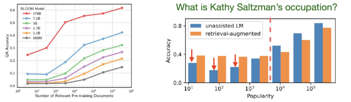

2. **거대언어모델이 보유한 지식은 금세 시대에 뒤쳐지며, 갱신이 어렵다**
  - 현재의 지식 편집(knowledge editing) 메서드들은 확장성이 부족함
  - 반면에, 저장소(Datastore)는 쉽게 업데이트가 가능하며, 확장성도 만족함

    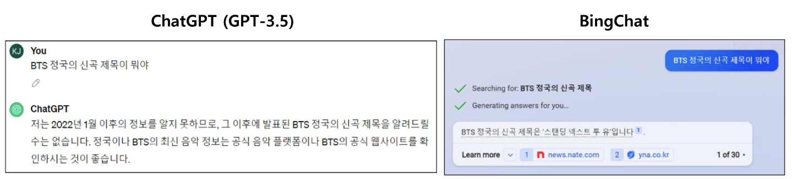

3. **거대언어모델의 답변은 해석과 검증이 어려움**
  - 현재의 지식 편집(knowledge editing) 메서드들은 확장성이 부족함
  - 반면에, 저장소(Datastore)는 쉽게 업데이트가 가능하며, 확장성도 만족함

    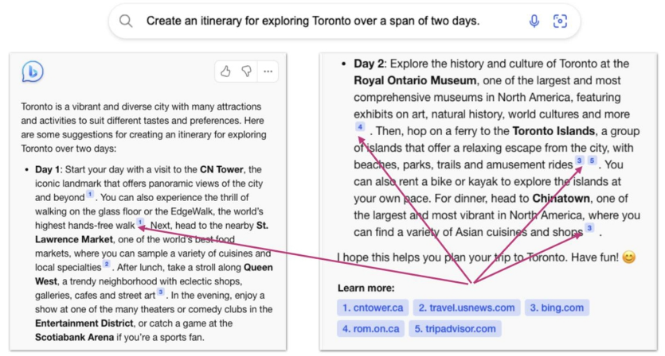

4. **기업 내부 정보와 같은 보안 정보는 언어모델 학습에 활용되지 않음**
  - 사내 챗봇/기업 내부 시스템에 언어모델을 사용하는 경우 내부 데이터를 학습 시 정보 유출의 위험성이 있음

    

### Retrieval-augmented LM 파이프라인
- 검색증강 언어모델: 언어모델에 질문과 더불어 검색엔진 결과를 함께 이용

  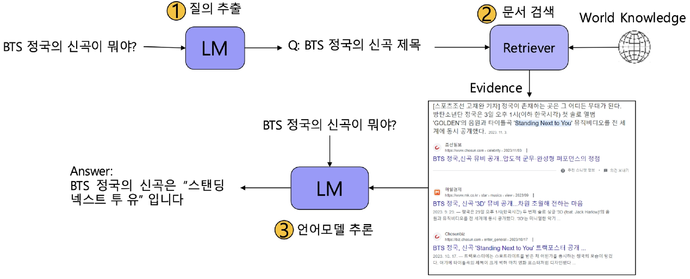

  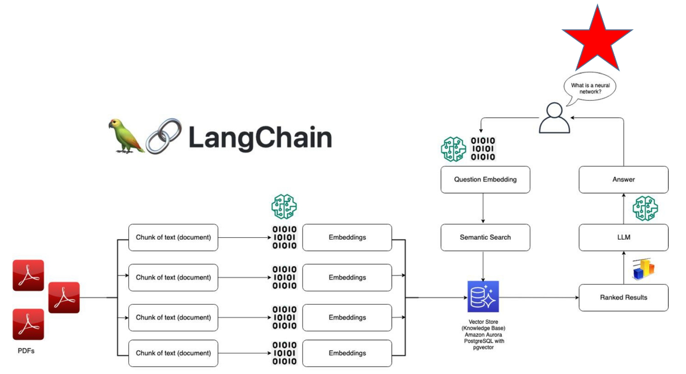

### Challenges of Retrieval-augmented LM?
1. **Context를 어떻게 구성해야 하는가?**
  - Solution: 언어모델의 컨텍스트 길이(Context length)를 늘려야 한다. 
  Position embedding, Efficient inference, Fine-tuning on long context ...
  - Claude 3 모델들은 200K context length/window 를 제공한다
  - Gemini 1.5 Pro 는 128,000 token context window 를 제공한다

    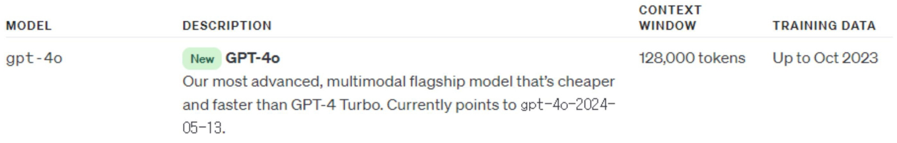

2. **RAG의 결과는 검색 모델 성능에 의존 -> 검색 노이즈에 취약**
  - 정확하지 않은 유사 정보가 언어모델이 답하는 것을 방해할 수 있음

    

  - **Context 안의 정보를 이용하려는 LLM의 경향성 -> 검색에서의 노이즈가 Hallucination을 증가시킴**

    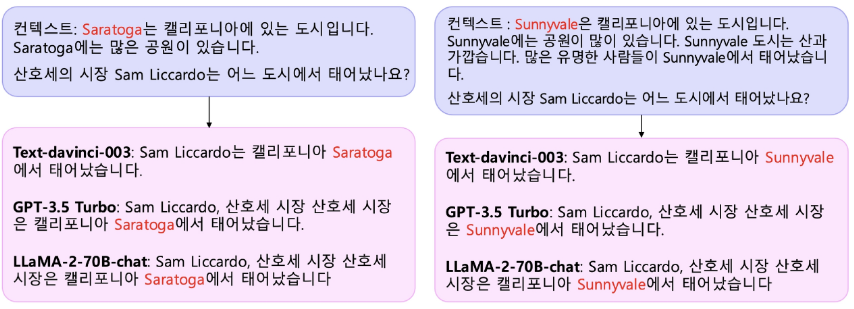

    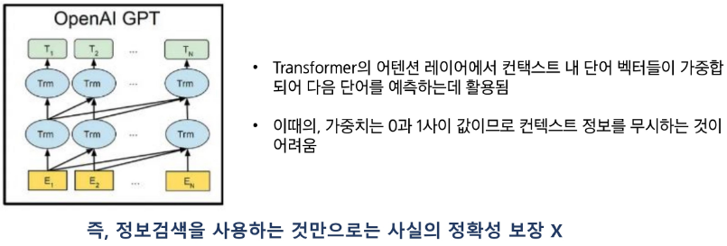

  - Solution: Training with Noises

    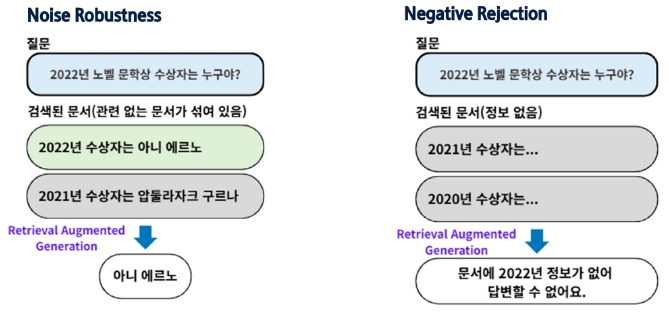

3. **LLM의 사전지식과 컨텍스트 간의 충돌(Conflict) 발생

  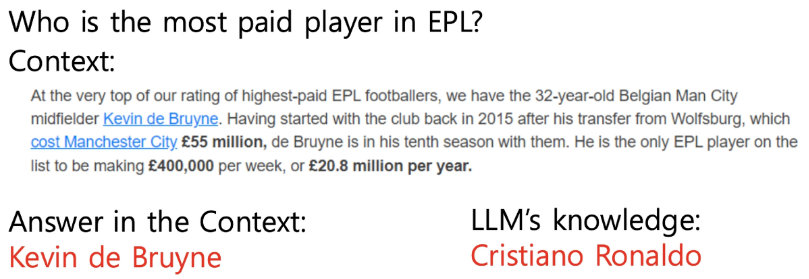

  - Solution 1: Context 위에서 Grounding 학습 강화

    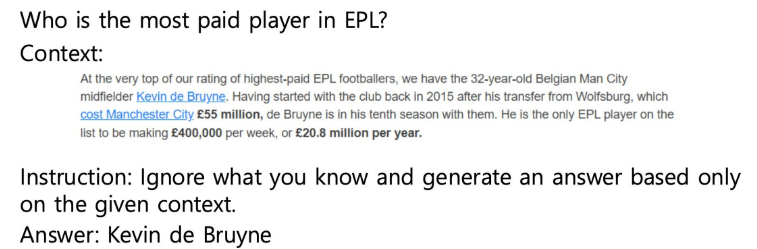

  - Solution 2: Context 가 없을 때, 답변 회피/거절 학습

    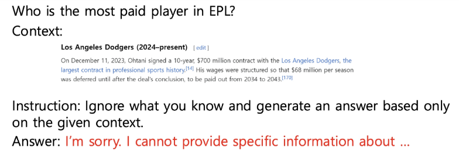

4. 복잡한 추론 필요 & 문서가 명확한 사실에 대한 오류를 포함할 때

  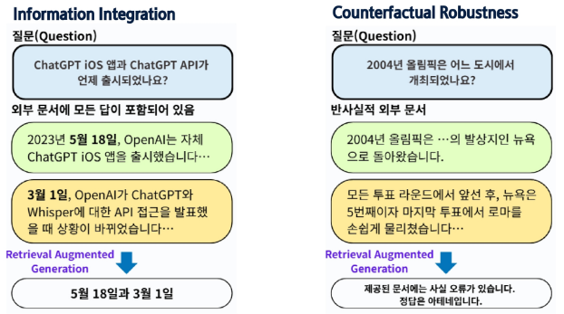

  

### Noise Robustness
- 외부 문서에 노이즈(관련 없는 정보)가 포함되어 있어도 올바른 답을 찾아내는 능력
  - 올바른 문서: 2022년 수상자는 Annie Ernaux
  - 노이즈 문서: 2021년 수상자 Abdulrazak Gurnah
- RAG 동작
  - 문서 안에 노이즈가 있어도 올바른 정보를 식별하고 정답을 생성
  - 최종 답변: "Annie Ernaux"

    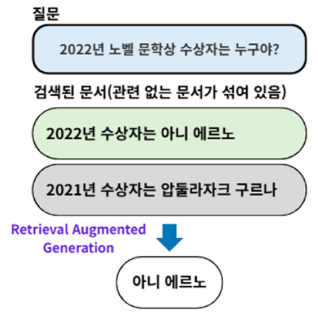

### Negative Rejection
- 질문: "Who was awarded the 2022 Nobel Prize in Literature?"
- 외부 문서
  - 2021년 수상자 Abdulrazak Gurnah
  - 2020년 수상자 Louise Gluck
- RAG 동작
  - 검색한 문서에 2022년 관련 정보가 없음
  - 따라서 모델은 추측하지 않고 명확히 답변을 거부
- 최종 답변: 대답할 수 없음

  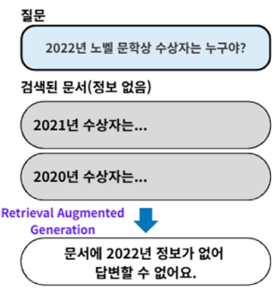

---
# 1. Basic Concepts of LLM Agents

### Agent 이란?
- 센서를 통해 환경(environment)을 인지하고, 액추에이터(Actuator)를 통해 환경에 대해 액션(action)을 통해 영향을 미치는 것으로 간주될 수 있는 모든 것 
(Russell & Norvig, AI: A Modern Approach (2020))

  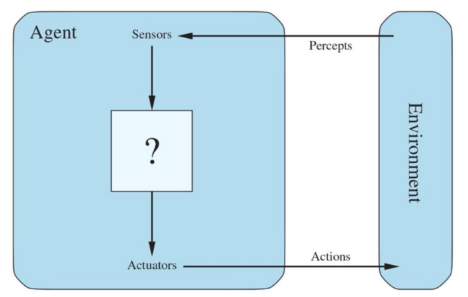

### 강화학습(Reinforcement Learning) - 의사결정의 과학

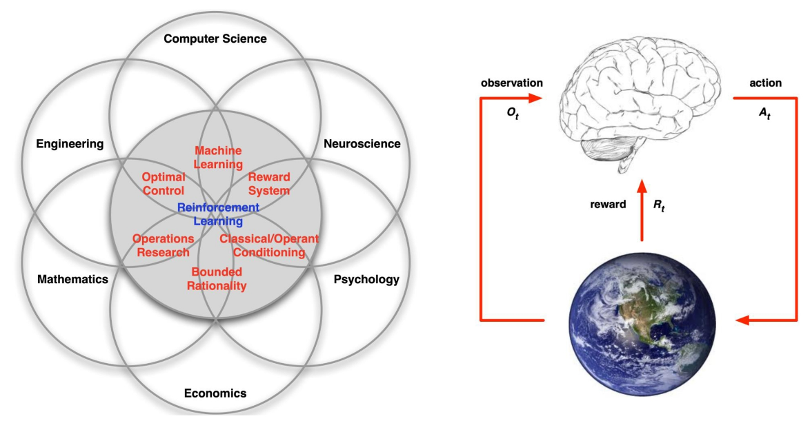

### LLM Agent 이란?
- 거대언어모델(LLM)을 핵심 구조(backbone)로 삼아 환경을 이해하고 행동을 수행하는 에이전트
- LLM-first view: 기존 LLM을 활용한 시스템을 에이전트로 만든다
  - 서치(search) 에이전트, 심리상담 에이전트, 코드(Code) 에이전트
- Agent-first view: LLM을 AI 에이전트에 통합하여 언어를 활용한 추론과 의사소통을 가능하게 한다.
  - 로봇, 임바디드(embodied) 에이전트

    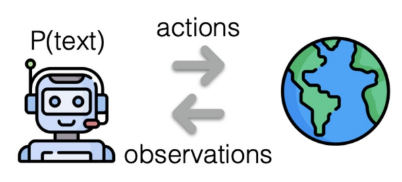

### 이것은 에이전트인가?
- 웹을 탐색하는 LLM 시스템 - Yes
- OS의 파일을 검색하고 코드를 사용해 처리하는 LLM 시스템 - Yes
- 정보를 검색(Retrieve)하고 생성(generate)하는 LLM 시스템 - Probably not(점진적이지 않음)
- 복잡한 추론을 하는 O1 같은 LLM - No(툴도 없고 외부 환경과 상호작용하지 않음)

### 성공적인 에이전트가 갖추어야 할 요건들
- 도구 사용(Tool use)
- 추론과 계획(Reasoning and Planning)
- 환경 표현(Environment Representation)
- 환경 이해(Environment understanding)
- 상호작용/의사소통(Interaction/Communication)

### LLM Agent 프레임워크

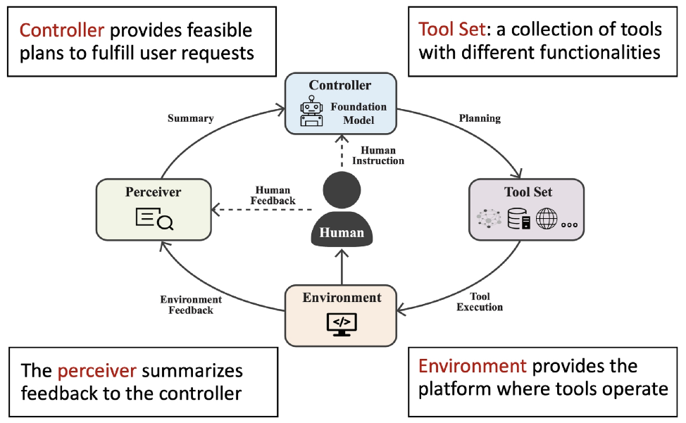

# 2. Tool Usage in LLMs

### Tool 이란? (LLM 에이전트를 위한)
- 언어 모델 외부(external)에서 실행되는 프로그램에 연결되는 함수(function) 인터페이스를 의미한다.
  - LLM은 함수 호출과 입력 인자를 생성함으로써 이 도구를 활용할 수 있다

    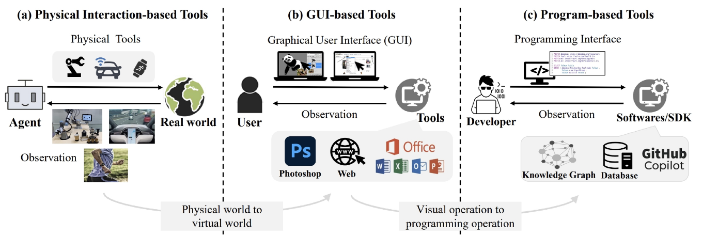

### 도구 사용 패러다임(Tool Use Paradigms)
- 도구 사용(Tool Use): 두 모드 간의 전환
  - 텍스트 생성 모드(text-generation mode)
  - 도구 실행 모드(tool-execution mode)
- 도구 사용을 유도하는 방법
  - 추론 시 프롬프트(inference-time prompting)
  - **학습(Training; Tool Learning)**

    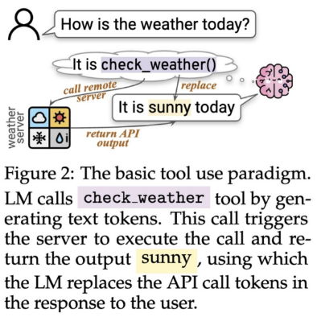

### 툴 러닝(Tool Learning) 방식
- 모방 학습(Imitation Learning): 인간의 도구 사용 행동 데이터를 기록함으로써, 언어모델이 인간의 행동을 모방하도록 학습
- 가장 간단하고 직관적인 방식

  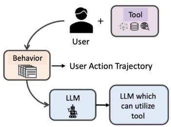

- **<u>OpenAI: WebGPT</u>** (2022)
  - 검색 엔진을 사용하기 위해 인간의 행동 모방(Clone human behavior)
  - 지도 학습(Supervised fine-tuning) + 강화학습(Reinforcement Learning)
  - **단, 6000개의 데이터만 필요**

    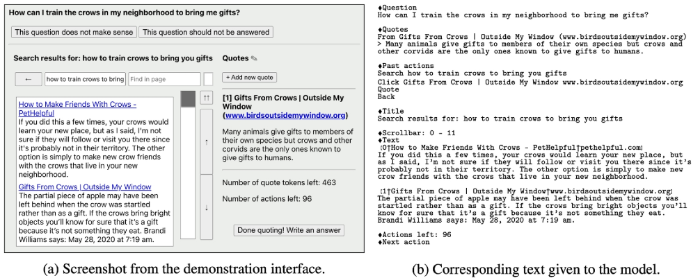

  - 장문 질의응답(Long-form QA)에서 뛰어난 성능을 보이며 인간보다 좋은 성능을 보이기도 한다.

    

- **<u>Meta: Toolformer</u>** (2023)
  - 모델 스스로 학습 데이터 생성(Self-supervised)
  - 지도 학습(Supervised fine-tuning)
  - 검색 엔진 뿐만 아니라 달력, 계산기와 같은 여러 API를 활용

    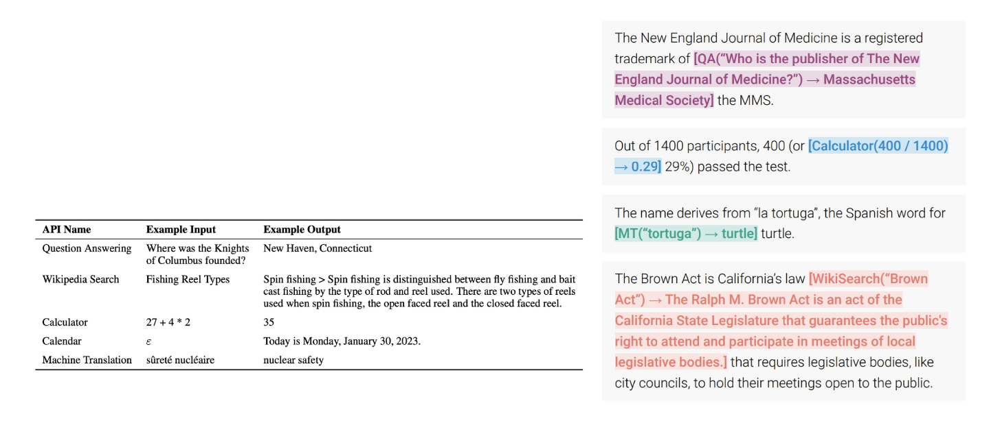

  - 데이터 생성 방식
    1. API 호출 샘플링: LLM이 기존 데이터셋에서 문맥을 보고 API 호출 후보를 생성
    2. API 실행: 생성된 API 호출을 실제로 실행하여 응답을 얻음
    3. API 호출 필터링: API 호출이 문맥에 유용한지 평가 및 필터링진행

      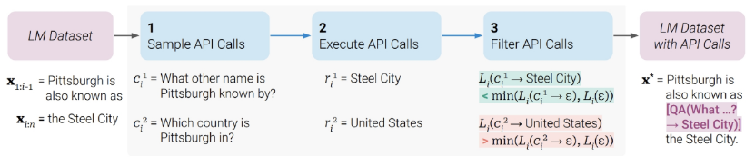

- **<u>ToolLLM</u>** (2023)
  - 기존 연구의 한계점인 툴의 다양성과 범용성을 타겟팅한 연구
  - 16000+ 의 실제 API 를 활용하여 대규모 학습 데이터셋 & 특화 언어모델 & 평가 벤치마크를 제안

    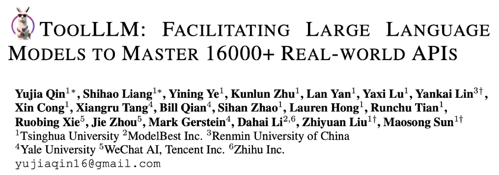

  - 데이터셋 수집 방법  
    - API 를 수집
    - 수집한 API를 기반하여 명령문(instruction) 생성
    - 정답 어노테이션 & 필터링

      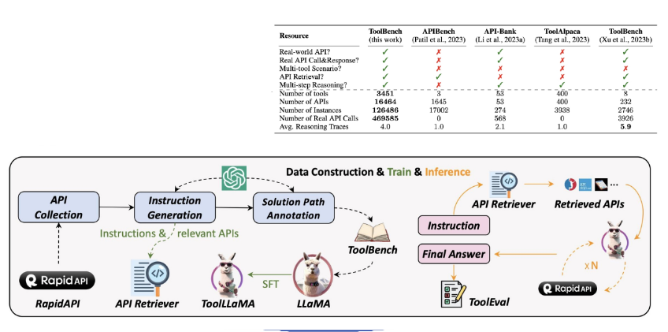

  - 최근 접근 - 멀티 모달 툴 러닝(Multi-modal Tool Learning)
    - 멀티모달 대규모 언어모델(MLLM)을 기반으로 도구를 정의하고 활용하는 연구
    - EX) GUI 에이전트, Embodied 에이전트

      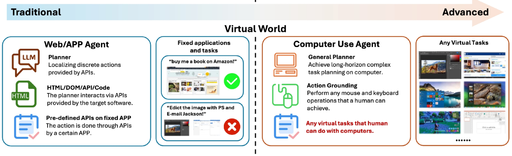

  - 최근 접근 - 강화 학습
    - 지도 학습을 넘어 에이전트에서의 강화학습을 도입하는 연구

      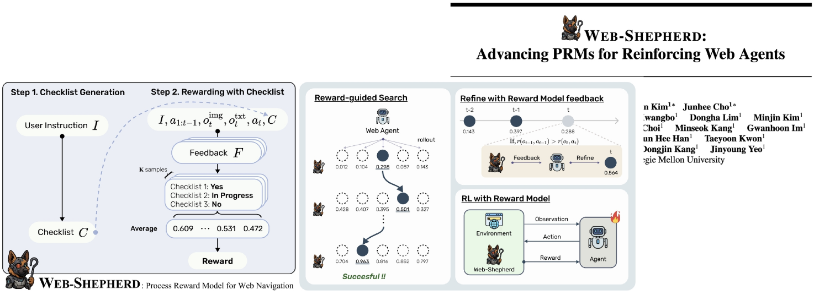

# 3. Model Context Protocol(MCP)

### Why MCP?
- 외부 툴을 활용하는 연구가 급증하면서 회사/모델마다 각기 다른 툴 호출 방식 및 스키마를 개발
- 문제점
  - 호환성 부족 (모델마다 상이)
  - 재사용 어려움 (같은 툴도 다른 모델에서는 다시 정의해야 함)

    

### MCP 란?
- 언어 모델이 외부 툴과 상호작용하기 위한 **표준화된 방식**으로 정의한 프로토콜
- 툴 호출, 응답 전달, 컨텍스트 공유를 하나의 공통 규격으로 처리

  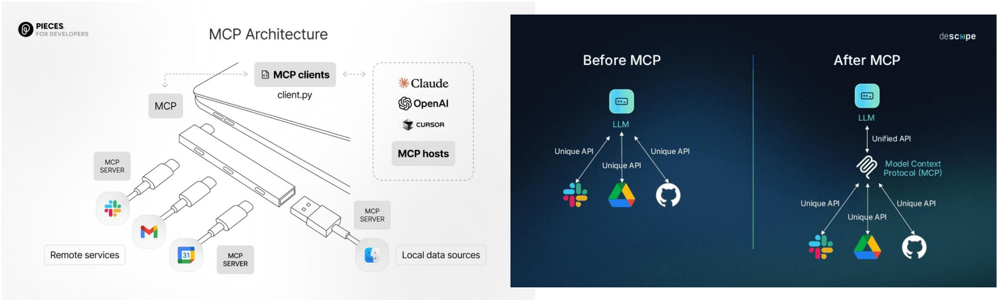

### MCP 아키텍쳐
- MCP Host: 하나 또는 여러 개의 MCP 클라이언트를 조정하고 관리하는 AI 애플리케이션
- MCP Client: MCP 서버와의 연결을 유지하며 MCP 호스트가 사용할 수 있도록 MCP 서버로부터 컨텍스트를 가져오는 구성요소
- MCP Server: MCP 클라이언트에게 컨텍스트를 제공하는 프로그램

  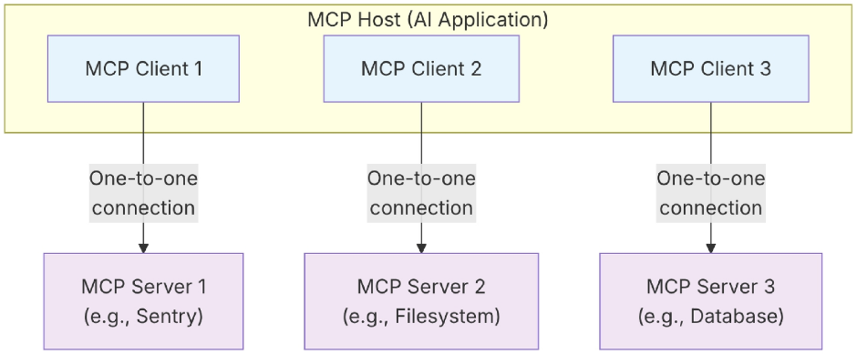

### MCP 계층(Layer)
- MCP 는 두 개의 계층으로 구성된다
  - 데이터 계층(Data Layer): 클라이언트-서버 통신을 위한 **JSON-RPC 기반 프로토콜**을 정의  
    - 라이프 사이클 관리, 툴, 리소스, 프롬프트와 같은 핵심 요소들이 포함된다
  - 전송 계층(Transport Layer): 클라이언트 서버 간 데이터 교환을 가능하게 하는 **통신 메커니즘과 채널**을 정의
    - 전송 방식에 특화된 연결 수립, 메시지 프레이밍, 인증이 포함된다
- 개념적으로 데이터 계층은 내부 계층(inner layer), 전송 계층은 외부 계층(outer layer)이다

### 예시: MCP 이전 / 이후 툴 사용 요청 (tool execution request) 비교
- 단순화된 예시: get_weather() 함수

  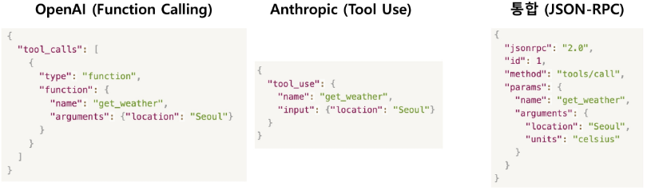

### MCP 의 장점
- 표준화(Standardization): 모든 모델/툴이 동일한 호출 규격 사용
- 확장성(Extensibility): 새로운 툴 쉽게 추가 가능
- 호환성(Interoperability): 모델/플랫폼에 상관 없이 같은 툴 호출 가능
- 재사용성(Reusability): 한 번 정의한 툴을 여러 모델에서 활용 가능
- 투명성(Transparency): 호출 과정이 명확히 기록/검증됨

### MCP 서버 예시 코드
- FastMCP 라이브러리 사용
- 누구나 간단하게 사용 가능

  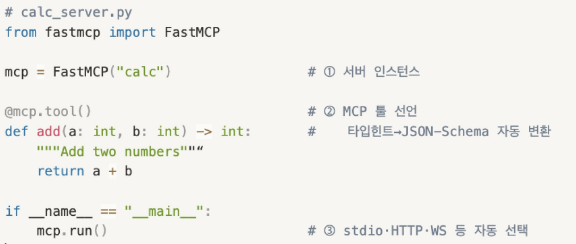

### 현재
- MCP 는 현재 학계/업계 에서도 모두 표준으로 확립
- Web 과 AI 개발을 구분하게 되어 양쪽 생태계 모두에서 표준적이고 호환 가능한 개발이 가능해짐

---
# 1. Environment Representation & Understanding

### Recap: LLM Agent 이란?
- 거대언어모델(LLM)을 핵심 구조(backbone)로 삼아 환경을 이해하고 행동을 수행하는 에이전트
- LLM-first view: 기존 LLM을 활용한 시스템을 에이전트로 만든다
  - 서치(search) 에이전트, 심리상담 에이전트, 코드(Code) 에이전트
- Agent-first view: LLM을 AI 에이전트에 통합하여 언어를 활용한 추론과 의사소통을 가능하게 한다
  - 로봇, 임바디드(embodied) 에이전트

    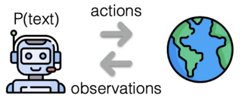

### Recap: 성공적인 에이전트가 갖추어야 할 요건들
- 도구 사용(Tool use)
- 추론과 계획(Reasoning and Planning)
- **환경 표현(Environment Representation)**
- **환경 이해(Environment Understanding)**
- 상호작용/의사소통(Interation/Communication)

### LLM Agent 프레임워크

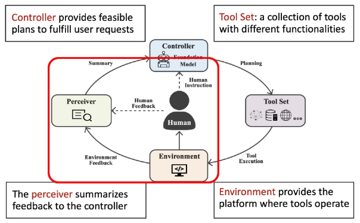

### 환경(Environment) 과 에이전트 활용 예시들
- 챗봇
- 로보틱스
- 임바디드(Embodied) 에이전트
- 게임
- 소프트웨어 개발

### 에이전트가 환경을 이해하기 위해 필요한 것
- 환경에 접근하기 위한 **툴(Tool)**
- 환경의 **표현(Representation)**
- 환경을 이해/탐색하기 위한 방법론들

### 환경의 표현(Representation): 텍스트(Text)
- ALFWorld; Shridhar et al. 2021
  - 텍스트 기반 임바디드 에이전트 시뮬레이션 엔진
  - 물리적 세계에 대한 정보를 언어모델이 텍스트 기반으로 이해하고 명령을 수행할 수 있도록 환경을 표현함

    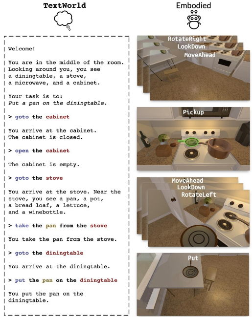

### 환경의 표현(Representation): 이미지(Image)
- Touchdown(Chen et al., 2018)
  - Google Street View 기반 **내비게이션 및 지시 따르기(Navigation & Instruction Following) 데이터셋**
  - 사용자가 제공한 자연어 지시문에 따라 실제 도시 환경 이미지 내에서 경로 탐색을 수행
  - 시각적 환경을 텍스트와 연결하여 지시 수행 및 환경 이해를 가능하게 함

    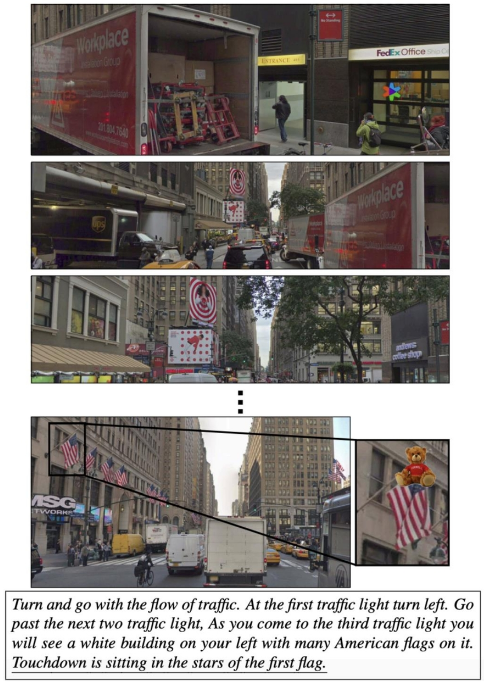

### 이미지 기반 표현의 문제점(Problems w/ Image Representations)
- 에이전트로서 좋은 성능을 내려면 세부적인 이해가 중요
  - 예: OCR(광학 문자 인식), 복잡한 레이아웃에서의 그라운딩
- 많은 모델들이 이런 태스크에서 실패하지만 일정 수준의 학습을 통해 개선이 가능

  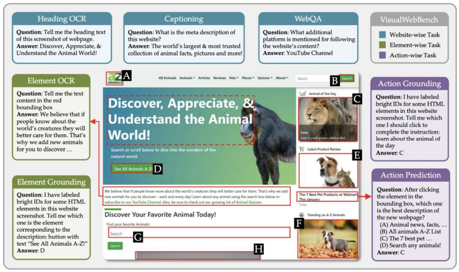

### 환경의 표현(Representation): 텍스트 기반 웹(Textual Web Representations)
- WebArena (Zhou and Xu et al., 2024)
  - 웹 환경을 텍스트(HTML, DOM, Accessibility Tree)로 표현하여 에이전트가 상호 작용 가능
  - 단순한 스크린샷 이미지 대신 구조화된 웹 표현을 제공
  - 이를 통해 에이전트가 버튼 클릭, 항목 선택같은 작업을 더 정확히 수행할 수 있음

    

### 복잡한 환경은 어떻게 이해할 수 있을까?
- 모델은 자신이 상호작용하는 환경에 대해 모든 것을 알고 있지 않음
- 일부 지식은 LLM 파라미터 안에 포함되어 있음
  - Ex) 코딩 지식, 자주 사용하는 웹사이트 탐색 방법 등
- 다른 지식은 **실시간으로 환경과의 상호작용**을 통해 발견해야 함

### 복잡한 환경에 대한 이해: 환경 특화 프롬프트(Environment-specific Prompts)
- 환경에 맞게 수동으로 프롬프트를 제작하여 에이전트가 지시를 따르도록 유도
  - Ex) SteP (Sochi et al., 2023) - 웹 탐색을 위한 프롬프트 템플릿
- 문제점: 일반화(Generalization)
   - 특정 환경에는 잘 작동하지만, 새로운 환경에서는 성능이 떨어짐

    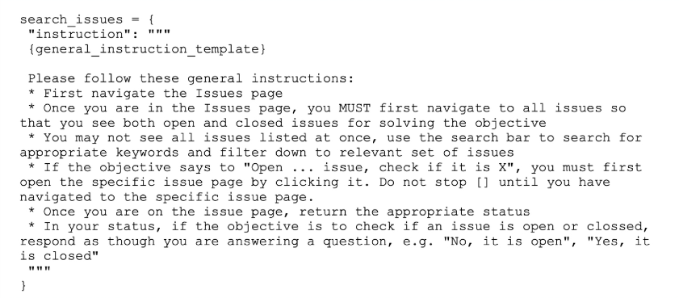

### 복잡한 환경에 대한 이해: 비지도 프롬프트 유도(Unsupervised Induction of Prompts)
- Agent Workflow Memory (Wang et al., 2024)
  - 성공적으로 수행된 워크플로우(workflow)를 기억하고, 이를 기반으로 새로운 프롬프트를 생성하여 에이전트에 제공
  - 환경에서의 상호작용을 메모리(memory)에 통합
- 프롬프트를 사람이 수동으로 설계하지 않고, 에이전트가 경험을 통해 자동 생성 및 일반화

  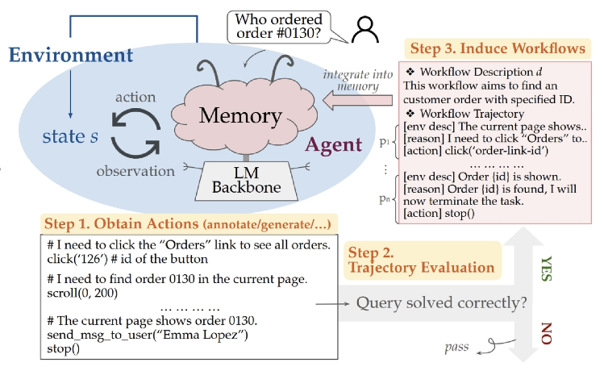

### 복잡한 환경에 대한 이해: 환경 탐색(Environment Exploration)
- 모델이 환경을 탐색할 때 보상(reward)을 부여하여 학습을 유도 -> **호기심(curiosity) 기반 보상**
  - Ex) 강화학습에서 예측 불가능한 상태 공간(state space)에 진입할 경우 보상을 증가

    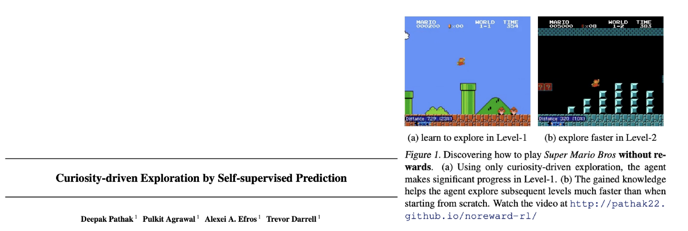

### 복잡한 환경에 대한 이해: 탐색 기반 궤적 기억(Exploration-based Trajectory Memorization)
- BAGEL (Murtey et al., 2024)
  - 명령어를 샘플링하여 실행한 뒤, 더 정확한 새로운 명령어로 궤적(trajectory)을 재라벨링
  - LM-agent가 환경을 탐색하고, LM-labeler가 이를 바탕으로 지시를 다시 정제
- 기존 데이터에 의존하지 않고 탐색과 자기 교정(self-correction)을 통해 데이터 생성
- 에이전트의 일반화 성능과 환경 적응력을 향상

  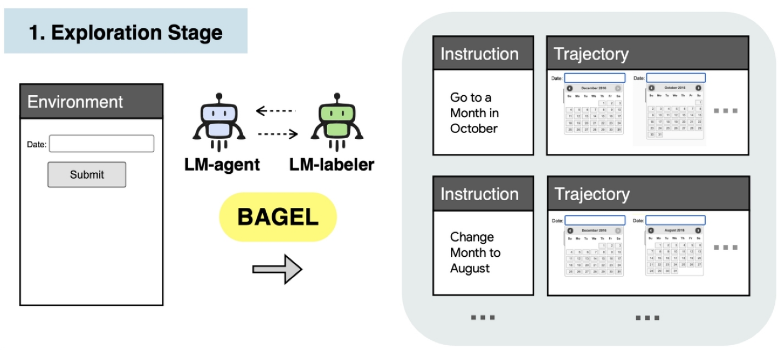

# 2. Reasoning & Planning

### Recap: 성공적인 에이전트가 갖추어야 할 요건들
- 도구 사용(Tool use)
- **추론과 계획(Reasoning and Planning)**
- 환경 표현(Environment Representation)
- 환경 이해(Environment Understanding)
- 상호작용/의사소통(Interation/Communication)

### LLM Agent 프레임워크

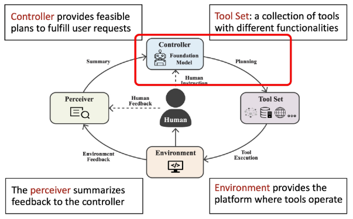

### Controller: Planning 종류
- **국소적 계획(Local Planning)**
  - 한 단계씩(step by step) 계획을 세움
  - 매 스텝마다 사용할 하나의 툴(tool) 결정
  - 단순하고 직관적이나, 장기 의존성 문제 발생
- **전역적 계획(Global Planning)**
  - 실행 가능한 전체 계획 경로(planning path)를 한 번에 생성
  - 여러 개의 툴을 조합하여 시퀀스 형태로 결정
  - 효율적이나, 복잡한 환경에서는 실패 가능

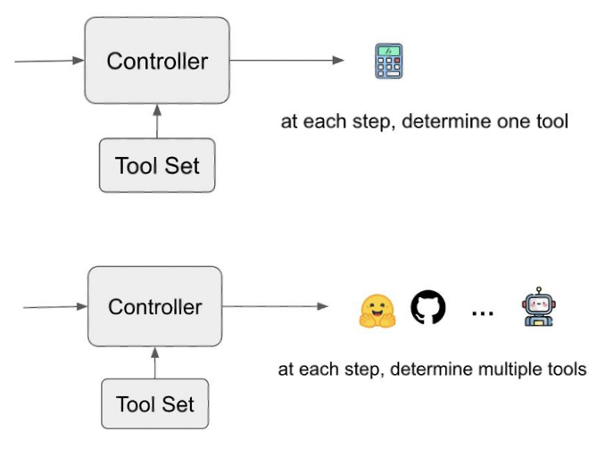

### Local planning
- ReACT (Yao et al. 2023)
  - 추론(reasoning)과 액션(action)을 결합하여 에이전트가 환경과 상호작용하도록 하는 방식
  - 단순한 추론/행동 분리를 넘어, 두 과정을 경합해 상황 적응형(local) 계획 가능
  - 다양한 도구 사용 및 웹 탐색, 추론 기반 Q&A 등에서 높은 성능

    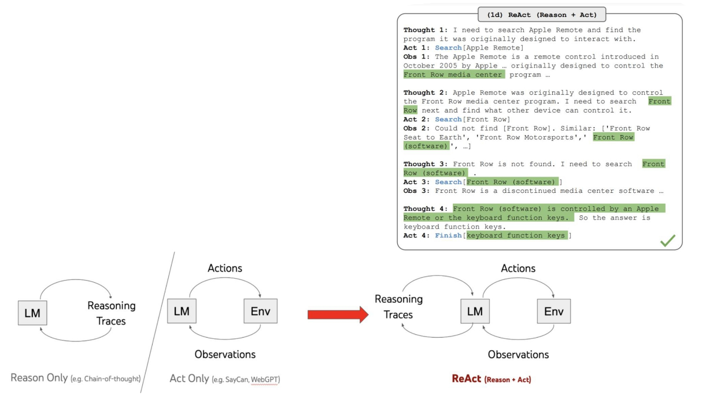

### Global planning
- Plan-and-Solve Prompting (Wang et al. 2023)
  - 전체 계획을 세운 뒤, 그 계획에 따라 순차적으로 문제를 해결
  - 단순한 step-by-step 방식보다 체계적이고 안정적인 추론 가능
  - 복잡한 문제 해결에서 오류 축적 감소

    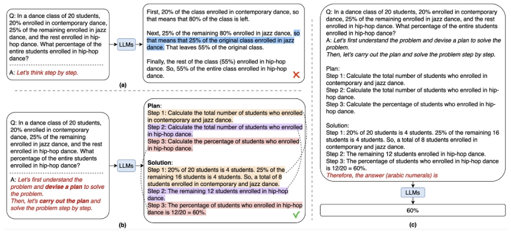

### 오류 식별과 회복(Error identification and Recovery)
- 에이전트는 에러/실수에서 회복할 방법이 필요
- Reflexion(Shinn et al., 2023)
  - 수행한 궤적(trajectory)을 평가 후 잘못된 부분을 Reflection 단계에서 분석하여 재시도하는 방식
  - 단순히 오류를 탐지하는 것에 그치지 않고, 스스로 반성(reflect)후 개선된 행동을 수행
  - 의사결정, 프로그래밍, 추론 등 다양한 태스크에서 성능 회복 및 향상을 보여줌

    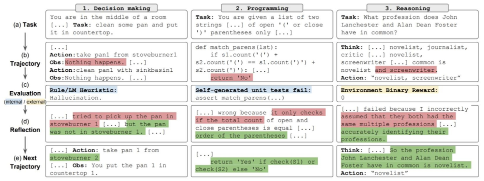

### 계획 재검토(Revisiting Plans)
- CoAct(Hou et al., 2024)
  - 에이전트가 실행 도중 계획을 재검토(revisit)하고 수정 가능
  - 두 개의 에이전트가 서로 협력하여 오류가 발생 시 재계획과 피드백을 수행한다
- 초기 계획이 불완전하더라도 실행 과정에서 보완 가능
- 장기 작업(Long-horizon tasks)에서 안전성과 성공률 향상

  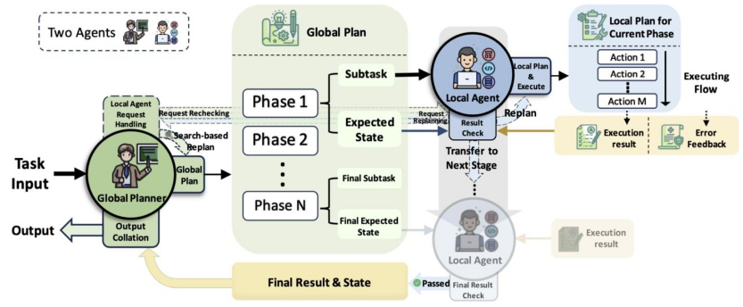

# 3. Langchain

### Langchain 이란?
- LLM 기반 애플리케이션을 빠르게 개발할 수 있는 오픈 소스 프레임워크
- LLM을 다양한 데이터/툴과 연결하여 강력한 애플리케이션 개발 기능
- 연구와 산업 현장에서 빠르게 표준으로 자리잡음

  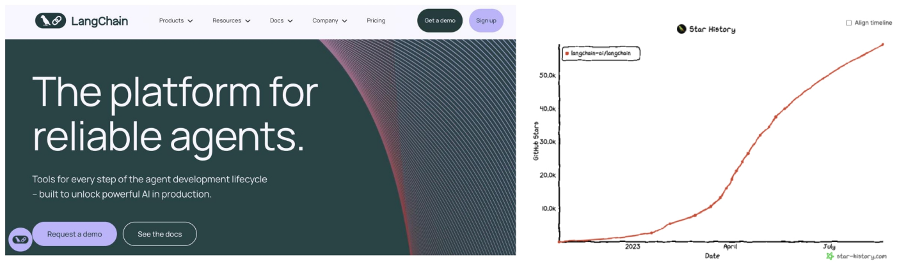

### Langchain 특징
- 다양한 LLM provider(OpenAI, Anthropic, Google, etc)와 통합하여 모델/회사별 API 차이를 공통 인터페이스로 관리 가능
- Prompt, Memory, Tools 와 같은 컴포넌트들이 모듈화되어 있어 재사용성과 확장성 확보
- LangGraph 기반으로 복잡한 워크플로우를 시각적으로 설계 및 관리 가능

  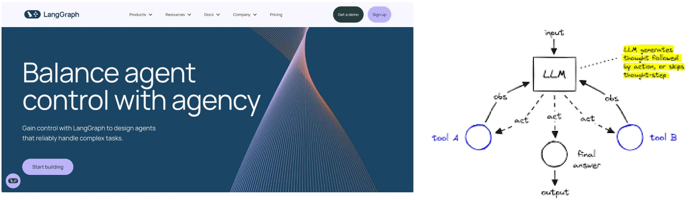

### Langchain 주요 컴포넌트
- Prompt Templates: 프롬프트를 구조화
- Chains: 여러 단계를 연결한 워크 플로우
- Agents: 동적으로 툴 선택 및 실행
- Memory: 대화 히스토리와 상태 유지
- Tools: 외부 API, DB, 계산기 등 연결
- Etc..

  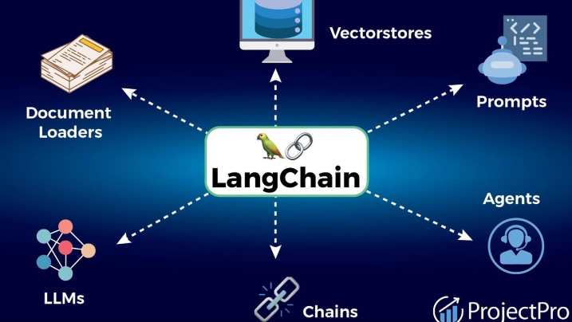

### Langchain 튜토리얼(https://python.langchain.com/docs/tutorials/)
- Langchain은 다양한 튜토리얼이 잘 되어 있음
- 이번 강의에서 배웠던 Retrieved-augmented LM, Agent 등이 다 포함되어 있다

  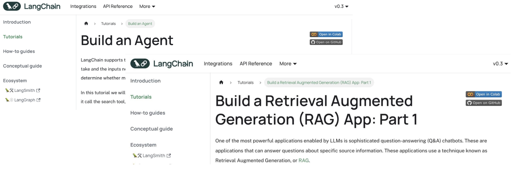

### RAG w/ Langchain
- 튜토리얼 링크: https://python.langchain.com/docs/tutorials/rag/
- LLM 설정부터 인덱싱과 RAG 다 존재

  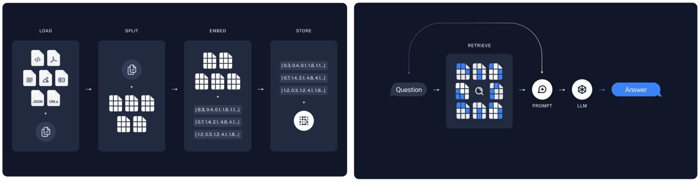

### Agent w/ Langchain
- 튜토리얼 링크: https://python.langchain.com/docs/tutorials/agents/
- ReACT 에이전트 셋업부터 실행까지 전반적인 흐름을 알려주는 튜토리얼
- 활용할 수 있는 툴 리스트: https://python.langchain.com/docs/integrations/tools/

  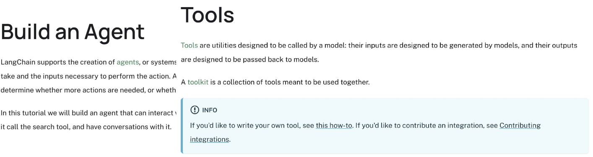

### MCP w/ Langchain
- 링크 : https://github.com/langchain-ai/langchain-mcp-adapters?tab=readme-ov-file
- MCP 를 langchain으로 활용할 수 있도록 최근 langchain에서 개발한 라이브러리
- 자기만의 MCP 서버를 만들 수 있게 되었음

  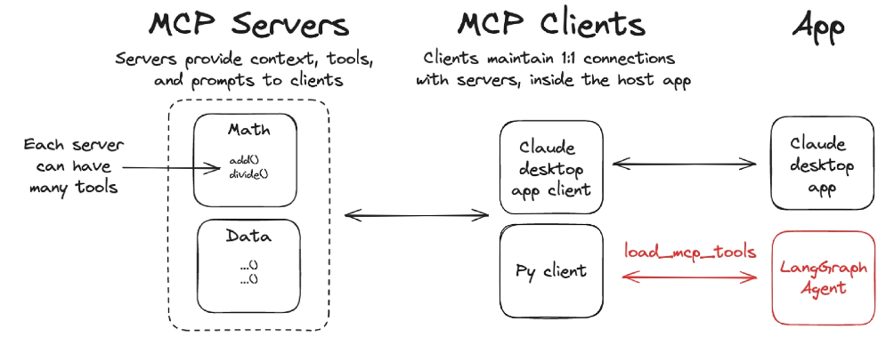