# 1. 컴퓨터의 수 체계

## 1. 고정소수점 수 체계

### 수 체계(Number System)
- 십진수(Decimal numbers)

  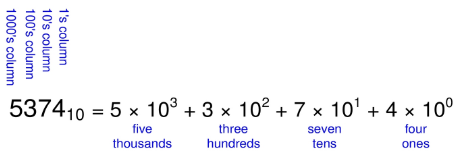

- 이진수(Decimal numbers)

  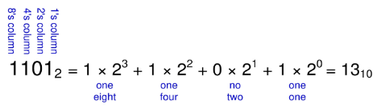

### 이진 수 체계

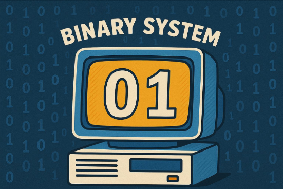

### 수 체계의 변환
- 이진수 -> 십진수
  - 십진수로 10011_2 변환하기
  - 16 * 1 + 8 * 0 + 4 * 0 + 2 * 1 + 1 * 1 = 19_10

- 십진수 -> 이진수
  - 이진수로 47_10 변환하기
  - 32 * 1 + 16 * 0 + 8 * 1 + 4 * 1 + 2 * 1 + 1 * 1 = 101111_2

### 2의 거듭제곱(Power of Two)
- 2 ** 9 까지 외워두면 편리함
  - 2 ** 0 = 1
  - 2 ** 1 = 2
  - 2 ** 2 = 4
  - 2 ** 3 = 8
  - 2 ** 4 = 16
  - 2 ** 5 = 32
  - 2 ** 6 = 64
  - 2 ** 7 = 128
  - 2 ** 8 = 256
  - 2 ** 9 = 512
  - 2 ** 10 = 1024
  - 2 ** 11 = 2048
  - 2 ** 12 = 4096
  - 2 ** 13 = 8192
  - 2 ** 14 = 16384
  - 2 ** 15 = 32768

- 보다 큰 수를 쉽게 어림짐작할 수 있음
  - 2 ** 10 = 1 kilo ≒ 1000(1024)
  - 2 ** 20 = 1 mega ≒ 1 million(1,048,576)
  - 2 ** 30 = 1 giga ≒ 1 billion(1,073,741,824)
  - 2 ** 24 의 크기는?
    - 2 ** 4 * 2 ** 20 ≒ 16 million
  - 32-bit 변수가 표현할 수 있는 패턴의 가짓수는?
    - 2 ** 2 * 2 ** 30 ≒ 4 billion

### 16진수(Hexadecimal Numbers)

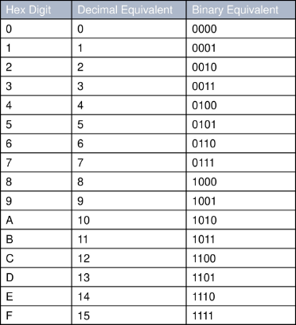

- 16진수 -> 이진수
  - 이진수로 4AF_16(0x4AF) 변환하기
  - 0100 1010 1111_2

- 십진수 -> 16진수
  - 십진수로 0x4AF 변환하기
  - 16 ** 2 * 4 + 16 ** 1 * 10 + 16 ** 0 * 15 = 1199_10

### Bits, Bytes, Nibbles...

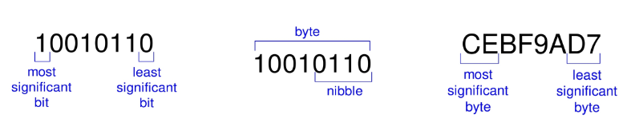

- Most Significant Bit(MSB): 이진수에서 가장 왼쪽에 있는 비트, 가장 큰 자리값을 가짐

- Least Significant Bit(LSB): 이진수에서 가장 오른쪽에 있는 비트, 가장 작은 자리값을 가짐

- Nibble: 4비트(half byte)로 이뤄진 데이터 단위

### 이진수의 값과 범위
- 0과 자연수를 표현하는 N-자리(N-digit) 십진수
  - 가능한 표현의 수? 10 ** N
  - 범위? [0, 10 ** N - 1]
  - 3-digit 십진수 예시
    - 10 ** 3 = 1000 가지 표현 -> [0, 999]

- 0과 자연수를 표현하는 N-자리(N-digit) 이진수
  - 가능한 표현의 수? 2 ** N
  - 범위? [0, 2 ** N - 1]
  - 3-digit 이진수 예시
    - 2 ** 3 = 8가지 표현 -> [0, 7]

### 덧셈(Addition)
- 십진수의 덧셈

  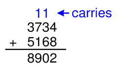

- 이진수의 덧셈

  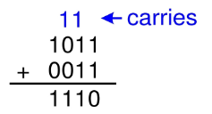

- 4-bit 이진수 덧셈 예시

  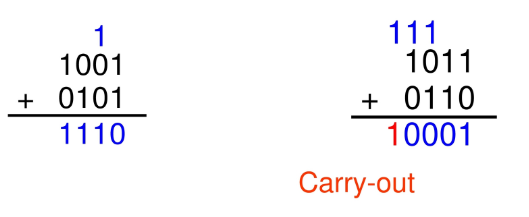

### 부호 있는 수 체계(Signed Number System)
- 부호-크기 표현 방식(signed-magnitude representation)
  - 최상위 비트(MSB)를 부호 비트로 사용하여 0이면 양수, 1이면 음수를 나타내고 나머지 비트는 절댓값(크기)을 표현하는 방식

- 2의 보수 표현 방식(two's complement representation)
  - 음수를 표현할 때 해당 수의 절댓값을 이진수로 쓰고, 모든 비트를 반전(1의 보수)한 뒤 1을 더하는 방식

### 부호-크기 표현 방식(Signed-Magnitude Representation)
- 1 sign bit, N - 1 magnitude bit
  - 최상위 자리에 sign bit 할당(most significant bit)
    - 양수(positive number) -> sign bit = 0
    - 음수(negative number) -> sign bit = 1

      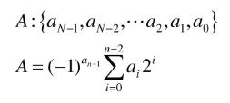

- 4-bit 부호-크기 표현 방식 예시
  - +6 = 0110
  - -6 = 1110

- N-bit 부호-크기 표현의 범위
  - [-(2 ** (N - 1) - 1), 2 ** (N - 1) - 1]
  
- 기존 덧셈에 문제 발생
  - -6 + 6 예시

    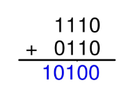
  
  - 0을 표현하는 방식에 두 가지가 있음 (±0)
    - 1000
    - 0000

### 2의 보수 표현 방식(Two's Complement Representation)
- 최상위 자리가 -2 ** (N - 1) 값을 표현

  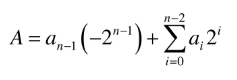

  - 양의 방향으로 가장 큰 4-bit 표현: 0111
  - 음의 방향으로 가장 큰 4-bit 표현: 1000
  - 여전히 최상위 자리가 부호를 표시 (0 -> 양수, 1 -> 음수)

- N-bit 2의 보수 표현의 범위
  - [ -2 ** (N - 1), 2 ** (N - 1) - 1]

- 기존 덧셈이 정상적으로 동작
  - 6 + (-6)

    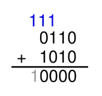

  - -2 + 3

    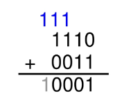

- 2의 보수 표현에서 부호반전
  - 모든 bit을 반전(inversion)
  - +1
  - 3_10 = 0011_2 부호반전 예시

    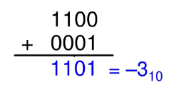

### 비트 폭 확장(Increasing Bit Width)
- N-bit 수를 M-bit 수로 확장(M > N)
  - 부호 확장(sign extension): 최상위 비트를 복사해 상위 비트를 채움(값을 일정하게 유지)
    - 값 3의 4-bit 표현 = **0**011 -> 부호 확장된 8-bit 표현 = *0000***0**011
    - 값 -5의 4-bit 표현 = **1**011 -> 부호 확장된 8-bit 표현 = *1111***1**011
  - 제로 확장(zero extension): 상위 비트를 모두 0으로 채움(패턴을 일정하게 유지)
    - 값 3의 4-bit 표현 = **0**011 -> 제로 확장된 8-bit 표현 = *0000***0**011
    - 값 -5의 4-bit 표현 = **1**011 -> 제로 확장된 8-bit 표현 = *0000***1**011 = 11_10

### 이진 수 체계 정리

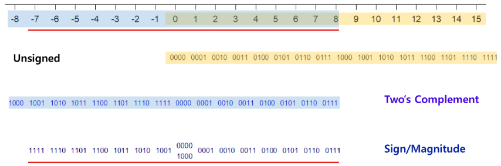

- C언어에서 정의된 정수 자료형(data type)

  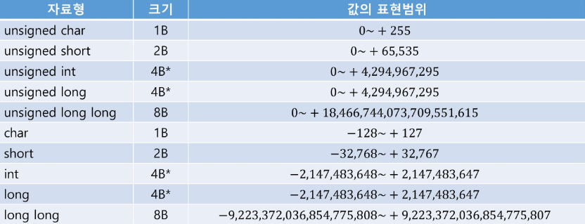

- int 와 long 의 역사
  - 8-bit/16-bit 컴퓨터 시절부터 정의된 자료형(1983년 정의된 C89 자료형)
    - C언어는 1972년 출시, 인텔 16-bit 80286(1982년), 인텔 32-bit 80386(1985년), 인텔 64-bit IA-64(2001년)
  - 1983년 정의된 최초의 C89 자료형
    - char: 최소 1B인 정수형
    - short(int): 최소 2B인 정수형으로 적어도 -32,768 ~ +32,767 범위를 포함할 수 있음
    - int: short 보다 크고 최소 2B인 정수형으로 적어도 -32,768 ~ +32,767 범위를 포함할 수 있음
    - long(int): 최소 4B인 정수형으로 적어도 -2,147,486,648 ~ +2,147,483,647 범위를 포함할 수 있음
  - 64-bit 구조의 등장으로 1999년 C99 표준에서 추가 정의
    - long long(1nt): 8B 정수형

- 컴퓨터의 발전과 함께 혼란이 시작됨
  - int 자료형
     - 가장 효율적으로 처리될 수 있는 정수 타입을 목표로 정의됨
     - 컴퓨터 구조에 따라서 다른 크기였음(16-bit, 32-bit 등)
     - 64-bit 구조가 등장하면서 혼란을 막기 위해 int 자료형은 32-bit 길이로 고정
     - 엄밀하게 c언어에서 int는 최소 2B 범위를 포함한 정수형으로 32-bit 컴퓨터까지는 구조에 따라 크기가 달라질 수 있으나, 64-bit 구조 이후부터는 4B로 길이가 고정되는 자료형
  - long 자료형
    - 이로 인해 long이 애매해짐
    - long long은 8B로 명확하게 정의됨
    - 16-bit 이하 CPU는 더 이상 존재하지 않으므로 사실상 int 자료형은 4B 길이라 봐도 무방
    - 근데 long은 (과거 int처럼) 컴퓨터/OS 구조에 따라서 4B 혹은 8B로 사용되고 있음에 주의

- 크로스 플랫폼 개발 시 확인 필요
  - Windows가 포함된 환경이면 가급적 long 사용하지 말고, int와 long long 사용 권장 (혹은 int32_t, int64_t)

    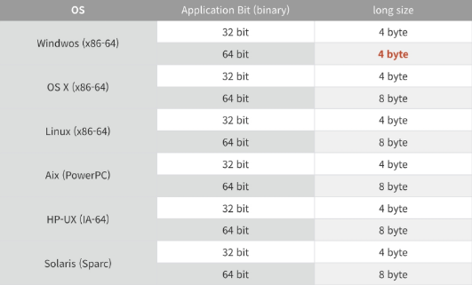

### 고정소수점 수 체계(Fixed-Point Number System)
- N-bit 패턴이 꼭 정수일 필요는 없음
  - 정수부(integral part)와 소수부(fractional part)를 N-bit 패턴에서 함께 표현할 수 있음
    - K-bit 정수부, M-bit 소수부(K + M = N)
    - 정수부와 소수부 사이에 이진 소수점(binary point)

      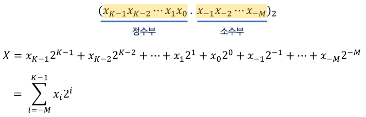

- 이진 소수점 위치는 실제 저장하지 않음
  - 사용자(프로그래머)가 제한없이 해당 위치를 정할 수 있음 -> HW는 모두 N-bit 정수(integer)로 판단
    - 즉, 실제 의도한 값은 2 ** M 배 차이가 있음(scaling factor)
  - 덧셈과 뺄셈은 이전과 동일하게 동작
    - aX ± aY = a(X ± Y) (a = scaling factor)
    - (4, 4) 8-bit 고정소수점 예시 (4-bit 정수부, 4-bit 소수부, scaling factor = 2 ** (-4))

      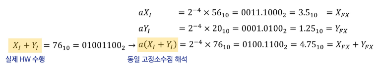

  - 곱셈과 나눗셈은 scaling factor 체크 (HW는 정수 입력이라 가정하고 동작하기에 사용자의 의도가 중요)
    - aX * aY = a ** 2(X * Y) ≠ a(X * Y)
    - (4, 4) 8-bit 고정소수점 예시 (4-bit 정수부, 4-bit 소수부, scaling factor = 2 ** (-4))

      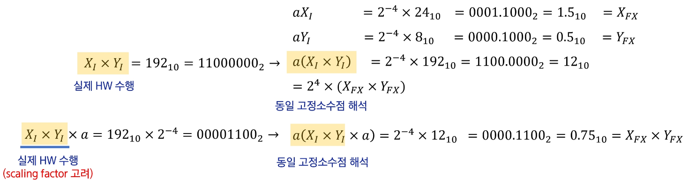

    - aX / aY = X / Y ≠ a(X * Y)
    - (4, 4) 8-bit 고정소수점 예시 (4-bit 정수부, 4-bit 소수부, scaling factor = 2 ** (-4))

      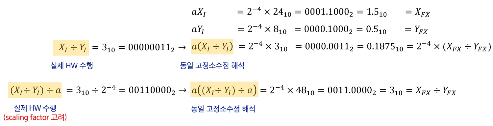

## 2. 부동소수점 수 체계

### 부동소수점 수 체계(Floating-Point Number System)
- 아주 크거나 아주 작은 수를 효과적으로 표현
  - 고정소수점 표현을 활용할 경우 너무 많은 비트를 요구함
    - 64-bit signed long long 타입(2의 보수): -9,223,372,036,854,775,808 ~ +9,223,372,036,854,775,807
  - 지수를 활용한다면? 큰/작은 수를 더 적은 문자로 표현 -> 대신 유효숫자의 개념을 도입
    - 64-bit signed long long 타입(2의 보수): -9.22 * 10 ** 18 ~ + 9.22 * 10 ** 18 (정확함을 보장하지 않음)

- 부동소수점
  - 지수를 활용하여 수를 표기
    - 가수(mantissa or significand), 밑(base or radix), 그리고 지수(exponent)로 나누어 수를 표기
    - 예시) 1,23 * 10 ** 3 (소수점의 위치가 3칸 오른쪽) 2.3 * 10 ** (-5) (소수점 위치가 5칸 왼쪽)
  - 소수점이 고정되지 않고 둥둥 떠다니는 것으로 해석

    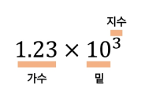

- 정해진 자리 수만 사용해서 부동소수점 "잘" 표현하기
  - 가수는 고정소수점 체계를 사용
    - 1234.5 * 10 ** 5 = 123.45 * 10 ** 6 = 12.345 * 10 ** 7 = 1.2345 * 10 ** 8
  - 언제나 ■.■■■■ * 10 ** ■ 형태로만 표현하기로 약속 -> **정규화(normalization)

- 유효숫자 그 다음은 어떻게 처리할까?(rounding scheme)
  - 반올림(round to nearest)
  - 올림(round toward +inf)
  - 버림(round toward -inf)
  - 절삭(round toward zero)
  - 오류를 최소화하기 위한 다양한 rounding 기법이 존재

### 이진 부동소수점 수 체계(Binary Floating-Point Number System)
- 지수적 표현을 이진 수 체계에 어떻게 접목할 것인가

  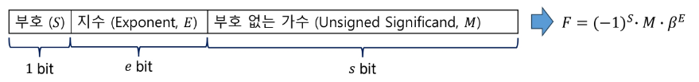

  - 가수는 두 가지 표현 중에 선택
    - [0, 1) 범위의 순수한 소수 표현: 0.■■■■
    - [1, 2) 범위의 정규화된 표현: 1.■■■■

      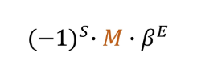

  - 밑(base, β) -> 일반적으로 2의 거듭제곱 형태를 선택 β = 2 ** k
    - 밑을 미리 약속(고정)하여 가수/지수 변화를 간단하게 만들 수 있음
    - 가수의 최대(M_max)보다 큰 값이 생기면 가수를 표현 가능한 범위로 줄이고 지수를 증가시켜야 함

      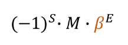

- 다양한 밑(β) 옵션
  - 예시: 어떤 연산의 결과가 01.10100 * 2 ** 100 이었다면? -> 사전 정의된 [0, 1) 가수 범위 초과(최대인 M_max 초과)
    - 유효한 표현을 위한 수정작업(correction) 필요 -> 0.11010 * 2 ** 101
    - 밑이 2가 아니라면? β = 2 ** k 상황에서는 지수를 1 증가시키기 위해선 가수를 k 위치 이동함 
    -> β = 4 = 2 ** 2 상황에서 수정된 유효한 표현 = 01.10100 * 2 ** 100 = 01.10100 * 4 ** 010 = 00.01101 * 4 ** 011
    - [0, 1) 이면 가수는 0.■■■■ 형태여야 함

      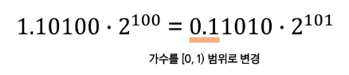

  - 예시: 01.10100 * 2 ** 100 에서 밑이 2가 아닌 4라면?(β = 2 ** 2 일 때)
    - 밑이 2가 아닌 β = 2 ** k 상황에서는 지수를 1 증가시키기 위해선 가수를 k 위치 이동함
    - β = 4 = 2 ** 2 (k = 2) 상황에서 수정된 유효한 표현 = 01.10100 * 2 ** 100 = 01.10100 * 4 ** 50 = 00.01101 * 4 ** 51

      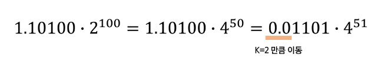

- 정규화된 이진 부동소수점 수 체계(Normalized number)
  - 부동소수점은 유일한(unique) 표현이 아님에 주의 -> 0.11010 * 2 ** 101 = 0.01101 * 2 ** 100 = 0.001101 * 2 ** 99 ...
    - 가수의 비트 수 한계로 같은 표현을 무한히 만들 수는 없음
  - 일반적으로 0으로 시작하는 패턴을 피하고자 함(유효숫자를 최대한 확보) -> 정규화(normalization)
    - 정규화된 표현은 두 부동소수점 수 비교를 간단하게 함 -> 지수를 먼저 비교한 다음 가수를 비교할 수 있음
  - β = 2 ** k 경우에는 가수는 k 비트 단위로 이동할 수 있음 -> 첫 k 비트가 모두 0이 아니면 정규화된 것으로 판단
    - 예시) (k = 1) 일 때 정규화

      

    - 예시) (k = 4) 일 때 정규화

      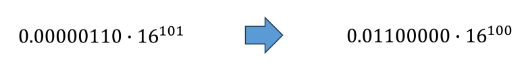

- 정규화 표현의 한계
  - 정규화된 표현은 0을 포함하지 않음
    - 0을 표현하기 위한 특수패턴을 정의
    - 가장 일반적인 표현: M = 0 (E는 아무 값이나 상관없으나 E = 0 사용을 선호)

- 바이어스/편향 지수(biased exponent)
  - 가장 일반적으로 사용되는/기록되는 지수 표현 -> E = E_true + bias
    - bias: 미리 정해진 상수
    - E_true: 실제 지수(2의 보수 표현)
  - e-bit E ** true가 표현할 수 있는 범위: -2 ** (e - 1) ≤ E_true ≤ e ** (e - 1) - 1
  - 바이어스는 일반적으로 지수가 가질 수 있는 가장 작은 음수의 절댓값으로 설정(bias = 2 ** (e - 1))
    - excess 2 ** (e - 1) 기법 -> 0 ≤ E ≤ 2 ** e - 1
  - 바이어스 지수의 예시 (e = 7 가정)
    - 실제 지수의 범위: -64(= 1000000) ≤ E_true ≤ 63(= 0111111)
  - excess 64 방식을 사용한다면 (bias = 64)
    - E_true = -64 경우 E = 0000000 기록
    - E_true = +64 경우 E = 1111111 기록
  - excess 2 ** (e - 1) 기법을 사용한다면 실제 지수의 2의 보수 표현에서 부호 비트만 반전(inversion)시키면 됨
  - 바이어스 지수의 장점
    - 지수를 0/양수 영역으로 이동시켜 기록된 지수를 부호-없는 수 표현으로 해석하게 만듦
  - 정규화된 가수와 바이어스 지수
    - S, E, M 표현 방식의 대소 비교가 부호-없는 정수 표현의 경우와 동일해짐

- 이진 부동소수점의 표현 범위
  - 양수(F+) 음수(F-) 영역을 따로 생각함
    - 양수 영역만 고려한다면: M_min * β ** E_min ≤ F ≤ M_max * β ** E_max
  - 연산의 결과에서 지수가 E_max 초과되면 상한초과 발생(exponent overflow)
  - 연산의 결과에서 지수가 E_min 미달되면 하한미달 발생(exponent underflow)
  - 정규화된 가수를 사용한다면 상한초과(overflow)는 지수의 변화에서만 발생
    - 지수의 상한초과 발생 시 무한대(infinity)를 표현하는 특수 패턴 사용(overflow 표시)
    - 다른 처리 방법: 1) 연산을 멈추고 프로세서에 인터럽트 발생, 2) 값을 표현 가능한 최댓값으로 고정(비선호)
  - 하한미달(underflow) 발생
    - 값을 0을 표현하는 특수 패턴으로 변경(underflow 표시, 연산을 멈추지 않는 경우가 일반적)
  - 최종적인 표현 범위(0이 범위에 포함되지 않음)

    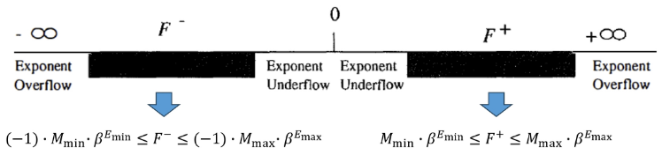

- 다양한 (예전) 부동소수점 수 체계들

  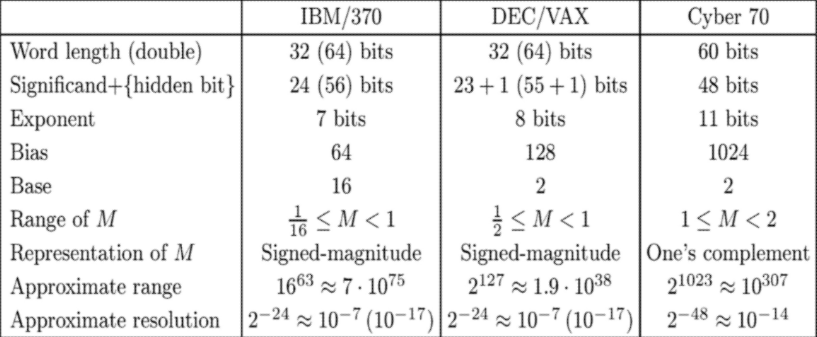

### 부동소수점 표준(IEEE 754 Standard)
- 컴퓨터 시스템에서 가장 널리 사용되는 이진 부동소수점 표준
  - Single-precision 32-bit 포맷(c언어에서 float 자료형)
  - Double-precision 64-bit 포맷(c언어에서 double 자료형)
  - Single-extended 포맷(최소 44 bit 사용)
  - Double-extended 포맷(최소 80 bit 사용)
    - 중간값 계산 과정에서 활용되며 보다 높은 해상도/범위 제공
  - 유효숫자 제한으로 이한 오류를 줄이는 rounding scheme 들
    - Round to nearest even(mandatory), Round toward zero, Round toward positive/negative infinite

### IEEE Single-Precision 포맷

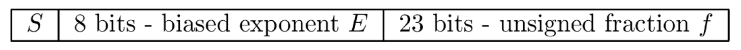

- 주요 특징
  - Base-2
  - Hidden bit 사용: 1.■■■■ 형태로 가수를 정규화하고 있으며, 맨 앞의 1을 f에 저장하지 않음
  - 8-bit 지수에 bias를 127로 사용(256가지 지수 표현 중 특수 패턴 정의)
    - E = 0 -> f = 0 경우 값 0 의미 or f ≠ 0 경우 비정규화수(denormalized number) 의미
    - E = 255 -> f = 0 경우 ±∞ 의미 or f ≠ 0 경우 정의되지 않은 수(NaN, Not a Number) 의미
    - 1 ≤ E ≤ 254 -> F = (-1) ** S * 1.f * 2 ** (E - 127) 
  
- 조금이라도 넓은 표현범위를 위한 노력 (IEEE vs. DEC)
  - 지수 bias: 128(= 2 ** (e - 1)) 대신 127 사용
    - 실제 지수의 최댓값 증가: E_true_max = 254 - 127 = 127
  - 가수에 Hidden bit 사용 (0.f 대신 1.f) -> 지수에 1을 더하는 효과

  - 양의 방향(positive direction) 범위
  
    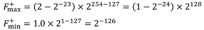
  
    - DEC 포맷의 경우 F_+_max = (1 - 2 ** (-24)) * 2 ** 127, F_+_min = 2 ** (-128)
    - IEEE 표준의 경우 모든 정규화된 수의 역수를 상한효과(overflow)없이 표현할 수 있음 (특히 F_+_min)

- 특수 표현(Special value)
  
  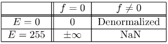

  - ±∞: f = 0, E = 255, S = 0 or 1
    - 연산 규칙을 따라야 함: F + ∞ = ∞, F / ∞ = 0
  - 비정규화 수(Denormalized numbers, HW 구현은 옵션)
    - 가장 작은 정규화 수보다 작은 수, 하한미달(underflow) 발생 제거 (가장 작은 정규화 수: F_+_min = 1.0 * 2 ** (-126))
    - F = (-1) ** S * 0.f * 2 ** (-126) 값을 표현 (가수가 더 이상 정규화된 1.f 형태가 아님)
    - 비정규화 수의 간격 = 2 ** (-149), 지수가 가장 작은 정규화 수의 간격 = 2 ** (-126)

      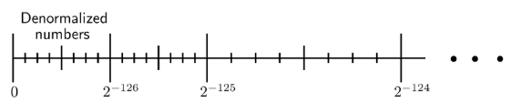

### IEEE Double-Precision 포맷
- Single-Precision 포맷과의 차이

  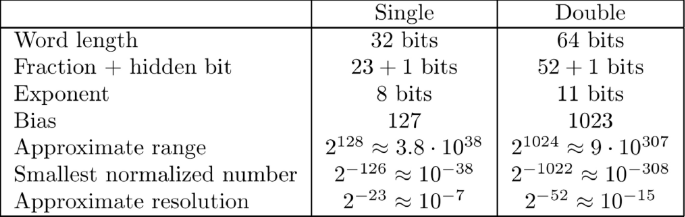

## 3. 연산과 복잡도

### 고정소수점 수 체계의 연산
- 이진 수 체계 정수의 덧셈
  - 4-bit 부호 없는 정수의 덧셈

    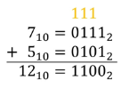

  - 상한초과(overflow) 상황의 이해
    - 자리올림 출력(carry out) 신호의 유/무를 확인

    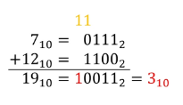

  - 4-bit 부호 있는 정수의 덧셈 (2의 보수 방식)
    - Carry out 신호가 있어도 정상 결과임에 유의

    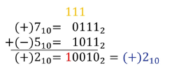

  - 2의 보수 표현에서 상한초과(overflow) 상황의 이해
    - Carry out 신호와 무관, 부호 비트의 변화를 바탕으로 overflow 판단

    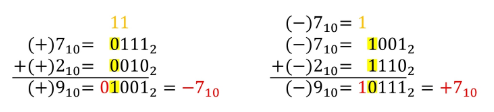

- 이진 수 체계 정수의 뺄셈
  - 4-bit 부호 있는 정수의 뺄셈 (2의 보수 방식)
    - 덧셈으로 뺄셈을 수행할 수 있음을 확인

    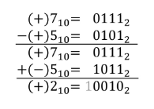

    - 실제 고정소수점 덧셈기(adder)와 뺄셈기(subtractor)의 HW 복잡도는 사실상 동일

- 이진 고정소수점 수 체계 정수의 덧셈/뺄셈
  - 정수의 덧셈/뺄셈과 기본적으로 동일하나 이진 소수점 위치 차이로 인한 scaling factor 주의 
    - 덧셈/뺄셈 과정에서 이진 소수점 위치의 정렬이 필요
    - 연산 이후 소수점 위치에 대한 사전 정의 필요
    - A는 (2, 3) B는 (3, 2) 형태의 5-bit 고정소수점 수 체계를 사용한다 가정하면

      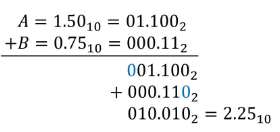

- 이진 수 체계의 곱셈
  - 기존 10진수 체계의 곱셈과 동일한 과정
    - 1-bit 이진수의 곱셈: 0 * 0 = 0, 0 * 1 = 0, 1 * 0 = 0, 1 * 1 = 1
    - n-bit 이진수의 경우 자리수가 2n까지 늘어남 -> 같은 길이의 출력을 얻는 경우 overflow/saturation 주의
    - 4-bit 이진수 곱셈 예시: 11 * 5

      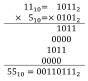

  - 보다 빠른 곱셈 구현을 위한 노력이 이어지고 있음(예: radix-4 Booth multiplier)
    - Radix-4 Booth multiplier: 2비트씩 묶어서 곱셈을 수행해 연산 속도를 줄이는 하드웨어 곱셈기 구현 기법(두 자리씩 끊은 단위로 계산)

- 이진 수 체계의 나눗셈
  - 기존 10진수 체계의 곱셈과 동일한 과정
    - 나눗셈은 출력이 2개인 연산 (기본적으로 어려움/복잡함)
    - 2n-bit 피제수(dividend), n-bit 제수(divisor)에 대해서 n-bit 몫(quotient), n-bit 나머지(remainder) 
    -> 피제수의 경우는 n-bit으로 주어질 수 있음, 하나의 출력만을 만들어내는 연산도 가능

      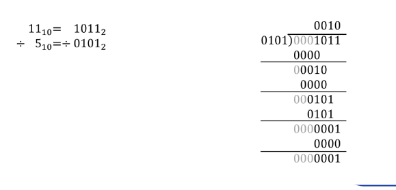

  - 보다 빠른 나눗셈 구현이 이어지고 있음
    - 예시: non-restoring division, SRT division 등

- 고정소수점 연산의 복잡도
  - 일반적으로 연산 속도 관점에서 덧셈~뺄셈 << 곱셈 << 나눗셈
    - 연산기별 최적화 정도와 구현 공정에 따라서 세부적으로 다를 수 있으나 경향성을 이해

      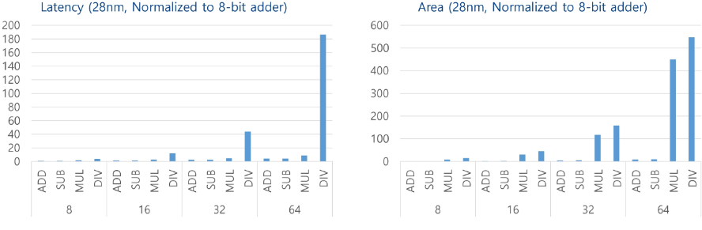

- 이진 부동소수점 수 체계의 덧셈/뺄셈
  - 가수의 덧셈/뺄셈 전에 지수를 동일하게 만들어야 함
    - 즉, 고정소수점 수 체계의 덧셈/뺄셈보다 복잡한 과정이 필요
      1. 두 피연산자의 지수를 비교, 더 큰 지수를 기준으로 선택
      2. 작은 지수를 가진 수의 가수를 오른쪽으로 shift하여 지수를 맞춤
      3. 가수끼리 덧셈/뺄셈 진행
    - 조금 더 엄밀하게 표현하면(E_1 > E_2 가정)
      - 지수가 작은 F_2의 가수인 M_2를 |E_1 - E_2| 만큼 base-β right shift 수행
      - F_1 ± F_2 = ((-1) ** S_1 * M_1 ± (-1) ** S_2 * M_2 * β ** (-|E_1 - E_2|)) * β ** (E_1 - bias)
      - β = 2 상황이면 M_2를 오른쪽으로 β bit 만큼 shift

        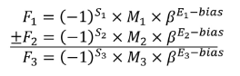

- 정규화된 부동소수점 수 체계의 덧셈/뺄셈 -> 생각보다 복잡함
  - 기본 덧셈 이후 추가 체크
    - 가수의 결과가 정규화 영역을 넘어설 수 있음
    - 예를 들어 [0. 1) 범위로 정규화된 경우, M_3 > 1 상황이 발생하면 사후정규화 작업이 필요(post-normalization)
    - 사후정규화를 위해 지수(E_3)를 1 증가시키고 가수(M_3)를 오른쪽으로 1 bit shift
    - 증가한 지수로 인한 상한효과(overflow) 체크가 다시 필요
  - 기본 뺄셈 이후 추가 체크
    - 가수의 결과가 역시 정규화 영역을 넘어설 수 있음 (+ 가수 정렬시 유효자리 확보를 위한 가드 bit 필요)
    - 예를 들어 [0, 1) 범위로 정규화된 경우, M_3 > 1 / β 상황면 사후정규화 작업이 필요(post-normalization)
    - 사후정규화를 위해 지수(E_3)를 감소시키고 가수(M_3)를 왼쪽으로 shift (정규화되는 시점까지)
    - 감소한 지수로 인한 하한미달(underflow) 체크가 다시 필요, 사후정규화 결과로 0이 될 수도 있음

- 이진 부동소수점 수 체계의 곱셈
  - 부호(S_3): 부호가 같으면 + 다르면 -
  - 지수(E_3): 두 지수를 더함
    - 바이어스 지수 사용하고 있다면 지수 덧셈 이후 bias 값을 한 번 빼야함 
    -> E_1 + E_2 = (E_true_1 + bias) + (E_true_2 + bias)
    - 계산된 지수에 대한 상한초과/하한미달 확인이 필요
  - 가수(M_3): 두 가수를 고정소수점 곱셈처럼 연산(지수 연산과 병렬처리 가능)
    - 계산된 가수에 대한 사후정규화 작업 필요(1 / β ≤ M_i ＜ 1 이므로, 1 / β ** 2 ≤ M_1 * M_2 ＜ 1) 
    곱셈 결과에 따라서 가수를 한 번 base-β left shift 해야할 수 있음, 이 경우 지수를 1 감소시켜야 함 
    지수가 감소할 경우 지수에 대한 하한미달을 다시 검토

- 이진 부동소수점 수 체계의 나눗셈
  - 부호(S_3): 부호가 같으면 + 다르면 -
  - 지수(E_3): 두 지수를 뺌
    - 바이어스 지수 사용하고 있다면 지수 뺄셈 이후 bias 값을 한 번 더해야함 
    -> E_1 - E_2 = (E_true_1 + bias) - (E_true_2 + bias)
    - 계산된 지수에 대한 상한초과/하한미달 확인이 필요
  - 가수(M_3): 두 가수를 고정소수점 나눗셈처럼 연산(지수 연산과 병렬처리 가능)
    - 계산된 가수에 대한 사후정규화 작업 필요(1 / β ≤ M_i ＜ 1 이므로, 1 / β ≤ M_1 / M_2 ＜ β) 
    나눗셈 결과에 따라서 가수를 한 번 base-β right shift 해야할 수 있음, 이 경우 지수를 1 증가시켜야 함 
    지수가 증가할 경우 지수에 대한 상한초과를 다시 검토
  - 제수(divisor)가 0인 경우
    - 우선적으로 상한초과 처리(overflow)
    - 몫(quotient)의 경우 ±∞
  - 피제수(dividend)와 제수(divisor)가 모두 0인 경우
    - IEEE 754 표준의 경우 not a number(NaN) 처리
  - 나머지(remainder) 계산?
    - 부동소수점 나머지 계산이 정의되어 있으나 일반적으로 몫 계산보다 훨씬 복잡함
    - 대부분의 경우 하드웨어 수준에서 제공되지 않는 경우가 많음

- 부동소수점 연산의 복잡도
  - 일반적으로 연산 속도 관점에서 곱셈 < 덧셈 ~ 뺄셈 < 나눗셈 (나눗셈은 구현 방식에 따라 복잡도가 다를 수 있음)
    - 덧셈/뺄셈의 경우 병렬적 구현이 어려운 문제가 있음

      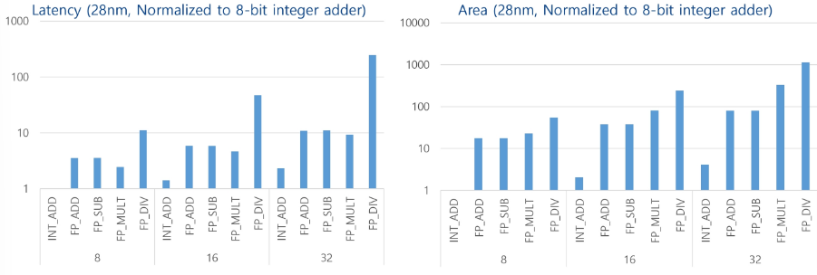

### 상용 GPU의 다양한 연산자

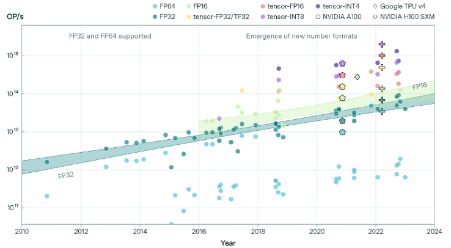

# 2. 모델 경량화와 효율적 파인튜닝

## 1. 모델 경량화의 필요성

### 바야흐로 AI/ML 천하
- (한계도 있지만) 이미 많은 영역에서 평균적으로 사람보다 우수함

  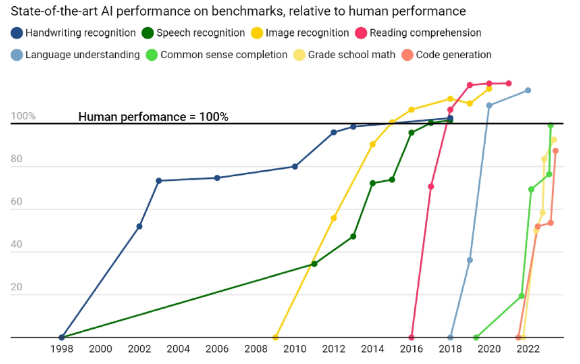

### AI/ML 세상의 어두운 면?
- 모델 크기 문제

  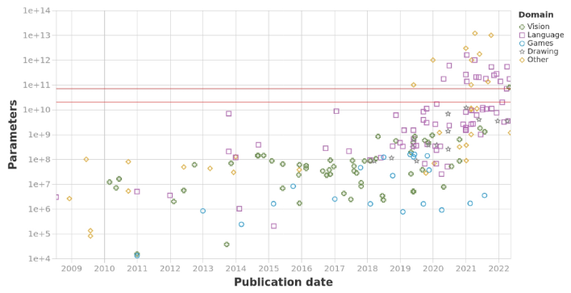

- 컴퓨팅 리소스 문제

  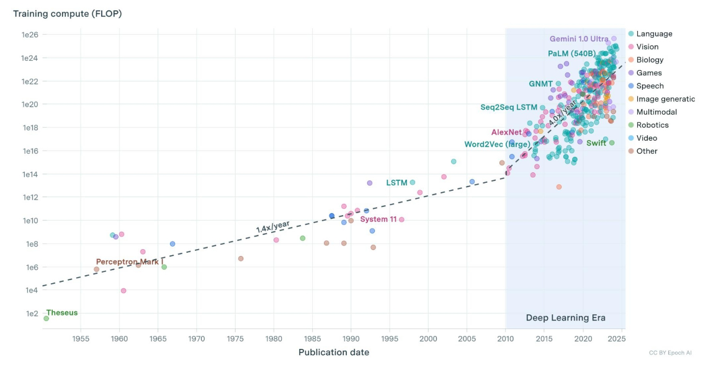

- 학습 비용: All you need is money

  

- 계속해서 커질 것으로 예상되는 모델

  

### 모델 경량화(Model compression)
- 선택이 아닌 필수가 되고 있음(특히 추론/서비스 영역에서)
  - 일반적으로 경량화 정도가 좋아지면 모델 성능이 떨어짐 + 어떤 성능을 개선할 것인가? (모델크기, 속도, 전력)
  - GPU와 궁합이 좋은 기법
    - Low-rank adaption(LoRA), quantized low-rank adaption(QLoRA)
    - Knowledge distillation
    - Constrained quantization
    - Structured pruning
  - GPU와 궁합이 좋지 않은 기법(전용 가속기로 효과 극대화 필요)
    - Aggressive quantization, mixed-precision quantization
    - Unstructured/partially-structured pruning

## 2. Quantization/Pruning/Distillation

### 양자화(Quantization)
- 연산/메모리 부하를 줄이는 가장 직관적인 방법
  - Clipping range에 따른 scaling factor 정하는 것이 가장 첫 단계
  - 이외에도 생각보다 많은 고려사항이 있음
  - 모델마다 적용 가능한 quantization 옵션이 다른 경우가 많음
  - 또한, 효율 개선을 위해 하드웨어/가속기 지원이 필요한 경우도 있음

    

- QAT vs. PTQ
  - Quantization-aware training(QAT)
    - 학습 단계에서(forward pass) quantization을 함께 수행 (학습 데이터가 필요)
    - 동일 accuracy 기준 압축률을 높일 수 있음, but 학습 복잡도가 엄청나게 상승(retrain/fine-tuning 접근)

      

    - 상대적으로 CNN 등 오리지널 학습 복잡도/데이터가 크지 않은 경우 쉽게 적용 가능

      

  - Post-training quantization(PTQ)
    - LLM처럼 모델도 학습데이터도 너무 큰 경우엔 QAT 사용불가
    - 사전학습된(pre-trained) 모델을 바탕으로 quantization 바로 수행
    - 적절한 calibration 데이터를 사용하여 경량화 효율을 높일 수 있음

      

- Weight-activation vs. Weight-only
  - 모델 사이즈에 얼마나 집중할 것인가? (정확도 손실을 어디까지 허용할 것인가?)
  - De-quantization 과정을 얼마나 허락할 것인가?

    

- Symmetric vs. Asymmetric

  

  - Activation 및 weight의 분포를 어디까지 반영할 것인가?
  - 하드웨어 연산기 수준의 지원은?

    

- Integer vs. Floating-point
  - Integer quantization 방식은?
    - 예) Asymmetric binary-coding quantization(BCQ) 같은 새로운 방식을 시도할 수 있음

      

  - Floating-point quantization 방식은?
    - AI/ML 연산을 위해 고려된 다양한 FP 표현들이 있음
    - 예) 기존 IEEE 754 표준 활용

      

    - 예) 구글 BF16 표현 (IEEE의 FP32의 truncation 버전)

      

    - 예) TensorFloat-32(TF32) 표현 (IEEE FP32의 범위, FP16의 유효숫자)

      

    - 예) FP8 (E5M2 vs. E4M3)

      

- Mixed-precision quantization
  - Layer(혹은 다른 단위) 별로 최적화된 quantization 적용 (하드웨어 지원이 필요할 수 있음)

    

### 가지치기(Pruning)
- 불필요한(기여도가 적은) weight를 제거
  - 저장해야 하는 weight가 적어지면서 모델 크기가 줄어들게 됨
  - 살아남은 weight의 위치를 기록하기 위한 추가 정보가 필요함 (indexing data, meta date 등)
  - Quantization이 더 이상 되지 않는 상황에서도 pruning이 가능한 경우가 많음
  - 하지만, GPU 상에서 속도 이득을 보기에 어려운 경우가 많음 (전용 가속기 설계 필요)

    

- Pruning rule?
  - Pruning 대상의 순서를 어떻게 정할 것인가?
    - 가장 쉽게 생각할 수 있는 magnitude-based pruning
    - Pruning ratio(압축률) 대비 높은 accuracy를 유지하는 다양한 기법들 존재 (예: momentum-based pruning)

      

- Unstructured vs. Structured
  - 추론(inference) 효율과 accuracy 방어 사이의 선택
  - Channel/layer 수준의 극단적인 structured pruning도 활용 가능

    

- Indexing data format
  - 가장 일반적으로 쓰는 CSR(compressed sparse row) -> 하지만 pruning ratio가 극단적으로 높아야 GPU 가속
  - 그 이외에도 on-off encoding, XOR-gate compression 등 새로운 시도들이 제시되고 있음

    

- Fine-tuning/retraining 가능 여부
  - Quantization의 경우와 비슷한 양상
    - 작은 모델, 학습 데이터에서는 training 단계부터 도입 가능 (CNN 등)
    - LLM 같이 큰 경우에는 (데이터도 없고)post-training pruning이 현실적 옵션
  - 모델 구조에 따라 상이하지만, CNN 기반 이미지 처리는 80% 이상도 pruning 가능(1~2% accuracy drop)
  - 언어 처리를 위한 LLM 계열은 50% 내외 수준
- GPU 호환 여부
  - Quantization과 비슷하게 GPU가 감당할 수 없는 pruning 패턴이 형성되는 경우가 있음
  - AI/ML 모델 특성상 기본적으로 0이 많이 포함되어 있음
  - 따라서 전용 가속기 및 NPU 설계 단계에서 sparsity-aware 구조를 많이 고민하고 있음

### 지식 증류(Knowledge Distillation)
- 작은 모델을 만드는 효과적 방법
  - 똑똑하지만 매우 큰 모델에서 출발(Teacher)
    - 동일한 문제를 푸는 작은 모델(student)의 학습에서 teacher의 역할을 함
    - Edge에 적용 가능한 매우 "쓸만한" 작은 모델을 만들어 낼 수 있음

      

- 어떻게 학생을 훈련시키는가
  - 두 가지 loss를 정의: Total loss = Student loss + Distillation loss
    - Student loss: Ground truth의 student 추론의 차이
    - Distillation loss: 동일 데이터에 대해서 teacher와 student의 결과 차이

      

- 보다 효율적인 지식 전달/증류(Knowledge transfer/distillation)
  - 조교를 활용하기(Assistant model)
    - 학생의 잠재력이 고정되었을 때, 선생님이 너무 똑똑하면 효율이 떨어짐
    - 선생님의 실력이 고정되었을 때, 학생의 잠재력이 너무 뛰어나도 효율이 떨어짐
    - 조교의 도입으로 그 간극을 메워줄 수 있음

      
  
  - 조교의 효과 (물론 더 복잡한 학습 전략도 많이 있음)
    - NOKD: 학생을 바로 학습(NO Knowledge Distillation)
    - BLKD: 선생님 혼자 학생을 교육(Baseline Knowledge Distillation)
    - TAKD: 조교의 개입(Teacher Assistant Knowledge Distillation)

      

- LLM distillation
  - 상대적으로 작은 LLM 학습에서 기존 (엄청나게 큰)LLM 활용
    - 처음부터 그냥 학습하는 것보다 성능이 뛰어남 (distillation 효과)
  - 근데 학습에 사용해야 하는 데이터가 너무 크면 여전히 문제
    - 어떻게 하면 간단하게(하지만 여전히 정확하게) distillation 할 것인가
    - 예) 합성 데이터 활용: 프롬프트 데이터로 선생님 모델의 응답을 뽑고 이걸 가지고 학생을 fine tuning 
    (즉, ChatGPT API 가지고 이걸 따라하는 작은 모델을 만들 수 있음)

      

## 3. LoRA/QLoRA

### 파인 튜닝(Fine Tuning)
- 모델 경량화 관점에서 파인 튜닝
  - 원본 모델의 크기를 줄이는 과정
    - 일부/전체 학습 데이터를 바탕으로 떨어진 accuracy를 복원하기 위한 과정
    - 혹은, 비슷한 개념을 학습 초기부터 수행(QAT 등)

- 모델 서비스 관점에서 (특히 LLM의 경우)
  - 일반적인 능력은 강한 원본 모델
  - 보다 특정 영역/도메인에 특화시키고자 한다면?
    - 새로 다시 모델을 만들 수는 없으니, 원본 모델을 "조정/튜닝" 하여 서비스

- 다양한 튜닝 방법론이 존재
  - In-context 학습
    - 원본 모델을 두고 원하는 방향으로의 동작을 튜닝하기 위한 프롬프트 고민
  - Full fine tuning
    - 특정 도메인의 데이터를 사용하여 원본 모델의 모든 weight를 fine tuning
    - 장점
      - 처음부터 새로 학습하는 것에 비하여 적은 데이터만 활용해도 도메인에 특화 가능
      - 도메인 특화 관점에서 accuracy 이득을 기대할 수 있음
    - 단점
      - 원본 모델이 일반적으로 크기에 모든 weight를 갱신하는 학습(tuning) 비용이 부담
      - 특히, 메모리 사용량 관점에서 사실상 처음부터 학습하는 수준이 요구될 수 있음
      - 원본 모델의 weight 자체가 변화하는 과정에서 기존 학습 정보의 망각이 일어날 수 있음

- 파라미터 효율적 파인 튜닝(Parameter Efficient Fine tuning, PEFT)
  - LLM을 도메인 특화시키는 과정의 복잡도 개선
    - 원본 모델의 전체 weight를 전부 갱신하지 않고서도 튜닝 작업을 지원
    - 기본적으로 모델을 특화시키기 위한 추가 weight를 어디에/어떻게 추가할 것인가의 문제
  - Adapter layer
    - 입력원본 모델 내부에 새로운 layer를 추가(adapter layer, 보통 MLP 형태)
    - 목표로 하는 특화 데이터를 활용하여 adapter layer만 학습(원본 weight는 고정)
    - Full tuning 보다는 적지만, 그래도 상당히 많은 추가 weight 필요, 대신 꽤 높은 표현력 제공
    - 사실상 원본 모델의 구조가 바뀌고, adapter layer의 메모리/연산 오버헤드가 크다는 단점이 있음
  - Prompt tuning
    - 입력 임베딩 앞/중간에 학습 가능한 가짜 토큰(pseudo-token) 추가
    - 원본 모델의 구조를 전혀 건들이지 않고, 아주 적은 추가 weight로 입력을 조정하여 특정 동작을 유도
    - 매우 가볍고 배포가 쉬운 장점이 있으나, 표현력의 한계로 성능에 제한
  - Low-Rank Adaptation(LoRA)
    - 특정 weight matrix(base weight)에 low-rank update를 추가
    - 원본 weight를 고정하고 추가되는 low-rank weight만 학습
    - 높은 표현력에 adapter layer보다 훨씬 적은 추가 weight

- 그림으로 LoRA 이해하기

  

- Quantized Low-Rank Adaptation(QLoRA)
  - 경량화(quantization) + LoRA
    - 우선 원본 모델을 강하게 quantization (예: 4bit normal format, NF4) -> 범용 성능의 하락을 피할 수 없음
    - LoRA를 적용하는 low-rank weight는 BF16 등 높은 해상도를 유지하면서 학습
    - 전체 모델의 복잡도를 대폭 줄이면서 목표로 하는 task에 대해서는 적어도 높은 성능을 달성할 수 있음

      

### 실습
- LoRA/QLoRA 활용하기
  - LoRA/QLoRA 적용을 위한 최신 파인튜닝 라이브러리 활용(Unsloth, Axolotl)
    - LoRA/QLoRA 구현상 요구되는 파라미터 이해(rank, alpha, target, modules)
    - 선택한 데이터에 특화된 파인튜닝 과정 전반을 경험
  - 주요 실습 포인트
    - Base 모델 및 토크나이저 로딩
    - LoRA 설정 및 적용
    - 데이터셋 준비 및 전처리
    - 모델 학습 및 저장
    - 파인튜닝된 모델로 추론