# 1. Introduction to AI Agent

## 0. 학습 시작(Overview)

### AI Agent는 무엇일까?
- AI를 사용해 목표를 추구하는 소프트웨어 시스템

### AI Agent의 주요 특성
- 계획, 실행, 결정을 통해 인간 개입 없이 자율적 문제 해결

### AI Agent 기술의 도전 과제는 무엇일까?
- 보안과 같은 실무 응용 과제와 컨텍스트 관리 개선과 같은 학술 연구 과제

### 산업 현장 사례
- 삼성 SDS는 여러 AI 모델을 조합해서 기업 업무에 적용할 수 있는 FabriX 출시
- 해당 AI 서비스 플랫폼 FabriX는 기업의 문서와 같은 내부 지식을 학습하고 이를 AI 에이전트가 협업하도록 설계
- LLM + Copilot + Automation이 결합된 형태

  

### 내 일상 속에서 찾아볼 수 있는 사례
- 마이크로소프트 측의 365 Copilot을 통해 사용자의 AI 도우미 역할을 수행
- 문서 작성, 이메일 요약, 회의록 생성 등의 Agent 역할 수행 진행

  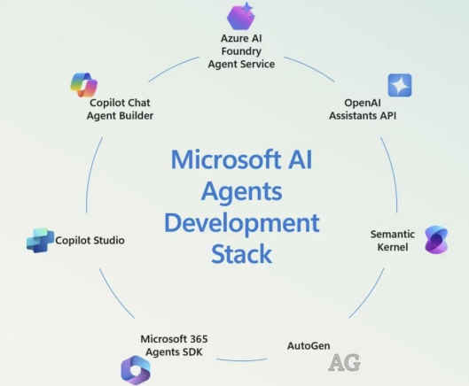

## 1. AI Agent

### 인공지능의 새로운 지평
- 인공지능 분야는 빠르게 발전하고 있으며, **AI 에이전트**가 핵심적인 혁신 기술로 부상하면서 인간과 컴퓨터의 상호작용 및 자동화 영역을 새롭게 정의할 것으로 기대

  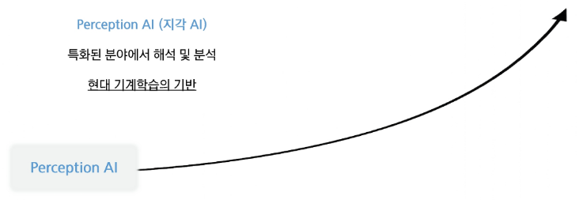

  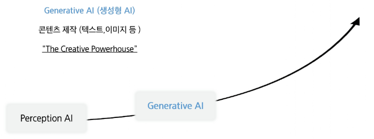

  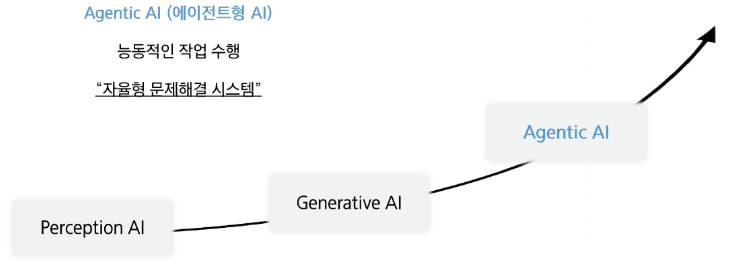

  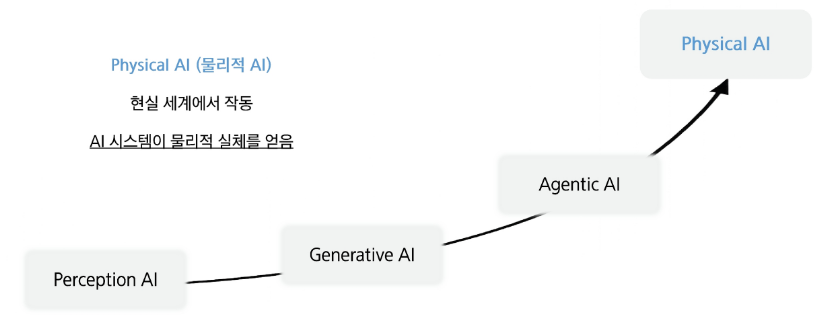

### 생성형 AI에서 에이전트형 AI로
- 생성형 AI(예: LLM, VLM 및 MLLM)가 크게 발전하는 가운데, 더욱 복잡한 환경에서 이러한 모델들을 적용하려는 시도가 증가하고 있음

  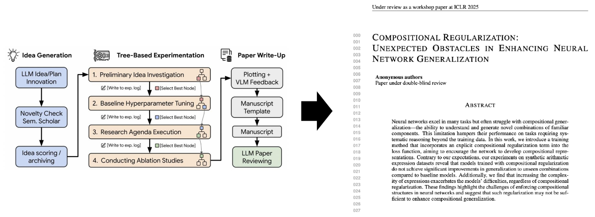

### 지금은 AI 에이전트의 시대

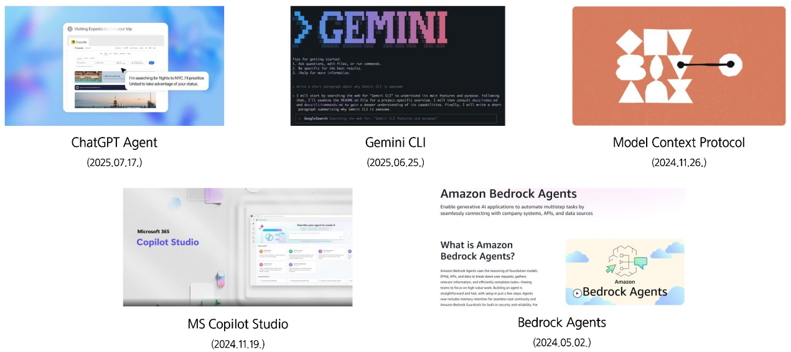

### 에이전트란?
- **에이전트**: 다른 사람 또는 단체를 대신하여 행동하는 개인 또는 단체
- 에이전트는 특정 작업을 수행하고 결정을 내리며, 합의를 도출하는 것을 목표로 함

  

  - **작업**: 옷을 세탁하기
  - **의사 결정**: 사전에 정의된 세척 순서
  - **상황 인식**: 세탁이 필요한 상태

### AI 에이전트?
- AI 에이전트: **AI를 사용**하여 **사용자를 대신해 목표를 추구하고 작업을 수행**하는 소프트웨어 시스템

  

  - **작업**: 옷을 세탁하기
  - **의사 결정**: AI가 세탁 방식을 결정
  - **상황 인식**: 세탁이 필요한 상태

### AI vs AI 에이전트
- 우리는 실제로 AI와 AI 에이전트를 명확하게 구별하지 않음
- 특히 현대 대규모 언어모델(LLM) 관점에서 AI를 바라볼 때, 그 경계는 더욱 모호함

### AI 에이전트의 주요 특성

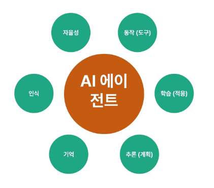

- 아래 예제에 대해 생각해보자

  

  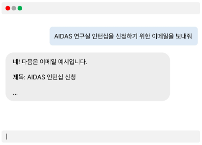

  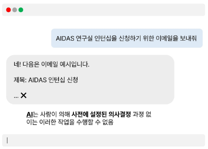

  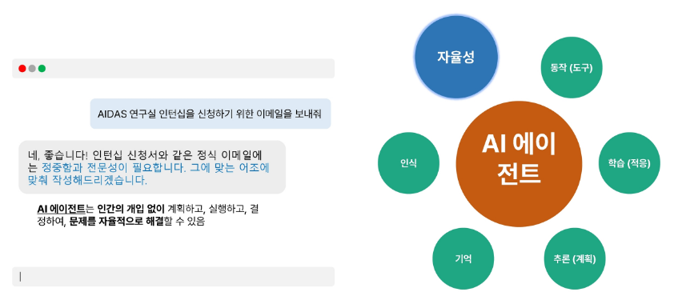

  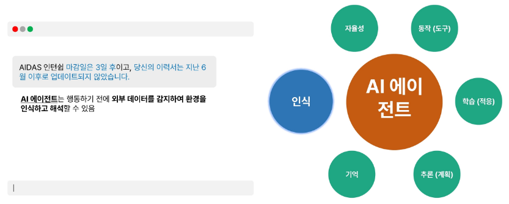

  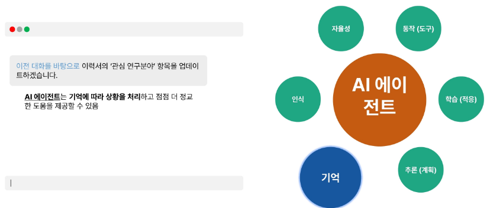

  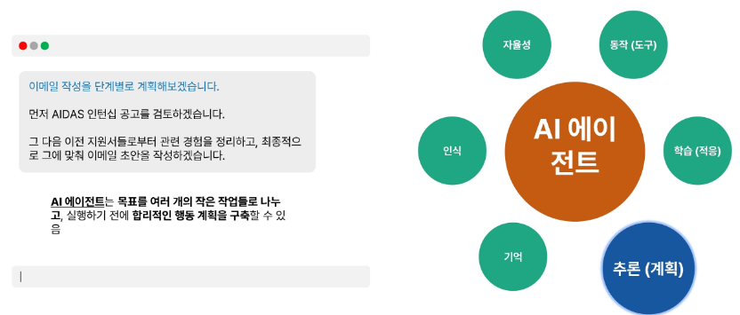

  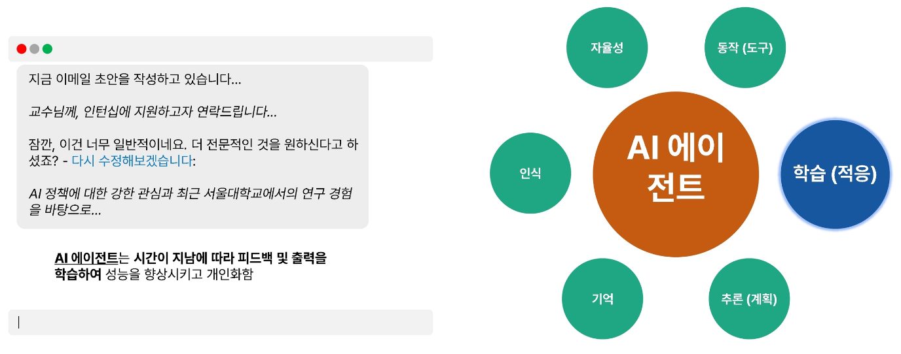

  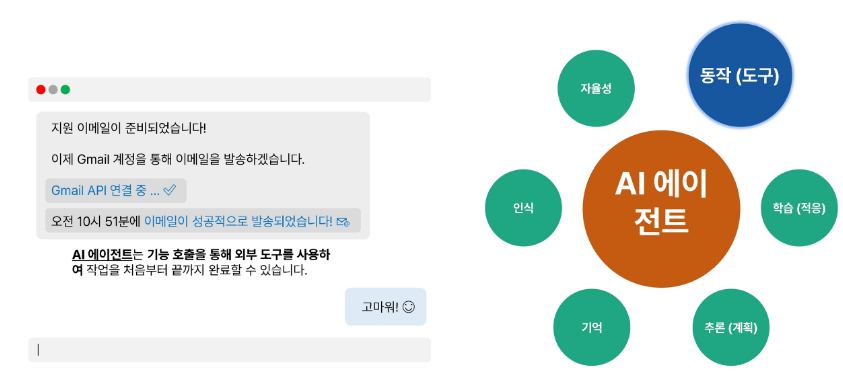

### Challenges in AI Agent
- 학술 연구 영역
  - 다중 에이전트 협업 시스템
  - 메모리와 컨텍스트 관리
  - 작업 관리
  - 확장성과 성능
- 실무 응용 영역
  - 보안 및 개인정보 문제
  - 자율성의 고위험 요소
  - 추론 비용과 실시간 협업
  - 윤리적 문제와 편향성에 대한 우려

# 2. Multi-Agent System

## 0. 학습 시작(Overview)

### 대규모 언어 모델의 한계는 무엇일까?
- 환각 현상, 느린 추론 등 LLM의 본질적 한계

### 다중 에이전트 시스템 구성
- 다중 에이전트 시스템의 주요 구성 요소와 다중 에이전트 시스템 문제 정의

### 에이전트 협업 전략
- 협업 유형 및 전략과 커뮤니케이션 구조

## 1. Multi Agent System

### 대규모 언어 모델(LLM)
- 대규모 언어 모델의 최신 성과
  - 창의적 글쓰기, 논리적 사고, 판단 능력
  - 인간 수준에 필적하는 성능
- 개별 LLM의 본질적 한계
  - **환각 현상**: 부정확하거나 조작된 정보 생성
  - **자기회귀적 성격**: 천천히 생각하거나 신중한 추론을 할 수 없음
  - **스케일링 법칙**: 모델 크기 증가에 따른 성능 향상 둔화

### 왜 다중 에이전트 시스템이 필요한가?
- **집단 지성**
- 지능형 에이전트들이 팀을 이뤄 협력하고 지식을 나누며, 함께 문제를 해결하는 능력에 초점을 맞춤(**수평적 확장**)
- 인간 사회는 일상 업무부터 과학 연구까지 팀워크와 역할 분담을 통해 공통 목표를 달성하는데 탁월
- 다중 에이전트 시스템도 이와 같은 원리를 적용하여, AI 에이전트들이 서로의 장점과 시각을 결합해 효율적으로 협업하도록 함 
-> 개별 에이전트들의 능력의 총합을 뛰어넘는 진정한 집단 지성을 실현하고자 함

### LLM 기반 다중 에이전트 협업 시스템의 질의응답 활용 예시

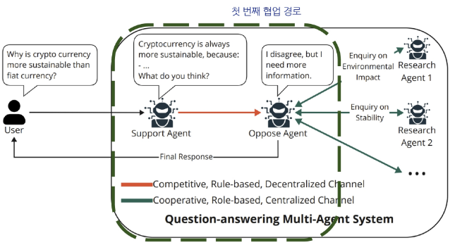

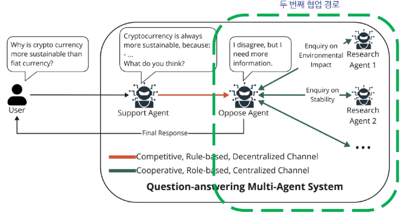

### LLM 기반 Multi Agent System
- LLM 기반 다중 에이전트 시스템 협업 요소와 메커니즘
  - 협업 유형, 전략, 소통 및 조직 구조
- 시사점 및 남은 문제들
  - 집단적 추론, 의사결정 등 다중 에이전트 시스템의 발전과정에서 아직 해결해야할 문제들이 존재

### 다중 에이전트 시스템의 주요 구성 요소
- 에이전트
  - 역할, 능력, 행동, 지식 모델을 가진 핵심 행위자들
- 환경
  - 에이전트가 존재하고 인식 및 행동할 수 있는 외부 세계
- 상호작용
  - 표준화된 통신 언어를 사용한 에이전트 간 소통
- 조직
  - 에이전트들은 계층 구조로 관리되거나 자발적인 행동으로 조직

## 2. 방법론: 협업 유형

### 협업 유형

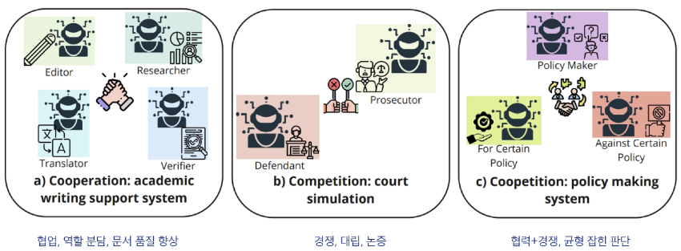

### 협력
- 에이전트들은 각자의 개별 목표를 공동의 집단 목표와 일치시켜, 상호 이익이 되는 결과를 달성하기 위해 협력
- 에이전트들은 각자의 전문 분야 내에서 특정 세부 작업에 집중하도록 활용할 수도 있음
- 에이전트 간 빈번한 통신과 다중 협업 채널은 계산 비용과 복잡성 증가를 초래할 수 있음
- 개별 에이전트의 신뢰성과 성능에 크게 좌우되어, 한 개 이상의 에이전트의 오류가 시스템 전체에 부정적 영향을 미칠 수 있음 
(e.g., 무한 대화 루프, 환각 현상 증폭)

### 다중 에이전트 협업에 따른 반복 의사결정 과정

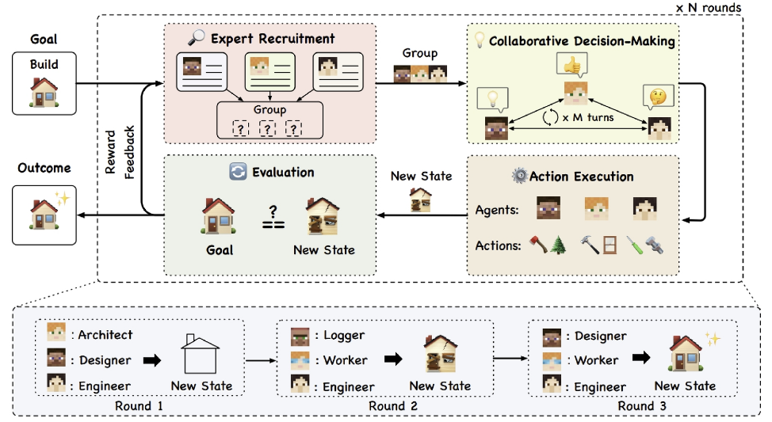

### 협업 예시: 의학 영상 판돈

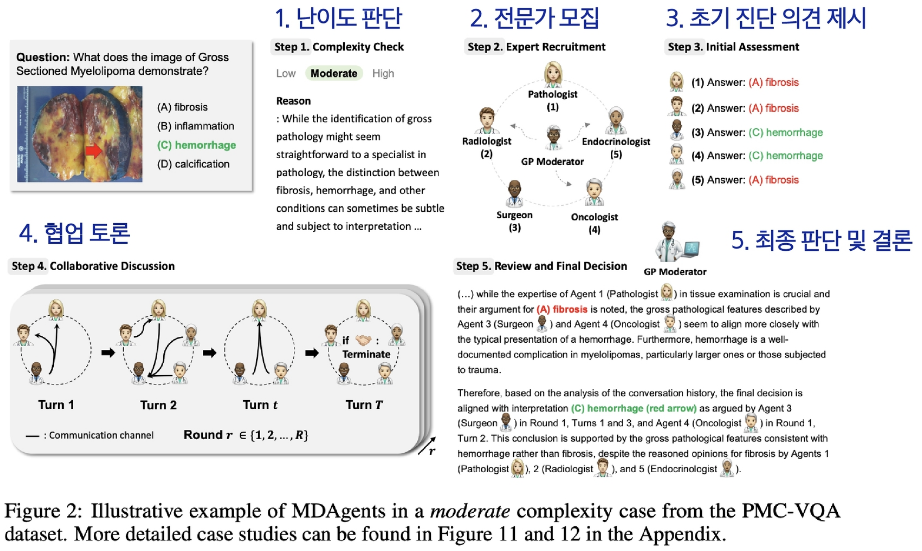

### 경쟁
- 에이전트들은 각자의 개별 목표를 우선시하며, 이는 다른 에이전트들의 목표와 충돌하거나 대립할 수 있는 경쟁 요소를 도입
- 에이전트들이 고도의 추론 능력과 더 창의적인 문제해결 방법을 개발하도록 촉진
- 각 에이전트의 능력의 한계를 시험함으로써 시스템의 적응성을 강화
- 경쟁적 협업 경로는 강력한 프롬프트를 가진 단일 에이전트에 의해 따라잡힐 수 있음
- 끝나지 않는 논쟁

### 경쟁(게임)을 통한 AI 실험 예시

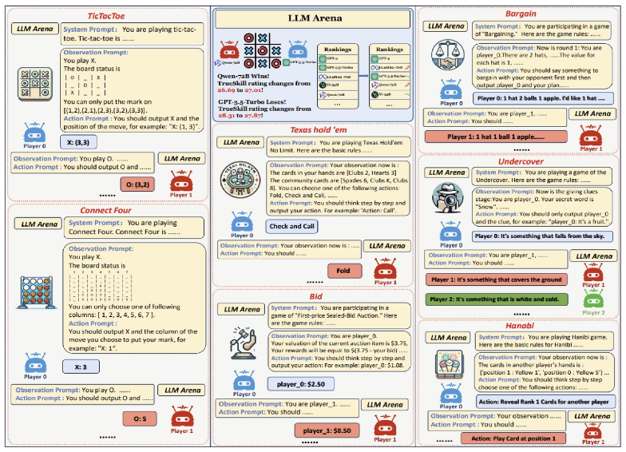

### 협력과 경쟁의 조합
- 협력과 경쟁의 전략적 조합
  - 에이전트들이 공동 목표 달성을 위해 특정 작업에서는 협력하면서 동시에 다른 작업에서는 경쟁할 수 있도록 함
- 전문가 혼합 모델(Mixture-of-Experts)
  - 다양한 전문가 모델들이 최종 결과물에 기여하려고 경쟁하고, 게이트 시스템이 각 입력에 맞는 최적의 전문가를 골라냄
  - 전문가들 사이의 협력 및 경쟁적 관계는 모델 학습 과정에서 먼저 형성되며, 이 때  각자가 데이터의 서로 다른 측면에 대해 전문화하도록 훈련

## 3. 방법론: 협업 전략

### 규칙 기반 프로토콜
- 사전에 정의된 규칙
  - 에이전트 간 상호작용은 미리 정의된 규칙에 의해 엄격히 통제
- 인간의 협력 방식 모방
  - 동료 검토에서 영감을 받은 협업 메커니즘은 사전 정의된 규칙을 사용하여 에이전트들이 서로의 출력을 비판하고, 수정하며 개선할 수 있도록 함
  - 규칙 기반 전략은 시스템 동작과 특정 규칙을 쉽게 연결할 수 있으므로 구현과 디버깅을 용이하게 함
  - 합의 도출, 경로 찾기와 같이 절차가 명확히 정의되고 변동성이 적은 작업에 특히 효율적

### 역할 기반 프로토콜
- 사전에 정의된 역할
  - 세분화된 목표 하에서 각 에이전트가 고유한 역할 분담이나 업무 분할을 통해 작동하도록 함
- 주로 도메인 지식에 기반
  - 각 에이전트에 특정 책임을 할당하여 인간과 유사한 협업을 시뮬레이션하고, 역할 준수를 통해 일치성 강화
  - 각 에이전트의 역할은 전문가 수준의 지식으로 정의되어, 에이전트는 서로의 결과를 검증할 수 있는 전문가의 역할을 할 수 있음
  - 개별 모듈의 재활용 가능성

### AI 에이전트가 협업을 통해 자동 개발하는 과정

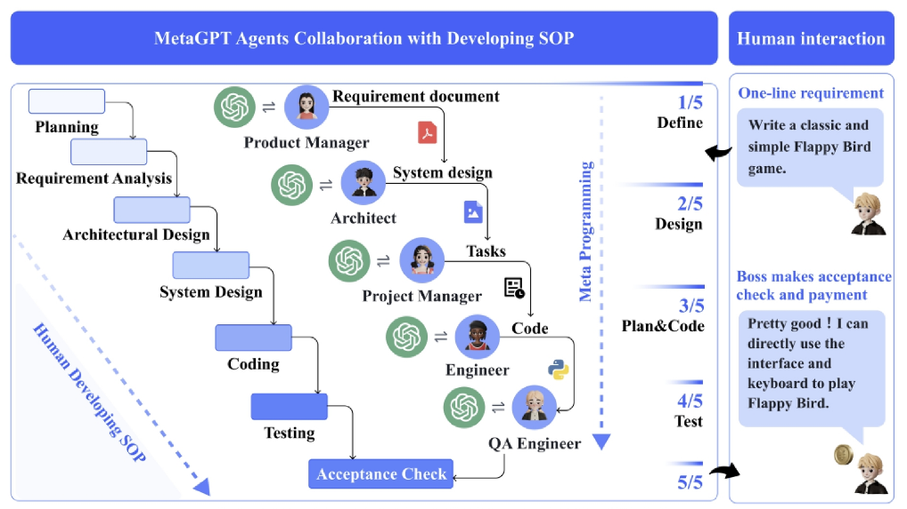

## 4. 방법론: 커뮤니케이션 구조

### 중앙집중형 구조
- 참여자-서비스 제공자 구조
  - 서비스 에이전트는 시스템 안에서 참여자들 사이의 소통이나 협력을 관리, 제어, 조율하는 역할을 담당
- 중앙 에이전트
  - LLM-블렌더는 한 라운드에서 서로 다른 LLM들을 호출하고, 두 개씩 비교하여 순위를 책정한 후, 최상위 응답들을 결합
  - 판사 에이전트(토론), 최종 의사결정을 위한 의사(MDT 프로세스)

### 탈중앙화 구조
- 에이전트에 대한 통제 및 의사결정 분산
  - 각 에이전트는 에이전트와의 제한적인 통신과 일부의 정보를 바탕으로 작동하므로, 상호작용과 의사결정을 위한 정교한 알고리즘이 필요
  - 에이전트들이 분산형으로 서로 직접 소통하는 방식으로 작동
  - 일부 에이전트가 실패해도 시스템이 계속 기능할 수 있음
  - 높은 확장성을 제공하며, 에이전트들이 자율적으로 작동하고 시스템 변화에 적응할 수 있음

### 다중 에이전트 시스템에 대한 우려의 시사점
- 확장성 고려사항
  - 성능 저하 없이 더 큰 에이전트 네트워크를 처리하기 위해서는 확장 가능한 아키텍처와 알고리즘 구현이 필수적
- 최적 협업 전략
  - 효과적인 협업을 위해서는 작업 요구사항에 맞는 최적의 협업 전략을 선택하는 것이 주요
- 적응 가능한 역할 및 협업 경로 할당
  - 적응가능성은 시스템이 변화하는 환경과 목표에 효과적으로 대응할 수 있도록 함

# 3. Memory & Tool in Multi Agent System

## 0. 학습 시작(Overview)

### LLM의 고정 지식 한계를 어떻게 극복할 수 있을까?
- 검색증강생성과 에이전트형 RAG를 통한 정확성을 가진 응답 생성

### 에이전트가 도구를 사용하는 기준
- 행동 정책 및 강화학습 훈련을 통한 적절한 도구 선택

### 에이전트와 도구 간의 상호작용 방법은 무엇일까?
- MCP 및 A2A 프로토콜을 통한 협업

## 1. Memory & Tool in Multi Agent System

### 패러다임의 전환: 언어 모델에서 에이전트 시스템으로
- AI는 전통적인 대규모 언어 모델(LLM)에서, 독립적 사고와 행동을 할 수 있는 자율적인 "AI 에이전트"의 새로운 패러다임으로 발전하고 있음
- 고정된 매개변수 메모리에 제한을 받는 수동적인 LLM과 달리, AI 에이전트는 실시간 정보에 접근하고, 외부 도구를 활용하며 물리적 또는 디지털 세계와 상호작용하고, 정적인 훈련 데이터를 넘어서서 적응할 수 있음
- AI 에이전트는 환경을 인지하고, 계획을 수립하며 특정 목표 달성을 위해 구체적인 행동을 실행할 수 있는 능동적 개체

  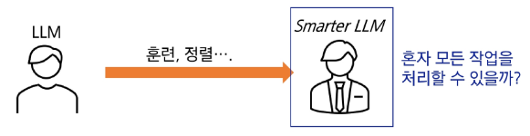

  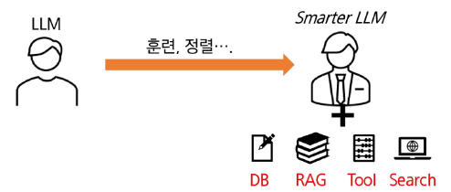

- 기억/지식
  - 학습 데이터 범위를 넘어서는 광범위하고 변화하는 외부 정보를 활용 및 분석하는 능력
  - 핵심 질문: 에이전트가 최신 정보를 어떻게 습득하는가? (RAG, 메모리)
- 행동/능동성
  - 외부 환경과 소통하고 변화를 일으키는 능력
  - 핵심 질문: 에이전트가 구체적인 업무를 어떻게 완수하는가? (도구 호출)
- 학습/적용
  - 축적된 경험을 바탕으로 기억과 행동 방식을 발전시키는 능력
  - 핵심 질문: 에이전트들이, 특히 공동 작업 시, 어떻게 지능을 향상시키는가? (멀티 에이전트 학습)

### 패러다임 전환의 예시

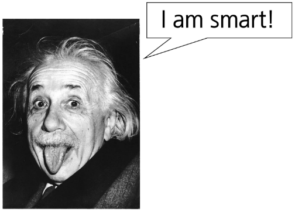

### 메모리 & 도구
- LLM 내장 매개변수 메모리의 한계
  - 낡은 지식: 학습 시점에 지식이 고정되어 최신 정보를 반영할 수 없음
  - 환각 현상: 그럴듯하지만 잘못된 내용을 생성하는 경향
  - 사적 정보 접근 불가: 기업 내부 정보나 개인화된 정보를 검색할 수 없음 
  -> 이런 제약들로 인해 실제 핵심 업무에서 LLM을 믿고 사용하기 어려움

### 검색 증강 생성(Retrieval-Augmented Generation, RAG)
- 핵심 아이디어: LLM이 답변을 생성하기 전에 신뢰할 수 있는 외부 소스(예: DB, 최신 웹 문서)에서 관련 정보를 검색하고 해당 정보를 바탕으로 응답을 구성
- 장점: LLM의 자연스러운 표현력과 외부 지식의 정확성, 시의성, 검증 가능성을 결합하여 더욱 신뢰할 수 있고 근거가 확실한 답변을 생성

### 검색 증강 생성(RAG) 기본 파이프 라인

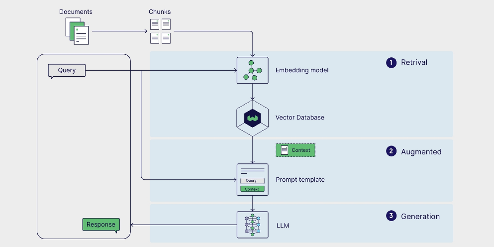

### 일반적 검색 증강 생성(RAG)의 한계점
- 단순한 RAG 구조는 외부 지식 소스를 하나만 사용하지만, 때로는 두 개의 외부 지식 소스가 필요하거나 웹 검색과 같은 외부 툴과 API가 요구되는 경우도 존재
- 일회성 방식으로서 정보를 딱 한 번만 가져오기 때문에 가져온 정보의 품질에 대한 검토나 확인 과정이 없음
- 기존의 선형 RAG 방식은 간단한 질의응답에는 효과적이지만, 상태 정보를 저장하지 않는다는 특성 때문에 여러 단계의 추론이나 복합적인 탐구에는 한계가 존재
- "기억하지 못 하는 검색 엔진"과 같아 맥락을 유지하거나 제대로 된 조사 작업을 수행할 수 없음

  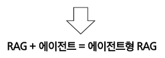

### 에이전트형 RAG란?
- AI 에이전트가 RAG 파이프라인을 향상시켜 각 단계들을 조율하고 단순한 검색/생성을 넘어서는 역할을 하도록 함
- 주로 벡터 검색, 웹 검색, 계산기, API 등의 도구를 사용하는 방식으로 정보 검색에 적용
- 에이전트가 할 수 있는 일: 검색 여부 결정, 도구 선택, 쿼리 생성, 결과 평가/재검색

### AI 에이전트의 주요 구성 요소
- LLM(특정 역할과 작업을 담당)
- 메모리(단기 기억 및 장기 기억)
- 계획(예: 자기 성찰, 자기 비판, 쿼리 분배 등)
- 도구(예: 계산기, 웹 검색 등)

### AI 시스템 속의 에이전트

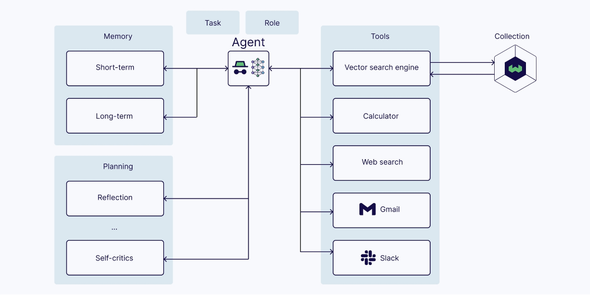

### 단일 에이전트형 RAG(Router)

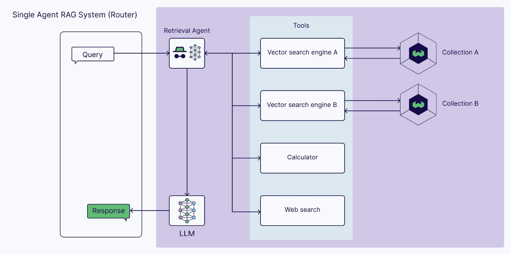

### 멀티 에이전트형 RAG 시스템

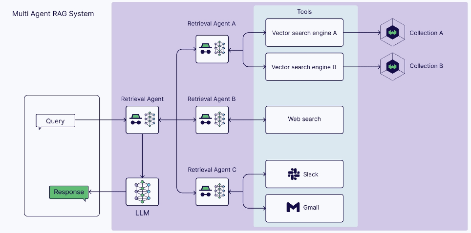

### 멀티 에이전트 시스템을 위한 훈련 방법

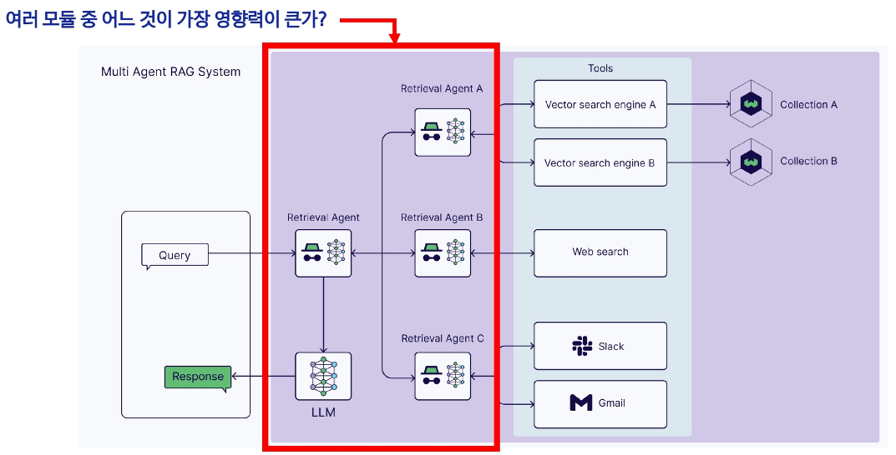

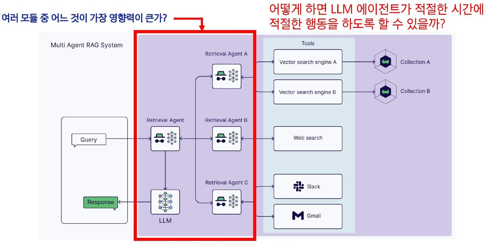

- 딜레마: 언제, 무엇을 어떻게?
  - 언제: 매개변수 기반 지식으로 답할지 도구를 호출할지 결정 (trade-off: 비용/지연시간 vs. 정확성)
  - 무엇을: 적절한 도구 선책 (예: 계산기, 웹 검색, DB 쿼리)
  - 어떻게: 선택한 도구의 API에 올바른 인수 전달 
  => **해석: 반환된 결과 또는 오류를 분석하고 다음 행동을 결정**
- 이러한 의사결정 단계들이 모여서 에이전트의 **행동 정책(policy)** 을 형성하며, 이는 강화학습을 통해 효과적으로 학습될 수 있음
- Toolformer: 언어모델이 스스로 도구 사용법을 학습
  - 목표: 생성 과정에서 언어모델이 언제, 어떻게 외부 도구(예: 계산기, 검색 엔진, 번역 API)를 사용할지 스스로 결정할 수 있도록 함
  - 핵심 아이디어: 자기 지도 학습, 모델이 인간의 주석 없이 자신이 생성한 API 호출 예시로부터 학습
  - 학습방법
    - 소규모 API 호출 데모 세트로 시작
    - 언어모델이 새로운 맥락에 API 호출 삽입
    - 호출 실행, 응답 검색, 유용성에 따른 필터링, 언어모델 미세조정

      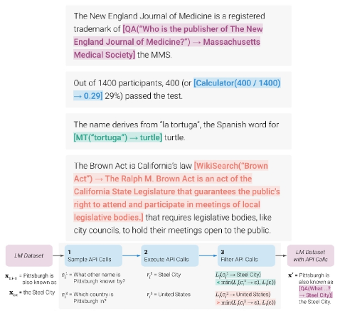

- Gorilla: LLM을 대규모 API와 연결
  - 목표: LLM이 대규모 실제 API 세트를 안정적으로 호출하고 사용할 수 있도록 하여 정확도와 근거, 기능을 향상
  - 접근 방식
    - APIBench 데이터셋으로 LLAMA 및 GPT와 같은 모델 미세조정
      - APIBench: API 문서의 대규모 데이터 세트, 사용법 예제 및 도구 호출 패턴
    - API 호출 생성 전 관련 API 문서를 불러오는 검색 증강 미세조정(RAFT) 사용
  - 주요 기능
    - 정확한 서식으로 수십만 개의 API를 처리
    - 문서 검색 + 지도 미세 조정(SFT)을 통해 "환각" API 호출 감소

      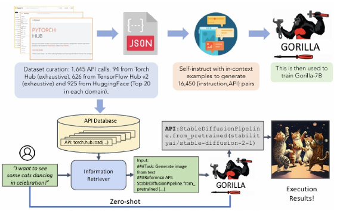

- ReTool: LLM의 전략적 도구 사용을 위한 강화학습
  - 목표: 외부 도구(예: 코드 인터프리터)를 사용하는 시점, 도구 선택, 방법을 학습시켜 복잡하고 계산 집약적인 작업에서의 LLM 추론 능력을 향상
  - 접근 방식(2단계 훈련 방식)
    - 선별된 코드로 증강된 추론 흔적을 활용한 콜드 스타트 SFT
    - PPO를 통한 강화학습 + 실시간 코드 실행 및 피드백
  - 주요 기능: 결과 기반 보상을 통해 도구 호출 타이밍, 도구 선택, 코드 개선, 자기 수정을 학습

    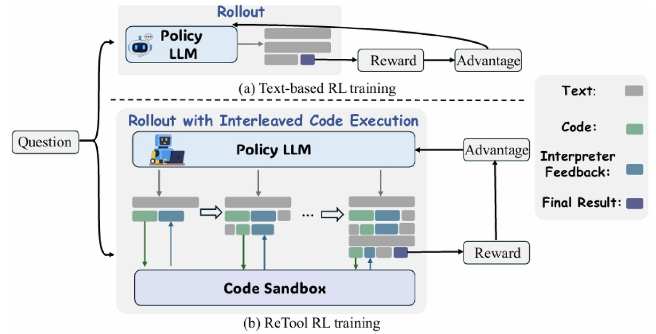

- Search-R1: LLM을 사용한 더 나은 웹 검색을 위한 강화 학습
  - 목표: LLM 에이전트가 자율적으로 다단계 웹 검색을 수행하여 답변의 정확성과 관련도를 개선하도록 함
  - 접근  
    - 검색 증강 LLM 에이전트를 훈련시켜 언제, 어떻게 검색할지 결정하고, 질의를 구성하며, 관련 결과를 선택하고, 이를 최종 답변에 통합하도록 함
    - 사람에 의한 피드백에 대한 선호를 활용한 온라인 강화학습으로 검색 전략을 개선
    - 에이전트는 도구 사용(검색 vs 검색 안 함), 질의 구성, 반복 개선에 대한 정책(policy) 학습
  - 강화학습 기법: 그룹 상대 정책 최적화(GRPO)를 기반
    - GRPO: PPO에서 발전된 강화학습 방법으로 각 업데이트에서 여러 실행 결과들을 비교하여 더 나은 검색 기반 결과에 보상을 제공

      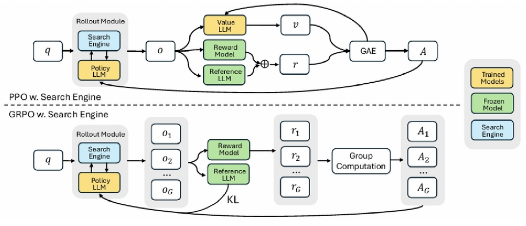

### 모델 컨텍스트 프로토콜(MCP)
- 정의
  - MCP는 AI 모델이 외부 도구, 리소스, 환경과 원활하게 상호작용할 수 있도록 하는 표준화된 인터페이스로, "AI 기능의 USB-C"와 같은 역할
- 왜 중요한가?
  - MCP가 없다면 M개의 AI 애플리케이션을 N개의 도구에 연결하기 위해 M x N 개의 개별적인 통합이 필요
  - MCP는 연결을 표준화하여 이를 M + N 개로 단순화

    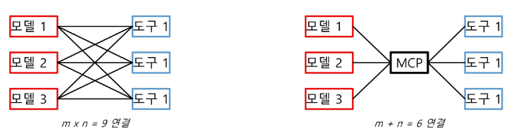

- 아키텍쳐 개요
  - 호스트: AI 애플리케이션 환경(예: 채팅 앱, IDE)
  - 클라이언트: 호스트와 MCP 서버 간 통신 처리
  - 서버: 표준 형식으로 도구, 리소스, 프롬프트 제공
- 핵심 기능
  - 도구: 실행 가능한 작업(예: 쿼리 실행, 날씨 정보 가져오기)
  - 리소스: 읽기 전용 데이터 소스(예: 문서, DB)
  - 프롬프트: AI 행동을 지도하는 사전 정의된 템플릿 또는 워크플로
- 효과
  - 연결 작업의 복잡함 해소
  - 도구와 자료의 재활용성 증대
  - 여러 도구를 활용하는 유연한 AI 에이전트 개발 촉진

    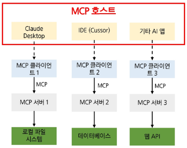

### Agent2Agent 프로토콜
- 목표
  - 여러 AI 에이전트가 내부 메모리, 사고, 도구를 직접 공유하지 않고 맥락, 작업 업데이트, 지시사항, 데이터만 교환하여 협업할 수 있도록 함
- MCP와의 관계
  - **MCP**: 에이전트를 외부 도구에 연결
  - **A2A**: **에이전트 간 협업** 지원
- 핵심 개념
  - **에이전트 서버**: 개별 에이전트를 호스팅
  - **클라이언트 에이전트**: 여러 에이전트 서버로 연결
  - **라우터**: 쿼리를 적절한 에이전트로 전달

    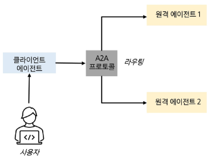

# 4. Reasoning and Planning in AI Agent

## 0. 학습 시작(Overview)

### 대규모 언어 모델(LLM)의 추론 능력(Reasoning)
- 복잡한 문제 해결을 가능하게 하는 LLM의 추론 구조
- Chain-of-Thought, Few-shot / Zero-shot Prompting

### LLM 에이전트의 계획 수립(Planning)
- Self-consistency, Tree of Thoughts로 확장되는 사고
- ReAct / HuggingGPT / Reflexion / Plan-and-Act 구조

### 추론 시간 연산량 최적화 및 효율적 추론 접근법
- 연산량 증가와 성능 향상의 상관관계리플렉션
- 추론 전용 모델(Inference-time Model)과 효율화 연구

## 1. 대규모 언어 모델(LLM)의 추론 능력(Reasoning)

### 추론 능력이 있는 대규모 언어 모델
- 대규모 언어 모델은 논리 퍼즐, 수학적 문제, 코딩과 같은 복잡한 작업을 해결할 수 있음

  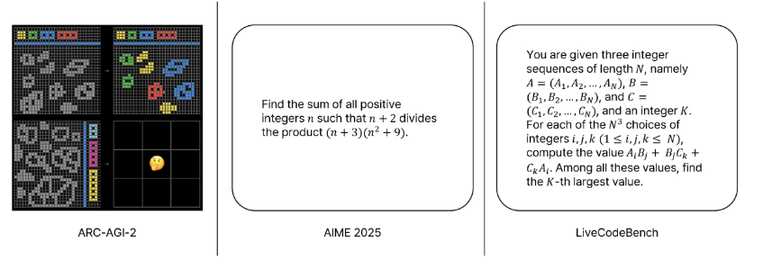

- 이러한 질문에 답하기 위해 LLM은 단계별 사고 과정, 즉 "추론"을 수행할 수 있어야 함

  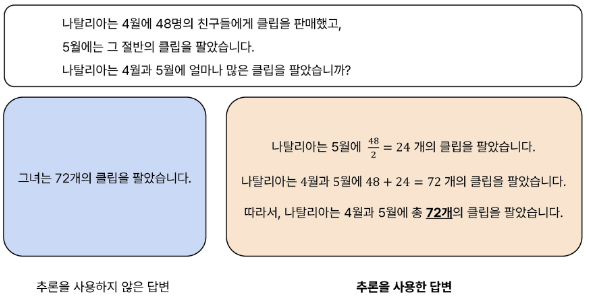

### 대규모 언어 모델의 추론 유도
- 프롬프트만으로도 추론 능력을 이끌어낼 수 있음
  1. Few-shot prompting(Chain-of-Thought Prompting)

    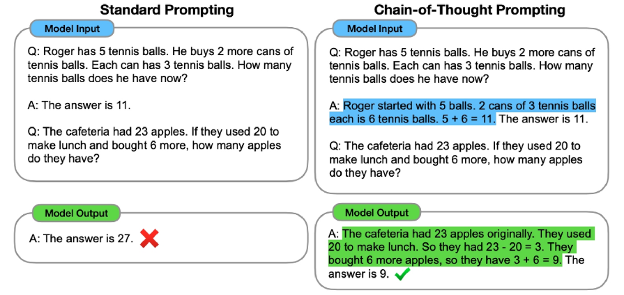

  2. Zero-shot prompting("Let's think step by step")

    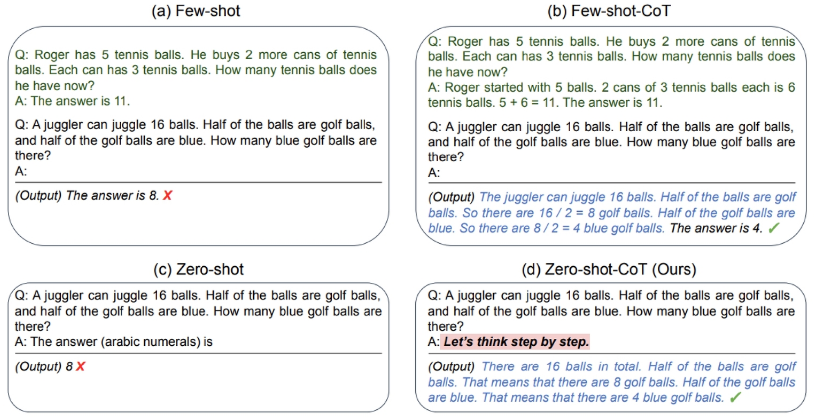

### 대규모 언어 모델의 추론 능력 강화
- 자기 일관성: 다양한 추론 과정을 생성하고 그 중 가장 일관성있는 답변을 고르는 디코딩 방식

  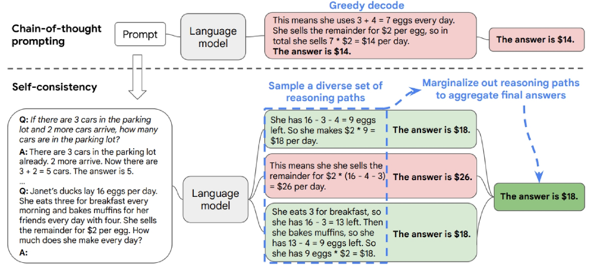

- Tree of Thoughts: 너비 우선 탐색(BFS) 또는 깊이 우선 탐색(DFS) 방식으로 다양한 생각을 생성하고 평가

  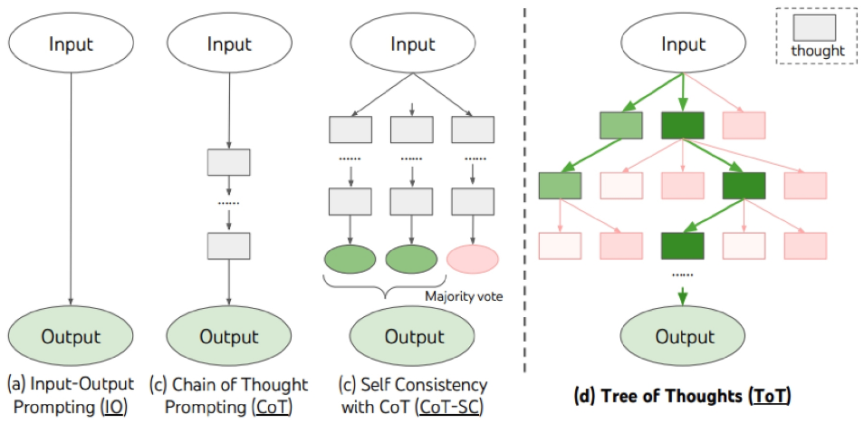

  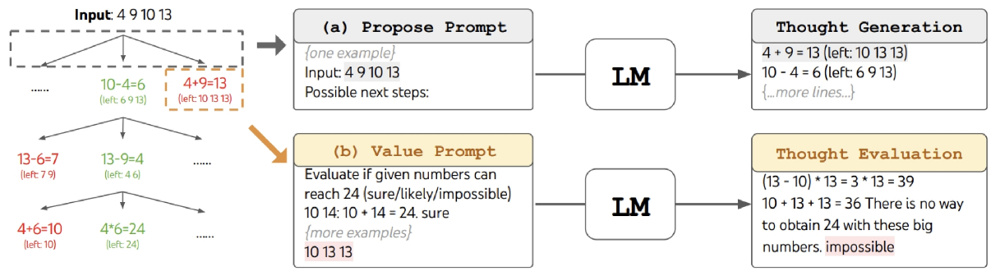

## 2. LLM 에이전트의 계획 수립(Planning)

### LLM 에이전트의 Planning
- LLM은 여러 사고 단계를 생성할 수 있음. 즉, 목표 달성을 위한 하위 목표들의 순서를 구성할 수 있음
- 행동(실행) 명령을 통합하면 LLM이 결과를 되돌아보면서 도구를 사용하거나 행동할 수 있음

### LLM 에이전트의 Planning 개요
- ReAct: 추론만 하거나 행동만 하는 것이 아니라 '생각'과 '행동'을 함께 생성하는 방식

  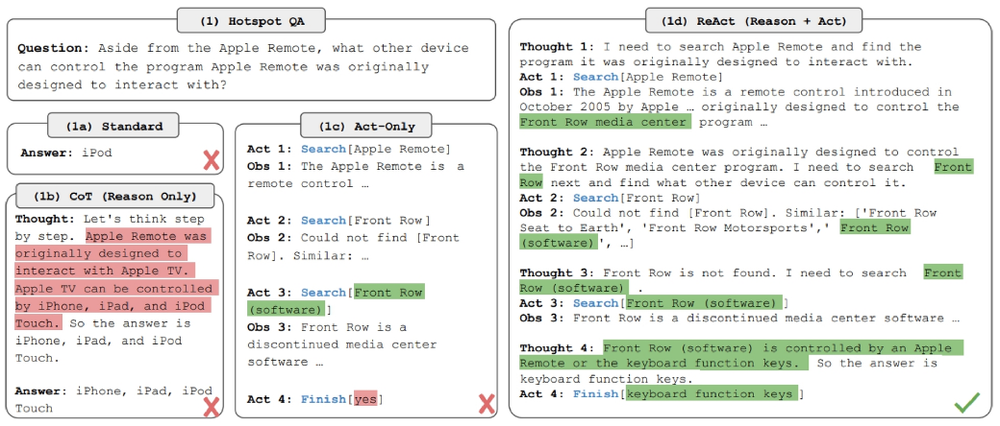

- HuggingGPT: 계획 수립을 담당하는 LLM이 복잡한 작업을 나누어 각각의 전문 모델들에게 분배하는 시스템

  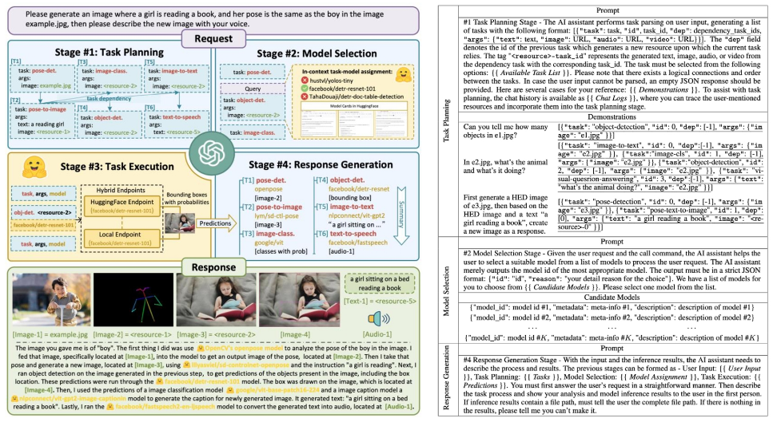

### LLM 에이전트의 Planning 능력 강화
- Plan-and-Act: **계획 에이전트**는 거시적인 계획을 생성, **실행 에이전트**는 해당 계획에 따라 하위 단계를 실행

  

## 3. 추론 시간 연산량 최적화 및 효율적 추론 접근법

### 추론 시간의 연산량 증대
- 추론 시에 컴퓨팅 자원을 더 많이 투입할 수록 LLM의 성능이 향상됨
- 이는 난이도가 낮은 작업에서 모델 매개 변수를 늘리는 것보다 더욱 효과적일 수 있음

  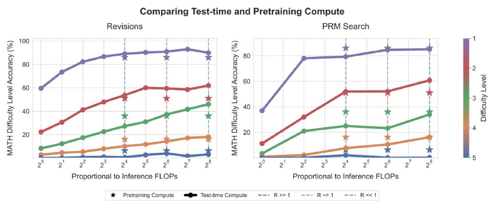

- 스케일링의 법칙도 적용됨

  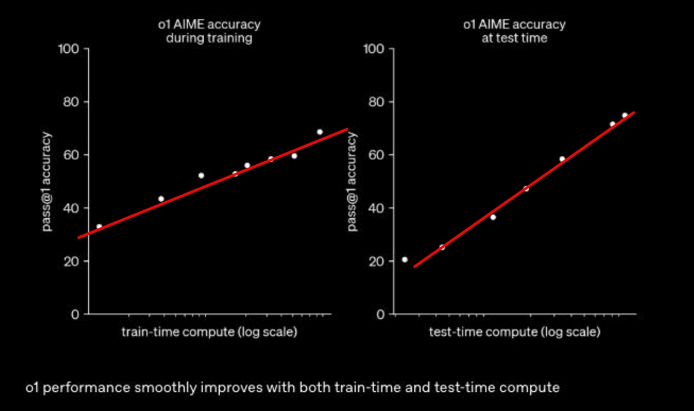

### 추론 모델
- 추론을 위한 추가 컴퓨팅 자원이 할당된 추론 모델이 등장하기 시작

  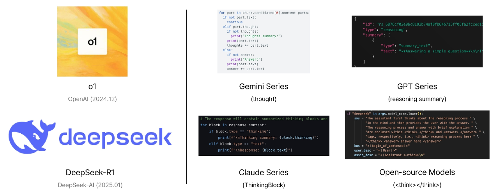

### 추론 모델 강화
- 정확성과 올바른 형식에 대해서만 보상을 제공함으로써 LLM이 chain-of-thought을 사용하는 방법을 학습하게 함
  - 예: "...\<think> reasoning process here \</think> \<answer> answer here \</answer>"

    

    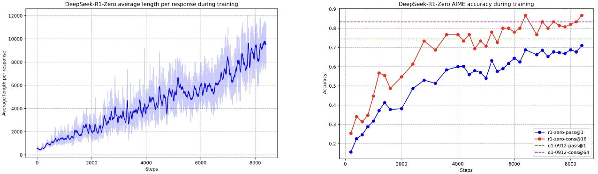

### 효율적인 추론
- 과도한 사고 현상
- 더 긴 CoT 추론 과정은 실제로 성능을 향상시키지만, 장황하고 중복되는 출력으로 인해 계산 부담이 크게 늘어나는 것은 여전한 문제
- 분류

  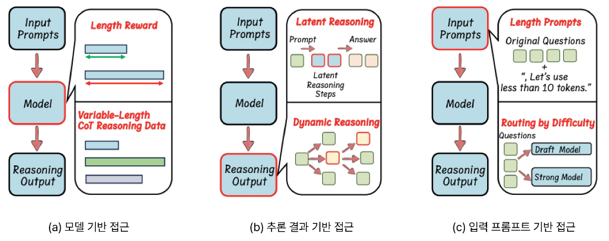

- **모델 기반 접근(가변 길이)**
- **DeGRPO**: 첫 번째로 생성된 토큰(제어 토큰), \<short>, \<think> 으로 추론 길이를 제어하는 방식

  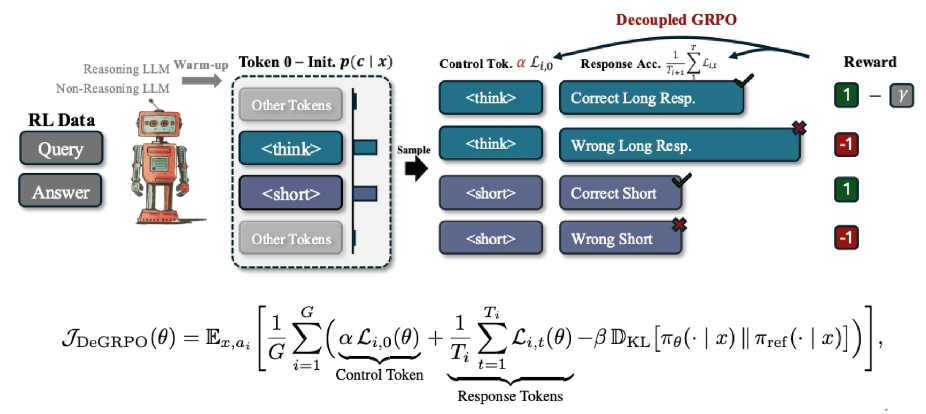

- **추론 결과 기반 접근(동적 추론)**
- **InftyThink**: 일부 추론 과정을 만들어내고, 지금까지의 생각을 요약하는 방식

  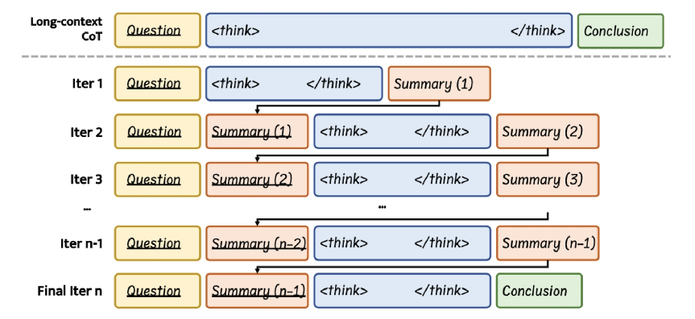

- **입력 프롬프트 기반 접근(라우팅)**
- 쉬운 질문에는 연산량을 적게, 복잡한 질문에는 연산량을 많이 배정하는 방식

  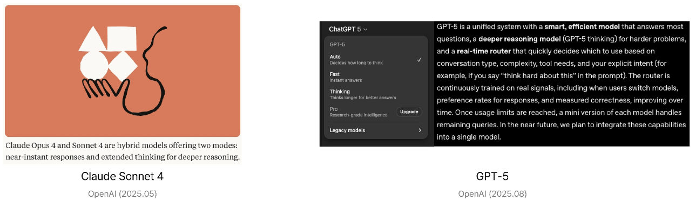

# 5. Domain-Specific AI Agent

## 0. 학습 시작(Overview)

### Deep Research의 배경: 왜 에이전트가 필요한가?
- 기존 LLM, RAG 접근의 한계와 패러다임의 전환

### 에이전트 기반 심층 연구
- 생각 -> 검색 -> 탐색 -> 답변의 순환 구조
- ReAct, Toolformer, GRPO 등 핵심 메커니즘

### 멀티에이전트 시스템 구조
- 리드/하위 에이전트의 협력
- 자동 피드백 루프와 효율적 정보 탐색

### 평가 및 발전 방향
- 강화학습 성능 분석, 한계점, 그리고 미래의 AI Agent

## 1. Deep Research의 배경

### 패러다임의 전환
- 웹 검색

  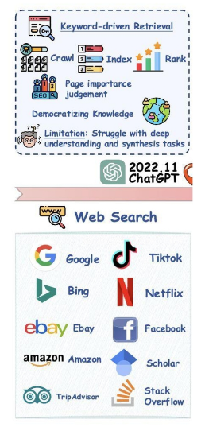

- LLM 챗봇

  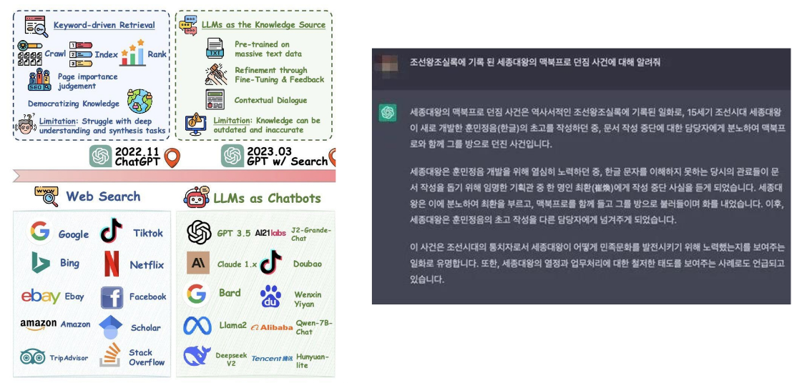

- 검색 증강 생성(RAG)

  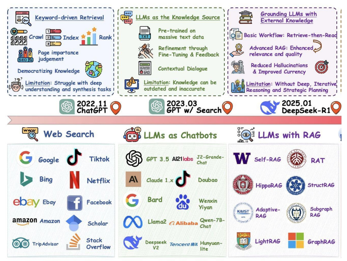

- 에이전트 기반 심층 연구

  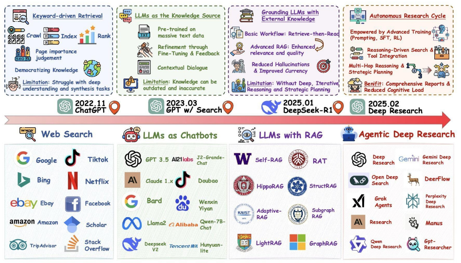

## 2. 에이전트 기반 심층 연구

### 핵심 개념
- LLM은 다단계 **추론과 검색을 결합**
- **동적 피드백 루프**를 형성: 검색 결과에 대해 추론하고, 이 추론은 이후 검색 과정을 조정
- 간단한 응답 생성기가 아니라, 능동적인 정보 탐색 에이전트 역할
- 필요한 경우, 문서를 읽고 쿼리를 반복적으로 생성하고 수정하여 **다른 도구나 에이전트와 협력**

### 역동적인 환경에서의 어려움과 해결방안
- 검색과 추론의 결합에는 어려움이 존재
  - 기존 RAG 파이프라인은 검색한 다음 추론하는 고정된 순서를 사용 -> **오류 축적**
  - **에이전트 기반 접근법은 추론이 언제, 무엇을 검색할지 결정**하도록 하여 오류 전파를 줄일 수 있음
- 적응력 한계
  - 프롬프트와 지도 학습에 대한 의존으로 인해 새로운 환경에 대한 **유연한 전략**을 개발하기가 어려움
  - 시행 착오를 통해 최적의 전략을 배우려면 강화 학습이 필요
- 효율적인 리소스 할당
  - 검색과 추론 둘 다 토큰과 시간을 소비
  - 작업 유형에 따라 **검색/추론 리소스 비율을 동적으로 조절**하는 기술이 필요

### 강화학습 기반 훈련 및 보상 설계
- 프롬프트
  - 예: ReAct - 추론 + 행동 구조를 사용하여 프로세스를 검색 및 추론 단계로 분할
- 지도학습
  - 예: Toolformer - 모델은 훈련 데이터의 패턴을 기반으로 도구를 사용하는 법을 학습
- 강화학습
  - 목표: 모델이 독립적으로 최적의 검색 및 추론 전략을 발견하도록 유도
  - 예: R1-Searcher, DeepResearcher - 복잡한 작업을 세분화하고, 쿼리 시퀀스를 계획하고, 정보를 검증하고 전략을 조정

### Test-Time Scaling(TTS)
- 정의: 추론/검색 단계 수를 늘리면 성능 향상으로 이어짐(TTS 법칙)
- 추론 TTS: 추가적인 추론 단계(CoT, Self-Refinement, Self-Consistency 등) 도입 -> 정확도 향상
  - 예: 수학적 증명
- 검색 TTS: 반복적, 다단계 검색 -> 정보 수집 범위 확장
  - 예: 문헌 리뷰, 지식 그래프 구축
- Trade-off
  - 검색과 추론 둘 다 자원을 소모 -> 각 작업 유형에 맞는 **최적 비율의 조정**이 필수

### 방법론 - 문제 해결 과정
- 생각 -> 도구 사용 -> 생각 -> ... -> 답변 사이클 반복
  - <생각> 단계에서 세부 목표를 세우고 검색할 내용을 결정함
  - <검색> 에이전트가 검색 API를 사용해서 상위 k개 결과(제목, 주소, 요약문)를 가져옴

    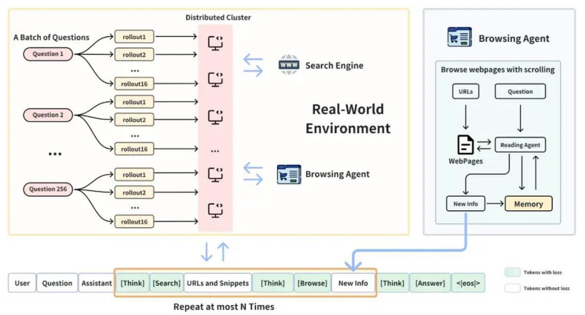

  - <탐색> 에이전트가 웹페이지 내용을 읽고 유용한 정보를 단기 저장소에 모아둠
  - 읽는 과정에서 에이전트는 (a) 계속 읽을 건지 아니면 그만둘 건지, (b) 어떤 내용을 저장할 건지 판단
  - 해당 페이지가 별로 도움이 안 된다 싶으면 빠르게 다른 URL로 이동
  - 필요한 정보를 충분히 모았다면, <답변> 단계에서 최종 결론을 생성

### 역동적인 환경에서의 어려움과 해결방안
- 많은 요청 동시 처리
  - 한 번에 최대 4,096개 도구 호출이 발생 가능
  - 처리 지연을 막고 빠른 속도를 유지하기 위해 50개 노드의 분산 CPU 시스템에서 작업을 나누어 처리
- 웹 크롤링 및 API 제약
  - 크롤링 방지 시스템과 요청 제한으로 인한 실패 가능성
  - 재시도 메커니즘과 캐시를 사용하여 호출 빈도와 비용 감소
- 정보 추출 효율성 문제
  - 웹페이지를 작은 단위로 나눠서 하나씩 차례로 분석
  - 별로 중요하지 않다고 판단되면 바로 포기하고 핵심 페이지에 컴퓨팅 자원을 집중

### 강화학습 훈련 프레임워크 및 보상
- 알고리즘: GRPO(Group Relative PPO)
  - 이전 정책(π_old)을 사용한 여러 그룹의 실행 결과를 기준으로 삼음
  - 새로운 정책(policy)이 이 결과들의 발생 확률을 높이는 정도에 따라 PPO 방식으로 업데이트
- 보상 설계
  - 형식 오류: -1 패널티
  - 올바른 형식: 단어 레벨의 F1 점수(0-1)를 부여
  - 사실에 대한 정확도, 논리적 일관성 등에 대한 복합적인 보상을 도입할 수 있음

### 성능 분석
- In-domain(NQ, TQ, Hotpotqa, 2wiki) 및 Out-of-Domain(Musique, Bamboogle, Popqa) 벤치 마크에서 SOTA 결과를 달성
- 특히 Bamboogle에서는 이전 웹 검색 기반 모델을 크게 압도 -> 실제 웹 환경에서의 학습 효과

  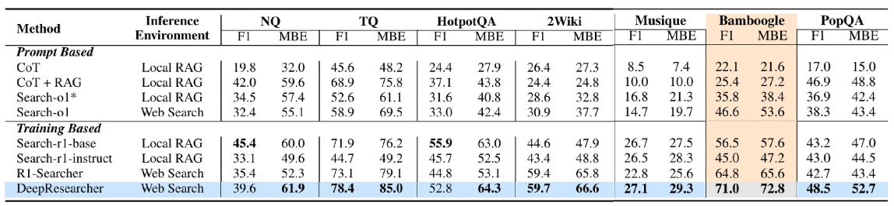

### 창발적 행동
- 계획 능력: end-to-end 강화학습만으로 다단계 계획 능력 개발
- 교차 검증: 첫 번째 결과에만 의존하지 않고, 추가적인 확인을 수행

  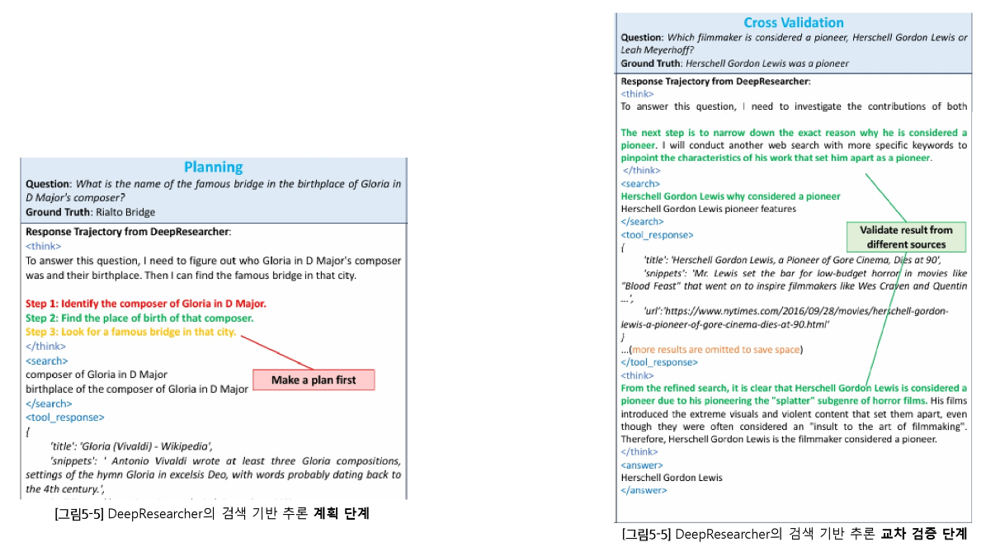

- 성찰적 재검색: 검색 결과가 불만족스러우면 검색 방향성을 조절
- 솔직한 회피: 확실하지 않은 경우 추측하기보다는 알지 못 한다고 답변

  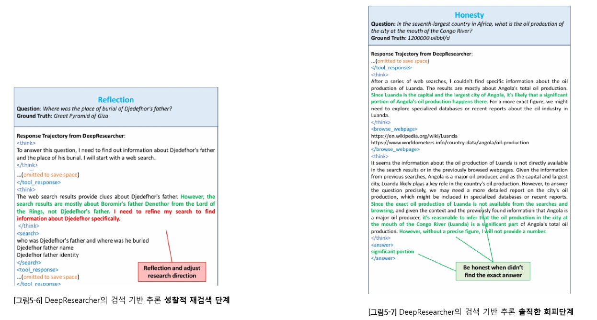

## 4. 평가 및 발전 방향

### 한계점 및 고려사항
- 높은 비용(토큰)
  - 단일 에이전트는 표준 질의응답보다 4배 더 많은 토큰을 사용; 멀티 에이전트는 15배 더 많이 사용
  - 고부가가치 작업에서만 비용-효율적임
- 범용성의 한계
  - 병렬 작업들로 분할될 수 있는 작업에서만 효과적
  - 코딩, 디버깅 등 순차적인 단일 컨텍스트 처리가 필요한 작업에는 적합하지 않음
- 에이전트 관리의 복잡성
  - 너무 많은 숫자의 에이전트가 생성되거나, 무한 루프 또는 에이전트 간 간섭 위험
  - 명확한 정지 조건 및 프롬프트 가이드 라인과 같은 보호 조치 필요
- 상태 관리 및 오류 전파
  - 작은 오류가 프로세스의 전체 방향을 왜곡시킬 수 있음
  - 체크 포인트 설정 및 복구를 위한 메커니즘 필요
- 평가 및 디버깅의 어려움
  - 실행 경로와 답변은 매 실행마다 다르므로 공평한 평가가 어려움
  - LLM 평가 점수(0-1 스케일)와 사람에 의한 평가를 함께 사용하여 평가

### 미해결 문제 및 발전 방향
- 인간 중심의 상호 작용
  - AI를 자율적인 연구원이 아니라 강력한 조력자로 포지셔닝
  - 중간 사고 과정을 보여주고 설명 -> 투명성 보장 및 신뢰성 향상
  - 사용자 피드백을 통해 지속적인 개인화
- 전문 분야 에이전트
  - 의학, 법, 생물학 등과 같은 분야에 대한 분야별 지식과 추론 구조를 결합
  - 도메인 별 데이터셋 및 평가 프레임워크 개발
  - 범용적인 에이전트와 전문적인 에이전트의 하이브리드를 운영
- 효율적인 TTS 구현
  - 더욱 효율적인 추론: 중요한 부분에 대해서만 깊이 추론하고, 적절하게 더 작은 모델을 사용
  - 더욱 효율적인 검색: 인덱싱 최적화, 비생산적 검색 조기 중단, 우선 순위가 낮은 경로 제거
