# 0. 학습 시작(오버뷰)

### AI 모델의 연산을 모두 양자화하면 모델 크기가 줄어드는 것 외에 어떤 장점이 있을까?

### AI 모델의 값들이 모두 양자화 되었음에도 불구하고, 연산과정을 양자화할 때 추가로 필요한 작업은 무엇일까?

### 연산과정의 양자화를 위한 대표적 기법(실수 파트만 모으기, 비트쉬프팅)은 어떻게 작동할까?

### 산업 현장 사례 - 쿠키 공장에서 도입한 엣지 AI 시스템
- 불량 쿠키 검출
- 요구사항
  - 밀가루, 먼지 손상 방지를 위한 팬리스(fanless), 소형 폼팩터의 낮은 성능 하드웨어에서 구동
  - 최대 쿠키 생산 속도에 따라잡을 수 있는 실시간 추론
  - 생산 환경에 맞추어 입력 데이터를 활용해 모델 추가학습

    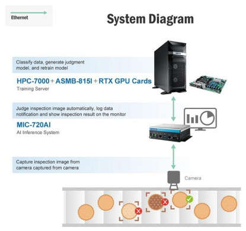

# 1. 100% 정수연산 양자화의 필요성

## 1. AI 가속기의 구동 특성

### AI 가속기는 정수 연산만 지원하거나, 정수 연산에서 훨씬 효율적으로 동작함
- Google Coral Edge TPU
  - 완전 8비트 정수 모델만 실행. 미지원 연산은 CPU로 보냄
- ARM Ethos-U NPU 시리즈(U55/U65/U85)
  - 8비트, 16비트 정수 모델 실행. 미지원 연산은 CPU로 보냄

## 2. 일반 양자화와 100% 정수연산 양자화의 차이

### 일반적 양자화: r 이라는 실수 값을 q 라는 정수로 표현하고 싶다!
- 무한한 실수를 모두 나타내는 것은 불가능하니 **유한한 관심 범위**를 지정: [r_min, r_max]

  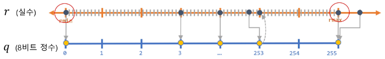

- 8비트 정수 [0, 255]로 [r_min, r_max] 범위의 실수를 표현하려면 2가지 파라미터가 필요
  - 스케일링 파라미터 S(실수)
  - 오프셋 파라미터 Z(정수)

    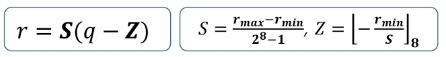

- 문제는 **스케일링 파라미터가 실수**라는 것!
  - 양자화 후, 정수 q만 사용해서 연산할 것 같지만 실제로는 실수 값 r 에 매핑하기 위해 숨어있는 스케일링 파라미터 S가 개입하여 실수 연산이 필요함(**AI 가속기 구동 불가**)

# 2. 정수연산 양자화

## 1. 행렬 곱 연산 양자화

### 실수 행렬 r_3 = r_1 * r_2(r_α ∈ R ** (N x N)) 의 연산 과정을 양자화 관점에서 유도
- 목표: 스케일링 파라미터를 정수화 하여 q_3 ** (i, k) 를 정수 연산으로 유도
- 주어진 상황: r_1, r_2, r_3 는 각자 자신의 양자화 Scheme를 가짐
  - r_1 는 (S_1, Z_1) 를 사용해 q_1 ** (i, j) 으로 양자화 됨
  - r_2 는 (S_2, Z_2) 를 사용해 q_2 ** (i, j) 으로 양자화 됨
  - r_3 는 (S_3, Z_3) 를 사용해 q_3 ** (i, j) 으로 양자화 됨
- q_3 ** (i, k) 를 표현하기 위한 식 전개

  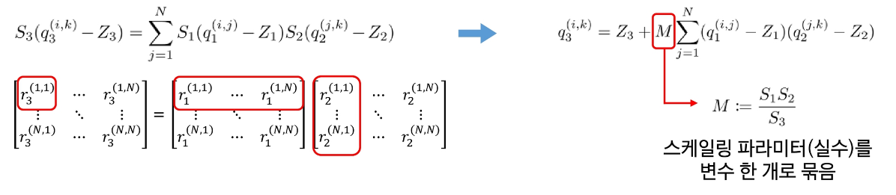

### 비트 쉬프팅(Bit Shifting)
- 스케일링 파라미터(실수)를 뭉쳐서 M으로 나타냈으므로, M을 별도로 미리 양자화시키면 실수 연산 전멸!
  - 문제점: M이 실제로는 (0, 1) 사이의 값이므로, 정수로 나타내기 어려움
  - 해결책: **비트 쉬프팅**
- 비트 쉬프팅 과정: 임시로 스케일 업 -> 양자화 및 연산 -> 스케일 다운

  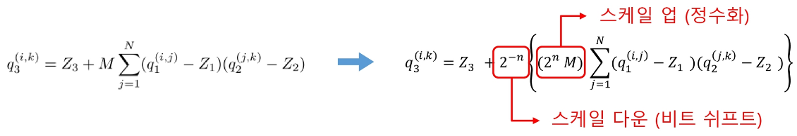

## 2. 배치 정규화 계층 폴딩

### 배치 정규화(Batch Normalization)란?
- 학습 중 정규화를 통해 입력 분포의 변화를 줄여 안정적인 학습을 돕는 기법

  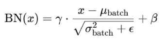

- BN 계층에서도 실수 연산이 필요
- 그러나 BN 계층에서 별도로 양자화를 진행하면 비효율적
- 그래서 폴딩 기법을 사용

  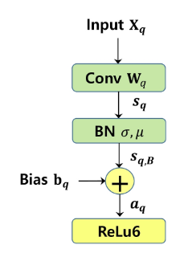

### 배치 정규화 계층 폴딩
- BN 폴딩: BN 연산을 바로 얖의 Conv 계층 연산에 통합해서 함께 양자화

  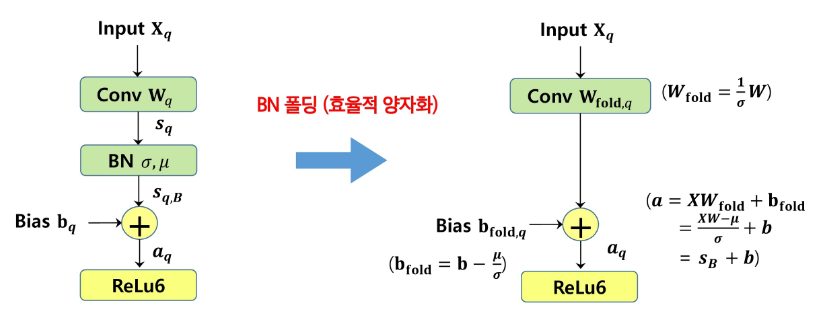

## 3. 비전 트랜스포머 연산 양자화

### 행렬 곱과 배치 정규화 폴딩 외에 추가적 연산 정수화가 필요함
- SoftMax
  - Exponential 연산을 양자화해야함
  - log(e -> 2)를 정수로 근사, 베이스 변환(e 에서 2로)
  - 정수 파트와 소수 파트를 분리한 뒤, 소수 파트만 정수로 근사

    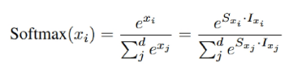

- GELU
  - 상수 1.702와 sigmoid 함수를 사용하여 근사 가능
  - 1.702를 비트 쉬프팅을 통해 근사하고, sigmoid 함수는 SoftMax 양자화 방식을 그대로 차용

    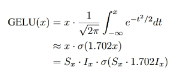

- LayerNorm
  - 표준편차: 분산의 루트 연산
  - 루트 연산을 정수화하기 위해 비트 쉬프팅과 반복적 탐색을 통한 근사값 도출

    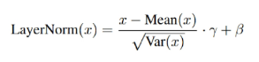

---
# 0. 학습 시작(오버뷰)

### 테스트 데이터 분포에 적응하는 것은 어떤 어려움이 있을까?

### 테스트 데이터 레이블이 없는 상황에서 어떤 로스를 통해 도메인 적응을 할 수 있을까?

### 로스 없이도 테스트 데이터 분포에 적응할 수 있을까?

# 1. 분포 이동과 테스트타임 도메인 적응(TTA)

### 분포 이동(Distribution Shift)
- AI가 실제 쓰이는 순간, 학습 데이터에서 경험하지 못 했던 **낯선 데이터**에 맞닥뜨리는 현상
- AI 성능 하락의 주요 원인

  

- 학습할 때는 깨끗한 데이터로 훈련되었지만, 실제 환경에서는 노이즈 등으로 데이터 분포가 달라져 정확도가 떨어짐

  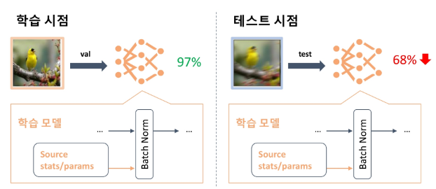

### 테스트타임 도메인 적응(Test-Time Adaption: TTA)
- AI가 실제 쓰이는 순간, **테스트 데이터의 분포를 파악**하여 모델을 유연하게 적응시킴
- 즉, 테스트 데이터를 입력받을 때 모델의 일부를 새 데이터의 통계에 맞게 재조정하여 성능을 유지하는 기법

  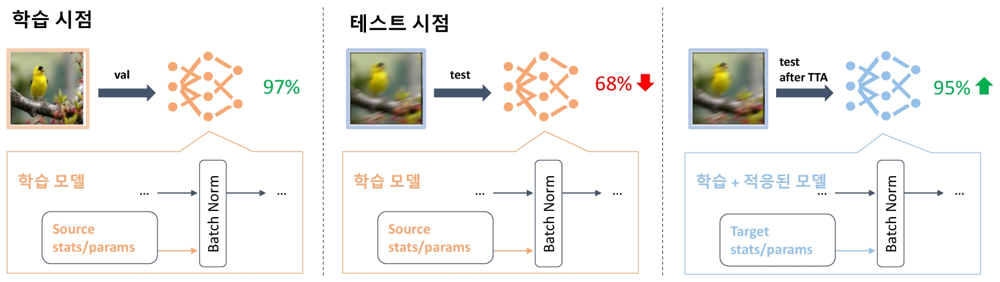

# 2. TTA 기법

## 1. CNN 기반 TTA 기법

### TENT: 배치 정규화 계층을 테스트 데이터에 최적화
- 평균 분산 업데이트
  - 테스트 데이터를 입력하면서 BatchNorm의 평균(μ)과 분산(σ ** 2)을 테스트 데이터 기준으로 재계산
  - 모델이 새로운 데이터 분포에 즉각 적응
- 어파인 파라미터 업데이트
  - 테스트 데이터의 엔트로피(불화실성)를 손실 함수로 설정
  - 역전파를 통해 γ(스케일), β(이동)값을 미세 조정
  - 예측의 확신도를 높이는 방향으로 적응

    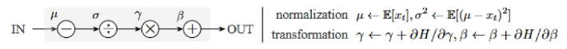

- 결과
  - 학습 재진행 없이, 테스트 데이터 분포에 맞게 모델을 즉시 최적화

### SAR: 최적화를 더욱 안정적으로!
- 관찰: 일부 테스트 데이터가 노이즈가 많거나 이상치라서 큰 gradient를 만들어 모델을 불안정하게 만듦
- 테스트 샘플 선택: 엔트로피(불확실성)가 낮은 테스트 샘플만 선택해 모델 업데이트에 설명
- 안정적 엔트로피 최소화: 엔트로피 손실이 너무 요동치지 않도록 평탄화(loss smoothing)
- 결과: TENT보다 학습이 안정적이고, 테스트 환경에서도 성능 유지

## 2. 비전언어모델 기반 TTA 기법

### TPT(Test-Time Prompt Tuning): 일관성 있는 예측을 돕자!
- 테스트 이미지마다 여러 증강(회전, 밝기 변화 등)을 생성
- 엔트로피가 가장 낮은 증강 이미지를 6개 선택
- 6개의 평균 **엔트로피를 로스**로 세팅하고 이를 최소화하도록 **텍스트 프롬프트** 업데이트

  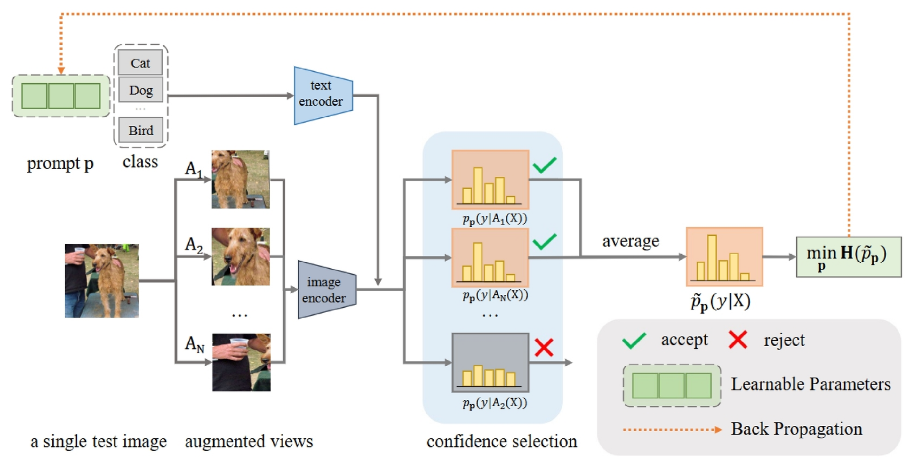

### PromptAlign: 학습 데이터와 테스트 데이터를 직접 정렬시키자!
- PromptAlign은 학습 데이터 통계까지 활용해 분포 정렬(distribution alignment)을 수행
- 학습 데이터와 테스트 데이터의 통계적 차이(평균, 분산)를 최소화하도록 설계
- 두 데이터의 인코딩 결과를 **계층별(feature later)로 정렬** 
-> **학습 시 얻은 feature 분포와 테스트 feature 분포를 정렬시키는 방식**

  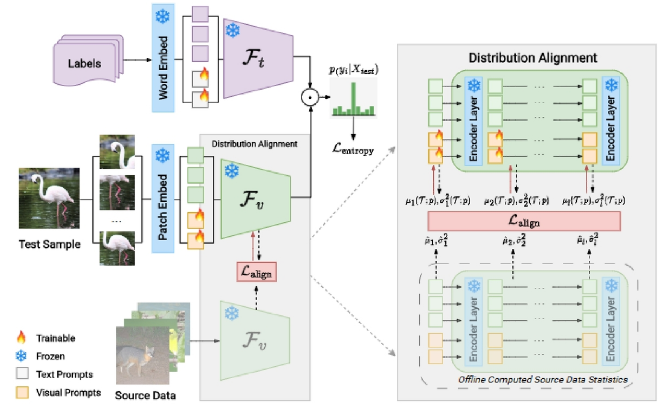

- 추가적으로 엔트로피 로스를 함께 사용하여 안정적인 예측 유지
- 최종적으로 **텍스트 프롬프트 + 이미지 프롬프트를 모두 업데이트**

  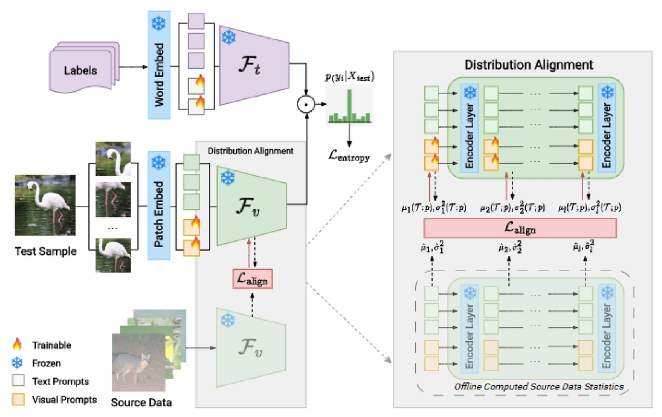

---
# 0. 학습 시작(오버뷰)

### 초거대 AI의 근본 원리와 한계점은 무엇일까?

### 현재 AI 학습방식과 인간인지체계의 차이점은 무엇일까?

### 적응적 센싱과 분포 이동 억제의 개념은 무엇일까?

# 1. 초거대 AI의 근본 원리와 한계

## 1. 스케일링의 법칙과 초거대 AI

### 초거대 AI
- 파라미터 규모가 매우 큰 인공지능 모델
  - 파라미터: AI 뇌세포 개수(파라미터가 많을 수록 똑똑함)
- 대량의 데이터를 학습하여 여러 작업을 수행
- 데이터가 많고, 모델이 클 수록 성능이 좋아짐(스케일링 법칙)
- 분포 이동의 문제 존재
- 분포 이동의 리스크를 줄이기 위해 **규모로 보험**을 들었음
  - 웹에서 <u>방대한 데이터</u>를 수집
  - 이 데이터를 추가 변형까지 시켜서 드문 경우도 흉내낼 수 있게 <u>증강</u>
  - 그 지식을 담을 <u>초거대 모델</u>을 설계
  - <u>고성능 대규모 컴퓨팅</u>으로 오래 학습

    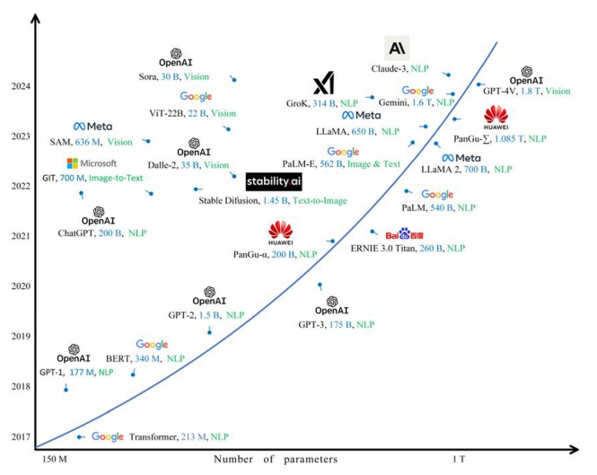

### 분포 이동(distribution shift)의 문제
- 분포 이동(Distribution shift): AI가 학습할 때 경험한 세상과, 실제로 쓰이는 순간의 세상이 달라지는 현상
- 이 때, AI는 낯선 문제에 맞닥뜨리고 성능이 떨어짐
- AI 성능 하락의 근본적 문제
  - 비유: 밤새 기출문제를 외웠는데, 정작 시험이 범위 밖에서 나온다면?
  - AI는 학습하지 못 한 상황(처음보는 상황)에 약함

    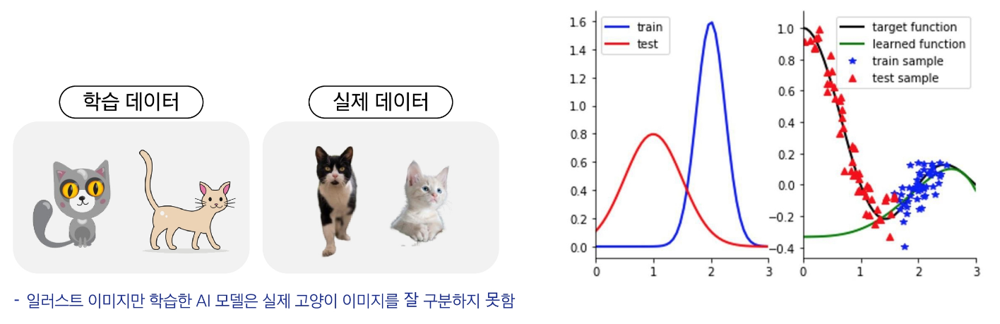

### 스케일링 법칙(Scaling Law)
- AI 모델의 성능이 **모델 크기(Parameters), 학습 데이터 양(Dataset Size)**, 그리고 **컴퓨팅 자원(Compute)**이 증가함에 따라 향상되는 현상
- 스케일링 법칙 덕분에 "데이터 더! 모델 더 크게!" 방식은 **예측 가능한 투자전략**이 됨
  - 모델 크기 ↑ + 학습 데이터 양 ↑ + 컴퓨터 자원 ↑ -> Test Loss ↓
  - Test Loss: AI 모델의 오류 정도(숫자가 낮을 수록 성능이 좋음)

    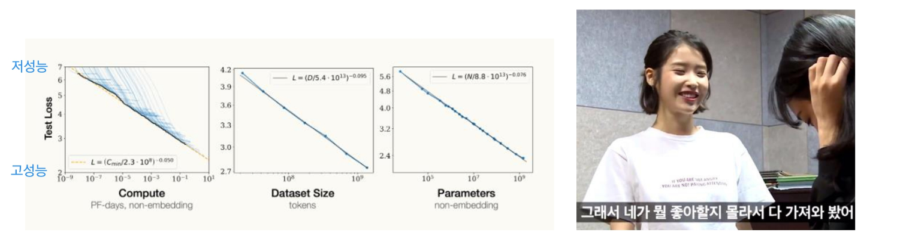

## 2. 스케일링 법칙의 한계

### 질문: 이 세상에서 일어날 수 있는 모든 경우의 수를 학습 데이터로 미리 준비하는 것이 가능할까?
- AI의 진화: 거대 언어모델, 비전언어모델에서 **피지컬 AI**로
  - 키보드로 입력받고 모니터로 보여주는 챗봇 수준을 넘어섬
  - 실제 물리 환경에서 (1) 다양한 센서를 통해 세상을 인지하고 (2) 계획하고 (3) 행동해서 세상에 영향을 주기도 하는 **현장을 사는 AI**

    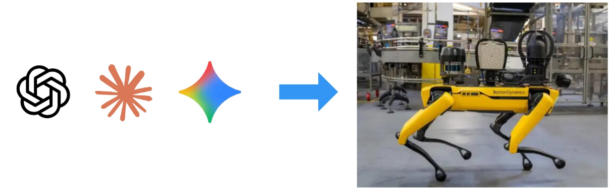

- 피지컬 AI에서 분포 이동 문제의 심화(폭발하는 경우의 수)
  - 환경 변수: 조도, 날씨, 재질 등
  - 로봇의 행동 변수: 시점, 거리, 모션 블러 등
- 보완책의 필요성
  - 초거대, 초초거대, 초초초거대 AI?
  - 심지어 기술적으로 가능하다고 하더라도 자본, 개인정보보호, 환경 등 현실의 다양한 부가적 문제 발생 
  -> 적응적 센싱이 필요함!

# 2. 적응적 센싱을 통한 분포 이동 억제

## 1. 발상의 전환: 인간의 인지체계

### AI 거대화 전략과 인간 인지체계의 괴리
- 초거대 AI의 발상: "모든 것은 공부/노력의 문제야!"
  - 예시 1) 수능 시험 날 안경을 두고 와서 문제가 잘 안 보였고, 시험을 망쳤다. 난 재수를 하면서 결심했다. 다음 시험 전까지 **흐릿한 글씨로 된 문제를 5000개** 정도 풀어야겠다. 그러면 실수로 안경을 놓고 와도 시험을 잘 볼 수 있을 거야!
  - 예시 2) 어젯밤에 헤드라이트를 끄고 운전하다가 앞이 잘 안 보여서 사고가 났다. 난 결심했다. 오늘부터 **어두운 사진 100만장으로 물체 식별하는 연습**을 해야지. 그럼 밤 중에도 사고가 나지 않을거야!
- 문제 제기: 이 문제 해결 방식이 상식적인가? 정작 사람은 이렇게 세상을 인지하고 있는가?
  - 흐리게 보이면, 안경을 맞춤
  - 눈이 부시면, 선글라스를 맞춤

    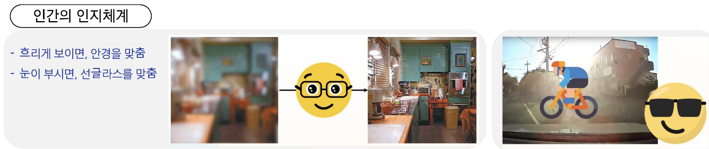

## 2. 적응적 센싱: AI를 위한 안경

### 적응적 센싱의 개념
- 사람의 인지체계와 AI의 호환성
  - 사람의 인지체계는 감각기관과 뇌의 복잡한 상호작용으로 이뤄짐
  - 피지컬 AI에는 **뇌는 모델, 센서는 감각기관**: 모델에 제공되는 데이터는 모두 센서가 물리 환경을 해석한 결과물
  - 뇌만 거대화하지 말고, 감각기관도 고도화 시키자! = 주어진 환경에서 센서 제어를 통해 AI 모델이 좋아하는 데이터를 제공하자!
- 적응적 센싱을 통한 분포 이동 억제(vs. 모델 일반화)
  - 빨간 영역: 모델이 학습해서 맞출 수 있는 영역
  - 모델 일반화: 모델 지식 영역을 확장함
  - 분포 이동 억제: 센서 제어를 통해 다양한 데이터를 모델이 아는 영역 안으로 넣어줌

    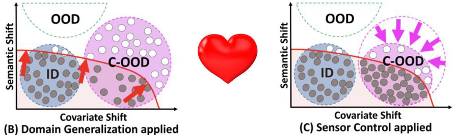

- 적응적 센싱: 환경에 맞춰서 센서(카메라)를 조절해서 좋은 데이터만 받음

  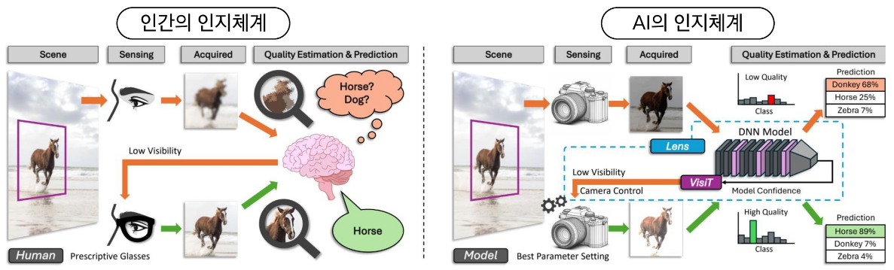

- 분포 이동 억제: 모델 일반화 vs 적응적 센싱
  - 분포 이동을 억제하는 방법은 모델일반화 방식과 적응적 센싱 방식이 있음
  - 빨간 영역: 모델이 학습해서 맞출 수 있는 영역
  - ID: 학습 데이터 영역(선명한 말 사진)
  - C-OOD: 학습 데이터와 의미는 같지만 외형이 다름(선명한 말 사진 vs 흐린 말 사진)
  - OOD: 완전히 본 적 없는 데이터(강아지)
- 모델 일반화: 모델 지식 영역을 확장하여 분포 이동 억제
  - 빨간 영역(모델이 학습해서 맞출 수 있는 영역)을 넓히는 전략
  - 모델 지식을 확장하여 빨간 영역을 넓힘
  - 선명한 말 이미지와 흐린 말 이미지 모두를 학습시킴
  - 추가 학습 비용이 높고 학습에 시간이 소요됨

    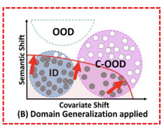

- 적응적 센싱: 센서 제어를 통해 다양한 데이터를 모델이 아는 영역 안으로 넣어줌으로써 분포 이동 억제
  - 센서를 통해 C-OOD 데이터를 빨간 영역 안으로 넣어줌
  - 모델이 맞출 수 있는 데이터가 많아짐
  - 이미지 선명도 조절을 통해 흐린 말 이미지를 선명한 말 이미지로 만듦
  - 기존 모델로도 센서 제어로 인식 가능하여 시간과 비용이 절감됨 -> 모델 일반화 방식보다 효율적

    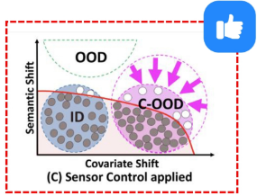

## 3. 적응적 센싱을 위한 데이터셋

### ImageNet-ES(https://github.com/Edw2n/ImageNet-ES)
- 같은 장면을 카메라 센서 파라미터와 조도를 변화시키며 캡쳐
  - 센서 파라미터: ISO, Shutter Speed, Aperture 조절 + AutoExposure 옵션
  - 장면: TinyImageNet의 샘플 1000개
- ImageNet-ES(Luminus)
  - TV 스크린에 띄운 이미지를 카메라로 촬영(발광체)
- ImageNet-ES(Diverse)
  - 종이에 프린트된 이미지를 카메라로 촬영
- 기존 강건성 데이터셋과의 차이
  - 기존 데이터셋은 디지털 변환(포토샵), 카메라 줌, 위치 변화를 사용
  - ImageNet-C, -P, -R, -A, -E 등
  - 아날로그 환경을 카메라 센서가 어떻게 캡쳐해내는지 구현하지 못 함

    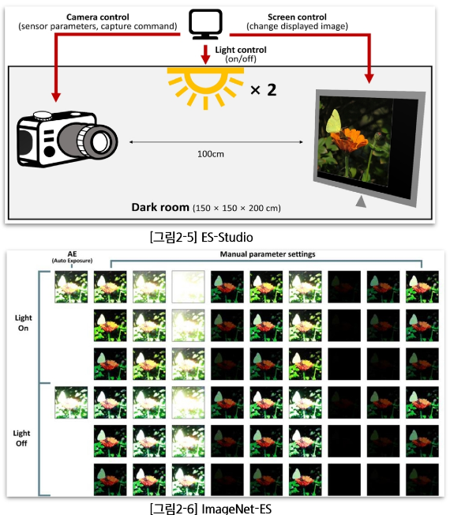

## 4. 적응적 센싱 기법: Lens

### Lens
- 센서 파라미터 후보 선택
  - 옵션이 많아서 현실적으로 모든 파라미터를 테스트할 수 없음
  - 무작위 선택, 등간격 선택, 최단시간 선택
- 이미지 캡쳐
  - 후보로 선택된 파라미터들로 이미지 여러 장 캡쳐
- 비전 테스트
  - 캡쳐한 이미지들을 모델에 입력하여 추론 과정을 거침
  - 점수: 모델이 도출한 이미지의 confidence score
- 최적의 파라미터 선택
  - 점수가 가장 높은 이미지를 선택하여 최종 추론 수행

    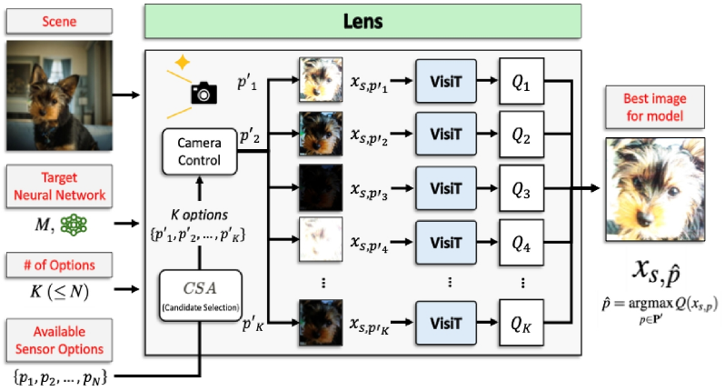

## 5. 성능 효과

### Lens vs. Auto-Exposure(AE)
- Lens: 센서 제어로 모델이 보기 좋은 이미지를 만듦
- AE: 사람이 보기 좋은 이미지를 만들기 위한 제어 기법
- Lens의 효과
  - 모델, 학습 데이터 크기에 관계없이 센서 조절만으로 성능 향상
  - ResNet50에서 AE에 비해 Lens가 47.56% 정확도 향상
  - DINOv2-b에서 AE에 비해 Lens가 8.52% 정확도 향상
- 초거대 AI 모델도 여전히 분포 이동 제어 기법의 혜택을 받음

  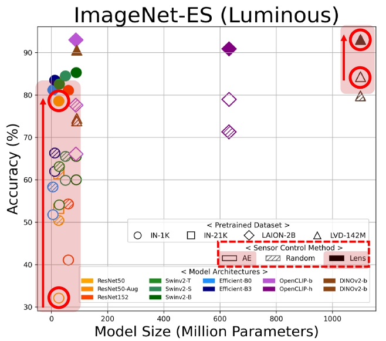

### Lens vs. 도메인 일반화
- EfficientNet-B3(Lens) vs. OpenCLIP-h(AE)
  - OpenCLIP-h는 초거대 모델의 일종
  - EfficientNet-B3보다 50배 많은 모델 파라미터
  - 그리고 2,000,000배 많은 학습 데이터
- Lens의 효과
  - 50배 작은 모델과 2,000,000배 적은 학습데이터로 4~10%의 정확도 향상
  - 작은 모델 + 적응적 센싱이 초거대 모델 + 일반 제어보다 효과가 좋음 
  -> **모델만 키우는게 다가 아니고, 센서도 중요**

    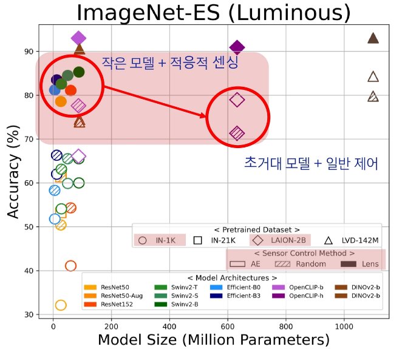

## 6. 특징과 함의

### AI 모델이 더 잘 맞추는 사진은?
- 사람에게 보기 좋은 이미지와 AI 모델이 좋아하는 이미지는 다를 수 있음
- AI 모델을 위한 센서 제어는 사람을 위한 센서 제어와 방향성이 다를 수 있음

  

### "그 때 그 때 달라요"
- 적응적 센싱의 필요성: 최적의 센서 파라미터는 모델에 따라, 환경에 따라, 피사체에 따라 달라짐

---
# 0. 학습 시작(오버뷰)

### 우리가 배운 AI 모델을 특정 도메인에 특화시키고 싶다면 어떤 과정을 거쳐야 할까?

### 도메인 특화 AI를 AI 전문가 홀로 설계하는 것과 도메인 전문가의 협업을 통해 설계하는 것의 질적 차이는 무엇일까?

### 도메인의 전문지식을 이해한다면, 경량화 기법을 쓰지 않고도 경량화를 할 수 있을까?

# 1. 도메인 전문지식의 중요성

### 도메인 특화 AI 모델을 제작하고자 한다면, 그 도메인의 전문지식을 이해해야 함
- 도메인마다 전문가들이 역사적으로 발견한 규칙/지식들이 있음
  - 단백질 구조 생성(어떤 결합은 불가능, 어떤 결합은 가능)
  - 물리 세계 시뮬레이션(중력의 법칙: 어떤 물체든 이유 없이 위로 떠오를 수 없음)
- 전문지식들은 그 도메인에서 수집된 데이터를 정확하게 이해하는데 필수적임
- 더 나아가서, 전문지식들을 데이터/모델 설계에 직접 반영하면 AI가 불필요한 시행착오 없이 효율적으로 학습 가능
- CNN의 예시: 사람의 시각적 인지과정을 반영한 Inductive Bias
  - Spatial locality: 왼쪽 위의 물체를 눈으로 판별할 때, 오른쪽 아래를 같이 볼 필요 없음
  - Positional invariance: 같은 물체가 왼족 위에 있든, 오른쪽 아래 있든 근거로 삼는 시각적 특징은 같은
  - 결과: 기존 다층퍼셉트론(MLP)보다 **훨씬 가벼우면서도 성능이 높아짐**
- AI 전문가와 도메인 전문가의 긴밀한 협업이 필수!

# 2. 의료 응용: 수면 의학을 위한 AI

## 1. 수면 의학의 기본적 이해

### 수면의학의 중요성
- 사람은 인생의 3분의 1을 수면으로 보내고 부실한 수면은 다양한 부작용을 야기함
  - 사고발생 위험을 높이고 다양한 실수를 유발함
  - 만성적 질환(심혈관질환, 비만), 정신 질환(우울증)을 야기함
- 현대사회에 수면 질환은 매우 흔해졌으며, 한국인의 60%가 수면 질환을 겪고 있음

### 수면질환 진단의 기본요소: 수면다원검사
- 병원에 방문해서 10여종 이상의 센서를 부착하고 하룻밤 수면
- 전문 수면기사가 시계열 파형을 눈으로 보고 30초 단위로 분석(2시간 정도 소요)

  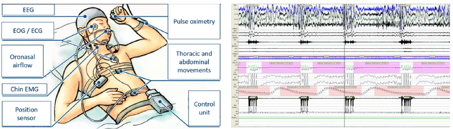

## 2. 수면다원검사의 한계점

### 전문 수면기사의 수동 채점 방식
- 인력 부족: American Academy of Sleep Medicine(AASM)의 채점 규칙 학습 필요
- 비용 부담: 시간 소모(건 당 약 2시간), 노동 집약적
- 정확도 문제: 서로의 채점에 동의할 확률 82%

### 수면다원검사의 근본적 문제
- 장소, 비용, 시간 부족으로 하룻 밤 수면으로 환자의 평소 수면건강을 예측해야 함
- **첫날 밤 효과**(샘플의 부정확성)
  - 낯선 장소에서, 센서를 여러 개 부착하고 자면 평소와 수면 상태가 달라짐(실제로 **매우 불편**)
- **하룻 밤 문제**(샘플 부족 문제)
  - 평소에 편안하게 잘 때에도 수면 상태는 매일 밤 변함
  - 하룻 밤 결과는 평소의 평균적 수면 패턴을 놓칠 가능성이 있음

# 3. 개발 사례 1: 수면다원검사 자동채점 AI

## 1. 수면단계 진단 AI의 필요성

### 수면단계
- 진단의 기본 시간 단위: 30초(에폭)
- 5단계 분류: Wake, N1, N2, N3, REM
- 각 수면단계는 생리학적 신호 특성을 가짐

  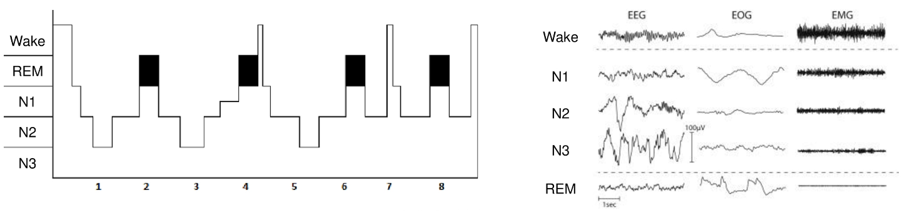

### 자동진단 AI 개발의 도전성
- 블랙박스 문제
  - 의료진단은 사람의 생명과 직결되는 민감한 작업이므로 결과에 책임을 져야 함
  - 의료진이 AI의 진단결과를 신뢰하려면, AI는 자신의 판단에 대해서 **설명할 수 있어야 함**
- 멀티모달 신호의 통합 분석
  - 수면기사는 AASM 가이드라인에 따라, 여러 종류의 생체신호를 종합적으로 분석하여 판단
  - 종합적 설명력을 탑재하기 위해서는 **복잡한 멀티모달 시계열 신호 분석 AI** 개발이 필요

    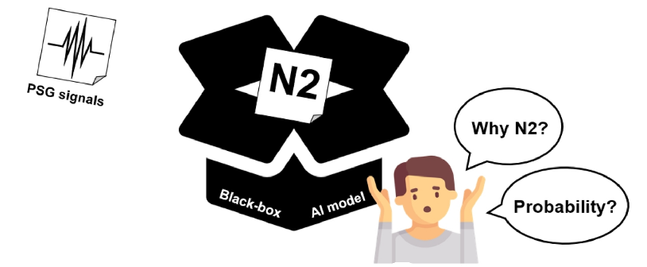

## 2. 도메인 전문지식 주입 과정

### 핵심 아이디어 1: 이미지 데이터 포맷 전환
- 수면기사들은 화면에 생체신호 파형들을 화면을 통해 **"눈으로 보고"** 채점한다!
  - 각 생체신호의 센서 측정값보다는, 생체신호 **파형의 시각적 모양이** 중요함
  - 데이터의 종류는 시계열이지만, 의료인 관점에서 바라볼 때 이 작업의 본질은 **컴퓨터 비전(이미지 판독)**
- 데이터 변환: 시계열에서 이미지로
  - 수면기사가 보는 30초(에폭) 화면을 스크린 캡쳐
  - X축: 시간, Y축: 생체신호 값과 종류
  - 흑백 이미지 판독 작업으로 전환

    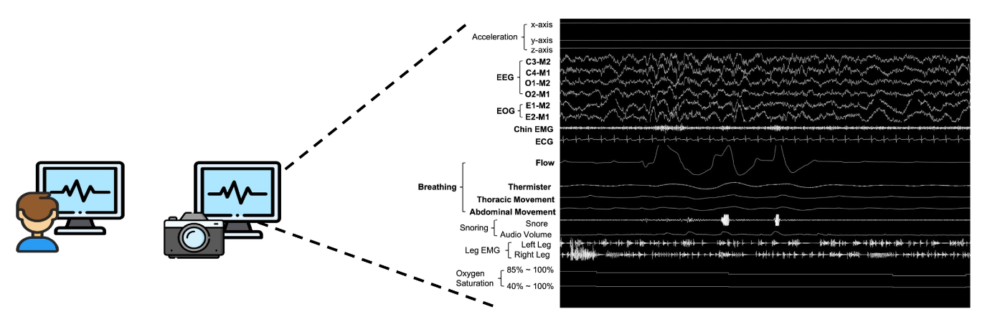

### 핵심 아이디어 2: 비전 트랜스포머 기반 신경망 학습
- 의료 AI에서는 아직 CNN이 널리 쓰이나, 본 작업에는 어울리지 않음
  - Spatial locality의 가정이 생체신호 축에서 부적합: 가까이 배치된 생체신호라고 더 관련성이 있는 것은 아님
  - Positional invariance의 가정이 생체신호 축에서 부적합: 생체신호 축의 위치마다 신호 종류가 다르므로, 위치마다 해석 방식이 달라야 함
- 비전 트랜스포머의 적합성
  - Positional embedding을 통해 생체신호 축을 모델링
  - 패치 크기: 이미지의 각 신호를 포함할 수 있도록 패치 구성
  - 어텐션을 통해 시간 축, 생체신호 축의 모든 패치들이 서로의 관계성 탐색

    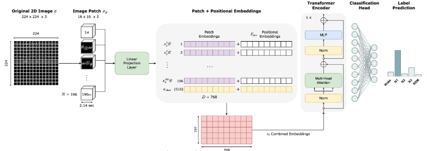

### 핵심 아이디어 3: 에폭 간 맥락 파악 및 결과 보정
- 실제로 수면은 30초 단위로 끊어지지 않고 연속적인 특성이 있음
  - 수면기사들은 특정 에폭의 수면단계를 진단할 때 전후 에폭의 결과물도 함께 보고 판단함
- 에폭간 맥락을 파악하는 트랜스포머
  - 각 에폭의 결과물을 상호 어텐션하여 최종 수면단계를 진단

    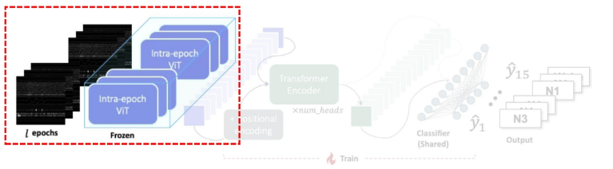

    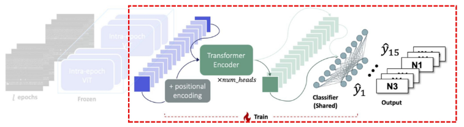

## 3. 성능 평가

### 의료진이 이해할 수 있는 설명력
- 어느 생체신호의 어느 시점을 보고 수면단계를 진단했는지 파악하고 시각화
  - 수면단계마다 주목하는 신호의 종류, 시점, 모양이 모두 다름
  - AASM의 가이드라인과 일치

    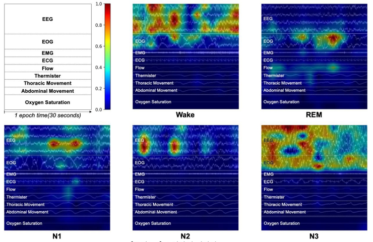

### 에폭 간 맥락 파악 및 결과 보정
- 321 에폭의 결과물이 N2 였으나(오답!)
- 이후 2가지 에폭의 결과물이 REM인 것을 고려하여 추후 REM으로 보정(정답!)

  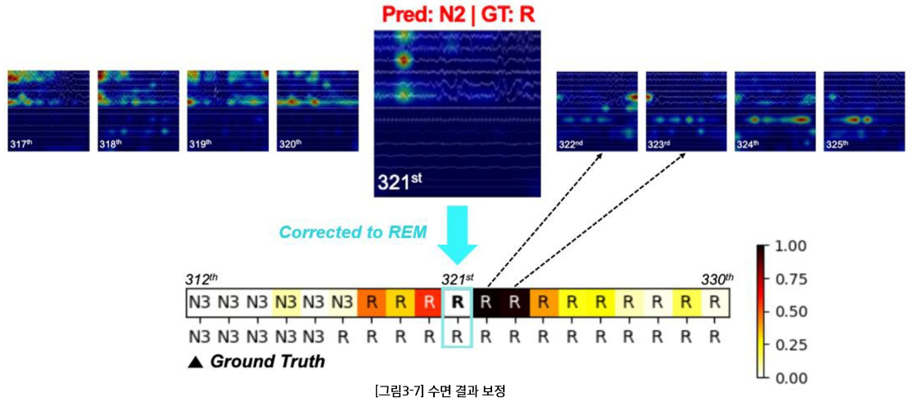

# 4. 개발 사례 2: 비접촉식 수면 무호흡증 진단 AI

## 1. 비접촉식 수면 무호흡증 진단 AI의 필요성

### 수면 무호흡증
- 수면 중에 기도가 막혀서 호흡이 중단되는 현상이 자주 발생하는 질환
  - AHI 지수로 판단: 수면 시간 동안 얼마나 무호흡/저호흡 이벤트가 일어났는가?
- 스스로 조기 진단이 어려워서 내원 시 대부분 중증 상태

  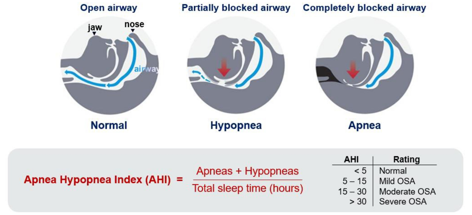

### 수면 적외선 영상
- 장점
  - 방 안의 전체적 맥락을 지속적 모니터링 할 수 있음
  - 100% 비접촉식 센서(피검자를 방해하지 않음)
- 단점
  - 움직임만으로 수면 상태를 감지할 수 있어야 함
  - 사람이 살면서 가장 안 움직이는 때가 잠잘 때임
  - 서버에 데이터가 전송되면 민감한 순간의 개인정보가 노출됨
- 요구 사항
  - 수면 중 무의식적 미세 움직임을 분석해서 수면 신호를 추출
  - 카메라에서 직접 온디바이스 AI 구동하고 원본 영상 삭제

    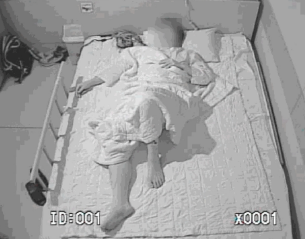

## 2. 도메인 전문지식 주입 과정

### 수면 영상 데이터셋
- 병원에서 수면다원검사를 진행하면서 영상을 동시 촬영
- 접촉식 센서들로 추출한 생체신호와 수면영상이 시간 동기화: 상호 관련성 탐구에 적합
- 다양한 환자, 다양한 환경

  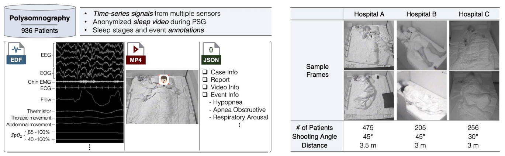

### 핵심 아이디어: 무호흡증 감지에서 호흡 각성 감지로
- 무호흡/저호흡의 움직임은 너무 미세해서 감지가 어려움
- 호흡 각성(Respiratory Arousal: RA)
  - 기도가 막힌 무호흡 상태가 오래 지속되면 사망할 수 있음
  - 인체는 이를 막기 위해 무의식적으로 **몸을 크게 뒤척여서** 기도를 다시 개방함
  - 평균적으로 무호흡/저호흡 이벤트(Apnea, Hypopnea: AH)보다 짧은 시간 지속됨: 대부분 **30초 이내**에 종료

    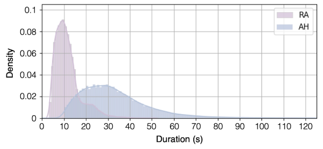

- 움직임이 큰 호흡 각성을 먼저 감지하고, 그 전에 일어난 무호흡/저호흡 이벤트를 역추적하자!

### 핵심 아이디어: 호흡 각성(Respiratory Arousal: RA) vs. 자발적 각성
- 자발적 각성(Spontaneous Arousal: SA)
  - 호흡을 잘 하고 있더라도, 꿈을 꾸거나 몸이 불편할 경우 몸을 뒤척이거나 굴러다님(흔히 잠버릇이라 불림)
  - 호흡 각성과 자발적 각성 모두 움직임이 크지만, 진단 AI는 호흡 각성만 구분해서 감지할 수 있어야 함
- 호흡 각성과 자발적 각성 모두 움직임이 크지만, 진단 AI는 호흡 각성만 구분해서 감지해야 함
  - 단서: 호흡 각성이 움직임의 범위가 더 크고, 가슴 위쪽 움직임의 강도가 더 큼

    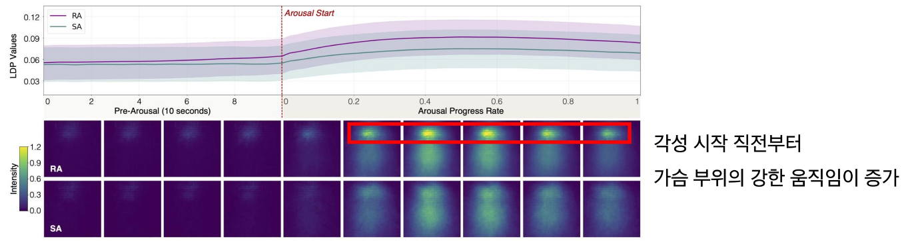

### 온디바이스 AI 파이프라인 설계
- 수면영상 촬영 중 30초마다 쪼개서 클립으로 구성
- 30초 클립으로 호흡 각성 감지(경량 비디오 모델 MoViNet 사용), 이후 영상 원본 삭제하고 진단 결과만 보존
- 전체 수면의 호흡 각성 이벤트 빈도를 계산
- 호흡 각성 이벤트 빈도를 무호흡/저호흡 이벤트 빈도(Apnea-Hypopnea Index: AHI)로 변환

  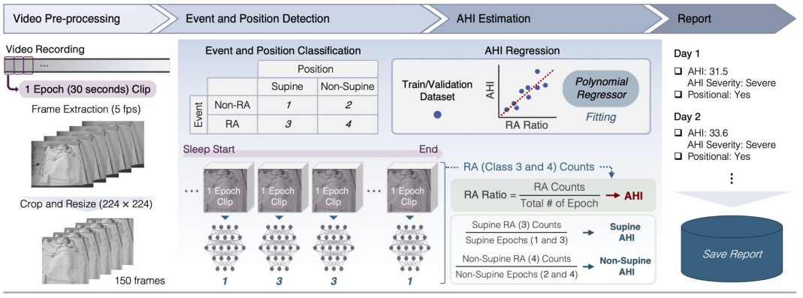

## 3. 성능 평가

### 경량 모델, 엣지 디바이스, 빠른 실행
- 엣지 디바이스의 CPU에서도 30초 이내 추론: 실시간 동작
  - GPU뿐 아니라 CPU만 사용해도 30초 이내 추론이 가능해짐
- 도메인 전문지식을 통한 감지 타깃 전환 전략 -> 복잡한 영상 AI 과제를 온디바이스 AI로 해결 가능

  
