# Many to many relationships

### 다대다 관계 (Many to many relationship)
- Many to many relationship(N:M or M:N): 한 테이블의 0개 이상의 레코드가 다른 테이블의 0개 이상의 레코드와 관련된 경우
  - 영화와 배우처럼, 한 쪽의 여러 개가 다른 쪽의 여러 개와 연결되는 복잡한 관계
  - 다대다 관계를 설정하면, 한 영화에 여러 배우를 추가하거나, 한 배우가 출연한 모든 영화를 쉽게 찾아낼 수 있음

### M:N 관계의 역할과 필요성 이해하기
- '병원 진료 시스템 모델 관계'를 직접 만들어 보기
  - 환자와 의사 2개의 모델을 사용하여 모델 구조 구상
- 기존의 N:1 구조로 환자와 의사 테이블을 구성했을 때 어떤 한계가 있는지 확인
- N:M 관계는 어떻게 DB에서 관리하는지 확인
> 제공된 '99-mtm-practice' 프로젝트를 기반으로 진행

## N:1의 한계

### 의사와 환자 간 모델 관계 설정
- 한 명의 의사에게 여러 환자가 예약할 수 있도록 models 클래스 정의
  - Patient(환자) 모델에 Doctor 모델을 참조하도록 정의
- Migration 까지 진행하여 DB에 적용

  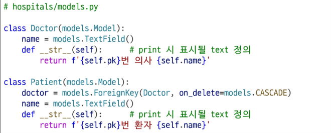

### 의사와 환자 데이터 생성
- Django shell 을 활용하여 2명의 의사를 생성

  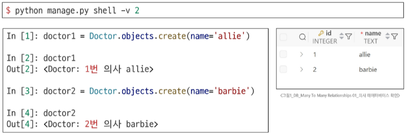

- Django shell 을 활용하여 2명의 환자를 생성하고 환자는 서로 다른 의사에게 예약

  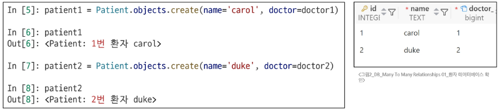

### N:1의 한계 상황
- 1번 환자(carol)가 두 의사 모두에게 진료를 받고자 한다면
- 환자 테이블에 1번 환자 데이터가 중복으로 입력될 수 밖에 없음

  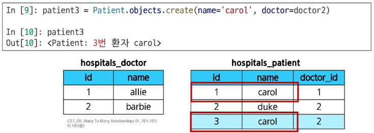

- 환자가 진료 받을 의사 정보를 동시에 저장을 시도했을 때는 에러가 발생함

  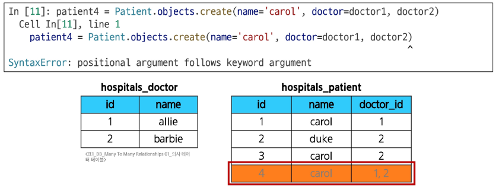

- 동일한 환자지만 다른 의사에게도 진료받기 위해 새로운 예약 데이터를 만들어야 하며, 이 때, 동일한 환자 정보를 또 작성하여 저장됨
  - 데이터의 중복이 발생하면 나중에 환자의 정보가 바뀌었을 때, 모든 예약 정보를 하나하나 찾아서 고쳐야 하는 문제가 발생하고, 실수로 하나라도 누락한다면 데이터의 일관성이 깨지게 됨
- 외래 키 컬럼에 '1, 2' 형태로 저장하는 것은 DB 타입 문제로 불가능
  - <u>제 1정규형</u>을 만족하지 못 하기 때문에 사용이 불가함
- 의사의 정보도 외래 키로 참조하고, 환자의 정보도 외래 키로 참조하는 별개의 테이블을 만든다면 위에 언급된 문제를 해결할 수 있게 됨
  - 즉, "예약 테이블을 따로 만들자"

---
- 제 1정규형: 테이블의 모든 칸에 더 이상 쪼갤 수 없는 하나의 값만 넣어야 함

## 중개 모델

### 중개 모델
- 중개 모델: 다대다 관계에서 두 모델을 연결하는 역할을 하는, 특별한 기능을 가진 모델
  - 의사와 환자가 '예약'이라는 관계로 연결될 때, 단순히 '의사 A와 환자 B가 연결됐다'는 사실 외에 '언제 예약했는지', '예약의 상태는 무엇인지' 같은 정보를 함께 저장하는 모델

### 예약 모델 생성
- 환자 모델의 외래 키를 삭제하고 별도의 예약 모델을 새로 생성
- 예약 모델은 의사와 환자에 각각 N:1 관계를 가짐

  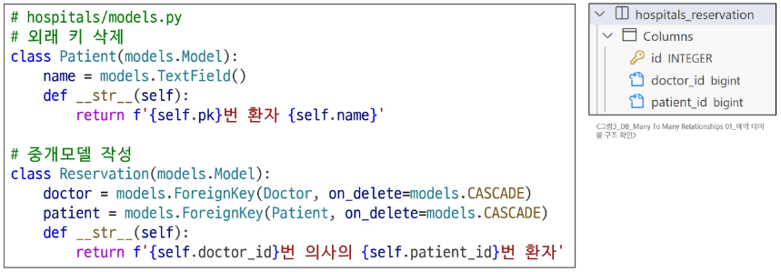

### 예약 정보 조회
- 의사와 환자가 예약 모델을 통해 각각 본인의 진료 내역 확인
  - 각각의 의사 혹은 환자 데이터에서 중개 테이블의 역참조를 통해 예약 내역을 확인할 수 있음

    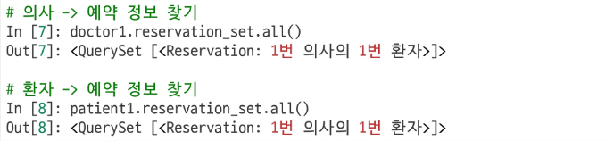

### 추가 예약 생성
- 1번 의사에게 새로운 환자 예약 생성

  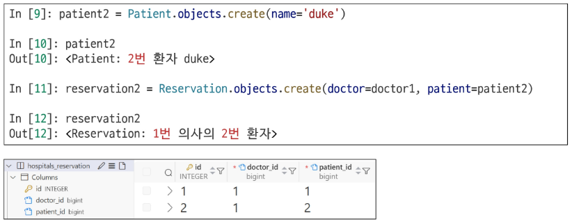

### 예약 정보 조회
- 1번 의사의 전체 예약 정보 조회
  - 예약 테이블의 역참조를 활용해서 어떤 예약이 있는지 확인할 수 있음

    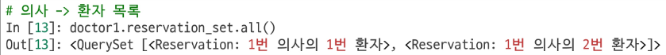

- 이렇게 다대다 관계(Many to many relationship)의 경우 중개 테이블을 생성해서 데이터를 효율적으로 관리할 수 있음
- Django에서는 'ManyToManyField'를 통해 두 모델 간의 중간 테이블(중개 모델)이 자동으로 만들어짐

## ManyToManyField

### ManyToManyField
- ManyToManyField(): M:N 관계 설정 모델 필드
  - 이 필드를 설정하면 Django는 자동으로 중간 테이블(중개 모델)을 생성하여 각 모델 간의 관계를 관리
  - 모델 클래스 내부에 필드로 정의, 어느 모델에 정의해도 관계는 동일하게 유지
  - ManyToManyField의 필드명은 다대다 관계를 나타내기 위해 복수형으로 작성을 권장
  - ManyToManyField의 필수 인자는 관계를 가지는 모델 클래스를 작성

### ManyToManyField 조작
- .add() 메서드
  - 중개 테이블에 새로운 데이터를 추가할 때 사용
  - 인자로 연결할 대상 모델의 인스턴스를 넣어서 사용

    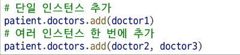

- .remove() 메서드
  - 중개 테이블에 있는 데이터를 삭제할 때 사용
  - 인자로 전달한 인스턴스를 중개 테이블에서 제거하며, 대상 객체 자체는 삭제되지 않음

    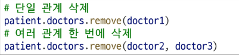

### Django ManyToManyField 실습
- 환자 모델에 ManyToManyField 작성
  - 의사 모델에 작성해도 상관 없으며 참조/역참조 관계만 잘 기억할 것
    - 환자 모델은 의사 모델을 참조하며, 의사 모델은 역참조를 통해 환자 모델에 접근

      

- DB 초기화 후 Migration 진행 및 shell 실행
- 생성된 중개 테이블 hospitals_patient_doctors 확인
  - 중개 테이블 이름은 '앱이름_모델클래스명_필드명' 으로 생성됨

    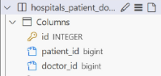

  - 필드가 아닌 테이블이 생성됨을 유의
- 의사 1명과 환자 2명에 대한 데이터 생성

  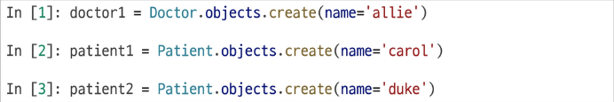

- 환자 1의 예약에 의사 1을 추가하고 예약 내역 조회하기
  - 환자의 경우 클래스 내부에 필드를 가지고 있어 참조로 조회
  - 의사의 경우 역참조를 통해 환자 데이터 조화

    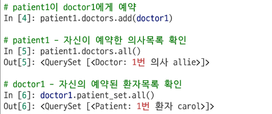

- 의사 1이 환자 2에 대한 예약 추가하고 예약 내역 조회하기
  - 의사는 역참조 매니저를 통해 환자를 추가할 수 있음

    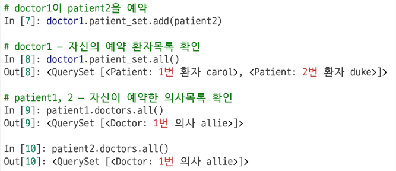

- 중개 테이블 (hospital_patient_doctors)에서 예약 현황 확인
  - 환자와 의사 정보가 외래키로 저장되어 있음을 확인
  - 데이터의 중복 없이 정보를 효율적으로 저장하고 있음

    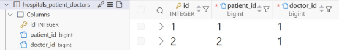

- 예약 취소하기 (삭제)
- 이전에는 Reservation을 찾아서 지워야 했다면, 이제는 .remove() 로 삭제 가능

  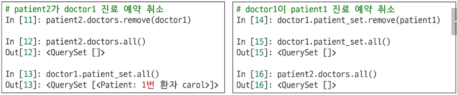

### 기본 ManyToManyField의 한계
- 기본 ManyToManyField 로 생성된 예약 중개 테이블은 의사와 환자의 외래 키 정보만 저장하고 있음
- 만약 예약 중개 테이블에 병의 증상, 예약 일정, 방문 횟수에 대한 추가 정보가 필요한 경우, 기본 ManyToManyField를 그대로 사용할 수 없음
- 추가 정보를 저장하기 위해서는 사용자가 직접 중개 테이블을 정의해야 함
  - 사용자가 직접 중개 테이블을 정의하면 .add(), .remove()에 메서드를 사용할 수 없음
- ManyToManyField에 'through' 속성을 통해 사용자가 작성한 중개 테이블을 등록하면 추가 정보 저장 및 .add(), .remove() 메서드를 그대로 활용할 수 있게 됨

## 'through' argument

### ManyToManyField의 'through' 속성
- 'through' 속성: 중개 테이블에 **'추가 데이터'** 를 사용해 M:N 관계를 형성하려는 경우에 사용

### 'through' 속성 실습
- Reservation Class 재작성 및 through 설정
  - 이제는 예약 정보에 "증상(symptom)"과 "예약일(reserved_at)" 이라는 추가 필드가 생김

    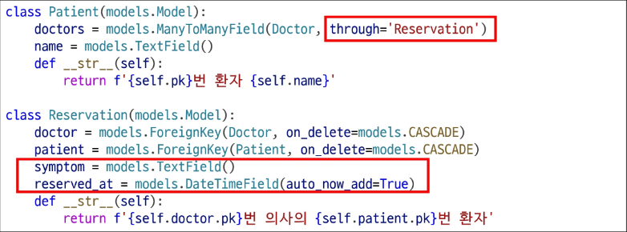

- DB 초기화 후 Migration 진행 및 shell 실행
- 의사 1명과 환자 2명 생성

  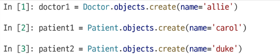

- 예약 생성 방법 - 1
  - Reservation class를 통한 예약 생성

    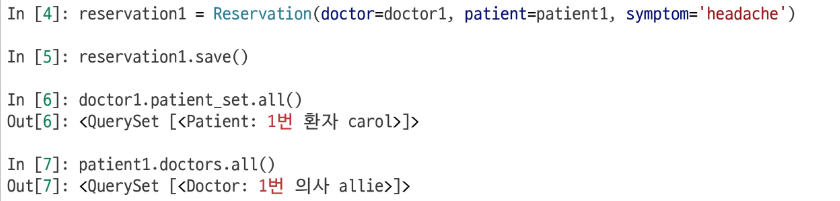

- 예약 생성 방법 - 2
  - Patient 또는 Doctor의 인스턴스를 통한 예약 생성 (**through_defaults**)
  - .add() 메서드의 through_defaults 인자에 {필드명: 값} 형태로 전달하면 중개 모델의 해당 필드에 값이 저장됨

    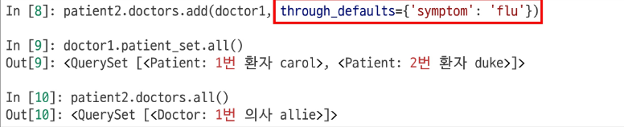

- 중개 테이블 (hospitals_reservation)에 생성된 예약 정보 확인
  - 두 방법 모두 중개 테이블에 잘 저장되었음을 확인

    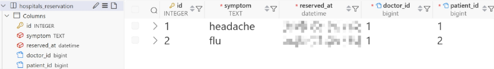

- 생성과 마찬가지로 의사와 환자 모두 각각 예약 삭제 가능
- 직접 중개 테이블의 인스턴스를 활용한 삭제

  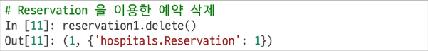

  - 중개 테이블을 통한 삭제는 delete 메서드 사용
- 의사 데이터를 통해 환자와의 예약 삭제

  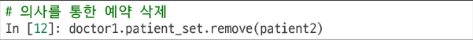

  - 환자 데이터를 통해서도 동일하게 예약 삭제 가능

### M:N 관계 주요 사항 정리
- M:N 관계로 맺어진 두 테이블에는 물리적인 변화가 없음
- ManyToManyField는 중개 테이블을 자동으로 생성
- ManyToManyField는 M:N 관계를 맺는 두 모델 어디에 위치해도 상관 없음
  - 대신 필드 작성 위치에 따라 참조와 역참조 방향을 주의할 것
- N:1은 완전한 종속의 관계였지만 M:N은 종속적인 관계가 아니며 '의사에게 진찰받는 환자' & '환자를 진찰하는 의사' 이렇게 2가지 형태 모두 표현 가능

# ManyToManyField

### ManyToManyField 특징
- ManyToManyField(to, **options)
  - M:N 관계 설정 시 사용하는 모델 필드
  - 어느 모델에서든 관련 객체에 접근할 수 있는 **양방향 관계**
  - 동일한 관계는 한 번만 저장되며 **중복되지 않음**

### ManyToManyField의 대표 인자 3가지
1. related_name
  - 역참조 이름을 변경할 때 설정하는 인자
2. symmetrical
  - 관계 설정 시 대칭에 대한 설정을 하는 인자
3. through
  - 직접 생성한 중개 테이블을 등록하는 인자

### 'related_name' argument
- 역참조시 사용하는 manager name을 변경
  - 기본 값인 '역참조모델명_set'을 다른 이름으로 변경할 때 사용
  - 이름을 변경하면 더 이상 기본 값('역참조모델명_set')을 사용할 수 없음

    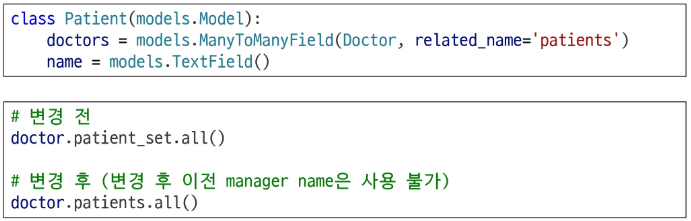

### 'symmetrical' argument
- 관계 설정 시 대칭 유무 설정
- ManyToManyField가 동일한 모델을 가리키는 정의에서만 사용
- 기본 값: True

  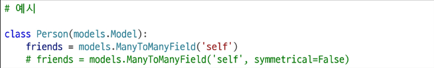

- source 모델: 관계를 시작하는 모델
- target 모델: 관계의 대상이 되는 모델
- symmetrical 값이 True인 경우
  - source 모델의 인스턴스가 target 모델의 인스턴스를 참조하면 자동으로 target 모델 인스턴스도 source 모델 인스턴스를 자동으로 참조하도록 함(대칭)
  - 즉, 내가 당신의 친구라면 자동으로 당신도 내 친구가 됨
- symmetrical 값이 False인 경우
  - True와 반대 (대칭되지 않음)

### 'through' argument
- 사용하고자 하는 중개모델을 지정
- 일반적으로 "추가 데이터를 M:N 관계와 연결하려는 경우"에 활용

  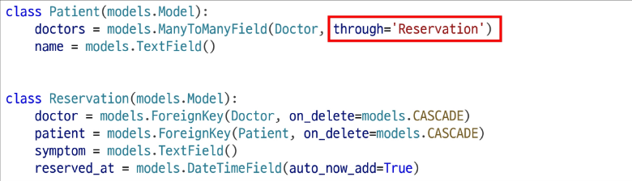

# 좋아요 기능 구현

## 모델 관계 설정

### 다대다 관계 설정
- Many to many relationships: 한 테이블의 0개 이상의 레코드가 다른 테이블의 0개 이상의 레코드와 관련된 경우 **양쪽 모두에서 N:1 관계를 가짐**

### 좋아요 기능의 모델 관계 설정
- Article (M) - User (N)
  - 게시글은 좋아요가 없을 수도 있고, 여러 개 존재할 수 있음
  - 사용자도 게시글에 좋아요를 한 번도 누르지 않았을 수도 있고, 여러 개의 게시글에 좋아요를 누를 수 있음
- Article 클래스에 ManyToManyField 작성
  - 필드 명은 직관적이고 복수형으로 작성

    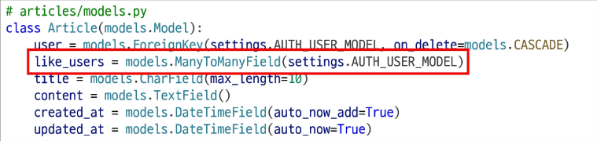

- Migration 진행 시 에러 발생 확인
  - 유저가 게시글을 역참조할 때 역참조 이름에 대한 충돌이 발생하고 있음

    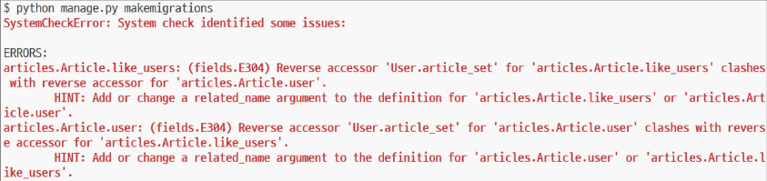

### 역참조 매니저 충돌
- 게시글의 작성자 저장 위해 설정한 ForeignKey 의 역참조
  - "유저가 작성한 게시글"을 확인하기 위해서는 **'article_set'** 를 사용해야 함
  - user.article_set.all()
- 좋아요 기능을 위해 설정한 ManyToManyField의 역참조
  - "유저가 좋아요한 게시글"을 확인하기 위해서는 **'article_set'** 을 사용해야 함
  - user.article_set.all()
- 'article_set' 의 역참조 이름이 겹치게 되어 충돌이 발생하고 있음
- User와 Article 모델 사이에 ForeignKey(작성자)와 ManyToManyField(좋아요) 두 관계가 공존하면서 'article_set'이라는 역참조 이름이 충돌하여 어떤 데이터에 접근해야 하는지 알 수 없게 됨
- 'user가 작성한 글 (user.article_set)'과 'user가 좋아요를 누른 글(user.article_set)'을 구분할 수 있도록 코드 수정이 필요함
> 두 관계 중 하나에 related_name을 설정해야 하는데, 일반적으로 ManyToManyField쪽에 related_name을 추가하는 것을 권장

### M:N 관계를 바꾸는 것이 더 좋은 이유 2가지
1. '소유' 관계의 기본값 유지
  - ForeignKey(1:N) 관계는 보통 '소유'나 '소속'의 의미를 가짐 (예: 게시글의 소유자는 유저)
  - Django의 기본 역참조 이름인 'article_set'은 'User가 소유한 Article의 집합'이라는 매우 직관적인 의미로 해석됨
  - 이처럼 가장 중요하고 대표적인 관계의 기본값을 그대로 유지하는 것이 코드의 예측 가능성을 높임
2. '행위' 관계의 명시적 표현
  - ManyToManyField(M:N) 관계는 보통 '참여' 나 '행위'의 의미를 가짐 (예: 유저가 게시글에 '좋아요를 누르는' 행위)
  - 이 관계에 related_name='like_articles'처럼 행위의 의미가 드러나는 구체적인 이름을 붙여주면, 코드의 가독성이 크게 향상됨

### 충돌 해결하기
- user.article_set.all()
  - "이 유저가 작성한 모든 글" (소유 관계, 기본)
- user.like_articles.all()
  - "이 유저가 좋아요를 누른 모든 글" (행위 관계, 명시적)
> 핵심적인 '소유' 관계(N:1)는 기본값을 유지하고, 부가적인 '행위' 관계(M:N)에 구체적인 이름을 붙여주는 것으로 설게하기

- related_name 작성 후 Migration 재진행

  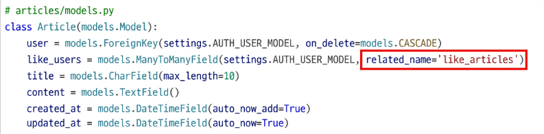

- 생성된 중개 테이블 확인

  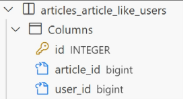

### User - Article간 사용 가능한 전체 related manager
- article.user
  - 게시글을 작성한 유저 - N:1
- user.article_set
  - 유저가 작성한 게시글(역참조) - N:1
- article.like_users
  - 게시글을 좋아요 한 유저 - M:N
- user.like_articles
  - 유저가 좋아요 한 게시글(역참조) - M:N

## 기능 구현

### 좋아요 기능 구현
- 좋아요 기능을 담당할 URL 등록
  - 어떤 게시글에 좋아요가 눌렸는지 정보를 전달하기 위해 '게시글 pk' 정보를 variable routing으로 추가

    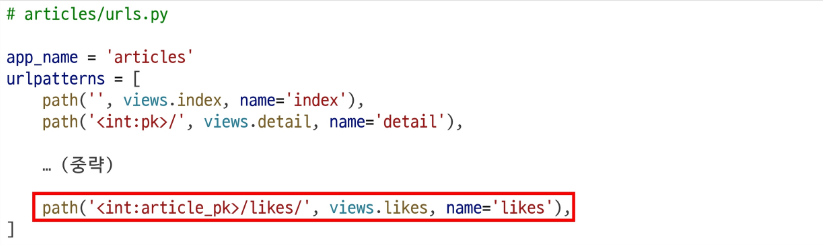

- view 함수 구현
  - 사용자가 게시글의 좋아요 목록에 있으면 좋아요 취소 (사용자 정보 삭제)
  - 사용자가 게시글의 좋아요 목록에 없으면 좋아요 추가 (사용자 정보 추가)

    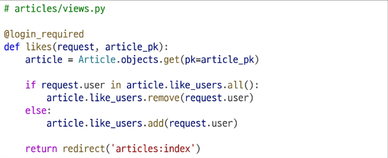

- index 템플릿에서 각 게시글에 좋아요 버튼 출력
  - 좋아요 버튼의 value도 현재 상태에 따라 다르게 출력하도록 코드 작성

    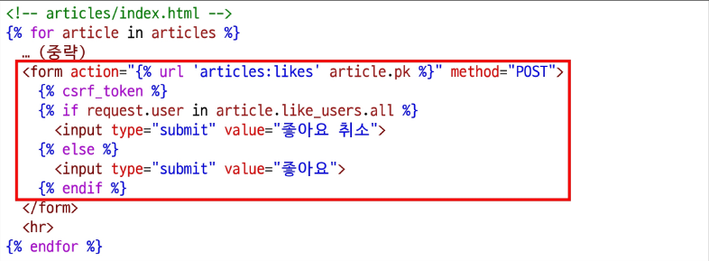

- 좋아요 버튼 출력 및 동작 확인
  - 좋아요 버튼을 누를 때마다 버튼의 텍스트가 변경되는지 확인

    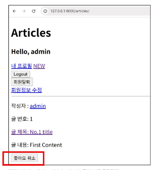

- 좋아요 버튼 클릭 후 테이블 확인

  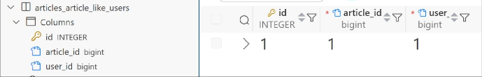

### 실습
- Many to many relationships
  - 2919. M:N 복습 - 모델 작성
  - 3061. diary M:N 관계 추가
  - 1910. 온라인 쇼핑몰 시스템 - M:N 모델 정의
  - 1911. 온라인 쇼핑몰 시스템 - M:N 모델 개선
  - 1912. 이벤트 참여자 목록 관리 서비스 - M:N 모델 정의
  - 1913. 이벤트 참여자 목록 관리 서비스 - 중개 모델
  - 1914. 이벤트 참여자 목록 관리 서비스 - 모델 수정
- 좋아요 기능 구현
  - 1974. M:N 복습 - 좋아요 기능 구현
  - 3063. 추천 기능 구현
  - 3062. diary M:N 기능 구현