# 팔로우 기능 구현

## 프로필 페이지

### 프로필 페이지
- 각 회원의 개인 프로필 페이지에 팔로우 기능을 구현하기 위해 프로필 페이지를 먼저 구현하기
- 프로필 페이지에 해당 사용자의 추가 정보를 같이 볼 수 있게 내용 추가
    - 해당 사용자가 작성한 게시글 목록
    - 해당 사용자가 작성한 댓글 목록
    - 해당 사용자가 좋아요를 누른 게시글 목록

### 프로필 페이지 구현
- 프로필 페이지로 접근하기 위한 URL 주소 작성
    - 프로필 페이지는 사용자와 관련된 기능이기 때문에 'accounts' 앱의 'urls.py'에 추가
    - 로그인한 유저 뿐만 아니라 다른 사람의 프로필 페이지 방문도 가능해야 함
    - 사용자의 username을 variable routing을 활용하여 정보 전달이 필요

        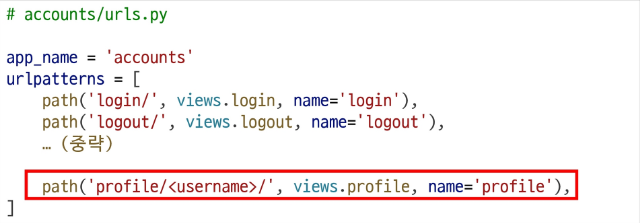
    
- view 함수 작성
  - URL로 전달되는 username 을 이용하여 사용자 정보를 조회하고 이를 template으로 전달
  - 유저 모델은 직접 import 하지 않고, get_user_model() 함수를 사용해야 함

    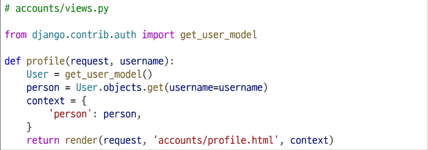

- 프로필 페이지의 세부 내용을 작성

    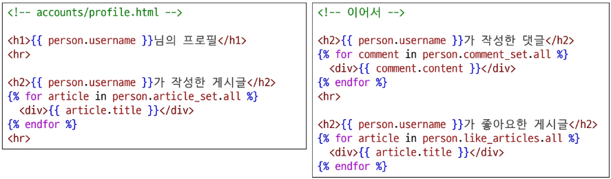

- index 페이지에서 내 프로필로 이동할 수 있도록 프로필 링크 추가

    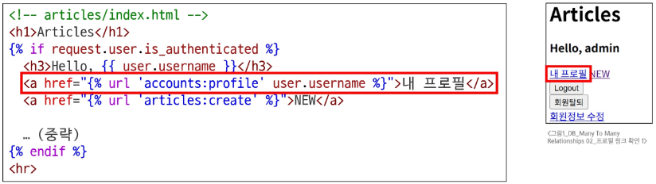

- 다른 유저의 프로필 페이지로 이동할 수 있도록 유저 아이디에도 해당 유저의 프로필 링크 추가

    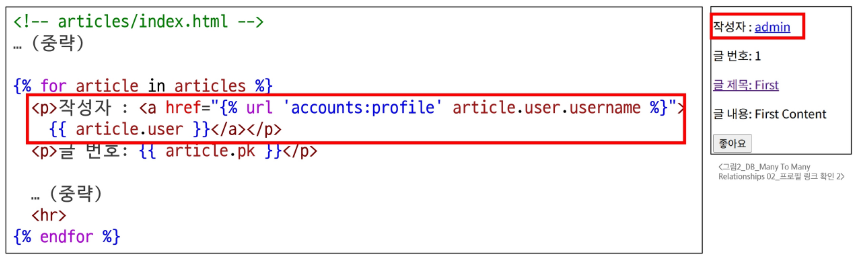

- 프로필 페이지로 이동해서 데이터가 잘 나오는지 확인

    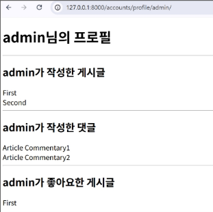

## 모델 관계 설정

### 팔로우 기능의 모델 관계
- User(M) - User(N): 팔로우는 유저와 유저와의 관계를 나타냄
  > 회원은 여러 명의 회원을 팔로우할 수 있고, 한 명도 하지 않을 수도 있음
  > 회원은 여러 명의 팔로워를 가질 수 있고, 한 명도 가지지 않을 수도 있음

### 팔로우 모델 관계 설정
- 커스텀한 User 모델 클래스에 ManyToManyField를 사용하여 팔로우 필드를 추가
  - User 모델과 관계를 맺는 것이기 때문에 settings.AUTH_USER_MODEL을 사용해도 되지만 자기 자신과의 관계이기 때문에 'self'로 표현할 수 있음
  - 팔로우 기능은 단방향의 관계이기 때문에 반드시 symmetrical 속성을 False로 설정
  - 참조 필드는 followings 필드로 내가 팔로우하는 사람들을 의미
  - 역참조 필드는 user_set을 사용해도 되지만 명확한 설정을 위해 related_name을 이용하여 'followers'로 변경

  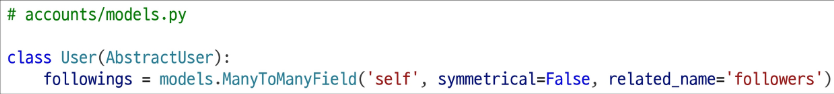

- 참조, 역참조는 서로 바뀌어도 상관없으나 관계 조회시 생각하기 편한 방향으로 정하여 작성됨
- Migration 진행 후 중개 테이블이 생성되었는지 확인

  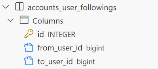

## 기능 구현

### 팔로우 기능 구현
- 팔로우 기능을 위한 URL 추가
  -  어느 사용자를 팔로우 하는지 상대 사용자에 대한 정보를 variable routing을 활용하여 전달

    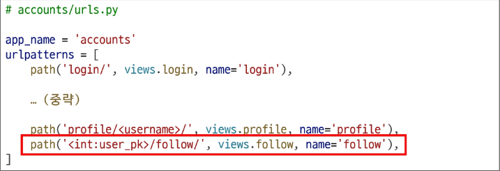

- 중개 테이블에 이미 내 정보가 있으면 제거 (팔로우 해제)
- 중개 테이블에 내 정보가 없으면 추가 (팔로우 진행)

  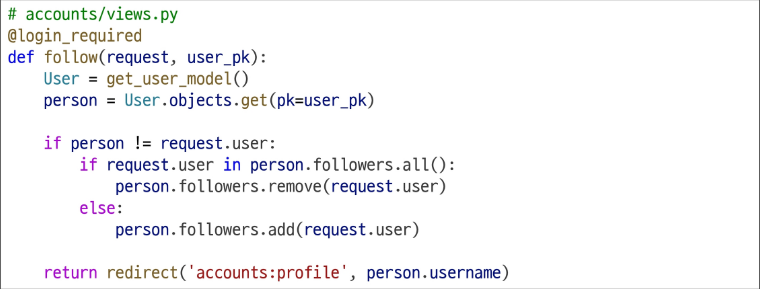

- 프로필 페이지에서 팔로우 기능을 추가
  - 팔로우와 팔로잉이 몇 명 있는지 DTL 을 사용하여 출력하는 부분 추가

  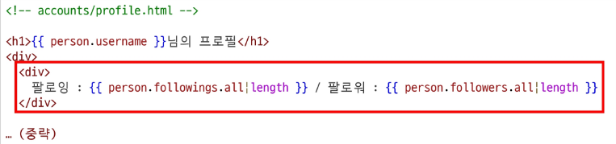

  - 프로필 페이지의 유저(person)가 로그인한 사용자(request.user)의 페이지인 경우 팔로우 버튼 숨기기
  - 팔로우를 수행할 버튼을 추가하고 팔로우 여부에 따라 버튼의 텍스트를 다르게 출력

  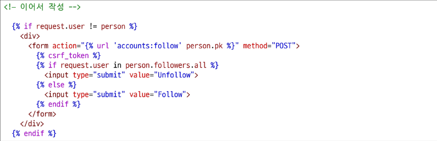

- 팔로우 기능 확인
  - 팔로우 버튼을 눌렀을 때 숫자와 버튼 텍스트
  - 내 프로필에서 팔로우 버튼 생략

    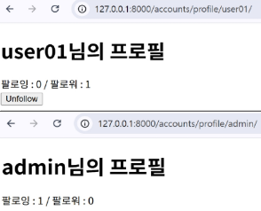

- 팔로우 버튼 클릭 후 중개 테이블 데이터 확인
  - from_user_id 는 버튼을 누른 유저 (나)
  - to_user_id 는 팔로우된 유저 (상대방)

    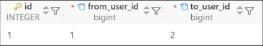

# Fixtures

### Fixtures
- Fixtures: Django 개발 시 DB 초기 데이터 세팅 및 공유를 위해 사용되는 파일 형식

### Fixtures 사용 목적
- 초기 데이터 세팅
  - 웹 서비스가 처음 시작될 때 필요한 기본 데이터(기본 권한 그룹, 상품 카테고리 등)를 미리 세팅할 수 있음
- 테스트 샘플 데이터 준비
  - 테스트할 때 항상 동일하고 예측 가능한 데이터 환경을 구축하여 테스트의 신뢰성과 반복 가능성을 높이는 데 활용
- 협업 시 동일한 데이터 환경 맞추기
  - 팀원들이 각자의 개발 환경을 설정할 때, 모두 동일한 초기 데이터나 특정 테스트 데이터 셋을 쉽게 공유하고 적용
  - 게빌 환경 간의 일관성을 유지하고 협업 효율을 높이는 데 도움을 줌

### 초기 데이터의 필요성
- 협업하는 유저 A, B가 있다고 생각했을 때
  1. A가 먼저 프로젝트를 작업 후 원격 저장소에 push 진행
    - .gitignore로 인해 DB는 업로드하지 않기 때문에 A가 생성한 데이터도 업로드 X
  2. B가 원격 저장소에서 A가 push한 프로젝트를 pull (혹은 clone)
    - 결과적으로 B는 DB가 없는 프로젝트를 받게 됨
- 이처럼 프로젝트의 앱을 처음 설정할 때 동일하게 준비된 데이터로 DB를 미리 채우는 것이 필요한 순간이 있음
- Django에서는 fixtures를 사용해 앱에 초기 데이터(initial data)를 제공

### fixtures 관련 명령어
- 'dumpdata'
  - DB에서 데이터를 내보낼 때 사용하는 명령어
  - 주로 파일(JSON) 형태로 추출함
  - 특정 테이블의 데이터만 추출도 가능함
- 'loaddata'
  - DB에 데이터를 불러올 때 사용하는 명령어
  - 내보내기 형태로 저장된 JSON을 읽어와서 DB에 저장함

### Fixtures 실습 사전 준비
- M:N 까지 모두 작성된 Django 프로젝트에서 유저, 게시글, 댓글 데이터 준비하기
  - 유저 데이터
    - 최소 3명의 유저를 회원 가입을 통해 준비
  - 게시글
    - 유저 별로 1~2개의 게시글 생성을 통해 데이터 준비
  - 댓글
    - 게시글 당 2~3개씩 작성하여 데이터 준비
    - 유저 별로 0~2개 정도 작성되도록 준비

## dumpdata

### dumpdata
- dumpdata: DB의 특정 모델 혹은 앱 전체 데이터를 추출

### dumpdata 기본 명령어

```bash
$ python manage.py dumpdata [앱이름.모델이름] [옵션] > 추출파일명.json
```

- 앱이름만 지정
  - 해당 앱의 모든 모델에 대한 데이터를 추출
- 앱이름.모델이름 지정
  - 특정 모델의 데이터를 추출
- 앱 혹은 모델명을 지정하지 않은 경우
  - 프로젝트 전체의 모델 데이터를 추출
- --format 옵션을 통해 JSON, YAML 등의 형식 지정 가능(기본값: JSON)

dumpdata 명령어 예시

```bash
$ python manage.py dumpdata --indent 4 articles.article > articles.json
```

- articles 앱의 Article 모델 데이터를 추출
  - '--incent 4' 는 들여쓰기를 4칸을 한다는 옵션
- 명령어 실행 후 프로젝트 폴더에 articles.json 파일이 생성됨

  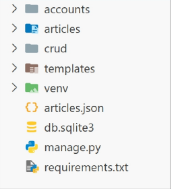

- articles.json 파일에는 Article 모델의 모든 데이터가 JSON 형식으로 작성되어 있음
- Fixtures 파일명은 자유롭게 작성 가능
- article 앱의 comment 모델과 account 앱의 user 모델의 데이터를 추출

```bash
$ python manage.py dumpdata --indent 4 articles.comment > comments.json
$ python manage.py dumpdata --indent 4 accounts.user > users.json
```

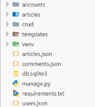

### dumpdata 정리
- dumpdata 명령어를 사용하면 프로젝트 내 특정 앱 혹은 모델에 대한 데이터를 JSON 등 원하는 포맷으로 추출 가능
- 이렇게 생성된 데이터 파일은 추후 다른 환경에서 loaddata로 불러와 동일한 데이터 상태를 재현할 수 있으며, 협업 및 배포에 큰 장점이 있음

## loaddata

### loaddata
- loaddata: dumpdata를 통해 추출한 데이터 파일을 다시 DB에 반영

### loaddata 기본 명령어
- Fixtures 파일의 기본 경로에 있는 파일을 DB에 반영

  ```bash
  $ python manage.py loaddata 파일경로
  ```

- Fixtures 파일의 기본 경로
  - **app_name/fixtures/**
- Django는 설치된 모든 app의 디렉토리에서 fixtures 폴더 이후의 경로로 fixtures 파일을 찾아 load를 진행

### loaddata 실습 사전 준비
- 'articles' 폴더 내에 'fixtures' 폴더를 생성 후 해당 폴더에 dumpdata로 생성한 파일들을 위치

  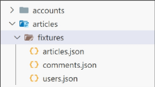

- 'db.sqlite3' 파일 삭제 후 migrate 진행하여 DB 초기화
  
### loaddata 명령어 예시
- dumpdata로 생성한 파일들을 모두 DB에 반영
- 파일을 한 번에 작성하면, Django가 자동으로 우선 순위가 높은 파일부터 불러오므로 json 파일의 작성 순서는 상관없음

  ```bash
  $ python manage.py loaddata articles.json users.json comments.json
  ```

- 단, loaddata를 한 번에 실행하지 않고 별도로 실행한다면 모델 관계에 따라 load 순서가 중요할 수 있음
  - comment는 article에 대한 key 및 user에 대한 key가 필요
  - article은 user에 대한 key가 필요
- 즉, 현재 모델 관계에서는 user -> article -> comment 순으로 data를 load 해야 오류가 발생하지 않음

  ```bash
  $ python manage.py loaddata users.json
  $ python manage.py loaddata articles.json
  $ python manage.py loaddata comments.json
  ```

- 첫 번째로 comments.json를 먼저 loaddata 하게 되면 아래와 같이 에러가 발생
  - 게시글 정보를 찾을 수 없어 에러가 발생

  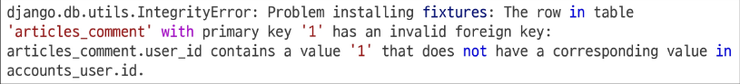

### loaddata 주의 사항
- loaddata를 실행하기 전에 해당 모델에 대한 마이그레이션이 완료되어 있어야 함
- 같은 PK를 가진 데이터가 이미 있는 경우 중복 에러가 발생할 수 있음
  - 이 경우 기존 데이터를 지우거나, 새로운 Fixture 파일을 사용해야 함

### loaddata 정리
- loaddata 명령어는 dumpdata로 추출한 Fixture 파일을 DB로 불러오는 명령어이며, 개발 환경 준비나 협업 시 매우 유용
- 마이그레이션 상태를 먼저 확인하고, 인코딩 문제 등을 사전에 해결하면 매끄럽게 데이터를 복원할 수 있음

# Improve query

### Improve query
- Improve query: 같은 결과를 얻기 위해 DB 측에 보내는 query 개수를 점차 줄여 조회하기
> N+1 Problem을 해결할 수 있음

### N+1 Problem
- N+1 Problem: 1개의 쿼리로 데이터를 가져왔더라도 관련 데이터를 추가로 가져오기 위해 추가 쿼리가 N개 더 실행되는 상황
  - N+1 문제는 ORM에서 관련 객체를 반복적으로 접근할 때 과도한 쿼리가 발생하는 현상
  - 초기 1번의 쿼리로 기본 데이터를 조회한 뒤, 각 객체의 연결된 데이터를 조회하며 N번의 추가 쿼리가 실행됨
  - 이로 인해 총 N+1개의 쿼리가 발생하고 데이터가 많을 수록 성능 저하나 DB 부하가 심해질 수 있음

## 사전 준비

### Improve query 실습 사전 준비
- 99-improve-query 프로젝트에서 진행
- fixtures 데이터
  - 게시글 10개 / 댓글 100개 / 유저 5개
- 모델 관계
  - N:1 - Article:User / Comment:Article / Comment:Article
  - N:M - Article:User

    

- Django Debug Toolbar 실행 확인

  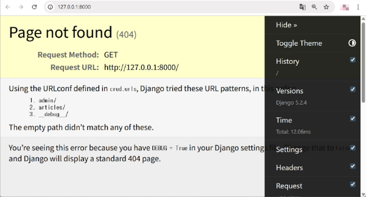

## annotate

### Django annotate
- SQL의 GROUP BY를 사용
  - 각 행(row)별로 계산된 필드를 추가함
- 쿼리셋의 각 객체에 계산된 필드를 추가
  - 기존 필드에 새로운 필드를 추가하여 계산된 값을 넣어 반환
- <u>집계 함수</u>(Count, Sum, Avg, Max, Min 등)와 함께 자주 사용됨

---
- 집계 함수: 여러 데이터를 요약하여 분석할 때 사용하는 함수

### annotate 예시

```py
Book.objects.annotate(num_authors=Count('authors'))
```

- 의미
  - 결과 객체에 'num_authors'라는 새로운 필드를 추가
  - 이 필드는 각 책과 연관된 저자의 수를 계산
- 계산
  - 결과에는 기존 필드와 함께 'num_authors' 필드를 가지게 됨
  - book.num_authors로 해당 책의 저자 수에 접근할 수 있게 됨
- 'num_authors' 속성은 새롭게 추가되는 필드 명을 의미하며 다른 명칭으로 작성해도 됨
- 만약 속성을 작성하지 않고 생략하면 'authors__count'로 필드명을 알아서 생성하게 됨
- 새롭게 생성되는 필드 'num_authors' 는 book.num_authors로 해당 책의 저자 수에 접근할 수 있음

### N+1 Problem 상황
- http://127.0.0.1:8000/articles/index-1/
  - 11 queries including 10 similar

    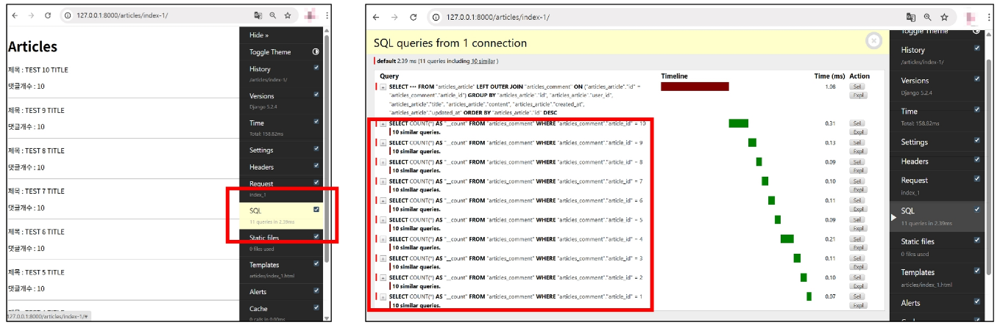

- 문제의 원인
  - 전체 게시글 쿼리 1개와 각 게시글 댓글 개수 확인을 위해 10개의 쿼리가 추가로 요청
  - 각 게시글의 댓글 개수를 계산할 때, 매 번 DB로 쿼리를 보내 댓글 데이터를 받아오고 있음
  - 만약 게시글이 100개이고 요청을 10명, 100명이 동시에 하면 그 만큼 서버에 부하가 커짐

    ```html
    <!-- index_1.html -->
    <p>댓글개수 : {{ article.comment_set.count }}</p>
    ```

### annotate 적용
- 문제 해결
  - 게시글을 조회하면서 **댓글 개수까지 한 번에 조회**해서 가져오기
    - annotate의 집계 함수를 이용해서 새로운 필드에 댓글의 개수를 추가해서 반환

  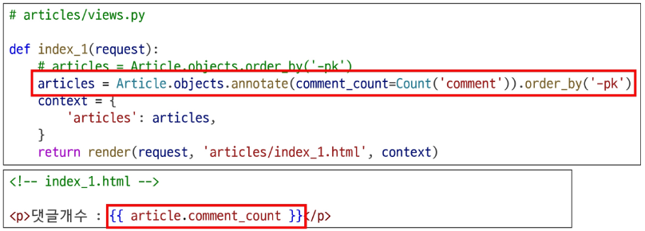

  - "11 queries including 10 similar" => **"1 query"**

    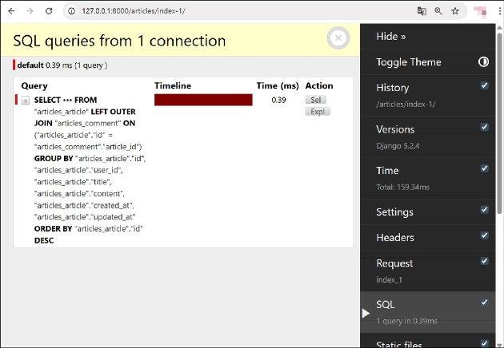
    
## select_related

### select_related
- select_related
  - ForeignKey 또는 OneToOne 관계에서 사용되는 Django ORM의 메서드
  - ForeignKey, OneToOne 관계에서 **내부적으로 INNER JOIN을 사용하여 관련 객체를 한 번에 불러옴**
  - 단일 쿼리로 관련 객체를 함께 가져와 성능을 향상

### select_related 예시

```py
Book.objects.select_related('publisher')
```

- 의미
  - Book 모델과 연관된 Publisher 모델의 데이터를 함께 가져옴
  - ForeignKey 관계인 'publisher'를 JOIN하여 단일 쿼리 만으로 데이터를 조회
- 결과
  - Book 객체를 조회할 때 연관된 Publisher 정보도 함께 로드
  - book.publisher.name과 같은 접근을 **추가적인 DB 쿼리 없이** 가능

### N+1 Problem 상황
- http://127.0.0.1:8000/articles/index-2/
  - "11 queries including 10 similar and 8 duplicates"

  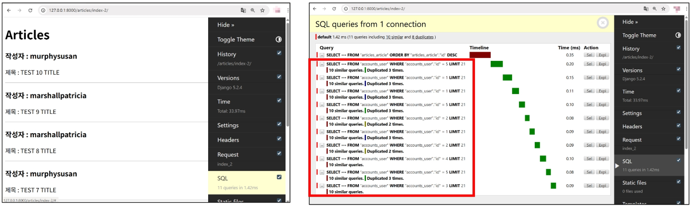

- 문제 원인
  - 게시글의 작성자를 확인하기 위해 추가로 DB에 요청되고 있음
  - 같은 작성자가 작성한 여러 개의 게시글들도 각각 작성자 정보를 조회하기 위해 동일하게 쿼리를 요청하여 중복 쿼리가 발생하고 있음
  - 해당 요청도 많은 사용자가 요청하는 경우 중복된 쿼리로 인해 서버의 성능이 저하됨

    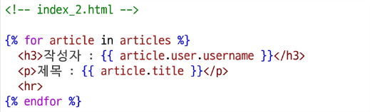

### select_related 적용
- 문제 해결
  - 게시글을 조회하면서 **유저 정보까지 한 번에 조회**해서 가져오기

    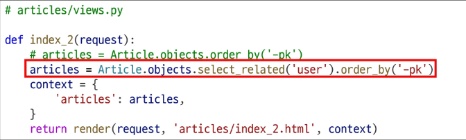

  - "11 queries including 10 similar and 8 duplicates" => "1 query"

    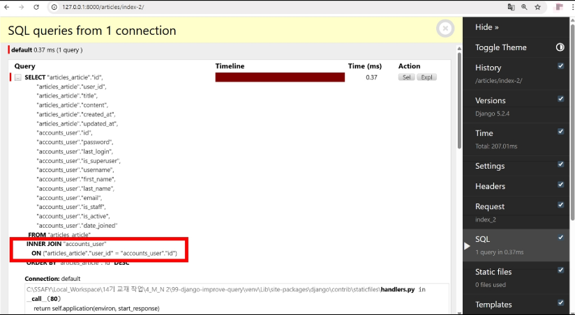

## prefetch_related

### prefetch_related
- prefetch_related
  - SQL이 아닌 Python을 사용한 JOIN을 진행
    - 관련 객체들을 미리 가져와 메모리에 저장하여 성능을 향상
  - M:N 또는 N:1 역참조 관계에서 사용
    - ManyToManyField나 역참조 관계에 대해 별도의 쿼리를 실행

### prefetch_related 예시

```py
Book.objects.prefetch_related('authors')
```

- 의미
  - Book과 Author는 ManyToMany 관계로 가정
  - Book 모델과 연관된 모든 Author 모델의 데이터를 미리 가져옴
  - Django가 별도의 쿼리로 Author 데이터를 가져와 관계를 설정
- 결과
  - Book 객체들을 조회한 후, 연관된 모든 Author 정보가 미리 로드됨
  - `for author in book.authors.all()`와 같은 반복이 추가적인 DB 쿼리 없이 실행됨

### N+1 Problem 상황
- http://127.0.0.1:8000/articles/index-3/
  - "11 queries including 10 similar"

  

- 문제 원인
  - 게시글마다 댓글이 존재하므로, 댓글 정보를 확인하기 위해 추가적인 DB 요청이 발생
  - 이러한 요청은 게시글 수에 따라 쿼리 수가 증가하게 됨
  - 다수의 사용자가 동시에 요청할 경우, 서버의 성능 저하로 이어질 수 있음

    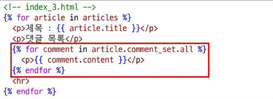

### prefetch_related 적용
- 문제 해결
  - 게시글을 조회하면서 **참조된 댓글까지 한 번에 조회**해서 가져오기

    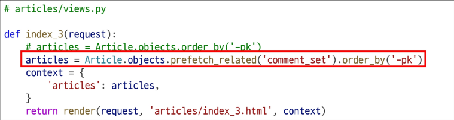

  - "11 queries including 10 similar" => "**2 queries**"

    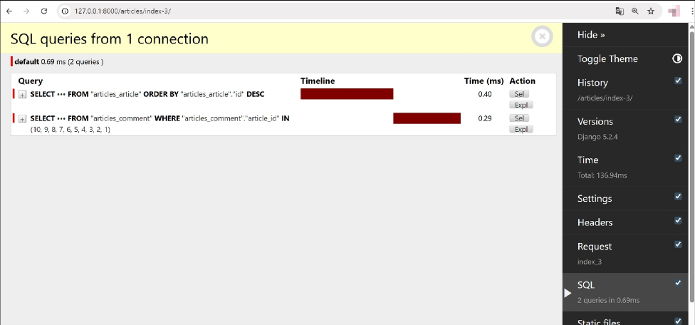

## select_related & prefetch_related

### N+1 Problem 상황
- http://127.0.0.1:8000/articles/index-4/
  - "111 queries including 110 similar and 100 duplicates"

  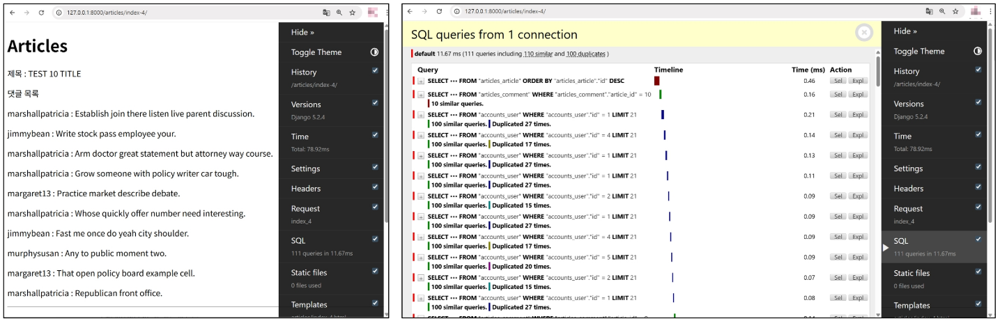

- 문제 원인
  - "게시글" + "각 게시글의 댓글 목록" + "댓글의 작성자"를 단계적으로 평가
  - 게시글 목록을 가져올 때 해당 게시글의 댓글 목록을 가져오기 위해 DB에 쿼리 요청
  - 이 때 댓글의 작성자를 확인하기 위해 댓글마다 사용자 정보도 DB로 쿼리 요청

    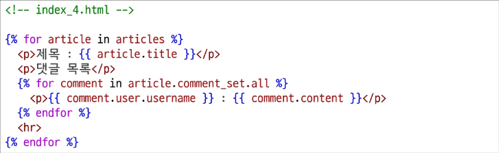

### prefetch_related 적용
- 문제 해결 1단계
  - prefetch_related를 활용하여 게시글을 조회할 때 같이 참조된 댓글까지 조회하도록 수정

    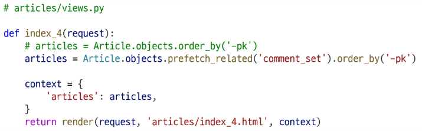

  - "111 queries including 110 similar and 100 duplicates"<br>
  => **"102 queries including 100 similar and 100 duplicates"**

  

  - 댓글을 조회할 때 각 댓글의 작성자 요청을 중복 조회하고 있음

### select_related & prefetch_related 적용
- 댓글 정보를 요청할 때 select_related를 활용하여 댓글 작성자 정보를 JOIN하여 가져온 다음 Prefetch 함수를 이용하여 게시글 정보와 같이 요청해서 가져오도록 수정

  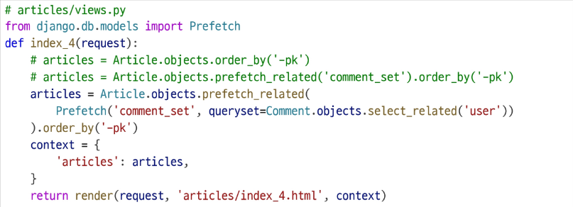

- 문제 해결 2단계
  - "102 queries including 100 similar and 100 duplicates" => **"2 queries"**

    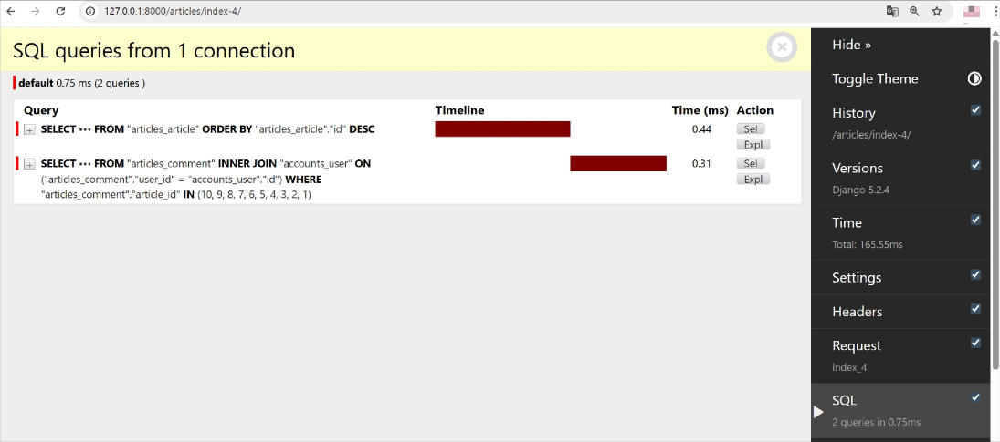

### 섣부른 최적화는 악의 근원
- "작은 효율성에 대해서는, 말하자면 97% 정도에 대해서는, 잊어버려라. 섣부른 최적화는 모든 악의 근원이다." - *도널드 커누스(Donald E. Knuth)*
  - 튜링상을 수상한 컴퓨터 과학자/수학자
  - The Art of Computer Programming의 저자

# 참고

## 'exists' method

### .exists() 특징
- QuerySet에 결과가 하나 이상 존재하는지 여부를 확인하는 메서드
  - 결과가 포함되어 있으면 True를 반환하고 결과가 포함되어 있지 않으면 False를 반환
- DB에 최소한의 쿼리만 실행하여 효율적
- 전체 QuerySet을 평가하지 않고 결과의 존재 여부만 확인
  - 해당 데이터를 불러오지 않고, DB 수준에서 빠르게 판단 가능
> 대량의 QuerySet에 있는 특정 객체 검색에 유용

### exists 적용 예시
- 좋아요 기능에 적용

  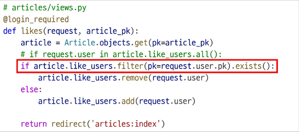

- 팔로우 기능에 적용

  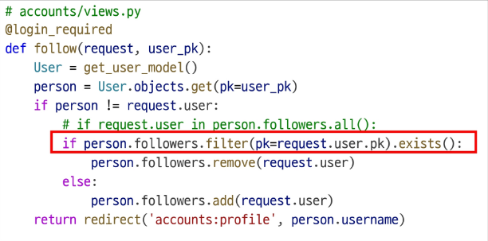

## 한꺼번에 dump 하기

### 한꺼번에 dump 하기

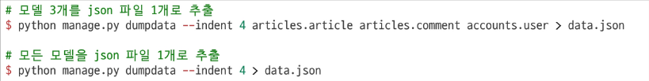

- 다만 모든 데이터를 한 번에 추출할 경우 파일 용량이 커질 수 있으므로, 필요에 따라 특정 앱만 추출하거나, 파일을 압축하여 관리하는 방법을 고려
- DB 변경이 잦은 경우 전체 추출보다는 앱 단위 또는 모델 단위로 관리하는 편이 유지보수에 용이

## loaddata 인코딩 에러

### 인코딩 문제
- JSON 파일 생성 및 로딩 시, 파일이 특정 문자 인코딩(예: UTF-8)으로 저장되지 않으면 한글 등 비ASCII 문자가 깨지거나, UnicodeDecodeError 등의 에러가 발생할 수 있음
- 윈도우 환경에서 생성한 파일을 리눅스 환경에서 로딩할 때, 혹은 반대 상황에서 인코딩 이슈가 빈번히 발생

  ```bash
  UnicodeDecodeError: 'utf-8' codec can't decode byte 0xc0 in position ...
  ```

### 인코딩 문제 해결 방법
- dumpdata 시 추가 명령어 작성

  ```bash
  $ python -Xutf8 manage.py dumpdata [생략]
  ```

- 이미 추출된 fixtures 파일이 있다면, 에디터(메모장, VSCode 등)에서 파일을 열고 인코딩을 UTF-8로 지정한 뒤 다시 저장

  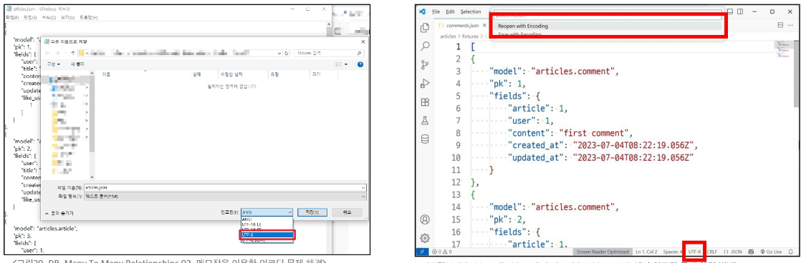

### 실습
- 팔로우 기능 구현 (ManyToMany relationship)
  - 2925. Auth M:N 복습 - 모델 작성
  - 2926. Auth M:N 복습 - 팔로우 기능 구현
  - 2607. 소설 연재 서비스 - 모델 정의
  - 2384. 소설 연재 서비스 - 구독 서비스
  - 2395. 소설 연재 서비스 - 작가 생성 기능 개선
  - 3271. 구독 기능 모델 구성하기
  - 3272. 구독 기능 구현하기