# DRF with N:1 Relation

## 사전 준비

### 사전 준비
- Comment 모델 클래스 정의

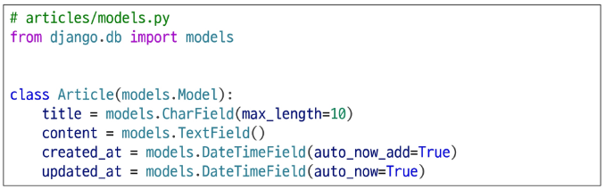

- Articles app에 정의된 모델 정보 makemigration

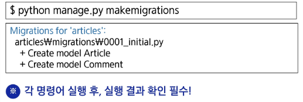

- DB 초기화

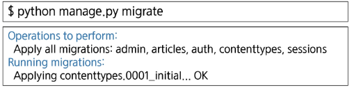

- fixtures 데이터 삽입

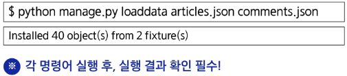

### URL 및 HTTP request method 구성

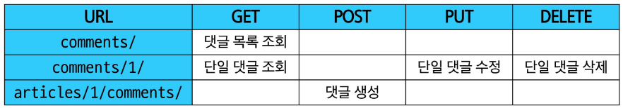

## GET method

### GET - List
- 댓글 목록 조회를 위한 CommentSerializer 정의

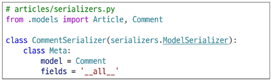

- url 작성

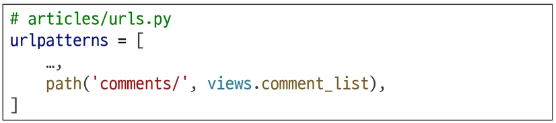

---
- ModelSerializer: Django 모델 구조를 바탕으로 자동으로 필드를 생성해주는 Serializer 클래스

---
- view 함수 작성

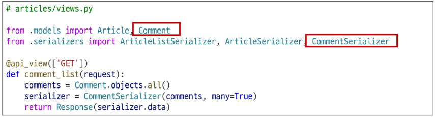

- GET http://127.0.0.1:8000/api/v1/comments/ 응답 확인

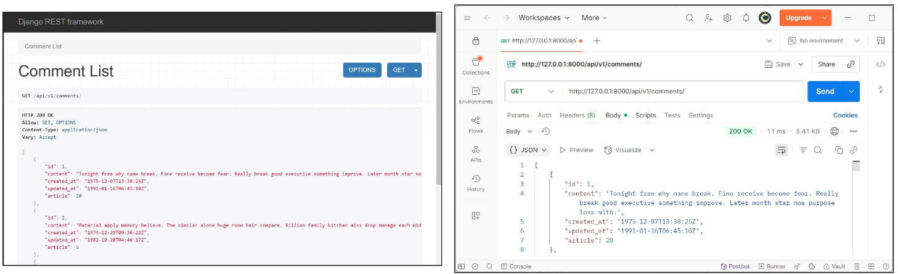

### GET - Detail
- 단일 댓글 조회를 위한 url 및 view 함수 작성

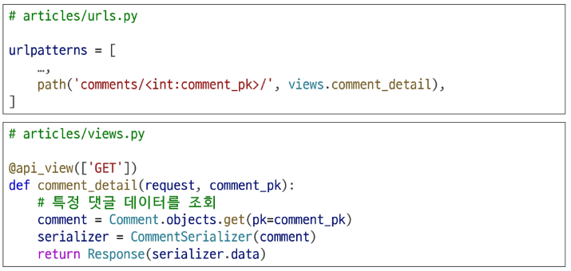

- GET http://127.0.0.1:8000/api/v1/comments/1/ 응답 확인

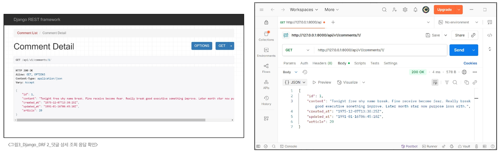

## POST method

### POST
- 단일 댓글 생성을 위한 url 및 view 함수 작성

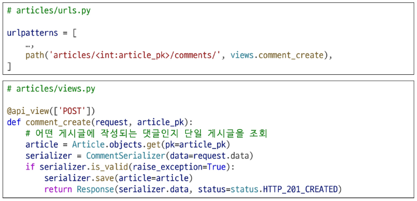

- serializer 인스턴스의 save() 메서드는 특정 Serializer 인스턴스를 저장하는 과정에서 추가 데이터를 받을 수 있음

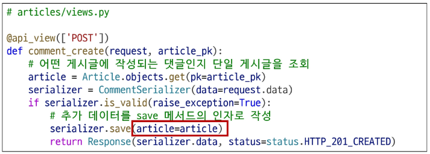

- POST http://127.0.0.1:8000/api/v1/articles/1/comments/ 응답 확인

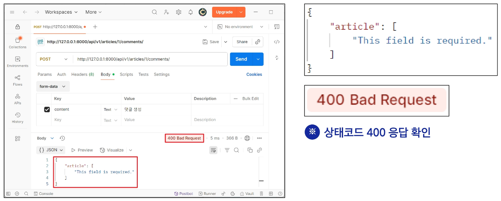

> 상태 코드 400 응답 확인

> CommentSerializer에서 외래 키에 해당하는 article field 또한 사용자로부터 입력받도록 설정되어 있기 때문에 서버 측에서는 누락되었다고 판단한 것

> **유효성 검사 목록에서 제외 필요**

> article field를 **읽기 전용 필드**로 설정하기

- 데이터를 전송 받은 시점에 "**<u>유효성 검사</u>에서 제외**시키고, **데이터 조회 시에는 출력**" 하는 필드

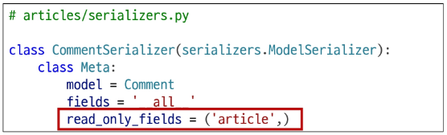

---
- 유효성 검사 (Validation): 입력된 데이터가 조건에 맞는지 확인하는 검사 과정

---
- POST http://127.0.0.1:8000/api/v1/articles/1/comments/ 재요청

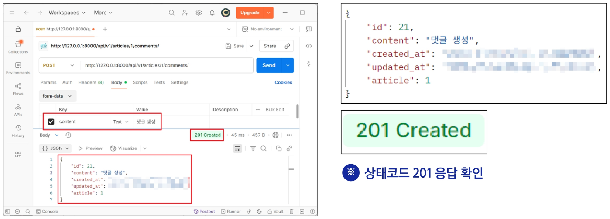

## 읽기 전용 필드

### 읽기 전용 필드 개념
- 읽기 전용 필드(read_only_fields): 서버가 **조회 요청**에 대한 응답 시에만 값을 표시하는 필드
	- 클라이언트가 입력해서는 안 되는 필드를 응답 전용 필드로 지정할 때 사용
	- view에서 값을 직접 주입할 필드는 반드시 read_only_fields로 지정해야 함
	- 그렇지 않으면 DRF는 해당 필드 값이 빠졌다고 판단해 400 에러를 발생시킴

### 읽기 전용 필드 사용 목적
- 클라이언트 측에서 직접 수정하면 안 되는 경우
- 서버 로직에 의해 자동 생성/관리되는 값 활용
- 입력은 받지 않지만 정보를 제공해야 하는 경우
- 새로운 필드 값(추가 계산, 가공)을 만들어 제공해야 하는 경우

### 읽기 전용 필드 특징 및 주의사항
- 유효성 검사에서 제외됨
	- 읽기 전용 필드는 클라이언트가 보내는 요청 데이터에서 고려되지 않으므로, 유효성 검사 대상에서 제외됨
  - 즉, 클라이언트가 해당 필드에 값을 넣어도 무시되며 검증 오류를 일으키지 않음
- 생성/수정 요청 모두에서 적용 가능
  - 읽기 전용 필드라 해서 생성(POST) 단계에서만 무의미한 것은 아님
  - 수정(PUT) 요청에서도 해당 필드는 여전히 클라이언트 입력을 받지 않고, 응답 시에만 노출됨
  
## DELETE & PUT method

### DELETE & PUT
- 단일 댓글 삭제 및 수정을 위한 view 함수 작성

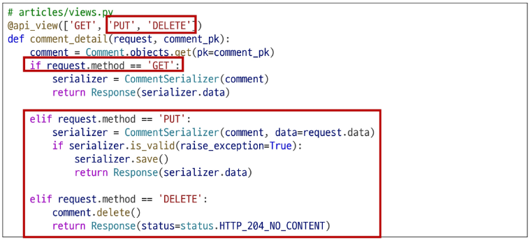

- PUT http://127.0.0.1:8000/api/v1/comments/{{ comment_pk }} 응답 확인

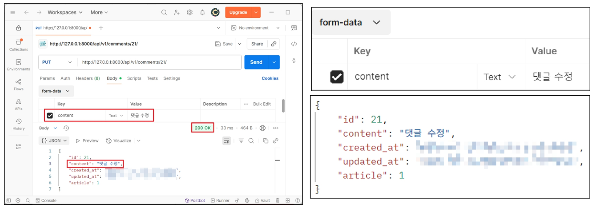

- DELETE http://127.0.0.1:8000/api/v1/comments/{{ comment_pk }} 응답 확인

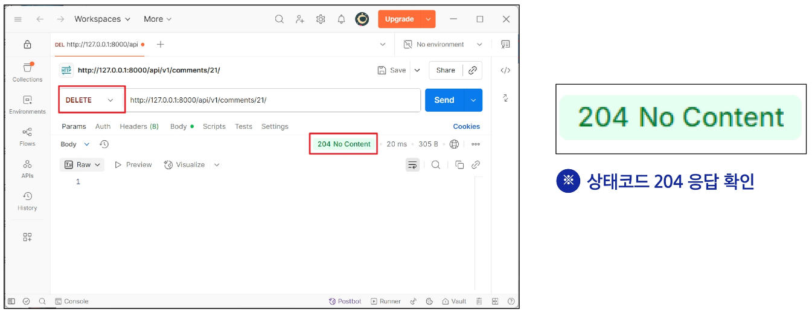

## 응답 데이터 재구성

### 댓글 조회 시 게시글 출력 내역 변경
- 댓글 목록 조회 시 게시글 번호만 제공해주는 것이 아닌 **'게시글의 제목'** 까지 제공하기

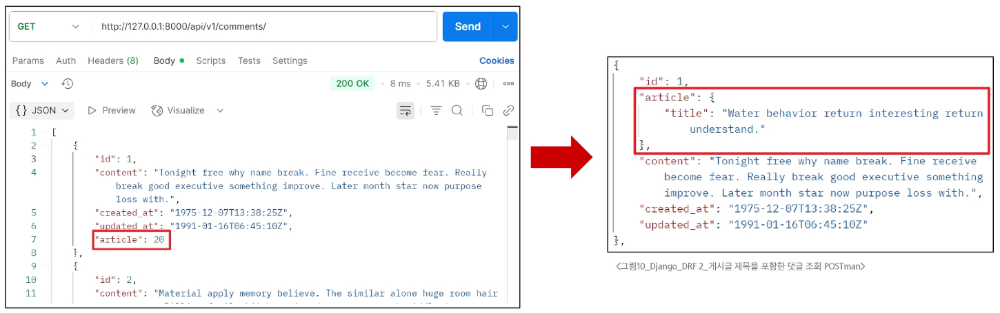

- Comment 모델은 Article을 참조하고 있음
  - Comment가 article과 N:1 관계를 맺고 있고, Django는 기본적으로 이 관계를 통해 숫자(id) 값만 응답에 포함

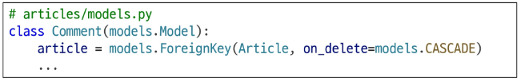

- CommentSerializer는 Comment의 정보를 가지고 있음
  - Comment 모델이 Article을 참조하고 있어, 그 정보를 id로 field에 제공할 수 있는 것

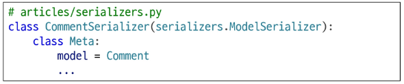

- Serializer는 DRF에서 응답 구조를 결정하는 주체
  - Serializer를 통해 어떤 필드를 포함할지 **직접 지정**하여 사용하고 있음

    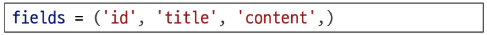
  
  - 또한, 특정 필드를 **어떤 형식**으로 보여줄 지도 지정하여 사용할 수 있음
  - 즉, **article** 필드가 **"id가 아닌 게시글의 제목"** 을 보여주도록 지정할 수도 있음
- 하지만, CommentSerializer는 Comment의 정보만 가지고 있을 뿐, Article에 대한 정보는 없음
  - article의 정보를 포함하고 있고, 그 중 **title 필드의 정보만 반환하는** Serializer를 별도로 정의해야 함

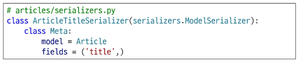

- ArticleTitleSerializer는 어디에 정의해야 할까?
  - **CommentSerializer**에서만 사용할 용도라면, 굳이 독립적으로 선언할 필요 없음
  - **코드의 응집도**를 높이고, **명확한 범위를 지정**하기 위해서 **CommentSerializer** 내부에 정의
- Comment 모델의 article 필드를 ArticleTitleSerializer로 재정의
  - 이제, article 필드는 게시글의 title 필드만 포함한 구조로 응답

    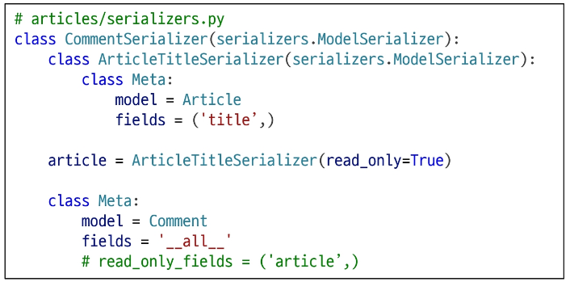

- GET http://127.0.0.1:8000/api/v1/comments/1/ 응답 확인

  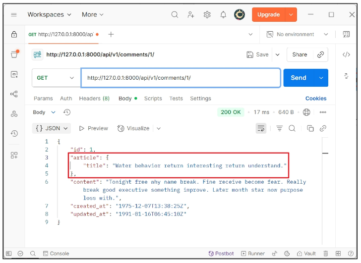

## 읽기 전용 필드 주의사항

### 읽기 전용 필드 지정 주의사항
- 특정 필드를 재정의 혹은 추가한 경우 read_only_fields는 동작하지 않음
- 이런 경우 새로운 필드에 read_only 키워드 인자로 작성해야 함

  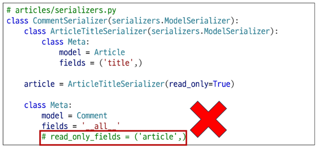

### read_only_fields 속성과 read_only 인자
- read_only_fields
  - 기존 외래 키 필드 값을 그대로 응답 데이터에 제공하기 위해 지정하는 경우
- read_only
  - 기존 외래 키 필드 값의 결과를 다른 값으로 덮어쓰는 경우
  - 새로운 응답 데이터 값을 제공하는 경우

# 역참조 데이터 구성

### Article -> Comment 간 역참조 관계를 활용한 JSON 데이터 재구성
- 아래 2가지 사항에 대한 데이터 재구성하기
  1. 단일 게시글 조회 시 **해당 게시글에 작성된 댓글 목록**도 함께 붙여서 응답
  2. 단일 게시글 조회 시 **해당 게시글에 작성된 댓글 개수**도 함께 붙여서 응답

## 단일 게시글 + 댓글 목록

### 1. 단일 게시글 + 댓글 목록
- Nested relationships (역참조 매니저 활용)
  - 모델 관계 상으로 **참조하는 대상(N)**은 **참조되는 대상(1)**의 표현에도 포함되거나 중첩될 수 있음
  - Comment가 Article에 대한 정보를 article field를 사용하여 표현하였듯, Article은 자신을 참조하고 있는 comment들에 대한 정보를 역참조 매니저를 통해 표현할 수 있음

    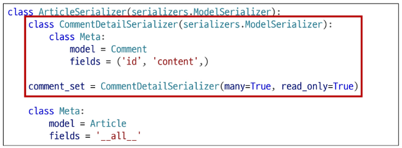

- GET http://127.0.0.1:8000/api/v1/articles/2/ 응답 확인

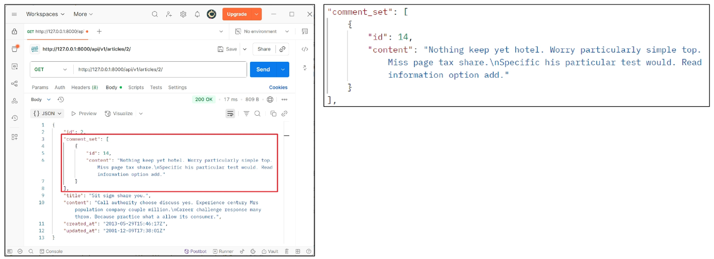

## 단일 게시글 + 댓글 개수

### 단일 게시글 조회 시, 댓글 개수도 함께 제공하고 싶다면?
- 기본적으로 게시글(Article)을 조회하면 참조 중인 댓글(Comment)의 개수는 알 수 없음
  - Comment 모델과의 관계는 Article.comment_set으로 연결되지만, **댓글의 개수는 저장하는 별도 필드**는 Article 모델에 정의한 적 없기 때문
- 따라서, 댓글 수를 응답하려면 **직접 계산해서 응답에 포함**시켜야 함

### View 로직 개선: annotate 사용
- View에서 Article 객체를 조회할 때 annotate를 활용해 num_of_comments 필드를 추가
  - annotate는 Django ORM 함수로, SQL의 집계 함수를 활용하여 쿼리 단계에서 데이터 가공을 수행
- View에서 Article 객체를 조회할 때 annotate를 활용해 num_of_comments 필드를 추가
- 다음과 같이 댓글 수를 세어 num_of_comments라는 필드를 추가
  - 이제 serializer.data가 반환하는 article 객체에는 num_of_comments라는 "주석(annotate) 필드"가 포함되어 있음

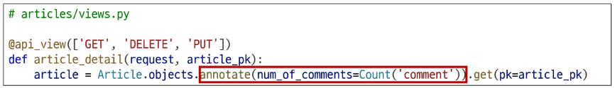

> Count('comment') 에서 'comment'는 Article을 참조하고 있는 모델 Comment의 소문자 표기

### annotate를 사용하여 추가한 "주석 필드"를 serializer에 추가하려면?
- 단순히 fields = '__all__' 만으로는 annotate된 필드가 포함되지 않음
  - annotate()는 실제 모델 필드를 생성하지 않기 때문
  - annotate()는 쿼리 시점에만 존재하는 **임시 필드를 추가하는 기능**
  - 즉, Article 모델 클래스에는 num_of_comments라는 필드가 실제로 존재하지 않음
- __all__은 **모델의 필드 기준으로 작동**하기 때문에, annotate로 만들어진 필드는 여기에 포함되지 않음
- 이런 동적으로 계산된 필드를 응답에 포함하려면, SerializerMethodField를 사용해야 함

### Serializer 개선: SerializerMethodField 사용
- SerializerMethodField는 **읽기 전용 필드를 커스터마이징** 하는데 사용
- 이 필드를 선언한 뒤 get_<필드명> 메서드를 정의하면, 해당 메서드의 반환 값이 직렬화 결과에 포함됨

  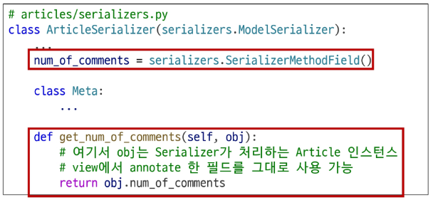

- 이제 serializer.data 호출시, get_num_of_comments 메서드가 실행되어 num_of_comments 값이 자동으로 응답할 데이터 필드에 포함되어 제공됨
- 추가적으로 view에서 data를 딕셔너리로 변환하거나 수정할 필요 없이, serializer.data를 바로 반환해도 최종 JSON 응답에 num_of_comments 값이 반영됨

  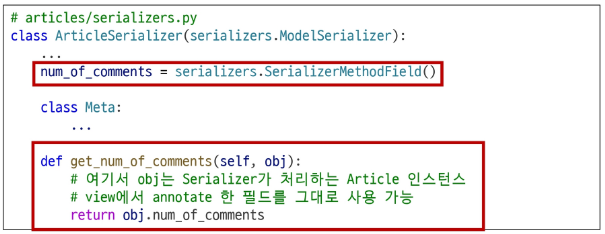

### 댓글 개수 데이터 응답 확인
- GET http://127.0.0.1:8000/api/v1/articles/3/ 응답 확인

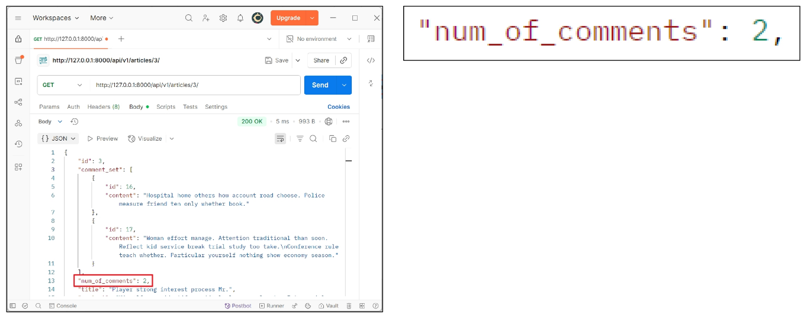

## SerializerMethodField

### SerializerMethodField란?
- SerializerMethodField: Serializer에서 추가적인 데이터 가공을 하고 싶을 때 사용
  - 예를 들어 특정 필드 값을 조합해 새로운 문자열 필드를 만들거나 부가적인 계산 (비율, 합계, 평균)을 하는 경우에 활용할 수 있음

### SerializerMethodField 동작 원리
- SerializerMethodField를 Serializer 클래스 내에서 필드로 선언하면, DRF는 get_<필드명>이라는 이름을 가진 메서드를 자동으로 찾음
- 예를 들어, full_name = serializer.SerializerMethodField()라고 선언하면, DRF는 get_full_name(self, obj) 메서드를 찾아 해당 값을 직렬화 결과에 넣어줌

  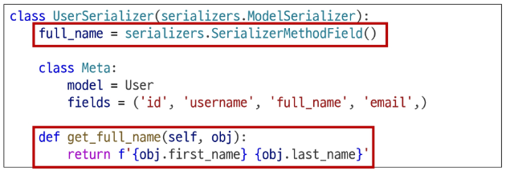

- obj는 현재 직렬화 중인 모델 인스턴스이며, 이 메서드에서 obj의 속성이나 annotate된 필드를 활용해 새 값을 만들 수 있음

  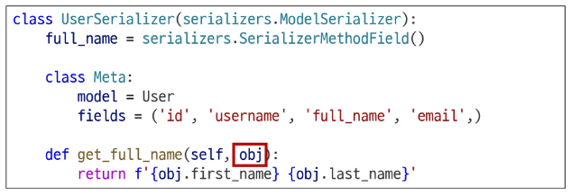

### SerializerMethodField 주의사항
- **읽기 전용**
- 생성(POST), 수정(PUT) 요청 시에는 사용되지 않음
- get_메서드는 반드시 (self, obj) 형태로 정의해야 하며, obj는 현재 직렬화 중인 모델 인스턴스를 의미

  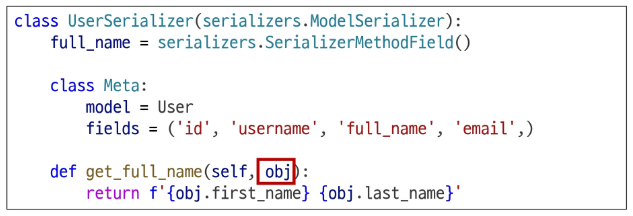

### SerializerMethodField 사용 목적
- 유연성
  - 다양한 계산 로직을 손쉽게 추가 가능
- 가독성
  - 데이터 변환 과정을 Serializer 내부 메서드로 명확히 분리
- 유지보수성
  - view나 model에 비해 Serializer 측 로직 변경이 용이
- 일관성
  - view에서 별도로 data 수정 없이도 직렬화 결과를 제어

## 역참조 데이터 구성 참고

### 역참조 매니저 활용 참고
> 만약, 역참조 매니저명을 변경하였다면, Serializer에서도 변경해야 함

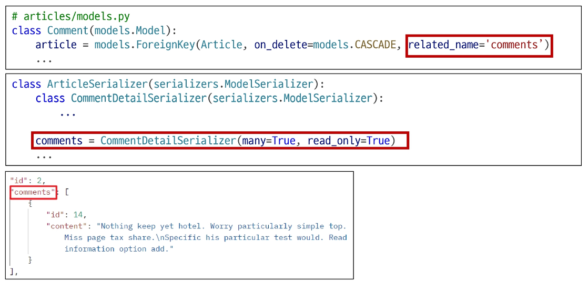

### annotate 활용 참고
> 만약, 역참조 매니저명을 변경하였다면, annotate에서도 변경해야 함

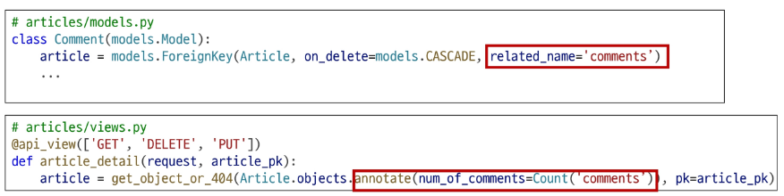

# API 문서화

## OpenAPI Specification

### API 문서화
- OpenAPI Specification(OAS): RESTful API를 설명하고 시각화하는 표준화된 방법

> API에 대한 세부사항을 기술할 수 있는 공식 표준

### RESTful API를 설명하고 시각화하는 표준화된 방법

- OAS 기반 API에 대한 문서를 생성하는데 도움을 주는 오픈소스 프레임워크

## 문서화 활용

### drf-spectacular 라이브러리
- DRF 위한 OpenAPI 3.0 구조 생성을 도와주는 라이브러리

  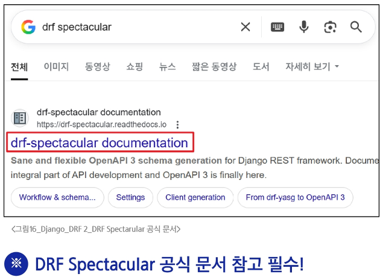

- 설치 및 등록

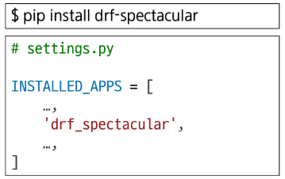

- 관련 설정 코드 입력 (OpenAPI 구조 자동 생성 코드)

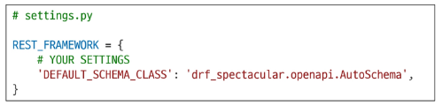

- swagger, redoc 페이지 제공을 위한 url 작성

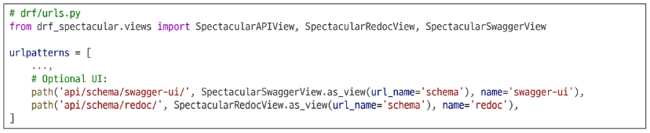

- http://127.0.0.1:8000/api/schema/swagger-ui/ 페이지 확인

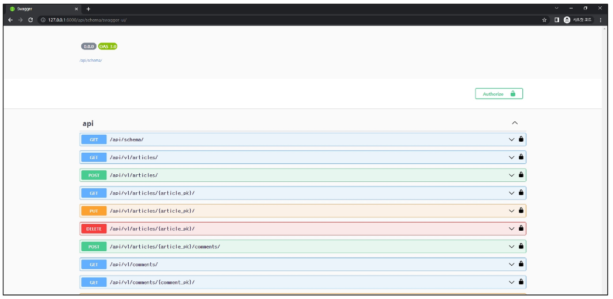

- http://127.0.0.1:8000/api/schema/redoc/ 페이지 확인

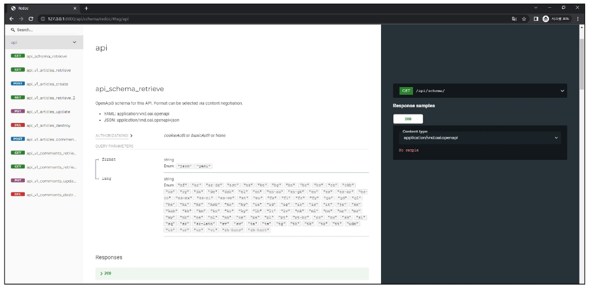

### "설계 우선" 접근법
- OAS의 핵심 이점
- API를 먼저 설계하고 명세를 작성한 후, 이를 기반으로 코드를 구현하는 방식
- API의 일관성을 유지하고, API 사용자는 더 쉽게 API를 이해하고 사용할 수 있음
- 또한, OAS를 사용하면 API가 어떻게 작동하는 지를 시각적으로 보여주는 문서를 생성할 수 있으며, 이는 API를 이해하고 테스트하는데 매우 유용
> 이런 목저으로 사용되는 도구가 Swagger-UI 또는 ReDoc

# 참고

## 올바르게 404 응답하기

### HTTP Response Shortcuts
- Django shortcuts functions: render(), redirect(), **get_object_or_404()**, **get_list_or_404()**
- get_object_or_404()
  - 모델 manager objects에서 get()을 호출하지만, 해당 객체가 없을 땐 기존 DoesNotExist 예외 대신 **Http404를 raise** 함

### get_object_or_404 적용 예시

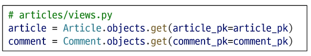

- 기존 작성 방식
  - 조회 대상이 없는 경우, 500 Server Error 반환

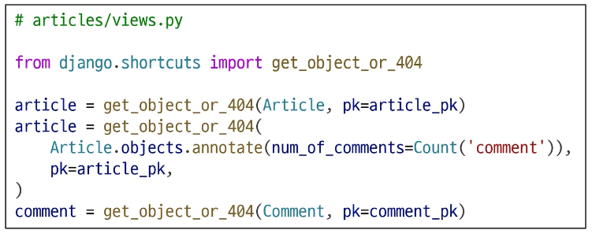

- get_object_or_404 적용
  - 조회 대상이 없는 경우, 404 Not Found 반환

### HTTP Response Shortcuts
- get_list_or_404()
  - 모델 manager objects에서 filter()의 결과를 반환하고, 해당 객체 목록이 없을 땐 **Http404를 raise** 함

### get_list_or_404 적용 예시

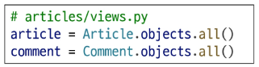

- 기존 작성 방식
  - 조회 대상 목록이 없어도, 200 OK 반환

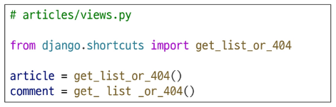

- get_list_or_404 적용
  - 조회 대상이 없는 경우, 404 Not Found 반환

### 왜 사용해야 할까?
- get_object_or_404()를 사용하지 않은 경우
  - 클라이언트에게 "서버에 오류가 발생하여 요청을 수행할 수 없다"라는 원인이 정확하지 않은 에러를 제공한 경우, **클라이언트의 요청이 올바르지 않았음에도 서버의 문제로 오해할 수 있음**
- get_list_or_404()를 사용하지 않은 경우
  - 조건에 맞는 데이터가 하나도 없는데도 단순히 "빈 리스트를 반환"하면, **클라이언트는 요청이 올바르지 않았는지, 아니면 진짜 데이터가 없는 건지 명확하게 판단하기 어려움**
- 적절한 예외 처리를 통해 클라이언트에게 **보다 정확한 에러 현황을 전달**하는 것은 매우 중요한 개발 요소임
  - 조건에 맞는 객체가 하나도 없을 경우, 명확하게 404 응답을 반환해야 함
  - 이를 통해, 클라이언트에게 "해당 조건에 맞는 리소스가 존재하지 않는다"는 정확한 상황을 전달할 수 있음

## View와 Serializer의 역할

### View와 Serializer
- view나 queryset 로직에서는 비즈니스 로직(데이터 가공, annotate, 필터링)을 처리
- serializer는 그 결과물을 직렬화하는 역할에 집중하는 것이 일반적인 권장사항
- 복잡한 query나 로직은 **View 함수에서 진행**
  - 여러 모델을 조인하거나 복잡한 집계가 필요한 경우 View 함수에서 처리
  - 필요한 경우 View 함수에서 select_related()나 prefetch_related()를 사용하여 query를 최적화

## DRF 학습 이유

### 왜 DRF를 배웠을까?
- 백엔드와 프론트엔드의 분리 경험
  - 기존 Django 템플릿 기반의 서버 렌더링 방식을 벗어나, 백엔드(데이터/로직)와 프론트엔드(UI)를 명확히 분리하는 패턴을 간접적으로 체험
- 표준화된 API 구축 역량 확보
  - DRF를 통해 RESTful API를 손쉽게 만들고 관리하는 방법을 학습했는데, 이는 다양한 클라이언트(웹, 모바일 앱, 외부 서비스)와 연동하는데 필수적인 능력
- 프론트엔드 기술과의 연결 고리
  - 앞으로 학습할 Javascript 및 Vue는 주로 API를 통해 데이터를 받아와 화면을 구성함
  - DRF로 구축한 일관된 API는 Vue 등 프론트엔드 프레임워크와 매끄럽게 호환됨

### 실습
- DRF with N:1 Relation
  - 2946. 도서 관리 API 만들기 - 도서 리뷰 모델 정의
  - 2948~2952. 충전소 관리 API 서비스 만들기
  - 3067. DRF 서버에 POSTman으로 요청 보내기
  - 3068. DRF에서 CRUD 구현하기
- 역참조 데이터 구성
  - 2947. 도서 관리 API 만들기 - 제공 정보 개선
  - 3069. DRF에서 1:N 모델 구축하기