# 데이터 베이스 모델링

## 개요

### Database Modeling
- DB 시스템을 구축하기 위해 **데이터의 구조와 관계, 제약 조건** 등을 설계하여 **효율적이고 일관성 있는 DB**를 만들기 위한 과정
- 모델링을 통해 **성능, 무결성, 신뢰성**을 보장할 수 있음

### Database Modeling의 중요성
- 효율성
  - DB 구조를 잘 설계하면 쿼리 성능과 저장 효율이 향상
- 일관성
  - 중복과 이상 현상을 최소화하여, 데이터가 서로 모순되거나 충돌하지 않도록 함
- 무결성 보장
  - 무결성 제약 조건을 모델링 단계에서 설정해두어, 부적절한 데이터를 방지

## 무결성 제약 조건

### 무결성
- 무결성: DB가 잘못된 데이터의 삽입/수정/삭제로부터 보호되어, **데이터의 일관성과 신뢰성**을 유지하는 것

### 대표적인 무결성 제약 조건
1. 개체 무결성
2. 참조 무결성
3. 도메인 무결성

### 1. 개체 무결 (Entity Integrity)
- **기본 키(Primary Key)**가 유일(중복 불가)하고 'NULL' 값을 허용하지 않는 제약
- 핵심 원칙
  1. 각 레코드는 유일한 식별자를 가져야 함 (PK 중복 불가)
  2. 기본 키는 NULL 값을 가질 수 없음 (필수 값)

    

### 2. 참조 무결성 (Referential Integrity)
- **외래 키와 관련된 제약**으로, **존재하지 않는 기본 키**를 참조하지 못 하도록 하는 규칙
- 핵심 원칙
  1. 외래 키는 참조 대상 테이블의 기본 키 값을 참조하거나 'NULL'을 가질 수 있음
  2. 참조 대상 테이블에 존재하지 않는 기본 키 값은 사용할 수 없음
  3. 외래 키로 연결된 레코드를 삭제/수정할 때, 연쇄 작업(ON DELETE CASCADE 등) 또는 예외 처리를 통해 무결성 유지

    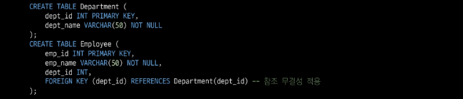

### 3. 도메인 무결성 (Domain Integrity)
- 각 속성(컬럼)이 **정의된 도메인(값의 범위, 형식)을 벗어나지 않도록 하는 제약
- 핵심 원칙
  1. 속성별로 데이터 타입, 길이, 범위 등을 정의해야 함
  2. 값이 해당 범위(도메인)를 벗어나면 삽입/수정이 제한되거나 오류 발생

    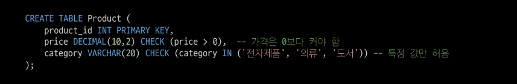

### 그 외 무결성 제약 조건
4. 고유성(UNIQUE)
  - 특정 컬럼의 값이 테이블 내에서 중복되지 않도록 제한
  - 예: 이메일 주소는 한 사용자가 하나만 등록 가능
5. NULL 무결성 (NOT NULL)
  - 특정 컬럼이 NULL 값을 가질 수 없도록 하는 제약
6. 일반 무결성 (General Integrity)
  - 위의 특정 제약조건 외에도, 비즈니스 로직에 따라 추가로 정의하는 무결성 규칙
  - 예: 은행 잔고가 0 미만이 되지 않도록 하거나, 재고 수량이 음수가 되지 않도록 하는 규칙

## 모델링 과정 4단계

### 데이터베이스 모델링 진행
- 요구사항 수집 및 분석 -> 개념적 설계 -> 논리적 설계 -> 물리적 설계

### 1. 요구사항 수집 및 분석
- 어떤 종류의 데이터를 정리하는지 정보 수집하고 어떤 작업을 수행해야 하는지 파악하는 단계
  - 개체 (Entity)
    - 업무에 필요하고 유용한 정보를 저장하는 집합적인 것
    - 예: 고객, 상품
  - 속성 (Attribute)
    - 관리하고자 하는 것의 의미를 더 이상 작은 단위로 분리되지 않은 데이터 단위
    - 예: 고객명, 고객 전화번호, 상품명, 상품 가격
  - 관계 (Relationship)
    - 객체 사이의 논리적인 연관성을 의미하는 것
    - 예: 고객은 다수의 상품을 주문, 상품은 다수의 고객들에게 판매될 수 있음

### 2. 개념적 서례
- 요구사항을 기반으로 DB의 **개념적 모델**을 설계
- 개체(Entity)와 관계(Relationship)를 식별하고, 개체 간의 관계를 정의하여 ER Diagram을 작성

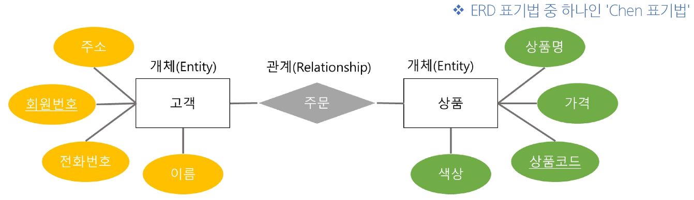

### ERD 표기 방법

- 까마귀 발 모델 (Crow's Foot Model) 표기법

  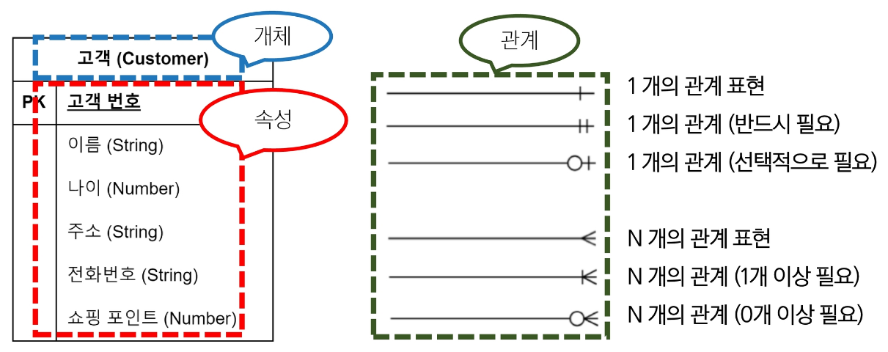

- N:M 관계 예시

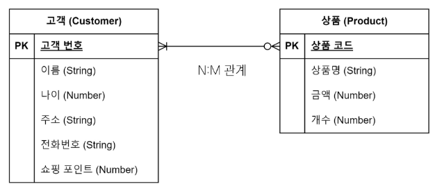\

### 3. 논리적 설계
- "개념적 설계(ERD) 단계에서 정한 데이터의 구조를 실제 DB가 이해할 수 있는 테이블 형태로 변환하는 과정"
  - 예를 들어 개념적 설계에서 도출된 N:M 관계는, 논리적 설계 단계에서 '중개 테이블'을 생성하여 두 개의 다대일(N:1) 관계로 해소해야 함
  - 개념적 설계 (N:M) 고객 (N) <-> (M) 상품
  - 논리적 설계 (1:N, N:1) 고객 (1) -> (N) 주문 (N) <- (1) 상품
- 개념적 설계를 기반으로 DB의 **논리적 구조**를 설계
- 테이블, 칼럼, 제약 조건 등과 같은 구체적인 DB 개체를 정의
- 정규화를 수행하여 데이터의 중복을 최소화하고 일관성을 유지

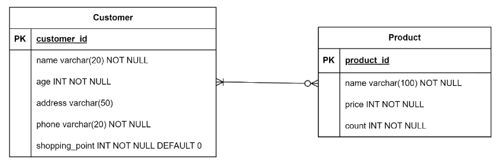

### 4. 물리적 설계
- 논리적 설계를 기반으로 DB를 실제 **저장 및 운영**할 수 있는 형태로 변환하는 단계
- 테이블의 인덱스, 파티션, 클러스터링 등 물리적인 구조와 접근 방식을 결정
- 보안, 백업 및 복구, 성능 최적화 등을 고려하여 DB를 설정

# 데이터베이스 정규화

## 정규화

### 정규화
- 정규화(Normalization): **데이터 중복을 최소화**하고, **이상 현상을 예방**하며, DB 구조 변경 시 **재작업을 줄이는 목적**으로 **테이블을 구조화**하는 과정

### 정규화 목적
1. 중복 최소화
  - 불필요한 중복 데이터를 제거해 일관성 유지
2. 이상 현상 방지
  - 삽입, 갱신, 삭제 작업 시 발생할 수 있는 불일치 문제 예방
3. 유연성 향상
  - DB 구조 변경 시 영향을 받는 영역을 최소화하여 유지보수성을 높임

## 이상 현상

### 이상 현상
- 이상 현상(Anomaly): DB를 비정상적으로 설계했을 때 중복된 데이터가 많아져 **삽입, 갱신, 삭제** 등의 연산에서 **비일관성**이 생기는 문제

### 이상 현상 종류
1. 삽입 이상 (Insertion Anomaly)
  - 새로운 데이터를 삽입하기 위해 **불필요한 데이터도 함께** 삽입해야 하는 문제
2. 갱신 이상 (Update Anomaly)
  - 중복된 데이터 중 일부만 변경되어 **데이터 불일치가 발생**하는 문제
3. 삭제 이상 (Deletion Anomaly)
  - 어떤 데이터를 삭제할 때, **반드시 있어야 하는 정보**까지 같이 사라지는 문제

### 삽입 이상
- Recipe table에 삽입된 데이터의 정보가 아래와 같을 때 "마늘" 식재료가 추가되어야 한다면, 마늘 정보를 어디에 삽입해야 하는가?

- "마늘" 재료만 미리 등록하고 싶어도, 요리 이름이 필요하다는 이유로 가짜 name과 description 등을 만들어야 함
- 새로운 재료 또는 부분적인 정보만을 삽입하기 위해 불필요한 레시피 정보까지 억지로 입력해야 하는 상황이 "삽입 이상"

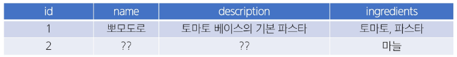

### 갱신 이상
- "파스타"라는 재료명을 "스파게티"로 변경하고자 하는 상황
- 현재 테이블에서 재료가 문자열로 저장되고 있으므로, ingredients 컬럼 내 "파스타"라는 부분 문자열을 모두 찾아서 일괄 변경해야 함
- 여러 요리에 "토마토, 파스타", "파스타, 치즈, 면" 등으로 지정되어 있을 수 있는데, 어떤 행은 업데이트가 누락되면, "파스타"와 "스파게티"가 혼재하는 불일치 상황 발생

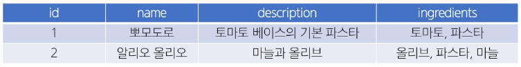

- 중복된 데이터가 여러 행에 문자열 형태로 산재해 있어, 수정 시 모두 찾아서 변경해야 함.
- 일부만 수정하면 불일치(데이터 모순)가 생기는 문제를 갱신 이상이라 함

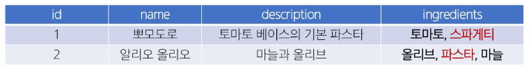

### 삭제 이상
- "명란 파스타" 정보를 삭제하고자 함
- 이 레시피의 식재료 컬럼에는 올리브, 스파게티, 명란젓이 포함되어 있었음
- 만약 이 테이블에서만 "명란젓"이란 재료 정보를 유일하게 보관하고 있었다면, 해당 행 삭제와 함께 "명란젓" 재료 자체에 대한 정보도 소실되는 결과 초래

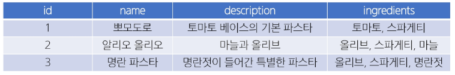

- 특정 레시피(행)를 지울 때, 그 행 안에 있는 재료에 대한 정보까지 같이 사라짐
- 실제로는 "재료 정보" 자체는 남겨두고 싶었지만, 테이블 구조상 둘이 붙어 있어서 불필요하게 삭제되는 것이 삭제 이상

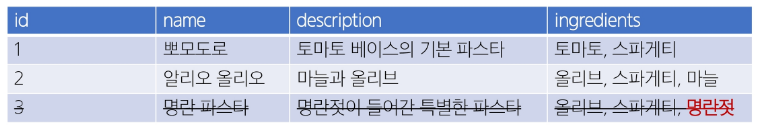

### 문제 원인
- 하나의 테이블에 요리에 대한 설명, 식별자, 재료 정보 등이 중복된 구조로 뒤섞여 있음
- 재료와 레시피의 관계가 1:N or N:M일 수도 있음에도, 단일 필드(ingredients)로 모아둔 상태

### 해결 방법 (정규화)
1. 재료(Ingredient)를 별도 테이블로 분리
2. 레시피(Recipe) 테이블 <-> 재료(Ingredient) 테이블 간 N:M(ManyToMany) 구조를 설정
  - 예: 중개 테이블 Recipe_Ingredient(recipe_id, ingredient_id)
3. 결과
  - 삽입 이상: "마늘"만 등록할 수 있음(Ingredient 테이블). 레시피 미정이어도 문제 없음
  - 갱신 이상: "파스타" -> "스파게티"를 Ingredient 테이블에서 한 번만 수정하면, 모든 레시피에 반영
  - 삭제 이상: 레시피 삭제 시 ingredient 테이블의 "명란젓"은 남아있을 수 있음 
  (모두 연결 끊긴 경우에만 자동 삭제 여부를 결정할 수 있음)

## 정규화 종류

### 정규화 종류
- 일반적으로 1NF(제1정규형)에서 시작해 2NF, 3NF 순으로 진행하며, 필요에 따라 BCNF 이상(4NF, 5NF, 6NF)까지 고려하기도 함
- 실무에서는 보통 3NF 또는 BCNF까지 도달하면 정규화가 이뤄졌다고 표현

### 각 정규화 단계
- 제 1 정규형 (1NF)
  - 각 속성(컬럼)이 **원자 값(Atomic Value), 즉 하나의 값**만 가져야 함
- 제 2 정규형 (2NF)
  - 제 1 정규형을 만족하면서 PK가 아닌 모든 속성이 PK에 **완전 함수 종속**되어야 한다.
- 제 3 정규형 (3NF)
  - 제 2 정규형을 만족하면서 모든 속성이 PK에 **이행적 함수 종속이 되지 않아야** 한다.
- BCNF (Boyce Codd Normalization Form)
  - 제 3 정규형을 만족하면서, **모든 결정자가 후보키**여야 한다.  

## 1NF

### 제 1 정규형 (1NF)
1. **각 속성(컬럼)이 원자 값(Atomic Value)**, 즉 **하나의 값**만 가져야 함
2. **중복된 컬럼**이 없어야 함
3. **각 행(row)**이 유일하게 식별될 수 있어야 함 (기본 키 존재)

  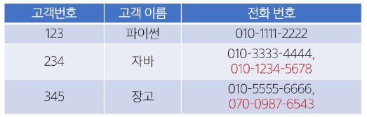

### 제 1 정규형 시도
- 2개를 초과하는 전화번호를 저장할 수 없음
- 해결을 위해 column을 추가하는 경우, 불필요한 NULL 값을 가지게 됨

  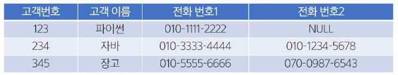

- 동일 데이터를 여러 row로 나눠서 저장하는 경우 기본키가 중복됨

  

### 제 1 정규형 결과
- 고객 번호를 참조하여, **전화번호를 저장하는 테이블을 분리**

  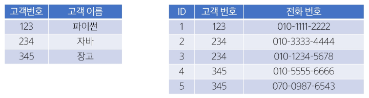

## 2NF

### 제 2 정규형 (2NF)
1. **제 1 정규형**을 만족해야 함
2. 복합 키(두 개 이상의 컬럼으로 이뤄진 기본 키)를 사용하는 테이블에서 **모든 비(非) 기본 키 속성이 기본 키의 모든 컬럼에 완전 종속**되어야 함
  - 즉, **부분 함수 종속**(기본 키 일부 컬럼만으로 해당 속성이 결정되는 것)을 제거

    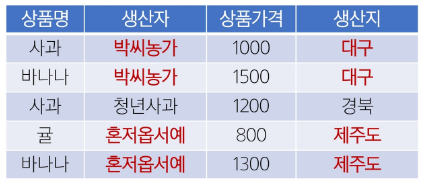

### [참고] 함수 종속성(Functional Dependency)이란?
- "테이블 내의 속성들 간의 관계를 설명하는 규칙."
- "만약 속성 A의 값을 알면 속성 B의 값을 **유일하게** 결정할 수 있을 때, 'B는 A에 함수적으로 종속된다'고 하며, **A -> B** 로 표기함."
- 예시
  - `학생` 테이블에서 `학번`을 알면 `이름`을 유일하게 알 수 있음. (`학번` -> `이름`)
  - "여기서 `학번`처럼 다른 속성을 결정하는 속성을 **결정자(Determinant)**라고 함."
- 결정자란?
  - 관계형 테이블에서 함수적 종속성 X -> Y가 성립할 때, 좌변 X를 결정자라고 부름
  - 즉, X의 값이 같으면 Y의 값도 반드시 같다는 규칙에서 "다른 값을 결정(정의)해 주는" 속성 집합

### [참고] 복합 키 예시
- **학생-과목** 예시
- '학생' 테이블의 PK는 `학생번호`
- '과목' 테이블의 PK는 `과목번호`
- 한 학생이 여러 과목을 듣고(1:N), 한 과목은 여러 학생이 수강(1:N) 
-> N:M 관계
- 이 N:M 관계를 해소하기 위해 `수강신청`이라는 중개 테이블이 필요
- `수강신청` 테이블에는 `(학생번호, 과목번호)`가 들어감
- 이 테이블에서 학생번호만 PK로 쓸 수 있나요? 
  -> 안됩니다. 한 학생이 여러 과목을 신청하면 PK 중복
- 과목번호만 PK로 쓸 수 있나요? 
  -> 안됩니다. 한 과목에 여러 학생이 신청하면 PK 중복
- 이 테이블에서 **각 행(row)을 유일하게 식별하는 값**은 무엇인가요? 
  -> "특정 학생(학생번호)이 특정 과목(과목번호)을 신청한 그 행위 자체"
- 따라서 두 값을 합친 `{학생번호, 과목번호}`가 이 테이블의 복합 기본 키가 되어야만 데이터의 유일성이 보장됨

### 제 2 정규형 진행

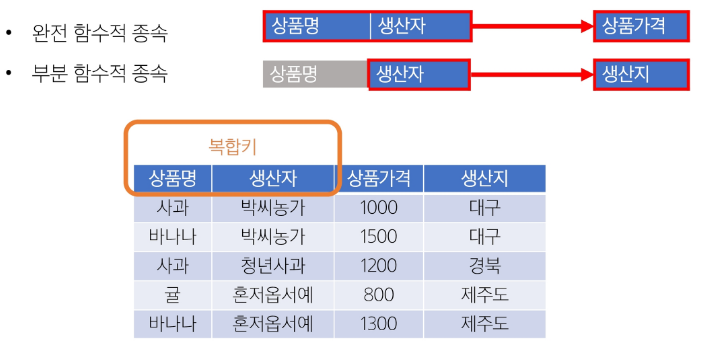

### 제 2 정규형 결과
- "생산자"와 "생산지"가 완전 함수적 종속이 되도록 테이블 분리

  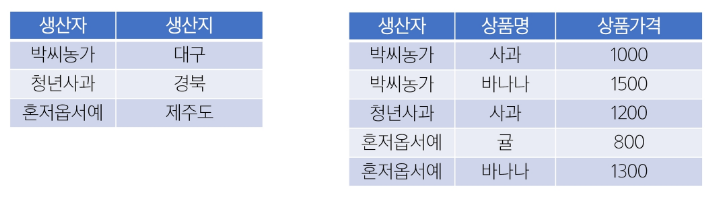

## 3NF

### 제 3 정규형 (3NF)
1. **제 2 정규형**을 만족해야 함
2. **기본 키에 대한 이행적 함수 종속**(Transitive Dependency)이 없어야 함
  - A -> B, B -> C 인 경우, A -> C를 "이행 종속"이라 부름
  - 기본 키가 아닌 속성이 다른 속성(역시 기본 키가 아닌)에 의해 결정되지 않아야 함
- 예
  - 학생 테이블에서 학과 번호 -> 학과 명 -> 대학 이름 식으로 이어진다면, "학과 번호 -> 대학 이름" 부분을 별도 테이블로 분리

### 제 3 정규형 진행
- 기본 키(PK)가 아닌 속성 간의 종속성을 제거해야 함
- 비(非) 기본 키 컬럼이 다른 비 기본 키 컬럼을 결정하면 안 됨
  - 학생번호 -> 학생 이름/학과 (학과장은 학생번호에 의해 결정 X)
  - 학과 -> 학과장 (학과장은 학과에 의해서 결정)
  - 학생번호 -> 학과 -> 학과장으로 이어지는 **이행적 함수 종속** 발생

### 제 3 정규형 결과
- "학생정보"와 "학과정보"를 별도 테이블로 분리

  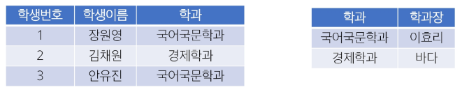

## BCNF

### BCNF (Boyce Codd Normal Form)
- 제 3 정규형을 만족해야 함
- 모든 **결정자**가 **후보 키**여야 함 (BCNF의 핵심 정의)
- 3NF 이후에도 남아있는 이상 현상을 해결하는 더 엄격한 형태
- 기본 키가 아닌 속성이 다른 컬럼을 결정할 수 없게끔 테이블을 분해

### 후보 키(Candidate Key)
- "모든 속성"을 결정하는 최소 결정자
- 한 테이블의 각 행(row)을 유일하게 식별할 수 있는 속성(또는 속성 조합) 중 최소성을 만족하는 키
- 후보 키의 조건
  1. 유일성(Unique): 테이블의 각 행을 **고유하게 식별**할 수 있어야 함
  2. 최소성(Minimality)
    - 불필요한 컬럼을 포함하지 않는 **최소한의 속성 조합**이어야 함
    - 예: 복합키가 후보키일 때, 단 하나의 컬럼이라도 빼면 유일성이 깨져야 함
- 한 테이블에 여러 후보 키가 있을 수 있으며, 그 중 하나를 Primary Key로 선택해야 함

### 후보 키 예시
- 학생번호: 각 학생을 유일하게 식별 가능 -> **후보 키**
- 주민등록번호: 각 학생을 유일하게 식별 가능 -> **후보 키**
- 전화번호: 일반적으로 유일할 가능성이 높지만, 변경될 수 있음 -> 후보 키 가능성 있음
- 이름: 동명이인이 존재할 수 있음 -> 후보 키 불가능

  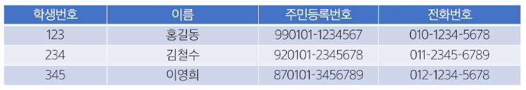

### BCNF 진행 - 예제 테이블과 가정
- 함수 종속성 (이 테이블의 규칙)
  - `{학생번호, 과목명} -> 학점` (한 학생은 한 과목에 대해 하나의 학점만 가짐)
  - `{학생번호, 과목명} -> 담당 교수` (한 학생은 한 과목을 한 교수에게만 들음)
  - `담당 교수 -> 과목명` (교수는 한 과목만 가르침)

    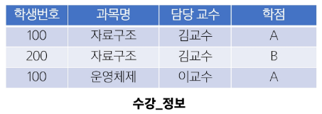

### BCNF 진행 - 후보 키 찾기
- 후보 키 1: `{학생번호, 과목명}`
  - 이 키로 `학점`(FD1)과 `담당 교수`(FD2)를 모두 결정할 수 있음 => 후보 키를 만족
- 후보 키 2: `{학생번호, 담당 교수}`
  - 이 키로 `과목명`(FD3)을 알 수 있고 `학생번호`와 방금 안 `과목명`을 조합해 `학점`(FD1)도 결정할 수 있음

    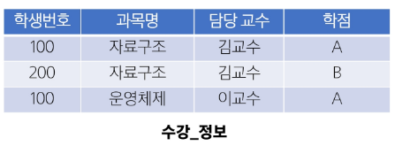

### BCNF 진행 - BCNF 위반 탐지
- "모든 결정자(화살표 왼쪽)는 후보 키(또는 후보 키를 포함하는 슈퍼 키)여야 한다."
1. `{학생번호, 과목명} -> 담당 교수, 학점` => 결정자가 후보 키인가? YES
2. `{학생번호, 담당 교수} -> 과목명, 학점` => 결정자가 후보 키인가? YES
3. `담당 교수 -> 과목명` => 결정자가 후보 키인가? NO
  - 후보 키의 일부일 뿐, 그 자체로 모든 것을 결정하지 못 함
- 결론
  - `담당 교수 -> 과목명` 종속성이 BCNF 규칙을 위반
  - 이 위반 때문에 '김교수'가 '자료구조'를 담당한다는 정보가 불필요하게 중복 저장되고 있음(갱신 이상 발생 가능)

### BCNF 진행 - 테이블 분해
- BCNF 분해 원칙
  - BCNF 규칙을 위반한 종속성 X -> Y를 기준으로 분해
  - 위반된 종속성인 `담당 교수 -> 과목명`을 기준으로 테이블을 분리
- 테이블 1 (규칙 위반 분리)
  - 위반된 종속성 `(담당 교수, 과목명)`을 그대로 분리 (PK: `담당 교수`)
- 테이블 2 (나머지 속성)
  - 원본 테이블에서 `과목명`을 뺀 나머지, 즉 `(학생번호, 담당 교수, 학점)`으로 구성
  - 이 테이블의 PK는 원본의 후보 키 중 하나인 `{학생번호, 담당 교수}`가 됨

    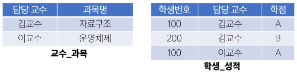

### 두 번째 테이블은 왜 (학생번호, 과목명, 학점)이 아닐까?
- 만약 그렇게 분해하면, `학생번호`와 `담당 교수` 간의 연결 정보(FD2)가 사라지게 됨
- `(학생번호, 담당 교수, 학점)`으로 분해해야 원본이 가진 모든 정보(종속성)를 잃어버리지 않는 '무손실 분해'가 됨
- 이제 '김교수가 자료구조를 담당한다'는 정보는 **중복 없이 한 곳**에만 저장됨 (갱신 이상 해결)
- 복합 키 `{학생번호, 담당 교수}`는 "어떤 학생이 어떤 교수에게서 받은 학점"인지를 유일하게 식별해주는 **필수적인 장치**

  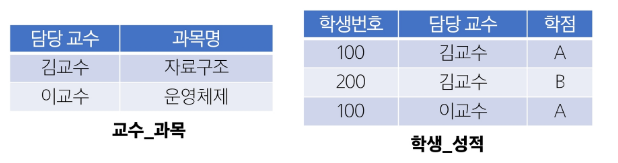

### 정규화 주의사항
- 3NF 이상으로 들어가면 BCNF, 4NF, 5NF, 6NF 등이 있으나, 지나친 분리로 인한 조인(Join) 증가나 성능 저하 등의 문제가 발생
- 따라서 업무 요구에 따라 필요한 만큼 정규화/반정규화를 조정할 것을 권장

### 정리
- 정규화는 중복 데이터와 이상 현상을 줄이기 위한 DB 설계 기법
- 일반적으로 1NF -> 2NF -> 3NF 순으로 진행
- 이상 현상(Anomaly)
  - 삽입/갱신/삭제 작업에서 생길 수 있는 문제점을 예방
- BCNF
  - 3NF보다 엄격한 규칙으로, 모든 결정자는 후보 키가 되어야 함
- 정규화를 통해 데이터 무결성과 일관성을 확보하고, 유지보수 시 구조 변경 부담을 최소화할 수 있음

# 데이터베이스 모델링 실습

## 레시피 관리 프로젝트

### Recipe model
- 요리 레시피와 재료를 관리하는 웹 애플리케이션
- 하나의 레시피에 여러 재료가 들어갈 수 있음
  - 레시피 데이터 생성 시, 재료를 다중 선택할 수 있어야 함
  - ingredients 컬럼에 콤마로 구분된 문자열을 저장
    - **MultipleChoiceField

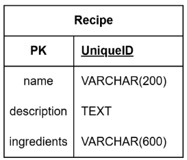

### Recipe Model class 정의

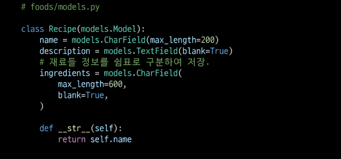

### RecipeForm ModelForm class 정의

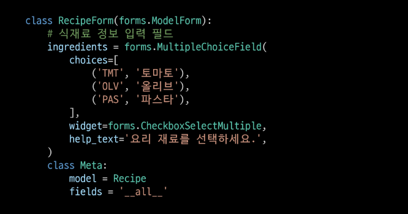

### Recipe 데이터 생성 화면

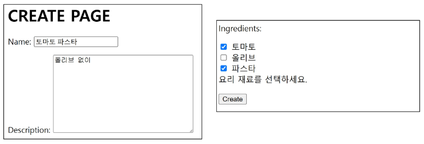

### Recipe 데이터 생성 결과

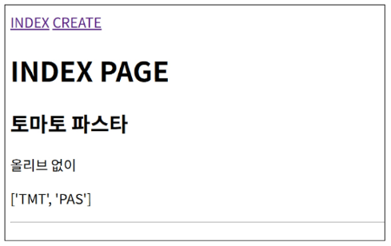

## 정규화 및 모델 정의

### 제 1 정규화
- 각 속성이 원자적(Atomic)이어야 함
  - 각 속성(컬럼)이 **원자 값(Atomic Value, 하나의 값)**만을 가져야 함.

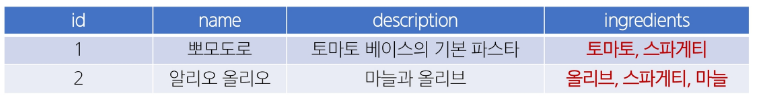

- 식재료를 저장하는 테이블을 분리

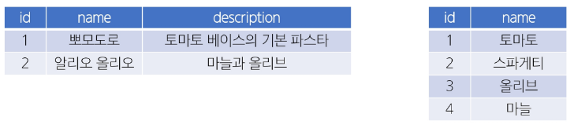

### 모델 관계 정의
- 레시피 테이블과 식재료 테이블의 관계를 위한 중개 모델 정의

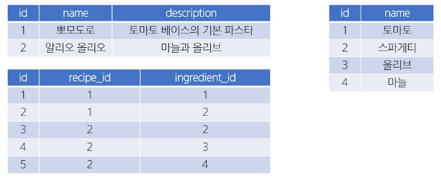

## 사전 준비 및 프로젝트 코드 확인

### 사전 준비
- 다대다 관계를 위한 ManyToManyField를 사용

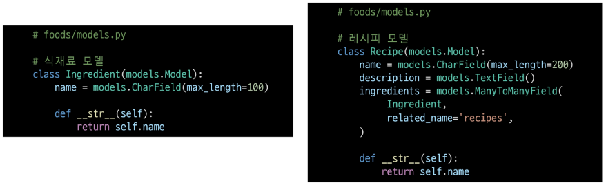

- 정의한 model을 DB에 반영

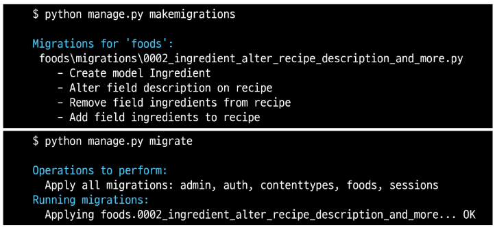

- Admin 페이지에 등록 후, 계정 생성 및 식재료 정보 생성

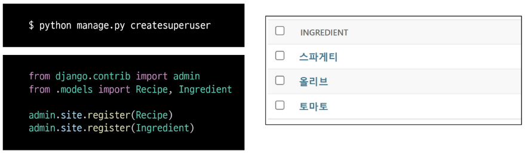

- 식재료 데이터 확인

  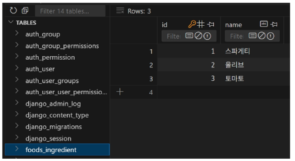

### RecipeForm 수정
- ingredients 필드를 위한 ModelMultipleChoiceField 로 변경

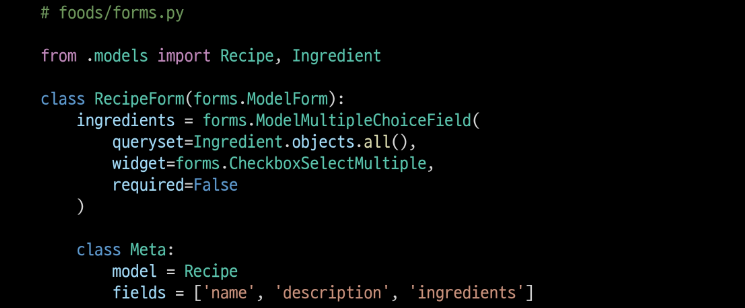

### queryset 속성
- queryset에는 "어떤 모델의 레코드를 선택지로 쓸 것인지"를 지정
  - 선택지에 사용할 (실제 필드에 저장될 값)을 해당 모델에서 직접 관리
    - 고유 값 설정 혹은 __str__ 등
    - 선택지 정보의 변동 사항을 form에서 직접 수정하지 않아도 됨
- 필요에 따라 대상 모델이 가진 레코드 중, 일부만 필터링하여 사용 가능

### [참고] queryset 속성
- 필요에 따라 별도의 메서드를 정의하여 사용할 수도 있음

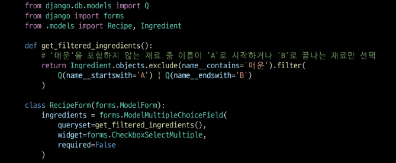

## 레시피 생성

### 레시피 생성 view와 template
- 기존의 게시글 작성 방식과 완전히 동일
- 식재료 정보는 관리자 페이지에서 생성 완료하였음
- 레시피 정보 생성 시 선택한 데이터는 ModelMultipleChoiceField에 의해 중개 모델에 저장됨
- 즉, 저장 과정을 위해 별도 전처리 과정 불필요
  - 예: 쉼표로 구분하여 저장하는 등의 save 과정 수정 필요 없음
- Widget을 사용하여 다중 선택이 가능한 checkbox 형태로 렌더링

### 레시피 생성 결과 확인
- 레시피 테이블과 중개 테이블

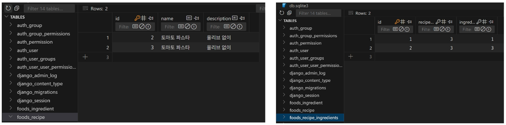

## 레시피 조회

### 레시피 조회
- Django M:N 관계의 역참조 매니저를 활용하여 렌더링

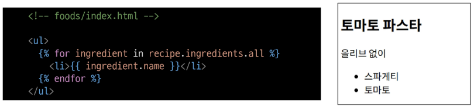

### [주의사항] Model 정의 시 MTM 주체
- 데이터 저장 시, 식재료 정보와의 관계를 저장하기 위한 별도의 전처리 과정이 필요없었던 이유는 Recipe 모델이 주체였기 때문
- Recipe 모델이 Ingredient 모델과 ManyToManyField를 통해 **관계를 직접 가지고 있음**
- ModelForm이 Recipe.ingredients를 자동 인식
- form.save() 호출 시 ModelForm이 이 관계를 자동 처리 가능
- 반대의 경우, Recipe는 ingredients를 **직접 필드로 가지지 않음**
- 따라서 ModelForm에서는 이 필드를 감지하지 못 하고 form.save() 시 관련 ManyToMany 관계는 무시됨
- 아래와 같은 추가적인 전처리 과정을 필요로 함

