# 1과목 - 데이터 모델링의 이해

## 1. 데이터 모델링의 이해

### 데이터모델의 이해

#### 모델링
- 현실 세계의 정보를 약속된 표기법을 활용하여 DB의 구조로 표현하는 과정
  1. 특징: <u>단</u>순화(누구나 쉽게 이해), <u>추</u>상화(주요 특징을 간략 표현), <u>명</u>확화(모호함X)
    > <mark>'단추명'</mark>
  2. 유의사항: 유연성(변화에 유연한 대응), 유일성(중복 저장 X), 일관성(명확한 관계)
  3. 관점: 데이터 관점, 프로세스 관점(업무 흐름), 데이터와 프로세스의 상관 관점(**CRUD** 분석 기반)

#### 데이터베이스의 모델링 단계
- 개념적 모델링 -> 논리적 모델링 -> 물리적 모델링
  1. <u>개</u>념적 모델링: 현실 세계에 대한 인식을 추상적 개념으로 표현, **ERD**를 작성
  2. <u>논</u>리적 모델링: 논리적 자료구조로 변환하며 **정규화**를 활용, **재사용성**이 높음
  3. <u>물</u>리적 모델링: 물리적 구조의 데이터로 변환
    - 물리적 모델링으로 갈 수록 **높은 수준의 구체화(낮은 수준의 추상화) 레벨**을 가짐
    > <mark>'개논물'</mark>

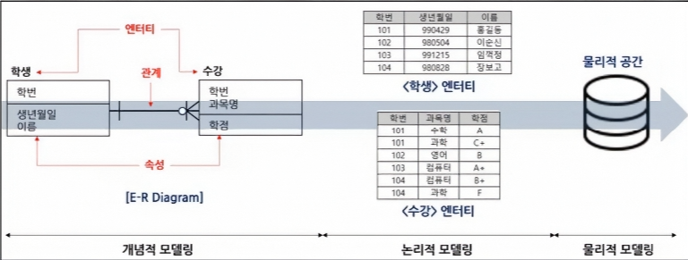

> 데이터 모델의 필수 구성요소는 엔터티(Entity), 속성(Attribute), 관계(Relationship) 

#### ERD
- 피터 첸(Peter Chen)에 의해 ER표기법이 고한 (**IE표기법**, Barker표기법 등)

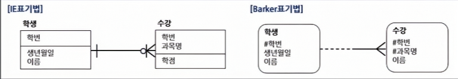

#### ERD 작성 순서
- 엔터티 <u>도</u>출 -> <u>배</u>치(왼쪽 상단) -> 관계 <u>설</u>정 -> 관계<u>명</u> 기술 -> 관계 <u>차</u>수 기술 -> 필수/<u>선</u>택사양 기술
  > <mark>'도배설명차선'</mark>

#### ANSI-SPARC 스키마 구조
- 스키마: DB 설계도

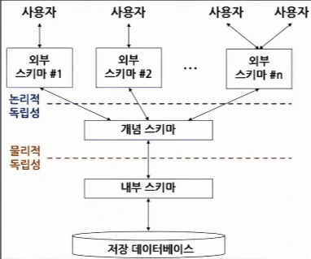

1. 스키마의 3계층
    1. 외부스키마(=서브스키마, 사용자 뷰)
        - **사용자의 입장**, 여러 개의 외부스키마 존재
    2. 개념스키마(=전체적인 뷰)
        - **전체적 논리 구조**, DB관리자에 의해서 구성
    3. 내부스키마(=저장스키마)
        - 물리적 저장장치 입장에서의 구조
2. 독립성
    1. 논리적 독립성
        - 개념 스키마 변경 시, 외부 스키마 영향 없음
    2. 물리적 독립성
        - 내부 스키마 변경 시, 개념/외부 영향 없음

### 엔터티

#### 엔터티
- 현실 세계에 존재하며, 명확하게 구분 가능한 객체 (학생, 과목, 수강 / 고객, 상품, 주문)
    1. 특징: 업무에서 필요 요구, **유일한 식별자**를 보유, **인스턴스가 2개 이상**인 집합, **2개 이상의 속성**을 보유, 다른 엔터티와의 관계 필수
    2. 명명법: 협업에서 사용하는 용어, 약어 사용 지양, 단수 명사, 중복 없음, 의미가 명확

    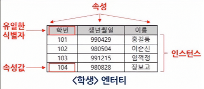

#### 엔터티의 분류
1. 유무형에 따른 분류
	- <u>유</u>형 엔터티: 물리적 형태가 존재 (학생, 책, 고객)
    - <u>개</u>념 엔터티: 형태는 없지만 개념적으로 구분 (과목, 학과, 부서)
    - <u>사</u>건 엔터티: 특정 시점에 발생한 사건 (수강, 주문, 예약)
        > <mark>'개사유'</mark>

    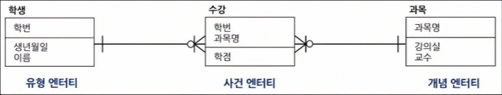

2. 발생 시점에 따른 분류
    - 기본 엔터티: 다른 엔터티에 영향을 받지 않고 독립적으로 존재 (학생, 과목, 고객, 직원)
    - 중심 엔터티: 기본 엔터티와 행위 엔터티를 연결 (수강신청, 주문)
    - 행위 엔터티: 두 개 이상의 엔터티를 상속받아 생성되는 행위 (수강내역, 주문내역)

    

### 속성

#### 속성
- 더 이상 **분리되지 않는 최소의 데이터 단위(원자성)**
    1. 특징: 엔터티는 속성의 집합, 1개의 속성은 **1개의 속성 값, 주식별자에 함수적 종속**, 업무에서 관리되는 정보
        - 함수적 종속: A 속성에 의해 B가 유일하게 결정됨 (A -> B)
    2. 명명법: 업무에 사용하는 명칭 사용, 서술식 표현 금지, 약어 사용 지양, 유일성(중복X)

#### 속성의 분류
1. 특성에 따른 분류
    1. 기본 속성: 본래 가지고 있는 속성 (이름, 학번, 고객ID)
    2. 설계 속성: 필요로 인하여 도출된 속성 (주문번호, 일련번호)
    3. **파생 속성**: 변형되어 만들어진 속성으로 계산된 값들이 해당 (합계, 평균)
2. 분해 가능 여부에 따른 분류
    1. 단일 속성: 하나의 의미로 구성 (이름, 학번)
    2. 복합 속성: 여러 개의 하위 속성으로 나눌 수 있음 (주소 -> 시/도, 도로명, 건물번호)
    3. 다중값 속성: 여러 값을 가질 수 있으며, 별도 테이블로 분리 관리 (전화번호, 이메일, 취미)
3. 구성방식에 따른 분류
    1. 기본키(PK, Primary Key) 속성: 인스턴스를 유일하게 구별 가능하게 하는 속성
    2. 외래키(FK, Foregin Key) 속성: 다른 엔터티의 관계로 연결된 속성
    3. 일반 속성: PK/FK가 아닌 나머지 속성
        > 자식 엔터티는 부모의 기본키(PK)를 외래키(FK)로 포함

#### 도메인
- 속성이 가질 수 있는 데이터의 타입과 크기에 대한 **제한 사항을 정의** (데이터 **무결성** 보장)
- 예시: 성별(남, 여), 나이(0~120사이 정수), 학번(8자리 정수형 숫자)

### 관계

#### 관계
- 엔터티와 엔터티간의 논리적 연관성
    1. 존재적 관계: 다른 엔터티가 존재해야만 존재할 수 있는 관계 (사원, 부서)
    2. 행위적 관계: 행동, 동작, 사건에 의해 발생하는 관계 (학생-수강한다-수강)
        > ERD에서는 존재적 관계와 행위적 관계를 구분하지 않으나 UML에서는 구분

#### 관계의 구성
1. <u>관</u>계명(Membership): 관계의 이름
2. <u>차</u>수(Cardinality): 엔터티간의 참여자의 수를 표현 (1:1, 1:M. M:N)
3. <u>선</u>택사양(Optionality): 엔터티가 관계에 항상 참여하는지 여부 (O: 선택적 참여)
    > <mark>'관차선'</mark>

    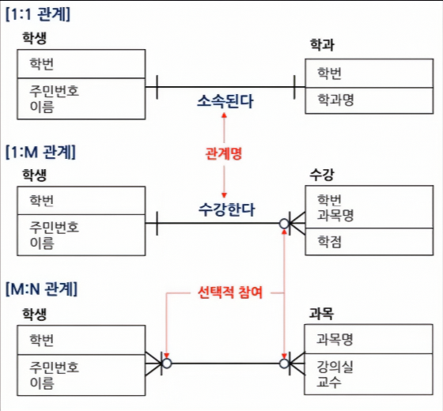

    > Barker 표기법에서는 선택적 참여를 점선으로 표현 

#### 교차 엔터티
- M:N의 관계를 표현하기 위하여 생성된 엔터티 (관계형DB는 M:N 관계의 표현 불가)

    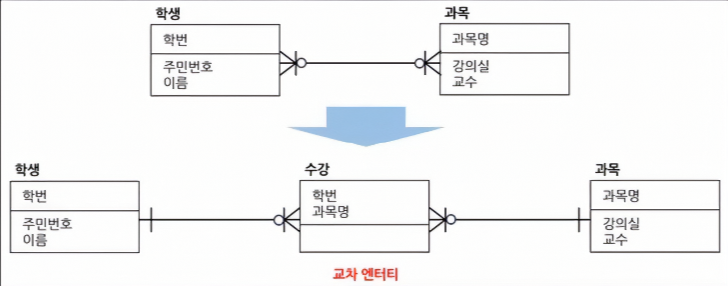

### 식별자

#### 식별자
- 인스턴스를 유일하게 구분할 수 있는 속성 또는 속성의 집합

#### 식별자의 분류
1. 대표성 여부에 따른 분류
	1. 주식별자(=기본키, PK): **대표성, 유일성, 최소성, 불변성, 존재성(Not Null)** 을 만족
	2. 보조식별자(=대체키, AK): 대표성을 갖지 못함
2. 스스로 생성 여부에 따른 분류
	1. 내부식별자: 엔터티 내부에서 스스로 생성
	2. 외부식별자(=외래키, FK): 다른 엔터티로부터 받아오는 식별자
3. 속성의 수에 따른 분류
	1. 단일식별자: 하나의 속성으로 구성된 식별자
	2. 복합식별자: 둘 이상의 속성으로 구성된 식별자
4. 대체 여부에 따른 분류
	1. 본질식별자: 프로세스 상에서 현실로 존재하는 식별자
	2. 인조식별자: 인위적으로 생성한 식별자

	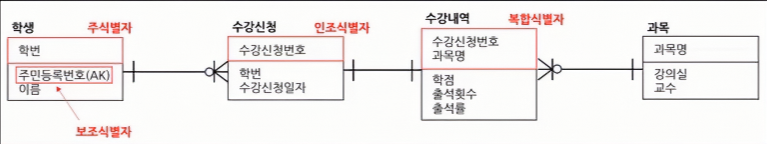

#### 식별자 관계, 비식별자 관계
1. 식별자 관계 (=강한 연결 관계)
	- 부모 엔터티로부터 받은 식별자를 자식 엔터티의 주식별자로 이용하며, Null이 있으면 안됨
	- 부모 엔터티와 자식 엔터티가 같은 생명주기를 가짐
2. 비식별자 관계 (=약한 연결 관계)
	- **부모 엔터티로부터 받은 속성을 일반 속성으로 사용**하는 경우
	- 부모 엔터티와 자식 엔터티가 서로 다른 생명주기를 가짐
	> 식별자는 부모와 자식간의 상호작용이 의무이나, 비식별자는 선택사항
	
	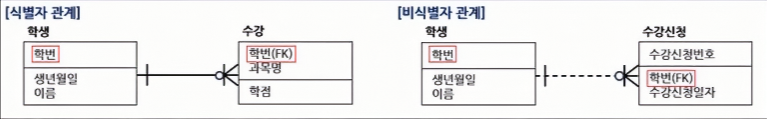

	> IE표기법에서는 점선, Barker 표기법에서는 Bar(|)여부로 비식별자 관계 파악

#### 키(Key)

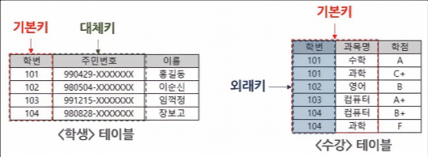

1. 후보키(Candidate Key): 유일성과 최소성을 만족하는 속성 또는 속성들의 조합
2. 기본키(Primary Key): 후보키 중에서 대표성을 가지는 주 키(Main Key), 개체무결성
3. 대체키(Alternate Key): 기본키를 제외한 나머지 후보키
4. 슈퍼키(Super Key): 유일성은 만족하지만 최소성은 만족시키지 못하는 키
5. 외래키(Foreign Key): 다른 테이블의 기본키를 참조하는 키, 참조무결성
- 개체무결성: Null값이나 중복된 값 저장 불가
- 참조무결성: 참조할 수 없는 외래키 값을 가질 수 없음
> 식별자는 논리 모델링 단계에서 사용하고, 키는 물리 모델링 단계에서 사용

## 2. 데이터 모델과 SQL

### 정규화

#### 정규화
- DB의 **이상현상**을 방지하기 위하여 데이터 중복을 최소화하여 테이블을 분리하는 방법
> 엔터티(Entity) = 테이블(Table) = 릴레이션(Relation)

#### 이상현상(Anomaly)
1. 삽입이상: 데이터 삽입 시, 의도하지 않은 값들도 삽입되는 현상
2. 삭제이상: 데이터 삭제 시, 의도하지 않은 값들도 삭제되는 현상
3. 갱신이상: 일부 데이터만 갱신되어 모순이 발생하는 현상

	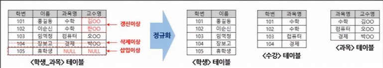

#### 함수적 종속
- A 속성에 의해 B가 유일하게 결정됨 (A -> B)
> A를 결정자, B를 종속자라 함
1. 완전 함수적 종속: 종속자가 기본키의 모든 속성에 종속적인 경우
2. 부분 함수적 종속: 종속자가 기본키의 일부 속성에 종속적인 경우

	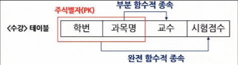

#### 정규화 단계
- **제1정규화 -> 제2정규화 -> 제3정규화** -> BCNF -> 제4정규화 -> 제5정규화
> 1~3정규화 외 나머지 정규화는 시험에 거의 출제되지 않음
1. 제1정규화: **<u>도</u>메인이 원자 값**만으로 구성
2. 제2정규화: **<u>부</u>분적 함수 종속**을 제거하여, 완전 함수 종속을 만족
3. 제3정규화: **<u>이</u>행 함수 종속 관계**를 제거
4. BCNF: <u>결</u>정자가 모두 후보키가 되도록 분해
5. 제4정규화: <u>다</u>치 종속의 제거
6. 제5정규화: <u>조</u>인 종속성을 이용
> <mark>'두부이겨다줘 = 도부이결다조'</mark>

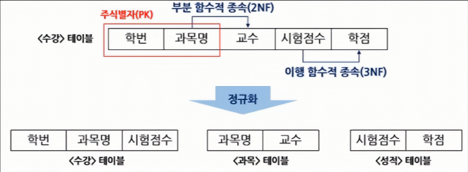

> 테이블 분해 시, 결정자는 남기고 종속자만 제거

### 관계와 조인의 이해

#### 조인(Join)
- 서로 관계가 있는 테이블을 SQL로 연결해서 데이터를 조회하는 방법
- 정규화로 분해가 된 테이블들은 조인 성능이 낮아질 수 있음 (반정규화 수행)

#### 계층형 데이터 모델
- 같은 테이블을 참조하여 두 개의 테이블을 조인하는 관계, 계층형 질의 혹은 셀프 조인 활용

	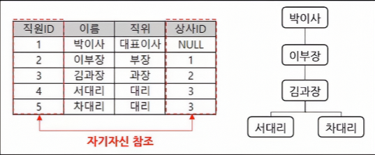

#### 상호배타적 관계
- 두 테이블 중 하나의 테이블만 상속될 수 있는 관계

	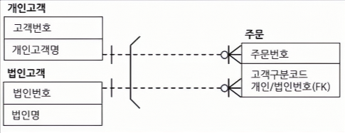

### 모델이 표현하는 트랜잭션의 이해

#### 트랜잭션
- DB에서의 하나의 논리적인 작업 단위
	1. Commit: 트랜잭션이 성공적으로 끝났음을 알리고 DB에 저장
	2. Rollback: 트랜잭션 중 오류가 발생하여 이전 상태로 되돌림

#### 트랜잭션의 4대 특성 (ACID)
1. **원자성(<u>A</u>tomicity)**: 수행되거나 전혀 수행되지 않아야 함(All or Nothing)
2. **일관성(<u>C</u>onsistency)**: 트랜잭션 실행 전후로 오류가 없어야 함
3. **고립성(<u>I</u>solation)**: 트랜잭션끼리 서로 간섭하면 안됨
4. **지속성(<u>D</u>urability)**: 수행된 결과는 영구적으로 저장

#### 트랜잭션의 격리 수준에 따른 문제점
1. Dirty Read: 아직 실행이 완료되지 않은 데이터를 읽는 경우
2. Non-Repeatable Read: 같은 쿼리를 두 번 수행했을 때, 결과가 달라지는 현상
3. Phantom Read: 같은 쿼리를 두 번 수행했을 때, 행의 개수가 바뀌는 현상

### Null 속성의 이해

#### Null의 개념
- 미 정의된 값, 0이나 빈칸과는 다른 개념 (**비교 불가, 연산 불가, 집계함수에서 제외**)

### 본질식별자 vs 인조식별자

#### 본질식별자, 인조식별자의 개념
1. 본질식별자: 프로세스 상에서 현실로 존재하는 식별자
2. 인조식별자: 인위적으로 생성한 식별자

	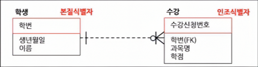
	
#### 인조식별자의 장단점
1. 장점: 추가적 연산 없이 실제 비즈니스와 무관하게 설계 가능, 개발 및 유지보수성 용이
2. 단점: 데이터 중복 가능성, 불필요한 인덱스 생성

# 2과목 - SQL 기본 및 활용

## 1. SQL기본

### 관계형 데이터베이스 개요

#### DBMS(DataBase Management System)
1. DBMS: 데이터베이스를 관리 및 접근하기 위한 환경을 제공하는 시스템
2. RDBMS (Relational DBMS, 관계형DBMS)
    - 데이터를 테이블 형태로 저장하고 테이블간 관계를 활용하여 관리하는 DB
    - 1970년 IBM의 에드가 F.커드(Edgar F.Codd)가 처음 제안한 모델
    - 대표적인 RDBMS: **Oracle, SQL Server**, MySQL, PostgreSQL 등

        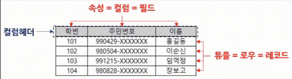

#### SQL(Structured Query Language)
- RDMS에서 데이터를 생성, 조회, 수정, 삭제하기 위한 표준 언어
    1. 데이터 정의어(DDL): 테이블 생성, 변경, 삭제
        - **CREATE, ALTER, DROP, RENAME, TRUNCATE**
    2. 데이터 조작어(DML): 데이터를 조회, 삽입, 수정, 삭제
        - **SELECT, INSERT, UPDATE, DELETE**
    3. 데이터 제어어(DCL): 권한 관리
        - **GRANT, REVOKE**
    4. 트랜잭션 제어어(TCL): 트랜잭션을 제어
        - **COMMIT, ROLLBACK, SAVEPOINT**

### SELECT 문

#### SELECT 문의 구조
- DB에서 데이터를 조회할 때 사용하는 가장 기본적인 명령어

    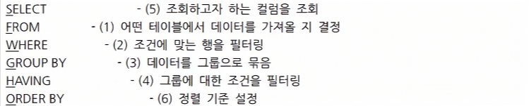

    > <mark>'공격수(FW)가해써오! (FWGHSO)'</mark>

#### SELECT 절의 활용

> AS는 생략 가능하며, FROM 절의 TABLE에도 별칭 설정 가능
> WHERE 절은 SELECT 문 보다 먼저 수행되므로 SELECT 문에 정의된 별칭(Alias) 사용 불가

> Oracle에서의 CONCAT은 ||, SQL Server에서의 CONCAT은 + 

### 함수

#### 함수
- 입력(Input)에 대한 특정 연산을 수행 후, 결과(Output)를 반환하는 약속된 코드 블록
- 단일행 함수: Input 1 -> Output 1 / 다중행 함수: Input N -> Output 1
> Oracle 에서는 함수를 테스트하기 위해 더미(Dummy) 테이블인 DUAL을 자주 사용

#### 문자함수

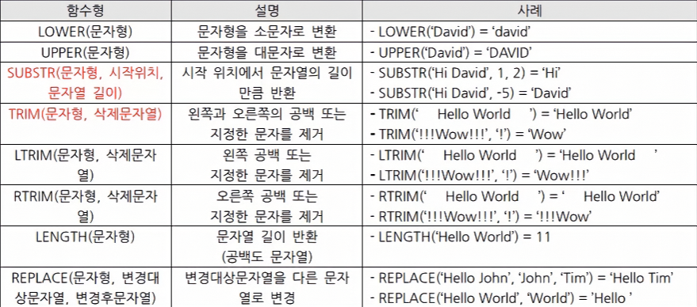

> 문자열 데이터는  작은 따옴표('')로 표현, 숫자는 그대로 사용

#### 숫자함수

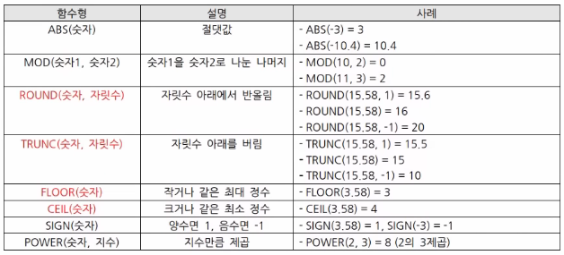

#### 날짜함수

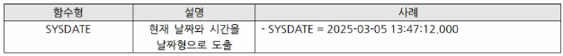

> 날짜형은 날짜 간 덧셈/뺄셈, 정렬 등의 활용 가능

#### 변환함수

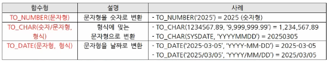

> 날짜형과 문자형은 겉으로는 형식이 같아 보여도, 내부적으로는 완전히 다른 데이터

#### 집계함수
- COUNT, SUM, AVG, MIN, MAX 등

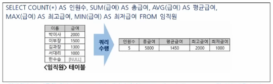

> 집계함수는 다중행 함수 / NULL 제외 계산이 원칙(COUNT는 예외) / WHERE 절에서 사용 불가

#### NULL 관련 함수
1. NVL(컬럼, 대체값): 컬럼값이 NULL 이면 대체값, NULL 이 아니면 원래값
2. NULLIF(컬럼 1, 컬럼 2): 두 컬럼값이 같으면 NULL, 다르면 첫 번째 값
3. COALESCE(컬럼 1, 컬럼 2, 컬럼 3, ...): 가장 먼저 NULL 이 아닌 값

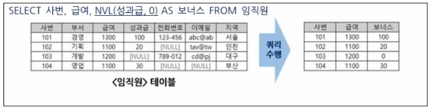

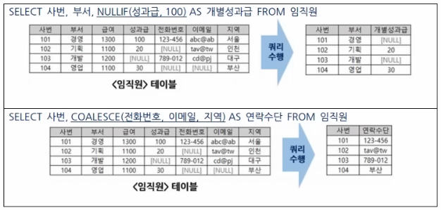

### CASE 문 / DECODE 함수
- 조건에 따라 값을 분기 처리
1. CASE 문

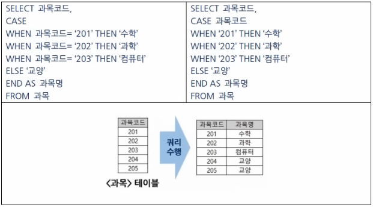

2. DECODE(컬럼, 값1, 반환1, 값2, 반환2, ..., 반환N)

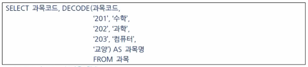

> DECODE는 Oracle 전용 함수

### WHERE 절

#### WHERE 절
- 특정 조건에 부합하는 튜플(행) 데이터들을 조회할 때 사용

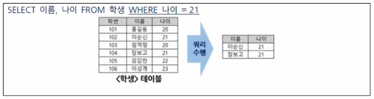

#### 기본 비교 연산자

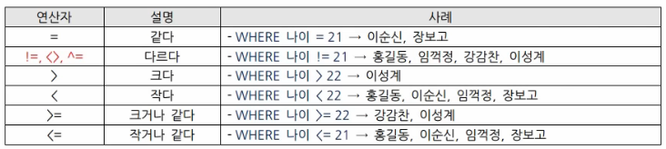

#### 조건 표현 연산자

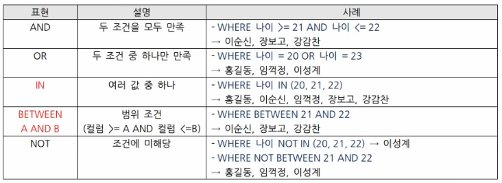

#### LIKE 연산자
1. 와일드카드 문자

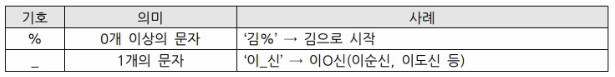

2. LIKE의 활용

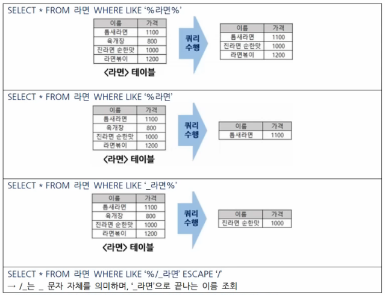

> '%' 혹은 '_'가 문자 자체로 포함된 값을 찾고 싶을 때, ESCAPE 사용

#### NULL 비교 연산자

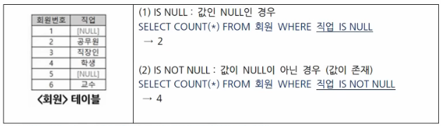

> NULL 비교 시, = NULL 혹은 != NULL 의 표현은 오류 발생

#### 연산자 우선순위
- 괄호() -> 곱셈(*), 나눗셈(/), 나머지연산(%) -> 비교연산자(=, !=, <>, <, >, <=, >=), IS NULL, LIKE, BETWEEN, IN -> **NOT -> AND -> OR**

### GROUP BY, HAVING 절

#### GROUP BY 절
- 특정 컬럼을 기준으로 행들을 그룹화하여 **집계함수 결과를 산출**

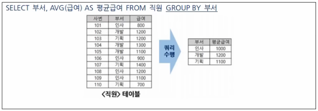

#### HAVING 절
- 그룹화된 결과에 대한 조건 (WHERE은 튜플(행)단위, HAVING은 그룹단위)
- 보통은 GROUP BY절과 같이 사용되지만, 단독으로 사용도 가능(집계함수의 활용)

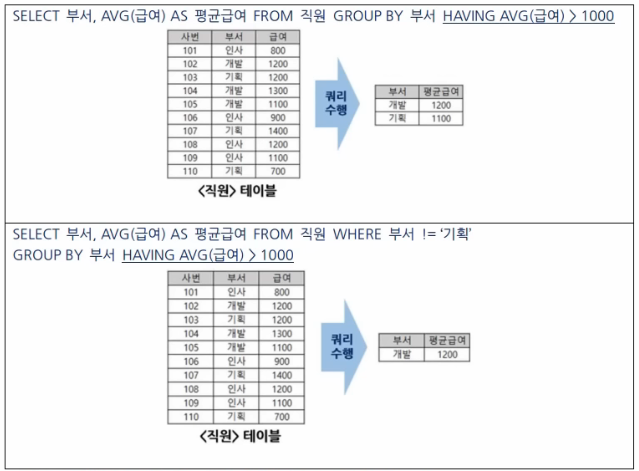

> WHERE 절에서는 집계 함수 사용 불가하나, HAVING 절에서는 사용

> GROUP BY절은 리소스 소모가 크므로, WHERE절로 먼저 필터링 후 수행하는 것이 성능상 유리

### ORDER BY 절

#### ORDER BY 절
- 결과를 정렬할 때 사용
1. 정렬 키워드
  1. **ASC**: 오름차순(기본값)
  2. **DESC**: 내림차순
2. ORDER BY절 활용

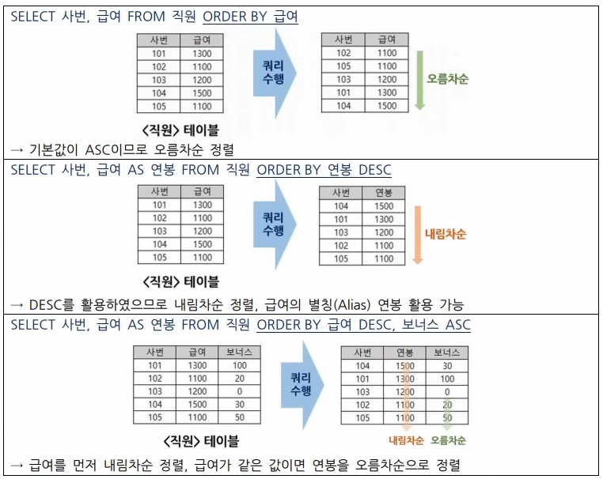

> 컬럼 번호를 활용해서 정렬도 가능 (급여 DESC, 보너스 ASC -> 2 DESC, 3ASC )

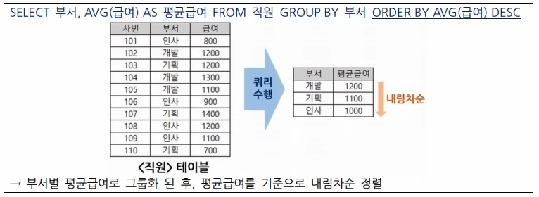

#### ORDER BY 절 특징
1. SELECT 절보다 나중에 수행되므로 SELECT 절에서 선언된 별칭(Alias) 사용 가능
2. GROUP BY 절보다 나중에 수행되므로 집계함수 사용 가능

#### 데이터 형에 따른 정렬 순서 (오름차순 기준)
1. 숫자형: 작은 수 -> 큰 수
2. 문자형: 사전 순
3. 날짜형: 과거 -> 미래
4. NULL 정렬: Oracle은 NULL을 최댓값으로, SQL Server는 NULL을 최솟값으로 처리

### 조인

#### 조인(Join)
- 둘 이상의 테이블을 연결하여 관련 데이터를 하나의 결과로 보여주는 SQL 연산
1. 종류
    1. EQUI JOIN: Equal(=) 연산자(등호)를 사용해서 같은 값인 경우 조인

    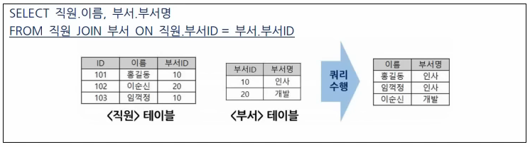

    2. NON EQUI JOINl 비교 연산자(BETWEEN, >, <, !=)를 사용하는 조인

    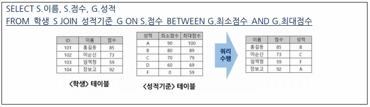

### 표준조인

#### 표준조인
- DBMS마다 조인 방식이 다르므로, ANSI/ISO SQL 표준으로 정립한 조인 (FROM절 JOIN형태)

#### INNER JOIN
- JOIN 조건에서 동일한 값이 있는 행만 반환
1. USING 조건절
  - 컬럼명이 같은 컬럼들에 대해서 선택적으로 조인 가능

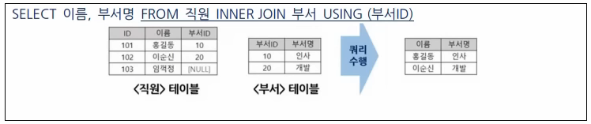

2. ON 조건절
  - 컬럼명이 다르더라도 조인 조건을 사용 가능

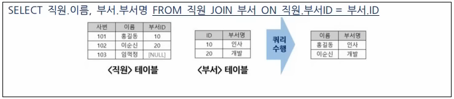

> JOIN만 단독으로 사용 시 INNER JOIN을 의미하며, NULL 값은 조회 대상이 아님

#### NATURAL JOIN
- 두 테이블 간에 동일한 이름을 갖는 모든 컬럼에 대해 EQUI JOIN 수행
- **ON이나 USING 조건절 없이 조인 가능**

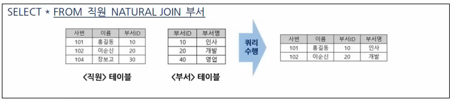

#### CROSS JOIN
- 두 테이블의 모든 행을 조합해서 출력 (Cartesian Product 연산)

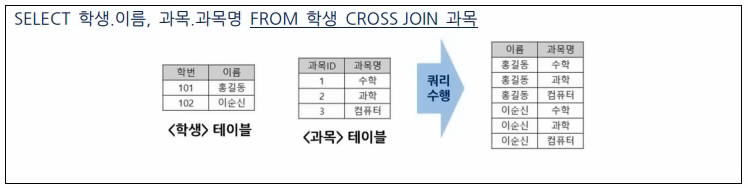

#### OUTER JOIN
- JOIN조건에서 동일한 값이 없는 행 반환 가능
1. LEFT OUTER JOIN
  - 좌측 테이블이 기준이 되어 결과 생성, 우측 테이블에서 가져오는 컬럼이 없으면 NULL
2. RIGHT OUTER JOIN
  - 우측 테이블이 기준이 되어 결과 생성, 좌측 테이블에서 가져오는 컬럼이 없으면 NULL
3. FULL OUTER JOIN
  - 좌, 우측 테이블의 모든 데이터를 활용하여 결과 생성

  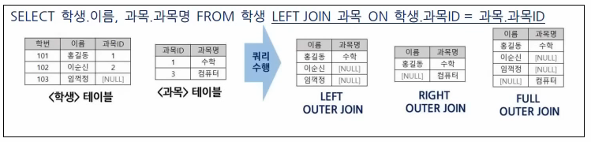

## 2. SQL활용

### 서브쿼리

#### 서브쿼리
- 하나의 쿼리문(=메인 쿼리) 안에 포함된 또 다른 쿼리문(=서브 쿼리)

#### 서브쿼리의 종류

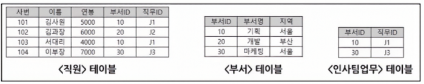

1. 단일행 서브쿼리: 서브쿼리가 하나의 값만 반환

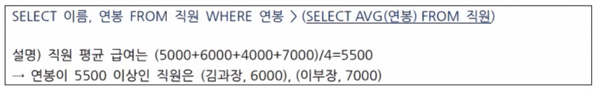

2. 다중열 서브쿼리: 서브쿼리가 두 개 이상의 열을 반환

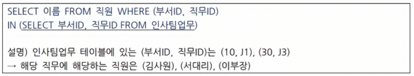

3. 다중행 서브쿼리: 서브쿼리가 여러 행을 반환

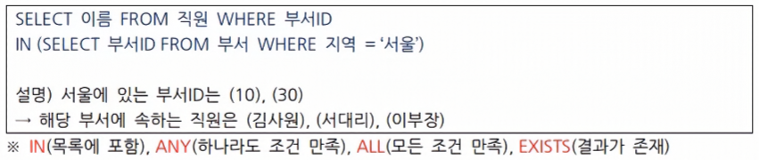

4. 스칼라 서브쿼리: SELECT문 안에서 서브쿼리 결과가 하나의 컬럼

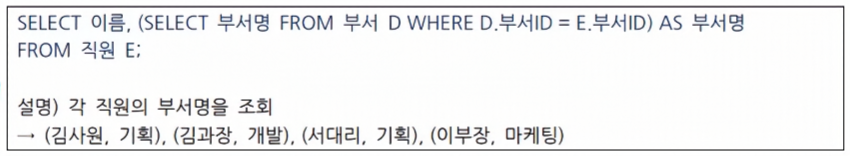

5. 인라인 뷰: FROM절에서 임시 테이블처럼 활용

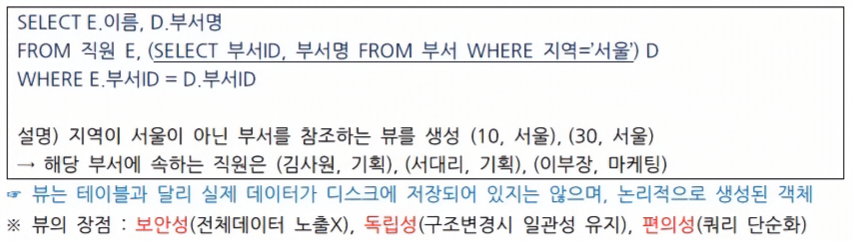

6. 상호연관 서브쿼리: 외부 쿼리의 행 하나하나에 대해 서브 쿼리가 실행

### 집합 연산자

#### 집합 연산자
- 두 개 이상의 SELECT 쿼리 결과에 대한 집합 연산(합집합, 교집합, 차집합 등)을 수행하는 연산자
- 두 집합의 스키마(컬럼 수, 컬럼 순서, 데이터 타입)이 일치해야 동작 

  

#### 합집합
1. UNION ALL: 중복 허용

2. UNION: 중복 제거

#### 교집합

#### 차집합

### 그룹 함수

#### 그룹 함수
- GROUP BY절에서 여러 행을 하나의 결과값으로 요약하는 함수
- 집계함수(COUNT, SUM, AVG, MIN, MAX)외 ROLLUP, CUBE, GROUPING SET 등의 함수가 존재

#### ROLLUP
- ROLLUP(컬럼1, 컬럼2)인 경우, (컬럼1, 컬럼2) -> 컬럼1 -> 전체 행 순으로 그룹화

#### CUBE
- CUBE(컬럼1, 컬럼2)인 경우, (컬럼1, 컬럼2) -> 컬럼1 -> 컬럼2 -> 전체 행 순으로 그룹화

#### GROUPING SETS
- 그룹화할 대상을 지정 가능

### 윈도우 함수

#### 윈도우 함수
- GROUP BY와 달리, 그룹화하지 않고 각 행에 대하여 계산된 값을 반환하는 함수
- OVER 키워드와 함께 사용

#### 순위 함수

#### 집계 함수
- COUNT, SUM, AVG, MIN, MAX 등

#### 행 간의 값 참조 함수

#### 범위 지정 키워드
- ROWS BETWEEN [시작 범위] AND [끝 범위]

#### 비율함수

### Top N 쿼리

#### Top N 쿼리
- 상위 N개의 데이터를 추출하는 쿼리
1. TOP: SQL Server에서 사용
2. LIMIT: MySQL, PostgreSQL 등에서 사용
3. FETCH FIRST: DB2, Oracle 등에서 사용
4. ROWNUM: Oracle에서 사용

#### 유의사항
1. ORDER BY 사용은 필수 (정렬 없이 사용 시 랜덤 결과 출력)
2. TOP 사용 시 동일한 순위도 함께 출력하려면 **WITH TIES** 사용
3. **ROWNUM 사용 시 =, > 연산자는 사용 불가**

### 계층형 질의와 셀프 조인

#### 계층형 질의
- 데이터가 계층 구조를 가지고 있을 때, 계층 구조를 탐색하기 위하여 사용

#### 셀프 조인
- 같은 테이블에 대하여 조인을 수행

### PIVOT 절과 UNPIVOT 절

#### PIVOT 절과 UNPIVOT 절

1. PIVOT절
- 행 데이터를 특정 컬럼 기준으로 열 방향으로 재구성
- LONG DATA를 WIDE DATA로 변경

2. UNPIVOT절
- 열 데이터를 행으로 변환
- WIDE DATA를 LONG DATA로 변경

### 정규표현식

#### 정규표현식
- 문자와 기호를 조합하여 특정 패턴을 검색하거나 일치 여부를 확인할 때 사용

#### 주요 정규표현식 기호

#### 정규표현식 함수
1. REGEXP_LIKE: 문자열이 정규식과 일치하는지 여부 판단
  - 예시: REGEXP_LIKE('hello123', '^[a-z]+[0-9]+$') -> TRUE
  - 설명: 소문자 + 숫자 형식이 맞으므로 TRUE 반환
2. REGEXP_REPLACE: 정규식에 일치하는 부분 대체
  - 예시: REGEXP_REPLACE('010/1234/5678', '/', '-') -> 010-1234-5678
  - 설명: '/' 문자열을 '-'로 대체
3. REGEXP_INSTR: 정규식이 처음 등장하는 위치 반환
  - 예시: REGEXP_INSTR('abc123def', '[0-9]+') -> 4
  - 설명: 숫자가 처음 등장하는 위치 (= 1의 위치)
4. REGEXP_SUBTR: 정규식에 일치하는 부분 문자열 추출
  - 예시: REGEXP_SUBSTR('abc123def', '[0-9]+') -> 123
  - 설명: 연속된 숫자 123 추출
5. REGEXP_COUNT: 정규식에 일치하는 횟수 세기
  - 예시: REGEXP_COUNT('a1b2c3', '[0-9]') -> 3
  - 설명: 숫자의 개수 3개
> 정규표현식 함수는 Oracle에서 지원

## 3. 관리 구문

### DML

#### DML
- 데이터 조작 언어 (INSERT, UPDATE, DELETE, MERGE문)

#### INSERT
- 새로운 데이터(행)을 테이블에 추가
1. 전체 컬럼 값 추가

2. 명시된 컬럼 값 추가

#### UPDATE
- 기존 데이터를 수정

#### DELETE
- 데이터를 삭제

#### MERGE
- 두 테이블을 조건에 따라 데이터를 삽입(INSERT)하거나 수정(UPDATE)

### TCL

#### TCL
- 트랜잭션 제어문
  - 트랜잭션 특징: **원자성(Atomicity), 일관성(Consistency), 고립성(Isolation), 연속성(Durability)**

#### 자동커밋(AUTOCOMMIT)
1. Oracle
  - DDL: 무조건 자동커밋이 수행
  - DML: 자동커밋(AUTOCOMMIT) 모드 ON/OFF에 따라 롤백(ROLLBACK)이 가능
2. SQL Server
  - 자동커밋(AUTOCOMMIT) 모드 ON/OFF에 따라서 DDL과 DML이 동작
> Oracle은 기본적으로 자동커밋 모드 OFF / SQL Server는 기본적으로 자동커밋 모드 ON

### DDL

#### DDL
- 데이터의 구조(스키마)를 정의

#### CREATE
- 새로운 테이블의 생성

1. 데이터의 유형

#### 테이블명과 컬럼명 정의 시 기본 규칙
- 숫자로 시작할 수 없으며, A-Z, a-z, 0-9, _, $, # 문자만 허용, 성격에 맞는 의미 있는 이름 사용

#### ALTER
- 테이블의 구조 변경

#### DROP
- 테이블의 삭제

#### TRUNCATE
- 테이블 안의 모든 데이터를 삭제하지만, 테이블 구조는 유지(스키마는 유지)

### DCL

#### DCL
- 사용자의 권한을 관리

#### GRANT
- 사용자에게 권한을 부여

#### REVOKE
- 사용자의 권한을 회수

#### 권한 부여 옵션
1. WITH GRANT OPTION
  - 객체 권한 부여(SELECT, INSERT, UPDETE, DELETE 등)

2. WITH ADMIN OPTION
  - 시스템 권한 부여(CREATE TABLE, DROP TABLE 등)

