# 그래프의 기본과 탐색

## 그래프 기본

### 문제 제시: 친구관계
- A의 친구는 B다.
- C의 친구는 E, F이다.
- (D - E), (F - G), (N - B, I, L), (G - A, C, D, H), (I - J, H), (B - D, K, L), (M - I, J), (E - A, H), (C - B, I, L), (B - I), (J - A, G)
- A의 친구 중에 친구가 가장 많은 친구는 누구인가?

### 그래프
- 아이템(사물 또는 추상적 개념)들과 이들 사이의 연결 관계를 표현
    - 선형 자료구조나 트리 자료구조로 표현하기 어려운 N : N 관계를 가지는 원소들을 표현하기에 용이
- 정점(Vertex)들의 집합과 이들을 연결하는 간선(Edge)들의 집합으로 구성된 자료 구조
    - |V|: 정점의 개수, |E|: 그래프에 포함된 간선의 개수라 할 때,<br>|V|개의 정점을 가지는 그래프는 최대 |E| = |V| * (|V| - 1) / 2개의 간선을 가질 수 있다.
        - 예) 5개 정점이 있는 그래프의 최대 간선 수는 10(=5*4/2)개

### 그래프 유형
- 무향(무방향) 그래프(Undirected Graph)
- 유향(방향) 그래프(Directed Graph)
- 가중치 그래프(Weighted Graph)
- 사이클 없는 방향 그래프(DAG, Directed Acyclic Graph)

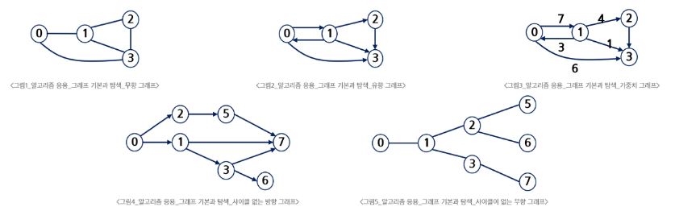

- 완전 그래프: 정점들에 대해 가능한 모든 간선들을 가진 그래프
- 부분 그래프: 원래 그래프에서 일부의 정점이나 간선을 제외한 그래프
- 희소 그래프: 간선이 적은 그래프

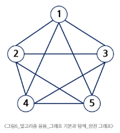

### 인접 정점
- 인접(Adjacency)
    - 두 개의 정점에 간선이 존재(연결됨)하면 서로 인접해 있다고 함
    - 완전 그래프에 속한 임의의 두 정점들은 모두 인접해 있음

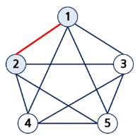

### 그래프 경로
- 경로란 간선들을 순서대로 나열한 것
    - 간선들: (0, 2), (2, 4), (4, 6)
    - 정점들: 0 - 2 - 4 - 6
- 경로 중 한 정점을 최대한 한 번만 지나는 경로를 **단순경로**라고 함
    - 0 - 2 - 4 - 6, 0 - 1 - 6
- 시작한 정점에서 끝나는 경로를 <b>사이클(Cycle)</b>이라고 함
    - 1 - 3 - 5 - 1


### 그래프 표현
- 간선의 정보를 저장하는 방식, 메모리나 성능을 고려해서 결정
- 인접 행렬(Adjacent matrix)
    - |V| x |V| 크기의 2차원 배열을 이용해 간선 정보 저장
- 인접 리스트(Adjacent List)
    - 각 정점마다 해당 정점과 인접한 정점 정보를 저장
- 간선의 배열
    - 간선(시작/끝 정점)을 배열에 연속적으로 저장

### 인접 행렬: 두 정점을 연결하는 간선의 유무를 행렬로 표현
- |V| x |V| 정방 행렬
- 행 번호와 열 번호는 그래프의 정점에 대응
- 두 정점이 인접되어 있으면 1, 그렇지 않으면 0으로 표현
- 무향 그래프
    - i번째 행의 합 = i번째 열의 합 = Vi의 차수

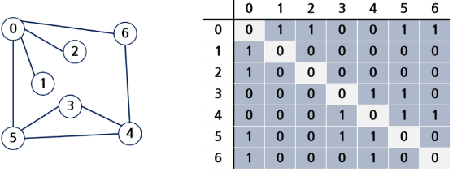

- 유향 그래프
    - 행 i의 합 = Vi의 진출 차수
    - 열 i의 합 = Vi의 진입 차수

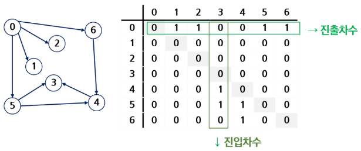

- 인접 행렬의 장점: 쉽다, 특정 연결 검색이 빠르다.

### 인접 행렬의 단점
- 정점 수에 비해 간선 수가 적은 경우 공간 낭비가 심함
> 추가 학습 필요

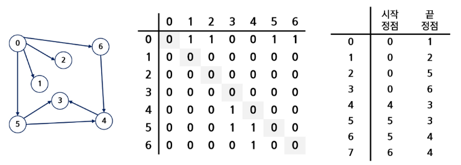

### 인접 리스트
- 각 정점에 대한 인접 정점들을 순차적으로 표현
- 하나의 정점에 대한 인접 정점들을 각각 노드로 하는 연결 리스트로 저장

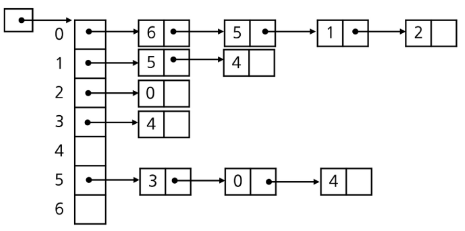

- 무향 그래프의 인접 리스트

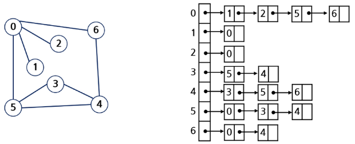

    무방향 그래프 노드 수 = 간선의 수 * 2
    각 정점의 노드 수 = 정점의 차수

- 유향 그래프의 인접 리스트

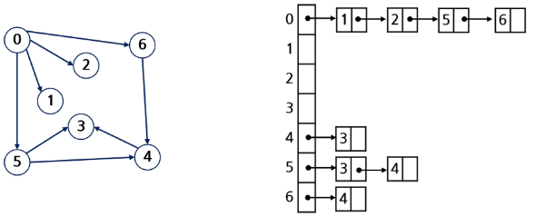

    방향 그래프 노드 수 = 간선의 수
    각 정점의 노드 수 = 정점의 진출 차수

- 인접 리스트의 단점: 특정 연결 정보 조회가 느리다
> 추가 학습 필요

## DFS

### 문제 제시: 친구 관계
- 다음과 같이 친구 관계를 그래프로 표현했다.
- A로부터 시작해서 한 명의 친구에게만 소식을 전달, 전달할 수 있다면 최대 몇 명의 친구가 소식을 전달받을 수 있을까? (단, 소식을 전달받은 친구한테는 소식을 다시 전달할 수 없다.)
- A로부터 시작해서 친구들에게 동시에 소식을 전달할 수 있다고 할 때, 가장 늦게 전달받는 사람은 누구일까? (단, 친구에게 소식을 전달하는 속도는 동일하다.)

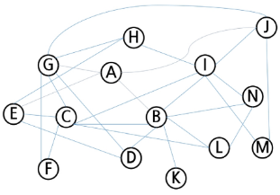

### DFS(Depth First Search, 깊이 우선 탐색) 알고리즘 - 재귀
- 모든 정점을 중복없이 빠짐없이 방문하는 경우
    - G: 탐색할 그래프
    - v: 방문하는 정점
```c
DFS_Recursive(G, v)
    
    visited[ v ] <- TRUE // v 방문 설정

    FOR each all w in adjacency( G, v )
        IF visited[w] != TRUE
            DFS_Recursive(G, w)
```

### DFS 알고리즘 - 반복

```py
STACK s             # 스택 생성
visited[ ]          # 방문한 정점 표시
DFS(v)
    push( s, v )
    WHILE NOT is Empty( s )
        v <- pop(s)
        IF NOT visited[v]
            visit( v )
            FOR each w in adjacency( v )
                IF NOT visited[w]
                    push(s, w)
```        

### DFS 예

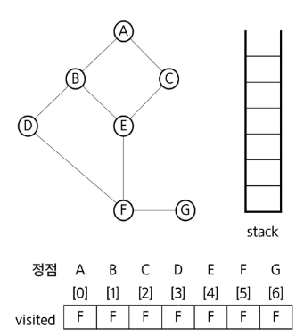

### 중복 검사가 필요없는 DFS
- 스택에 push된 정점을 visited에 표시함

```py
STACK s             # 스택 생성
visited[ ]          # 방문한 정점 표시
DFS(v)
    push( s, v )
    visited[v] = True
    WHILE NOT is Empty( s )
        v <- pop(s)
        IF NOT visited[v]
            visit( v )
            FOR each w in adjacency( v )
                IF NOT visited[w]
                    push(s, w)
                    visited[v] = True
```

### 연습
- 1번 정점부터 깊이 우선 탐색하는 경우 정점 방문 순서
    - 각 간선의 끝 정점<br>1 2 1 3 2 4 2 5 4 6 5 6 6 7 3 7
    - 방문 순서의 예 (구현 방법에 따라 정점 순서는 달라질 수 있음)<br>1 2 4 6 4 7 3

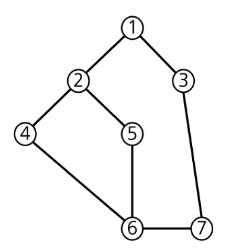

## BFS

### BFS(Breadth First Search, 너비 우선 탐색) 알고리즘
- BFS는 예제 그래프를 붙여진 번호 순서로 탐색

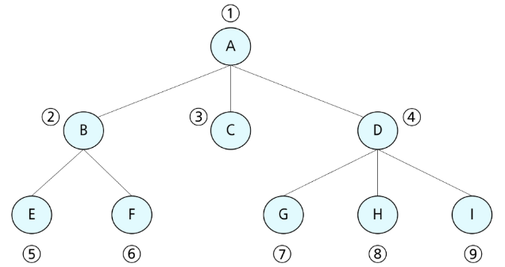

### 입력 파라미터: 그래프 G와 탐색 시작점 v

```c
BFS(G, v)   // 그래프 G, 탐색 시작점 v
    큐 생성
    시작점 v를 큐에 삽입
    점 v를 방문한 것으로 표시
    WHILE 큐가 비어있지 않은 경우
        t <- 큐의 첫 번째 원소 반환
        FOR t와 연결된 모든 선에 대해
            u <- t의 이웃점
            u가 방문되지 않은 곳이면,
            u를 큐에 넣고, 방문한 것으로 표시
```

### BFS 예

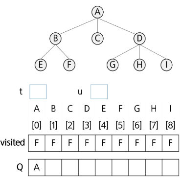

### 연습
- 1번 정점부터 너비 우선 탐색하는 경우 정점 방문 순서
    - 각 간선의 끝 정점<br>1 2 1 3 2 4 2 5 4 6 5 6 6 7 3 7
    - 방문 순서의 예 (구현 방법에 따라 중간 정점 순서는 달라질 수 있음)<br>1 2 3 4 5 7 6

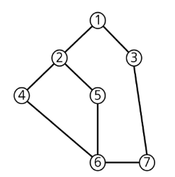

## Union-Find(Disjoint set)

### 서로소 집합(Disjoint-sets)
- 서로 공통 원소가 없는 집합
    - 교집합이 없는 집합들
- 대표자(representative)
    - 각 집합을 대표하는 하나의 원소
- 상호 배타 집합
    - 확률, 논리, 집합론에서 동시에 일어날 수 없는 경우, 공통이 없는 경우를 말함
    - 집합론에서는 **서로소와 같은 뜻**으로 사용
- 표현 방법
    - 연결리스트로 표현 가능
    - 트리를 이용해 표현 가능

### 서로소 집합 연산
- Make-Set(x)
    - x를 원소로 가진 집합을 만듦.
- Find-Set(x)
    - x가 속한 집합의 대표 원소를 반환
- Union(x, y)
    - y가 속한 집합과 x가 속한 집합의 합집합을 만듦.
    - x가 합집합의 대표 원소가 됨.

### 상호 배타 집합 예
- Make-Set(x)
- Make-Set(y)
- Make-Set(a)
- Make-Set(b)
- Union(x, y)
- Union(a, b)
- Find-Set(y) -> x
- Find-Set(b) -> a
- Union(x, a)

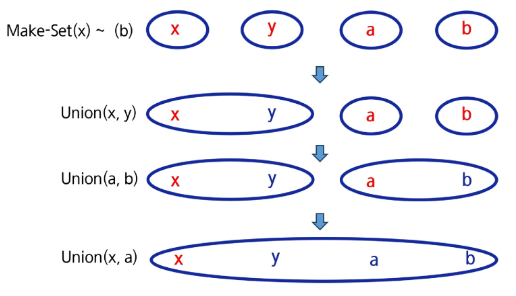

### 상호 배타 집합 표현 - 연결리스트
- 같은 집합의 원소들은 하나의 연결리스트로 관리
- 연결리스트의 맨 앞의 원소가 집합의 대표 원소
- 각 원소는 집합의 대표원소를 가리키는 링크를 가짐

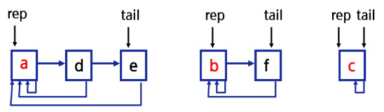

### 연결리스트 연산 예
- Find-Set(e)   return a
- Find-Set(f)   return b
- Union(a, b)

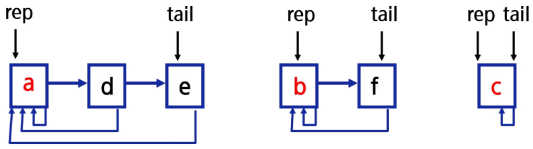

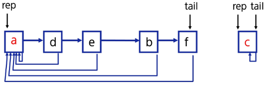

### 상호 배타 집합 표현 - 트리
- 하나의 집합(a disjoint set)을 하나의 트리로 표현
- 자식 노드가 부모 노드를 가리키며 루트 노드가 대표자가 됨

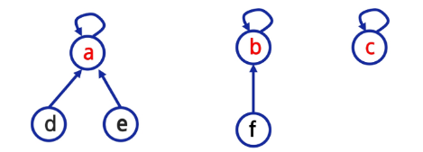

### 트리 연산 예
- Make-Set(a) ~ Make-Set(f)


- Union(c, d), Union(e, f)

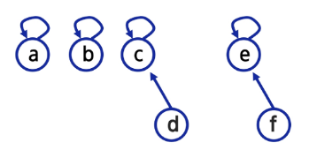

- Union(d, f)
- Find-Set(d)   return c
- Find-Set(e)   return c

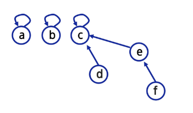

### 상호 배타 집합을 표현한 트리의 배열을 이용한 저장

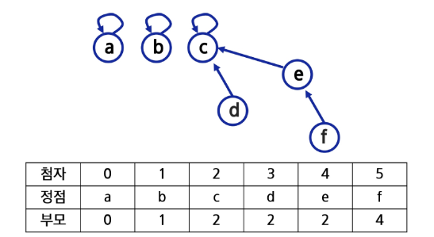

### 상호 배타 집합에 대한 연산
- Make-Set(x): 유일한 멤버 x를 포함하는 새로운 집합을 생성하는 연산

```
Make-Set(x)
    p[x] <- x
```

- Find-Set(x): x를 포함하는 집합을 찾는 연산

```
Find-Set(x)
    IF x == p[x]: RETURN x
    ELSE        : RETURN Find-Set([x])
```

- Union(x, y): x와 y를 포함하는 두 집합을 통합하는 연산

```
Union(x, y)
    p[Find-Set(y)] <- Find-Set(x)
```

- Find-Set(x): x를 포함하는 집합을 찾는 연산 (반복)

```py
Find-Set(x)
    while x != p[x]
        x = p[x]
    return x
```

- Make-Set(1)~(6)
- Union(1, 3)
- Union(2, 3)
- Union(5, 6)
- 여기까지 연산 후 P 배열

Index|1|2|3|4|5|6
:-:|:-:|:-:|:-:|:-:|:-:|:-:
P|2|2|1|4|5|5

- Find-Set(6)
    - 5가 반환

### 상호 배타 집합에 대한 연산 문제점
- 편향 트리가 되는 경우 Find-Set()에 시간이 오래 걸림
- Find-Set()에서 찾아진 대표 원소로 각 원소의 대표원소를 바꾸면 경로가 단축됨

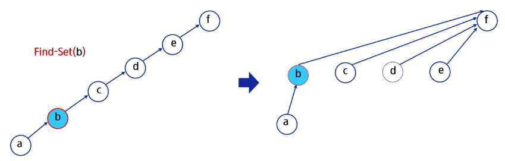

### 연산의 효율을 높이는 방법
- Rank를 이용한 Union
    - 각 노드는 자신을 루트로 하는 subtree의 높이를 랭크(Rank)라는 이름으로 저장
    - 두 집합을 합칠 때 rank가 낮은 집합을 rank가 높은 집합에 접목

### 랭크를 이용한 Union에서 랭크가 증가하는 예

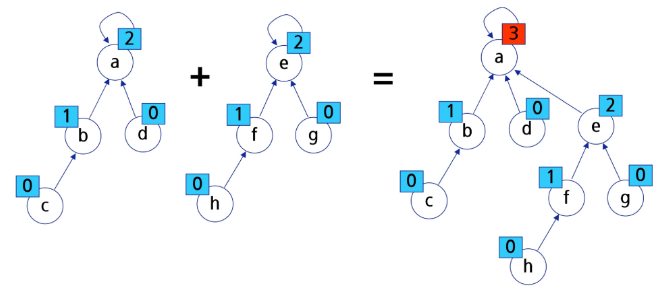

### 연산의 효율을 높이는 방법
- Path compression
    - Find-Set을 행하는 과정에서 만나는 모든 노드들이 직접 root를 가리키도록 포인터를 바꿔줌

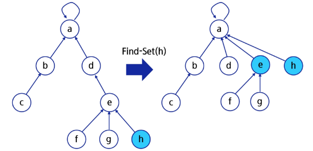

### Make-Set() 연산
- Make-Set(x): 유일한 멤버 x를 포함하는 새로운 집합을 생성하는 연산

```
p[x]: 노드 x의 부모 저장
rank[x]: 루트 노드가 x인 트리의 랭크값 저장

Make-Set(x)
    p[x] <- x
    rank[x] <- 0
```

### Find-Set() 연산
- Find-Set(x): x를 포함하는 집합을 찾는 오퍼레이션

```c
Find-Set(x)
    IF x != p[x]        // x가 루트가 아닌 경우
        p[x] <- Find-Set(p[x])
    RETURN p[x]
```

- Find-Set() 연산은 특정 노드에서 루트까지의 경로를 찾아가며 노드의 부모 정보를 갱신

### Union 연산
- Union(x, y): x와 y를 포함하는 두 집합을 통합하는 오퍼레이션

```
Union(x, y)
    Link(Find-Set(x), Find-Set(y))
```

```c
Link(x, y)
    IF rank[x] > rank[y]        // rank는 트리의 높이
        p[y] <- x
    ELSE
        p[x] <- y
    IF rank[x] == rank[y]
        rank[y]++
```

### 실습
- DFS
    - 24220. 경로의 수 (user)
- BFS
    - 5247. 연산
- Union-Find(Disjoint set)
    - 5248. 그룹 나누기
- 추가 연습
    - 10966. 물놀이를 가자
