# 최소 비용 신장 트리

## 최소 비용 신장 트리(MST)

### 대표적인 트리의 종류
- 그래프에서 최소 비용 문제
    - 모든 정점을 연결하는 간선들의 가중치의 합이 최소가 되는 트리를 찾음
    - 두 정점 사이의 비용이 최소인 경로를 찾음
- 신장 트리
    - N개의 정점으로 이루어진 무방향 그래프에서 N개의 정점과 N-1개의 간선으로 이뤄진 트리
- **최소 신장 트리(MST, Minimum Spanning Tree)**
    - 무방향 가중치 그래프에서 신장 트리를 구성하는 간선들의 가중치 합이 최소인 신장 트리

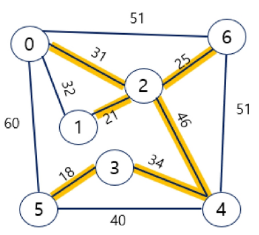

### 그래프의 표현
- 인접행렬
- 인접 리스트

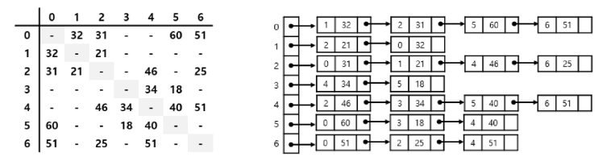

### MST 표현
- 그래프


- 간선들의 배열

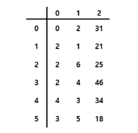

- 인접 리스트

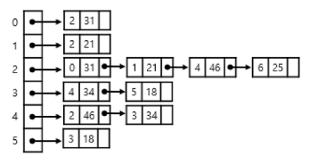

- 트리

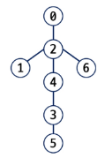

- 부모 자식 관계와 가중치에 대한 배열

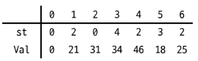

### MST 찾기
- Prim 알고리즘
- Kruskal 알고리즘

## Prim 알고리즘

### Prim 알고리즘이란?
- 하나의 정점에서 연결된 간선들 중에 하나씩 선택하면서 MST를 만들어 가는 방식
    1. 임의 정점을 하나 선택해서 시작
    2. 선택한 정점과 인접하는 정점들 중의 최소 비용의 간선이 존재하는 정점을 선택
    3. 모든 정점이 선택될 때까지 1, 2 과정을 반복
- 서로소인 2개의 집합 정보를 유지
    - 트리 정점들(tree vertices): MST를 만들기 위해 선택된 정점들
    - 비트리 정점들(nontree vertices): 선택되지 않은 정점들
- 완전 그래프일수록 유리함

### Prim 알고리즘 적용 예

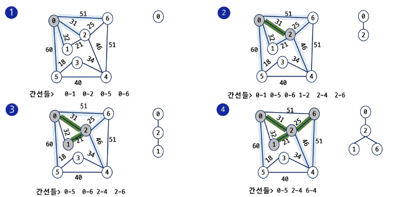

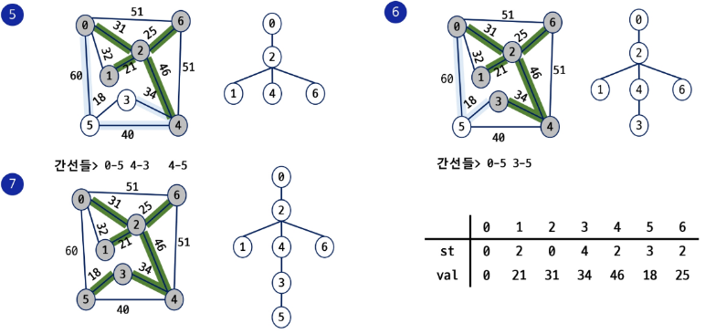

### Prim 알고리즘 연습

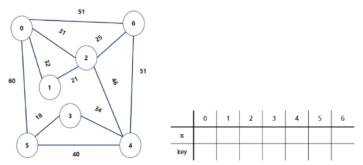

### Prim 알고리즘

```c
MST_PRIM(G, r)                              // G: 그래프, r: 시작 정점
    FOR u in G.V
        u.key <- 'inf'                      // u.key: u에 연결된 간선 중 최소 가중치
        u.π <- NULL                         // u.π: 트리에서 u의 부모
    r.key <- 0
    Q <- G.V                                // 우선순위 Q에 모든 정점 넣는다
    WHILE Q != 0                            // 빈 Q가 아닐 동안 반복
        u <- Extract_MIN(Q)                 // key 값이 가장 작은 정점 가져오기
        FOR v in G.Adj[u]                   // u의 인접 정점들
            IF v ∈ Q AND w(u, v) < v.key    // Q에 있는 v의 key값 갱신
            v.π <- u
            v.key <- w(u, v)
```

## Kruskal 알고리즘

### 간선을 하나씩 선택해서 MST를 찾는 알고리즘
1. 최초, 모든 간선을 **가중치에 따라 오름차순으로 정렬**
2. 가중치가 가장 낮은 간선부터 선택하면서 트리를 증가시킴
    - 사이클이 존재하면 다음으로 가중치가 낮은 간선 선택
3. n-1개의 간선이 선택될 때까지 2를 반복


### Kruskal 알고리즘 적용 예시

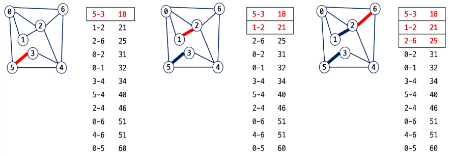

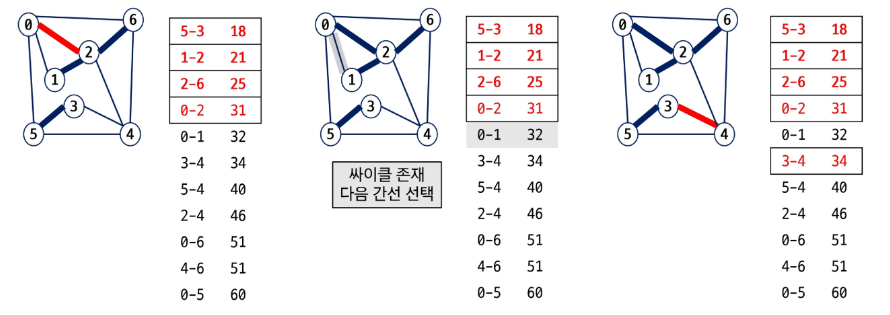

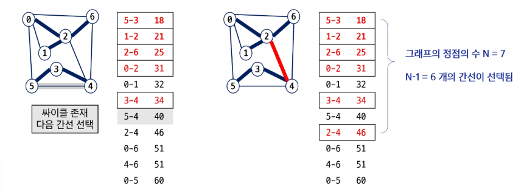

### Kruskal 알고리즘

```c
MST-KRUSKAL(G, w)
    A <- 0                      // 0: 공집합
    FOR vertex v in G.V         // G.V: 그래프의 정점 집합
        Make_Set(v)             // G.E: 그래프의 간선 집합

    G.E에 포함된 간선들을 가중치 w 에 의해 정렬

    FOR 가중치가 가장 낮은 간선 (u, v) ∈ G.E 선택(n-1개)
        IF Find_Set(u) != Find_Set(v)
            A <- A ∪ {(u, v)}
            Union(u, v);
    
    RETURN A
```

# 최단 경로

## Dijkstra 알고리즘

### 최단 경로란?
- 간선의 가중치가 있는 그래프에서 두 정점 사이의 경로들 중에 간선의 가중치의 합이 최소인 경로

### 최단 경로의 종류
1. 하나의 시작 정점에서 끝 정점까지의 최단 경로
    - 다익스트라(Dijkstra) 알고리즘: **음의 가중치를 허용하지 않음**
    - 벨만-포드(Bellaman-Ford) 알고리즘: 음의 가중치 허용
2. 모든 정점들에 대한 최단 경로
    - 플로이드-워샬(Floyd-Warshall) 알고리즘

### Dijkstra 알고리즘이란?
- 시작 정점에서 거리가 최소인 정점을 선택해 나가면서 최단 경로를 구하는 방식

### Dijkstra 알고리즘
- 시작 정점(s)에서 끝 정점(t)까지의 최단 경로에 정점 x가 존재함
- 이 때, 최단 경로는 s에서 x까지의 최단 경로와 x에서 t까지의 최단 경로로 구성됨
- 탐욕 기법을 사용한 알고리즘으로 MST의 Prim 알고리즘과 유사함

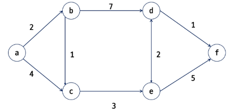

```
s: 시작 정점, A: 인접 행렬, D: 거리
V: 정점 집합, U: 선택된 정점 집합

Dijkstra(s, A, D)
    U = { s };

    FOR 모든 정점 v
        D[v] <- A[s][v]
    
    WHILE U != V
        D[w]가 최소인 정점 w ∈ V-U 를 선택
        U <- U ∪ {w}

        FOR w 에 인접한 모든 정점 v
                D[v] <- min(D[v], D[w] + A[w][v])
```

### Dijkstra 알고리즘 적용 예시
- 정점 a에서 각 정점으로 가는 최소비용은?


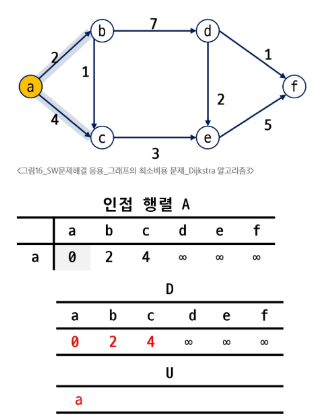

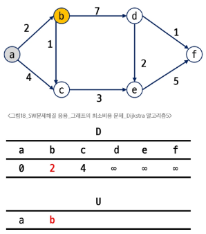

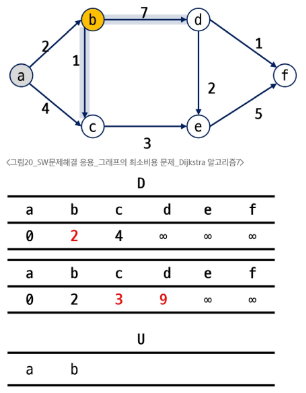

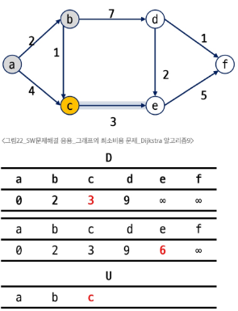

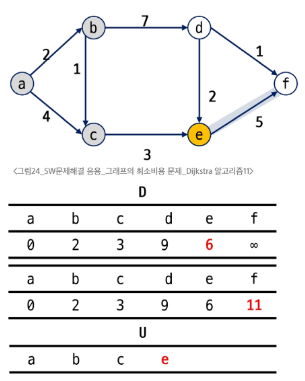

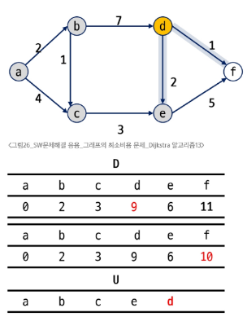

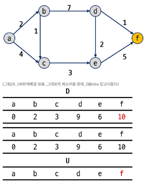

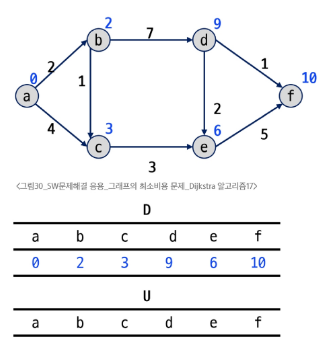

### 실습
- MST
    - 5249. 최소 신장 트리
- Dijkstra
    - 5250. 최소 비용
    - 5251. 최소 이동 거리
- 추가 연습
    - 1795. 인수의 생일 파티
