# List

## 과정 소개

### 학습 내용
- 자료구조와 알고리즘

### 학습 목표
- 논리적 사고력 향상
- 문제 해결 능력 향상
    
    -> 최종 목표는 연습 문제가 아닌 '**현실 세계 문제**'

### 학습 도구
- Python (Pypy) + PyCharm + swexpertacademy.com(SWEA) + AI

### APS(Algorithm Problem Solving) 기본 학습
- 기초 자료 구조 이해 중심
    - 입출력을 제외한 내장함수를 사용하지 않는다.
    - 기본적인 내장함수의 **동작원리**를 이해
- AI 활용 방법
    - 교과서가 아닌 학습에 도움을 받는 용도로 사용
    - 문제 전체를 넘기고 코드를 요구해서는 안 됨
    - 대화를 통해 문제점을 찾도록 작은 단위로 질문
- 다른 사람이 작성한 코드를 많이 읽어보는 것이 중요
- 코드를 눈으로 보는 것이 아니라 직접 따라 입력
- 코드가 외워질 정도로 반복해야 이해가 잘 됨

## 알고리즘(Algorithm)
문제를 해결하기 위한 **절차나 방법**

### 의사코드(슈도코드, Pseudocode)와 순서도
- 컴퓨터 분야에서 알고리즘을 표현하는 방법

```
CalcSum(n)
    sum <- 0
    for i : 1 -> n
        sum <- sum + i
    return sum;
```

### 알고리즘의 성능
- APS 과정의 목표 중 하나: 보다 좋은 알고리즘을 이해하고 활용하기
- 좋은 알고리즘이란?
    - 정확성(***1차 목표***): 얼마나 정확하게 동작하는가
    - 작업량: 얼마나 적은 연산으로 원하는 결과를 얻어내는가
    - 메모리 사용량: 얼마나 적은 메모리를 사용하는가
    - 단순성: 얼마나 단순한가
    - 최적성: 더 이상 개선할 여지 없이 최적화되었는가
---
***IM, A: 정확성***

***B: 작업량, 메모리 사용량, 단순성***

---
- 주어진 문제를 해결하기 위해 여러 개의 다양한 알고리즘이 가능
    - 어떤 알고리즘을 사용해야 하는가를 고려

- 알고리즘의 성능 분석 필요
    - 많은 문제에서 성능 분석의 기준으로 작업량 비교

### 알고리즘 성능 비교 예시
- 1부터 100까지 합을 구하는 문제

알고리즘1|알고리즘2
:-:|:-:
1+2+3+...+100 = 5050|100*(1+100)/2 = 5050
100번의 연산(덧셈 100번)|3번의 연산(덧셈 1번, 곱셈1번, 나눗셈 1번)

### 알고리즘의 시간 복잡도
- 알고리즘의 작업량을 표현할 때 시간 복잡도로 표현
- 시간 복잡도(Time Complexity)
    - 실제 걸리는 시간을 측정
    - 실행되는 명령문의 개수를 계산

알고리즘1|알고리즘2
:-|:-
def CalcSum(n):<br>　sum <- 0; # 1번<br>　for i in range(1, n+1): # n번<br>　　sum <- sum + i; # n번<br>　return sum;|def CalcSum(n):<br>　return n*(n+1)//2 # 3번
1 + n * 2 = 2n + 1|3번의 연산

### 시간 복잡도 표시
- 빅-오 표기법(Big-O Notation)을 언급하는 경우가 많음
- 시간 복잡도 함수 중에서 가장 큰 영향력을 주는 n에 대한 항만을 표시
- 계수(Coefficient)는 생략하여 표시

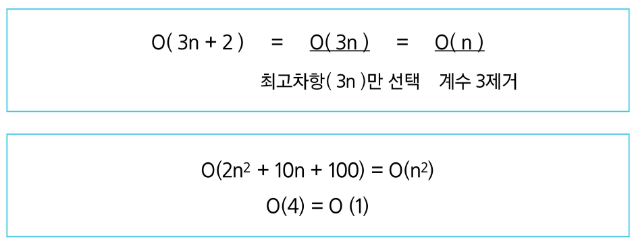

### 빅-오(O) 표기법 적용 예


### 빅-오 표기법(Big-O Notation)
- 비교
    - 요소 수가 증가함에 따라 각기 다른 시간 복잡도의 알고리즘은 아래와 같은 연산 수를 보임

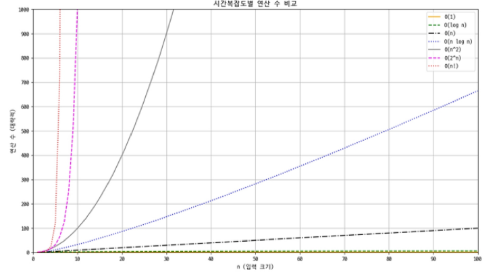

### 시간 복잡도별 실제 실행 시간 비교

**Q. 5천만에 대한 연산을 수행한다면?**

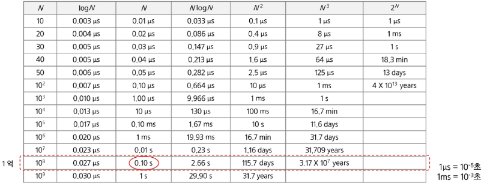

## 배열(Array)
일정한 자료형의 변수들을 하나의 이름으로 열거하여 사용하는 자료구조

### 배열의 예시
- 6개의 변수를 사용해야 하는 경우

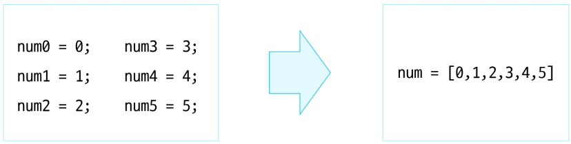

### 배열의 필요성
- 프로그램 내에서 여러 개의 변수가 필요할 때
    - 일일이 다른 변수명을 이용해 자료에 접근하는 것은 매우 비효율적
- 배열을 사용하면 하나의 선언을 통해 둘 이상의 변수 선언
- 단순히 다수의 변수 선언을 의미하는 것이 아님
    - 다수의 변수로는 하기 힘든 작업을 배열을 활용하여 쉽게 가능

### 1차원 배열
- 배열을 선언할 때는 프로그램에서 사용할 배열 이름이 필요

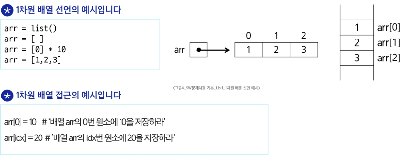

### 입력 받은 정수를 1차원 배열에 저장하는 방법
- 첫 줄에 양수의 개수 N이 주어짐 (5 <= N <= 1000)
- 다음 줄에 빈칸으로 구분된 N개의 양수 Ai가 주어짐 (1 <= Ai <= 1000000)

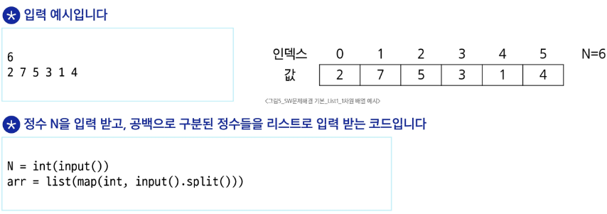

### 배열 원소의 합 s 계산하기

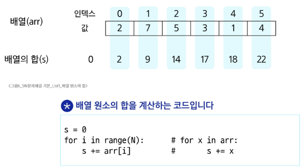

### 배열 원소 중 최댓값 max_v 찾기

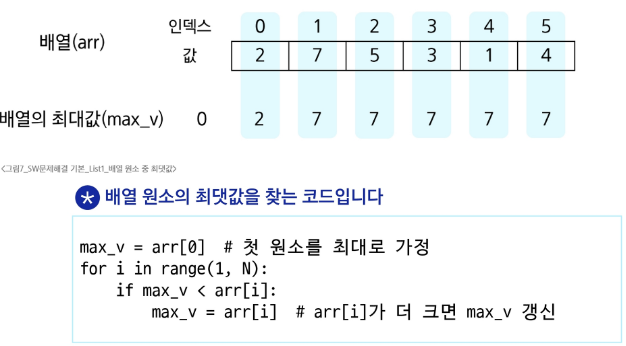

### 배열 원소 중 최댓값의 인덱스 max_idx 찾기

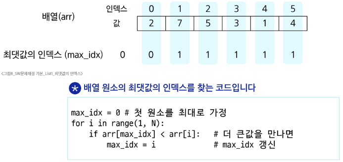

**Q. 최댓값이 여러 개인 경우?**

***가장 왼쪽의 최댓값 인덱스***

### 최댓값이 여러 개인 경우 마지막 인덱스 max_idx 찾기

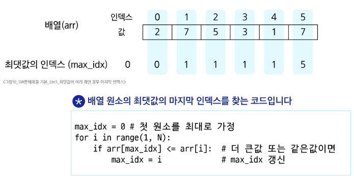

### 찾는 값이 배열에 있으면 해당 원소의 인덱스, 없으면 -1을 idx에 넣기
- 5를 찾는 경우

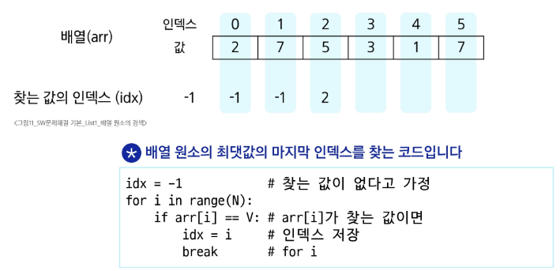

## 연습 문제

- SWEA16117, SWEA16118, SWEA24735

## 버블 정렬 (Bubble Sort)

### 정렬(Sort)
2개 이상의 자료를 *키*(특정 기준)에 의해 작은 값부터 큰 값(오름차순: ascending), 혹은 그 반대의 순서대로(내림차순: descending) 재배열하는 알고리즘

### 정렬의 종류
- APS 과정을 통해 자료 구조와 알고리즘을 학습하며 다양한 형태의 정렬을 학습
- 대표적인 정렬 방식의 종류

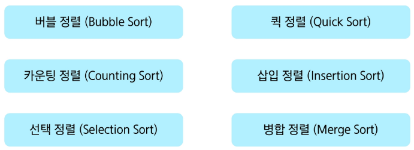

### 버블 정렬(Bubble Sort)의 정의
인접한 두 개의 원소를 비교하며 자리를 계속 교환하는 방식

### 버블 정렬 과정
    1. 첫 번째 원소부터 인접한 원소끼리 계속 자리를 교환하며 맨 마지막 자리까지 이동
    2. 한 단계가 끝나면 가장 큰 원소가 마지막 자리로 정렬
    3. 교환하며 자리를 이동하는 모습이 물 위에 올라오는 거품 모양과 같다고 하여 버블 정렬

### 시간 복잡도
- O(n^2)

### 버블 정렬 과정 예시
- [55, 7, 78, 12, 42]를 버블 정렬하는 과정 (오름차순)

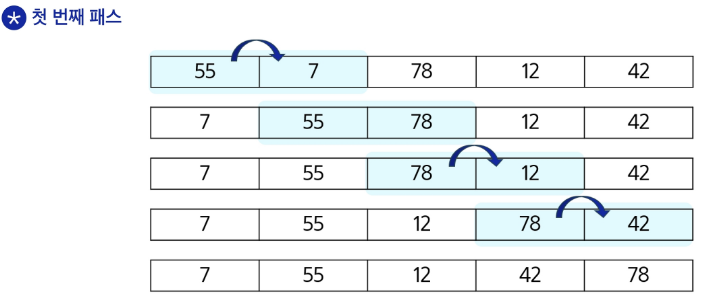

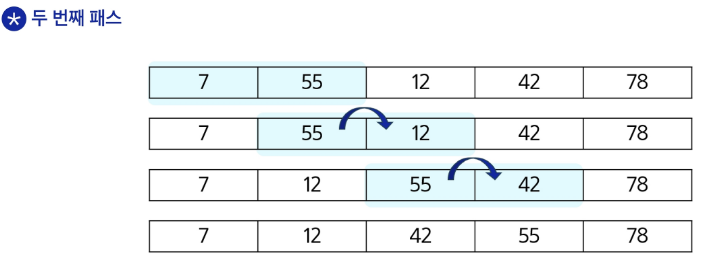

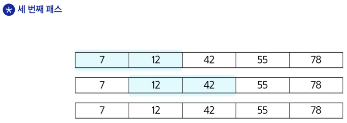

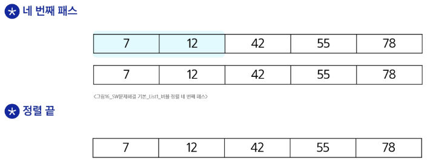

### 버블 정렬 알고리즘
- 배열을 활용한 버블 정렬 알고리즘 예시 (오름차순)

```
BulbbeSort(a, N)                    # 정렬할 배열과 배열의 크기
    for i : N-1 -> 1                # 정렬할 구간의 끝
        for j : 0 -> i-1            # 비교할 원소 중 왼쪽 원소의 인덱스
            if a[j] > a[j+1]        # 왼쪽 원소가 더 크면
                a[j] <-> a[j+1]     # 오른쪽 원소와 교환
```

```
def bubble_sort(a, N):
    for i in range(N-1, 0, -1):
        for j in range(i):
            if a[j] > a[j+1]:
                a[j], a[j+1] = a[j+1], a[j]
```
