## 카운팅 정렬 (Counting Sort)
항목들의 순서를 결정하기 위해 집합에 각 항목이 몇 개씩 있는지 세는 작업을 하여, 선형 시간에 정렬하는 효율적인 방식

### 카운팅 정렬 제한 사항
1. 정수나 정수로 표현할 수 있는 자료에 대해서만 적용 가능
- 각 항목의 발생 회수를 기록하기 위해, 정수 항목으로 인덱스되는 카운트들의 배열을 사용하기 때문
2. 카운트들을 위한 충분한 공간을 할당하려면 집합 내의 가장 큰 정수를 알아야 함

### 시간 복잡도
- O(n + k): n은 리스트 길이, k는 정수의 최댓값

### 카운팅 정렬 과정 예시
- `[0, 4, 1, 3, 1, 2, 4, 1]` 을 카운팅 정렬하는 과정

**1단계: DATA에서 각 항목들의 발생 횟수를 세고, 정수 항목들로 직접 인덱스되는 카운트 배열 `COUNTS` 에 저장**

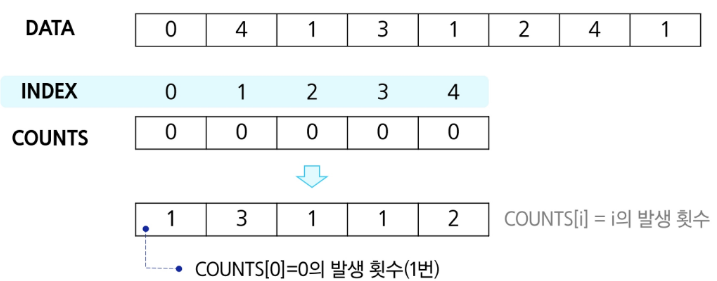

**2단계: 정렬된 집합에서 각 항목의 앞에 위치할 항목의 개수를 반영하기 위해 COUNTS의 원소를 조정**

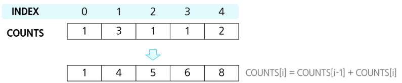

**3단계-1: DATA의 마지막 원소 1의 발생 횟수 COUNTS[1]을 감소시키고 TEMP에 1을 삽입**

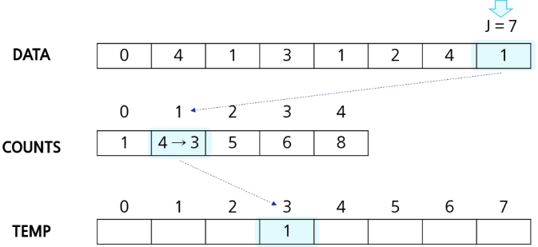

**3단계-2: COUNTS[4]를 감소시키고 TEMP에 4를 삽입**

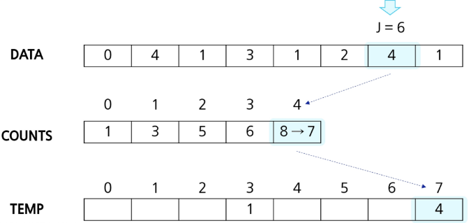

**3단계-3: COUNTS[2]를 감소시키고 TEMP에 2를 삽입**

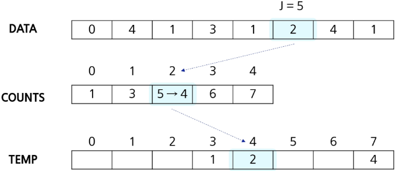

**3단계-4: COUNTS[1]을 감소시키고 TEMP에 1을 삽입**

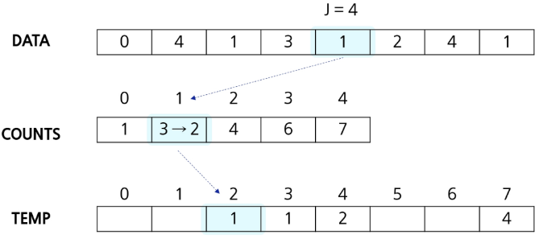

**3단계-5: COUNTS[3]을 감소시키고 TEMP에 3을 삽입**

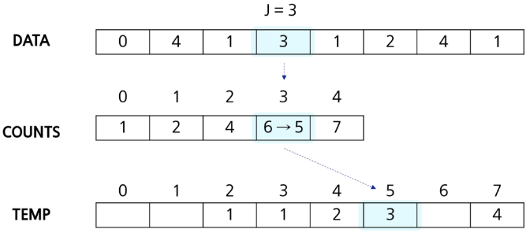

**3단계-6: COUNTS[1]을 감소시키고 TEMP에 1을 삽입**

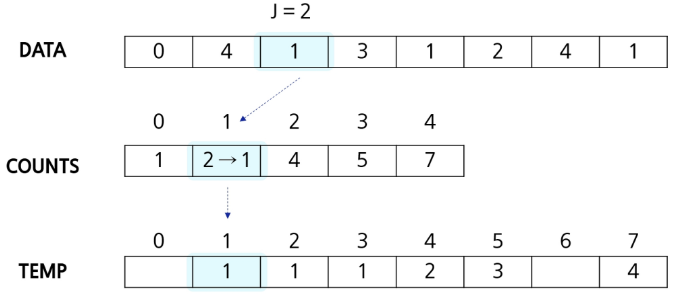

**3단계-7: COUNTS[4]을 감소시키고 TEMP에 4을 삽입**

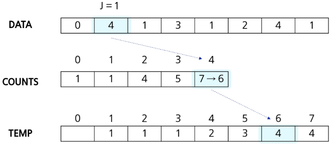

**3단계-8: COUNTS[0]을 감소시키고 TEMP에 0을 삽입**

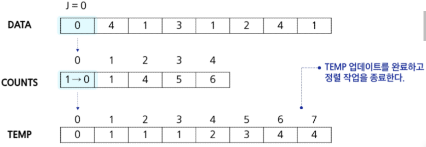

---

> ### 안정 정렬, 불안정 정렬

**1. 정렬의 안정성(stability)이란?**

- 안정 정렬(Stable Sort)
    - 동일한 키(또는 값)를 가진 원소들 간의 **상대적 순서**(**relative order**)를 보존하는 정렬 방식
- 불안정 정렬(Unstable Sort)
    - 동일한 키를 가진 원소들의 상대적 순서를 보장하지 않으며, 경우에 따라 뒤바뀔 수 있는 정렬 방식

ex) 원소가 `(값, 태그)` 형태인 리스트

```
[(3, 'A'), (1, 'B'), (3, 'C'), (2, 'D'), (1, 'E')]  
```

여기에 값만 기준으로 오름차순 정렬하면,

- **안정 정렬**은 `(3, 'A')`와 `(3, 'C')`의 순서 유지

```
[(1, 'B'), (1, 'E'), (2, 'D'), (3, 'A'), (3, 'C')]  
```

- **불안정 정렬**은 둘의 순서가 뒤바뀔 수 있음

```
[(1, 'E'), (1, 'B'), (2, 'D'), (3, 'C'), (3, 'A')]  
```

2. **대표적인 안정/불안정 정렬 알고리즘**

| **안정 정렬 (Stable)**                      | **불안정 정렬 (Unstable)**      |
| ----------------------------------- | ---------------------- |
| 버블 정렬 (Bubble Sort)                 | 선택 정렬 (Selection Sort) |
| 삽입 정렬 (Insertion Sort)              | 힙 정렬 (Heap Sort)       |
| 병합 정렬 (Merge Sort)                  | 퀵 정렬 (Quick Sort)      |
| 계수 정렬, 기수 정렬 (Counting, Radix Sort) | 셸 정렬 (Shell Sort)      |

- **안정 정렬**
    - **버블, 삽입, 병합** 등: 동일 키끼리 교환하지 않거나, 보조 배열을 사용해 합병 시 원래 순서를 유지
    - **추가 메모리**(병합 정렬)나 **비교 횟수**(버블 정렬)가 다소 늘어날 수 있음
- **불안정 정렬**
    - **힙, 선택, 퀵** 등: 인접 교환보다는 피벗 교환, 트리 구조 변경 등으로 순서 유지 어려움
    - **제자리(in-place)** 구현이 가능해 **메모리 효율**이 좋음

3. 안정 정렬 vs 불안정 정렬 비교

| **비교 기준**      | **안정 정렬**                     | **불안정 정렬**                  |
| ---------- | ------------------------- | ----------------------- |
| 상대 순서 보존   | O (동일 키 원소 순서 유지)         | X (순서 보장 안 됨)           |
| 구현 난이도     | 비교적 쉽다 (버블, 삽입 등)          | 보통 (힙, 퀵)               |
| 시간 복잡도     | 평균/최악 O(n²) 또는 O(n log n) | 평균 O(n log n), 최악 O(n²) |
| 공간 복잡도     | O(1)\~O(n) (병합은 추가 O(n))  | 대부분 O(1) (힙, 퀵)         |
| 다중 키 정렬 활용 | ✓ (1차 정렬 후 2차 정렬에 유리)     | ✗ (다중 키 시 순서 꼬일 수 있음)   |

- **다중 키 정렬 (Multi-key Sorting)**
    - 예: '이름'으로 1차 정렬 후, '점수'로 2차 정렬
    - **안정 정렬** 사용 시 1차 정렬 결과가 2차 정렬 때 보존되어 의도한 결과 획득

**4. 언제 안정 정렬을 선택할까?**

    1. 다중 기준 정렬이 필요할 때
        - 예: '부서'별 -> '입사일' 순서로 정렬
    2. 동일 키에 대한 원본 순서 보존이 중요할 때
        - 로그, 이벤트 타임스탬프 등 순차성 유지 필요
    3. 언어/라이브러리의 기본 정렬이 안정 정렬일 때
        - Python의 sorted(), Java의 Collections.sort()는 안정 정렬
        - 별도 구현 없이도 2차 정렬 활용 가능

**반면,**

- **메모리 제약이 크고**
- **단일 키 정렬**만 하면 되며
- **추가 순서 보존이 필요 없는** 상황이라면

불안정 정렬(퀵·힙 등)을 사용해 성능과 **메모리 효율**을 높일 수 있다.

**5. 요약**

- **안정 정렬**은 **같은 값끼리 순서 보존**, 다중 키 정렬에 유리하지만 추가 메모리나 비교 비용 발생할 수 있음
- **불안정 정렬**은 **메모리 효율**과 **제자리 구현**이 가능하나, 같은 값끼리 순서를 보장하지 않음
- 상황에 따라 “순서 보존이 중요한지” vs “메모리·성능 최적화가 중요한지”를 기준으로 선택

---
### 카운팅 정렬 알고리즘

```
def counting_sort(DATA, TEMP, K):
# DATA [] -- 입력 배열(원소는 0 이상 k 이하 정수)
# TEMP [] -- 정렬된 배열
# COUNTS [] -- 카운트 배열

COUNTS = [0] * (k+1)

for i in range(len(DATA)): # DATA[i] 발생횟수 기록
    COUNTS[DATA[i]] += 1

for i in range(1, k+1):    # COUNTS 값 조정 (누적)
    COUNTS[i] += COUNTS[i-1]

for i in range(len(DATA)-1, -1, -1):    # 3단계
    COUNTS[DATA[i]] -= 1
    TEMP[COUNTS[DATA[i]]] = DATA[i]
```

### 정렬 알고리즘 비교

알고리즘|평균 수행시간|최악 수행시간|알고리즘 기법|비고
:-:|:-:|:-:|:-:|:-:
버블 정렬|O(n^2)|O(n^2)|비교와 교환|코딩이 가장 손쉬움
카운팅 정렬|O(n+k)|O(n+k)|비교환 방식|n이 비교적 작을 때만 가능
선택 정렬|O(n^2)|O(n^2)|비교와 교환|교환의 회수가 버블,<br>삽입정렬보다 작다.
퀵 정렬|O(n log n)|O(n^2)|분할 정복|최악의 경우 O(n^2)이지만,<br>평균적으로는 가장 빠름
삽입 정렬|O(n^2)|O(n^2)|비교와 교환|n의 개수가 작을 때 효과적
병합 정렬|O(n log n)|O(n log n)|분할 정복|연결리스트의 경우 가장 효율적인 방식

## 완전 검색

### Baby-gin Game

```
0~9 사이의 숫자 카드에서 임의의 카드 6장을 뽑았을 때, 3장의 카드가 연속적인 번호를 갖는 경우를 run이라 하고, 3장의 카드가 동일한 번호를 갖는 경우를 triplet이라고 한다.

그리고, 6장의 카드가 run과 triplet로만 구성된 경우를 baby-gin으로 부른다.

6자리의 숫자를 입력 받아 baby-gin 여부를 판단하는 프로그램을 작성하라.
```

**입력 예시**
```
- 667767은 두 개의 triplet이므로 baby-gin이다. (666, 777)
- 054060은 한 개의 run과 한 개의 triplet이므로 역시 baby-gin이다. (456, 000)
- 101123은 한 개의 triplet이 존재하나, 023이 run이 아니므로 baby-gin이 아니다.
    (123을 run으로 사용하더라도 011이 run이나 triplet이 아님)

Q. 6자리의 숫자를 입력 받아 어떻게 Baby-gin 여부를 찾을 것인가?
```

### 완전 검색(Exaustive Search)의 정의
문제의 해법으로 생각할 수 있는 모든 경우의 수를 나열해보고 확인하는 기법

```
Brute-force 혹은 generate-and-test 기법이라고도 불림. 
모든 경우의 수를 테스트한 후, 최종 해법을 도출하는 방법으로 일반적으로 경우의 수가 상대적으로 작을 때 유용
```

### 완전 검색의 필요성
- 완전 검색으로 시작
    - 모든 경우의 수를 생성하고 테스트하기 때문에 수행 속도는 느리지만, 해답을 찾아내지 못 할 확률이 작다.
    - 자격검정평가 등에서 주어진 문제를 풀 때, 우선 완전 검색으로 접근하여 해답을 도출한 후, 성능 개선을 위해 알고리즘을 사용하고 해답을 확인하는 것이 바람직

### 완전 검색을 활용한 Baby-gin 접근

* 고려할 수 있는 모든 경우의 수 생성
    - 6개의 숫자로 만들 수 있는 모든 숫자 나열 (중복 포함)
    - 예) 입력으로 [2, 3, 5, 7, 7, 7]을 받았을 경우, 아래와 같이 순열 생성 가능

```
2   3   5   7   7   7

2   3   7   5   7   7

2   3   7   7   5   7

         ...

7   7   7   5   3   2
```

* 해답 테스트하기
    - 앞의 3자리와 뒤의 3자리를 잘라, run과 triplet 여부를 테스트하고 최종적으로 baby-gin을 판단

### 순열(Permutation)
- 서로 다른 것들 중 몇 개를 뽑아서 한 줄로 나열
- 서로 다른 n개 중 r개를 택하는 순열은 `nPr`
- 그리고 `nPr`은 다음과 같은 식이 성립

`nPr = n * (n-1) * (n-2) * ... * (n-r+1)`
- nPn = n!이라 표기하며 Factorial이라 부름

`n! = n * (n-1) * (n-2) * ... * 2 * 1`

### 단순하게 순열을 생성하는 방법
- {1, 2, 3}을 포함하는 모든 순열을 생성하는 함수
    - 동일한 숫자가 포함되지 않았을 때, 각 자릿수 별로 loop를 이용해 아래와 같이 구현

```
for i1 in range(1, 4):
    for i2 in range(1, 4):
        if i2 != i1:
            for i3 in range(1, 4):
                if i3 != i1 and i3 != i2:
                    print(i1, i2, i3)
```

## 탐욕 알고리즘(Greedy)
여러 경우 중 하나를 결정해야 할 때마다 그 순간에 최적이라고 생각되는 것을 선택해 나가는 방식으로 진행하여 최종적인 해답에 도달하는 방식

### 탐욕 알고리즘 특징
- 최적해를 구하는 데 사용되는 근시안적인 방법
- 각 선택의 시점에서 이루어지는 결정은 지역적으로는 최적이지만, 그 선택들을 계속 수집하여 최종적인 해답을 만들었다고 하여, 그것이 최적이라는 보장은 없음
- 일반적으로, 머릿속에 떠오르는 생각을 검증 없이 바로 구현하면 Greedy 접근임

### 탐욕 알고리즘 과정
1. 해 선택: 현재 상태에서 부분 문제의 최적 해를 구한 뒤, 이를 부분 해 집합(Solution Set)에 추가
2. 실행 가능성 검사: 새로운 부분 해 집합이 실행 가능한 지를 확인. 곧, 문제의 제약 조건을 위반하지 않는지 검사
3. 해 검사: 새로운 부분 해 집합이 문제의 해가 되는지 확인. 아직 전체 문제의 해가 완성되지 않았다면 1)의 해 선택부터 다시 시작

### 탐욕 알고리즘 예시
- 거스름돈 줄이기

    `어떻게 하면 손님에게 거스름돈으로 주는 지폐와 동전의 개수를 최소한으로 줄일 수 있을까?`

* 1단계: 해 선택
    - 여기서는 가장 좋은 해 선택
    - 단위가 큰 동전으로만 거스름돈을 만들면 동전의 개수 감소, 현재 고를 수 있는 가장 큰 단위의 동전을 골라 거스름돈에 추가

* 2단계: 실행 가능성 검사
    - 거스름돈이 손님에개 드릴 액수를 초과하는지 확인
    - 초과한다면 마지막에 추가한 동전을 빼고 1)로 돌아가 한 단계 작은 단위의 동전 추가

* 3단계: 해 선택
    - 거스름돈 문제의 해는 당연히 거스름돈이 손님에게 드릴 액수와 일치. 더 주거나, 덜 줘선 안 되기 때문에 액수가 모자라면 다시 1)로 돌아가 거스름돈에 추가할 동전 선택

### 탐욕 알고리즘을 활용한 Baby-gin 접근
- 6개의 숫자는 6자리의 정수 값으로 입력
- counts 배열의 각 원소를 체크, run과 triplet 및 baby-gin 여부를 판단

* 입력 예시: 444345

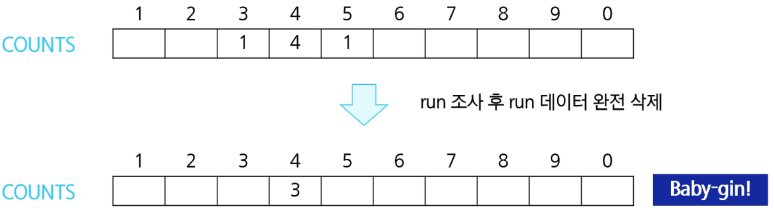

* 입력 예시: 333456

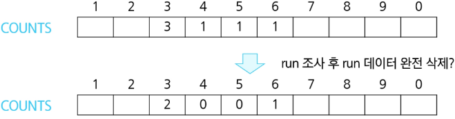

* 입력 예시: 444456

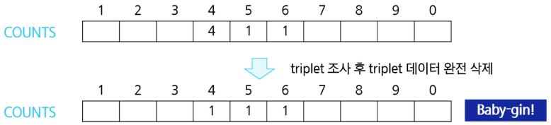

* 앞서 살펴 본 풀이를 코드로 구현하면 아래와 같다.

```
num = 456789    # Baby Gin 확인할 6자리 수
c = [0] * 12    # 6자리 수로부터 각 자리 수를 추출하여 개수를 누적할 리스트

for i in range(6):  # 자릿수를 모를 때: `while num > 0:` 사용
    c[num % 10] += 1    # c[끝에서 i번째 자릿수] 1 증가
    num //= 10

i = 0
tri = run = 0
while i < 10:
    if c[i] >= 3:   # triplet 조사 후 데이터 삭제
        c[i] -= 3
        tri += 1
        continue
    if c[i] >= 1 and c[i+1] >= 1 and c[i+2] >= 1:   # run 조사 후 데이터 삭제
        c[i] -= 1
        c[i+1] -= 1
        c[i+2] -= 1
        run += 1
        continue
    i += 1

if run + tri == 2: print('Baby Gin')
else: print('Lose')
```

### Baby-gin 문제에서 자주 실수하는 오답
- 입력받은 숫자를 정렬한 후, 앞뒤 3자리씩 끊어서 run 및 triplet을 확인하는 방법을 고려할 수도 있음

```
예) [6, 4, 4, 5, 4, 4]
정렬하여 [4, 4, 4, 4, 5, 6]을 얻어내면 쉽게 확인 가능

예) [1, 2, 3, 1, 2, 3]
정렬하면 [1, 1, 2, 2, 3, 3]으로 오히려 확인을 실패할 수 있음
```

***위의 예처럼, 탐욕 알고리즘적인 접근은 해답을 찾아내지 못 하는 경우도 있으니 유의***

> 추가 연습
- (User problem) 9386. 연속한 1의 개수  ***pass***
- 6485. 삼성시의 버스 노선              ***pass***
- 1966. 숫자를 정렬하자                 ***pass***