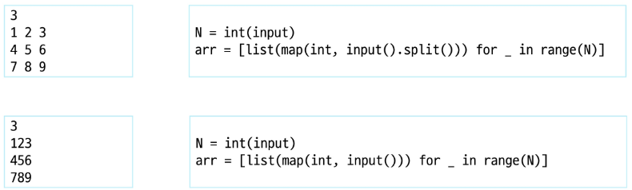
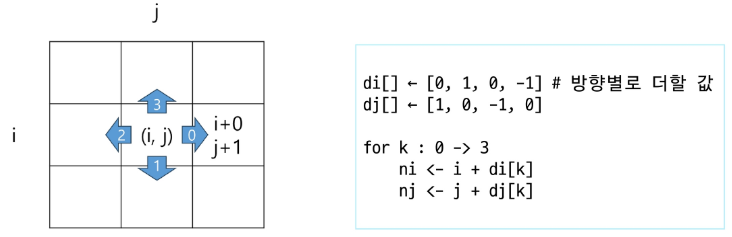
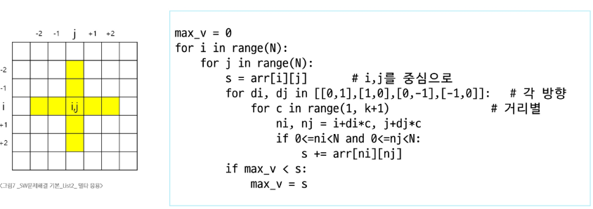
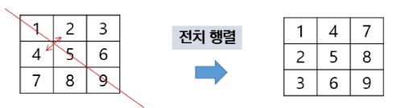
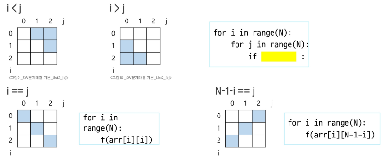
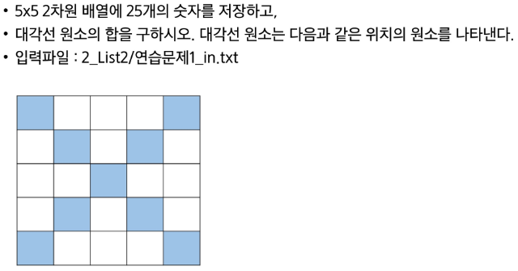
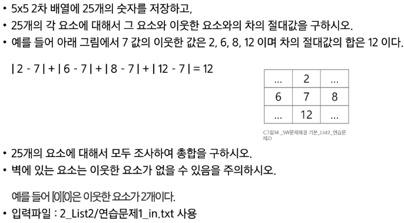

# 2차원 List

## 2차원 배열
- 1차원 List를 묶어놓은 List
- 2차원 이상의 다차원 List는 차원에 따라 Index를 선언
- 2차원 List의 선언: 세로 길이(행의 개수), 가로 길이(열의 개수)를 필요로 함
- Python에서는 데이터 초기화를 통해 변수 선언과 초기화가 가능

**arr = [[0, 1, 2, 3], [4, 5, 6, 7]] (2행 4열의 2차원 List)**

arr|0|1|2|3|열
:-:|:-:|:-:|:-:|:-:|:-:
**0**|0|1|2|3|
**1**|4|5|6|7|
**행**

### 입력을 2차원 배열에 저장하기



### 0으로 채워진 3x4 배열 만들기

<br>|0|1|2|3
:-:|:-:|:-:|:-:|:-:
**0**|0|0|0|0
**1**|0|0|0|0
**2**|0|0|0|0

```
arr = [[0] * 4 for _ in range(3)]
```

---

> ### 2차원 배열의 얕은 복사

2차원 배열(리스트)을 생성할 때 `*` 연산을 이용하면 **겉 리스트만 복사**되고, 내부 리스트(각 행)는 **같은 객체**를 참조하게 되어 의도치 않은 동작이 발생할 수 있다.

---

### 1. 문제 재현

````python
N = 3
arr = [[0] * N] * N
# arr == [
#   [0, 0, 0],
#   [0, 0, 0],
#   [0, 0, 0]
# ]

arr[0][1] = 7
print(arr)
# ▶ [
#   [0, 7, 0],
#   [0, 7, 0],
#   [0, 7, 0]
# ]
````

* `[[0] * N]` 으로 만든 하나의 내부 리스트를 `* N` 연산으로 N번 참조하기 때문에,
  `arr[0]`, `arr[1]`, `arr[2]`가 모두 같은 리스트 객체를 가리킨다.
* 따라서 어느 한 행의 값을 바꿔도 모든 행이 함께 변경

---

### 2. 원인

* `*` 연산은 **참조 복사**만 수행
* **겉 리스트**만 새로 만들고, **내부 리스트**는 원본과 **동일한 객체**를 가리킨다.
* 결과적으로 “얕은 복사(shallow copy)”가 일어나 내부 구조가 공유됨

---

### 3. 해결 방안

#### 3.1. 리스트 컴프리헨션

```python
N = 3
arr = [[0] * N for _ in range(N)]
# 각 반복마다 [0] * N 으로 새 리스트를 생성합니다.

arr[0][1] = 7
print(arr)
# ▶ [
#   [0, 7, 0],
#   [0, 0, 0],
#   [0, 0, 0]
# ]
```

* 한 줄씩 독립적인 리스트를 만들어 주므로,
  각 행(row)이 서로 다른 객체가 됨

#### 3.2. copy.deepcopy() 사용

```python
import copy

base_row = [0] * N
shallow = [base_row] * N        # 얕은 참조
deep = copy.deepcopy(shallow)   # 내부까지 완전 복제

deep[2][2] = 9
print(shallow)
# ▶ [
#   [0, 0, 0],
#   [0, 0, 0],
#   [0, 0, 0]
# ]
print(deep)
# ▶ [
#   [0, 0, 0],
#   [0, 0, 0],
#   [0, 0, 9]
# ]
```

* 중첩 구조가 더 깊어져도 안전하게 복제 가능

#### 3.3. 반복문으로 직접 초기화

```python
N = 3
arr = []
for _ in range(N):
    row = [0] * N
    arr.append(row)
```

* 리스트 컴프리헨션과 같은 원리로,
  명시적 반복문을 사용해 각 행을 별도 생성
---

### 4. 요약

| 생성식                           | 문제                        | 대안                            |
| ----------------------------- | ------------------------- | ----------------------------- |
| `[[0] * N] * N`               | 내부 리스트가 모두 같은 객체를 참조   | `[[0] * N for _ in range(N)]` |
| `[[0] * N for _ in range(N)]` | 각 행이 독립된 리스트로 생성됨 (문제 없음) | —                             |
| `copy.deepcopy(...)`          | 중첩이 깊어져도 안전하게 복제하지만 속도 느림 | (안정성이 최우선일 때 사용)              |

---

> **Tip.**
>
> * 2차원 구조(중첩 1단계)만 다룰 땐 **리스트 컴프리헨션**이 가장 간단하고 빠름
> * 복제가 더 복잡하거나 안정성이 필요하면 \*\*`copy.deepcopy()`\*\*를 사용
> * 수치 연산용 배열이라면 **NumPy**의 `.copy()` 메서드를 사용

---

### 배열 순회
- n X m 배열의 n*m 개의 모든 원소를 빠짐 없이 조사하는 방법

### 행 우선 순회

````py
# i 행의 좌표
# j 열의 좌표

for i in range(n):
    for j in range(m):
        f(array[i][j])
````

### N x M 배열의 크기와 저장된 값이 주어질 때 합을 구하는 법

```py
3 4
1 7 2 8
6 2 9 3
5 7 4 2


N, M = map(int, input().split())
arr = [list(map(int, input().split()))]

s = 0

for i in range(N):
    for j in range(M):
        s += arr[i][j]
```

### 열 우선 순회

```py
# i 행의 좌표
# j 열의 좌표

for j in range(m):
    for i in range(n):
        f(array[i][j])  # 필요한 연산 수행
```

### 지그재그 순회

```py
# i 행의 좌표
# j 열의 좌표

for i in range(n):
    for j in range(m):
        f(array[i][j + (m-1-2*j) * (i%2)])
```

---

#### 지그재그 순회란

2차원 배열(행렬)을 **대각선 방향으로 왔다 갔다**하거나, **한 줄씩 왼쪽→오른쪽, 오른쪽→왼쪽 번갈아가며** 탐색하는 방식

문제마다 지그재그의 정의가 다를 수 있으나, 대표적으로 아래 두 가지 방식이 자주 나옴

---

## 1. 행 기준 지그재그 순회 (Zigzag by Rows)

* **홀수/짝수 행마다 방향을 바꿔가며 한 줄씩 탐색**
* 예시:

  * 0번째(짝수) 행은 왼→오 (오른쪽방향)
  * 1번째(홀수) 행은 오→왼 (왼쪽방향)
  * 2번째(짝수) 행은 다시 왼→오 …

### 예시 배열

|   | 0 | 1  | 2  | 3  |
| - | - | -- | -- | -- |
| 0 | 1 | 2  | 3  | 4  |
| 1 | 5 | 6  | 7  | 8  |
| 2 | 9 | 10 | 11 | 12 |

### 순회 결과

```
1 2 3 4 8 7 6 5 9 10 11 12
```

### 파이썬 코드

```python
N = 3
M = 4
arr = [
    [1, 2, 3, 4],
    [5, 6, 7, 8],
    [9,10,11,12]
]

zigzag = []
for i in range(N):
    if i % 2 == 0:
        # 왼 → 오
        for j in range(M):
            zigzag.append(arr[i][j])
    else:
        # 오 → 왼
        for j in range(M-1, -1, -1):
            zigzag.append(arr[i][j])

print(*zigzag)
```

---

## 2. 대각선(Zigzag Diagonal, “Z”순회)

* **왼쪽 위에서 오른쪽 아래 대각선 방향으로 순회**
* 체스판의 말이 대각선으로 움직이듯 진행
* 주로 “대각선 합이 같은 원소들”을 한 번에 처리
  (`i+j`가 같은 원소들)

### 예시 배열

|   | 0 | 1 | 2 |
| - | - | - | - |
| 0 | 1 | 2 | 3 |
| 1 | 4 | 5 | 6 |
| 2 | 7 | 8 | 9 |

### 순회 결과 (↗ 방향/↙ 방향 번갈아)

```
1
2 4
7 5 3
6 8
9
```

> 보통 “대각선 합이 같은 곳끼리 묶어서” 번갈아 출력
> 대각선마다 방향을 바꿔서(오른쪽 위→왼쪽 아래, 또는 그 반대) 순회

### 파이썬 코드

```python
N = 3
arr = [
    [1, 2, 3],
    [4, 5, 6],
    [7, 8, 9]
]

result = []

for s in range(2*N-1):  # 대각선 합(i+j)가 0~4
    if s % 2 == 0:
        # 위→아래
        for i in range(N):
            j = s - i
            if 0 <= j < N:
                result.append(arr[i][j])
    else:
        # 아래→위
        for j in range(N):
            i = s - j
            if 0 <= i < N:
                result.append(arr[i][j])

print(*result)
```

**출력:**
`1 2 4 7 5 3 6 8 9`

---

## 3. 응용: 지그재그 순회 유형 정리

| 유형    | 설명                              | 대표 문제 키워드 |
| ----- | ------------------------------- | --------- |
| 행기준   | 각 행마다 탐색 방향을 번갈아 바꿈             | 행 지그재그    |
| 열기준   | 각 열마다 탐색 방향을 번갈아 바꿈             | 열 지그재그    |
| 대각선기준 | 대각선 합이 같은 원소들을 순차 탐색, 방향 번갈아 진행 | 대각선, Z순회  |

---

## 4. 마무리 Tip

* 지그재그 순회는 **문제의 요구**(**행 or 대각선**)에 따라 구현 방법이 달라짐.
* 인덱스의 증가/감소, 반복문의 방향, 조건문을 잘 활용하면 구현이 쉬워짐.
* **대각선 순회**는 `i+j == s` 같은 식으로 범위를 관리하는 것이 핵심.

---

## 델타

### 델타를 활용한 2차원 배열 탐색
- 2차 배열의 한 좌표에서 4방향의 인접 배열 요소를 탐색하는 방법
- 인덱스 (i, j)인 칸의 상하좌우 칸 (ni, nj)



- 2차 배열의 한 좌표에서 4방향의 인접 배열 요소를 탐색하는 방법

```
arr[0...N-1][0...N-1]   # NxN 배열
di[] <- [0, 1, 0, -1]
dj[] <- [1, 0, -1, 0]
for i : 0 -> N-1
    for j : 0 -> N-1
        for d : 0 -> 3
            ni <- i + di[d]
            nj <- j + dj[d]
            if 0<=ni<N and 0<=nj<N  # 유효한 인덱스면
                f(arr[ni][nj])
```

```
for i in range(N):
    for j in range(N):
        for di, dj in [[0, 1], [1, 0], [0, -1], [-1, 0]]:
            ni, nj = i+di, j+dj
        ...
```

### 델타 응용
- ex) NxN 배열에서 각 원소를 중심으로, 상하좌우 k칸의 합계 중 최대값 (k=2)



### 전치 행렬

```
# i: 행의 좌표, len(arr)
# j: 열의 좌표, len(arr[0])
arr = [[1, 2, 3], [4, 5, 6], [7, 8, 9]] # 3*3 행렬

for i in range(3):
    for j in range(3):  # for j in range(i):인 경우 if문 없어도 됨
        if i < j:   
            arr[i][j], arr[j][i] = arr[j][i], arr[i][j]
```



### i, j의 크기에 따라 접근하는 원소 비교 (N x N)



## 연습문제

> ### 연습문제 풀이




