## 부분집합

### 부분집합 합 문제
- 유한 개의 정수로 이루어진 집합이 있을 때, 이 집합의 부분집합 중에서 조건에 맞는 경우를 찾는 문제
- 예) 그 집합의 원소를 모두 더한 값이 0이 되는 경우가 있는지를 알아내는 문제

***예시***
```
예를 들어, [-7, -3, -2, 5, 8]이라는 집합이 있을 때, [-3, -2, 5]는 이 집합의 부분집합이면서 (-3) + (-2) + 5 = 0 이므로 이 경우의 답은 참이 된다.
```

### 부분집합 생성
- 완전 검색 기법으로 부분집합 합 문제 풀기
    - 우선 집합의 모든 부분집합을 생성한 후에 각 부분집합의 합을 계산
- 주어진 집합의 부분집합을 생성하는 방법 생각해보기

### 부분집합의 수
- 집합의 원소가 n개일 때, 공집합을 포함한 부분집합의 수는 2^n개
- 이는 각 원소를 부분집합에 포함시키거나 포함시키지 않는 2가지 경우를 모든 원소에 적용한 경우의 수와 같음
- 예) {1, 2, 3, 4} -> 2 x 2 x 2 x 2 = 16가지

### 부분집합의 원소를 표현하는 방법

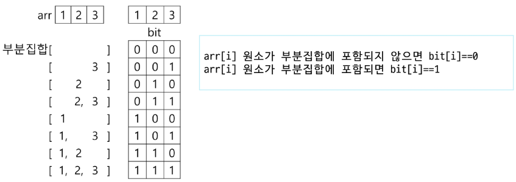

### 각 원소가 부분집합에 포함되었는 지를 loop를 이용하여 확인하고 부분집합을 생성하는 방법

```py
bit = [0, 0, 0, 0]
for i in range(2):
    bit[0] = i
    for j in range(2):
        bit[1] = j
        for k in range(2):
            bit[2] = k
            for l in range(2):
                bit[3] = l
                print_subset(bit)
```

***원소가 많아지면 for문이 계속해서 증가하기 때문에 고정된 원소 값을 가질 때만 잠깐 쓰는 정도***

### 비트 연산자
    - &: 비트 단위로 AND 연산
    - |: 비트 단위로 OR 연산
    - <<: 피연산자의 비트 열을 왼쪽으로 이동
    - >>: 피연산자의 비트 열을 오른쪽으로 이동

### << 연산자 활용
    - 1 << n: 2^n 즉, 원소가 n개일 경우의 모든 부분집합의 수를 의미

### & 연산자 활용
    - i & (1 << j): i의 j번째 비트가 1인지 아닌지를 검사 

---

> ## 비트 연산

---

### 1. 비트 연산이란?

* **정수**(**integer**)를 2진수(bit) 단위로 처리하는 연산
* 각 비트를 0 또는 1로 보고, 대응하는 비트끼리 논리 연산을 수행
* 빠른 속도와 메모리 절약 측면에서 유용하며, 주로 플래그 처리, 마스킹, 저수준 최적화 등에 활용

---

### 2. 주요 연산자 및 동작

| 연산자 | 이름           | 기호   | 동작 설명                                      |
| --- | ------------ | ---- | ------------------------------------------ |
| AND | 비트 논리곱       | `&`  | 두 비트가 모두 1일 때만 1 (`1 & 1 = 1`, 나머지 0)      |
| OR  | 비트 논리합       | `\|` | 둘 중 하나라도 1이면 1 (`0 \| 1 = 1` 등)            |
| XOR | 배타적 논리합      | `^`  | 서로 다를 때만 1 (`1 ^ 0 = 1`, `1 ^ 1 = 0`)      |
| NOT | 비트 논리부정      | `~`  | 비트를 반전 (`~1 = 0`, `~0 = 1`)                |
| SHL | 왼쪽 시프트 (이동)  | `<<` | 모든 비트를 왼쪽으로 지정된 칸수만큼 이동 (하위 비트에 0 채움)      |
| SHR | 오른쪽 시프트 (이동) | `>>` | 모든 비트를 오른쪽으로 지정된 칸수만큼 이동 (최상위 비트 부호 비트 유지) |

---

#### 2.1. AND (`&`)

```plaintext
   5 = 0b0101
 & 3 = 0b0011
 -------------
       0b0001 = 1
```

#### 2.2. OR (`|`)

```plaintext
   5 = 0b0101
 | 3 = 0b0011
 -------------
       0b0111 = 7
```

#### 2.3. XOR (`^`)

```plaintext
   5 = 0b0101
 ^ 3 = 0b0011
 -------------
       0b0110 = 6
```

#### 2.4. NOT (`~`)

* **주의**: 대부분 언어에서 `~x = -x-1` (2의 보수 표현)

```plaintext
   5 = 0b0000...0101  
  ~5 = 0b1111...1010 = -6
```

#### 2.5. Left Shift (`<<`)

* 곱하기 2의 거듭 제곱 효과

```plaintext
   1 << 3 = 0b0001 << 3 = 0b1000 = 8
```

#### 2.6. Right Shift (`>>`)

* 나누기 2의 거듭 제곱 효과 (음수는 부호 유지)

```plaintext
   8 >> 2 = 0b1000 >> 2 = 0b0010 = 2
```

---

### 3. 파이썬 예제 코드

```python
a = 5        # 0b0101
b = 3        # 0b0011

print(a & b)   # 1
print(a | b)   # 7
print(a ^ b)   # 6
print(~a)      # -6
print(a << 2)  # 20 (0b10100)
print(b >> 1)  # 1  (0b0001)
```

---

### 4. 활용 사례

1. **플래그(flag) 관리**
   - 여러 상태를 비트로 표현하고, 마스크(mask) 연산으로 켜기·끄기·검사
2. **비트 마스크(bit mask)**
   - 데이터의 특정 비트만 읽거나 수정해야 할 때
3. **퍼포먼스 최적화**
   - 곱셈/나눗셈 대신 시프트 연산 사용
4. **저수준 프로토콜 구현**
   - 파일 포맷, 네트워크 패킷 등의 비트 필드 처리

---

### 5. 주의사항

* **부호 비트**: 음수 처리 시 언어별로 동작 차이(산술/논리 시프트)
* **오버플로우**: 고정 비트 수 환경에서는 비트 이동 시 데이터 손실 가능
* **가독성**: 빈번한 비트 연산은 코드 이해를 어렵게 만들 수 있으므로
  적절한 주석과 상수 정의(`MASK = 0x0F` 등)를 권장

---

### 비트 연산으로 부분집합을 생성하는 방법
- Python 코드 예

```py
arr = [3, 6, 7, 1, 5, 4]

n = len(arr)        # n: 원소의 개수

for i in range(1<<n):       # 1<<n: 부분 집합의 개수
    for j in range(n):      # 원소의 수만큼 비트를 비교함
        if i & (1<<j):      # i의 j번 비트가 1인 경우
            print(arr[j], end=", ")         # j번 원소 출력
    print()
print()
```

### 연습문제

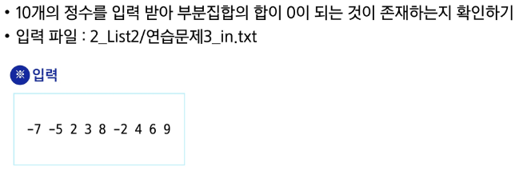

# 검색과 정렬

## 순차검색

### 검색(Search)
저장되어 있는 자료 중에서 원하는 항목을 찾는 작업

목적하는 탐색 키를 가진 항목을 찾는 것

***검색의 종류***

```
순차 검색(sequential search), 이진 검색(binary search), 해쉬(hash)
```

### 탐색 키(Search Key)
자료를 구별하여 인식할 수 있는 키

### 순차 검색
- 일렬로 되어 있는 자료를 순서대로 검색하는 방법
    - 가장 간단하고 직관적인 검색 방법
    - 배열이나 연결 리스트 등 순차 구조로 구현된 자료구조에서 원하는 항목을 찾을 때 유용
    - 알고리즘이 단순하여 구현이 쉽지만 검색 대상의 수가 많은 경우, 수행시간이 급격히 증가하여 비효율적임

- 정렬 여부에 따라
    - 순차 검색 대상이 정렬되어 있지 않은 경우
    - 순차 검색 대상이 정렬되어 있는 경우

### 정렬되어 있지 않은 경우 순차 검색
- 검색 과정
    1. 첫 번째 원소부터 순서대로 검색 대상과 키 값이 같은 원소가 있는지 비교하며 찾음
    2. 키 값이 동일한 원소를 찾으면 그 원소의 인덱스를 반환
    3. 자료 구조의 마지막에 이를 때까지 검색 대상을 찾지 못하면 검색 실패

### 정렬되어 있지 않은 경우에서 검색 성공
* 2를 검색하는 과정

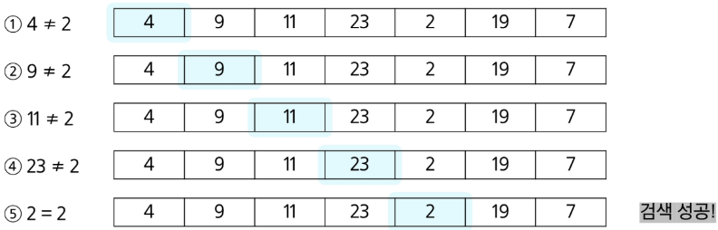

### 정렬되어 있지 않은 경우에서 검색 실패
* 8을 검색하는 과정

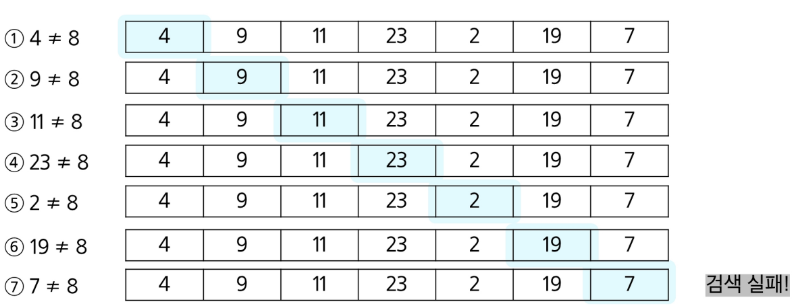

### 순차 검색 대상이 정렬되어 있지 않은 경우
- 찾고자 하는 원소의 순서에 따라 비교 횟수가 결정됨
    - 첫 번째 원소를 찾을 때는 1번 비교, 두 번째 원소를 찾을 때는 2번 비교..
    - 정렬되지 않은 자료에서의 순차 검색 성공 시 평균 비교 횟수
        = (1/n)*(1+2+3+...+n) = (n+1)/2
    - 검색 실패 시 마지막 원소까지 비교하므로 최악 비교 횟수 n
    - 시간 복잡도: O(n)

### 구현 예

```
sequential_search(a, n, key)
        i <- 0
        while i<n and a[i]!=key:
                i <- i+1
        if i<n : return i
        else : return -1
```

### 순차 검색 대상이 정렬되어 있는 경우
- 검색 과정
    1. 자료가 오름차순으로 정렬된 상태에서 검색을 실시
    2. 자료를 순차적으로 검색하면서 키 값을 비교하여, 원소의 키 값이 검색 대상의 키 값보다 크면 찾는 원소가 없다는 것으로, 더 이상 검색하지 않고 검색을 종료

### 정렬되어 있는 경우에서 검색 성공
* 11을 검색하는 과정

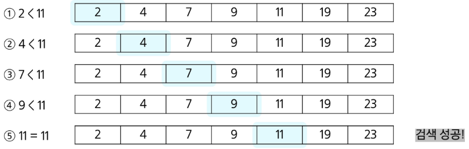

### 정렬되어 있는 경우에서의 검색 실패
* 10을 검색하는 과정

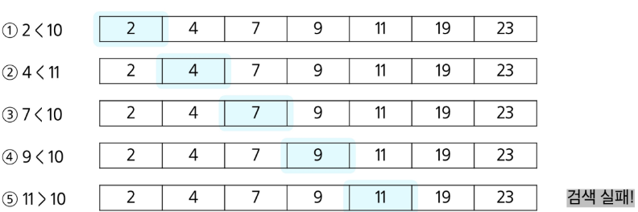

### 정렬되어 있는 경우
- 찾고자 하는 원소의 순서에 따라 비교 횟수가 결정됨
    - 정렬이 되어있으므로, 검색 실패를 반환하는 경우에도 평균 비교 횟수가 반으로 줄어듬. (n+1)/2
    - 시간 복잡도: O(n)

### 구현 예

```
def sequentialSearch2(a, n, key)
        i <- 0
        while i < n and a[i] < ket:
                i <- i+1
        if i < n and a[i] == key:
                return i
        else:
                return -1
```

## 이진 검색 (Binary Search)
- 자료의 가운데에 있는 항목의 키 값과 비교하여 다음 검색의 위치를 결정하고 검색을 계속 진행하는 방법
    - 목적 키를 찾을 때까지 이진 검색을 순환적으로 반복 수행함으로써 검색 범위를 반으로 줄여가면서 보다 빠르게 검색을 수행

- 이진 검색을 하기 위해서는 자료가 정렬된 상태여야 함

### 검색 과정
1. 자료의 중앙에 있는 원소를 고름
2. 중앙 원소의 값과 찾고자 하는 목표 값을 비교
3. 목표 값이 중앙 원소의 값보다 작으면 자료의 왼쪽 절반에 대해 새로 검색을 수행, 크다면 자료의 오른쪽 절반에 대해 새로 검색을 수행
4. 찾고자 하는 값을 찾을 때까지 1~3의 과정을 수행

### 이진 검색으로 20을 찾는 경우

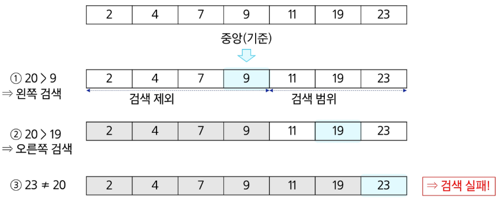

### 이진 검색 알고리즘
- 구현
    - 검색 범위의 시작점과 종료점을 이용, 검색을 반복 수행
    - 이진 검색의 경우, 자료에 삽입이나 삭제가 발생했을 때 배열의 상태를 항상 정렬 상태로 유지하는 추가 작업 필요

```py
def binarySearch(a, N, key):    # key를 찾으면 인덱스, 실패하면 -1 반환
    start = 0
    end = N - 1
    while start <= end:
        middle = (start + end) // 2
        if a[middle] == key:    # 검색 성공
            return middle
        elif a[middle] > key:   # 찾는 값보다 크면
            end = middle - 1    # 왼쪽 구간 선택
        else:                   # 찾는 값보다 작으면
            start = middle + 1  # 오른쪽 구간 선택

    return -1                   # 검색 실패
```

- 재귀 함수 이용
    - 아래와 같이 재귀 함수를 이용해 이진 검색을 구현할 수 있음
    - 재귀 함수에 대해서는 나중에 더 자세히 배우도록 함

```py
def binarySearch2(a, low, high, key):
    if low > high:  # 검색 실패
        return False
    else:
        middle = (low + high) // 2
        if key == a[middle]:
            return True
        elif key < a[middle]:
            return binarySearch2(a, low, middle - 1, key)
        elif a[middle] < key:
            return binarySearch2(a, middle + 1, high, key)
```

### 인덱스
- 원본 데이터 배열과 별개로, 배열 인덱스를 추가한 예
    - 원본 데이터에 데이터가 삽입될 경우 상대적으로 크기가 작은 인덱스 배열을 정렬하기 때문에 속도가 빠름

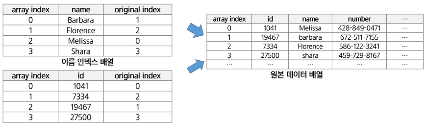

- 인덱스라는 용어는 Database에서 유래했으며, 테이블에 대한 동작 속도를 높여주는 자료 구조
- Database 분야가 아닌 곳에서는 Lookup table 이라고도 함
- 인덱스를 저장하는데 필요한 디스크 공간은 보통 테이블을 저장하는데 필요한 디스크 공간보다 작음
    - 보통 인덱스는 키-필드만 갖고 있고, 테이블의 다른 세부 항목들은 갖고 있지 않기 때문

- 대량의 데이터를 매번 정렬하면, 프로그램의 반응이 느려짐
- 이러한 대량 데이터의 성능 저하 문제르 해결하기 위해 배열 인덱스를 사용

***데이터베이스 인덱스는 이진 탐색 트리 구조로 되어있음***

## 선택 정렬 (Selecion Sort)
- 포켓볼 순서대로 정렬하기
    - 흩어진 당구공을 그림처럼 정리한다고 한다면 어떻게 할까?

    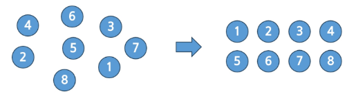

- 주어진 자료들 중 가장 작은 값의 원소부터 차례대로 선택하여 위치를 교환하는 방식 (오름차순의 경우)

### 정렬 과정
- 주어진 리스트 중에서 최솟값을 찾기
- 그 값을 리스트의 맨 앞에 위치한 값과 교환
- 맨 처음 위치를 제외한 나머지 리스트를 대상으로 위의 과정을 반복

### 시간 복잡도
- O(n^2)

### 선택 정렬 과정
1. 주어진 리스트에서 최솟값을 찾음
2. 리스트의 맨 앞에 위치한 값과 교환

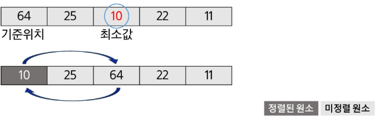

3. 미정렬 리스트에서 최솟값을 찾음
4. 리스트의 맨 앞에 위치한 값과 교환

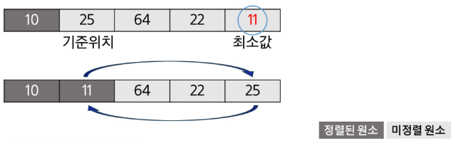

- 미정렬 원소가 하나 남은 상황에서는 마지막 원소가 가장 큰 값을 갖게 되므로, 실행을 종료하고 선택 정렬이 완료됨

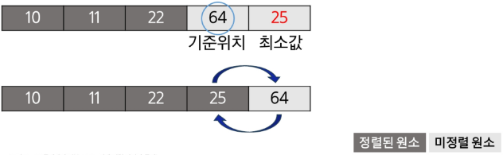

### 선택 정렬 알고리즘

```
selection_sort(a[], n):
        for i : 0 -> n - 2
                a[i],...,a[n-1] 원소 중 최솟값 a[k] 찾음
                a[i]와 a[k] 교환
```

```py
def selection_sort(a, N)
    for i in range(N-1):    # 정렬 구간의 시작 인덱스
        min_idx = i         # 첫 원소를 최소로 가정
        for j in range(i+1, N):
            if a[min_idx] > a[j]:   # 최소 원소 위치 갱신
                min_idx = j
        a[i], a[min_idx] = a[min_idx], a[i] # 구간 최솟값을 구간 맨 앞으로
```

## 셀렉션 알고리즘 (Selection Algorithm)
- 저장되어 있는 자료로부터 k번째로 큰 혹은 작은 원소를 찾는 방법을 셀렉션 알고리즘이라 함
    - 최솟값, 최댓값 혹은 중간값을 찾는 알고리즘을 의미하기도 함

### 선택 과정
- 셀렉션은 다음과 같은 과정을 통해 이뤄짐
    - 정렬 알고리즘을 이용하여 자료 정렬
    - 원하는 순서에 있는 원소 가져오기

### k번째로 작은 원소를 찾는 알고리즘
- 1번부터 k번째까지 작은 원소들을 찾아 배열의 앞쪽으로 이동시키고, 배열의 k번째를 반환
- k가 비교적 작을 때 유용하며 O(kn)의 수행시간을 필요로 함

```py
def select(arr, k):
    for i in range(0, k):
        min_index = i
        for j in range(i+1, len(arr)):
            if arr[min_index] > arr[j]:
                min_index = j
        arr[i], arr[min_index] = arr[min_index], arr[i]
    return arr[k-1]
```

알고리즘|평균<br>수행시간|최악<br>수행시간|알고리즘<br>기법|비고
:----:|:----:|:----:|:----:|:----
버블 정렬|O(n^2)|O(n^2)|비교와 교환|코딩이 가장 손쉽다
카운팅 정렬|O(n+k)|O(n+k)|비교환 방식|n이 비교적 작을 때만 가능
선택 정렬|O(n^2)|O(n^2)|비교와 교환|교환의 횟수가 버블, 삽입 정렬보단 작다
퀵 정렬|O(n log n)|O(n^2)|분할 정복|최악의 경우 O(n^2)이지만, 평균적으로 가장 빠르다
삽입 정렬|O(n^2)|O(n^2)|비교와 교환|n의 개수가 작을 때 효과적
병합 정렬|O(n log n)|O(n log n)|분할 정복|연결 리스트의 경우 가장 효율적인 방식

> ## 추가 연습
- 2001. 파리 퇴치
- 1979. 어디에 단어가 들어갈 수 있을까
- 1954. 달팽이 숫자
