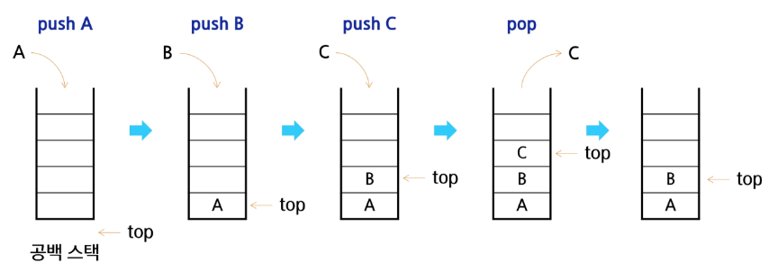
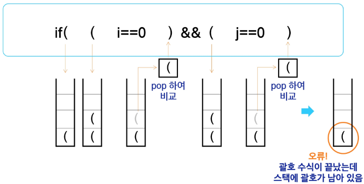
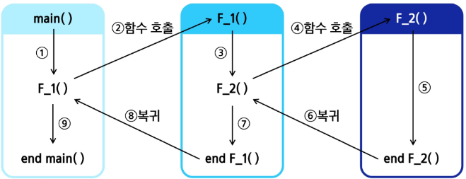
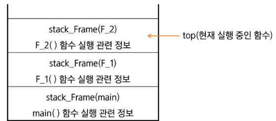

# Stack 자료구조 이해

## Stack의 개념과 특성

### 스택(Stack)의 개념

#### Stack: 물건을 쌓아 올리듯 자료를 쌓아 올린 형태의 자료구조
- 대표적인 선형 자료구조 중 하나. 자료를 삽입하고 꺼낼 수 있음

### 스택(Stack)의 특성

### 후입선출(LIFO, Last-In-First-Out)
- 가장 마지막에 넣은 자료가 가장 먼저 나오는 것

## Stack의 기본 연산

### 스택을 프로그램에서 구현하기 위해서 필요한 자료구조와 연산
- 배열을 사용해 구현할 수 있음
    - 파이썬에서는 리스트 사용해 구현
- 저장소 자체를 스택이라 부르기도 함
    - 용도에 따라 메모리의 일부를 스택으로 부름
- 스택에서 마지막 삽입된 원소의 위치, 스택 포인터
    - top으로 부르며 데이터를 넣거나 뺄 때 기준이 되는 위치

### 스택의 연산
- 삽입(Push)
    - 저장소에 자료를 저장하는 연산으로, 보통 push라고 부름
- 삭제(Pop)
    - 저장소에서 삽입한 자료의 역순으로 꺼내는 연산으로, 보통 pop이라고 부름
- 스택이 공백인지 아닌지를 확인하는 연산(isEmpty)
    - 스택이 비어 있으면 True, 아니면 False를 반환
- 스택의 top에 있는 item(원소)을 반환하는 연산(peek)
    - 삭제는 하지 않음

### 스택의 삽입/삭제 과정
- 빈 스택에 원소 A, B, C를 차례로 삽입(push) 후 한 번 삭제(pop)하는 연산 과정



## Stack 구현 실습

### Push 연산
- append 메소드를 통해 리스트의 마지막에 데이터 삽입

```py
def my_push(item):
    s.append(item)
```

- 인덱스 연산을 활용한 구현

```py
def my_push(item, size):
    global top
    top += 1
    if top==size:
        print('overflow!')
    else:
        stack[top] = item
```

### 단순한 Push 연산
- 크기가 정해진 리스트와 인덱스 연산을 활용

```py
size = 10
stack = [0] * size
top = -1

push(10, size)
top += 1            # push(20)
stack[top] = 20
```

### Pop 연산
- 남은 데이터 중 가장 늦게 저장된 데이터를 삭제하는 연산

```py
def my_pop():
    if len(s) == 0:
        # underflow: print('underflow') -> 스택이 비었음
        return
    else:
        return s.pop()  # 리스트 s의 마지막 원소 삭제
```

### 인덱스 연산을 이용한 Pop 연산
- 크기가 정해진 리스트와 인덱스 활용

```py
def my_pop():
    global top
    if top == -1
        print('underflow')
        return 0
    else:
        # return 뒤에는 구문이 올 수 없기 때문에 미리 top 감소
        top -= 1
        return stack[top+1]
print(pop())
```

```py
if top > -1:    # pop()
    top -= 1
    print(stack[top+1])
```

<details><summary> <b>pop 실행 시 데이터의 행방은?</b> </summary>
<div markdown="1">

### pop 실행 시 데이터의 행방은?

#### 1) 스택(컨테이너) 입장

* **pop은 맨 위 요소를 제거하고(그리고 보통 반환) 스택의 크기(size)를 1 감소**
* 내부적으로는 보통 **top 인덱스만 한 칸 내려가거나**(배열 기반) **링크를 끊는**(연결리스트 기반) 정도
* **용량(capacity)** 은 대개 그대로라서, 바로 메모리를 줄이진 않는다. 다음 push 때 재사용하는 경우가 많음
* 제거된 위치의 메모리는 “논리적으로만 비어 있음”. 실제 바이트가 0으로 초기화되는지는 구현에 따라 다름

#### 2) 요소(데이터) 객체 입장

핵심은 “그 데이터를 **다른 곳에서 여전히 참조하고 있느냐**”

* **참조형/GC 언어(Python, Java 등)**

  * 스택이 들고 있던 **참조가 사라지므로 참조 수가 1 줄어듬**
  * 그 객체를 다른 변수/컬렉션이 **여전히 참조하면 살아 있고**, 아무도 참조하지 않으면 **GC 대상**이 됨
  * CPython 기준: 참조 카운트가 0이 되면 **즉시 소멸**되고, 메모리는 할당자에 반환(세부는 구현/버전마다 다를 수 있음)
* **C/C++ 같이 수동 메모리/RAII 언어**

  * **std::vector::pop\_back()** 은 **그 객체의 소멸자(destructor)를 호출**해 *객체 자체를 파괴*(단, 버퍼 용량은 남아 있음) 파괴된 객체 메모리를 읽으면 **정의되지 않은 동작**임
  * **std::stack::pop()** 은 값을 반환하지 않고 **단지 제거만** 하므로, 필요하면 `auto x = s.top(); s.pop();`처럼 **미리 top으로 받아 놓고** pop할 것
  * C에서 배열+top으로 직접 구현하면 보통 `top--`만 한다. 이때 **바이트는 남아 있지만 논리적으로는 죽은 값**이다. 만약 그 칸에 **동적 할당 포인터**가 있었다면 `free`(또는 `delete`) 하거나 **NULL로 지워 메모리 누수/댕글링 방지**를 하는 게 안전하다.

#### 3) 언어별로 한 눈에

* **Python(list를 스택처럼 사용할 때)**

  * `x = stack.pop()`

    * 리스트 크기 ↓, 그 칸의 **참조가 제거**되어 해당 객체 참조 수 ↓.
    * `x`가 그 객체를 **계속 붙잡고 있으므로** 객체는 살아 있음. `del x`까지 해야 완전히 참조가 끊김
    * 리스트의 **capacity는 그대로**여서 다음 `append`에 재사용될 수 있음
* **Java(Deque/Stack)**

  * `E e = stack.pop();`

    * 스택이 가진 참조는 사라짐. **다른 참조가 없으면 GC 대상**.
* **C++**

  * `v.pop_back();` → **소멸자 호출 + size 감소**, capacity 유지.
  * `s.top(); s.pop();` 순서를 지키기(참조 무효화 주의).
* **C(수동 스택)**

  * `top--;`만 하면 값은 남아 있어 보이나 **접근 금지**(논리 밖). 자원 포인터면 **반드시 해제/NULL 처리**.

#### 4) 부가 이슈

* **스택 언더플로우**: 비어 있는데 pop하면 에러. 항상 비었는지 체크
* **동시성**: 다른 스레드가 같은 객체를 잡고 있으면 그 객체는 살아 있음. 락/원자적 구조 필요.
* **보안 데이터**: 비밀번호/키처럼 민감한 값은 pop만으로 바이트가 지워지지 않을 수 있다. **메모리 덮어쓰기** 같은 추가 조치가 필요할 수 있다.
* **호출 스택(콜스택)**: 함수 `return`으로 스택 프레임이 pop되면 **지역 변수는 수명 종료**. C/C++에서 지역 변수 주소를 반환하면 **댕글링 포인터**가 된다.

</div>
</details>

---

### 스택 구현 고려 사항
- 1차원 배열을 사용하여 구현할 경우
    - 장점: 구현이 용이함
    - 단점: 스택의 크기를 변경하기 어려움
- 해결 방법: 저장소를 동적으로 할당하여 스택을 구현하는 방법<br>    (동적 연결리스트를 이용하여 구현하는 방법)
    - 장점: 메모리를 효율적으로 사용
    - 단점: 구현이 복잡 => <s>**대안으로 '덱' 이용**</s>

### 연습문제 1
- 스택을 구현한 후, 이를 이용해 3개의 데이터를 저장하고 다시 3번 꺼내어 출력

```py
stack = []
stack.append(1)
stack.append(2)
stack.append(3)

print(stack.pop())
print(stack.pop())
print(stack.pop())
```

```py
top = -1
stack = [0] * 10

top += 1    # push(1)
stack[top] = 1
top += 1    # push(2)
stack[top] = 2
top += 1    # push(3)
stack[top] = 3

top -= 1            # pop()
print(stack[top+1]) 
top -= 1            # pop()
print(stack[top+1])
top -= 1            # pop()
print(stack[top+1])
print(stack)
```

# Stack 응용

## 괄호 검사

### 괄호의 종류
- 대괄호('[', ']'), 중괄호('{', '}'), 소괄호('(', ')')

### 조건
1. 왼쪽 괄호의 개수와 오른쪽 괄호의 개수가 동일
2. 같은 괄호에서 왼쪽 괄호는 오른쪽 괄호보다 우선
3. 괄호 사이에는 포함 관계만 존재

### 잘못된 괄호 사용의 예

```
(a(b)
a(b)c)
a{b(c[d]e}f)
```

### 스택을 이용한 괄호 검사



### 괄호를 검사하는 알고리즘 개요
1. 문자열에 있는 괄호를 차례대로 검사하며 왼쪽 괄호를 만나면 스택에 삽입, 오른쪽 괄호를 만나면 스택에서 top 괄호를 삭제한 후 오른쪽 괄호와 짝이 맞는지 검사
2. 이 때, 스택이 비어 있으면 조건 1 또는 조건 2에 위배되고, 괄호의 짝이 맞지 않으면 조건 3에 위배
3. 마지막 괄호까지 조사한 후에도 스택에 괄호가 남아 있으면 조건 1에 위배

### 연습문제 2
- 괄호의 짝을 검사하는 프로그램을 작성하고, 이를 이용해 주어진 괄호 문자열의 올바른 사용 여부를 검사

```
         ()()((()))
((()((((()()((()())((())))))
```

```py
txt = input()
top = -1            # 스택 생성
stack = [0] * 100

ans = 1
for x in txt:
    if x == '(':
    # if x in ['(', '{', '[']:
        top += 1
        stack[top] = x
    elif x == ')':      # 스택에서 꺼내서 확인
        if top == -1:   # 스택이 비어있음 -> 오류!
            ans = 0
            break
        else:
            top -= 1    # pop 
            # 짝인지 확인하는 구문 필요하면 추가
            stack[top+1] = 0

    if top != -1:
        ans = -1

print(ans)
```

## Function Call
- 프로그램에서의 함수 호출과 복귀에 따른 수행 순서를 관리



- 가장 마지막에 호출된 함수가 가장 먼저 실행을 완료하고 복귀하는 후입선출 구조이므로, 후입선출 구조의 스택을 이용하여 수행순서 관리

- 시스템 스택
    - 함수 수행에 필요한 지역변수, 매개변수 및 수행 후 복귀한 주소 등의 정보를 저장
    - 함수 호출이 발생하면 스택 프레임(stack frame)에 저장하여 시스템 스택에 삽입

    

- 프로그램에서의 함수 호출과 복귀에 따른 수행 순서를 관리
    - 함수의 실행이 끝나면 시스템 스택의 top 원소(스택 프레임)를 삭제(pop)하면서 프레임에 저장되어 있던 복귀주소를 확인하고 복귀시킴
    - 함수 호출과 복귀에 따라 이 과정을 반복하여 전체 프로그램 수행이 종료되면 시스템 스택은 공백 스택이 됨
