# Stack 기반 문제 해결 기법

## 재귀호출
함수가 자신과 같은 작업을 반복해야 할 때, 자신을 다시 호출하는 구조

### n에 대한 factorial
- 1부터 n까지의 모든 자연수를 곱하여 구하는 연산
    - 마지막에 구한 하위 값을 이용하여 상위 값을 구하는 작업을 반복

```
n! = n x (n-1)!
    (n-1)! = (n-1) x (n-2)!
    (n-2)! = (n-2) x (n-3)!


    ...

    
    2! = 2 x 1!
    1! = 1
```

### factorial 함수에서 n=4인 경우의 실행

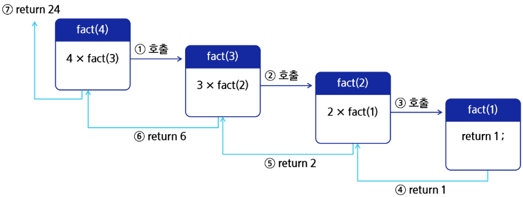

### 피보나치 수열
0과 1로 시작하고 이전의 두 수 합을 다음 항으로 하는 수열

`0, 1, 1, 2, 3, 5, 8, 13, ...`

### 피보나치 수열의 수학적 정의
- 피보나치 수열의 i번 째 값을 계산하는 함수 F를 정의<br>F0 = 0, F1 = 1<br>Fi = F(i-1) + F(i-2), for i >= 2

### 피보나치 수를 구하는 재귀함수
- 피보나치 수열의 수학적 정의에 따라, 피보나치 수열의 i번째 항을 반환하는 함수를 재귀함수로 구현 가능

```py
def fibo(n):
    if n < 2:
        return n
    else:
        return fibo(n-1) + fibo(n-2)
```

### 재귀함수의 기본형
- 현재 호출 단계와 목표 단계를 인자로 사용'
    - 현재 단계 i, 목표 N을 인자로 갖는 재귀함수 f(i, N)이 기본형

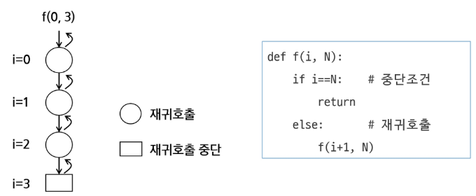

### 모든 배열 원소에 접근하는 재귀함수
- 기본형 활용
    - 호출 단계 i에서 arr[i] 원소에 접근하고, i가 배열의 크기와 같아지면 재귀호출을 중단

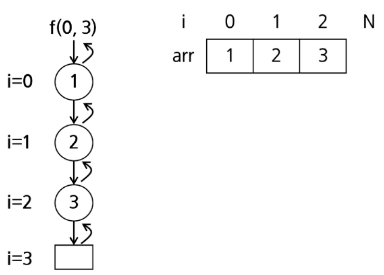

- 구현

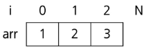

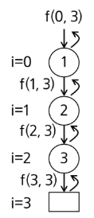

```py
def f(i, N):    # 크기 N인 배열 arr[i]에 접근
    if i == N:
        return
    else:
        print(arr[i])
        f(i+1, N)
```

### 배열 원소 검색
- 배열에 v가 있으면 1, 없으면 0을 리턴하는 함수
    - v = 5인 경우, arr에는 5가 없으므로 마지막 단계까지 호출하고 0을 리턴


### 배열 원소 v 검색
- v = 3인 경우
    - 3을 찾은 경우에도 재귀호출 중단

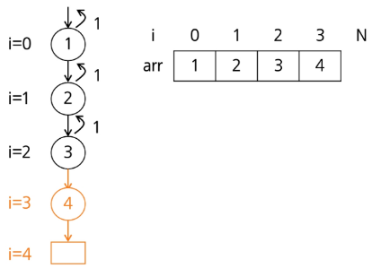

```py
def f(i, N, v):     # v 찾는 값
    if i == N:
        return 0
    elif arr[i] == v:
        return 1
    else:
        return f(i+1, N, v)
```

## Memoization

### 피보나치 재귀호출의 문제점
- 피보나치 수를 구하는 함수를 재귀함수로 구현한 알고리즘은 "엄청난 중복 호출이 존재한다"는 문제 발생

### 피보나치 수열의 Call Tree

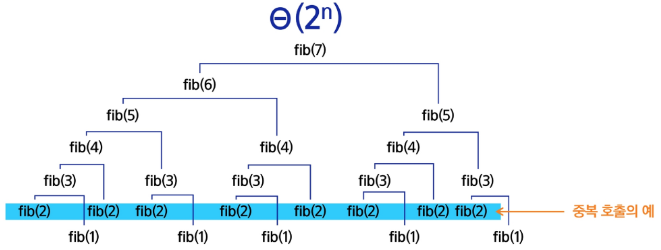

### 재귀 알고리즘 최적화: 메모이제이션(memoization) 기법
컴퓨터 프로그램을 실행할 때 이전에 계산한 값을 메모리에 저장해서 매번 다시 계산하지 않도록 하여 전체적인 실행속도를 빠르게 하는 기술

- 동적 계획법의 핵심이 되는 기술로, 앞의 예시 피보나치 수를 구하는 알고리즘에서 fibo(n)의 값을 계산하자마자 저장하면(memorize), 실행시간을 Θ(n)으로 줄일 수 있음

### Memoization을 적용한 피보나치
- 계산된 적이 있는 피보나치 수는 저장된 값을 리턴

```py
# memo를 위한 배열을 할당하고, 모두 0으로 초기화;
# memo[0]을 0으로 memo[1]는 1로 초기화;

def fib1(n):
    if n >= 2 and memo[n] == 0:
        memo[n] = fibo1(n-1) + fibo(n-2)
    return memo[n]

memo = [0] * (n + 1)
memo[0] = 0
memo[1] = 1
```

## DP

### 최적화를 위한 알고리즘: 동적계획법(DP, Dynamic Programmng)
입력 크기가 작은 부분 문제들을 먼저 해결한 뒤, 그 결과를 바탕으로 더 큰 부분 문제를 순차적으로 해결해 나가며 최종적으로 전체 문제의 해답을 도출하는 알고리즘

### 피보나치 수열
- DP 적용 문제
    - 문제의 최적 해가 그 하위 문제의 최적 해로부터 쉽게 구성될 수 있는 최적 부분구조여야 한다.
    - 동일한 하위 문제가 여러 번 반복되어 나타나는 중복 부분 문제여야 한다.

- 최적 부분구조 + 중복 부분 문제<br>
    F(n) = F(n-1) + F(n-2)  <br>
    = (F(n-2) + F(n-3)) + F(n-2)<br>
    = ...<br>
    F(5) = F(4) + F(3)<br>
    = (F(3) + F(2)) + (F(2) + F(1))<br>
    = ((F(2) + F(1)) + (F(1) + F(0))) + ((F(1) + F(0)) + 1)

### 피보나치 수열 함수의 중복 호출 제거
- 부분 문제로 나누는 일을 끝냈으면 가장 작은 부분 문제부터 해 구하기
- 그 결과는 테이블에 저장하고, 테이블에 저장된 부분 문제의 해를 이용하여 상위 문제의 해를 구하기

테이블 인덱스|저장되어 있는 값
:-:|:-:
[0]|0
[1]|1
[2]|2
[3]|3
[4]|4
...|...
[n]|fibo(n)

### 피보나치 수열을 DP로 구현한 코드

```py
def fibo2(n):
    f = [0] * (n + 1)
    f[0] = 0
    f[1] = 1
    for i in range(2, n + 1):
        f[i] = f[i-1] + f[i=2]
    
    return f[n]
```

### DP의 구현 방식
- Recursive 방식: fib1()
- Iterative 방식: fib2()
- 재귀 구조에 Memoization을 사용하는 것보다, 반복적인 구조로 DP를 구현하는 방식이 성능 면에서 더 효율적
- 재귀적 구조는 내부에 시스템 호출 스택을 사용하는 오버헤드가 발생하기 때문

## DFS

### 비선형 자료구조 탐색, 깊이 우선 탐색(DFS, Depth First Search)
한 방향으로 가능한 한 깊게 탐색한 후, 더 이상 갈 곳이 없으면 되돌아와 다른 방향을 탐색

- 빠짐없이 검색하는 방법에는 DFS, BFS가 있다.

### DFS의 동작 원리
1. 시작 정점의 한 방향으로 갈 수 있는 경로가 있는 곳까지 깊이 탐색해 나간다.
2. 더 이상 갈 곳이 없게 되면, 가장 마지막에 만났던 갈림길 간선이 있는 정점으로 되돌아와 다른 방향의 정점으로 탐색을 계속 반복하여 결국 모든 정점을 방문하는 탐색법

- 가장 마지막에 만났던 갈림길의 정점으로 되돌아가서 다시 깊이 우선 탐색을 반복해야 하므로 후입선출(LIFO) 구조의 스택 사용

### 로봇이 선을 따라 모든 칸을 탐색하는 방법

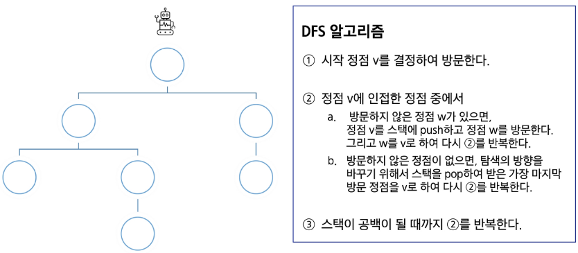

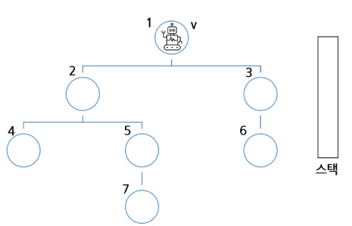

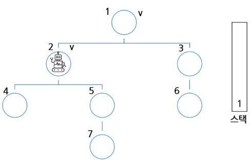

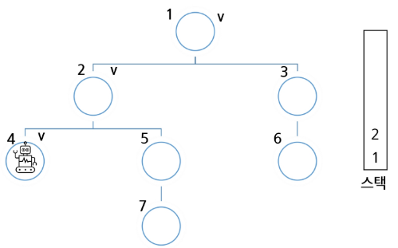

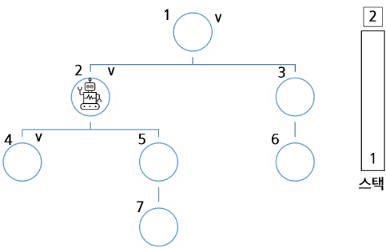

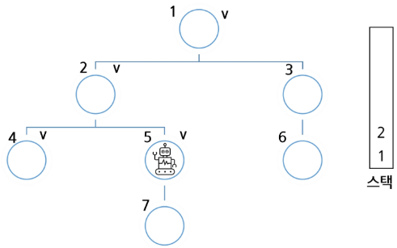

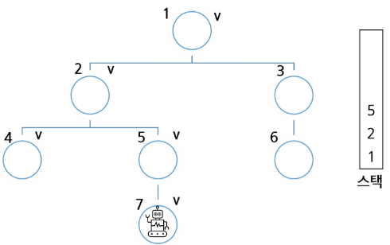

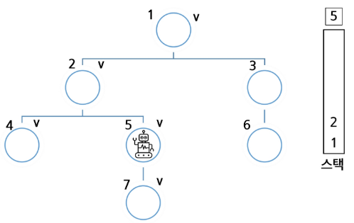

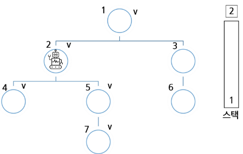

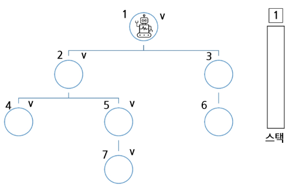

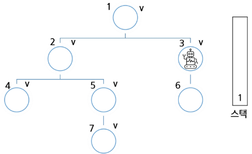

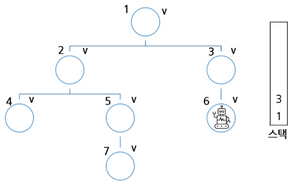

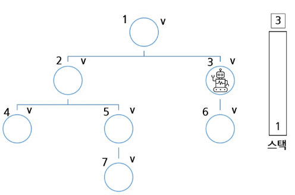

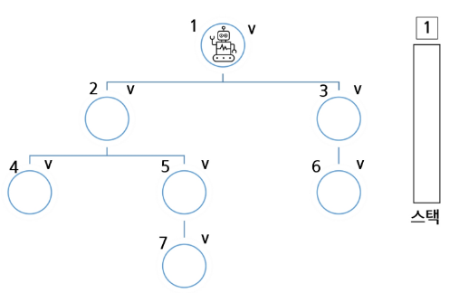

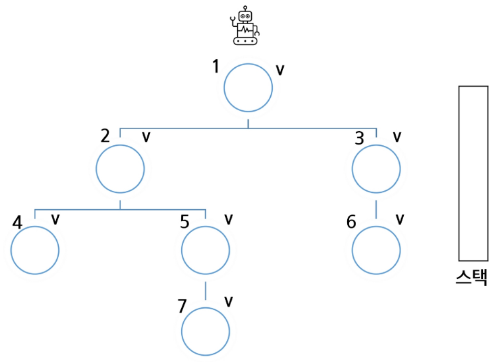

### DFS 알고리즘

```
visited[], stack[] 초기화
DFS(v)
    시작점 v 방문;
    visited[v] <- true
    while {
        if (v의 인접 정점 중 방문 안 한 정점 w가 있으면)
            push(v);
                v <- w; (w에 방문)
            visited[w] <- true;
        else
            if (스택이 비어 있지 않으면)
                v <- pop(stack);
            else
                break
    }
end DFS()
```
### DFS 예
- 초기 상태) 배열 visited를 False로 초기화하고, 공백 스택을 생성

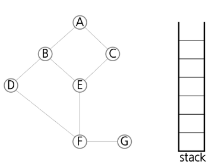

1) 정점 A를 시작으로 깊이 우선 탐색을 시작

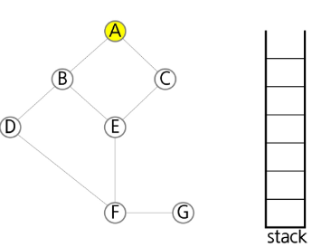

```
A 방문;
visited[A] <- true;
```

2) 정점 A에 방문하지 않은 정점 B, C가 있으므로 A를 스택에 push하고, 인접 정점 B와 C 중에서 오름차순에 따라 B를 선택하여 탐색을 계속함

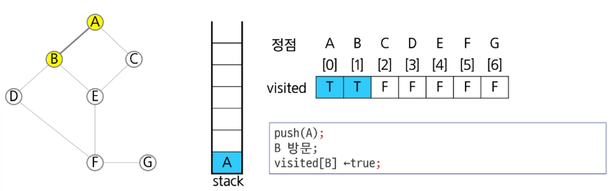

3) 정점 B에 방문하지 않은 정점 D, E가 있으므로 B를 스택에 push하고, 인접 정점 D와 E 중에서 오름차순에 따라 D를 선택하여 탐색을 계속함

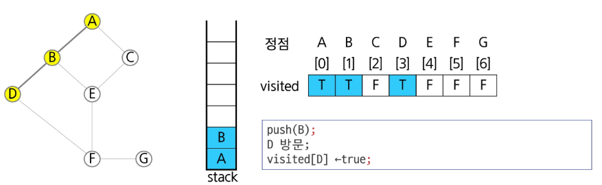

4) 정점 D에 방문하지 않은 정점 F가 있으므로 D를 스택에 push하고, 인접 정점 F를 선택하여 탐색을 계속함

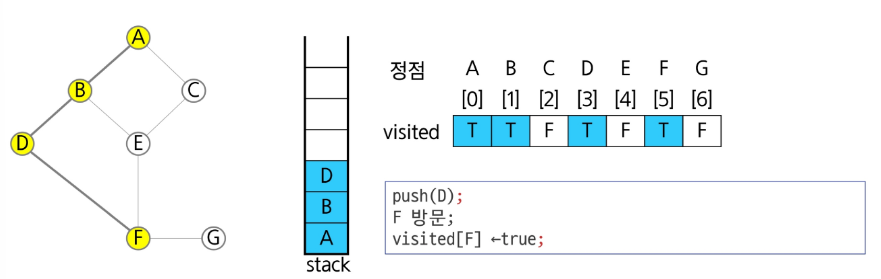

5) 정점 F에 방문하지 않은 정점 E, G가 있으므로 F를 스택에 push하고, 인접 정점 E와 G 중에서 오름차순에 따라 E를 선택하여 탐색을 계속함

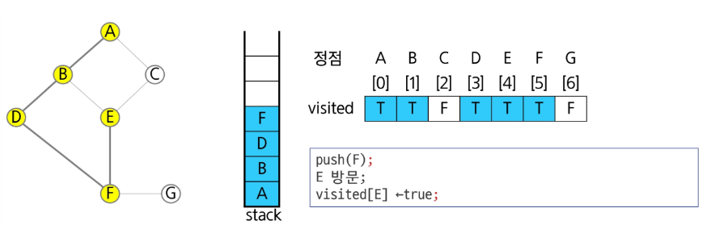

6) 정점 E에 방문하지 않은 정점 C가 있으므로 E를 스택에 push하고, 인접 정점 C를 선택하여 탐색을 계속함

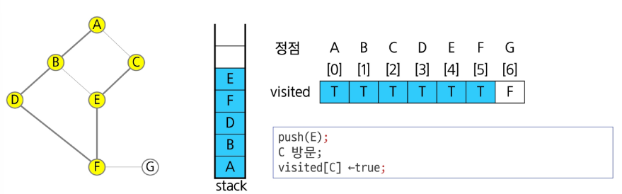

7) 정점 C에서 방문하지 않은 인접 정점이 없으므로, 마지막 정점으로 돌아가기 위해 스택을 pop하여 받은 정점 E에 대해서 방문하지 않은 인접 정점이 있는지 확인함

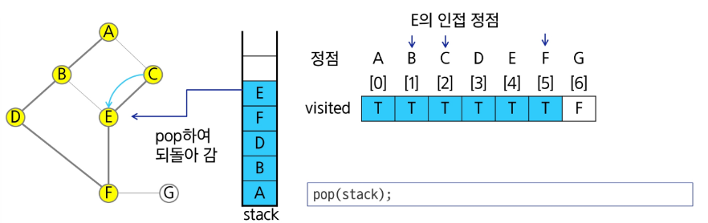

8) 정점 E는 방문하지 않은 인접 정점이 없으므로, 다시 스택을 pop하여 받은 정점 F에 대해서 방문하지 않은 인접 정점이 있는지 확인함


9) 정점 F에 방문하지 않은 정점 G가 있으므로 F를 스택에 push하고, 인접 정점 G를 선택하여 탐색을 계속함

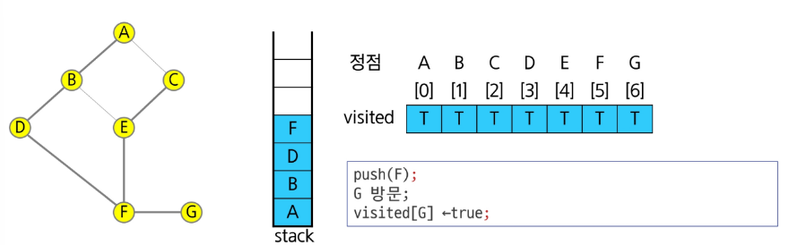

10) 정점 G에서 방문하지 않은 인접 정점이 없으므로, 마지막 정점으로 돌아가기 위해 스택을 pop하여 받은 정점 F에 대해서 방문하지 않은 인접 정점이 있는지 확인함

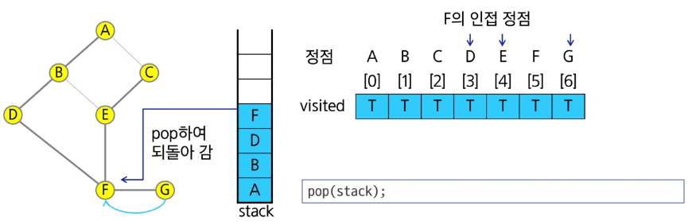

11) 정점 F에서 방문하지 않은 인접 정점이 없으므로, 다시 마지막 정점으로 돌아가기 위해 스택을 pop하여 받은 정점 D에 대해서 방문하지 않은 인접 정점이 있는지 확인함

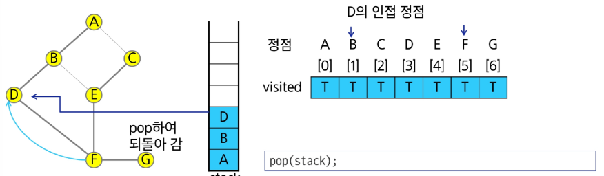

12) 정점 D에서 방문하지 않은 인접 정점이 없으므로, 다시 마지막 정점으로 돌아가기 위해 스택을 pop하여 받은 정점 D에 대해서 방문하지 않은 인접 정점이 있는지 확인함

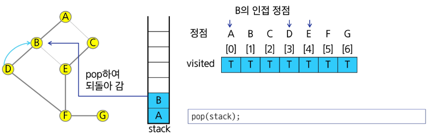

13) 정점 B에서 방문하지 않은 인접 정점이 없으므로, 다시 마지막 정점으로 돌아가기 위해 스택을 pop하여 받은 정점 D에 대해서 방문하지 않은 인접 정점이 있는지 확인함

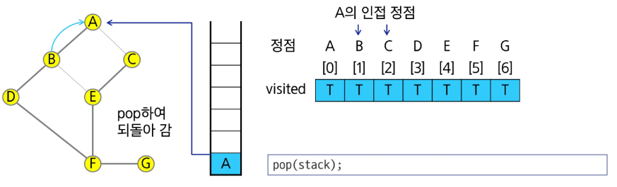

14) 현재 정점 A에서 방문하지 않은 인접 정점이 없으므로 마지막 정점으로 돌아가기 위해 스택을 pop하는데, 스택이 공백이므로 깊이 우선 탐색을 종료함

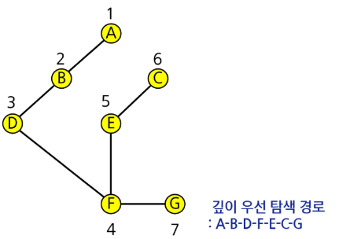

### 연습문제 3

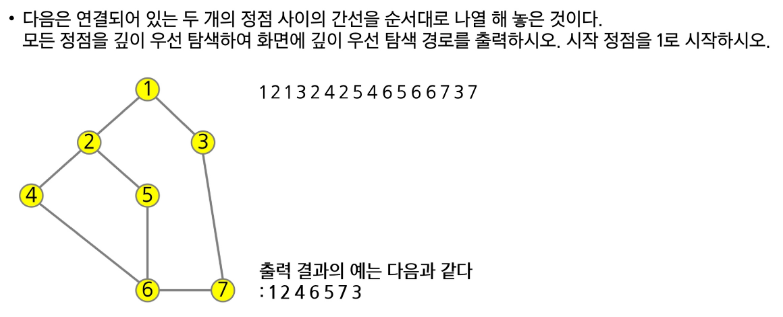

- 인접 행렬 = matrix[ ][ ] = T or F
- 인접 리스트 = list[ ] = [...]

```py
# V: 정점의 개수
# E: 간선의 개수
V, E = map(int, input().split())

# 정점들의 연결 정보가 입력으로 들어옴
graph = list(map(int, input().split()))

# 인접행렬
# 어떤 정점 x와 y가 연결되어있는지 여부를 True(1) or False(0)으로 나타냄
# True(1) => 연결되어있다. x에서 y로 가는 간선이 존재
# False(0) => 연결이 안 되어있다. x에서 y로 가는 간선이 부존재
adjM = [[0] * (V+1) for _ in range(V)]

# i: 간선 번호
for i in range(E):
    # s 정점과 e 정점은 연결되어있다.
    s, e = graph[2 * i], graph[2 * i + 1]

    # s <-> e 간선 존재
    adjM[s][e] = 1
    adjM[e][s] = 1


# s: 탐색을 시작하는 정점 번호
# N: 정점의 개수
def DFS(s, N)
    # 깊이우선탐색: 한 방향으로 가능한 깊게 탐색한 후에 더 이상 갈 곳이 없으면 가장 마지막에 방문한 정점으로 돌아온다. 한 번 탐색한 정점은 다시 탐색하지 않는다. => 탐색여부 배열
    visited = [0] * (N+1)
    # x번 탐색한 적이 있다: visited[x] = 1
    # y번 탐색한 적이 있다: visited[y] = 0

    # 가장 마지막에 방문한 정점으로 쉽게 돌아가기 위해 스택 사용
    stack = []

    # 현재 탐색 중인 정점 번호
    v = s

    # 시작정점 방문했다고 체크: 1로 변경
    visited[s] = 1

    while True:
        # 현재 정점 s에서 탐색
        # v에서 갈 수 있는 다른 정점 찾기
        # nv: 다른 정점 번호
        for nv in range(1, V+1):
            # 갈 수 있다 => v에서 nv로 갈 수 있느냐를 판단
            # v와 nv가 인접해있고, nv를 이전에 방문한 적이 없다면 갈 수 있다
            if adjM[v][nv] and not visited[nv]:

            # nv로 일단 가자
            # 가기 전에 현재 위치를 스택에 저장
            stack.append(v)
            # nv로 이동
            v = nv
            # nv 다음에 또 오면 안 되니까 방문했다고 표시
            visited[nv] = 1
            # nv로 이동했으니 다른 갈 수 있는 정점은 보지 않아도 된다.
            break
        # for-else
        else:
            # 중간에 break가 실행 x
            # 정점 못 찾음
            # 갈 곳이 없으니 돌아간다. 돌아갈 곳은 스택에 저장
            # 가장 최근에 방문했던 곳으로 돌아가야 하는데, 스택은 후입선출 구조라 원소를 꺼내면 그곳이 가장 최근 방문했던 정점이 됨
            # 꺼내기 전에 비어있지 않은가 확인
            if stack:
                # 비어있지 않으면 돌아갈 곳이 있다
                v = stack.pop()
            else:
                # 더 이상 갈 곳도, 돌아갈 곳도 없다.
                break
```

### 실습 & 추가 연습
- Stack
    - 4866. 괄호검사
    - 4873. 반복문자 지우기

- 재귀
    - 4869. 종이붙이기

- DFS
    - 4871. 그래프 경로

- 추가 연습
    - 1234. 비밀번호
    - 1218. 괄호 짝짓기
