# Stack 계산기

## 후위 표기법 변환

### 문자열로 된 계산식
- Stack을 이용하여 값을 계산할 수 있음
- 문자열 수식 계산의 일반적인 방법
 1. 중위 표기법의 수식을 후위 표기법으로 변경(stack 이용)
 2. 후위 표기법의 수식을 stack을 이용해 계산

### 중위 표기법의 후위 표기법 변환 방법
1. 수식의 각 연산자에 대해서 우선순위에 따라 괄호를 사용하여 다시 표현
2. 각 연산자를 그에 대응하는 오른쪽 괄호의 뒤로 이동
3. 괄호를 제거

```
예를 들어 A * B - C / D 라는 중위 표기법에서 후위 표기법으로 변환하는 방법은 다음과 같다.

1단계: ((A * B) - (C / D))
2단계: ((A B) * (C D) / ) -
3단계: AB * CD /-
```

### 알고리즘 - Stack 이용

1. 입력 받은 중위 표기법에서 토큰을 읽는다.

2. 토큰이 피연산자면 토큰을 출력

3. 토큰이 연산자(괄호포함)일 때,
- 이 토큰이 스택의 top에 저장되어 있는 연산자보다 우선순위가 높으면 스택에 push한다.
- 그렇지 않다면 스택 top의 연산자의 우선순위가 토큰의 우선순위보다 작을 때까지 스택에서 pop한 후 토큰의 연산자를 push한다. 만약 top에 연산자가 없으면 push한다.

4. 토큰이 오른쪽 괄호 ')'이면 스택 top에 왼쪽 괄호 '('가 올 때까지 스택에 pop 연산을 수행하고 pop한 연산자를 출력한다. 왼쪽 괄호를 만나면 pop만 하고 출력하지는 않는다.

5. 중위 표기법에 더 읽을 것이 없다면 중지하고, 더 읽을 것이 있다면 1부터 다시 반복

6. 스택에 남아 있는 연산자를 모두 pop하여 출력
    - 스택 밖의 왼쪽 괄호는 우선 순위가 가장 높으며, 스택 안의 왼쪽 괄호는 우선 순위가 가장 낮다.

### 후위 표기법 변환
- 변환할 중위 표기법으로 표현된 수식

```
(6 + 5 * (2 - 8) / 2 )
```

- 표기법 변환 설명 개요

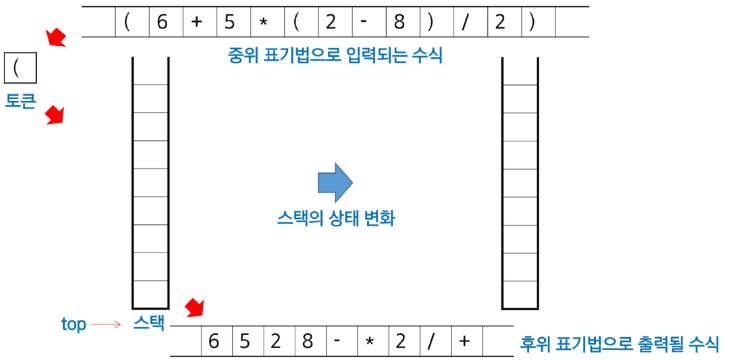

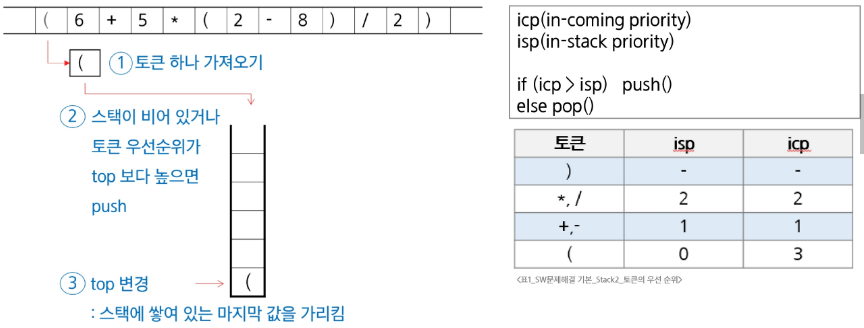

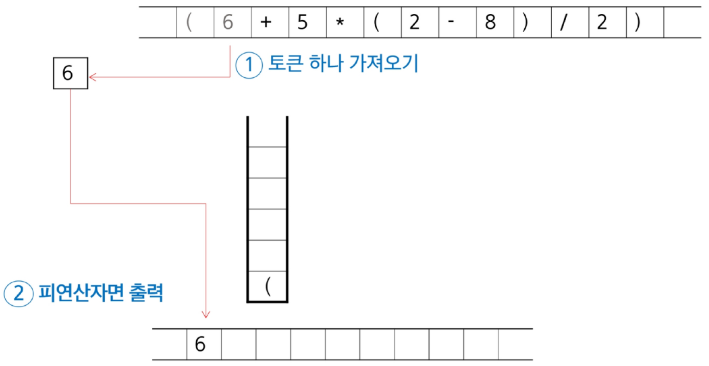

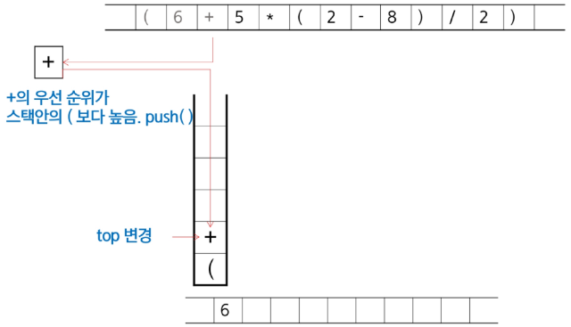

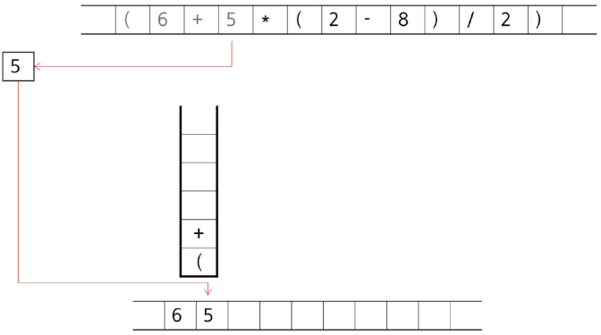

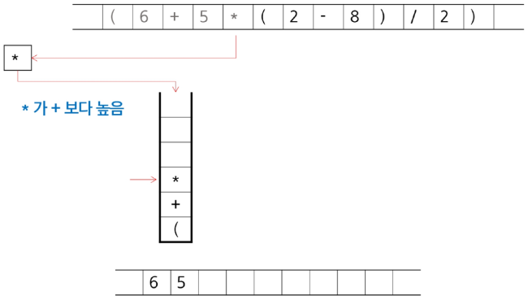

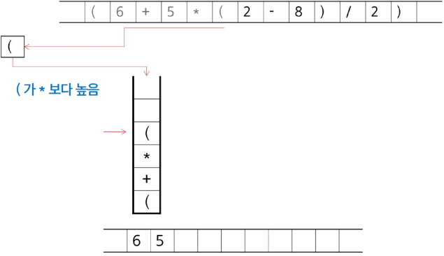

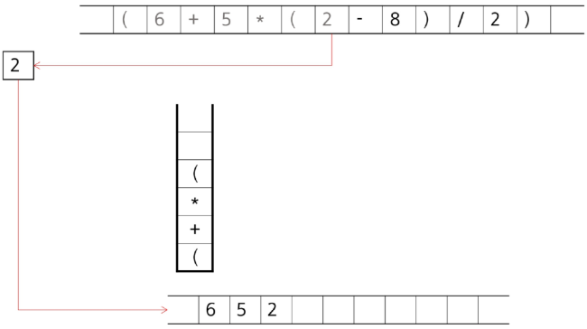

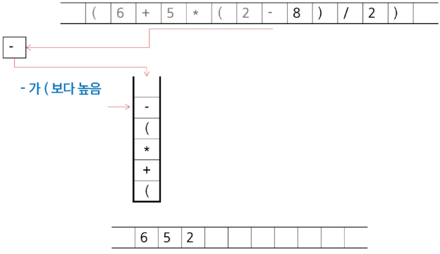

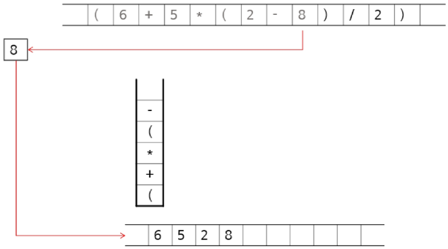

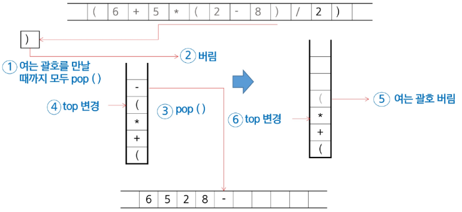

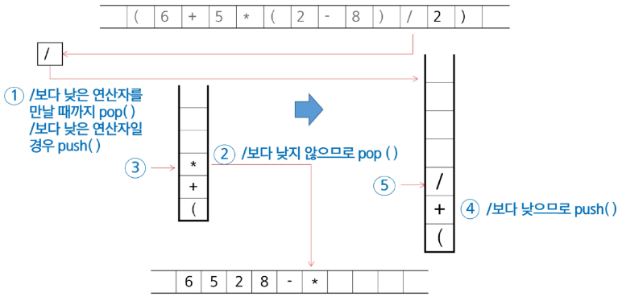

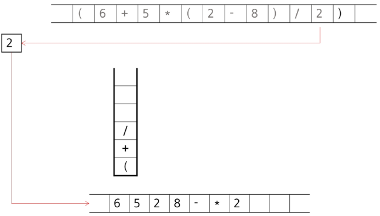


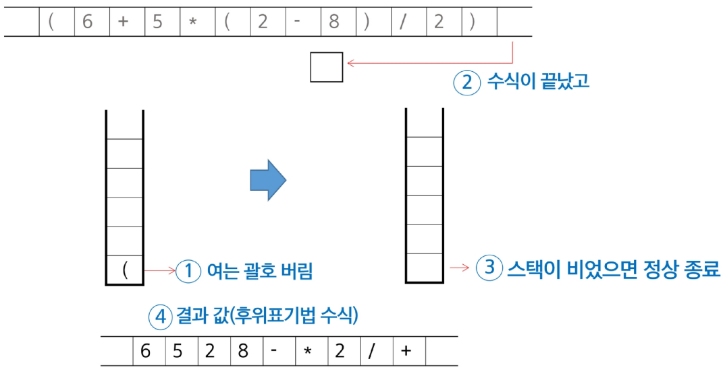

## 후위 표기법 연산

### 후위 표기법 식을 Stack을 이용하여 계산
1. 피연산자를 만나면 스택에 push한다.
2. 연산자를 만나면 필요한 만큼의 피연산자를 스택에서 pop하여 연산하고, 연산결과를 다시 스택에 push한다.
3. 수식이 끝나면, 마지막으로 스택을 pop하여 출력한다.

### 연산과정

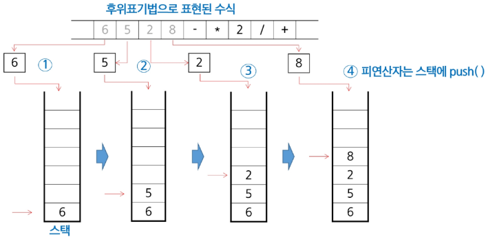

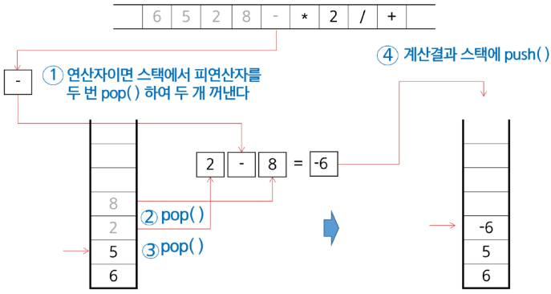

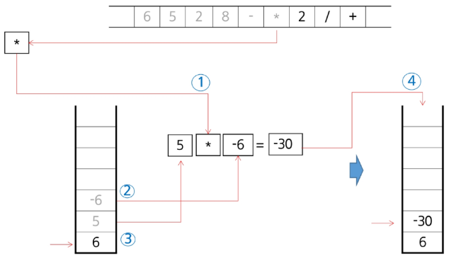

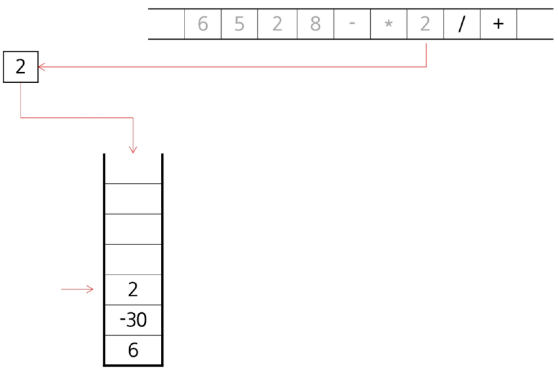


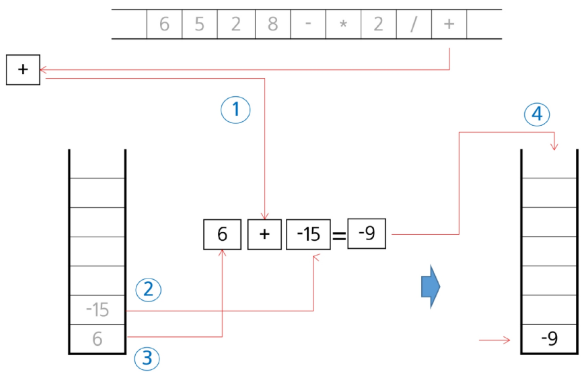

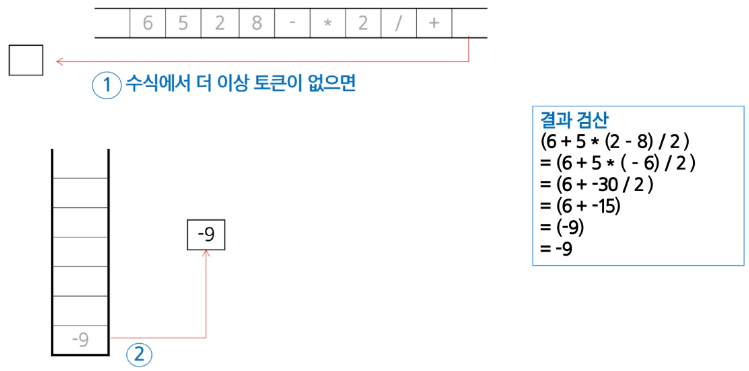

# Stack 응용

## Backtracking
후보해를 구성해 나가다가, 더 이상 해가 될 수 없다고 판단되면 되돌아가서(backtrack) 다른 경로를 시도하는 방법

- 문제 해결을 위한 탐색 알고리즘의 하나
- 가능성이 없는 경로는 더 이상 탐색하지 않고 되돌아가며 해결책을 찾는 방식
- 최적화(optimization) 문제와 <u>**결정(decision) 문제**</u>에 적용
- 적용 예
    - N-Queens 문제
    - 미로 찾기
    - 순열/조합 생성
    - 부분집합 탐색
    - 스도쿠 풀이 등

### Backtracking과 DFS와의 차지
- Prunning(가지치지) 유무
    - Backtracking은 어떤 node에서 출발하는 경로가 해결책으로 이어질 것 같지 않으면 더 이상 그 경로를 따라가지 않고 시도를 줄임.

- 조기 겨올 차단
    - DFS는 모든 경로를 추적, Backtracking은 불필요한 경로를 조기에 차단

- 경우의 수가 많은 경우
    - 예를 들어 N!인 경우의 수를 가진 문제에 대해 DFS를 가하면 처리가 불가능
    - Backtracking을 적용하면 일반적으로 경우의 수가 줄어들지만, 최악의 경우 지수함수 시간(Exponential Time)을 요하므로 처리가 불가능

***모든 후보를 검사?*** **NO!!**

### Backtracking 기법
- 어떤 노드의 유망성을 점검한 후에 <b>유망(promising)</b>하지 않다고 결정되면 그 노드의 부모로 되돌아가(backtracking) 다음 자식 노드로 이동
- 어떤 노드를 방문하였을 때 **그 노드를 포함한 경로가 해답이 될 수 없으면 그 노드는 유망하지 않다**고 하며, 반대로 **해답의 가능성이 있으면 유망하다**고 함
- 가지치기(pruning): 유망하지 않는 노드가 포함되는 경로는 더 이상 고려하지 않음

### Backtracking 진행 절차

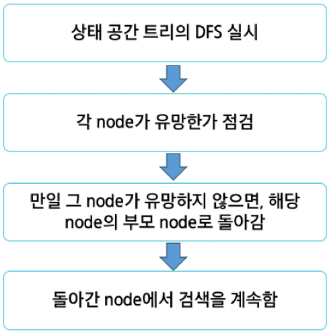

### 미로 찾기란?
그림과 같이 입구와 출구가 주어진 미로에서 입구부터 출구까지의 경로를 찾는 문제, 이동할 수 있는 방향은 4방향으로 제한


### 미로 찾기 알고리즘

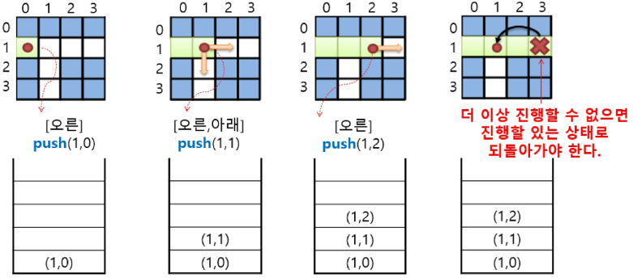

---

- Stack을 이용하여 지나온 경로를 역으로 되돌아 감

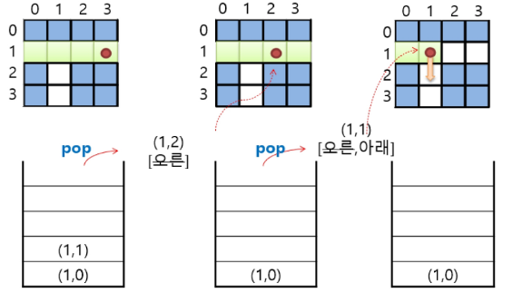

---

- 가능한 경로 찾기

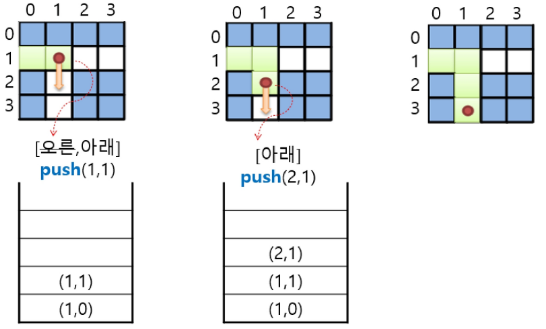

### 일반 Backtracking 알고리즘

```py
def checknode(v):   # node
    if promising(v):
        if there is a solution at v:
            write the solution
        else:
            for u in each child of v:
                checknode(u)
```

### n-Queen 문제

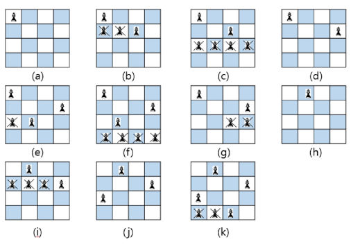

### 상대 공간 트리

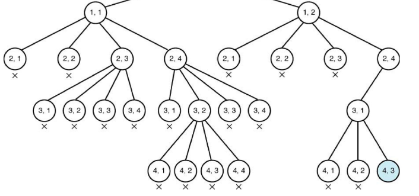

### DFS vs Backtracking


