# 트리

## 트리

### 트리의 개념
- 비선형 구조
- 원소들 간에 1:n 관계를 가지는 자료구조
- 원소들 간에 계층관계를 가지는 계층형 자료구조
- 상위 원소에서 하위 원소로 내려가면서 확장되는 트리(나무) 모양의 구조

### 트리의 정의
- 한 개 이상의 노드로 이루어진 유한 집합이며 다음 조건을 만족
    - 노드 중 최상위 노드를 루트(root)라고 한다.
    - 나머지 노드들은 n(>=0)개의 분리 집합 T1, ..., TN으로 분리될 수 있다.

- 이들 T1, ..., TN은 각각 하나의 트리가 되며(재귀적 정의) 루트의 부 트리(subtree)라 한다.

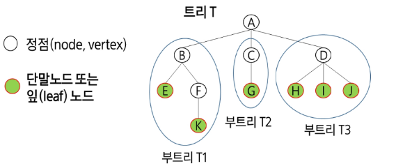

### 용어정리
- 노드(node) - 트리의 원소
    - 트리 T의 노드 - A, B, C, D, E, F, G, H, I, J, K
- 간선(edge) - 노드를 연결하는 선. 부모 노드와 자식 노드를 연결
- 루트 노드(root node) - 트리의 시작 노드
    - 트리 T의 루트노드 - A

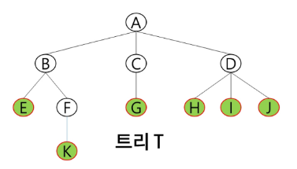

- 형제 노드(sibling node) - 같은 부모 노드의 자식 노드들
    - B, C, D는 형제 노드
- 조상 노드 - 간선을 따라 루트 노드까지 이르는 경로에 있는 모든 노드들
    - K의 조상 노드: F, B, A
- 서브 트리(subtree) - 부모 노드와 연결된 간선을 끊었을 때 생성되는 트리
- 자손 노드 - 서브 트리에 있는 하위 레벨의 노드들
    - B의 자손 노드 - E, F, K

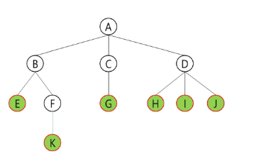

- 노드의 차수 - 노드에 연결된 자식 노드의 수
    - B의 차수 = 2, C의 차수 = 1
- 트리의 차수 - 트리에 있는 노드의 차수 중에서 가장 큰 값
    - 트리 T의 차수 = 3
- 단말 노드(리프 노드) - 차수가 0인 노드, 자식 노드가 없는 노드

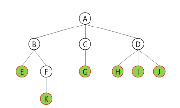

- 노드의 높이 - 루트에서 노드에 이르는 간선의 수. 노드의 레벨
    - B의 높이 = 1, F의 높이 = 2
- 트리의 높이 - 트리에 있는 노드의 높이 중에서 가장 큰 값. 최대 레벨
    - 트리 T의 높이 = 3

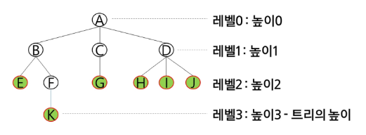

## 이진 트리
- 모든 노드들이 2개의 서브트리를 갖는 특별한 형태의 트리
- 각 노드가 자식 노드를 최대한 2개까지만 가질 수 있는 트리
    - 왼쪽 자식 노드(left child node)
    - 오른쪽 자식 노드(right chile node)
- 이진 트리의 예

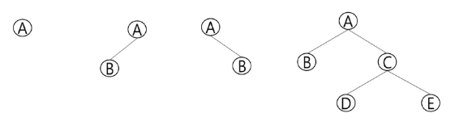

### 이진 트리의 특성
- 레벨 i에서의 노드의 최대 개수는 2^i개
- 높이가 h인 이진 트리가 가질 수 있는 노드의 최소 개수는 (h+1)개가 되며, 최대 개수는 (2^(h+1)-1)개

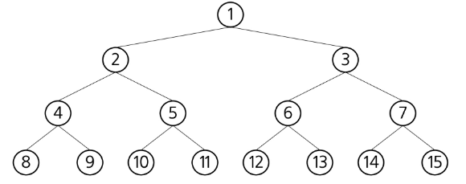

### 포화 이진 트리(Full Binary Tree)
- 모든 레벨에 노드가 포화상태로 차 있는 이진 트리
- 높이가 h일 때, 최대의 노드의 개수인 (2^(h+1)-1)의 노드를 가진 이진 트리
    - 높이가 3일 때 15개의 노드를 가짐
- 루트를 1번으로 하여 2^(h+1)-1까지 정해진 위치에 대한 노드 번호를 가짐

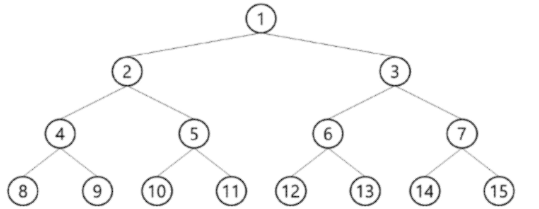

### 완전 이진 트리(Complete Binary Tree)
- 높이가 h이고 노드 수가 n개일 때(단, 2^h <= n <= 2^(h+1)-1), 포화 이진 트리의 노드 번호 1번부터 n번까지 빈 자리가 없는 이진 트리
    - ex) 노드가 10개인 완전 이진 트리

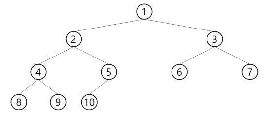

### 편향 이진 트리(Skewed Binary Tree)
- 높이가 h에 대한 최소 개수의 노드를 가지면서 한쪽 방향의 자식 노드만을 가진 이진 트리
    - 왼쪽 편향 이진 트리
    - 오른쪽 편향 이진 트리

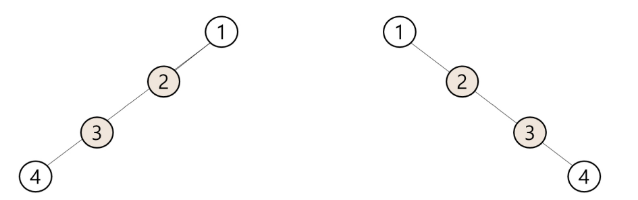

## 순회(traversal)
트리의 각 노드를 중복되지 않게 전부 방문(visit)하는 것

- 트리는 비선형구조이기 때문에 선형구조에서와 같이 선후 연결 관계를 알 수 없다.

### 3가지의 기본적인 순회 방법
- 전위 순회(preorder traversal): VLR
    - 부모 노드 방문 후, 자식 노드를 좌, 우 순서로 방문
- 중위 순회(inorder traversal): LVR
    - 왼쪽 자식 노드, 부모 노드, 오른쪽 자식 노드 순으로 방문
- 후위 순회(postorder traversal): LRV
    - 자식 노드를 좌, 우 순서로 방문한 후, 부모 노드로 방문

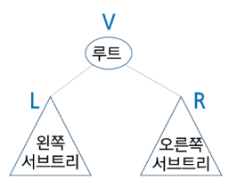

### 전위 순회(preorder traversal)
- 수행 방법
    1. 현재 노드 n을 방문하여 처리 -> V
    2. 현재 노드 n의 왼쪽 서브트리로 이동 -> L
    3. 현재 노드 n의 오른쪽 서브트리로 이동 -> R
- 전위 순회 알고리즘

```py
def preorder_traverse(T):   # 전위 순회
    if T:                   # T is not None
        visit(T)            # print(T.item)
        preorder_traverse(T.left)
        preorder_traverse(T.right)
```

### 전위 순회의 예

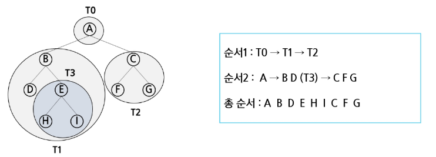

```py
def preorder(t):
    # t번 노드가 존재하는 노드면 순회
    if t:
        # V 노드에서 해야할 연산 코드 작성
        # L: t번 노드의 왼쪽을 전위 순회
        preorder(c_l[t])
        # R: t번 노드의 오른쪽을 전위 순회
        preorder(c_r[t])

preorder(1)
```

### 중위 순회(inorder traversal)
- 수행 방법
    1. 현재 노드 n의 왼쪽 서브트리로 이동 -> L
    2. 현재 노드 n을 방문하여 처리 -> V
    3. 현재 노드 n의 오른쪽 서브트리로 이동 -> R
- 중위 순회 알고리즘

```py
def inorder_traverse(T):    # 중위순회
    if T:                   # T is not None
        inorder_traverse(T.left)
        visit(T)            # print(T.item)
        inorder_traverse(T.right)
```

### 중위 순회의 예

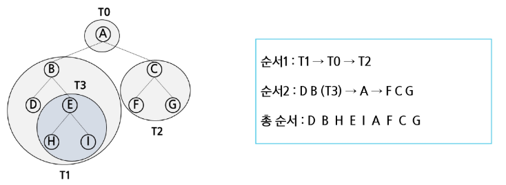

```py
def inorder(t):
    pass
```

### 후위 순회(postorder traversal)
- 수행 방법
    1. 현재 노드 n의 왼쪽 서브트리로 이동 -> L
    2. 현재 노드 n의 오른쪽 서브트리로 이동 -> R
    3. 현재 노드 n을 방문하여 처리 -> V
- 후위 순회 알고리즘

```py
def postorder_traverse(T):  # 후위순회
    if T:                   # T is not None
        postorder_traverse(T.left)
        postorder_traverse(T.right)
        visit(T)            # print(T.item)
```

### 후위 순회의 예

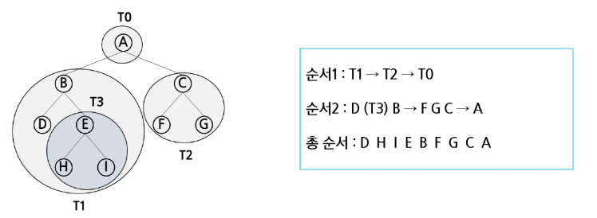

```py
def postorder(t):
    pass
```

### 이진 트리의 순회

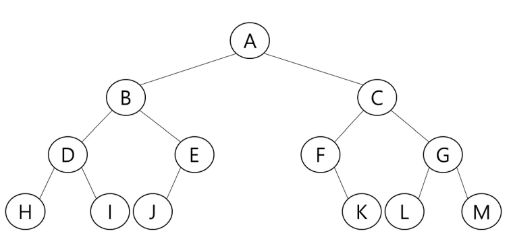

- 전위 순회는?: A - B - D - H - I - E - J - C - F - K - G - L - M
- 중위 순회는?: H - D - I - B - J - E - A - K - F - C - L - G - M
- 후위 순회는?: H - I - D - J - E - B - K - F - L - M - G - C - A

## 이진 트리의 표현1

### 배열을 이용한 이진 트리의 표현
- 이진 트리에 각 노드 번호를 다음과 같이 부여
- 루트의 번호를 1로 함 부터
- 레벨 n에 있는 노드에 대해 왼쪽부터 오른쪽으로 2^n부터 2^(n+1)-1까지 번호를 차례로 부여
- **포화 이진 트리, 완전 이진 트리에 적합**


### 노드 번호의 성질
- 노드 번호가 i인 노드의 부모 노드 번호?        i//2
- 노드 번호가 i인 노드의 왼쪽 자식 노드 번호?   2*i
- 노드 번호가 i인 노드의 오른쪽 자식 노드 번호? 2*i+1
- 레벨 n의 노드 번호 시작 번호는?             2^n

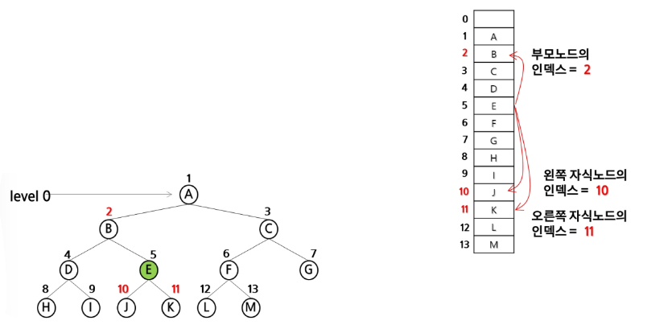

### 배열을 이용한 이진 트리의 표현
- 노드 번호를 배열의 인덱스로 사용
- 높이가 h인 이진 트리를 위한 배열의 크기는?

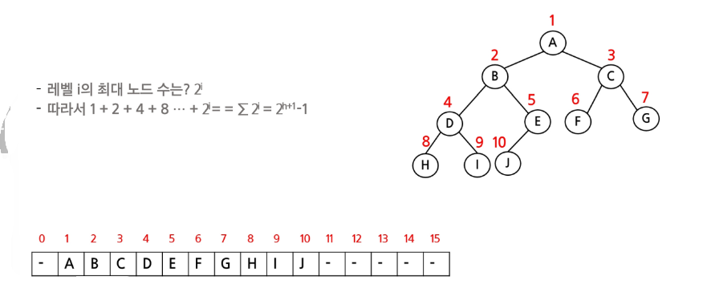

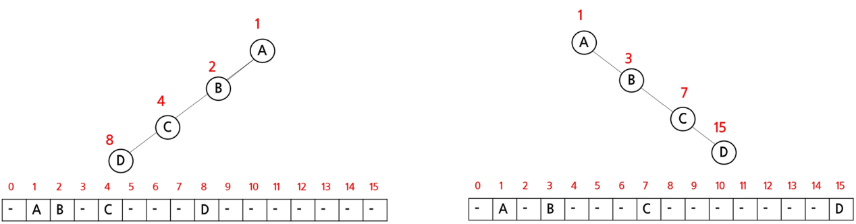

## 이진 트리의 표현2

### 부모 번호를 인덱스로 자식 번호를 저장

```
4 <- 간선의 개수 N
1 2 1 3 3 4 3 5 <- 부모 자식 순
```

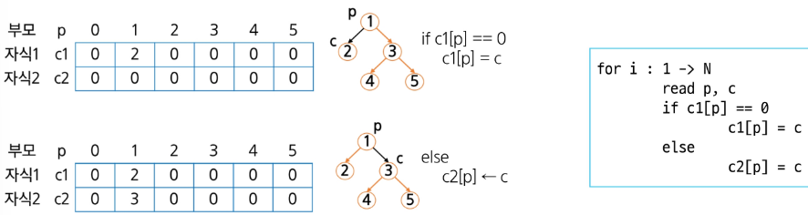

```py
"""
4
1 2 1 3 3 4 3 5
"""
E = int(input())
N = 5
tree = list(map(int, input().split))

# left_child[i]: i번 노드의 왼쪽 자식 노드 번호
left_child = [0] * (N + 1)
# right_child[i]: i번 노드의 오른쪽 자식 노드 번호
right_child = [0] * (N + 1)

for i in range(E):
    p = tree[i * 2]
    c = tree[i * 2 + 1]

    # p번 노드의 왼쪽 자식이 없으면 c를 p의 왼쪽 자식으로
    if not left_child[p]:
        left_child[p] = c
    # 왼쪽 자식이 있으면 c를 p의 오른쪽 자식으로
    else:
        right_child[p] = c

print("부모        번호:", *list(range(N + 1)))
print("=======================")
print("왼쪽 자식   번호:", *left_child)
print("오른쪽 자식 번호:", *right_child)
```

### 자식 번호를 인덱스로 부모 번호를 저장

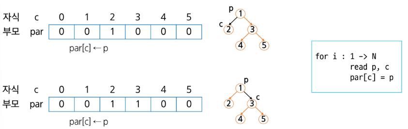

### 루트 찾기, 조상 찾기

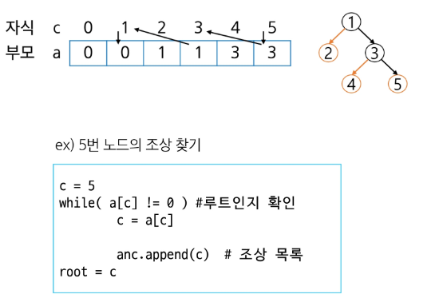

```py
"""
4
1 2 1 3 3 4 3 5
"""
E = int(input())
N = 5

tree = list(map(int, input().split))

# parent[i]: i번 노드의 부모 노드 번호
parent = [0] * (N + 1)

for i in range(E):
    p = tree[i * 2]
    c = tree[i * 2 + 1]

    parent[c] = p

print("자식 번호 :", *list(range(N + 1)))
print("===========================")
print("부모 번호 :", *parent)

# 5번 노드의 조상 노드 모두 찾기
child = 5

ancestor = []

while parent[child] != 0:
    # 원래 chile의 부모 노드의 부모 노드를 알아내기 위해 바꿔주기
    child = parent[child]
    ancestor.append[child]

root = child
print(root, ancestor)
```

### 배열을 이용한 이진 트리의 표현 상 단점
- 편향 이진 트리의 경우에 사용하지 않는 배열 원소에 대한 메모리 공간 낭비 발생
- 트리의 중간에 새로운 노드를 삽입하거나 기존의 노드를 삭제할 경우 배열의 크기 변경 어려워 비효율적

### 연결 리스트를 이용한 트리의 표현
- 배열을 이용한 이진 트리의 표현 상 단점을 보완

### 연결 자료구조를 이용한 이진 트리의 표현
- 이진 트리의 모든 노드는 최대 2개의 자식 노드를 가지므로 일정한 구조의 단순 연결 리스트 노드를 사용

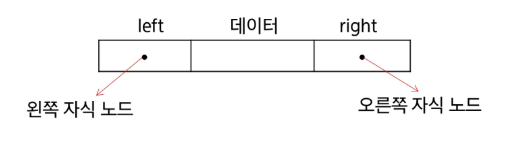

### 완전 이진 트리의 연결 리스트 표현

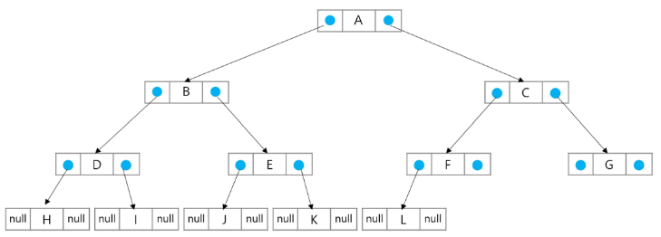

```py
class Node:
    def __init__(self, value):
        self.left = None
        self.right = None
        self.value = value


A = Node("A")
B = Node("B")
C = Node("C")
D = Node("D")
E = Node("E")

A.left = D
A.right = E
E.left = B
E.right = C

# 전워 순회: V - L - R
def preorder(t):
    # t번 노드가 존재하는지 확인
    if t:
        # V 노드에서 할 거 해라
        print(t.value, end=" ")
        # L 순회 t 노드의 왼쪽 전위 순회
        preorder(t.left)
        # R 순회 t 노드의 왼쪽 전위 순회
        preorder(t.right)

preorder(A)
```

### 수식 트리
- 수식을 표현하는 이진 트리
- 수식 이진 트리(Expression Binary Tree)라고 부르기도 함
- 연산자는 루트 노드이거나 가지 노드
- 피연산자는 모두 잎 노드

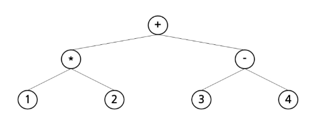

### 수식 트리의 순회
- 중위 순회
    - A / B * C * D + E (식의 중위 표기법)
- 후위 순회
    - A B / C * D * E + (식의 중위 표기법)
- 전위 순회
    - \+ * * / A B C D E (식의 중위 표기법)

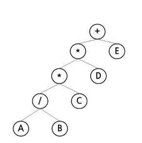

## 연습 문제

### 전위 순회
- 전위 순회하여 정점의 번호를 출력
    - 첫 줄에는 트리의 정점을 총 수 V, 그 다음 줄에는 V-1개 간선 정보가 나열됨
    - 간선은 그것을 이루는 두 정점으로 표기됨
    - 간선은 항상 "부모 자식" 순서로 표기되며, 아래 예에서 두 번째 줄 처음 1과 2는 정점 1과 2를 잇는 간선으로 1이 부모, 2가 자식을 의미함

```py
"""
13
1 2 1 3 2 4 3 5 3 6 4 7 5 8 5 9 6 10 6 11 7 12 11 13
"""

# 트리 노드의 수
N = int(input())
# 트리 정보: 두 개씩 끊어서 읽으면 앞 쪽이 부모, 뒷 쪽이 자식
tree = list(map(int, input().split()))

# 부모 노드 번호를 인덱스로 사용
c_l = [0] * (N + 1)
c_r = [0] * (N + 1)

for i in range(N - 1):
    # 앞이 부모, 뒤가 자식
    p = tree[i * 2]
    c = tree[i * 2 + 1]
    
    # p번 노드의 왼쪽 자식이 없다면
    if c_l[p] == 0:
        # c번 노드를 p번 노드의 왼쪽 자식으로
        c_l[p] = c
    # 왼쪽 자식이 있다면 오른쪽 자식으로
    else:
        c_r[p] = c

print(cleft)
print(cright)

# 1. 전위 순회 : V - L - R
def preorder(t):
    # t번 노드가 존재하는 노드면 순회
    if t:
        # V 노드에서 해야할 연산 코드 작성
        print(t, end=" ")
        # L : t번 노드의 왼쪽을 전위순회
        preorder(cleft[t])
        # R : t번 노드의 오른쪽을 전위순회
        preorder(cright[t])


preorder(1)
print()


# 2. 중위 순회 : L - V - R
def inorder(t):
    if t:
        # L
        inorder(cleft[t])
        # V
        print(t, end=" ")
        # R
        inorder(cright[t])


inorder(1)
print()


# 3. 후위 순회 : L - R - V
def postorder(t):
    if t:
        # L
        postorder(cleft[t])
        # R
        postorder(cright[t])
        # V
        print(t, end=" ")


postorder(1)
print()
```
