# Static files

### Static files(정적 파일)란?
- 서버 측에서 변경되지 않고 고정적으로 제공되는 파일
  - 식당에 비치된 '인쇄된 메뉴판'과 같음
  - 메뉴판은 손님이 바뀐다고 해서 내용이 변하지 않고, 항상 동일한 모습으로 제공
    - 대표적인 종류: CSS 파일, JavaScript 파일, 이미지 파일, 폰트 파일

## 웹 서버와 정적 파일

### 웹 서버의 기본 역할
- "요청 받은 주소(URL)에 해당하는 자원을 찾아 응답해주는 것"
- 마치 도서관 사서에게 "A-3 구역의 3번째 책을 주세요"라고 요청하면, 사서가 해당 위치로 가서 책을 찾아 우리에게 건네주는 것과 같음
  - 여기서 'A-3 구역의 3번째'가 바로 **URL**이고, '책'이 <b>자원(Resource)</b>에 해당

    
    
### 정적 파일과 URL의 관계
- 웹 서버가 제공하는 가장 기본적인 자원이 바로 <b>정적 파일(Static Files)</b>
- 정적 파일 제공
  - 웹 서버는 요청 받은 URL을 보고, 서버 컴퓨터의 특정 폴더에 저장된 CSS, JS, 이미지 같은 정적 파일을 찾아 제공
- URL의 필요성
  - 결국 "정적 파일이 사용자에게 보이려면, 그 파일에 접근할 수 있는 고유한 주소(URL)가 반드시 필요하다"는 의미

### 처리 과정 요약
1. 사용자: 브라우저에 http://example.com/images/logo.png 라는 주소를 입력하여 이미지를 요청
2. 웹 서버: /images/logo.png 라는 URL을 확인하고, 서버에 미리 약속된 폴더에서 logo.png 파일을 찾음
3. 웹 서버: 찾은 이미지 파일을 HTTP 응답에 담아 사용자에게 전송
4. 사용자: 브라우저가 응답 받은 이미지 파일을 화면에 보여줌

### Static files 경로의 종류
1. 기본 경로
2. 추가 경로

## Static files 기본 경로

### 정적 파일이 위치해야 하는 기본 경로
- app폴더/static/

### 기본 경로 CSS 스타일 제공하기
- articles/static/stylesheets/ 경로에 CSS 파일 배치하기

  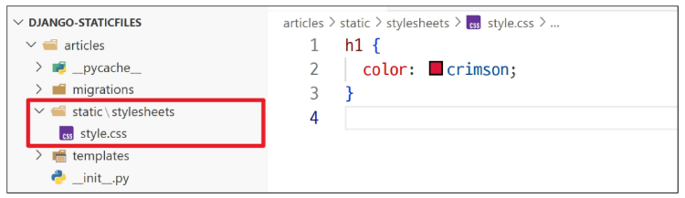

- 메인 페이지에서 CSS 파일 불러오기
- static files 경로는 DTL의 **static** tag를 사용해야 함
- built-in tag가 아니기 때문에 **load** tag를 사용해 import 후 사용 가능

  

- CSS가 적용된 것을 확인
- static tag가 어떤 주소를 만들어 냈는지 확인

  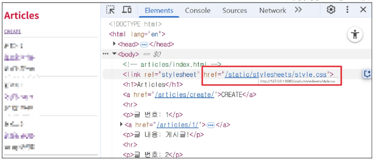
  
    - https://로 시작하는 웹 주소가 존재하는 것을 확인 가능

#### 
- 특정 라이브러리의 태그와 필터를 현재 템플릿에서 사용할 수 있도록 불러오는 역할
- ``은 `` 태그를 사용하기 위해 Django 템플릿 시스템에 "이제부터 static 관련 태그를 사용하겠다."고 알려주는 **선언문**
  - load 태그는 템플릿 파일의 가장 상단에 한 번만 작성하면 된다

#### 
- settings.py 파일의 STATIC_URL 값을 기준으로, 해당 정적 파일의 전체 URL 경로를 계산하여 생성
- 예를 들어, `STATIC_URL = 'static/'`이고 CSS 파일이 static/css/style.css에 위치한다면, 경로가 필요한 위치에 ``로 작성

### STATIC_URL이란?
- 정적 파일의 '웹 주소'
  - 웹 페이지에서 정적 파일에 접근할 때 사용할 <b>URL의 시작부분(접두사)</b>을 지정하는 설정
  - 이는 서버 컴퓨터에 저장된 실제 파일 경로가 아니라, **오직 웹(브라우저)에서만 사용되는 주소**
  - 마치 서버의 정적 파일 폴더에 **'static/'이라는 웹 주소 별명**을 붙여주는 것과 같다.
  - 브라우저가 이 별명으로 파일을 요청하면 Django는 약속된 실제 폴더에서 파일을 찾아 응답해줌
  - 기본 값: `'static/'`

### 기본 경로 이미지 파일 제공하기
- articles/static/image/ 경로에 이미지 파일 배치하기

  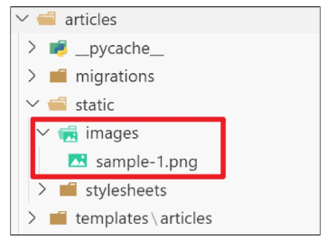

- DTL의 static tag를 사용해 이미지 경로 작성하기

  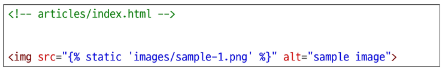

- 제공된 이미지의 URL 확인
- http://127.0.0.1:8000/static/images/sample-1.png

  

### 정적파일 URL이 만들어지기까지

## Static files 추가 경로

### 기본 경로 외 추가 경로 지정
- **STATICFILES_DIRS**에 문자열로 추가 경로를 설정

### STATICFILES_DIRS란?
- 기본 경로 외에 **추가적으로 탐색할 경로의 목록**을 지정하는 리스트
  - 기본 도서관 외에 책을 보관하는 '외부 창고'들의 주소 목록을 알려주는 것과 같다
  - Django는 이 목록에 있는 모든 폴더를 방문해 필요한 정적 파일을 탐색
  - 여러 앱에서 공통으로 사용되는 CSS 프레임워크(예: Bootstrap)나 JavaScript 라이브러리처럼 특정 앱에 속하지 않는 정적 파일들을 프로젝트 최상위 폴더(BASE_DIR) 같은 곳에 모아두고 관리할때 매우 유용함

### STATICFILES_DIRS 설정
- 이처럼 설정하면, Django는 기본 경로인 각 앱의 static/ 폴더를 모두 확인한 후, 프로젝트의 최상위 폴더에 있는 static/ 폴더도 추가로 탐색하게 됨

  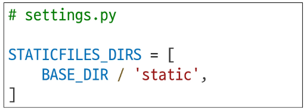

### 추가 경로 이미지 파일 제공하기
- 설정한 추가 경로에 이미지 파일 배치하기

  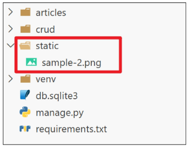

- DTL의 static tag를 사용해 이미지 경로 작성하기

  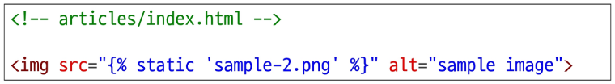

- 제공된 이미지의 URL 확인
- http://127.0.0.1:8000/static/sample-2.png

  

### 정적 파일의 핵심 원리: 주소(URL)가 있어야 찾아갈 수 있다.
- 컴퓨터에 파일이 존재하는 것만으로는 웹 페이지에 보일 수 없음
- 외부의 손님(브라우저)이 파일을 찾아올 수 있도록 반드시 '웹 주소(URL)'라는 문패를 달아줘야 함

  

# Media files

### Media files란?
- 사용자가 웹사이트를 통해 직접 업로드하는 파일
  - Static Files이 사이트 개발자가 미리 준비해 둔 '고정된' 파일이라면, Media Files는 사이트 운영 중 사용자에 의해 생성되고 변경되는 '동적인' 파일
  - 쇼핑몰의 기본 로고나 아이콘은 정적 파일
  - 사용자가 상품 후기를 작성하며 올리는 **상품 사진**은 **미디어 파일**

## 이미지 업로드

### ImageField()
- 이미지 파일을 업로드하기 위해 사용하는 Django 모델 필드
- DB 저장 방식
  - 가장 중요한 특징은 이미지 파일 자체가 DB에 저장되는 것이 아니라는 점
  - DB에는 upload_to 경로를 기준으로 한 이미지 파일의 경로(문자열)만 저장되고, 실제 파일은 서버의 특정 폴더(MEDIA_ROOT)에 저장

    

      - upload_to는 선택 인자

### 미디어 파일을 제공하기 전 준비사항
1. settings.py에 `MEDIA_ROOT`, `MEDIA_URL` 설정
2. 작성한 MEDIA_ROOT와 MEDIA_URL에 대한 URL 지정

### MEDIA_ROOT란?
- 미디어 파일의 '실제 창고' 주소
  - 사용자가 업로드한 미디어 파일들이 서버 컴퓨터 **어디에 저장될지를 지정**하는 **절대 경로**
  - 서버 내부에서만 사용하는 **물리적인 폴더 주소**로, Django는 파일을 저장하거나 읽어올 때 이 경로를 사용

    

### MEDIA_URL이란?
- 미디어 파일의 '웹 주소' 별명
  - MEDIA_ROOT에 저장된 파일들을 웹 페이지에서 접근할 때 사용할 URL의 시작 부분을 지정
  - STATIC_URL과 동일한 역할로, 실제 저장 위치를 숨기고 웹에서 사용할 공개 주소 별명을 만들어주는 것

    

### MEDIA_ROOT와 MEDIA_URL 설정
- MEDIA_ROOT는 **파일을 저장하고 관리하기 위한 서버의 실제 경로**이고, MEDIA_URL은 **그 파일을 웹에서 보여주기 위한 가상의 주소**

  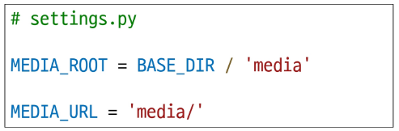

- settings.MEDIA_URL: "media/로 시작하는 URL 요청이 오면,"
- document_root=settins.MEDIA_ROOT: "MEDIA_ROOT에 지정된 실제 폴더에서 파일을 찾아라."

  

---
- Django의 개발 서버는 기본적으로 파이썬 코드를 실행해 동적인 웹 페이지를 보여주는 애플리케이션 서버
- 사용자가 올린 이미지 파일같은 정적 파일을 어떻게 찾아 보여줘야 하는지 스스로 모름
- 따라서 개발자가 직접 URL 경로를 만들어 "**이 주소로 요청이 오면, 이 폴더에서 파일을 찾아 보여줘**" 라는 규칙을 추가해야 함
- 결론적으로 이 코드는 Django 개발 서버가 미디어 파일을 처리할 수 있도록 **임시 '웹 주소'와 '실제 파일 위치'를 연결해주는** 역할

### 이미지 업로드 구현
- Article 모델 클래스에 image 필드 작성
- blank-=True 속성을 작성해 빈 문자열이 저장될 수 있도록 제약 조건 설정
  - 게시글 작성 시 이미지 첨부 없이도 작성할 수 있도록 하기 위함

    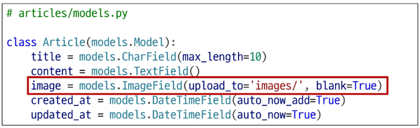

      - 기존 필드 사이에 작성해도 실제 테이블 생성 시에는 가장 우측(뒤)에 추가됨

- migration 진행 과정 중 에러 발생

  

    - ImageField를 사용하려면 반드시 <u>Pillow</u> 라이브러리가 필요

---
- Pillow: 파이썬에서 이미지를 열고, 크기 조절이나 필터 적용같은 다양한 편집 작업을 수행한 후 저장할 수 있게 해주는 필수 이미지 처리 라이브러리

- Pillow 설치 후 migrations 재진행

  

- form 요소의 <u>enctype 속성</u> 추가

  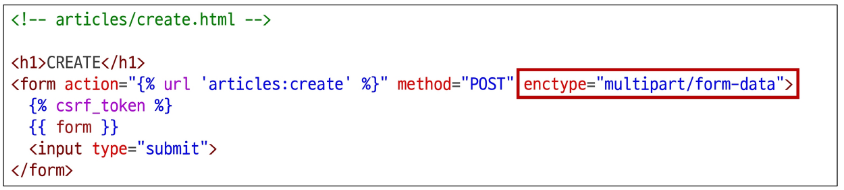

    - 파일 업로드 시에는 반드시 multipart/form-data로 설정

---
- enctype 속성: form 데이터가 서버로 제출될 때 해당 데이터가 어떤 형식으로 인코딩될지 지정하는 속성

- ModelForm의 2번째 인자로 요청받은 파일 데이터 작성

  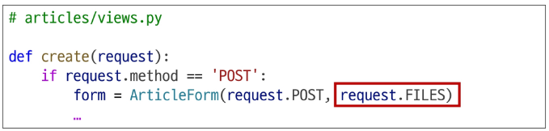

    - ModelForm의 상위 클래스인 BaseModelForm의 생성자 함수의 2번째 위치 인자로 파일을 받도록 설정됨

- 게시글 작성 페이지에서 새로 추가된 input 태그 확인

  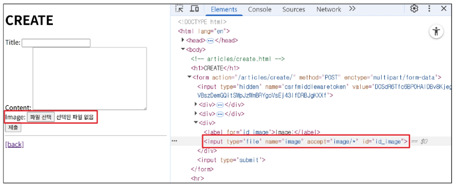

- 이미지 업로드 후 이미지 파일 위치 확인
  - MEDIA_ROOT 경로에 업로드된 이미지 파일

    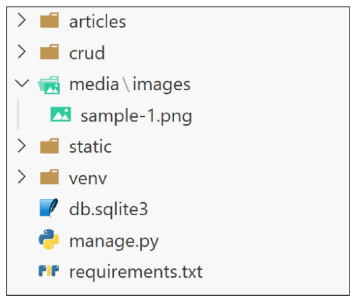

- 이미지 업로드 후 DB 확인
  - 이미지 파일 자체가 DB에 저장되는 것이 아닌 upload_to 경로를 기준으로 한 이미지 파일의 경로(문자열)만 저장

    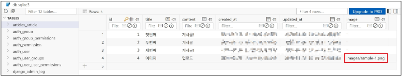

      - 이 방식은 DB의 용량을 가볍게 유지하고 성능을 높이는데 매우 효율적

## 업로드 이미지 제공

### 게시글 상세 페이지에 업로드한 이미지 제공하기
- ImageField의 **.url** 속성
  - 업로드 파일의 웹 주소
  - ImageField나 FileField에 저장된 파일 객체에서 **.url** 속성을 사용하면, 해당 파일을 웹에서 접근할 수 있는 전체 URL 주소를 얻을 수 있음

    

      - 이미지를 업로드하지 않은 게시물은 detail 템플릿을 렌더링할 수 없음
      - 이미지 데이터가 있는 경우만 이미지를 출력할 수 있도록 if 태그 활용

## 업로드 이미지 수정
- 수정 페이지 form 요소에 enctype 속성 추가

  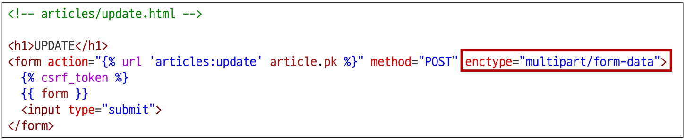

- update view 함수에서 업로드 파일에 대한 추가 코드 작성

  

# 참고

## upload_to 활용

### upload_to 속성 심화 활용
- 단순한 문자열 경로 외에도, 업로드 경로를 동적으로 생성하는 두 가지 유용한 방법을 제공
1. 날짜를 이용한 경로 구성
2. 함수를 이용한 동적 경로 생성

### 1. 날짜를 이용한 경로 구성
- strftime()의 형식 코드를 사용하여 파일이 업로드된 날짜를 기준으로 폴더를 자동으로 생성할 수 있음
  - %Y: 4자리 연도
  - %m: 2자리 월
  - %d: 2자리 일

    

### 2. 함수를 이용한 동적 경로 생성
- 더 복잡한 로직으로 경로를 만들고 싶을 때는, upload_to에 함수를 직접 전달할 수 있음
- 이 함수는 두 가지 인자를 받음
  - instance: 파일이 첨부된 모델의 인스턴스(해당 게시글 객체 등)
  - filename: 업로드된 파일의 원본 이름

    

      - 이를 통해 특정 유저의 폴더에 파일을 저장하는 등 매우 유연한 경로 생성이 가능

## AWS 인프라 이해하기

#### AWS(Amazon Web Services)
- 아마존이 제공하는 클라우드 컴퓨팅 플랫폼
- 서버, 스토리지, DB 같은 IT 인프라를 직접 구매하지 않고, **인터넷을 통해 필요한 만큼 빌려쓰는 서비스**

#### AWS 핵심 서비스 3가지

### EC2, S3, RDS를 활용한 웹 서비스 구축
- EC2 (서버)
  - 웹 애플리케이션(Django)이 실행되는 컴퓨터의 역할
- S3 (파일 저장소)
  - 사용자가 올린 이미지나 사이트의 로고 등 정적 파일을 보관하는 외부 창고 역할
- RDS (DB)
  - 회원 정보, 게시글 등 중요한 데이터를 기록하고 관리하는 장부 역할

### 데이터 흐름도 요약

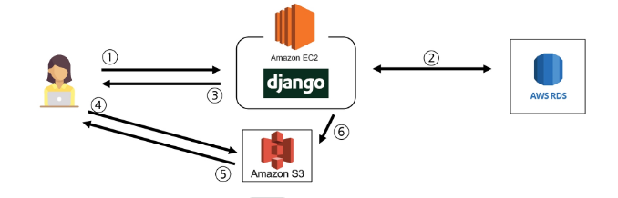

1. 사용자 -> EC2 (HTTP Request)
  - 사용자가 브라우저를 통해 웹사이트에 접속(요청)
  - 이 요청은 가장 먼저 EC2에 도달
2. EC2 <-> RDS (DB Query)
  - EC2의 Django 애플리케이션은 요청을 처리하기 위해 필요한 데이터(예: 게시글, 사용자 정보)를 RDS에 조회하거나 새로운 데이터를 저장
3. EC2 -> 사용자 (HTML Response)
  - EC2는 DB에서 가져온 정보와 HTML 템플릿을 조합하여 완전한 웹 페이지(HTML)를 만들어 사용자에게 응답
  - 이 HTML 페이지 안에는 이미지, CSS, JS 파일의 주소가 S3를 가리키도록(src="https://...s3...") 포함되어 있음
4. 사용자 -> S3 (File Request)
  - HTML을 받은 사용자의 브라우저는 페이지를 완전하게 그리기 위해, HTML에 명시된 S3 주소로 직접 이미지나 CSS 파일을 요청
  - EC2를 거치지 않음
5. 사용자 <- S3 (File Response)
  - S3는 요청받은 파일을 사용자 브라우저에 전송
6. (파일 업로드 시) 사용자 -> EC2 -> S3
  - 사용자가 이미지를 업로드하면, 요청은 EC2로 감
  - EC2의 Django 앱은 파일을 받아 S3에 저장

### 클라우드 컴퓨팅 플랫폼을 사용하는 이유
- 비용 절감
  - 물리 장비를 직접 구매할 필요 없이, 사용한 만큼만 비용을 지불
- 유연성과 확장성
  - 필요에 따라 서버 사양이나 저장 공간 용량을 몇 번의 클릭만으로 자유롭게 조절할 수 있음
- 글로벌 서비스
  - 전 세계에 위치한 데이터 센터를 통해 어떤 국가의 사용자에게도 빠르고 안정적인 서비스를 제공

## BaseModelForm

### BaseModelForm의 생성자 함수 인자 구성
- ModelForm의 상위 클래스 BaseModelForm의 생성자 함수 키워드 인자 순서 참고

  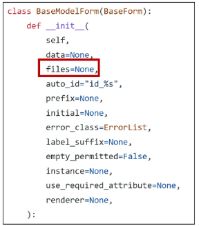

### 실습
- Static file
  - 3238. SNS 서비스 만들기 - STATIC
  - 3039. static 이미지 제공과 코드 개선
  - 2694. 장소 Media & Static 파일 기본 설정 예제
- Media file
  - 3038. 이미지 업로드 기능 구현
  - 2695. 업로드된 Media 파일 URL 설정 예제
