# 조합적 문제

## 부분 집합

### 부분집합(Powerset)이란?
- 어떤 집합의 공집합과 자기 자신을 포함한 모든 부분
- 구하고자 하는 어떤 집합의 원소 개수가 n일 경우 부분집합의 수는 2 ** n개이다.

## <mark>집합에 포함된 원소들을 선택</mark>하는 것
- 부분 집합 예시
    - 아래 표는 집합 {A, B, C}로 만들 수 있는 부분 집합의 예시
    - 부분 집합에는 아무 것도 선택하지 않은 경우도 포함 (공집합)

|{A, B, C}|
|:-:|
|{A}|
|{B}|
|{A, B}|
|{C}|
|{A, C}|
|{B, C}|
|{A, B, C}

### 집합에서 부분 집합을 찾아내는 구현 방법
1. 완전탐색
    - 재귀호출을 이용한 완전탐색으로, 부분집합을 구할 수 있다.
    - 실전보다는 완전탐색 <b>학습용</b>으로 추천하는 방법

2. Binary Counting
    - 2진수 & 비트연산을 이용하여, 부분집합을 구할 수 있다.
    - **모든 부분 집합이 필요할 때 사용**하는 추천 방법

### 완전탐색으로 부분집합 구하기

```md
- 민철이에게는 세 명의 친구가 있다.
    {MIN, CO, TIM}

- 함께 영화관에 갈 수 있는 멤버를 구성하고자 한다.

- 모든 경우의 수를 출력
```

### 완전탐색을 이용해 구현
- O, X 로 집합에 포함시킬지 말지 결정

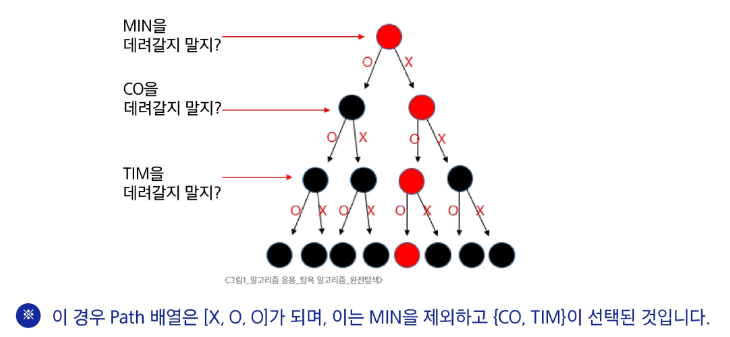

### 코드 구현
- Branch: 2개
- Level: 3개

```py
arr = ['O', 'X']
path = []
name = ['MIN', 'CO', 'TIM']


def run(lev):
    if lev == 3:
        print(path)
        return

    for i in range(2):
        path.append(arr[i])
        run(lev + 1)
        path.pop()


run(0)
```

```py
['O', 'O', 'O']
['O', 'O', 'X']
['O', 'X', 'O']
['O', 'X', 'X']
['O', 'O', 'O']
['X', 'O', 'O']
['X', 'X', 'O']
['X', 'X', 'X']
```

- 친구 이름을 출력하는 코드를 추가해보시오.

```py
# 이름 출력 함수
def print_name():
    print('{ ', end='')
    for i in range(3):
        if path[i] == 'O':
            print(name[i], end=' ')
    print('}')
```

### 완성된 소스코드
- 이름 출력 코드 추가

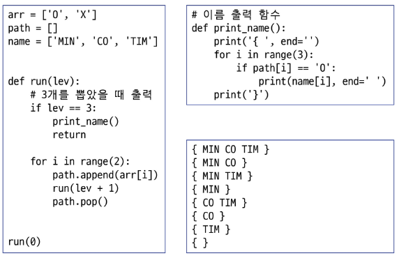

### 바이너리 카운팅(Binary Counting)
- 원소 수에 해당하는 N개의 비트열을 이용해 부분집합을 표시
- 00**1** 이면 부분집합 {A}를 나타냄
    - **0번 비트**가 1이므로 첫 원소인 A만 포함된 부분집합을 나타냄
- **11**0 이면 부분집합 {B, C}를 나타냄
    - **1번, 2번 비트**가 1이므로, 두 번째와 세 번째 원소인 B, C가 포함된 부분집합을 나타냄

10진수|이진수|{A, B, C}
:-:|:-:|:-:
0|000|{}
1|001|{A}
2|010|{B}
3|011|{A, B}
4|100|{C}
5|101|{A, C}
6|110|{B, C}
7|111|{A, B, C}

### 부분 집합의 총 개수
- 만들 수 있는 집합의 총 개수는 2 ** n 이며 n = 3 이기에, 총 8개의 부분집합 존재
- 2 ** n 은 1 << n 공식을 이용하여 빠르게 구할 수 있음

```py
print(pow(2, 3))    # 8
print(1 << 3)       # 8
```

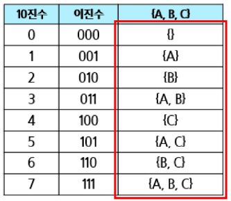

### 부분집합 {B, C}를 만드는 과정
- 6(0b110)에서 비트 연산을 이용해 마지막 한 자리가 1인지 0인지 검사

```py
arr = ['A', 'B', 'C']
n = len(arr)

def get_sub(tar):
    print(f'target = {tar}', end=' / ')
    for i in range(n):
        if tar & 0x1:
            print(arr[i], end=' ')
        tar >>= 1
get_sub(6)
```

- 검사한 한 자리를 제거 **(tar >>= 1)**

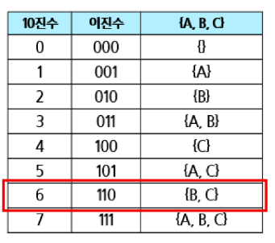

### 완성된 부분집합 코드
- get_sub(0) ~ get_sub(7) 까지 호출하여 모든 부분집합을 출력

```py
arr = ['A', 'B', 'C']
n = len(arr)

def get_sub(tar):
    for i in range(n):
        if tar & 0x1:
            print(arr[i], end='')
        tar >>= 1


for tar in range(1 << n):   # range(0, 8)
    prunt('{', end='')
    get_sub(tar)
    print('}')
```

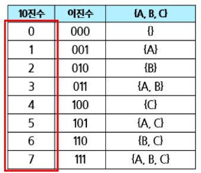

### 친구와 카페 방문

```md
민철이는 친구 {A, B, C, D, E}가 있다.
이 중 최소 2명 이상의 친구와 함께 카페에 가려 한다.

총 몇 가지 경우가 가능한가?
```

```py
arr = ['A', 'B', 'C', 'D', 'E']


def cafe(tar):
    result = []
    for i in range(len(arr)):
        if tar & 0x1:
            result.append(arr[i])
        tar >>= 1
    return result

cnt = 0
for target in range(1 << len(arr)):
    results = cafe(target)
    if len(results) >= 2:
        print(results)
        cnt += 1

print(cnt)  # 26가지
```

## 조합

### 조합(combination)이란?
- 서로 다른 n개의 원소 중 r개를 순서없이 골라낸 것

### 순열과 조합 차이

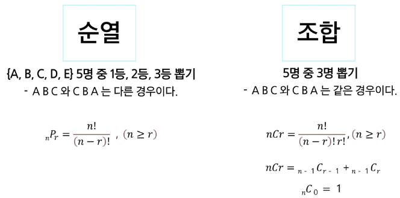

### [도전] {A, B, C, D, E} 5명 중 3명 뽑을 수 있는 모든 경우를 메모장에 적어보자.
- 힌트: ABC, CDE

```md
ABC
ABD
ABE
ACD
ACE
ADE
BCD
BCE
BDE
CDE
```

### 만약 5명 중 3명을 뽑는 코드는 몇 중 for문이 필요할까?
- 3중 for문으로 구현이 가능

### 만약 5명 중 n명을 뽑는 코드는 몇 중 for문이 필요할까?
- N중 for문으로 구현이 가능. 즉, **재귀호출 구현이 필요**
- Branch: 최대 5개
- Level: n

### 코드에 start 파라미터를 추가하여 조합 소스코드를 완성한다.
- level = n
- Branch = 5
1. 처음 recur 함수의 start 값은 0이다. 따라서 0 ~ 5까지 반복하면서 재귀호출을 한다.
2. 만약 i가 3이 선택되는 경우는 재귀호출할 때 start는 4가 된다. 다음 for문은 4부터 수행한다.

```py
arr = ['A', 'B', 'C', 'D', 'E']
N = 3

path = []

def recur(cnt, start):
    # N명을 뽑으면 종료
    if cnt == N:
        print(*path)
        return

    for i in range(start, len(arr)):
        path.append(arr[i])
        recur(cnt + 1, i + 1) 
        path.pop()

recur(0, 0)
```

### [도전] 주사위 던지기
- 주사위 N개를 던져서 나올 수 있는 눈금의 모든 조합을 출력하기
- N = 3 일 때 출력 결과

```py
arr = ['A', 'B', 'C', 'D', 'E']


def cafe(tar):
    result = []
    for i in range(len(arr)):
        if tar & 0x1:
            result.append(arr[i])
        tar >>= 1
    return result

cnt = 0
for target in range(1 << len(arr)):
    results = cafe(target)
    if len(results) >= 2:
        print(results)
        cnt += 1

print(cnt)
```

# 탐욕 알고리즘

## Greedy

### Greedy(욕심쟁이 기법, 알고리즘)이란?
- 결정이 필요할 때, **현재 기준으로 가장 좋아보이는** 선택지로 결정하여 답을 도출하는 알고리즘

### 대표적인 문제 해결 기법
1. 완전탐색(Brute-Force)
    - 답이 될 수 있는 모든 경우를 시도해보는 알고리즘
2. **Greedy**
    - 결정이 필요할 때 **가장 좋아보이는 선택지로** 결정하는 알고리즘
3. DP
    - 현재에서 가장 좋아보이는 것을 선택하는 것이 아닌, 과거의 데이터를 이용하여 현재의 데이터를 만들어내는 문제해결기법
4. 분할정복
    - 큰 문제를 작은 문제로 나누어 해결하는 문제해결기법

#### 그리디로 풀 수 있는가?
1. 탐욕적 선택 조건(Greedy Choice Property)
- 각 단계의 최적해 선택이 이후 단계 선택에 영향을 주지 않는다.
- 즉, 각 단계 규칙이 변경되면 안 된다.
- 동전 문제 예시
    - 첫 번째 단계: 가장 큰 동전(500원) 가능한 만큼 주자
    - 두 번째 단계: 가장 큰 동전(100원) 가능한 만큼 주자
    <br>...<br>
    => 각 단계를 진행하면서 규칙이 유지
2. 최적 부분 구조(Optimal Substructure)
- 각 단계의 최적해 선택을 합하면, 전체 문제의 해결책이 되어야 함
<br>=> 증명을 통해 해결
- 동전 문제 예시
    - [명제] 가장 큰 동전부터 고르면 최소 동전 수가 나온다.
    - [간접 증명]
        - 최적해보다 더 적은 동전으로 표현 가능하다. (가정)
        <br>=> N원을 더 작은 값의 동전으로 더 적게 표현 가능하다.
        <br>==> 동전이 배수로 있기 때문에 불가능 / 더 적은 값으로 나누면 무조건 더 큰 수가 나옴
        - 그러므로 원래 명제가 참
3. 반례가 없는가?

### 동전 교환 문제


### 1,730원을 거슬러 줄 수 있는 최소 동전의 수
- 큰 동전부터 최대한 거슬러 주면 된다.<br>이처럼, 좋아보이는 값을 먼저 선택하는 것을 **그리디(Greedy), 탐욕(욕심쟁이) 알고리즘**이라고 한다.
- 500원 = 3개 = 누적 1,500원
- 100원 = 2개 = 누적 1,700원
- 10원 = 3개 = 누적 1,730원

### 그리디로 성립하는 조건인 10, 50, 100, 500원 동전일 때 1,730원을 거슬러 주는 소스코드

```py
coin_list = [500, 100, 50, 10]  # 큰 동전부터 앞으로 작성함
target = 1730
cnt = 0

for coin in coin_list:
    possible_cnt = target // coin   # 현재 동전으로 가능한 최대 수
    
    cnt += possible_cnt             # 정답에 더해준다.
    target -= coin * possible_cnt   # 금액을 빼준다.
print(cnt)
```

- 출력결과: 8

### 동전 구성이 다른 경우


### 동전 교환 문제를 완전탐색으로 해결한다면?
1. **0원이 될 때까지** 모든 경우를 다 구한다.
2. **최소 Level이 되는** 경우를 찾으면 정답이 된다.

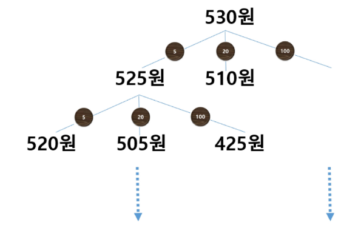

### 동전 교환 문제를 풀 때, <mark>Greedy 알고리즘에서의 예외</mark>
- 만약 100원을 거슬러 주어야 하는 경우, 총 몇 개의 동전이 필요한가?
- Greedy로 접근 -> 액수가 큰 동전을 먼저 선택하면 4개이다. (70원 하나, 10원 3개)
- 정답 -> 만약 50원 동전만 사용하여 정답은 2개

### Greedy가 성립하는 경우 vs 성립하지 않는 경우
- 10, 50, 100, 500 처럼 모든 동전이 배수 관계인 경우는 적용 가능
- 10, 50, 70 처럼 모든 동전이 배수 관계가 아닌 경우는 적용 불가


- 그리디 알고리즘은 쉬워 보이나, 예외 없이 모든 경우가 맞는 규칙인지 아닌지 증명이 어렵다.

### 화장실 문제
- 기숙사에는 하나의 화장실만 존재
- A ~ D 학생들 각자의 평균 화장실 사용 시간이 다음과 같다.
    - A: 15분
    - B: 30분
    - C: 50분
    - D: 10분

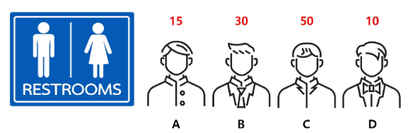

- 만약 A가 먼저 화장실을 이용한다면, 나머지 인원 B, C, D는 대기를 해야 한다.
- B, C, D 각자의 대기시간들의 총 합은 15분 * 3 = 45분이다.

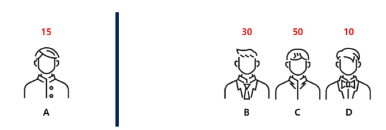

- 이후, B가 화장실을 이용하는 경우 나머지 인원 C, D는 대기를 해야 한다.
- 각자의 대기시간의 누적 합은 45분 + (30분 * 2) = 105분이다.

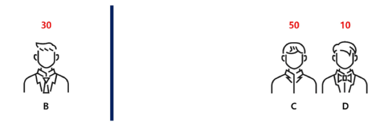

- 이후, C가 화장실을 이용하는 경우 나머지 D는 대기를 해야 한다.
- 각자의 대기시간의 누적 합은 105분 + (50분 * 1) = 155분이다.

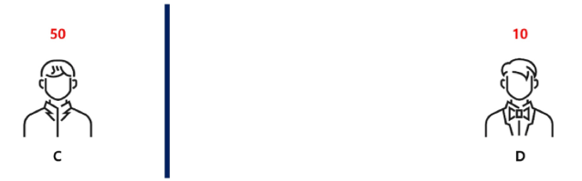

- 마지막으로 D가 화장실을 이용한다.
- 이 때는 아무도 기다리지 않기에, 총 대기시간의 누적 합은 155분이다.

### [도전] 화장실 문제를 Greedy로 풀어보자
- 어떤 기준으로 접근해야 대기시간의 누적 합이 최소가 될지 고민해보고 구현하자

```py
students = [10, 15, 30, 50]
waste_time = 0

for i in range(len(students)):
    waste_time += (len(students) - 1 - i) * students[i]
    
print(waste_time)
```

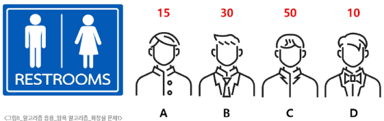

## knapsack 문제

### 0-1 Knapsack (물건을 넣거나 뺄 수만 있는 문제)
- 도둑이 보물들이 있는 창고에 침입하였다. 도둑은 최대 30kg까지 짐을 담아갈 수 있다.
- 물건의 개수(N) 그리고 물건 별 무게(W)와 가격(P)이 주어질 때, 어떤 물건을 담아야 도둑이 최대 이득을 볼 수 있을지 구하시오.

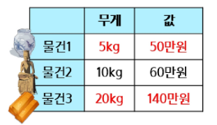

### [도전] 이 문제를 Greedy로 접근해보자.
- 어떤 기준으로 선택하는 것이 좋을까?
    - 물건은 하나씩만 존재
    - 최대 30kg까지 짐을 담고자 할 때, 어떤 물건을 담아야 최대로 수익을 낼 수 있는지 찾는 문제

### Kg 당 가치가 가장 높은 것을 먼저 담으면 안된다.
- 0-1 Knapsack을 Greedy로 접근하면 안되는 예외 케이스가 존재
- **0-1 Knapsack 문제는 Greedy로 해결할 수 없다. 완전탐색 혹은 DP로 접근해야 한다.**

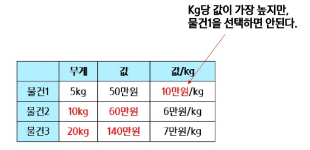

### Fractional Knapsack 문제
- 0-1 Knapsack과 달리, 물건을 원하는 만큼 자를 수 있는 Knapsack 문제


### Fractional Knapsack 문제 해결 방법
- Greedy가 성립
- **Kg 당 가격이 가장 높은 물건을 최대한 담으면 된다.**
- 최대 수익
    - 가장 kg 당 금액이 높은 물건1, 전체 사용(50만원)
    <br>\+ 두 번째로 kg 당 금액이 높은 물건3, 전체 사용(140만원)
    <br>\+ 세 번째로 kg 당 금액이 높은 물건2, 나머지 모두 사용(5kg만 사용, 30만원)
    <br>= 50 + 140 + 30 = 220만원

### Fractional Knapsack 소스토드

```py
n = 3
target = 30     # Knapsack KG
things = [(5, 50), (10, 60), (20, 140)]     #(Kg, Price)

# 정렬: (price / kg)
total = 0
for kg, price in things:
    per_price = price / kg

    # 만약 가방에 남은 용량이 얼마되지 않는다면,
    # 물건을 잘라 가방에 넣고 끝낸다.
    if target < kg:
        total += target * per_price
        break

    total += price
    target -= kg

print(int(total))
```

## 활동 선택 문제

### 회의실 배정
- 회의실이 하나인 회사가 있다. 여러 팀들이 원하는 회의실 예약 시간이 주어질 때, 가능한 많은 회의가 열리기 위해서는 회의들을 어떻게 배정해야 할까?
    - 희망 회의 개수, 시작 시간, 종료 시간을 입력받는다.

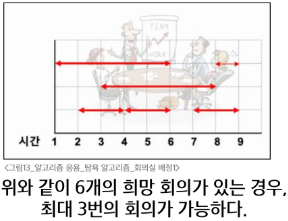

### [도전] 무엇을 기준으로 회의를 선택해야 최대한 많은 횟수의 회의가 될지 고민해보자.
- 이 문제는 Greedy로 가능한 문제이다.

### 문제 해결 방법
- 회의 종료시간이 가장 빠른 회의를 먼저 선택
    - (2, 4), (4, 6), (7, 9) 또는 (8, 9) 회의를 선택하면 3개의 회의를 배정할 수 있다.

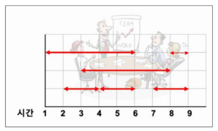

### 다른 예시
- 총 10개의 회의 요청이 존재

`(5, 9), (6, 10), (8, 11), (1, 4), (3, 5), (1, 6), (5, 7), (3, 8), (2, 13), (12, 14)`

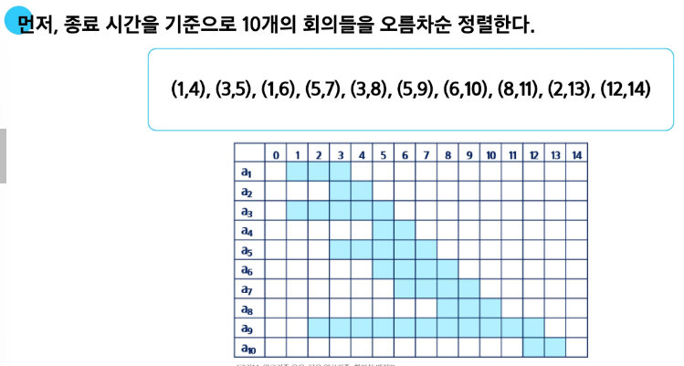

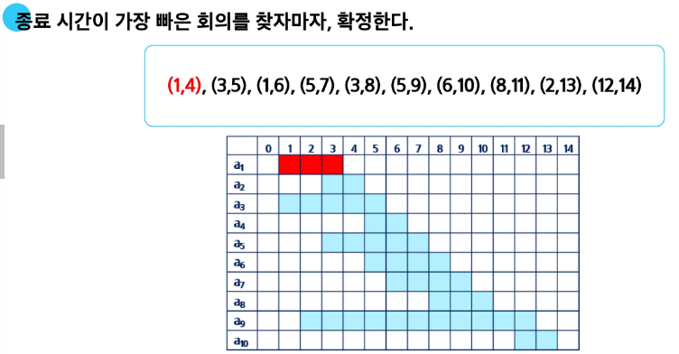

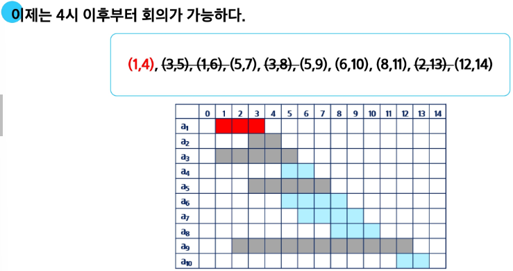

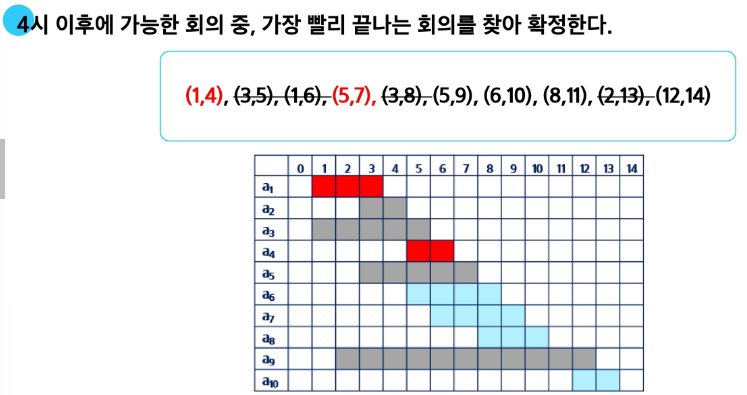

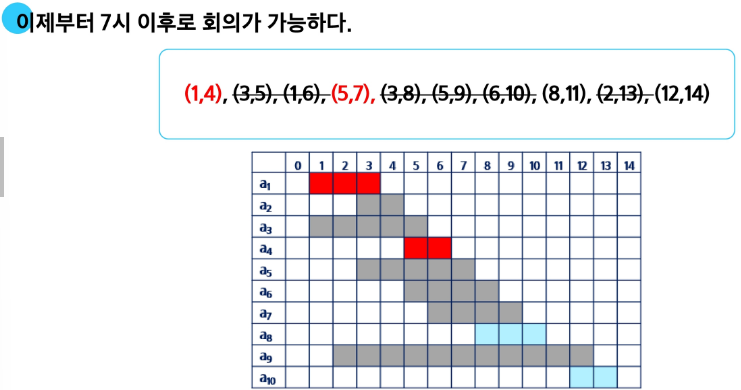

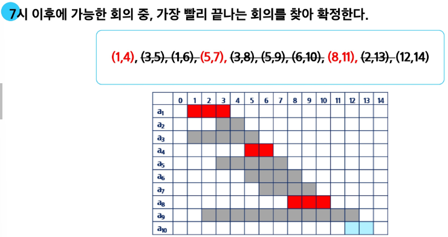

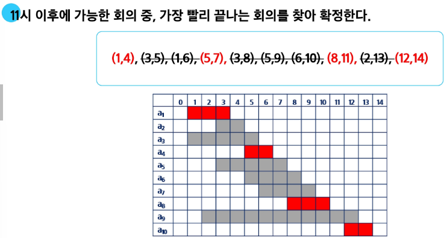

### 회의실 문제 전략
1. 끝나는 시간을 기준으로 오름차순 정렬
2. 빠르게 끝나는 회의를 선택하여 확정
3. 이후로 가능한 회의 중, 빠르게 끝나는 회의를 선택하여 확정

### 활동 선택 문제(Activit-selection problem)
- 종료 시간이 빠른 순서로 활동들을 정렬
- 첫 번째 활동(A1)을 선택
- 선택한 활동(A1)의 종료시간보다 빠른 시작 시간을 가지는 활동을 모두 제거
- 남은 활동들에 대해 앞의 과정을 반복

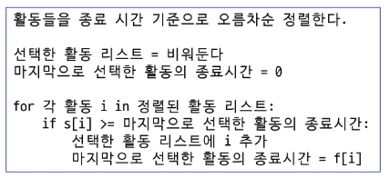

## 연습 문제

### 부분집합의 합 문제 구현하기
- 아래의 10개의 정수 집합에 대한 모든 부분집합 중 원소의 합이 0이 되는 부분집합을 모두 출력하시오.
    - {-1, 3, -9, 6, 7, -6, 1, 5, 4, -2}
- 출력 결과
    - {6, -6}
    {-1, 3, -2}
    {-9, 7, 4, -2}
    ...

```py
N = 10
numbers = [-1, 3, -9, 6, 7, -6, 1, 5, 4, -2]

# 부분집합을 구하는 재귀함수
# idx 번 인덱스에 있는 원소를 부분집합에 포함 or 포함 x
def subset(idx, arr):
    # 종료
    # N번 선택을 모두 완료
    # 그 중 합이 0인 부분집합만 골라 출력
    if idx == N:
        if sum(arr) == 0:
            print(arr)
        return

    # 재귀 호출
    # 2가지로 나뉨
    # idx 번 원소를 부분집합에 포함하고 다음 단계 이동
    # 포함하지 않고 다음 단계 이동
    subset(idx + 1, arr + [numbers[idx]])
    subset(idx + 1, arr)


subset(0, [])
```

### 실습
- Greedy
    - 5201. 컨테이너 운반
    - 5202. 화물도크
    - 5203. 베이비진 게임
- 부분집합
    - 4837. 부분집합의 합
- 추가 연습
    - 4012. [모의 SW 역량테스트] 요리사
