# 분할 정복

## 분할 정복 기법

### 분할 정복 기법의 개념
- 문제를 작은 하위 문제로 나누고(분할) 각각을 해결(정복)한 뒤, 그 결과를 결합(통합)하여 원래 문제를 해결하는 알고리즘 기법

### 분할 정복 기법의 유래
- 1805년 12월 2일 아우스터리츠 전투에서 나폴레옹이 사용한 전략
- 전력이 우세한 연합군을 공격하기 위해 나폴레옹은 연합군의 중앙부로 쳐들어가 연합군을 둘로 나눔
- 둘로 나뉜 연합군을 한 부분씩 격파함

### 분할 정복 기법의 설계 전략
- 분할(Divide): 해결할 문제를 여러 개의 작은 부분으로 나눔
- 정복(Conquer): 나눈 작은 문제를 각각 해결
- 통합(Combone): (필요하다면) 해결된 해답을 모음

### 분할 정복 기법의 구조
- Top-down approach 예시

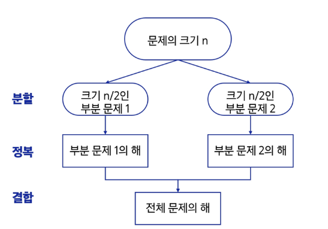

### 분할 정복 기법의 예시
- 가짜 동전 찾기

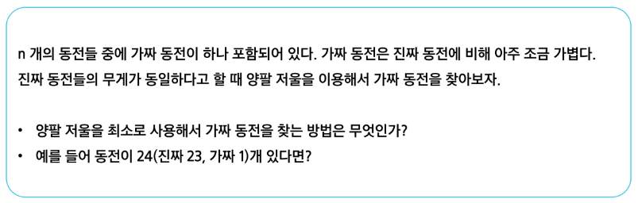

### 분할 정복 기법의 예시 - 거듭 제곱
- 분할 정복 기법을 이해하기 위해, 자연수 C의 n 제곱 값을 구하는 함수를 구현해보자.
- 반복(Iterative) 알고리즘: O(n)

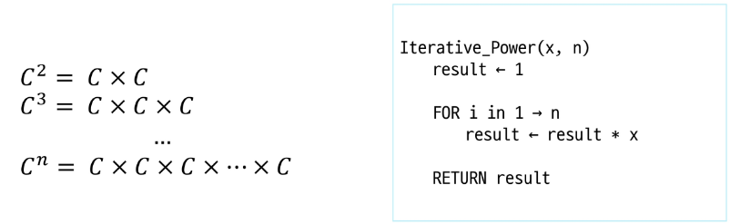

- 분할 정복 기반의 알고리즘: O(log n)

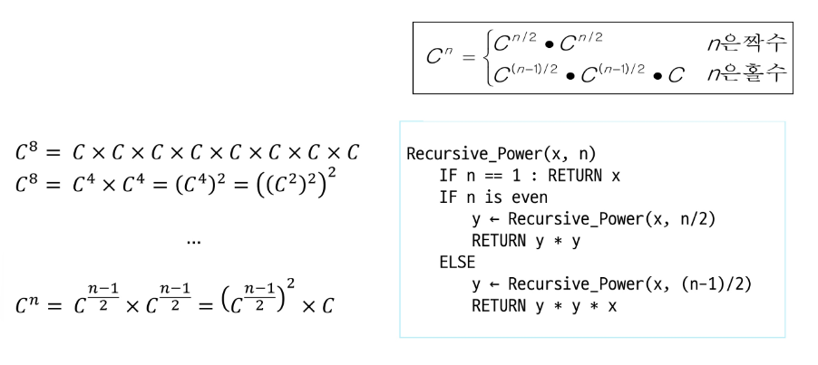

## 병합 정렬

### 병합 정렬(Merge Sort)의 개념
- 여러 개의 정렬된 자료의 집합을 병합하여 한 개의 정렬된 집합으로 만드는 방식

### 병합 정렬 과정
- 자료를 최소 단위의 문제까지 나눈 후에 차례대로 정렬하여 최종 결과를 얻어냄
- top-down 방식

### 시간 복잡도
- O(n log n)

### 병합 정렬 과정 예시
- {69, 10, 30, 2, 16, 8, 31, 22}를 병합 정렬하는 과정

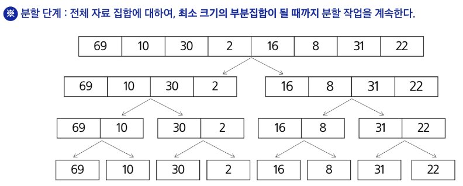

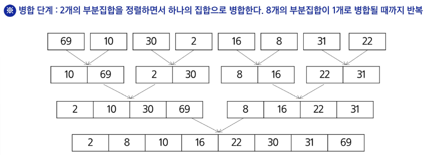

### 병합 정렬 알고리즘
- 분할 과정

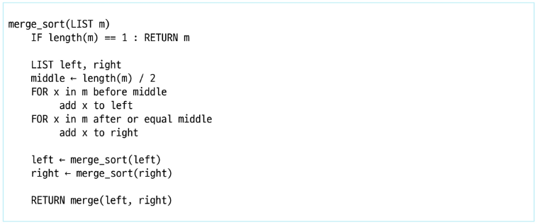

```py
# 병합 정렬 함수
# 정렬할 범위를 지정(시작, 종료)

# s 에서 e 까지 정렬하는 함수
def merge_sort(s, e):
    # 1. 종료 조건
    # 더 이상 분할이 불가능할 때까지
    if s == e - 1:
        # 길이가 1이면 분할 불가능
        return s, e

    # 2. 재귀 호출
    # 두 부분으로 나누고 합칠 때 정렬
    # 두 부분으로 나누는 기준 가운데 위치
    mid = (s + e) // 2
    left_s, left_e = merge_sort(s, mid)
    right_s, right_e = merge_sort(mid, e)

    # 합치면 된다.
    merge(left_s, left_e, right_s, right_e)

    # 합치고 나면 정렬 완료
    return s, e
```

- 병합 과정

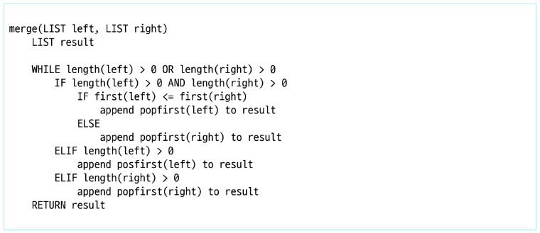

```py
# 주어진 범위(왼, 오)의 리스트를 합치는 함수
def merge(left_s, left_e, right_s, right_e):
    # 왼쪽에서 가장 작은 원소 인덱스
    l = left_s
    # 오른쪽에서 가장 작은 원소 인덱스
    r = right_s

    # 결과 담을 배열 길이
    N = right_e - left_s

    result = [0] * N

    # result 의 위치를 가리키는 인덱스
    idx = 0

    # 정렬(합치기) 시작
    # 왼쪽에서 가장 작은 값, 오른쪽에서 가장 작은 값
    # 둘 중 작은 것 선택해서 result 의 idx 위치에 놓고 idx 1 증가


    # 1. 비교할 왼쪽, 오른쪽이 둘 다 남아있는 경우
    while l < left_e and r < right_e:
        if arr[l] < arr[r]:
            result[idx] = arr[l]
            l += 1
        else:
            result[idx] = arr[r]
            r += 1
        idx += 1

    # 2. 한 쪽만 남아있을 때

    # 2-1. 오른쪽
    while r < right_e:
        result[idx] = arr[r]
        r += 1
        idx += 1

    # 2-2. 왼쪽
    while l < left_e:
        result[idx] = arr[l]
        l += 1
        idx += 1

    # 정렬이 완료된 범위 (left_s ~ right_e)를 원본에 반영
    for i in range(N):
        arr[left_s + i] = result[i]
```

## 퀵 정렬

### 퀵 정렬(Quick Sort)의 개념
- 기준값을 중심으로 주어진 배열을 두 개로 분할하고, 각각을 정렬하여 전체 배열을 정렬하는 방식

### 병합 정렬과 퀵 정렬의 차이

||병합 정렬|퀵 정렬
:-:|:-:|:-:
분할 기준|단순히 배열을 반으로 나눔|기준 아이템(pivot item)을 중심으로 기준보다 작은 것을 왼편, 큰 것을 오른편에 위치시킴
병합 처리|정렬된 부분을 다시 병합하는 과정이 필요함|별도의 병합 과정 불필요

### 시간 복잡도
- 평균 시간복잡도 O(n log n)
- Partitioning 이라는 과정을 반복하면서, 빠른 속도로 정렬이 되는 알고리즘

### Partitioning
1. 작업 영역을 정한다.


2. 작업 영역 중 가장 왼쪽에 있는 수를 Pivot 이라고 하자. (Pivot을 "기준"으로 해석)
    - Pivot은 중간값, 우측 끝 값으로 설정해도 상관 없음


3. Pivot을 기준으로 왼쪽에는 Pivot 보다 작은 수를, 오른쪽에는 Pivot 보다 큰 수를 배치 (정렬 안 됨)


- 파티셔닝이 끝나고 Pivot의 위치는 확정(Fix)된다.
- 즉, 정렬이 다 되었을 때에도 Pivot의 위치는 지금 위치 그대로 배정

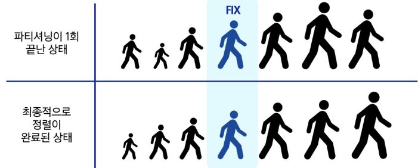

- 한 번의 파티셔닝 이후, 왼쪽과 오른쪽 부분 배열에 대해 재귀적으로 파티셔닝을 반복하여 정렬 진행


- 작업 영역에 혼자라면 양쪽에 배치할 값이 없다.


- 리스트에서 파티셔닝 하기
    - 앞서 설명한 내용을 리스트로 표현하면 다음과 같다.

    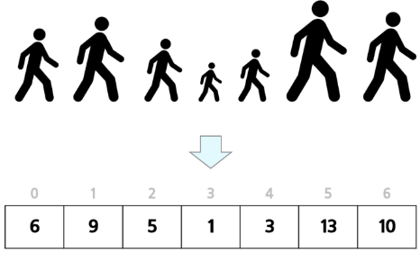

    - 작업 영역을 0 ~ 6으로 정했을 때 예시

    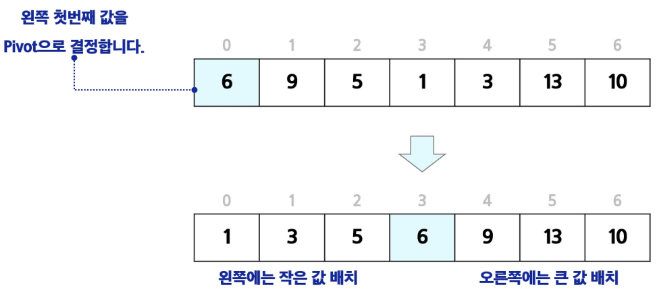

- 알고리즘

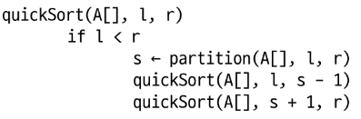

### Hoare-Partition
- 알고리즘

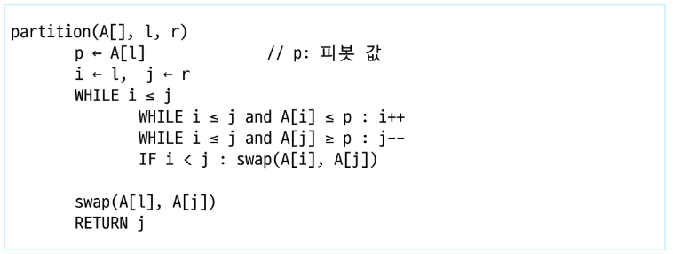

- 아이디어

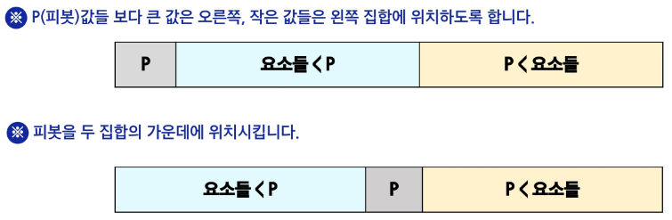

- 왼쪽 끝/오른쪽 끝/가운데 세 값 중에 중간 값을 선택하는 경우

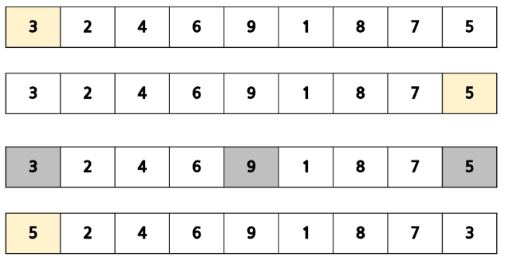

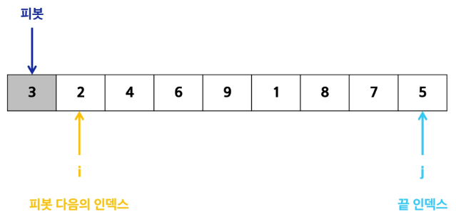

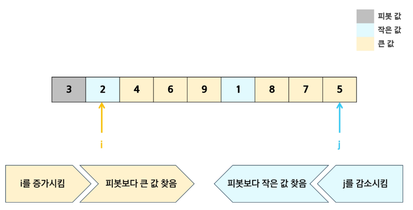

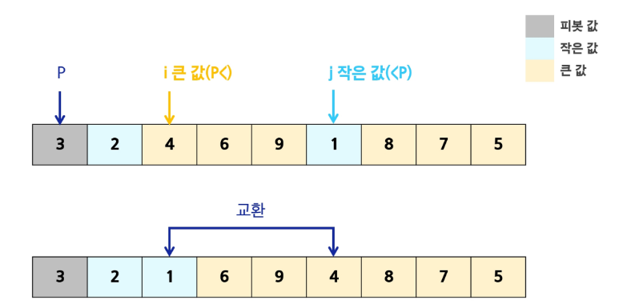

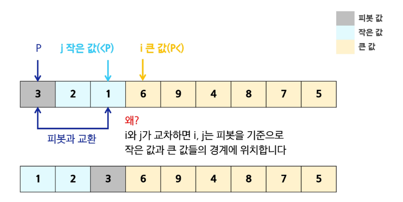

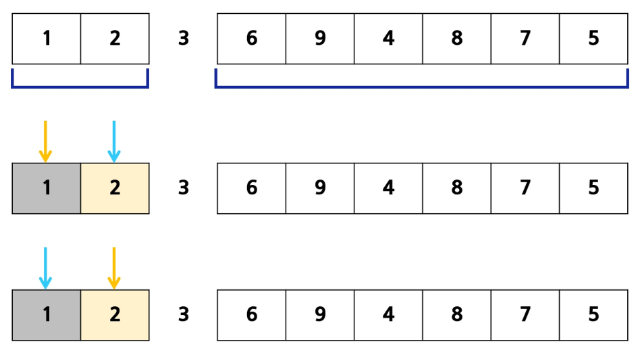

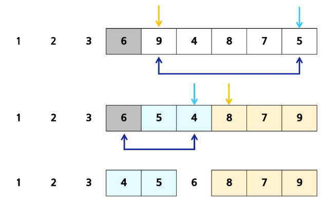

### Lomuto Partition
- 알고리즘

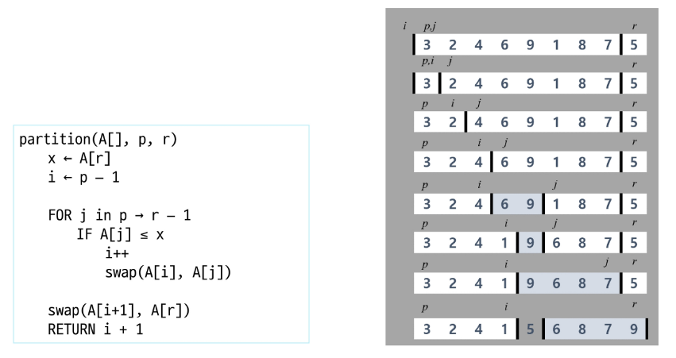

### 연습문제

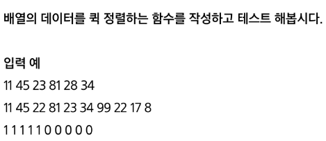

```py
# A: 정렬 대상 배열
# l, r: 정렬 범위 시작/종료 인덱스
def quicksort(A, l, r):
    if l < r:
        # 기준 원소를 정해서 기준 원소의 위치가 확정
        p = partition(A, l, r)

        # 기준 원소의 왼쪽 부분 정렬
        quicksort(A, l, p - 1)
        # 기준 원소의 오른쪽 부분 정렬
        quicksort(A, p + 1, r)


def partition(A, l, r):
    # A의 가장 왼쪽에 있는 원소가 기준
    p = A[l]

    # p보다 작은 원소 왼쪽
    # p보다 큰 원소 오른쪽

    # 앞에서부터 p보다 큰 원소 찾고
    # 뒤에서부터 p보다 작은 원소 찾으면
    # 이 두 원소는 위치가 잘못되어 있으니 서로 교환
    # 앞에서부터 찾기 위한 인덱스
    i = l
    # 뒤에서부터 찾기 위한 인덱스
    j = r

    # i랑 j가 교차하기 전까지
    while i <= j:
        # i위치는 왼쪽에서부터 +1 씩 증가
        # i번 인덱스에 있는 원소가 p보다 작으면
        # 자기자리가 맞음, + 1 해가며 다음원소 탐색
        while i <= j and p >= A[i]:
            i += 1

        # j위치는 오른쪽에서부터 -1 씩 감소
        # j번 인덱스에 있는 원소가 p보다 크면
        # 자기자리가 맞음, -1 해가면서 다음원소 탐색
        while i <= j and A[j] >= p:
            j -= 1

        # 두 개의 반복문이 끝나고 나서
        # 여전히 i가 j보다 작으면
        # p보다 큰 원소가 i번에 있다.
        # p보다 작은 원소가 j번에 있다.
        # 그럼 바꿔주면 된다.
        if i < j:
            A[i], A[j] = A[j], A[i]

    # i랑 j가 교차
    # 왼쪽에는 기준보다 작은 원소들이 모여있고
    # 오른쪽에는 기준보다 큰 원소들이 모여있음
    # 기준 원소를 그 사이에 끼워넣으면 위치 확정
    A[l], A[j] = A[j], A[l]

    # i와 j가 교차했으므로 j가 i보다 작은 상황
    # 기준 원소를 그 중에 작은 것과 바꿔야
    # 작은 원소들이 왼쪽, 큰 원소들이 오른쪽이라는 규칙을 지킴

    # 기준 원소의 위치는 j
    return j

li = [11, 45, 23, 81, 28, 34]
quicksort(li, 0, 5)
print(li)
```

## 이진 검색

### 병뚜껑 속의 숫자 게임

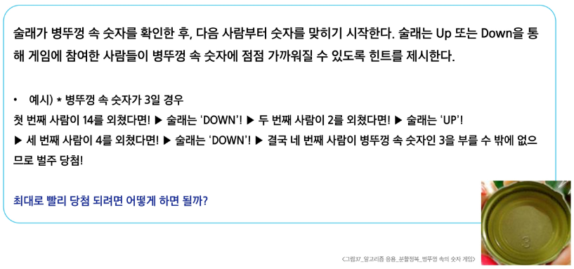

### 이진 검색(Binary Search)의 개념
- 자료의 가운데에 있는 항목의 키 값과 비교하여 다음 검색의 위치를 결정하고 검색을 계속 진행하는 방법
- 목적 키를 찾을 때까지 이진 검색을 순환적으로 반복 수행함으로써 검색 범위를 반으로 줄여가면서 보다 빠르게 검색을 수행

### 이진 검색의 과정
1. 자료의 중앙에 있는 원소를 선택
2. 중앙 원소의 값과 찾고자 하는 목표 값을 비교
3. 목표 값이 중앙 원소의 값보다 작으면 자료의 왼쪽 반에 대해 새로 검색을 수행하고, 크다면 자료의 오른쪽 반에 대해 새로 검색을 수행
4. 찾고자 하는 값을 찾을 때까지 1 ~ 3의 과정 반복

- 이진 검색을 하기 위해서는 자료가 정렬된 상태여야 함
- 예) 이진 검색으로 7을 찾는 경우

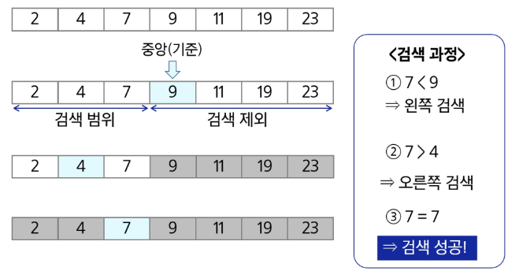

- 예) 이진 검색으로 20을 찾는 경우
- 20 > 9

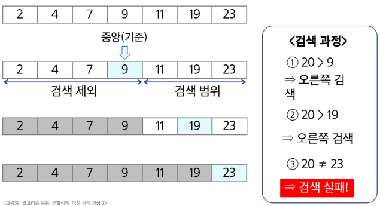

### 이진 검색 알고리즘: 반복 구조

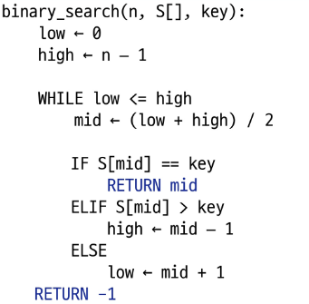

### 이진 검색 알고리즘: 재귀 구조

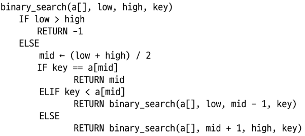

### 분할 정복 알고리즘 정리
- 병합 정렬
    - 외부 정렬(External Sort)의 기본이 되는 정렬 알고리즘
    - 멀티코어(Multi-Core) CPU 나 다수의 프로세서에서 정렬 알고리즘을 병렬화하기 위해 병합 정렬 알고리즘이 활용됨
- 퀵 정렬
    - 매우 큰 입력 데이터에 대해 좋은 성능을 보이는 알고리즘
- 이진 검색
    - 정렬된 데이터를 기준으로 특정 값이나 범위를 검색하는데 사용
    - [이진 검색을 활용한 심화 학습 키워드] Lower Bound, Upper Bound
        - 정렬된 배열에서 특정 값 이상(이하)가 처음으로 나타나는 위치를 찾는 알고리즘
        - 특정 데이터의 범위 검색 등에서 활용

### 실습
- 분할정복
    - 5204. 병합 정렬
    - 5207. 이진 탐색
- 퀵 정렬
    - 5205. 퀵 정렬
- 추가 연습
    - 5688. 세제곱근을 찾아라
    - 14229. 백만 개의 정수 정렬 (user problem)
