# 백트래킹

## 백트래킹 응용

### 문제 제시: N-Queen 문제
- n * n 서양 장기판에서 배치한 Queen들이 서로 위협하지 않도록 n개의 Queen을 배치하는 문제
    - 어떤 두 Queen도 서로를 위협하지 않아야 한다.
    - Queen을 배치한 n개의 위치는?

### 백트래킹(Backtracking) 개념
- 여러 가지 선택지(옵션)가 존재하는 상황에서 한 가지를 선택
- 선택이 이뤄지면 새로운 선택지들의 집합이 생성
- 이런 선택을 반복하면서 최종 상태에 도달
    - 올바른 선택을 계속하면 목표 상태(goal state)에 도달

### 당첨 리프 노드 찾기
- 루트에서 갈 수 있는 노드를 선택
- 꽝 노드까지 도달하면 최근의 선택으로 되돌아와서 다시 시작
- 더 이상의 선택지가 없다면 이전의 선택지로 돌아가서 다른 선택
- 루트까지 돌아갔을 경우 더 이상 선택지가 없다면 찾는 답이 없음

### 백트래킹과 깊이 우선 탐색과의 차이
- 어떤 노드에서 출발하는 경로가 해결책으로 이어질 것 같지 않으면 더 이상 그 경로를 따라가지 않음으로써 시도의 횟수를 줄임
    - 이를 **Pruning**(가지치기)라고 한다.
- 깊이 우선 탐색이 모든 경로를 추적하는데 비해 백트래킹은 **불필요한 경로를 조기에 차단**
- 깊이 우선 탐색을 가하기에는 경우의 수가 너무나 많은 경우, 즉, **N!** 가지의 경우의 수를 가진 문제에 대해 깊이 우선 탐색을 가하면 당연히 처리 불가능한 문제가 됨
- 백트래킹 알고리즘을 적용하면 일반적으로 경우의 수가 줄어들지만, 이 역시 **최악의 경우**에는 여전히 지수 함수 시간(Exponential Time)을 요하므로 **처리 불가능함**

### 8-Queens 문제
- 퀸 8개를 크기의 체스판 안에 서로를 공격할 수 없도록 배치하는 모든 경우를 구하는 문제
- 후보 해의 수: 64_C_8 = 64!  / 8! * (64 - 8)! = 4,426,165,368
- 실제 해의 수: 이 중에서 실제 해는 92개 뿐
- 즉, 44억 개가 넘는 후보 해의 수 속에서 92개를 최대한 효율적으로 찾아내는 것이 관건

### 4-Queens 문제로 축소해서 생각해보기
- 같은 행에 위치할 수 없음
- 모든 경우의 수: 4 * 4 * 4 * 4 = 256

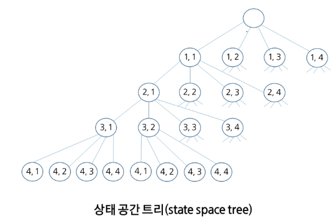

### 백트래킹 개념
- 루트 노드에서 리프(leaf) 노드까지의 경로는 해답후보(candidate solution)가 되는데, 깊이 우선 검색을 하여 그 해답후보 중에서 해답을 찾을 수 있음
- 그러나 이 방법을 사용하면 해답이 될 가능성이 전혀 없는 노드의 후손 노드(descendant)들도 모두 검색해야 하므로 비효율적

### 백트래킹 기법
- 어떤 노드의 유망성을 점검한 후에 유망(promising)하지 않다고 결정되면 그 노드의 부모로 되돌아가(backtracking) 다음 자식 노드로 감
- 어떤 노드를 방문하였을 때 그 노드를 포함한 경로가 해답이 될 수 없으면 그 노드는 유망하지 않다고 하며, 반대로 해답의 가능성이 있으면 유망하다고 함
- 가지치기(pruning): 유망하지 않는 노드가 포함되는 경로는 더 이상 고려하지 않음

### 백트래킹을 이용한 알고리즘의 절차
1. 상태 공간 트리의 깊이 우선 검색을 실시
2. 각 노드가 유망한지를 점검
3. 만일 그 노드가 유망하지 않으면, 그 노드의 부모 노드로 돌아가서 검색을 계속함

### 일반 백트래킹 알고리즘

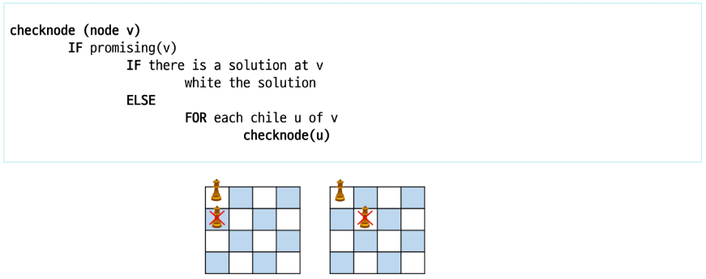

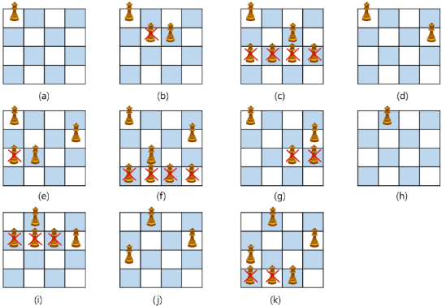

### 상태 공간 트리

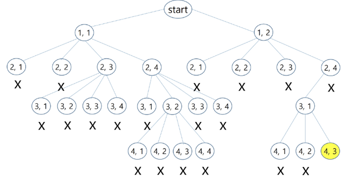

### 깊이 우선 검색 vs 백트래킹
- 순수한 깊이 우선 검색 = 155 노드
- 백트래킹 = 27 노드

### 상태공간트리를 구축하여 문제를 해결

```c
bool backtrack(선택 집합, 선택한 수, 모든 선택수)
{
    if (선택한 수 == 모든 선택 수)  // 더 이상 탐색할 노드가 없다.
    {
        찾는 솔루션인지 체크;
        return 결과;
    }
    현재 선택한 상태집합에 포함되지 않는 후보 선택들(노드) 생성

    모든 후보 선택들에 대해
    {
        선택 집합에 하나의 후보선택을 추가
        선택한 수 = 선택한 수 + 1
        결과 = backtrack 호출(선택집합, 선택한 수, 모든 선택수)

        if (결과 == 성공)
            return 성공; // 성공한 경우 상위로 전달
    }
    return 실패;
}
```

## 연습문제

### {1, 2, 3, 4, 5, 6, 7, 8, 9, 10}의 powerset 중 원소의 합이 10인 부분집합을 모두 출력하라.

```py
pws = []

def powerset(s, cnt):

    if sum(s) == 10:
        print(*s)
        return
    
    for i in range(cnt, 11):
        s.append(i)
        powerset(s, cnt + 1)
        s.pop()

powerset(pws, 1)
```

# 트리

## 트리 개요

### 문제 제시: 계산기
- 수식 2 + 3 * 4 를 다음과 같은 그래프로 표현하고 그래프를 순회하여 수식을 계산하는 문제

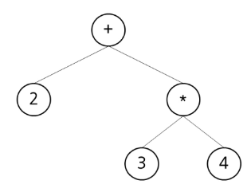

### 트리(Tree)
- 트리는 싸이클이 없는 무향 연결 그래프
    - 두 노드(or 정점) 사이에는 유일한 경로가 존재
    - 각 노드는 최대 하나의 부모 노드가 존재 가능
    - 각 노드는 자식 노드가 없거나 하나 이상이 존재 가능
- 비선형 구조
    - 원소들 간에 1:n 관계를 가지는 자료구조
    - 원소들 간에 계층관계를 가지는 계층형 자료구조

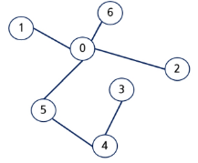

### 트리의 정의
- 한 개 이상의 노드로 이루어진 유한 집합이며 다음 조건을 만족함
    - 노드 중 최상위 노드를 루트(root)라고 한다
    - 나머지 노드들은 n(>=0)개의 분리 집합 T1, ..., TN으로 분리 가능
- 이들 T1, ..., TN은 각각 하나의 트리가 되며(재귀적 정의) 루트의 부 트리(subtree)라 함

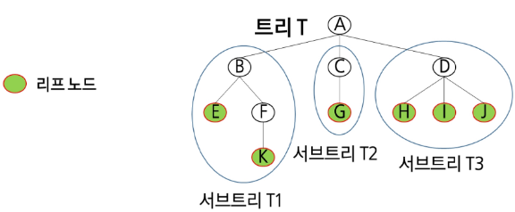

### 트리 용어
- 노드(node): 트리의 원소이고 정점(vertex)이라고도 함
    - 트리 T의 노드 - A, B, C, D, E, F, G, H, I, J, K
- 간선(edge): 노드를 연결하는 선
    - 부모 노드와 자식 노드를 연결
- 루트 노드(root node): 트리의 시작 노드
    - 트리 T의 루트 노드는 A
- 리프 노드(leaf node): 자식 노드가 없는 노드
    - E, K, G, H, I, J는 리프 노드
- 형제 노드(sibling node): 같은 부모 노드의 자식 노드들
    - B, C, D는 형제 노드
- 조상 노드: 간선을 따라 루트 노드까지 이르는 경로에 있는 모든 노드들
    - K의 조상 노드는 F, B, A
- 서브 트리(subtree): 부모 노드와 연결된 간선을 끊었을 때 생성되는 트리
- 자손 노드: 서브 트리에 있는 하위 레벨의 노드들
    - B의 자손 노드는 E, F, K

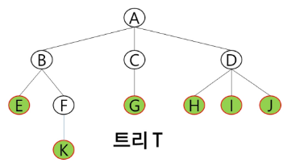

- 노드의 차수: 노드에 연결된 자식 노드의 수
    - B의 차수 = 2, C의 차수 = 1
- 트리의 차수: 트리에 있는 노드의 차수 중에서 가장 큰 값
    - 트리 T의 차수 = 3
- 단말 노드(리프 노드): 차수가 0인 노드. 자식 노드가 없는 노드
- 노드의 높이: 루트에서 노드에 이르는 간선의 수. 노드의 레벨
    - B의 높이 = 1, F의 높이 = 2
- 트리의 높이: 트리에 있는 노드의 높이 중에서 가장 큰 값. 최대 레벨
    - 트리 T의 높이 = 3

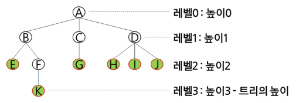

## 이진 트리(Binary Tree)
- 모든 노드들이 최대 2개의 서브트리를 갖는 특별한 형태의 트리
- 각 노드가 자식 노드를 최대한 2개까지만 가질 수 있는 트리
    - 왼쪽 자식 노드(left child node)
    - 오른쪽 자식 노드(right child node)
- 이진 트리의 예

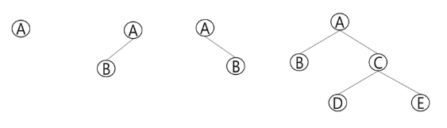

### 이진 트리의 특성
- 레벨 i에서의 노드의 최대 개수는 2 ** i 개
- 높이가 h인 이진 트리가 가질 수 있는 노드의 최소 개수는 (h+1)개가 되며, 최대 개수는 (2 ** (h+1) - 1)개

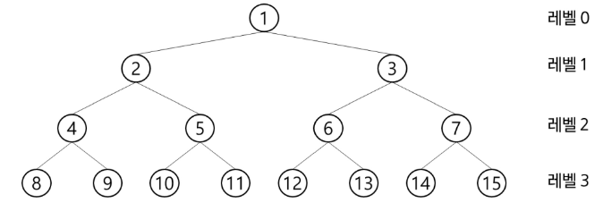

### 포화 이진 트리(Full Binary Tree)
- 모든 레벨에 노드가 포화상태로 차 있는 이진 트리
- 높이가 h일 때, 최대의 노드의 개수인 (2 ** (h+1) - 1)의 노드를 가진 이진 트리
    - 높이 3일 때 2 ** (3+1) - 1 = 15개의 노드
- 루트를 1번으로 하여 (2 ** (h+1) - 1)까지 정해진 위치에 대한 노드 번호를 가짐

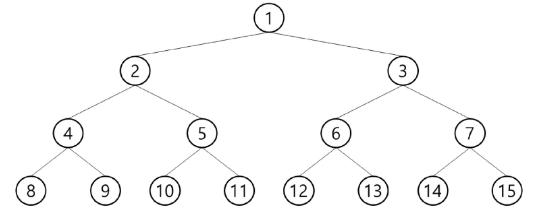

### 완전 이진 트리(Complete Binary Tree)
- 높이가 h이고 노드 수가 n개일 때(단, 2 ** h <= n <= 2 ** (h+1) - 1), 포화 이진 트리의 노드 번호 1번부터 n번까지 빈 자리가 없는 이진 트리
    - 예) 노드가 10개인 완전 이진 트리

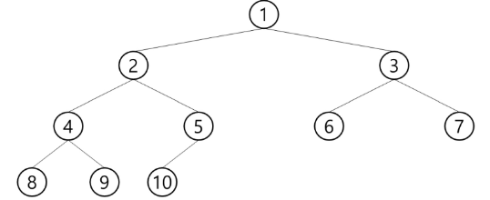

### 편향 이진 트리(Skewed Binary Tree)
- 높이가 h에 대한 최소 개수의 노드를 가지면서 한쪽 방향의 자식 노드만을 가진 이진 트리
    - 왼쪽 편향 이진 트리
    - 오른쪽 편향 이진 트리

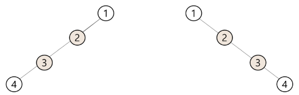

### 순회(traversal)
- 트리의 각 노드를 중복되지 않게 전부 방문(visit)하는 것
    - 트리는 비선형구조이기 때문에 선형구조에서와 같이 선후 연결 관계를 알 수 없다.

### 3가지의 기본적인 순회 방법
- 전위순회(preorder traversal): VLR
    - 자손 노드보다 현재 노드를 먼저 방문
- 중위순회(inorder traversal): LVR
    - 왼쪽 자손 노드, 현재 노드, 오른쪽 자손 노드 순으로 방문
- 후위순회(postorder traversal): LRV
    - 현재 노드보다 자손 노드를 먼저 방문

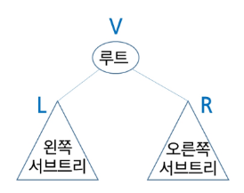

### 전위 순회(preorder traversal)
- 수행 방법
    1. 현재 노드 n을 방문하여 처리: V
    2. 현재 노드 n의 왼쪽 서브트리를 순회: L
    3. 현재 노드 n의 오른쪽 서브트리를 순회: R
- 전위 순회 알고리즘

```java
preorder_traverse(TREE T)
    IF T is not null
        visit(T)
        preorder_traverse(T.left)
        preorder_traverse(T.right)
```

### 전위 순회의 예

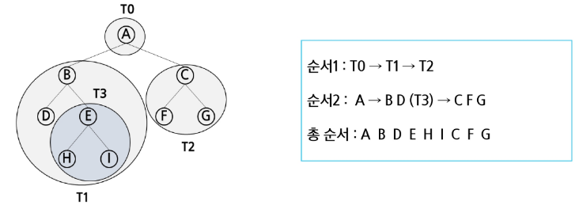

### 중위 순회(inorder traversal)
- 수행 방법
    1. 현재 노드 n의 왼쪽 서브트리를 순회: L
    2. 현재 노드 n을 방문하여 처리: V
    3. 현재 노드 n의 오른쪽 서브트리를 순회: R
- 중위 순회 알고리즘

```java
inorder_traverse(TREE T)
    IF T is not null
        inorder_traverse(T.left)
        visit(T)
        inorder_traverse(T.right)
```

### 중위 순회의 예

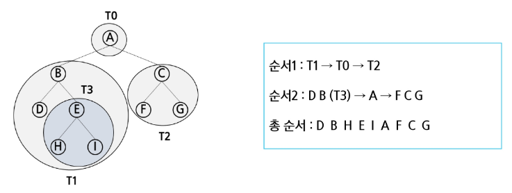

### 후위 순회(postorder traversal)
- 수행 방법
    1. 현재 노드 n의 왼쪽 서브트리를 순회: L
    2. 현재 노드 n의 오른쪽 서브트리를 순회: R
    3. 현재 노드 n을 방문하여 처리: V
- 후위 순회 알고리즘

```java
postorder_traverse(TREE T)
    IF T is not null
        postorder_traverse(T.left)
        postorder_traverse(T.right)
        visit(T)
```

### 후위 순회의 예

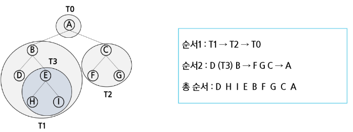

### 배열을 이용한 이진 트리의 표현
- 이진 트리에 각 노드 번호를 다음과 같이 부여
- 루트의 번호를 1로 부여하고
- 레벨 n에 있는 노드에 대하여 왼쪽부터 오른쪽으로 2 ** n 부터 2 ** (n+1) -1까지 번호를 차례로 부여

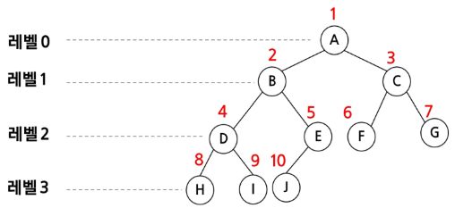

### 노드 번호의 성질
- 노드 번호가 i인 노드의 부모 노드 번호: i // 2
- 노드 번호가 i인 노드의 왼쪽 자식 노드 번호: i * 2
- 노드 번호가 i인 노드의 오른쪽 자식 노드 번호: i * 2 + 1
- 레벨 n의 노드 번호 시작 번호: 2 ** n

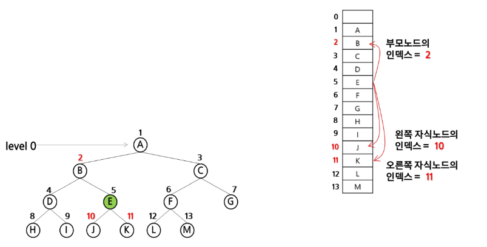

### 배열을 이용한 이진 트리의 표현
- 노드 번호를 배열의 인덱스로 사용
- 높이가 h인 이진 트리를 위한 배열의 크기는?
    - 레벨 i의 최대 노드 수: 2 ** i
    - 따라서 1 + 2 + 4 + 8 + ... + 2 ** i = 2 ** (h+1) - 1

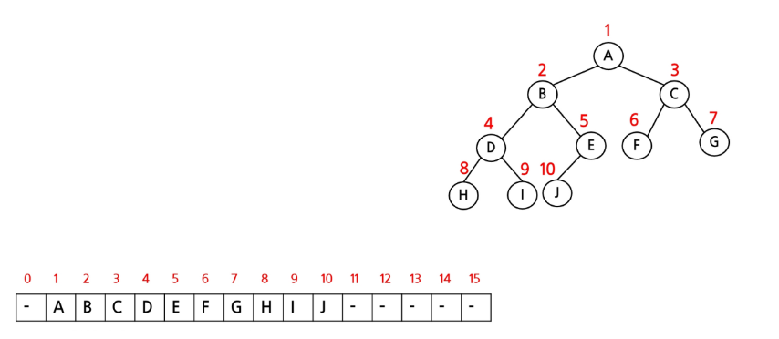

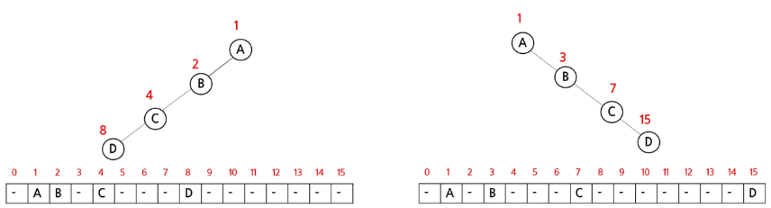

### 배열을 이용한 이진 트리의 표현의 단점
- 편향 이진 트리의 경우에 사용하지 않는 배열 원소에 대한 메모리 공간 낭비 발생
- 트리의 중간에 새로운 노드를 삽입하거나 기존의 노드를 삭제할 경우 배열의 크기 변경 어려워 비효율적
---
- 위 단점을 보완하기 위해 **연결리스트**를 이용하여 트리를 표현 가능

### 연결리스트를 이용한 이진 트리의 표현
- 이진 트리의 모든 노드는 최대 2개의 자식 노드를 가지므로 일정한 구조의 단순 연결 리스트 노드를 사용하여 구현

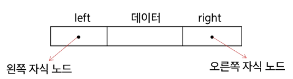

### 완전 이진 트리의 연결 리스트 표현

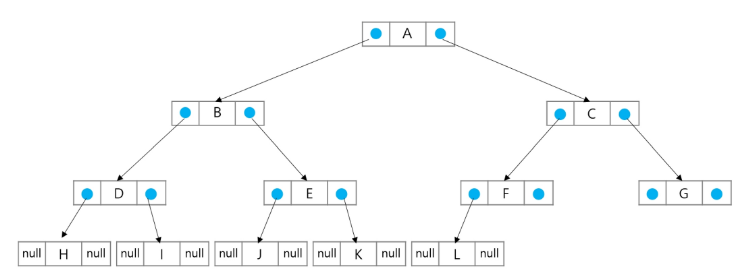

## 연습 문제

### 이진 트리를 전/중/후위 순회하고 방문한 노드의 번호를 출력
- 첫 줄에는 트리의 노드의 총 수 V가 주어진다.
- 그 다음 줄에는 V-1개 간선이 나열된다. 간선은 그것을 이루는 두 정점으로 표기된다. 간선은 항상 "부모 자식" 순서로 표기된다.
- 아래 예에서 두 번째 줄 처음 1과 2는 정점 1과 2를 잇는 간선을 의미하며 1이 부모, 2가 자식을 의미

```
12
1 2 1 3 2 4 3 5 3 6 4 7 5 8 5 9 6 10 6 11 7 12 11 13
```

```py
arr = [1, 2, 1, 3, 2, 4, 3, 5, 3, 6, 4, 7, 5, 8, 5, 9, 6, 10, 6, 11, 7, 12, 11, 13]


class TreeNode:
    def __init__(self, value):
        self.value = value
        self.left = None
        self.right = None

    # 왼쪽부터 들어간다고 가정하고 구현
    # - insert 삽입 순서는 상황마다 다르다
    def insert(self, child):
        if(not self.left):
            self.left = child
            return
        if(not self.right):
            self.right = child
            return
        return

    def preorder(self):
        if self != None:
            print(self.value, end=' ')
            if self.left:
                self.left.preorder()
            if self.right:
                self.right.preorder()

    # 중위 순회
    def inorder(self):
        if self != None:
            if self.left:
                self.left.inorder()
            print(self.value, end=' ')
            if self.right:
                self.right.inorder()

    # 후위 순회
    def postorder(self):
        if self != None:
            if self.left:
                self.left.postorder()
            if self.right:
                self.right.postorder()
            print(self.value, end=' ')

# 이진 트리 만들기
nodes = [TreeNode(i) for i in range(0, 14)]
for i in range(0, len(arr), 2):
    parentNode = arr[i]
    childNode = arr[i + 1]
    nodes[parentNode].insert(nodes[childNode])

nodes[1].preorder()
print()
nodes[1].inorder()
print()
nodes[1].postorder()
```

## 이진탐색트리(BST, Binary Search Tree)
- 탐색 작업을 효율적으로 하기 위한 자료구조
- 모든 원소는 서로 다른 유일한 키를 가짐
- key(왼쪽 서브트리) < key(루트 노드) < key(오른쪽 서브트리)
- 왼쪽 서브트리와 오른쪽 서브트리도 이진탐색트리
- 중위 순회하면 오름차순으로 정렬된 값을 얻을 수 있음

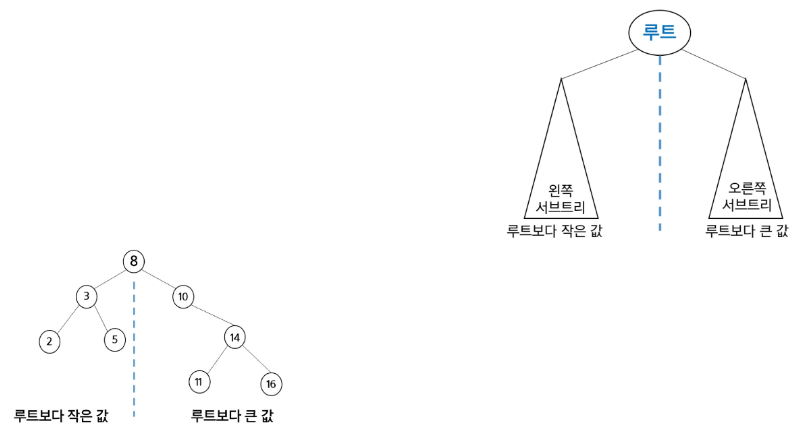

### 탐색 연산
- 루트에서 탐색 시작
- 탐색할 키 값 x를 루트 노드의 키 k와 비교
    - x == k: 탐색연산을 성공한 경우
    - x < k: 루트 노드의 왼쪽 서브트리에 대해 탐색연산 수행
    - x > k: 루트 노드의 오른쪽 서브트리에 대해 탐색연산 수행
- 서브트리에 대해 순환적으로 탐색 연산을 반복
- 탐색 수행할 서브 트리가 없으면 탐색 실패
- 13 탐색

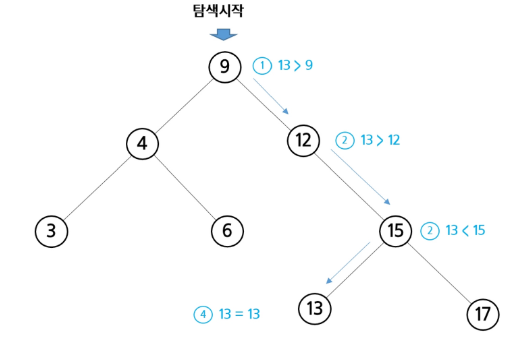

### 삽입 연산
1. 먼저 탐색 연산을 수행
    - 삽입할 원소와 같은 원소가 트리에 있으면 삽일할 수 없으므로, 같은 원소가 트리에 있는지 탐색하여 확인
    - 탐색에서 탐색 실패가 결정되는 위치가 삽입 위치
2. 탐색 실패한 위치에 원소를 삽입
    - 다음 예는 5를 삽입하는 예시

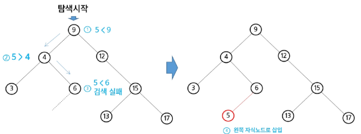

### 삭제 연산
- 삭제 연산에 대해 알고리즘을 생각해보자.
- 다음 트리에 대해 13, 12, 9를 차례로 삭제해보자.

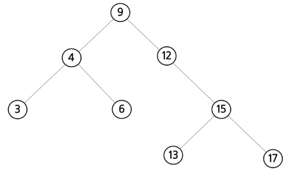

### 13 삭제
- 삭제할 노드가 리프 노드인 경우: 차수가 0인 경우

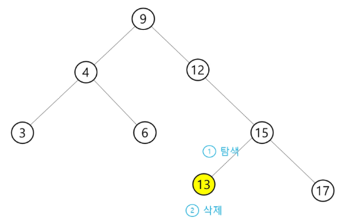

- 삭제할 노드가 리프 노드가 아닌 경우: 차수가 1인 경우

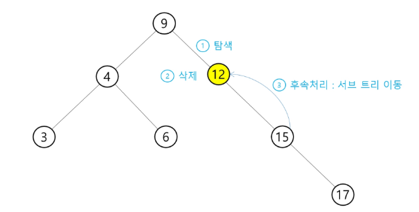

- 삭제할 노드가 리프 노드가 아닌 경우: 차수가 2인 경우

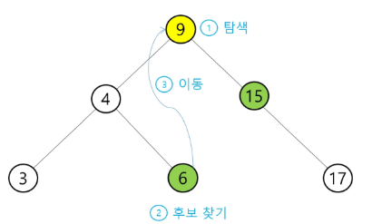

### 이진탐색트리의 성능
- 탐색(searching), 삽입(inserting), 삭제(deletion) 시간은 트리의 높이만큼 시간이 걸린다.
    - O(h), h: BST의 깊이(heigth)
- 평균의 경우   
    - 이진 트리가 균형적으로 생성되어 있는 경우
    - O(log n)
- 최악의 경우
    - 한 쪽으로 치우친 경사 이진트리의 경우
    - O(n)
    - 순차탐색과 시간 복잡도가 같다.

## 힙(heap)
- 완전 이진 트리에 있는 노드 중에서 키 값이 가장 큰 노드나 키 값이 가장 작은 노드를 찾기 위해 만든 자료 구조
- 최대 힙(max heap)
    - 키 값이 가장 큰 노드를 찾기 위한 힙
    - 부모 노드의 키 값 > 자식 노드의 키 값
    - 루트 노드는 키 값이 가장 큰 노드
- 최소 힙(min heap)
    - 키 값이 가장 작은 노드를 찾기 위한 힙
    - 부모 노드의 키 값 < 자식 노드의 키 값
    - 루트노드는 키 값이 가장 작은 노드

### 힙의 예

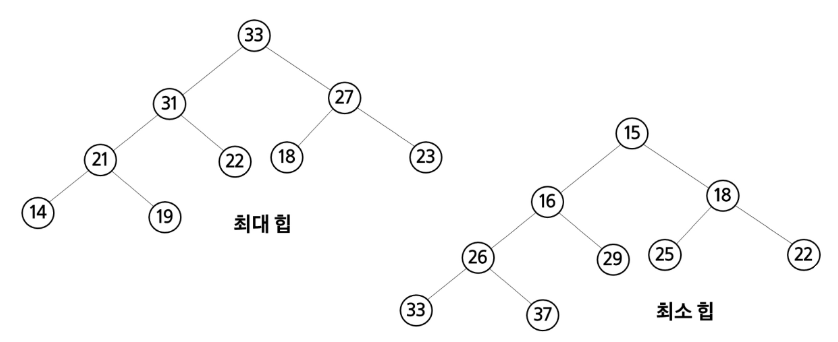

### 힙이 아닌 이진 트리의 예
- 아닌 이유를 설명해보라.

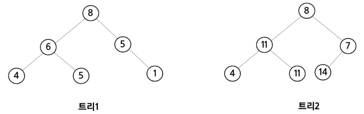

### 힙 연산 - 삽입
- 17 삽입

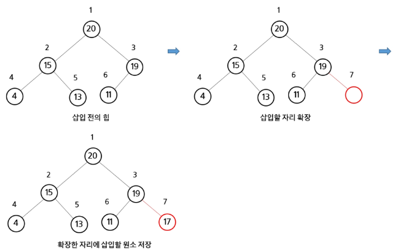

- 23 삽입 

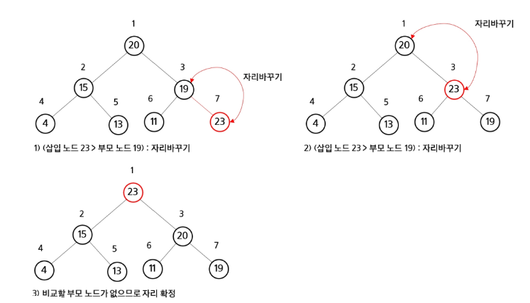

### 힙 연산 - 삭제
- 힙에서는 루트 노드의 원소만을 삭제할 수 있다.
- 루트 노드의 원소를 삭제하여 반환한다.
- 힙의 종류에 따라 최댓값 또는 최솟값을 구할 수 있다.
    - 우선순위 큐와 비교

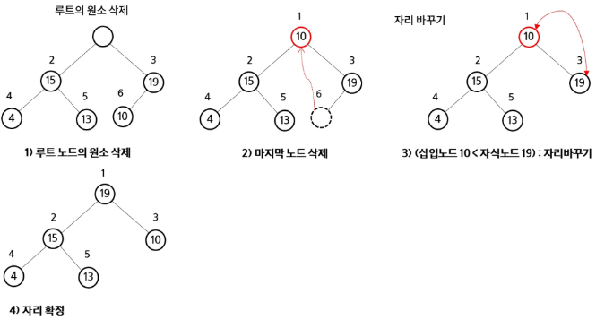

### 힙의 활용
- 힙을 활용하는 대표적인 2가지 예는 **우선순위 큐의 구현과 정렬**
- 우선순위 큐를 구현하는 가장 효율적인 방법이 힙을 사용하는 것 => <mark>heapq</mark>
    - 노드 하나의 추가/삭제가 시간 복잡도가 O(log n)이고 최댓값/최솟값을 O(1)에 구할 수 있다.
- 힙 정렬은 O(n log n)을 보장

```py
import heapq

arr = [20, 15, 19, 4, 13, 11]

# 1. 기본 리스트를 heap 으로 만들기
# heapq.heapify(arr)  # 최소힙으로 바뀐다.
# 디버깅 시에 이진 트리로 그림을 그려야 한다!
# -> 딱 봤을때는 정렬이 안된 것 처럼 보인다.
# print(arr)

# 2. 하나 씩 데이터를 추가
min_heap = []
for num in arr:
    heapq.heappush(min_heap, num)
print(min_heap)

# 최대힙?
max_heap = []
for num in arr:
    heapq.heappush(max_heap, -num)

while max_heap:
    pop_num = heapq.heappop(max_heap)
    print(-pop_num, end=' ')
    print()

# ------------------ 전자사전 예제
# 1. 길이 순서로 먼저 출력
# 2. 길이가 같다면, 사전 순으로 출력

arr = ['apple', 'banana', 'kiwi', 'abcd', 'abca', 'lemon', 'peach', 'grape', 'pear']
# sort 를 쓰면 아래와 같다.
# 즉, 우선순위가 2가지
# arr.sort(key=lambda x: (len(x), x))
dictionary = []

# 단어를 삽입 (길이, 단어) 형태로 삽입
for word in arr:
    heapq.heappush(dictionary, (len(word), word))

# 전자사전에서 단어를 하나씩 꺼내기
print("전자사전 순서:")
while dictionary:
    length, word = heapq.heappop(dictionary)
    print(f"{word} (길이: {length})")
```

- 배열을 통해 트리 형태를 쉽게 구현 가능
    - 부모나 자식 노드를 O(1) 연산으로 쉽게 찾을 수 있다.
    - n번 위치에 있는 노드의 자식은 2n 과 2n+1 번에 위치한다.
    - 완전 이진 트리의 특성에 의해 추가/삭제의 위치는 자료의 시작과 끝 인덱스로 쉽게 판단할 수 있다.
- 힙 정렬은 힙 자료구조를 이용해 이진 탐색과 유사한 방법으로 수행됨
- 정렬을 위한 2단계
    1. N개의 노드 삽입 연산 + N개의 노드 삭제 연산
    2 .힙에서 순차적(오름차순)으로 값을 하나씩 제거
- 힙 정렬의 시간 복잡도
    - N개의 노드 삽입 연산 + N개의 노드 삭제 연산이 필요
    - 삽입과 삭제 연산은 각각 O(log N)이다.
    - 따라서, 전체 정렬은 O(N log N)
- 힙 정렬은 배열에 저장된 자료를 정렬하기에 유용함

### 실습
- 백트래킹
    - 5028. 전기버스2
    - 5209. 최소 생산 비용
- 이진탐색트리
    - 5176. 이진탐색
- 힙
    - 5177. 이진 힙
- 추가연습
    - 2806. N-Queen
