# Frontend Development

### Frontent Development
- 웹 사이트와 웹 애플리케이션의 사용자 인터페이스(UI)와 사용자 경험(UX)을 만들고 디자인하는 것
- HTML, CSS, JavaScript 등을 활용하여 사용자가 직접 상호작용하는 부분을 개발

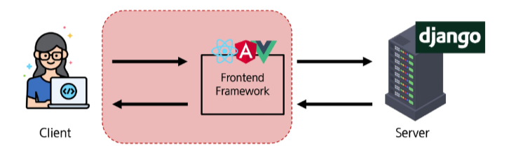

## Client-side frameworks

### Client-side frameworks
- Client-side frameworks: 클라이언트 측에서 UI와 상호작용을 개발하기 위해 사용되는 JavaScript 기반 프레임워크
  - 웹 사이트의 사용자 인터페이스(UI)를 효율적으로 만들기 위해 미리 짜놓은 코드의 뼈대
  - 복잡한 웹 애플리케이션을 마치 레고 조립하듯, 가능한 부품 단위로 쉽게 개발할 수 있게 도와줌
  - 오늘날 대부분의 동적인 웹 사이트는 이 프레임워크를 사용하며, Vue, React, Angular가 가장 대표적

### Client-side frameworks가 필요한 이유 - 1
- 단순히 무언가를 읽는 곳에서 -> 무언가를 하는 곳으로 변화
  - 사용자는 이제 웹에서 문서만을 읽는 것이 아닌 음악을 스트리밍하고, 영화를 보고, 지구 반대편 사람들과 텍스트 및 영상 채팅을 통해 즉시 통신하고 있음
  - 이처럼 현대적이고 복잡한 대화형 웹 사이트를 "**웹 애플리케이션(web applications)**" 이라 부름
  - JavaScript 기반의 Client-side frameworks가 등장하면서 매우 동적인 대화형 애플리케이션을 훨씬 더 쉽게 구축할 수 있게 됨

### Client-side frameworks가 필요한 이유 - 2
- 다루는 데이터가 많아짐
  - 만약 친구가 이름을 변경했다면?
  - 친구 목록, 타임라인, 스토리 등 친구 이름이 출력되는 모든 곳이 함께 변경되어야 함
  - 애플리케이션의 기본 데이터를 안정적으로 추적하고 업데이트(렌더링, 추가, 삭제 등) 하는 도구가 필요
  - 애플리케이션의 상태가 변경될 때마다 UI가 일관성 있게 업데이트되어야 함

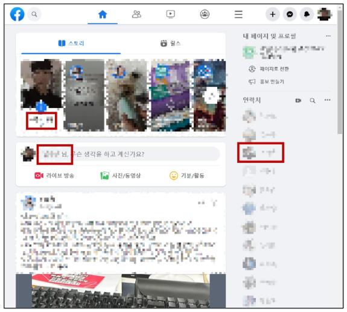

### Vanilla JS만으로는 간단하지 않음
- 불필요한 코드의 반복

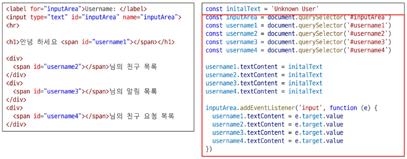

### Client-side frameworks의 필요성
1. 동적이고 반응적인 웹 애플리케이션 개발
    - 실시간 데이터 업데이트
2. 코드 재사용성 증가
    - 컴포넌트 기반 아키텍처
    - 모듈화된 코드 구조
3. 개발 생산성 향상
    - 강력한 개발 도구 지원

## SPA

### SPA
- Single Page Application(SPA): 단일 페이지에서 동작하는 웹 애플리케이션
  - 하나의 HTML 파일 위에서 JavaScript가 필요한 부분만 교체하며 '진짜' 페이지 이동 없이 동작
  - 마치 하나의 무대에서 배우와 배경만 계속 바꾸는 연극과 유사
  - 앱처럼 빠르고 부드러운 사용자 경험을 제공

### Single Page Application (SPA) 작동 원리
1. 최초 로드 시, 어플리케이션에 필요한 주요 리소스를 다운로드
2. 페이지 갱신에 대해 필요한 데이터만을 비동기적으로 전달받아 화면의 필요한 부분만 동적으로 갱신
    - AJAX와 같은 기술을 사용하여 필요한 데이터만 비동기적으로 로드
    - 페이지 전체를 다시 로드할 필요없이, 필요한 데이터만 서버로부터 가져와서 화면에 표시
3. JavaScript를 사용하여 클라이언트 측에서 동적으로 콘텐츠를 생성하고 업데이트
    - **CSR 방식**

## CSR

### CSR
- Client Side Rendering(CSR): 클라이언트에서 콘텐츠를 렌더링하는 방식
  - 일단 빈 집(HTML)에 들어간 뒤, 가구(JavaScript)를 배송받아 직접 조립하는 방식
  - 브라우저는 거의 텅 빈 HTML과 JavaScript 파일을 받아옴
  - 그 후 JavaScript가 실행되어 데이터를 요청하고 화면을 동적으로 완성

### Client Side Rendering(CSR) 작동 원리
1. 사용자가 웹사이트에 요청을 보냄
2. 서버는 최소한의 HTML과 JavaScript 파일을 클라이언트로 전송
3. 클라이언트는 HTML과 JavaScript를 다운로드 받음
4. 브라우저가 JavaScript를 실행하여 동적으로 페이지 콘텐츠를 생성
5. 필요한 데이터는 API를 통해 서버로부터 비동기적으로 가져옴

### CSR 작동 예시
1. 클라이언트는 서버로부터 최소한의 HTML 페이지와 애플리케이션 실행에 필요한 JavaScript를 응답 받음
2. 그런 다음 클라이언트 측에서 JavaScript를 사용하여 DOM을 업데이트하고 페이지를 렌더링
3. 이후 서버는 더 이상 HTML을 제공하지 않고 요청에 필요한 데이터만 응답
4. Google Maps, Facebook, Instagram 등의 서비스에서 페이지 갱신 시 새로고침이 없는 이유

### CSR과 SPA의 장점
1. 빠른 페이지 전환
    - 페이지가 처음 로드된 후에는 필요한 데이터만 가져오면 되고 JavaScript는 전체 페이지를 새로 고칠 필요없이 페이지의 일부를 다시 렌더링할 수 있기 때문
    - 서버로 전송되는 데이터의 양을 최소화 (서버 부하 방지)
2. 사용자 경험
    - 새로고침이 발생하지 않아 네이티브 앱과 유사한 사용자 경험을 제공
3. Frontend와 Backend의 명확한 분리
    - Frontend는 UI 렌더링 및 사용자 상호 작용 처리를 담당 & Backend는 데이터 및 API 제공을 담당
    - 대규모 애플리케이션을 더 쉽게 개발하고 유지 관리 가능

### CSR과 SPA의 단점
1. 느린 초기 로드 속도
    - 전체 페이지를 보기 전에 약간의 지연을 느낄 수 있음
    - JavaScript가 다운로드, 구문 분석 및 실행될 때까지 페이지가 완전히 렌더링되지 않기 때문
2. SEO(검색 엔진 최적화) 문제
    - 페이지를 나중에 그려 나가는 것이기 때문에 검색에 잘 노출되지 않을 수 있음
    - 검색엔진 입장에서 HTML을 읽어서 분석해야 하는데 아직 콘텐츠가 모두 존재하지 않기 때문

#### TIP
- 초기 로딩 속도가 느리지만, 초기 로딩만 끝나고 나면 훌륭한 UX 경험을 주는 장점이 단점을 상쇄
- 위에서 언급한 단점은 Next.js, Nuxt.js 같은 하이브리드 프레임워크를 통해 대부분 해결할 수 있게 됨
  - 이들은 SEO와 초기 로딩 속도 문제를 해결하면서 SPA의 장점은 그대로 누릴 수 있게 해줌

### SPA vs. MPA / CSR vs. SSR
- Multi Page Application (MPA)
  - 여러 개의 HTML 파일이 서버로부터 각각 로드
  - 사용자가 다른 페이지로 이동할 때마다 새로운 HTML 파일이 로드됨
- Server-side Rendering (SSR)
  - 서버에서 화면을 렌더링하는 방식
  - 모든 데이터가 담긴 HTML을 서버에서 완성 후 클라이언트에게 전달

# Vue

### Vue
- Vue: 사용자 인터페이스를 구축하기 위한 JavaScript 프레임워크
  - 웹 사이트 UI를 쉽고 빠르게 만들 수 있게 도와주는 프론트엔드 프레임워크
  - 레고 블록처럼 가능한 부품(컴포넌트)으로 화면을 조립하고, 데이터가 바뀌면 화면도 자동으로 바뀌는 **반응성**이 가장 큰 특징
  - 배우기 쉽고 직관적이면석도 강력해, 초보자부터 전문가까지 폭 넓게 사용하는 인기 있는 기술

### What is Vue?
- Evan You에 의해 발표(2014)
  - 학사 - 미술, 미술사 / 석사 - 디자인 & 테크놀로지 전공
  - Angular 개발팀 출신
- 최신 버전은 "Vue 3" (2024)
  - https://vuejs.org/

### Vue를 학습하는 이유
1. 낮은 학습 곡선
    - 간결하고 직관적인 문법을 가지고 있어 빠르게 익힐 수 있음
    - 잘 정리된 문서를 기반으로 어렵지 않게 학습할 수 있음
2. 확장성과 생태계
    - 다양한 플러그인과 라이브러리를 제공하는 높은 확장성
    - 전 세계적으로 활성화된 커뮤니티를 기반으로 많은 개발자들이 새로운 기능을 개발하고 공유하고 있음
3. 유연성 및 성능
    - 작은 규모의 프로젝트부터 대규모의 애플리케이션까지 다양한 프로젝트에 적합
4. 주목받는 Client-side framework

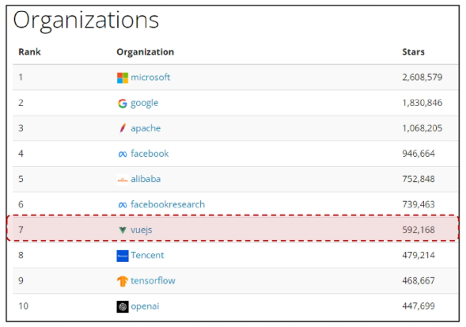

### SSAFY에서의 Vue
1. Vue는 React나 Angular에 비해 문법이 간겨랗고 직관적이어서, 학습이 비교적 수월
    - 짧은 시간 내에 효율적으로 결과물을 만들어낼 수 있음
2. 거대하고 활발한 커뮤니티를 가지고 있어 풍부한 문서, 튜토리얼, 예제 및 다양한 리소스를 공유받을 수 있음
    - 최신 업데이트 및 트렌드를 공유함으로써 지속적인 학습을 촉진

### Vue 체험하기

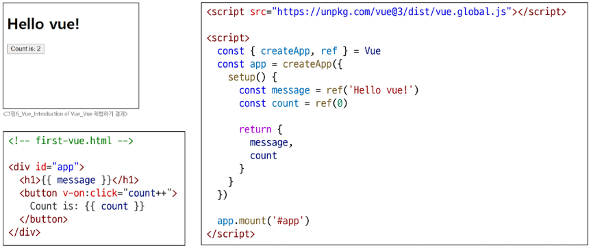

### Vue의 2가지 핵심 기능
1. 선언적 렌더링 (Declarative Rendering)
    - 표준 HTML을 확장하는 Vue "템플릿 구문"을 사용하여 JavaScript 상태(데이터)를 기반으로 화면에 출력될 HTML을 선언적으로 작성
2. 반응성 (Reactivity)
    - JavaScript 상태 변경을 추적하고, 변경사항이 발생하면 자동으로 DOM을 업데이트

### Vue의 주요 특징 정리
1. 반응형 데이터 바인딩
    - 데이터 변경 시 자동 UI 업데이트
2. 컴포넌트 기반 아키텍처
    - 재사용 가능한 UI 조각
3. 간결한 문법과 직관적인 API
    - 낮은 학습 곡선
    - 높은 가독성
4. 유연한 스케일링
    - 작은 프로젝트부터 대규모 애플리케이션까지 적합

## Component

### Component
- **재사용 가능한 코드 블록**
- UI를 독립적이고 재사용 가능한 일부분으로 분할하고 각 부분을 개별적으로 다룰 수 있음
- 자연스럽게 애플리케이션은 중첩된 Component의 트리 형태로 구성됨

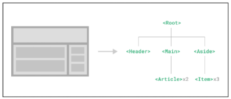

### Component 예시
- 웹 서비스는 여러 개의 Component로 이뤄져 있음

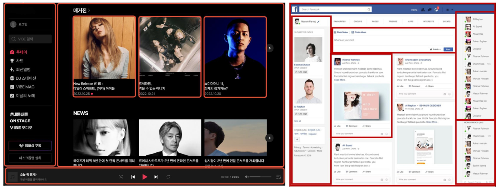

# Vue tutorial

### Vue를 사용하는 방법
1. 'CDN' 방식
2. 'NPM' 설치 방식
    - CDN 방식 이후 진행

## Vue Application 생성

### Vue Application 생성하기
- vue 사용을 위한 CDN 작성

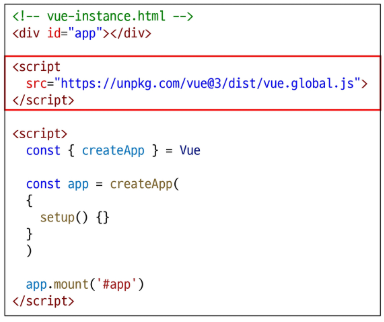

- Application instance
  - CDN에서 Vue를 사용하는 경우 전역 Vue 객체를 불러오게 됨
  - 구조분해할당 문법으로 Vue 객체의 createApp 함수를 담당

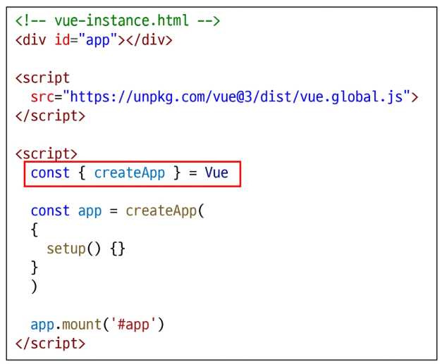

  - 모든 Vue 애플리케이션은 createApp 함수로 새 Application instance를 생성하는 것으로 시작

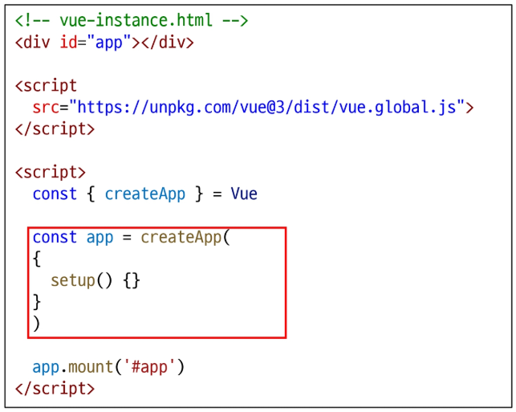

- Root Component
  - createApp 함수에는 객체(컴포넌트)가 전달됨
  - 모든 App에는 다른 컴포넌트들을 하위 컴포넌트로 포함할 수 있는 Root(최상위) 컴포넌트가 필요 (현재는 단일 컴포넌트)

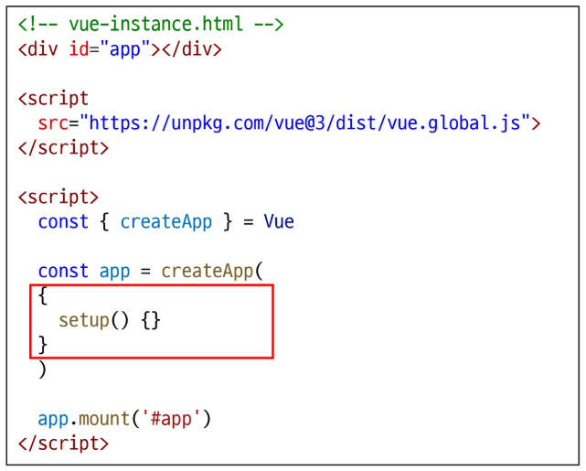

- Mounting the App (앱 연결)
  - HTML 요소에 Vue Application instance를 탑재(연결)
  - 각 앱 인스턴스에 대해 mount()는 한 번만 호출할 수 있음

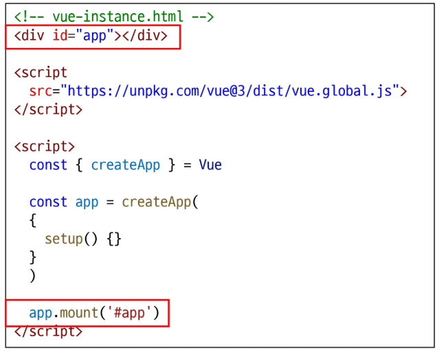

- setup() 함수
  - 컴포넌트가 동작하기 전에 미리 준비하는 "시작점", "초기 설정용 함수"
  - 이 함수 안에서 데이터를 정의하거나, 화면에 표시할 값을 계산하거나, 각종 로직(함수)을 준비할 수 있음
  - setup에서 준비한 값들은 이후 템플릿이나 컴포넌트의 다른 부분에서 바로 사용 가능

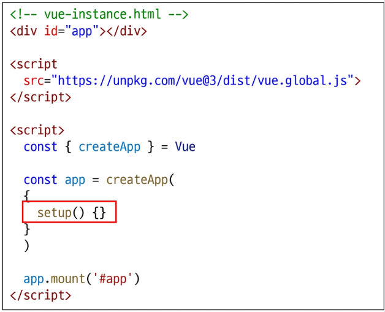

## 반응형 상태

### 반응형 상태
- ref(): 반응형 상태(데이터)를 선언하는 함수 (Declaring Reactive State)
  - 일반 JS 변수를 Vue가 변화를 감지할 수 있는 반응형 객체로 만들어 줌
  - 컴포넌트 내에서 변하는 값(예: 숫자, 문자열, input 값 등)의 상태를 추적하고 관리하기 위해 사용

### ref 함수
- .value 속성이 있는 ref 객체로 래핑(wrapping)하여 반환하는 함수
  - 래핑(wrapping): 여러 요소를 하나의 태그나 컴포넌트로 감싸는 함수
- ref로 선언된 변수의 값이 변경되면, 해당 값을 사용하는 템플릿에서 자동으로 업데이트
- 인자는 어떠한 타입도 가능

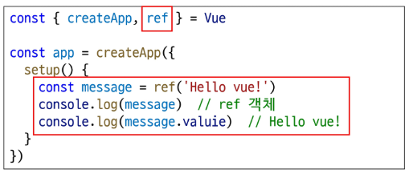

- 템플릿의 참조에 접근하려면 setup 함수에서 선언 및 반환 필요
- 편의상 템플릿에서 ref를 사용할 때는 .value를 작성할 필요 없음 (자동으로 언래핑(unwrapping) 됨)

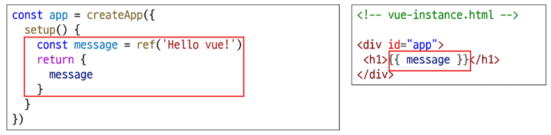

- 즉, **ref 함수는 반응형을 가지는 참조 변수를 만드는 것** (ref === reactive reference)

## Vue 기본 구조

### Vue 기본 구조
- createApp()에 전달되는 객체는 Vue 컴포넌트
- 컴포넌트의 상태는 setup() 함수 내에서 선언되어야 하며 **객체를 반환해야 함**

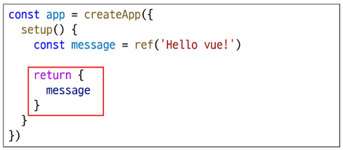

### 템플릿 렌더링
- 반환된 객체의 속성은 템플릿에서 사용할 수 있음
- Mustache syntax(콧수염 구문, {{}})를 사용하여 메시지 값을 기반으로 동적 텍스트를 렌더링
  - 동적 텍스트: 데이터(변수) 값에 따라 내용이 실시간으로 바뀌는 텍스트

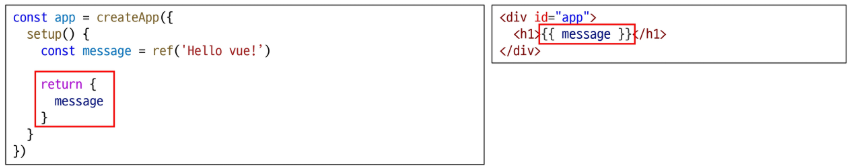

- 콘텐츠는 식별자나 경로에만 국한되지 않으며 유효한 JavaScript 표현식을 사용할 수 있음

### Event Listeners in Vue
- 'v-on' directive를 사용하여 DOM 이벤트를 수신할 수 있음
- 함수 내에서 반응형 변수를 변경하여 구성 요소 상태를 업데이트

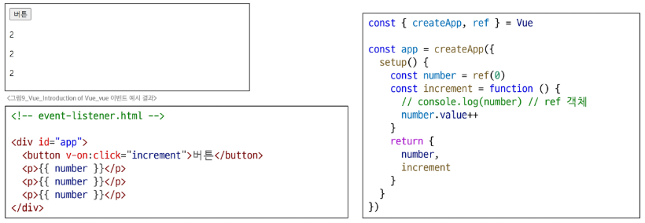

# 참고

## ref 객체

### ref 객체가 필요한 이유
- 일반적인 변수가 아닌 객체 데이터 타입으로 사용하는 이유
  - Vue는 템플릿에서 ref를 사용하고 나중에 ref의 값을 변경하면 자동으로 변경 사항을 감지하고, 그에 따라 DOM을 업데이트함("의존성 추적 기반의 반응형 시스템")
- Vue는 렌더링 중에 사용된 모든 ref를 추적하며, 이후 ref의 값이 변경되면 해당 ref를 사용하는 컴포넌트를 다시 렌더링
- 이를 위해서 참조 자료형의 객체 타입으로 구현한 것
  - JavaScript에서는 일반 변수의 접근 또는 변형을 감지할 방법이 없기 때문
  - https://vuejs.org/guide/essentials/reactivity-fundamentals.html#why-refs

### 반응형 변수 vs. 일반 변수
- ref는 값이 바뀌면 화면이 자동으로 업데이트 되지만, 일반 변수는 값이 바뀌어도 화면이 갱신되지 않음

## Ref Unwrap 주의사항

### 템플릿에서의 unwrap 시 주의사항
- 템플릿에서의 unwrap은 ref가 setup에서 반환된 객체의 최상위 속성일 경우에만 적용

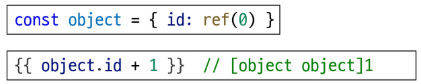

- [object object] 이 출력되는 이유
  - object는 최상위 속성이지만 object.id는 그렇지 않음
  - 표현식을 평가할 때 object.id가 unwrap 되지 않고 ref 객체로 남아 있기 때문
  - 해결 방법은?
- 이 문제를 해결하기 위해서는 id를 객체에서 분해하여 최상위 속성으로 만들어야 함

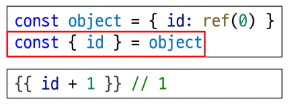

- 단, ref가 "{{}}"의 최종 평가 값인 경우는 unwrap 가능

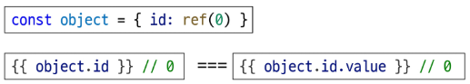

## SEO

### SEO (Search Engine Optimization)
- google, bing과 같은 검색 엔진 등에 내 서비스나 제품 등이 효율적으로 검색 엔진에 노출되도록 개선하는 과정을 일컫는 작업
- 정보의 대상은 주로 HTML에 작성된 내용
- 최근에는 SPA, 즉 CSR로 구성된 서비스의 비중이 증가
- SPA 서비스도 검색 대상으로 넓히기 위해 JS를 지원하는 방식으로 발전하는 중

## CSR과 SSR

### CSR & SSR
- CSR과 SSR은 흑과 백이 아님
- 애플리케이션의 목적, 규모, 성능 및 SEO 요구 사항에 따라 달라질 수 있음
  > 내 서비스에 적합한 렌더링 방식을 적절하게 활용할 수 있어야 함
- SPA 서비스에서도 SSR을 지원하는 Framework가 발전하고 있음
  - Vue의 Nuxt.js
  - React의 Next.js

### 실습
- Vue tutorial
  - 2794\. Vue3 시작하기
  - 2795\. Vue3 다양한 데이터 렌더링
  - 2796\. Vue3 사용해 보기
- Vue template
  - 2798\. 템플릿 렌더링 연습
  - 2799\. 템플릿 렌더링 연습 2
  - 3091\. 선언적 렌더링