# Template Syntax

### Template Syntax
- Template Syntax: Vue는 DOM을 컴포넌트 인스턴스의 데이터에 **선언적으로 바인딩**할 수 있는, HTML 기반 **템플릿 구문**을 사용
  - Vue를 사용하면 JS 데이터와 HTML 화면을 아주 쉽고 직관적인 방법으로 연결할 수 있음
  - **'선언적 바인딩'** 은 JS 데이터(상태)가 바뀌면 DOM(화면)이 알아서 업데이트되는 것을 의미
  - **템플릿 구문**은 HTML에 Vue만의 특별한 문법을 추가해서 사용하는 것을 의미

### Template Syntax 종류
- Text Interpolation
- Raw HTML
- Attribute Bindings
- JS Expressions

### 1. Text Interpolation
- 데이터 바인딩의 가장 기본적인 형태
  - 데이터 바인딩: JS 데이터와 HTML 화면을 동기화하여 연결하는 것
- 이중 중괄호 구문(콧수염 구문)을 사용
- 콧수염 구문은 해당 컴포넌트 인스턴스의 msg 속성 값으로 대체
- msg 속성이 변경될 때마다 업데이트 됨

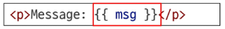

### 2. Raw HTML
- 콧수염 구문은 데이터를 일반 텍스트로 해석하기 때문에 실제 HTML을 출력하려면 **v-html**을 사용해야 함
  - 보안 위험으로 안정적인 화면에서만 사용할 것을 권장
  - 애매모호하다면 사용을 자제할 것

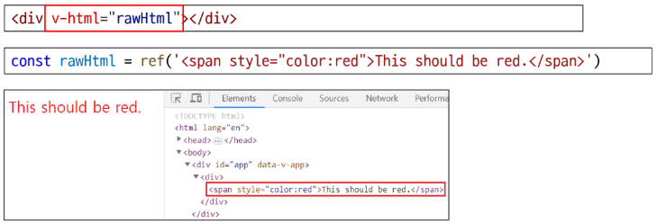

### 3. Attribute Bindings
- 콧수염 구문은 HTML 속성 내에서 사용할 수 없기 때문에 **v-bind**를 사용
- HTML의 **id 속성 값**을 vue의 **dynamicId 속성**과 동기화되도록 함
- 바인딩 값이 null이나 undefined인 경우, 해당 속성은 렌더링 요소에서 제거됨

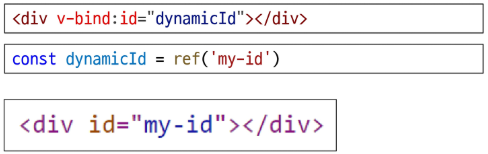

### 4. JS Expressions
- Vue는 모든 데이터 바인딩 내에서 JS 표현식의 모든 기능을 지원
- Vue 템플릿에서 JS 표현식을 사용할 수 있는 위치
  - JS 표현식: 하나의 값으로 평가(계산)될 수 있는 모든 코드 조각
  1. 콧수염 구문 내부
  2. 모든 디렉티브의 속성 값 ("v-"로 시작하는 특수 속성)

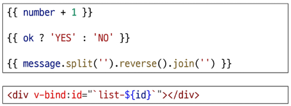

### Expressions 주의사항
- 각 바인딩에는 **하나의 단일 표현식만 포함**될 수 있음
  - 표현식은 값으로 평가할 수 있는 코드 조각 (return 뒤에 사용할 수 있는 코드여야 함)
- 작동하지 않는 경우

  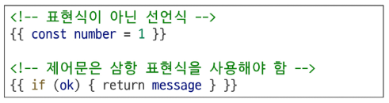

## Directive

### Directive
- Directive: 'v-' 접두사가 있는 특수 속성
  - DOM 요소에 특정 반응형 동작을 적용하는 명령어
  - v-if는 조건에 따라 렌더링하고, v-for는 배열을 반복 출력하는 등 다양한 반응형 동작을 연결
  - JS 로직을 HTML 템플릿 안에서 선언적으로 사용하여, 코드를 깔끔하게 직관적으로 유지하는 데 도움을 주는 Vue의 강력한 도구

### Directive 특징
- Directive의 속성 값은 단일 JS 표현식이어야 함 (v-for, v-on 제외)
- 표현식 값(ex: "seen")이 변경될 때 DOM에 반응적으로 업데이트를 적용
- 예시

  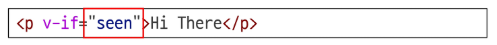

#### TIP
- 디렉티브 안에는 if문 같은 문장을 쓸 수 없음
- 하나의 값으로 귀결되는 표현식만 가능
- 문자열 리터럴을 값으로 주려면 "'문자열'"처럼 따옴표로 한 번 더 감싸야 함

### Directive 전체 구문
- Name(이름): Directive의 핵심 이름으로, 어떤 종류의 기능을 수행할 지를 의미
- Argument(전달 인자): Directive가 '무엇에 대해' 동작할 지 알려주는 구체적인 대상
- Modifiers(수식어): 점으로 표시되는 특별한 접미사로, Directive의 기본 동작을 수정할 수 있음
- Value(값): Directive에 연결될 JS 표현식

### Directive: "Arguments"
- 일부 directive는 directive 뒤에 콜론(":")으로 표시되는 인자를 사용할 수 있음
- 아래 예시의 href는 HTML \<a> 요소의 **href** 속성 값을 myUrl 값에 바인딩 하도록 하는 v-bind의 인자

  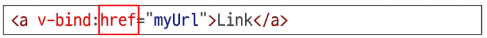

- 아래 예시의 **click**은 이벤트 수신할 이벤트 이름을 작성하는 v-on의 인자

  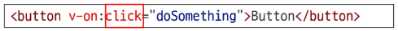

### Directive: "Modifiers"
- ".(dot)"로 표시되는 특수 접미사로, directive가 특별한 방식으로 바인딩되어야 함을 나타냄
- 예시의 .prevent는 발생한 이벤트에서 event.preventDefault()를 호출하도록 v-on에 지시하는 modifier

  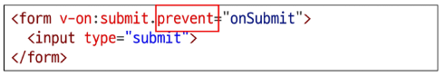

#### TIP
- 하나의 디렉티브에 여러 수식어를 이어서 붙일 수 있음 (예: @click, stop, prevent)

### Built-in Directives
- v-text
- v-show
- v-if
- v-for
- ...
- https://vuejs.org/api/built-in-directives.html

# Dynamically data binding

## v-bind

### v-bind
- v-bind: 하나 이상의 속성 또는 컴포넌트 데이터를 표현식에 동적으로 바인딩
  - HTML 태그의 속성을 Vue의 데이터와 실시간으로 연결해 동적으로 제어하는 directive
  - 데이터 값에 따라 이미지, 스타일, 클래스 등을 자유롭게 변경 가능

### v-bind 종류
1. Attribure Bindings
2. Class and Style Bindings

## Attribute Bindings

### Attribute Bindings (속성 바인딩)
- HTML의 속성 값을 Vue의 상태 속성 값과 동기화

  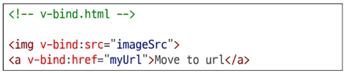

- v-bind shorthand (약어)
  - ':' (colon)

  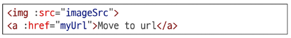

### Dynamic attribute name (동적 인자 이름)
- 대괄호([])로 감싸서 directive argument에 JS 표현식을 사용할 수 있음
- 표현식에 따라 동적으로 평가된 값이 최종 argument 값으로 사용됨

  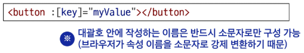

#### TIP
- 대괄호 안의 값이 null이면, 해당 속성이나 이벤트 리스너가 아예 제거되는 특징이 있음
- 대괄호 안에는 띄어쓰기나 따옴표를 쓸 수 없음

### Attribute Bindings 예시

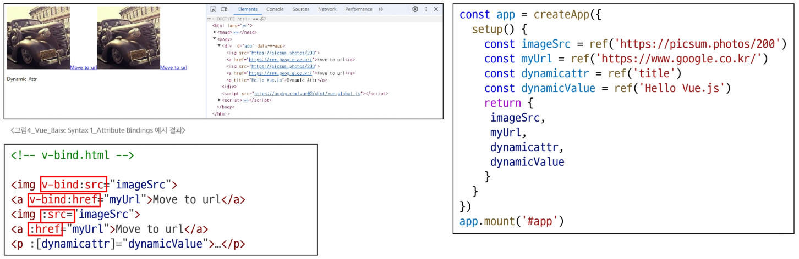

## Class and Style Bindings

### Class and Style Bindings (클래스와 스타일 바인딩)
- class와 style은 모두 HTML 속성이므로 다른 속성과 마찬가지로 v-bind를 사용하여 동적으로 문자열 값을 할당할 수 있음
- Vue는 class 및 style 속성 값을 v-bind로 사용할 때 **객체** 또는 **배열**을 활용하여 작성할 수 있도록 함
  > 단순히 문자열 연결을 사용하여 이러한 값을 생성하는 것은 번거롭고 오류가 발생하기가 쉽기 때문

### Class and Style Bindings가 가능한 경우
- Binding HTML Classes
  - 1.1 Binding to Objects
  - 1.2 Binding to Arrays
- Binding Inline Styles
  - 2.1 Binding to Objects
  - 2.2 Binding to Arrays

### 1.1 Binding HTML Classes: Binding to **Object**
- 객체를 :class에 전달하여 클래스를 동적으로 전환할 수 있음
- 예시 1
  - isActive의 Boolean 값에 의해 active 클래스의 존재가 결정됨

    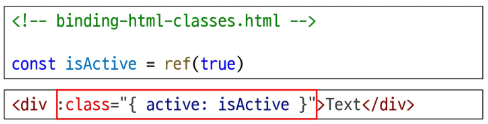
  
  - 변환 후 실제로 보이는 태그 모습

    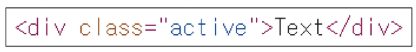

- 객체에 더 많은 필드를 포함하여 여러 클래스를 전환할 수 있음
- 예시 2
  - :class directive를 일반 클래스 속성과 함께 사용 가능
  
    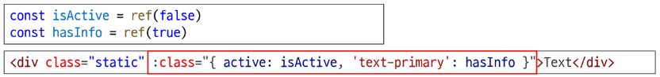

  - 변환 후 실제로 보이는 태그 모습

    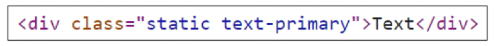

- inline 방식이 아닌 반응형 변수를 활용해 객체를 한 번에 작성하는 방법
- 예시 3

  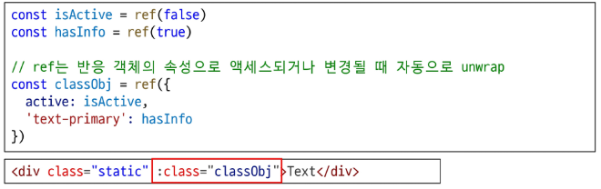

  - 변환 후 실제로 보이는 태그 모습

    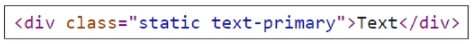

### 1.2 Binding HTML Classes: Binding to **Arrays**
- :class를 배열에 바인딩하여 클래스 목록을 적용할 수 있음
- 예시 1

  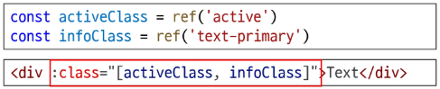

  - 변환 후 실제로 보이는 태그 모습

  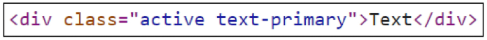

- 배열 구문 내에서 객체 구문을 사용하는 경우
- 예시 2

  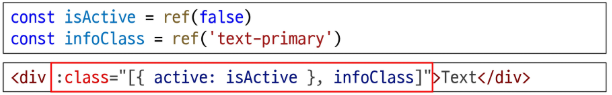

  - 변환 후 실제로 보이는 태그 모습

  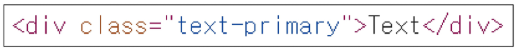

### 2.1 Binding Inline Styles: Binding to **Objects**
- :style은 HTML의 style 속성에 JS 객체를 바인딩하는 것을 지원
- 예시 1

  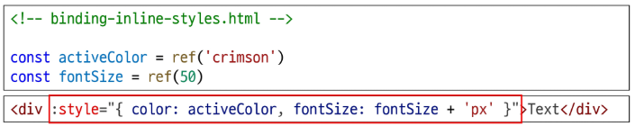

  - 변환 후 실제로 보이는 태그 모습

  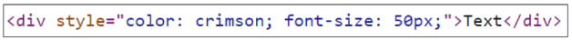

- 실제 CSS에서 사용하는 것처럼 :style은 kebab-cased 키 문자열도 지원 (단, camelCase 작성을 권장)
- 예시 2

  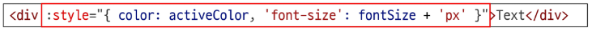

  - 변환 후 실제로 보이는 태그 모습

  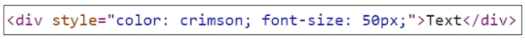

- inline 방식이 아닌 반응형 변수를 활용해 객체를 한 번에 작성하는 방법
- 예시 3

  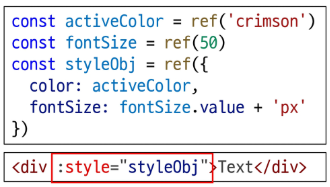

  - 변환 후 실제로 보이는 태그 모습

  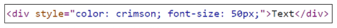

### 2.2 Binding Inline Styles: Binding to **Arrays**
- 여러 스타일 객체를 배열에 작성해서 :style을 바인딩할 수 있음
- 작성한 객체는 병합되어 동일한 요소에 적용
- 예시

  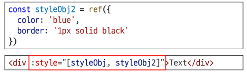

  - 변환 후 실제로 보이는 태그 모습

  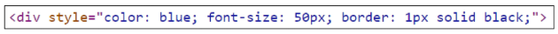

### v-bind 종합
- [해당 링크 참고](https://vuejs.org/api/built-in-directives.html#v-bind)

  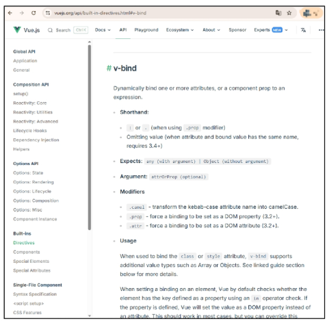

# Event Handling

## v-on

### v-on
- v-on: DOM 요소에 이벤트 리스너를 연결 및 수신
  - 버튼 클릭, 키보드 입력 등 사용자의 이벤트를 감지하고, 지정된 코드를 실행시키는 디렉티브
  - 사용자와 웹 페이지가 서로 상호작용할 수 있도록 만드는 핵심적인 역할
  - '버튼을 누르면 A를 실행하세요.'와 같은 로직 구현

### v-on 구성
- DOM 요소에 이벤트 리스너를 연결 및 수신

  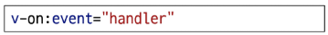

- v-on shorthand (약어)
  - '@'

  

- handler 종류
  1. Inline handlers: 이벤트가 트리거될 때 실행될 JS 코드
  2. Method handlers: 컴포넌트에 정의된 메서드 이름

### 1. Inline handlers
- Inline handlers는 주로 간단한 로직에 사용
- 복잡한 표현식이 들어가면 템플릿이 지저분해지고 코드를 이해하기 어려워짐
- 재사용이 불가능해 유지보수가 어려움

  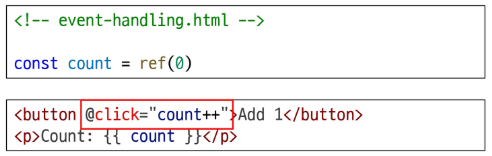

### 2. Method handlers
- Method handlers는 setup에 정의된 메서드를 호출하는 방식
- 로직이 복잡할 경우, Method를 분리하면 템플릿이 간결해지고 코드를 재사용하기 좋음
- Inline handlers로는 불가능한 대부분의 상황에서 사용

  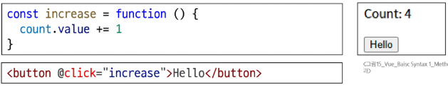

- **@click="myFunc"처럼 괄호 없이 메서드 이름만 연결하면, 핸들러의 첫 번째 인자로 DOM의 event 객체가 자동으로 전달됨
  - event 객체: 이벤트 발생 시, 이벤트 상세 정보를 담아 전달되는 객체

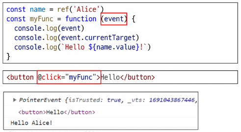

### 사용자 지정 인자 전달
- 기본 이벤트 대신 사용자 지정 인자를 전달할 수도 있음

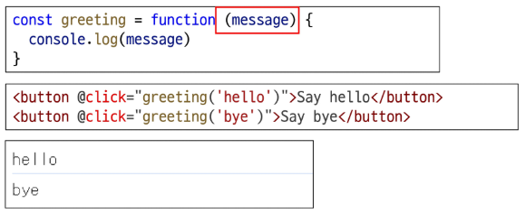

> event 객체도 인자로 같이 받고 싶을 때는 어떻게 할까?

### Inline handlers에서의 event 인자 접근
- Inline handlers에서 원래 DOM 이벤트에 접근하기
- **$event** 변수를 사용하여 메서드에 전달

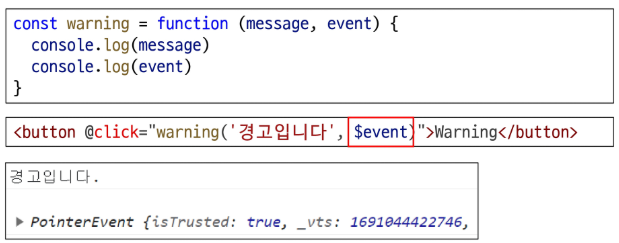

- $event 변수를 전달하는 **위치는 상관 없음**

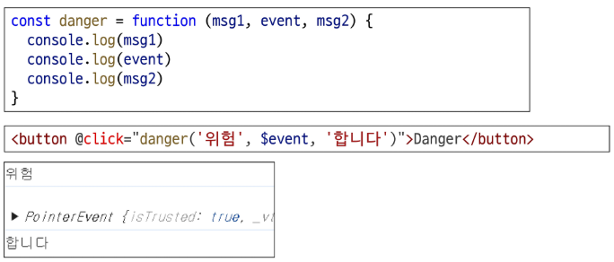

## Modifiers

### Event Modifiers
- Vue는 Event Modifiers를 제공하여 event.preventDefault()와 같은 코드를 메서드 안에 직접 작성할 필요가 없도록 함
- 대신 stop, prevent, self 등 다양한 modifiers를 제공
  - Modifiers: 디렉티브 뒤에 점(.)으로 붙여 특별한 동작을 추가하는 기능
- 이는 메서드 로직을 순수하게 데이터 관련 처리에만 집중시키기 위함

  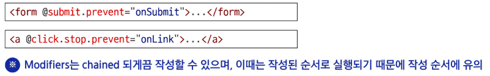

### Event Modifiers 예시1
- form 요소에서 submit 이벤트가 발생하면 submit 이벤트의 기본 동작을 취소하고 onSubmit 메서드를 호출

  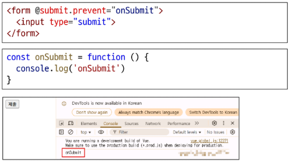

### Event Modifiers 예시2
- 첫 번째 a 태그 클릭 시
  - 버블링 현상으로 인해 detectBubble 메서드가 호출되고 google 페이지로 이동

  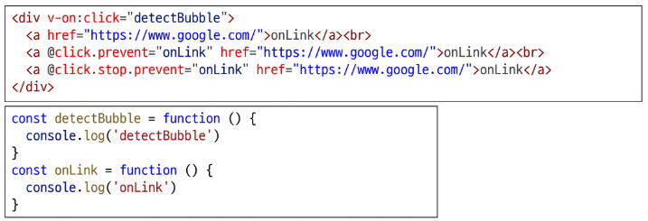

- 두 번째 a 태그 클릭 시
  - click 이벤트로 인해 onLink 메서드 호출
  - 버블링 현상으로 인해 detectBubble 메서드가 호출
  - prevent modifier로 인해 a 태그 이벤트의 기본 동작이 취소되어 페이지가 이동하지 않음

  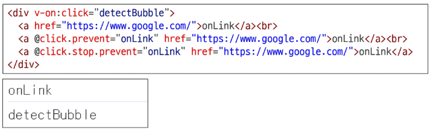

- 세 번째 a 태그 클릭 시
  - click 이벤트로 인해 onLink 메서드 호출
  - stop modifier로 인해 버블링 현상이 중단되어 detectBubble 메서드가 호출되지 않음
  - prevent modifier로 인해 a 태그 이벤트의 기본 동작이 취소되어 페이지가 이동하지 않음

  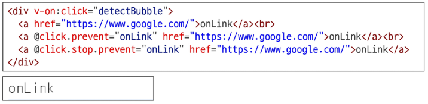

### Key Modifiers
- 키보드 이벤트를 수신할 때 특정 키에 관한 별도 modifiers를 사용할 수 있음
- 예시 1
  - Enter 키가 입력되었을 때만 onSubmit 이벤트를 호출하기

  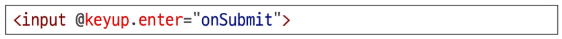

- 예시 2
  - Ctrl + Enter로 댓글 등록하기

  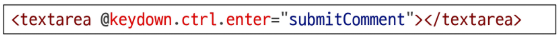

### v-on 종합
- https://vuejs.org/api/built-in-directives.html#v-on

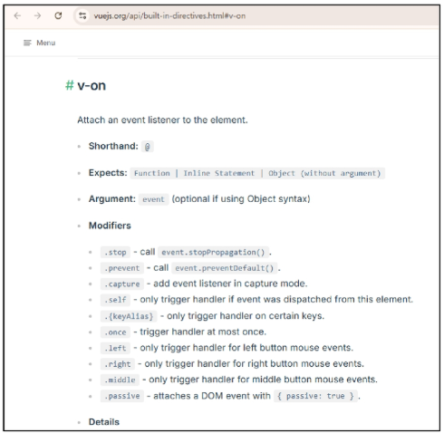

# Form Input Bindings

### Form Input Bindings (폼 입력 바인딩)
- form을 처리할 때 사용자가 input에 입력하는 값을 실시간으로 JS 상태에 동기화해야 하는 경우 (양방향 바인딩)
- 양방향 바인딩 방법
  1. v-bind와 v-on을 함께 사용
  2. v-model 사용

## v-bind with v-on

### 1. v-bind와 v-on을 함께 사용
1. v-bind로 input 요소의 value 속성을 반응형 변수에 연결
2. v-on으로 input 이벤트가 발생할 때마다, input의 현재 값을 반응형 변수에 저장

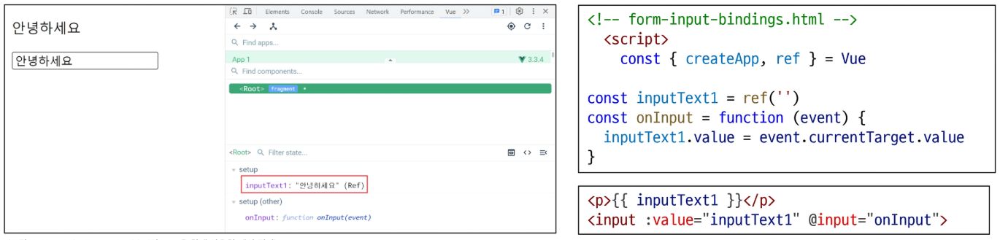

## v-model

### v-model
- v-model: form input 요소 또는 컴포넌트에서 양방향 바인딩을 만듦
  - input과 같은 폼 요소의 값과 Vue의 데이터를 실시간으로 동기화시키는 directive
  - 사용자의 입력이 즉시 데이터에 반영되고, 데이터의 변경이 즉시 화면에 반영되는 양방향 연결을 만드는 핵심적인 역할
  - '이 input의 값은 항상 이 데이터와 같아야 한다'와 같은 동기화 규칙 구현
- 사용자 입력 데이터와 반응형 변수를 실시간 동기화

  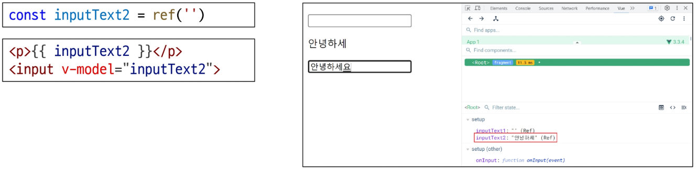

#### TIP
- IME가 필요한 언어(한국어, 중국어, 일본어 등)의 경우 v-model이 제대로 업데이트되지 않음
- 해당 언어에 대해 올바르게 응답하려면 v-bind와 v-on 방법을 사용해야 함

## v-model 활용

### v-model과 다양한 입력(input) 양식
- v-model은 단순 Text input 뿐만 아니라 다양한 타입의 사용자 입력 방식과 함께 사용 가능
  - **Checkbox**
  - **Select**
  - Radio
  - textarea
  - ...

### Checkbox 활용
1. 단일 체크박스와 boolean 값 활용

  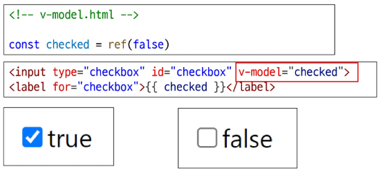

2. 여러 체크박스와 배열 활용
    - 초기 반응형 변수를 배열로 초기화
    - 해당 배열에는 현재 선택된 체크박스의 값이 포함됨

    

### Select 활용
- select에서 v-model 표현식의 초기 값이 어떤 option과도 일치하지 않는 경우, select 요소는 "선택되지 않은(unselected)" 상태로 렌더링 됨

  

### v-model 종합
- https://vuejs.org/api/built-in-directives.html#v-model

  

# 참고

## 접두어 $

### '$' 접두어가 붙은 변수
- Vue 인스턴스 내에서 사용할 수 있도록 Vue가 제공하는 공용 프로퍼티
- 사용자가 지정한 반응형 변수나 메서드와 구분하기 위함
> 주로 Vue 인스턴스 내부 상태를 다룰 때 사용

#### TIP
- 내가 만드는 데이터와 메서드 이름에 $나 `` 접두사를 사용하지 않는 것이 좋음
- '_'로 시작하는 속성은 내부용이므로 직접 사용하면 안 됨. 예고없이 변경될 수 있음

## IME

### IME(Input Method Editor)
- 사용자가 입력 장치에서 기본적으로 사용할 수 없는 문자(비영어권 언어)를 입력할 수 있도록 하는 운영 체제 구성 프로그램
- 일반적으로 키보드 키보다 자모가 더 많은 언어에서 사용해야 함
- IME가 활성화된 상태(예: 한글 조합 중)에서 input 이벤트가 발생하는 방식과 v-model의 업데이트 방식이 충돌하여, 의도치 않은 동작이 발생할 수 있음

#### TIP
- v-model에 .lazy 수식어를 붙이면 문제를 해결할 수 있지만 데이터가 실시간으로 반영되지 않고, 사용자가 입력을 마친 후 다른 곳을 클릭하는 등 포커스를 잃었을 때 한 번에 반영

### 실습
- Vue directive
  - 2800\. 다양한 directive 연습하기 - 1
  - 2801\. 다양한 directive 연습하기 - 1
- Dynamically data binding
  - 2802\. 전시 정보 페이지 만들기 - 기본 정보 입력
  - 3094\. 동적 데이터 바인딩과 이벤트 핸들링
  - 3095\. 양방향 데이터 바인딩