# 문서 유사도

## 문서 유사도란

### 문서 유사도
- 여러 개의 문서(또는 문장) 중에서 "얼마나 비슷한 내용을 담고 있는지"를 **수치로 표현**한 것

### 문서 유사도란
- 추천 시스템
  - 도서, 영화, 금융 상품 등에서 사용자의 관심사와 유사한 콘텐츠를 찾아 추천
- 검색 및 정보 탐색
  - 입력 쿼리(질문)와 유사한 문서를 빠르게 찾고, 검색 결과 품질을 높임
- 분류•군집 및 중복 검출
  - 뉴스 기사•논문 등이 서로 얼마나 유사한지 계산 
  -> 중복 기사 묶음 처리, 토픽별 문서 분류
- 의사결정 지원
  - 방대한 문서(보고서, 계약서 등) 중 유사 문서나 핵심 정보를 신속히 파악 가능
- 텍스트(문자)로 이뤄진 문서라면, 사람이 읽고 비교하기 쉬움
- 아래 예시 중, 가장 "유사" 한 문장을 2개 선택한다면?

1. 먹고 싶은 사과
2. 먹고 싶은 바나나
3. 길고 노란 바나나 바나나
4. 저는 과일이 좋아요.

- 누구든지 1번과 2번 문장이 "가장 유사" 하다고 선택할 것
- 그 외 문장들 간의 관계에 대해서도 "어느 정도 연관은 있음" 이라고 판별

1. **먹고 싶은 사과**
2. **먹고 싶은 바나나**
3. 길고 노란 바나나 바나나
4. 저는 과일이 좋아요.

- 그러나 문장들의 길이가 아주 길어진다면 어떻게 판별할 수 있을까?
- 비교해야 하는 문서의 양이 많아진다면?
> **정확히 어느 정도로 유사한 지를 정량화하고자 한다면?**

# 문서 유사도 계산 방법

## 문서 유사도 계산 방법

### 문서 유사도 계산 방법
- 코사인 유사도
  - 두 **벡터**가 이루는 각도의 **코사인** 값을 이용
  - -1 이상 1 이하의 값을 가지며 값이 1에 가까울 수록 유사도가 높다고 판단
- 자카드 유사도
  - 두 집합의 교집합 크기를 합집합 크기로 나눈 값
  - 텍스트 유사도 측정 시 단어 존재 여부만 고려
- 유클리드 거리
  - 공간적 거리 측정 방식으로, n차원 공간에서 두 점 사이의 직선 거리를 계산
  - 거리가 0에 가까울 수록 유사도가 높다고 판단

## 코사인

### 코사인
- 빗변에 대한 인접변의 비

  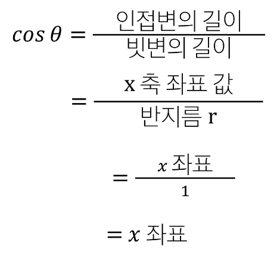

- 따라서, x 축의 길이 = cos θ

  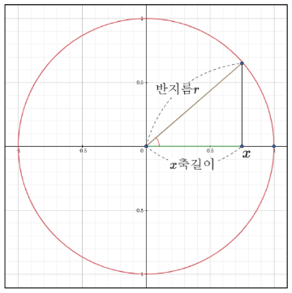

## 벡터
- 여러 수치를 일렬로 나열
- **"방향과 크기"** 를 나타내는 수학적 표현
- 원점 (0, 0)에서 좌표(3, 4)에 대한 벡터 표현

  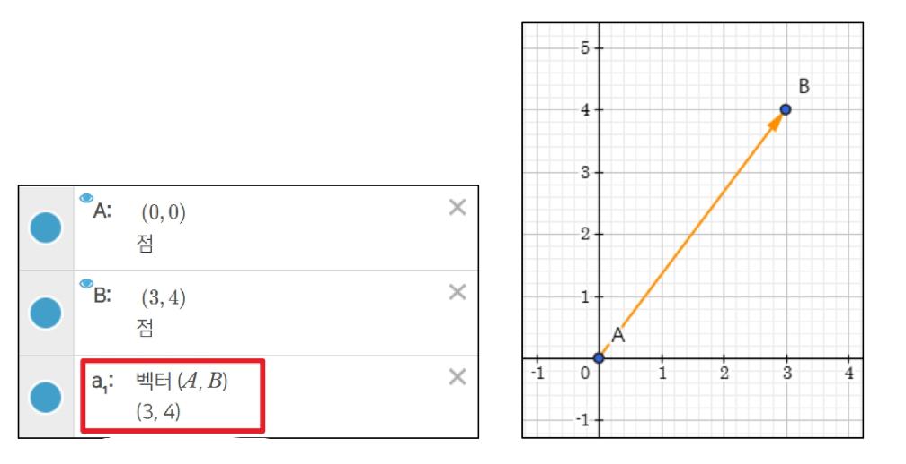

## 코사인 유사도

### 코사인 유사도
- 코사인 유사도
  - **두 벡터가 이루는 각도의 코사인 값**을 이용
  - -1 이상 1 이하의 값을 가지며 값이 1에 가까울 수록 유사도가 높다고 판단

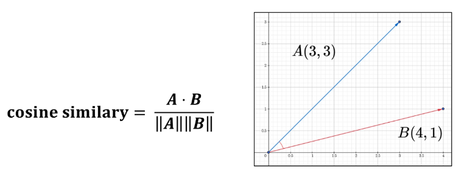

- 두 벡터의 내적 계산
  - 벡터 A와 벡터 B의 내적은 동일 차원끼리 곱한 후, 모두 더한 값
- A · B = (Ax * Bx) + (Ay * By) 
= (3 * 4) + (3 * 1) 
= 15
- 두 벡터의 크기(노름) 계산
  - 벡터의 크기는 피타고라스 정리를 이용
  - 각 좌표의 제곱의 합에 루트를 씌운 것

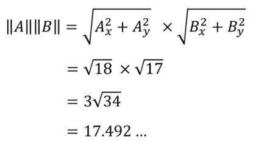

- 코사인 유사도

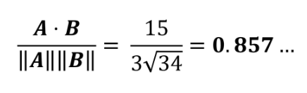

### 코사인 유사도 코드

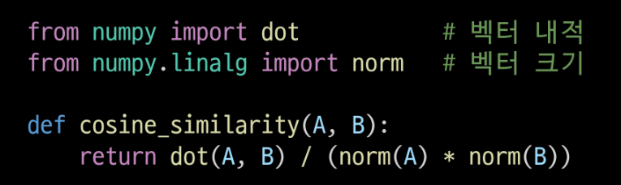

### 결론
- 두 벡터의 관계를 코사인 값으로 나타내는 것이 목표
- 벡터를 활용하므로, 2차원 데이터가 아닌 경우에도 연산에는 문제 없음
  - n 차원으로 표기되는 데이터의 경우에도 직관적으로 시각화는 어려우나 수학적으로 정의는 가능
  - 예: 다음과 같은 경우에도 코사인 유사도 식 연산 가능
    - vector A = (x1, x2, ..., xn)
    - vector B = (y1, y2, ..., yn)

# 카운트 기반 문서 유사도

### 카운트 기반 문서 유사도
- 코사인 유사도 방식으로 두 벡터 간의 유사도를 알아내려면 벡터 값이 필요
- 주어진 데이터는 텍스트(문자) 형태의 데이터
- 텍스트 기반 데이터를 벡터 데이터로 변환할 수 있는 방법이 필요

1. 먹고 싶은 사과
2. 먹고 싶은 바나나
3. 길고 노란 바나나 바나나
4. 저는 과일이 좋아요

## 사전 준비

### google colab 활용
- 사전에 제공된 ipynb 파일들을 단계별로 colab에서 실행

## Bag of Words (BOW)

### Bag of Words
- 고유 단어 추출
  - 불용어(조사, 접속사 등)를 제거 -> 더 높은 정확도
- 각 단어에 인덱스 부여
  - 사전순 혹은 등장 순서대로 인덱스를 부여
- 문서 별 각 단어의 등장 빈도수 기록
  - 문서 내 등장 횟수를 해당 단어의 인덱스 위치에 기록
- 문서 별 빈도 벡터 정보
  - 단, 아래 예시는 편의상 불용어 제거 과정을 거치지 않음

    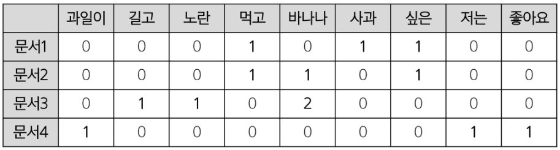

### Bag of Words 구현
- 문서 정의
- 단어 카운트 행렬 생성

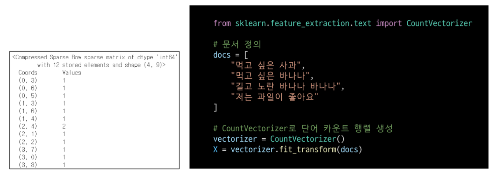

- numpy 배열로 변환

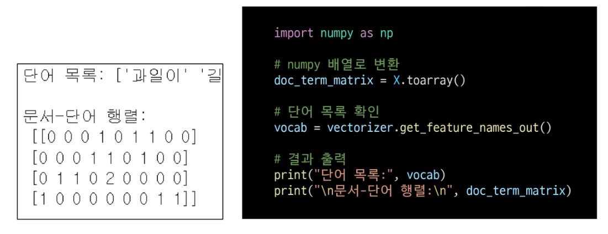

- 문서간 코사인 유사도 계산

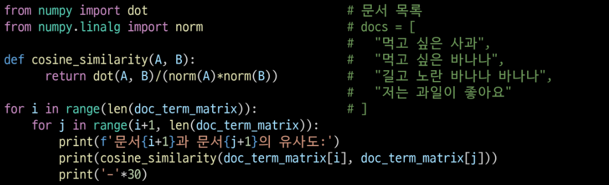

### 카운트 기반 문서 유사도 한계점
- 문서(단어) 벡터 간 유의미한 유사도를 계산할 수 없음
- '사과'와 '바나나' 는 과일이라는 공통점을 가지고 있으나, 해당 정보를 단어 카운트 행렬에서는 반영할 수 있는 방법이 없음
  - 그 결과 1번 문서와 3번 문서의 유사도가 0으로 나오게 됨

1. 먹고 싶은 사과
2. ...
3. 길고 노란 바나나 바나나

# 임베딩 기반 문사 유사도

## 임베딩

### 워드 임베딩(Word Embedding)
- '의미'를 반영한 숫자 벡터로 텍스트를 변환하는 기법
- 단순히 단어 등장 횟수를 세는 방식(Bag of Words 등)으로는 '사과'와 '배'가 과일이라는 의미적 유사도를 충분히 반영하기 어려움
- 임베딩 과정을 통해, **서로 의미가 비슷한 단어·문장**이 고차원 벡터 공간 상에서 가까이 위치하도록 학습시킴
- 임베딩된 벡터들은 서로 **코사인 유사도** 등으로 간단히 비교 가능하며, 훨씬 정교한 문서(단어) 간 유사도 계산이 가능해짐

### 임베딩 기반 문서 유사도
- 데이터 수집
  - 실습에서는 '대한민국 헌법.txt' 파일 활용
- 데이터 전처리
  - **토큰화**: 띄어쓰기(또는 형태소) 기준으로 분리
  - **한글이 아닌 표현** (이모지, 꺽쇠 등) **제거**
  - **불용어 제거**: 벡터로 만들 필요가 없거나 지나치게 많이 사용되는 단어 제거 (조사 등)
- 임베딩용 딥러닝 모델 설계 (Word2Vec, Doc2Vec 등 사용 예정)

## Word2Vec
- **분포 가설**에 기반하여 단어의 의미를 벡터로 '학습'
  - "서로 비슷한 맥락에서 등장하는 단어들은 의미도 비슷하다"
- 주변 단어를 보고 중심 단어를 맞히거나 학습하면, 단어 간 의미 관계가 유사한 벡터로 학습
- 학습 방식
  - **CBOW**: 주변 단어들을 입력으로 받고(맥락), **그 중심 단어를 예측**하는 방식
  - **Skip-gram**: 중심 단어를 입력으로 받고, **주변 단어들을 예측**하는 방식

### [참고] Word2Vec - CBOW 예시

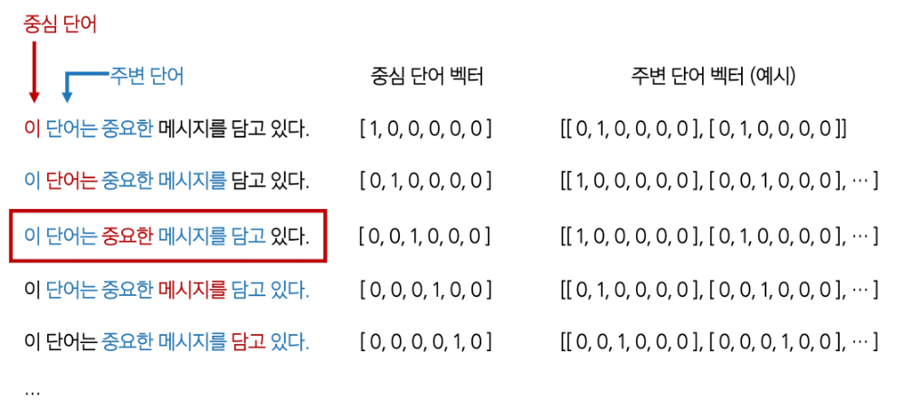

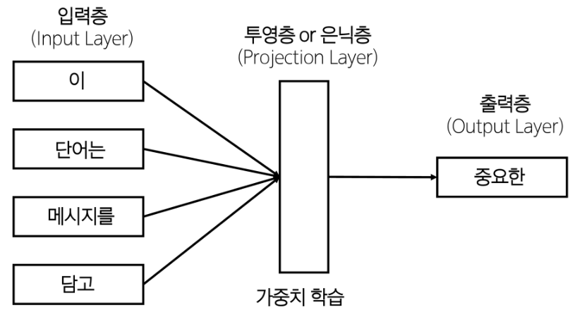

### Word2Vec 활용
- 필요한 라이브러리 설치
  - Gensim
    - 자연어 처리 라이브러리
    - Word2Vec, Doc2Vec 등 임베딩 관련 알고리즘 지원
  - Konlpy
    - 한국어 자연어 처리(NLP)에 특화된 라이브러리
    - 형태소 분석기, 불용어 제거 등의 기초 전처리 지원

### 주의사항
- colab의 기본 제공 numpy 버전은 2.0.2
- 2025.4월 기준, 최신 버전의 gensim은 numpy 1.26.4 버전을 사용중
  1. **gensim 설치 과정에서 numpy 버전이 1.26.4로 조정**되었음
  2. 그러나, 현재 실행중인 세션 환경에서는 여전히 numpy 버전이 2.0.2
  3. **런타임 > '세션 다시 시작'** 을 통해 **실행중인 numpy 버전을 1.26.4로 갱신 필요**
  4. numpy version 확인
- **'세션 다시 시작'** 전에 numpy 버전을 확인할 경우, 1.26.4 버전으로 출력되지만, 실제로는 2.0.2 버전을 사용중이므로, 반드시 **'세션 다시 시작'** 을 실행해야 함

### Word2Vec 활용
- 필요한 라이브러리 import

- 데이터 수집
  - '대한민국 헌법.txt' 파일 업로드

- 데이터 전처리 - 불필요한 문자 제거

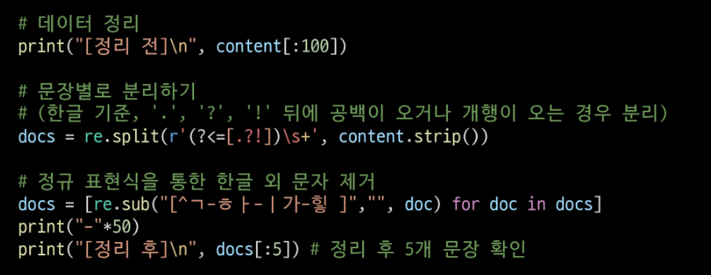

- 데이터 전처리 - 문장을 단어로 분리 (토큰화)

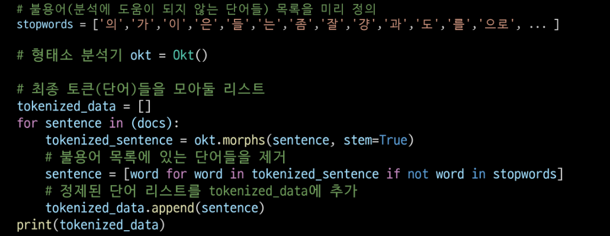

- 한글 토큰을 100차원의 워드 임베딩 벡터로 변환

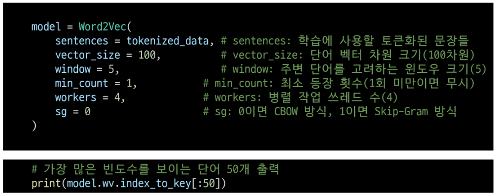

- 출력 결과 확인

  

  - [**'을'**, '제조', '법률', '되다', '있다', '정', '수', '의하다', ...]
- 불용어 처리 시 상황에 따라 적절한 처리가 필요한 이유
  - 언어별 특성을 잘 반영하여야 함
  - 문서/도메인의 특성이 잘 반영되어야 함
    - 예를 들어 법률 문서에서는 '제, 조, 항' 등이 불용어일 수 있지만, 다른 문서에서는 의미가 다를 수 있음
- 불용어 정의 업데이트 및 코드 재실행 후, 결과 확인

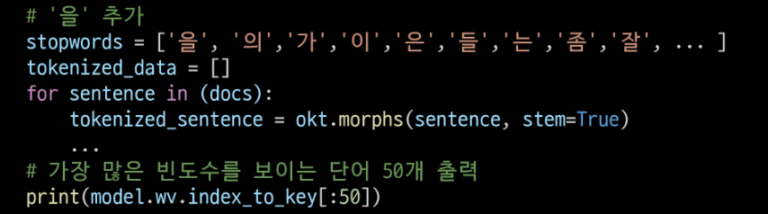

- ['제조', '법률', '되다', '있다', '정', '수', '의하다', ...]
- '법률' 단어의 100차원 벡터 임베딩 결과 확인

- -1부터 1 사이로 이뤄진 좌표 값
  - [-0.01467212, 0.01602833, 0.00596824, 0.00128165, 0.00949691, ...]
- 총 길이
  - 100
- 코사인 유사도 함수
  - '법률' 단어와 '헌법' 단어 벡터 간의 코사인 유사도 계산

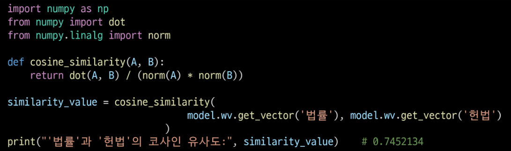

- 특정 단어와 가장 유사한 단어 출력

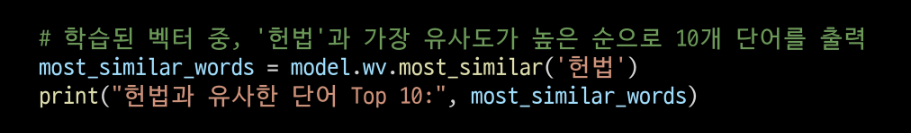

- 헌법과 유사한 단어 Top 10
  - ('의하다', 0.7880337238311768), ('대통령', 0.7802265882492065), 
  ('제조', 0.775690495967865), ('에는', 0.7637531757354736), 
  ('또는', 0.7555236220359802), ('법률', 0.7475212812423706), 
  ('국회', 0.7455061078071594), ('때', 0.7448825836181641), 
  ('되다', 0.7448391914367676), ('수', 0.7333436608314514)

## Doc2Vec

### Document Embedding(문서 임베딩)
- 여러 단어로 이뤄진 문장, 문서를 임베딩하는 방법
- 문서별로 고유 **문서 태그(문서 ID)** 를 부여
- Word2Vec과 유사하게 중심 단어와 주변 단어를 예측
  - 문서(문장)를 대표하는 문서 태그를 은닉층에 함께 학습
  - 이 문서 태그 임베딩이 결국 해당 문서를 대표하는 벡터가 됨
- 문서의 단어들을 입력으로 받고(또는 Skip-Gram이면 단어를 예측)
- **Doc2Vec 모델**을 사용하여 "문서 태그 + 단어 임베딩"을 동시에 업데이트

### Doc2Vec 활용
- 필요한 라이브러리 설치
  - Gensim 설치 후, **런타임 > '세션 다시 시작'** 실행
- Doc2Vec 및 Okt 불러오기

- 한국어 문장을 임베딩 벡터로 변환

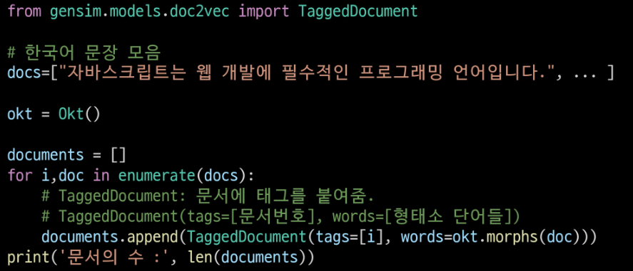

- 한글 문장을 300차원 벡터로 변환하기 위한 **Doc2Vec 모델 생성**
- **alpha**(학습률): 모델이 학습을 통해 가중치를 업데이트하는 정도
  - 학습률이 높을 수록 가중치 업데이트가 크게 이루어짐

    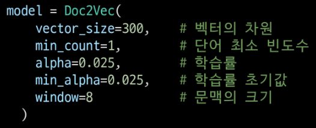

- 모델이 학습할 문서 빌드 및 Doc2Vec 학습

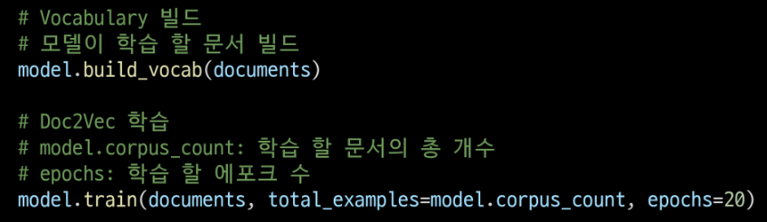

- 첫 번째 문장과 문장별 유사도 출력

### 결과가 만족스럽지 못한 이유는?
1. 문장 길이가 너무 짧고 단어 수가 적음
    - 학습 정보가 부족하여, 모델이 제대로 구분할 만한 특징을 잡기 어려움
2. 주제별 키워드가 불충분하거나 겹치는 어휘가 많음
    - "기계학습"·"데이터" 등 핵심 단어가 충분히 반복되어야 함
3. 학습 파라미터 및 데이터 규모 한계
    - 소수의 짧은 문장만으로 Doc2Vec을 학습하면 토픽별 임베딩이 명확히 분리되지 않을 수 있음

## 정리

### Word2Vec VS Doc2Vec

## 생성형 AI 기반 임베딩

### 생성형 AI 기반 임베딩
- GPT 계열같은 대규모 언어 모델(LLM)에서 제공하는 임베딩 기능 활용
  - LLM은 이미 엄청난 텍스트 코퍼스(말뭉치)로 사전 학습되어 있음
- 