# Computed Property

## Computed

### computed()
- computed(): "계산된 속성"을 정의하는 함수
  - 미리 계산된 속성을 만들어 템플릿의 표현식을 단순하게 하고, 불필요한 반복 연산을 줄여줌
  - 한 번 계산된 값은 캐싱(임시 저장)되어, 의존하는 데이터가 바뀌기 전까지는 다시 계산하지 않으므로 성능에 매우 유리

### Computed 가 없는 경우
- 할 일이 남았는지 여부에 따라 다른 메시지를 출력하기

  

> 템플릿이 복잡해지며 todos에 따라 계산을 수행하게 됨

> 만약 이 계산을 템플릿에 여러 번 사용하는 경우에는 매번 계산이 발생

### Computed를 사용하는 경우
- 반응형 데이터를 포함하는 복잡한 로직의 경우 computed를 활용하여 미리 값을 계산하여 계산된 값을 사용
- 여러 곳에서 사용해야 한다면, computed로 정의된 restOfTodos를 필요한 곳마다 재사용하면 됨

  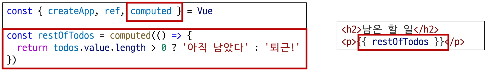

### computed 특징
- 반환되는 값은 계산된 ref(computed ref)이며, 일반 ref와 유사하게 계산된 결과를 .value로 참조 가능(템플릿에서는 .value 생략 가능)
  - computed ref: 원본 데이터가 바뀔 때만 값을 알아서 다시 계산하는 ref
- computed 속성은 의존된 반응형 데이터를 **자동으로 추적**
- 의존하는 반응형 데이터가 **변경될 때만 재평가**
  - restOfTodos의 계산은 todos에 의존하고 있음
  - 따라서 todos가 변경될 때만 restOfTodos가 업데이트 됨

  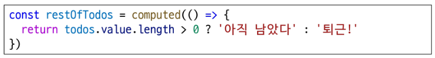

## Computed vs. Methods

### computed와 동일한 로직을 처리할 수 있는 method
- computed 속성 대신 method로도 동일한 기능을 정의할 수 있음

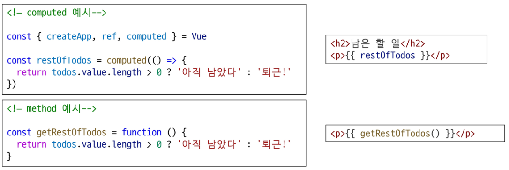

### computed와 method 차이
- computed 속성은 **의존하는 반응형 데이터를 기반으로 그 결과를 캐시(cached)**
- 의존하는 데이터가 변경된 경우에만 재평가됨
- 의존하는 데이터가 변경되지 않는 한, 해당 computed 속성에 여러 번 접근해도 함수를 다시 실행하지 않고 캐시된 결과를 즉시 반환
  - 반면, method 호출은 다시 렌더링이 발생할 때마다 항상 함수를 실행

#### TIP
- 템플릿에서 computed는 괄호 없이, method는 괄호를 붙여 호출
- 계산에 인자가 필요하다면 computed가 아닌 method를 사용
  - 계산에 외부의 값이 필요한지 여부를 판단

### 캐시
- 캐시(Cache): 데이터나 결과를 일시적으로 저장해두는 임시 저장소
  - 마치 자주 꺼내 먹는 식재료를 넣어두는 '냉장고'와 같음
  - 요리할 때마다 매번 마트(원본 데이터)에 갈 필요 없이 냉장고에서 바로 재료를 꺼내 쓰니 시간을 크게 절약할 수 있음
  - 마찬가지로 데이터를 요청할 때 먼저 캐시를 확인하고, 없을 경우에만 원본 데이터에 접근하여 가져온 뒤 캐시에 저장

### Cache 예시: 웹 페이지의 캐시 데이터
- 과거 방문한 적이 있는 페이지에 다시 접속할 경우
- 페이지 일부 데이터를 브라우저 **캐시에 저장** 후 같은 페이지에 다시 요청 시 모든 데이터를 다시 응답받는 것이 아닌 **일부 캐시된 데이터를 사용**하여 더 빠르게 웹 페이지를 렌더링

  

### computed와 method의 적절한 사용처
- computed
  - 의존하는 데이터에 따라 결과가 바뀌는 계산된 속성을 만들 때 유용
  - 동일한 의존성을 가진 여러 곳에서 사용할 때 계산 결과를 캐싱하여 중복 게산 방지
- method
  - 단순히 특정 동작을 수행하는 함수를 정의할 때 사용
  - 데이터에 의존하는지 여부와 관계 없이 항상 동일한 결과를 반환하는 함수

### method와 computed 정리
- computed
  - 의존된 데이터가 변경되면 자동으로 업데이트
- method
  - 호출해야만 실행됨
> 무조건 computed만 사용하는 것이 아니라 **사용 목적과 상황에 맞게** computed와 method를 적절히 조합하여 사용

# Conditional Rendering

## v-if

### v-if
- v-if: 표현식 값의 true/false를 기반으로 요소를 조건부로 렌더링
  - 특정 조건이 참(true)일 때만 HTML 요소를 화면에 보여주도록 하는 Directive
  - 조건이 거짓(false)이면 해당 요소는 DOM(문서 구조)에서 완전히 제거되어 보이지 않음
  - 주로 사용자의 로그인 상태에 따라 다른 메뉴를 보여주거나, 특정 상황에만 경고 메시지를 표시하는 등 조건부 렌더링에 사용됨
- 'v-if' Directive를 사용하여 조건부로 블록을 렌더링

  

### v-else
- 'v-if' Directive를 사용하여 조건부로 렌더링

  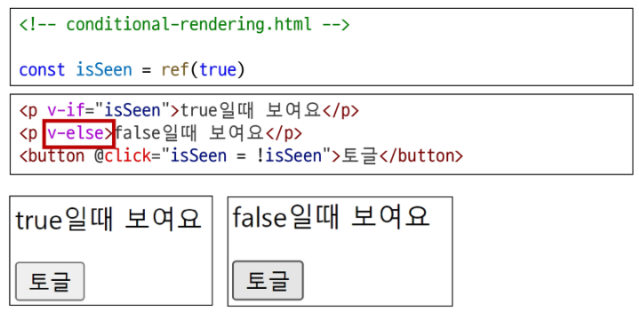

### v-else-if
- 'v-else-if' directive를 사용하여 v-if에 대한 else if 블록을 나타낼 수 있음
- name에 할당된 값을 바꾸면 조건에 맞는 태그가 보임

  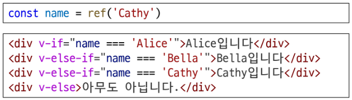

### 여러 요소에 대한 v-if 적용
- \<template> 요소에 v-if를 사용하면, 여러 요소를 하나의 조건부 블록으로 묶을 수 있음(v-else, v-else-if 모두 적용 가능)

  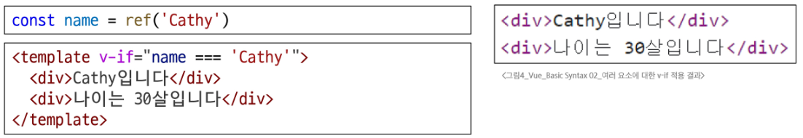

#### TIP
- HTML template element
  - 페이지가 로드될 때 렌더링 되지 않지만 JavaScript를 사용하여 나중에 문서에서 사용할 수 있도록 하는 HTML을 보유하기 위한 메커니즘
  - 보이지 않는 wrapper 역할

## v-if vs. v-show

### v-show
- v-show: 표현식 값의 true/false를 기반으로 요소의 가시성을 전환
  - v-if와 비슷하게 특정 조건에 따라 HTML 요소를 보여주거나 숨기는 Directive
  - 하지만 DOM에서 요소를 완전히 제거하는 v-if와 달리, v-show는 CSS의 display 속성을 none으로 바꿔 화면에서만 보이지 않게 숨김
  - 요소를 자주 보여주고 숨겨야 할 경우, 렌더링 비용이 높은 v-if보다 성능적으로 유리

### v-show 예시
- v-show를 사용한 요소는 조건과 관계없이 항상 DOM에 렌더링 됨
- CSS display 속성만 전환하기 때문 (none 속성으로 변환)

  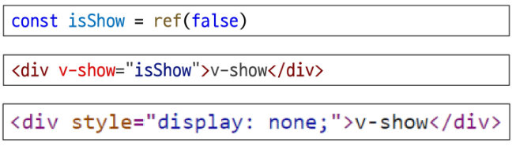

### v-if와 v-show의 적절한 사용처
- v-if (Cheap initial load, expensive toggle)
  - 초기 조건이 false인 경우 아무 작업도 수행하지 않음
  - 토글 비용이 높음
- v-show (Expensive initial load, cheap toggle)
  - 초기 조건에 관계 없이 항상 렌더링
  - 초기 렌더링 비용이 더 높음
    - 렌더링: 코드를 보고 실제 화면을 만드는 과정
- 콘텐츠를 매우 자주 전환해야 하는 경우에는 v-show를, 실행 중에 조건이 변경되지 않는 경우에는 v-if를 권장

# List Rendering

## v-for

### v-for
- v-for: **소스 데이터**를 기반으로 요소 또는 템플릿 블록을 반복 레더링(Array, Object, Number, String, Iterable)
  - 배열(Array)이나 객체(Object)의 데이터를 렌더링하는 반복문 Directive
  - 게시글 할 일, 상품 목록 등 동일한 구조의 요소를 여러 번 반복해서 화면에 표시할 때 사용

### v-for 구조
- v-for는 `alias in expression` 형식의 특별한 구문을 사용

  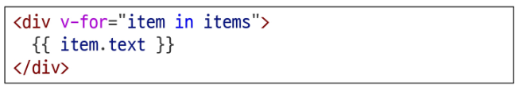

- 객체는 key-value 쌍으로 이뤄져 있어, 값(value), 키(key), 인덱스(index)를 조합하여 순회할 수 있음

  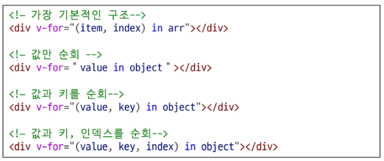

### v-for 예시
- 배열을 반복하는 예시

  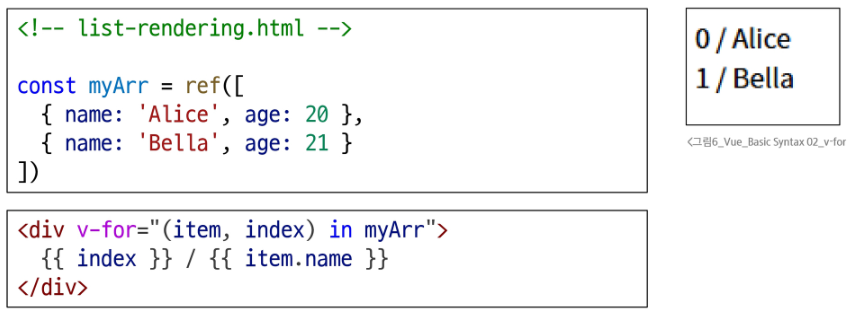

- 객체를 반복하는 예시

  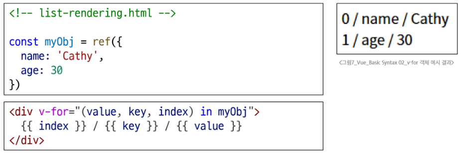

### 여러 요소에 대한 v-for 적용
- HTML template 요소에 v-for를 사용하여 하나 이상의 요소에 대해 반복 렌더링할 수 있음

  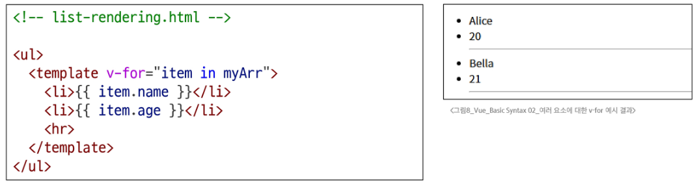

### 중첩된 v-for
- 각 v-for 의 하위 영역(scope)은 상위 영역에 접근할 수 있음

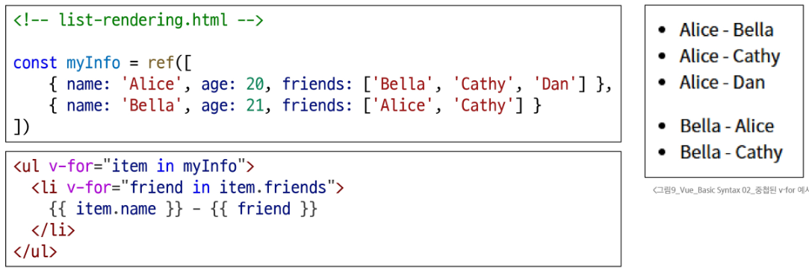

## v-for with key

### v-for와 key
- v-for 구문은 각 요소의 Key를 활용하여 고유한 값으로 식별할 수 있음
- key는 각 항목을 고유하게 식별할 수 있는 문자열이나 숫자여야 함

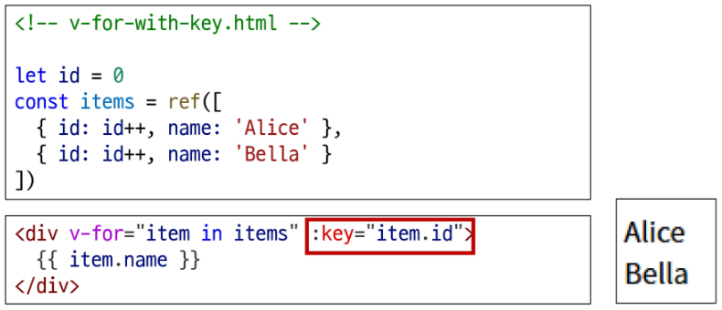

### 내장 특수 속성 'key'의 특징
- 각 항목이 서로 구분되는 고유 식별자 역할
- number 혹은 string으로만 사용해야 함
- Vue의 내부 가상 DOM 알고리즘이 이전 목록과 새 노드 목록을 비교할 때 각 node를 식별하는 용도로 사용
- key를 통해 "이 항목은 이 데이터에 해당한다"는 힌트를 줌으로써 변경 시에도 올바른 항목만 효율적으로 업데이트할 수 있음
> **반드시 v-for와 key를 함께 사용한다**

#### TIP
- 왜 v-for를 사용할 때는 key를 함께 사용해야 하는가?
  - 내부 컴포넌트의 상태를 일관되게 하여 데이터의 예측 가능한 행동을 유지하기 위함
  - key라는 이름표가 있어야 다른 요소와 헷갈리지 않고 정확하고 효율적으로 업데이트할 수 있음

### 올바른 key 선택 기준
- 권장되는 key 값
  - DB의 고유 ID
  - 항목 고유 식별자 (예: UUID)
    - UUID: 중복되지 않는 아주 긴 고유 식별 번호
- 피해야 할 key 값
  - 배열 인덱스(index)
  - 객체 자체

## v-for with v-if

### v-for와 v-if 문제 상황
- todo 데이터 중 이미 완료된(isComplete === true) 항목만 출력하기

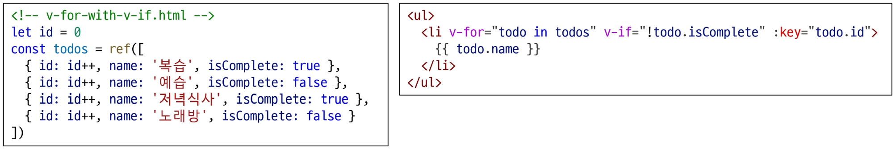

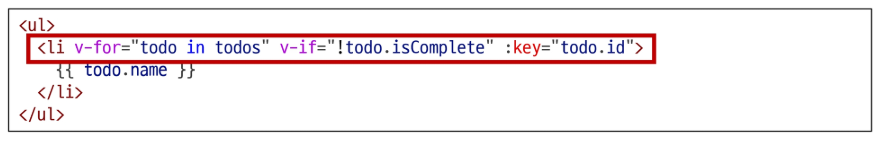

> v-if가 더 높은 우선순위를 가지므로 v-for 범위의 todo 데이터를 v-if에서 사용할 수 없음

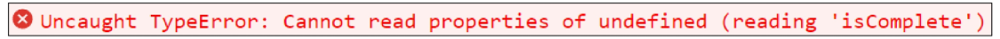

> 동일 요소에 v-for와 v-if를 함께 사용하면 안됨
  
- 동일한 요소에서 v-fi가 v-for보다 우선순위가 더 높기 때문
- v-if에서의 조건은 v-for 범위의 변수에 접근할 수 없음

### v-for와 v-if 해결법 2가지
1. computed 활용
2. v-for와 \<template> 요소 활용

### v-for와 v-if 해결법1: computed 활용
- **computed를 활용해 이미 필터링된 목록을 반환하여 반복**하도록 설정

  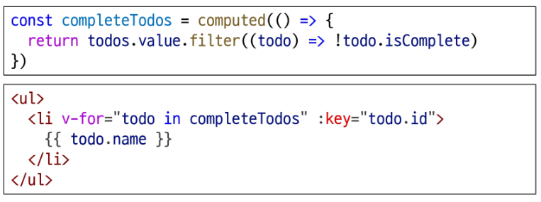

### v-for와 v-if 해결법2: v-for와 \<template> 요소 활용
- v-for와 template 요소를 사용하여 **v-if 위치를 이동**

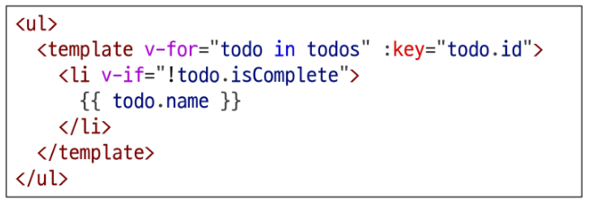

# Watchers

## watch

### watch
- watch(): 하나 이상의 반응형 데이터를 감시하고, 감시하는 데이터가 변경되면 콜백 함수를 호출
  - 데이터(ref)의 변화를 지켜보다가, 값이 바뀔 때마다 지정된 콜백 함수를 실행하는 기능
  - 새로운 값을 계산하는 computed와 달리, watch는 데이터가 바뀔 때 특정 행동(Side Effect)을 수행하기 위해 사용

### watch 구조
1. 첫 번째 인자 (source)
    - watch가 감시하는 대상(반응형 변수, 값을 반환하는 함수 등)

2. 두 번째 인자 (callback function)
    - source가 변경될 때 호출되는 콜백 함수
      1. newValue
          - 감시하는 대상이 변화된 값
      2. oldValue (optional)
          - 감시하는 대상의 기존 값

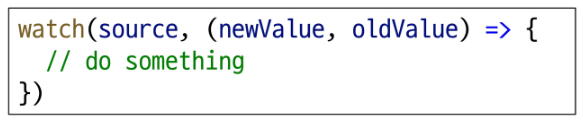

### watch 기본 동작
- count 반응형 데이터가 변경될 때마다, 그 변화를 감지하여 특정 작업을 수행
- 버튼을 누를 때마다 count 값이 바뀌고, watch는 그 변화를 "감시"하고 있다가 즉시 콜백함수를 실행

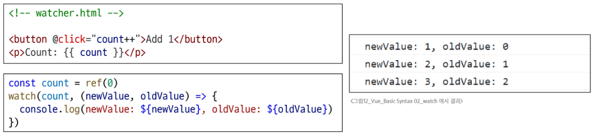

### watch 예시
- 감시하는 변수에 변화가 생겼을 때 연관 데이터 업데이트하기

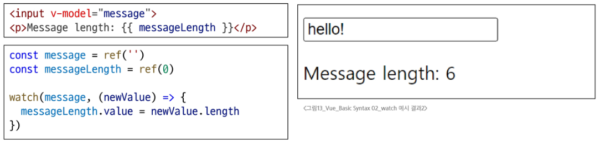

### 여러 source를 감시하는 watch
- 배열을 활용하여 여러 대상을 감시할 수 있음

  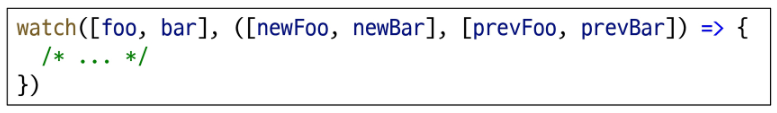

#### TIP
- 여러 소스를 감시할 때, 콜백의 인자(새 값, 이전 값)도 같은 순서의 '배열'로 전달
- 배열 속 ref(객체)의 내부까지 감시하려면 {deep: true} 옵션을 추가로 설정

## computed vs. watch

### computed와 watch

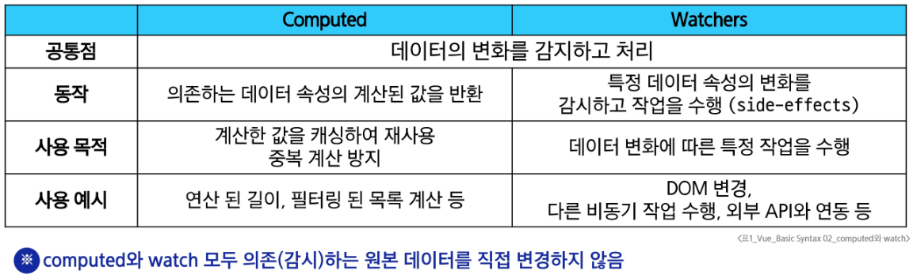

# Lifecycle Hooks

### Lifecycle Hooks
- Vue 컴포넌트가 생성되고, DOM에 마운트되고, 업데이트되고, 소멸되는 각 생애 주기 단계에서 실행되도록 제공되는 함수

### Lifecycle Hooks Diagram
- 컴포넌트의 생애 주기 중간 중간에 함수를 제공
  - 개발자는 컴포넌트의 특정 시점에 원하는 로직을 실행할 수 있음

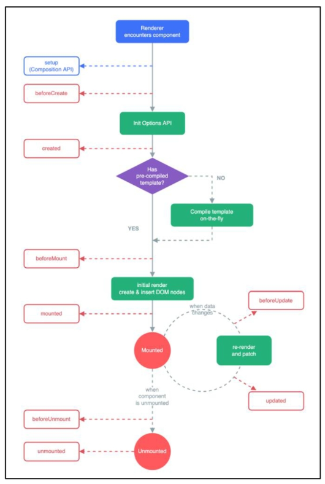

### 주요 Lifecycle Hooks
- 생성 단계 / 마운트 단계 / 업데이트 단계 / 소멸 단계 등 다양한 단계 존재
- 가장 일반적으로 사용되는 것은 **onMounted, onUpdated**, onUnmounted
- https://vuejs.org/api/composition-api-lifecycle.html

  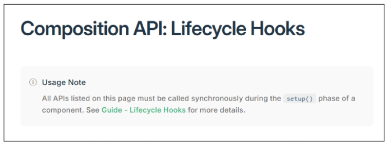

### 주요 Lifecycle Hooks: Mounting
- Vue 컴포넌트 인스턴스가 **초기 렌더링 및 DOM 요소 생성이 완료된 후** 특정 로직을 수행하기

  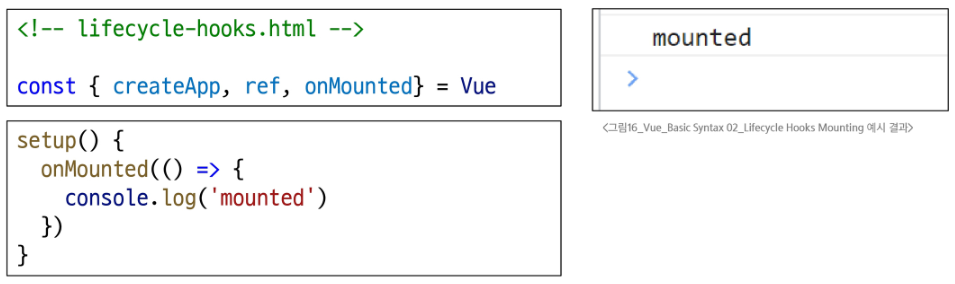

### 주요 Lifecycle Hooks: Updated
- 반응형 데이터의 변경으로 인해 컴포넌트의 **DOM이 업데이트된 후** 특정 로직을 수행하기

  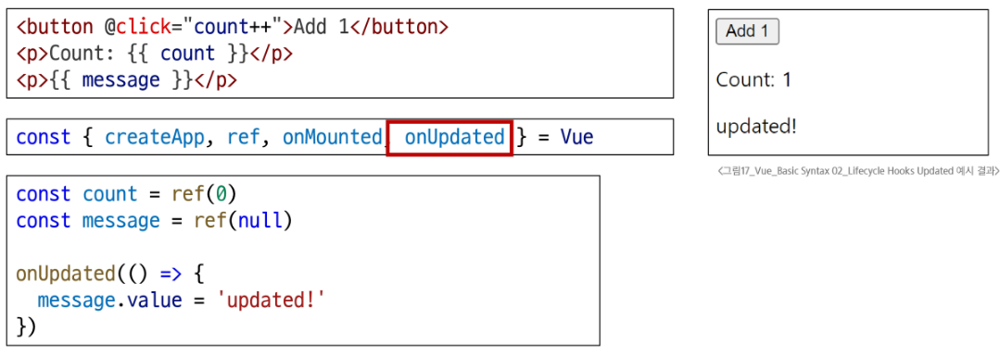

## Lifecycle Hooks 활용

### Lifecycle hooks with Cat API
- Mounting 시점에 Cat api에 요청을 보내고 애플리케이션 시작하기

  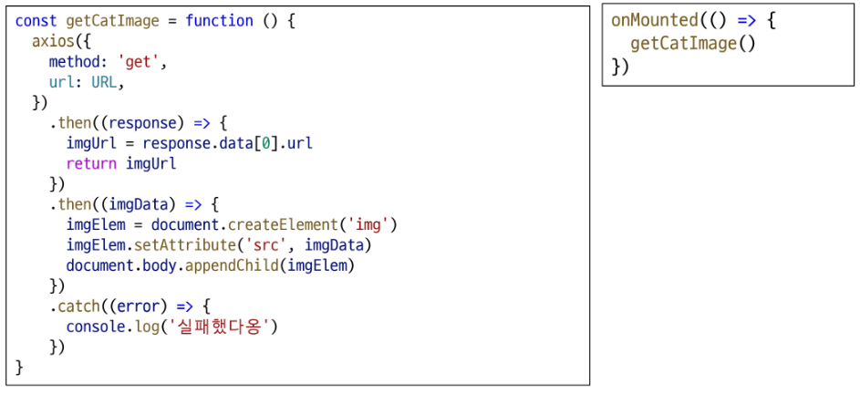

# Vue Style Guide

### Vue Style Guide
- Vue의 스타일 가이드 규칙은 우선순위에 따라 4가지 범주로 나뉨
- 규칙 범주
  - 우선순위 A: 필수 (Essential)
  - 우선순위 B: 적극 권장 (Strongly Recommended)
  - 우선순위 C: 권장 (Recommended)
  - 우선순위 D: 주의 필요 (Use with Caution)
- https://vuejs.org/style-guide/

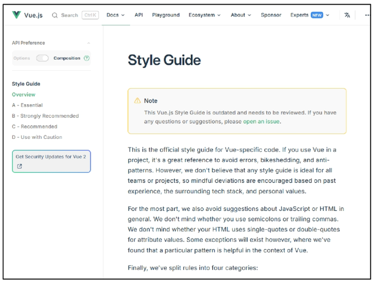

### 우선순위 별 특징
- A: 필수 (Essential)
  - 오류를 방지하는 데 도움이 되므로 어떤 경우에도 규칙을 학습하고 준수
- B: 적극 권장 (Strongly Recommended)
  - 가독성 및 개발자 경험을 향상시킴
  - 규칙을 어겨도 코드는 여전히 실행되겠지만, 정당한 사유가 있어야 규칙을 위반할 수 있음
- C: 권장 (Recommended)
  - 일관성을 보장하도록 임의의 선택을 할 수 있음
- D: 주의 필요 (Use with Caution)
  - 잠재적 위험 특성을 고려함

### 우선순위 A였던 금일 학습 내용
1. v-for에 key 작성하기
2. 동일 요소에 v-if와 v-for 함께 넣지 않기

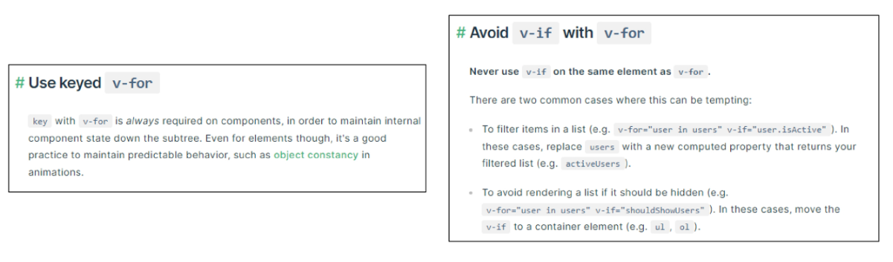

# 참고

## computed 주의사항

### 1. computed의 반환 값은 변경하지 말 것
- computed의 반환 값은 의존하는 데이터의 파생된 값
  - 이미 의존하는 데이터에 의해 계산이 완료된 값
- 일종의 snapshot이며 의존하는 데이터가 변경될 때만 새 snapshot이 생성됨
- 계산된 값은 읽기 전용으로 취급되어야 하며 변경되어서는 안됨
- 대신 새 값을 얻기 위해서는 의존하는 데이터를 업데이트해야 함

#### TIP
- computed 값에 직접 값을 할당하면, 기본적으로 경고가 발생하며 값이 변경되지 않음

### 2. computed 사용 시 원본 배열 변경하지 말 것
- computed에서 reverse()나 sort()처럼 원본 배열을 변경하는 메서드를 사용할 때는, 반드시 원본 배열의 복사본을 만들어 처리해야 함
- 옳지 않은 예

```js
return numbers.reverse()
```

- 옳은 예

```js
return [...numbers].reverse()
```

## Lifecycle Hooks 주의사항

### Lifecycle Hooks 주의사항
- Lifecycle Hooks는 반드시 **동기적**으로 작성해야 함
- Vue는 컴포넌트가 초기화될 때 모든 Hooks를 한 번에 스캔하고 준비하기 때문
- 만약 비동기로(예: setTimeout) 훅을 등록하려고 하면, 이미 라이프사이클 단계가 지나간 후에 hooks를 설정하는 상황이 발생

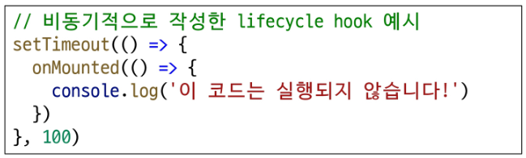

- 비동기로 작성할 경우 Vue는 해당 훅을 인식하지 못하며, 원래 의도한 타이밍에 실행되지 않게 됨
- Lifecycle Hooks는 컴포넌트 로딩 과정에서 동기적으로 정의함으로써, Vue가 올바른 타이밍에 해당 로직을 수행할 수 있도록 보장해야 함

## v-for와 배열을 활용한 "필터링/정렬"

###  v-for와 배열을 활용한 "필터링/정렬" 활용
- 원본 데이터를 수정하거나 교체하지 않고 필터링하거나 정렬된 새로운 데이터를 표시하는 방법
1. computed 활용
    - 원본 기반으로 필터링 된 새로운 결과를 생성

      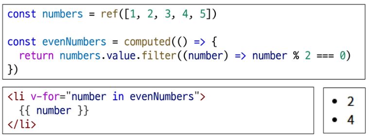

2. method 활용
    - computed가 불가능한 중첩된 v-for인 경우 / 매개변수가 필요한 경우

      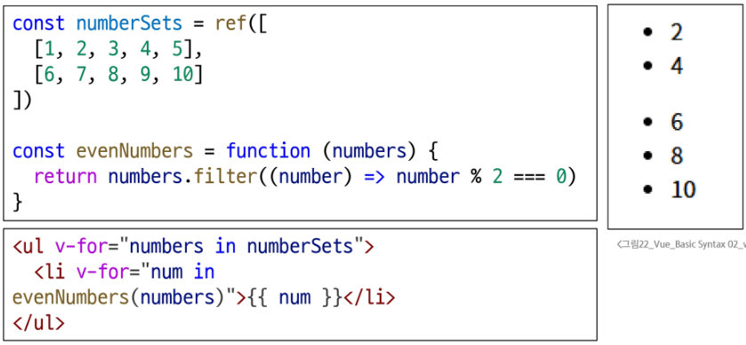

## 배열 변경 관련 메서드

### 배열 변경 관련 메서드
- v-for와 배열을 함께 사용 시 배열의 메서드를 주의해서 사용해야 함
1. 변화 메서드
    - 호출하는 원본 배열을 변경
    - push(), pop(), shift(), unshift(), splice(), sort(), reverse()
2. 배열 교체
    - 원본 배열을 수정하지 않고 항상 새 배열을 반환
    - filter(), concat(), slice()

## Todo 애플리케이션 구현
- v-model, v-on, v-bind, v-for를 활용

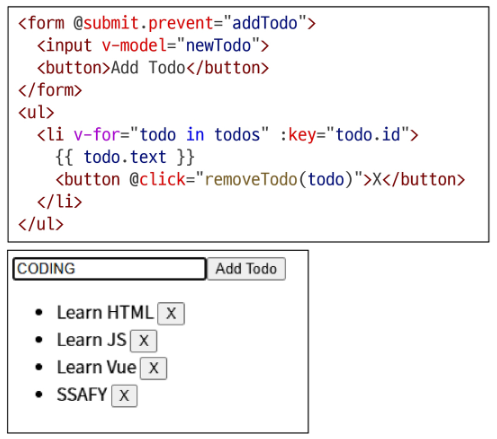

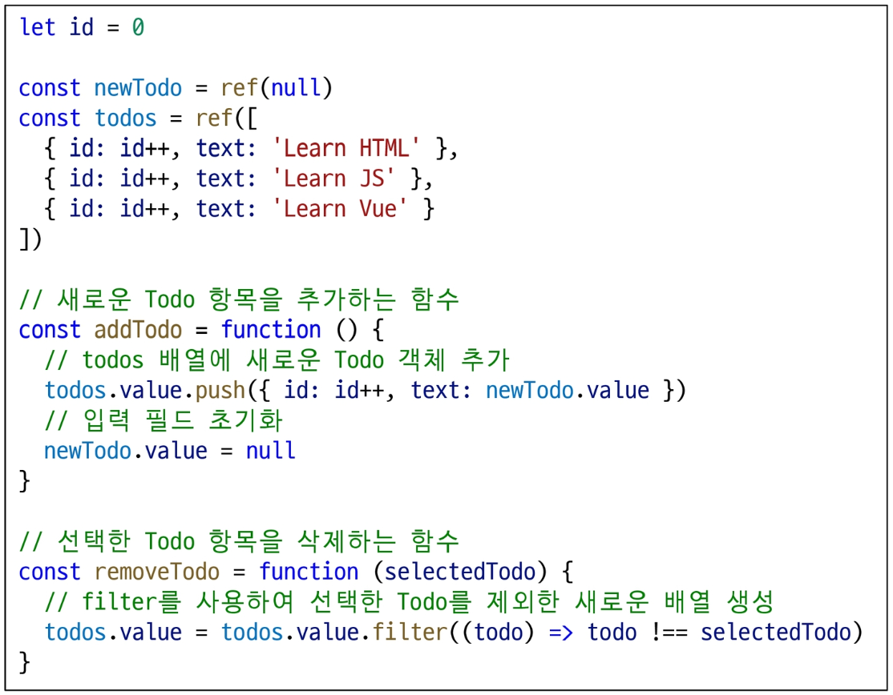

### 실습
- Computed
  - 2810\. 전시 정보 페이지 만들기
    - 조건부 데이터 입력
- v-for
  - 3098\. Todo 애플리케이션 만들기
    - Todo 생성 및 삭제
  - 3099\. Todo 애플리케이션 만들기
    - Todo 목록 필터링
- v-if
  - 2811\. 전시 정보 페이지 만들기
    - 스타일 부여
  - 2812\. 전시 정보 페이지 만들기
    - 다양한 상황의 조건
- Watchers
  - 2813\. 전시 정보 페이지 만들기 - watch 활용하기