# Passing Props

## Props

### 동일한 데이터, 하지만 다른 컴포넌트
- 동일한 사진 데이터가 한 화면에 다양한 위치에서 여러 번 출력되고 있음
- 하지만 해당 페이지를 구성하는 컴포넌트가 여러 개라면 각 컴포넌트가 개별적으로 동일한 데이터를 관리해야 할까?
- 그렇다면 사진을 변경해야 할 때 모든 컴포넌트에 대해 변경 요청을 해야 함
> "**공통된 부모 컴포넌트에서 관리하자"

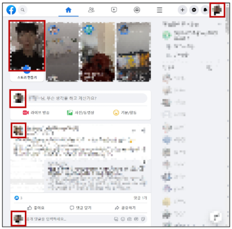

- 부모는 자식에게 데이터를 전달 (Pass **Props**)
- 자식은 자신에게 일어난 일을 부모에게 알림 (Emit event)

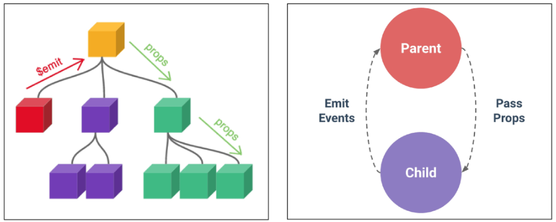

### Props
- Props: 부모 컴포넌트로부터 자식 컴포넌트로 데이터를 전달하는데 사용되는 사용자 지정 특성
  - **부모** 컴포넌트가 **자식** 컴포넌트에게 데이터를 전달할 때 사용하는 특별한 속성
  - 데이터는 부모에서 자식으로 한 방향으로만 흐르며, 자식 컴포넌트는 전달받은 props를 직접 수정해선 안 됨(읽기 전용)
  - 이 방식을 통해 가능한 컴포넌트를 만들고, 부모가 어떤 데이터를 전달하느냐에 따라 자식의 내용과 모습을 다르게 설정할 수 있음

### Props 특징
- 부모의 데이터가 업데이트되면 자식에게 전달되지만, **그 반대는 불가능**
- 즉, 자식 컴포넌트 내부에서 props를 변경하려고 시도해서는 안 되며 불가능
- 또한 부모 컴포넌트가 업데이트될 때마다 이를 사용하는 자식 컴포넌트의 모든 props가 최신 값으로 업데이트됨
> 부모 컴포넌트에서만 변경하고 이를 내려받는 자식 컴포넌트는 자연스레 갱신

#### TIP
- 자식이 부모 속성을 바꾸려면, props를 수정하지 말고 이후 배율 emit을 이용해서 부모에게 알려야 함
- 객체/배열 props는 자식에서 내부 값을 바꾸면 부모의 원본도 바뀌니 매우 주의

### One-Way Data Flow
- 모든 props는 자식 속성과 부모 속성 사이에 **하향식 단방향 바인딩**을 형성 (one-way-down binding)
- 단방향인 이유
  - 하위 컴포넌트가 실수로 상위 컴포넌트의 상태를 변경하여 앱에서의 데이터 흐름을 이해하기 어렵게 만드는 것을 방지하기 위함 (무한 루프, 디버깅 난이도 상승 등)
  - 데이터 흐름의 "**일관성**" 및 "**예측 가능성**"을 높이는 것이 목표

## Props 선언

### 사전 준비
1. vue 프로젝트 생성
2. 초기 생성된 컴포넌트 모두 삭제 (App.vue 제외)
3. src/assets 내부 파일 모두 삭제
4. main.js 해당 코드 삭제

    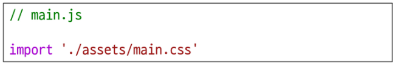

5. App > Parent > ParentChild 컴포넌트 관계 작성

- **App** > Parent > ParentChild 컴포넌트 관계 작성
  - App 컴포넌트 작성

    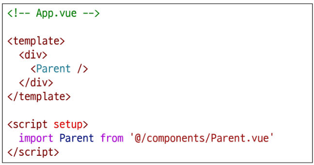

- App > **Parent** > ParentChild 컴포넌트 관계 작성
  - Parent 컴포넌트 작성

    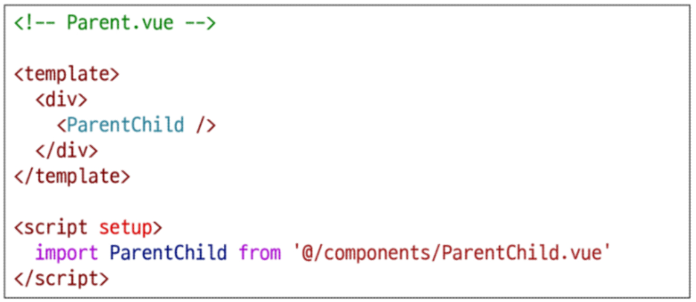

- App > Parent > **ParentChild** 컴포넌트 관계 작성
  - ParentChild 컴포넌트 작성

    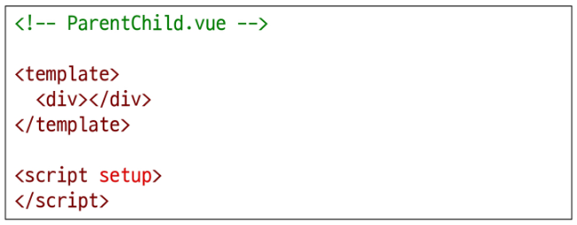

### Props 작성
- 부모 컴포넌트 Parent에서 자식 컴포넌트 ParentChild에 보낼 props 작성

  

### Props 선언
- 부모 컴포넌트에서 내려보낸 props를 사용하기 위해서는 자식 컴포넌트
- defineProps() 를 사용하여 props를 선언

  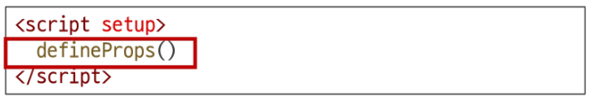

- defineProps() 에 전달하는 인자의 형태에 따라 선언 방식이 나뉨
  1. "문자열 배열"을 사용한 선언
  2. "객체"를 사용한 선언

### 1. 문자열 배열을 사용한 선언
- 배열의 문자열 요소로 props 선언
- 문자열 요소의 이름은 전달된 props의 이름

  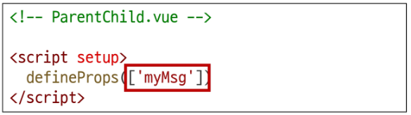

### 2. 객체를 사용한 선언
- 각 객체 속성의 키가 전달받은 props 이름이 됨
- 객체 속성의 값은 해당 데이터의 타입에 맞는 생성자 함수(String, Number 등)여야 함

  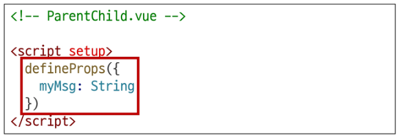

#### TIP
- 가급적 "객체를 사용한 선언"을 사용하는 것을 권장
  - 각 props에 대해 상세한 규칙(유효성 검사)를 설정하여 컴포넌트의 안정성을 높여줌
  - 객체 구문은 그 자체로 컴포넌트의 설명서 역할을 하므로, 코드를 통해 명확하게 의사소통이 가능

### props 데이터 사용
- props 선언 후 **템플릿**에서 반응형 변수와 같은 방식이나 **JS**에서 props를 객체로 접근 가능

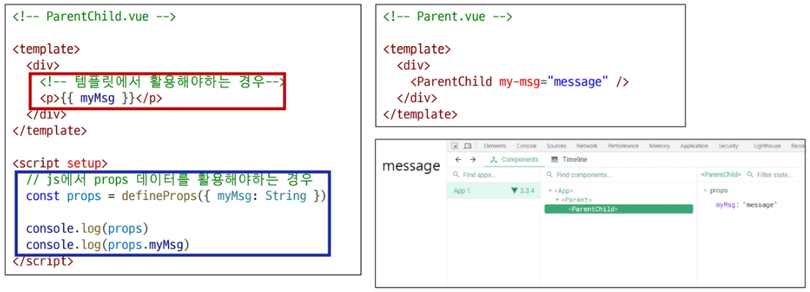

### 한 단계 더 props 내려 보내기
- ParentChild 컴포넌트를 부모로 갖는 ParentGrandChild 컴포넌트 생성

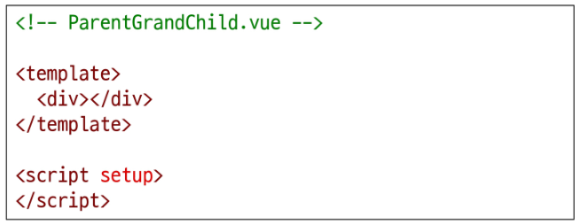

- ParentGrandChild 컴포넌트를 ParentChild 컴포넌트에 등록

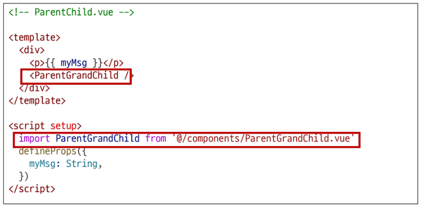

- ParentChild 컴포넌트에서 **Parent로부터 받은 props인 myMsg**를 **ParentGrandChild에게 전달**

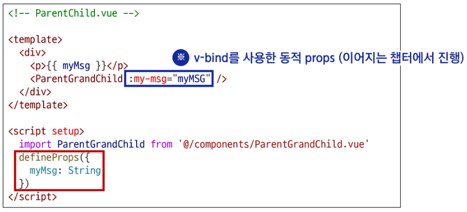

- ParentChild 컴포넌트에서 ParentGrandChild 로 전달한 **my-msg**를 props 선언 후 접근

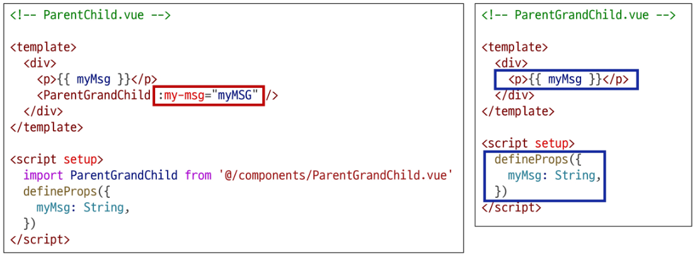

- 출력 결과 확인
  - ParentGrandChild가 받아서 출력하는 props은 Parent에 정의되어 있는 props이며, Parent가 props를 변경할 경우 이를 전달받고 있는 ParentChild, ParentGrandChild에서도 모두 업데이트 됨

  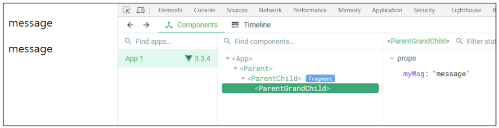

## Props 세부사항

### Props 세부사항
1. Props Name Casing (Props 이름 컨벤션)
2. Static Props 와 Dynamic Props

### 1. Props Name Casing
- 부모 템플릿에서 전달 시 (HTML 속성) -> kebab-case (my-msg)

  

- 자식 스크립트에서 선언 시 (JS) -> camelCase (myMsg)

  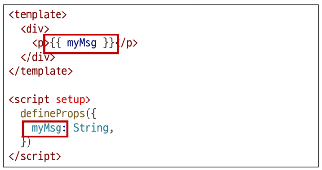

### 2. Static props & Dynamic props
- 지금까지 작성한 것은 Static(정적) props
- v-bind를 사용하여 **동적으로 할당된 props**를 사용할 수 있음

#### TIP
- 동적 할당
  - 고정된 값을 전달하는 것이 아닌, 바뀌는 데이터를 연결하는 것
  - 이는 곧 부모의 데이터와 자식의 속성을 실시간으로 연결하는 것을 의미

### Static props & Dynamic props
- **Parent 컴포넌트에 Dynamic props 정의**하고, **ParentChild 컴포넌트에 선언 및 출력**

  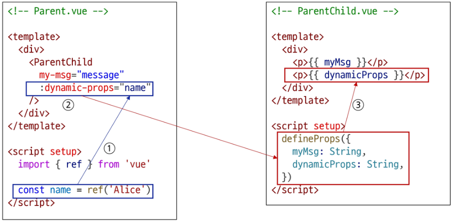

- Dynamic props 출력 확인

  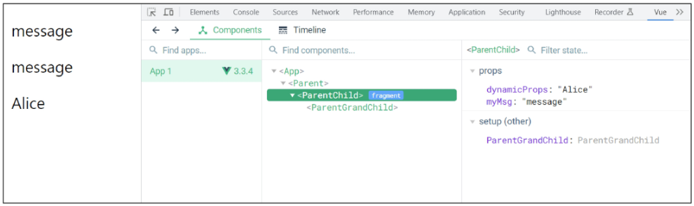

## Props 활용

### v-for와 함께 사용하여 반복되는 요소를 props로 전달하기
- ParentItem 컴포넌트 생성 및 Parent의 하위 컴포넌트로 등록

  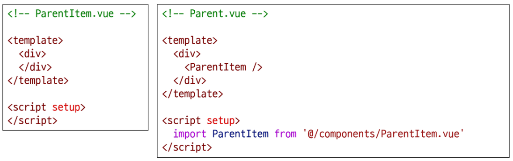

- 데이터 정의 및 v-for 디렉티브의 반복 요소로 활용
- 각 반복 요소를 props로 내려보내기

  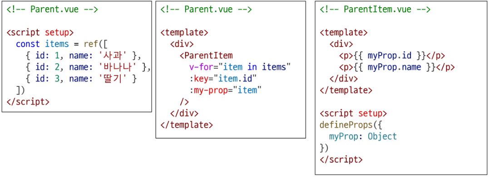

- props 선언 및 출력 결과 확인

  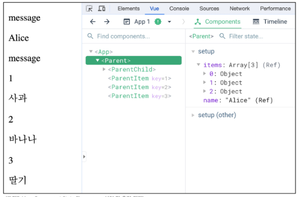

# Component Events

## Emit

### 동일한 데이터, 하지만 다른 컴포넌트
- 부모는 자식에게 데이터를 전달 (Pass Props)
- 자식은 자신에게 일어난 일을 부모에게 알림 (**Emit** event)

  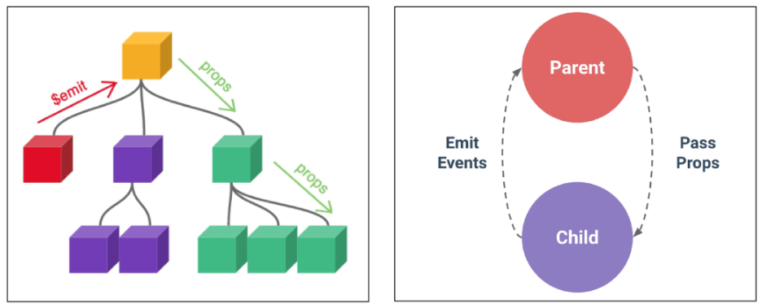

### Emit
- $emit(): 자식 컴포넌트가 이벤트를 발생시켜 부모 컴포넌트로 데이터를 전달하는 메서드
  - 자식 컴포넌트가 부모 컴포넌트에게 특정 이벤트가 발생했음을 알리고 데이터를 전달하는 기능
  - '내려가는' 데이터 흐름인 Props와 반대로 '**올라가는**' 이벤트르 만들어, 컴포넌트 간의 완전한 상호작용을 가능하게 함

### emit 메서드

- 자식 컴포넌트가 이벤트를 발생시켜 부모 컴포넌트에게 신호를 보내고 데이터를 전달하는 기능
- event
  - 커스텀 이벤트 이름
- args
  - 추가 인자

#### TIPS
- '$' 표기
  - Vue 인스턴스의 내부 변수들을 가리킴
  - Lifecycle Hooks, 인스턴스 메서드 등 내부 특정 속성에 접근할 때 사용

## 이벤트 발신 및 수신

### 이벤트 발신 및 수신 (Emitting and Listening to Events)
1. $emit을 사용하여 템플릿 표현식에서 직접 사용자 정의 이벤트를 발신

    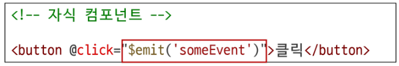

2. 부모 컴포넌트에서는 v-on (또는 @)을 사용하여 이벤트를 수신할 수 있음

    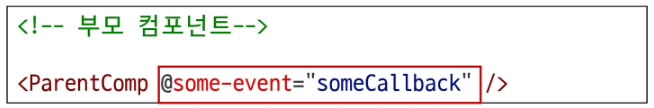

### 이벤트 발신 및 수신하기
- ParentChild에서 someEvent라는 이름의 사용자 정의 이벤트를 발신

  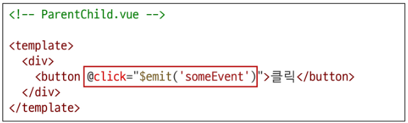

- ParentChild의 부모 Parent는 v-on을 사용하여 발신된 **이벤트를 수신**
- 수신 후 처리할 **콜백함수** 호출

  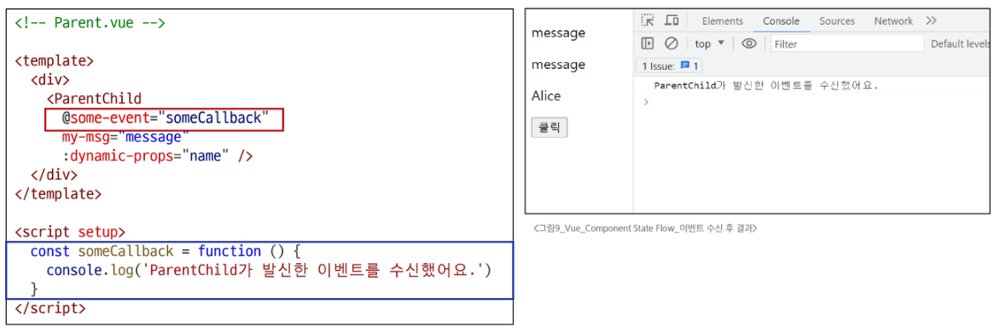

## emit 이벤트 선언

### emit 이벤트 선언
- defineEmits()를 사용하여 발신할 이벤트를 선언
- props와 마찬가지로 defineEmits()에 작성하는 인자의 데이터 타입에 따라 선언 방식이 나뉨
  - 배열
  - 객체 (가급적 객체를 활용한 선언을 추천)
- defineEmits()는 \<script setup> 내에서 이벤트를 발신하기 위한 **emit 함수를 반환** 
(템플릿의 $emit과 달리 \<script setup>에서는 직접 접근할 수 없기 때문)

### emit 이벤트 선언 활용
- 이벤트 선언 방식으로 추가 버튼 작성 및 결과 확인

  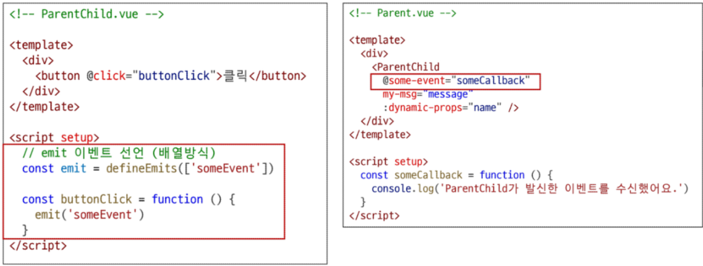

## 이벤트 전달

### 이벤트 인자 (Event Arguments)
1. ParentChild에서 이벤트를 발신하여 Parent로 추가 인자 전달하기

    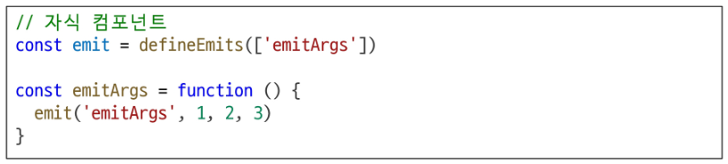

2. ParentChild에서 발신한 이벤트를 Parent에서 수신

    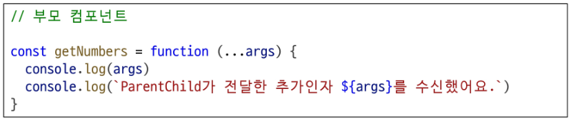

### 이벤트 인자 전달 활용
1. ParentChild에서 이벤트를 발신하여 Parent로 추가 인자 전달하기

    

2. ParentChild에서 이벤트를 발신하여 Parent로 추가 인자 전달하기

    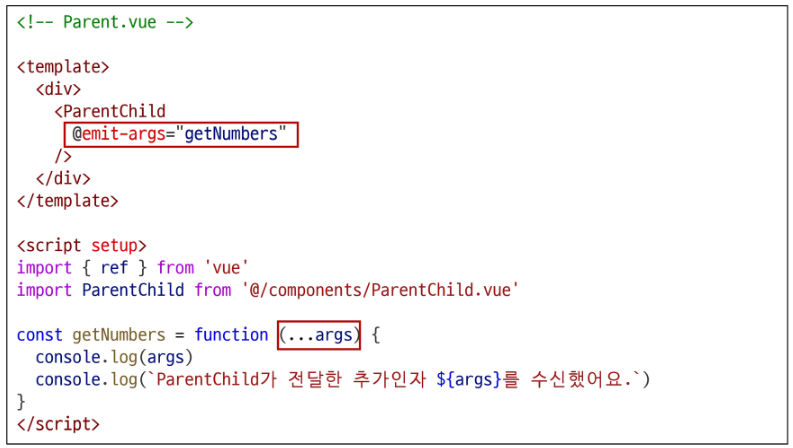

3. 결과 확인

    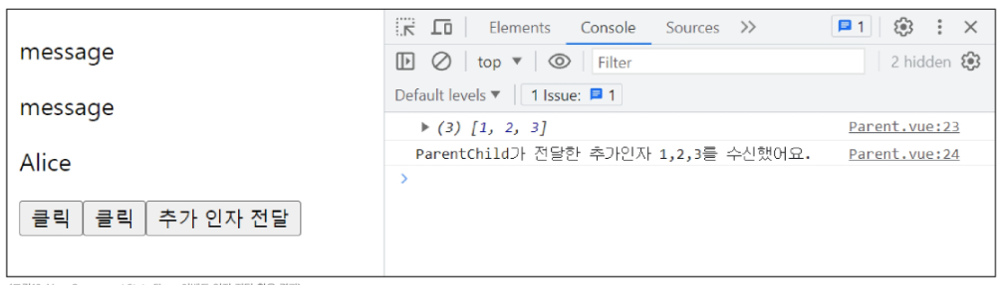

## 이벤트 세부사항

### Event Name Casing
- 선언 및 발신 시 (-> camelCase)

  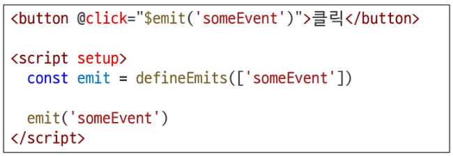

- 부모 컴포넌트에서 수신 시 (-> kebab-case)

  

## emit 이벤트 활용

### emit 이벤트 실습
- 목표: 최하단 컴포넌트 ParentGrandChild에서 Parent 컴포넌트의 name 변수 변경 요청하기
1. ParentGrandChild에서 이름 변경을 요청하는 이벤트 발신

    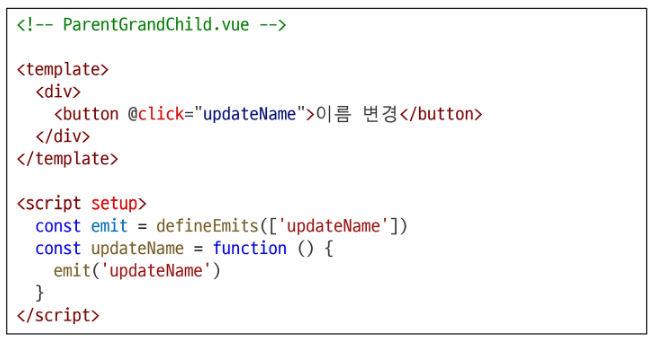

    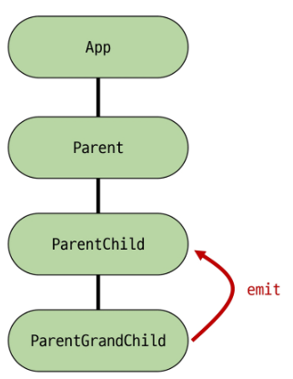

2. 이벤트 수신 후 이름 변경을 요청하는 이벤트 발신

    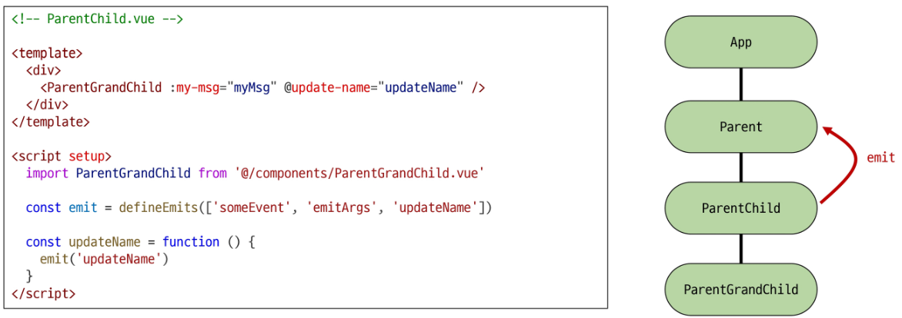

3. 이벤트 수신 후 이름 변수 변경 메서드 호출(해당 변수를 props로 받는 모든 곳에서 자동 업데이트)

    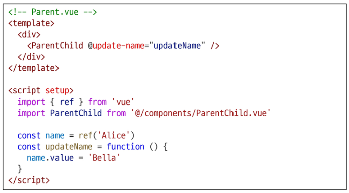

4. 버튼 클릭 후 결과 확인

    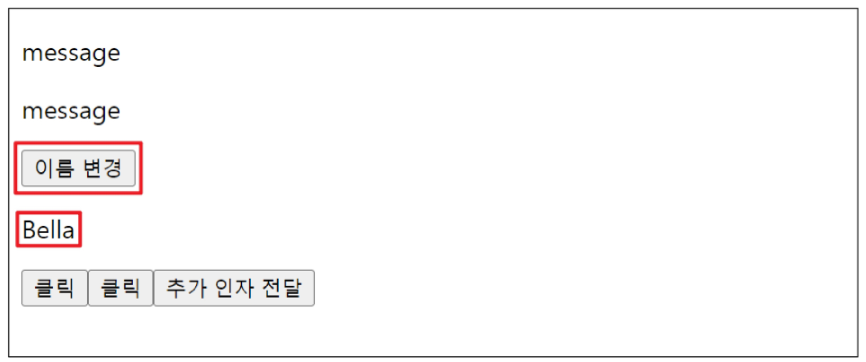

# 참고

## 정적 & 동적 props 주의사항

### 정적 & 동적 props 주의사항
- 첫 번째는 정적 props로 문자열 "1"을 전달
- 두 번째는 동적 props로 숫자 1을 전달

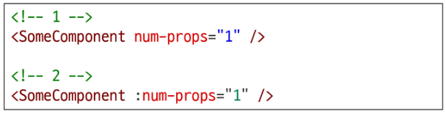

## Props & Emit 객체 선언 문법

### Props 선언 시 "객체 선언 문법"을 권장하는 이유
- 컴포넌트의 의도를 명확히 하여 가독성을 높이고, 다른 개발자가 잘못된 타입의 데이터를 전달했을 때 콘솔에 경고를 출력하여 실수를 방지
- 추가로 props에 대한 유효성 검사로써 활용 가능

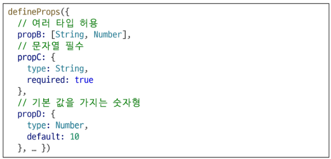

### emit 이벤트도 "객체 선언 문법"으로 작성 가능
- emit 이벤트 또한 객체 구문으로 선언된 경우 유효성을 검사할 수 있음

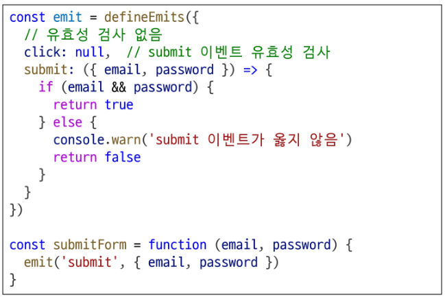

### 실습
- Props
  - 3103\. 쇼핑 애플리케이션 만들기 - 상품 목록 출력 1
  - 3104\. 쇼핑 애플리케이션 만들기 - 상품 목록 출력 2
  - 2754\. 컴포넌트간 데이터 전송하기 1
  - 2758\. 명함 관리 서비스 만들기 - 명함 삭제 기능
- Emit
  - 3105\. 쇼핑 애플리케이션 만들기 - 장바구니 추가 및 삭제
  - 2755\. 컴포넌트간 데이터 전송하기 2
  - 2760\. 명함 관리 서비스 만들기 - 명함 생성 컴포넌트